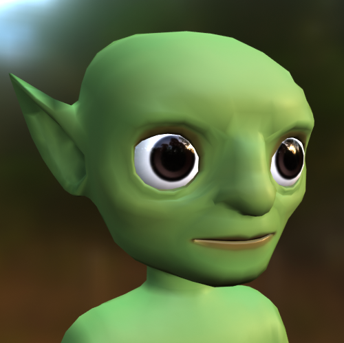
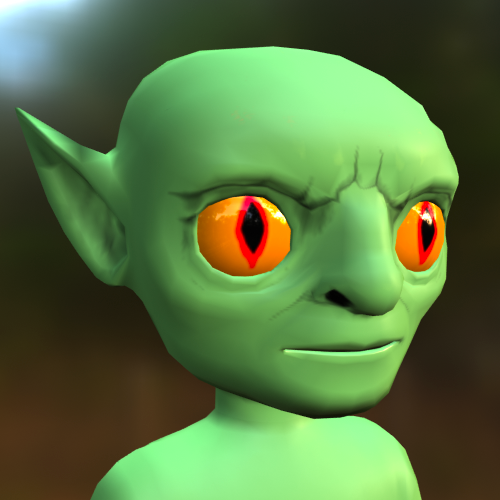
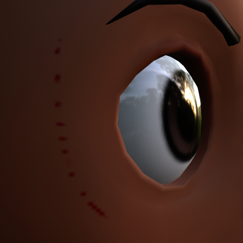
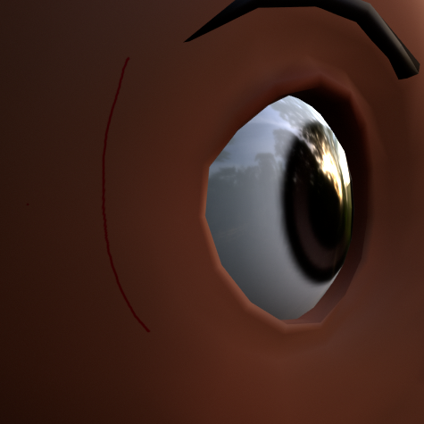

# Texturing Setup

## 목차
- [Texturing Setup](#texturing-setup)
  - [목차](#목차)
  - [텍스처 해상도 설정](#텍스처-해상도-설정)
  - [출처](#출처)
  - [다음](#다음)

---

**텍스처링**은 모델 표면의 색상, 톤 및 음영을 사용자 정의하는 과정입니다. 커스텀 메쉬와 모델은 텍스처 맵으로 알려진 2D 이미지를 사용하여 3D 객체에 다양한 표면 외관 요소를 투영합니다.

<!-- <GridContainer numColumns="2">
  <figure>  <figcaption>커스텀 조각 후의 모델</figcaption></figure>

  <figure><figcaption>텍스처링 후의 모델</figcaption></figure>
</GridContainer> -->

|커스텀 조각 후의 모델|텍스처링 후의 모델|
|---|---|
|||

각 템플릿에는 색상 텍스처 맵이 포함되어 있으며, 이를 Blender의 텍스처 편집 도구를 사용하여 변경하고 수정할 수 있습니다. 대부분의 Roblox 아바타는 커스텀 피부 톤을 사용할 수 있으므로 Blender에서 [커스텀 피부 톤 미리보기](https://create.roblox.com/docs/art/characters/creating#previewing-skin-tones)를 통해 최종 자산이 Roblox 경험에서 어떻게 보일지 확인하는 것이 중요합니다.

기본 텍스처링 과정을 설명하기 위해 이 튜토리얼에서는 기본 텍스처 페인팅 설정을 다루고, 캐릭터의 눈 부분에 완전히 불투명한 텍스처를 적용하고 얼굴에 부분적으로 불투명한 세부 사항을 추가합니다. 이러한 기술을 캐릭터 지오메트리의 다른 부분에도 적용할 수 있습니다.

캐릭터 모델의 신체 일부를 텍스처링할 때 캐릭터 모델이 민감한 부위에 겸손한 레이어를 포함하고 있는지 확인하십시오. 자세한 내용은 [커뮤니티 기준](https://create.roblox.com/docs/art/marketplace/marketplace-policy)을 참조하십시오.

## 텍스처 해상도 설정

Roblox Studio는 알베도 텍스처 맵에 대해 **1024 x 1024** 해상도를 지원합니다. Blender나 Maya와 같은 애플리케이션을 사용하여 모델에 직접 텍스처 페인팅을 할 때, 매우 세밀한 디테일은 해상도와 페인팅의 세부 수준 때문에 예상대로 페인팅되지 않을 수 있습니다.

<!-- <GridContainer numColumns="2">
  <figure>  <figcaption>1024 x 1024 해상도의 텍스처 페인팅</figcaption></figure>

  <figure><figcaption>2048 x 2048 해상도의 텍스처 페인팅</figcaption></figure>
</GridContainer> -->

|1024 x 1024 해상도의 텍스처 페인팅|2048 x 2048 해상도의 텍스처 페인팅|
|---|---|
|||

텍스처에 세밀한 디테일을 추가할 때 텍스처 맵의 이미지 해상도를 일시적으로 **2048 x 2048** 또는 **4096 x 4096**로 증가시킵니다. 텍스처링을 완료한 후 이미지 해상도를 **1024 x 1024**로 다시 변경하여 변경 사항을 반영합니다.

텍스처 이미지 해상도를 변경하려면:

1. 레이아웃 모드에서 **Head_Geo**를 선택합니다.
2. **Texture Paint** 모드로 전환합니다.
3. 왼쪽 페인트 창에서 **Image** > **Resize**를 선택합니다.
4. 텍스처 크기를 설정합니다:
   1. 세부 텍스처 작업을 위한 더 높은 해상도로 **2048** 또는 **4096**을 사용합니다.
   2. 기본 Roblox 지원 해상도로 **1024**를 사용합니다.
      <!-- <video controls src="../img/05_07_Texturing_Setup/Texturing_09.mp4" width="100%"></video> -->
      

---
## 출처
 - [Texturing Setup](https://create.roblox.com/docs/art/characters/creating/texturing-setup)

---
## [다음](./05_08_Texturing_Eyes.md)