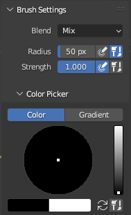
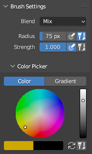
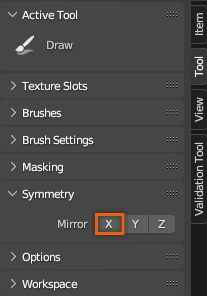
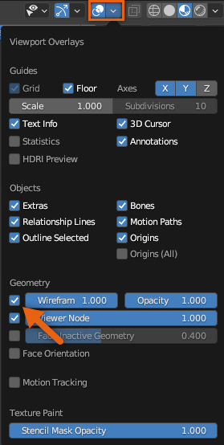
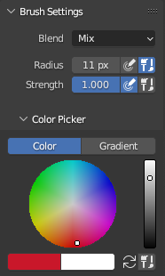
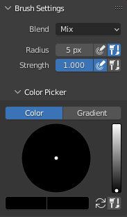

# Texturing Eyes

## 목차
- [Texturing Eyes](#texturing-eyes)
  - [목차](#목차)
  - [출처](#출처)
  - [다음](#다음)

---

캐릭터의 비인간적인 시각적 효과를 위해 눈에 완전히 불투명한 텍스처를 적용할 수 있습니다. 눈 텍스처를 편집하기 전에 두 눈 객체를 결합하여 동시에 텍스처링합니다. 그런 다음 외부 눈에서 시작하여 내부 눈으로 이동한 후 동공을 텍스처 페인팅합니다.

눈 메쉬 객체에 텍스처를 적용하려면 다음 단계를 따르십시오:

1. 텍스처 이미지 해상도를 높입니다.
2. Outliner에서 **Head_Geo**, **LowerTeeth_Geo**, **Tongue_Geo**, **UpperTeeth_Geo**의 **Hide in Viewport** 옵션을 토글합니다. 눈 메쉬 객체는 보이게 둡니다.
    <!-- <video controls src="../img/05_08_Texturing_Eyes/Texturing_01.mp4" width="100%"></video> -->
    
3. Object 모드에서 <kbd>Shift</kbd>를 누르고 **LeftEye_Geo**와 **RightEye_Geo**를 클릭합니다. 그런 다음 오른쪽 클릭하고 **Join** (<kbd>Ctrl</kbd><kbd>J</kbd>; <kbd>⌘</kbd><kbd>J</kbd>)을 선택하여 객체를 결합합니다. 두 객체는 마지막으로 선택된 객체의 이름을 사용하여 병합됩니다.
    <!-- <video controls src="../img/05_08_Texturing_Eyes/Texturing_02.mp4" width="100%"></video> -->
    
4. **Texture Paint** 모드로 전환합니다.
5. Draw 도구가 활성화된 상태에서 외부 눈 그림자에 대한 브러시 설정을 다음과 같이 설정합니다:

    1. 브러시 설정에서 **Radius**를 **50px**로, **Strength**를 **1.0**으로 설정합니다.
    2. Color Picker에서 **검정색**을 선택합니다.

       

6. Texture Paint **3D 보기 창**에서 눈 객체를 완전히 검정색으로 페인팅합니다. 이는 외부 눈 그림자의 기초가 됩니다.
    <!-- <video controls src="../img/05_08_Texturing_Eyes/Texturing_03.mp4" width="100%"></video> -->
    
7. Draw 도구가 활성화된 상태에서 외부 눈 그림자에 대한 브러시 설정을 다음과 같이 설정합니다:

    1. 브러시 설정에서 **Radius**를 **75px**로, **Strength**를 **1.0**으로 설정합니다.
    2. Color Picker에서 **깊은 노란색**을 선택합니다.

       

8. Texture Paint **2D 보기 창**에서 커서를 눈 텍스처에 해당하는 UV 맵의 중심에 맞춥니다. 각 눈의 중심에 4-6번 클릭하여 기본 그림자 위에 외부 눈 색상을 만듭니다.
    <!-- <video controls src="../img/05_08_Texturing_Eyes/Texturing_04.mp4" width="100%"></video> -->
    

9. 가시성을 위해 Head_Geo 가시성을 활성화하고 카메라를 정면 보기로 재배치합니다.
10. 다음 제안을 사용하여 내부 눈 색상을 페인팅합니다:

    1. **X Symmetry** 버튼을 클릭하여 대칭을 활성화합니다. 비대칭 자산을 만드는 경우 이를 비활성화합니다.

        

    2. Overlay 보기 옵션에서 **Wireframe 지오메트리 보기**를 활성화합니다. 시각 요소를 확인할 때 이 오버레이를 비활성화할 수 있습니다.
        <!-- <video controls src="../img/05_08_Texturing_Eyes/Texturing_05.mp4" width="100%"></video> -->
        

        

    3. 내부 눈에 대한 브러시 설정을 업데이트합니다:

        1. 브러시 설정에서 **Radius**를 **5px**로 설정합니다. 페인팅 중 <kbd>F</kbd>를 눌러 이 반경을 빠르게 변경할 수 있습니다.
        2. Color Picker에서 강한 **빨간색** 음영을 선택합니다.

           

        <!-- <video controls src="../img/05_08_Texturing_Eyes/Texturing_06.mp4" width="100%"></video> -->
        

    4. 주기적으로 머리 메쉬를 보이게 하여 눈 텍스처가 모델의 나머지 부분과 잘 어울리는지 확인합니다.

11. 동공에 대한 브러시 설정을 업데이트합니다:

    1. 브러시 설정에서 Radius를 **5px**로 설정합니다. 페인팅 중 <kbd>F</kbd>를 눌러 이 반경을 빠르게 변경할 수 있습니다.
    2. Color Picker에서 밝은 **빨간색** 음영을 선택합니다.

       

12. Brush 도구를 사용하여 모델의 동공을 페인팅합니다.
    <!-- <video controls src="../img/05_08_Texturing_Eyes/Texturing_07.mp4" width="100%"></video> -->
    
13. 텍스처 페인팅을 완료한 후 **Edit Mode**로 전환합니다.
14. 두 눈 객체를 Shift 클릭하고 <kbd>P</kbd>를 눌러 **By Loose Parts**를 선택하여 두 메쉬를 분리합니다.
15. 남은 메쉬의 이름을 원래 **RightEye_Geo** 또는 **LeftEye_Geo** 이름으로 바꿉니다.
    <!-- <video controls src="../img/05_08_Texturing_Eyes/Texturing_08.mp4" width="100%"></video> -->
    

---
## 출처
 - [Texturing Eyes](https://create.roblox.com/docs/art/characters/creating/texturing-eyes)

---
## [다음](./05_09_Texturing_Face.md)