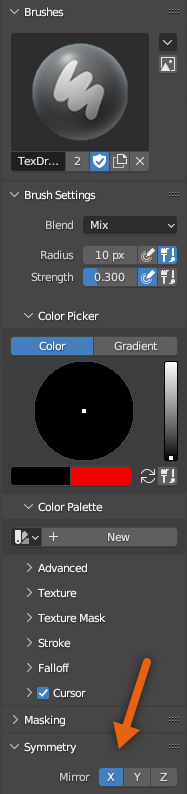
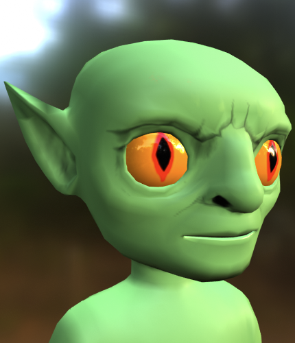
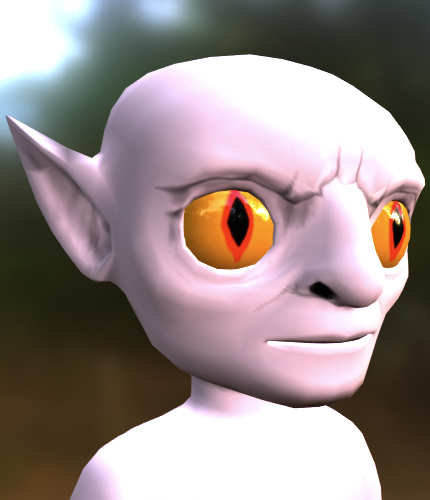
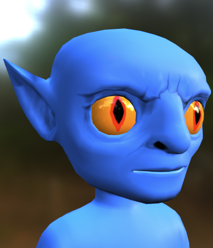

# Texturing Face

## 목차
- [Texturing Face](#texturing-face)
  - [목차](#목차)
  - [출처](#출처)
  - [다음](#다음)

---

눈의 텍스처링을 마친 후 얼굴의 텍스처링을 시작할 수 있습니다. 개념은 눈의 텍스처링과 유사하지만, 사용자 지정 피부 톤이 보일 수 있도록 불투명한 텍스처만 사용합니다.

얼굴에 텍스처를 적용하려면:

1. Texture Paint 탭에서 텍스처 해상도를 **2048** 또는 **4098**로 조정합니다:
   1. 왼쪽 Paint 창에서 **Image** > **Resize**를 선택합니다.
   2. 텍스처 크기를 **2048 x 2048**로 설정합니다.
2. 도구 사이드바에서 얼굴 특징에 맞게 브러시 설정을 업데이트합니다.

   1. 브러시 설정에서 다음 브러시 권장 사항으로 시작합니다:

      1. **Radius**를 **5px**로 설정합니다. 페인팅할 때 이 반경을 변경할 수 있습니다.
      2. **Strength**를 **.30**으로 설정합니다. 필요에 따라 이 값을 수정합니다.
      3. 대칭에서 **X Axis Mirroring**을 활성화합니다.

         

   2. 색상 선택기에서 그림자에 중립적인 **어두운** 색조를 선택합니다.

3. 캐릭터의 얼굴 특징, 예를 들어 콧구멍, 주름, 귀, 턱 등에 텍스처를 적용합니다. 텍스처 해상도가 다시 조정되면 페인팅된 텍스처가 표면과 부드럽게 블렌딩됩니다.
   <video controls src="../img/05_09_Texturing_Face/Texturing_10.mp4" width="100%"></video>

4. 완료되면 텍스처 해상도를 다시 **1024 x 1024**로 조정합니다:
   1. 왼쪽 Paint 창에서 **Image** > **Resize**를 선택합니다.
   2. 텍스처 크기를 다시 **1024 x 1024**로 설정합니다.
      <video controls src="../img/05_09_Texturing_Face/Texturing_11.mp4" width="100%"></video>

최종 결과물은 캐릭터의 특징을 돋보이게 하고 다양한 사용자 지정 피부 톤과 잘 어울리는 다양한 얼굴 텍스처를 포함해야 합니다. 주름, 흉터, 먼지/얼룩 등 피부에 기대할 수 있는 다양한 표면을 텍스처링하는 방법을 탐색해 보세요. 여러 피부 톤 사이에서 텍스처를 확인하여 다양한 피부 유형과 어울리는지 확인해야 합니다.

<!-- <GridContainer numColumns="3">
  <figure>  <figcaption>기본 그린</figcaption></figure>

  <figure><figcaption>핑크</figcaption></figure>

<figure><figcaption>블루</figcaption></figure>

</GridContainer> -->

|기본 그린|핑크|블루|
|---|---|---|
||||

<Alert severity = 'success'>
비교를 위해, 텍스처링이 완료된 이 튜토리얼 프로젝트 버전을 [여기에서 다운로드](https://prod.docsiteassets.roblox.com/assets/art/reference-files/checkpoint/2_Goblin-textured.blend)할 수 있습니다.
</Alert>

---
## 출처
 - [Texturing Face](https://create.roblox.com/docs/art/characters/creating/texturing-face)

---
## [다음](./05_10_PBR_Textures.md)