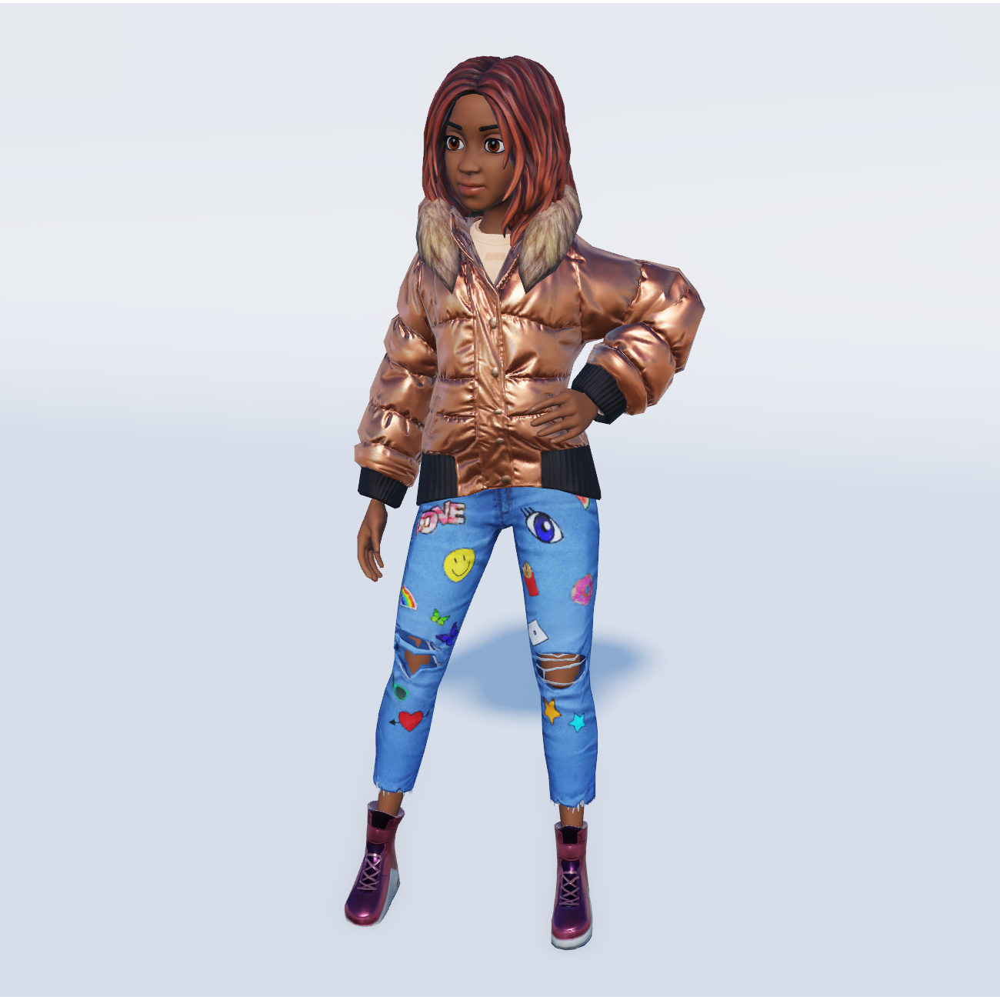
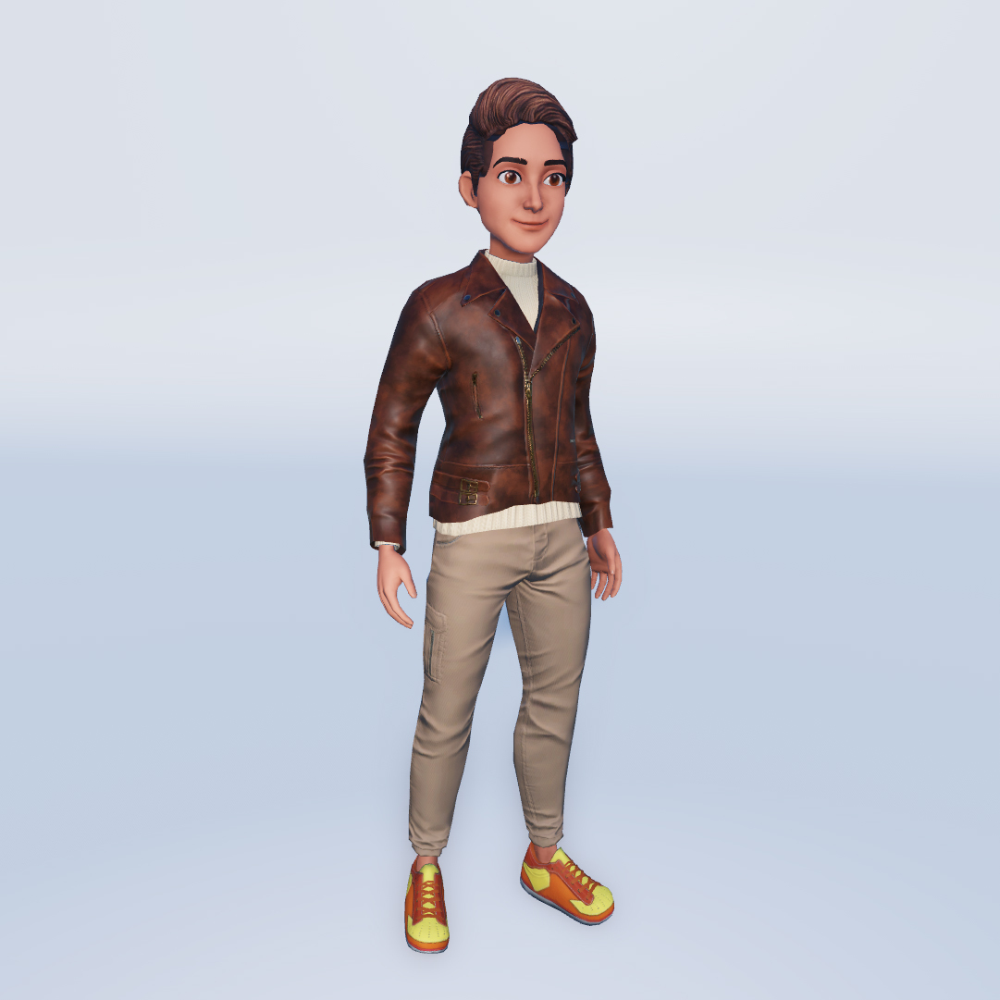

# PBR Textures (Optional)

## 목차
- [PBR Textures (Optional)](#pbr-textures-optional)
  - [목차](#목차)
  - [출처](#출처)
  - [다음](#다음)

---

물리 기반 렌더링(PBR) 텍스처는 다양한 조명 및 환경 조건에서 표면이 반응하는 방식을 정의하기 위해 여러 텍스처 맵을 사용합니다. PBR 텍스처는 아바타, 액세서리 및 의류를 포함한 자산의 외관과 느낌을 향상시킬 수 있습니다. 일반적으로 PBR 텍스처는 [Substance 3D](https://www.adobe.com/products/substance3d-painter)나 [ZBrush](https://www.maxon.net/en/zbrush)와 같은 텍스처링 도구에서 생성됩니다. 온라인에서 제공되는 많은 서드파티 3D 모델은 PBR 텍스처를 포함하고 있습니다.

<GridContainer numColumns="2">
  <figure>  <figcaption>캐릭터와 액세서리는 PBR 텍스처를 사용하여 시각적 매력과 소재의 사실감을 적용할 수 있습니다.</figcaption></figure>

  <figure><figcaption>PBR 텍스처는 가죽과 데님과 같은 거의 모든 유형의 소재 표면을 허용합니다.</figcaption></figure>
</GridContainer>

각 템플릿에는 PBR 텍스처가 포함되어 있지만, Blender 내의 기본 텍스처링 과정을 설명하기 위해 이 튜토리얼에서는 PBR 텍스처링 과정을 다루지 않습니다. 고급 텍스처링에 대한 자세한 정보와 참고 자료는 [PBR 텍스처](https://create.roblox.com/docs/art/modeling/surface-appearance)를 참조하십시오.

---
## 출처
 - [PBR Textures (Optional)](https://create.roblox.com/docs/art/characters/creating/texturing-pbr)

---
## [다음](./05_11_Caging.md)