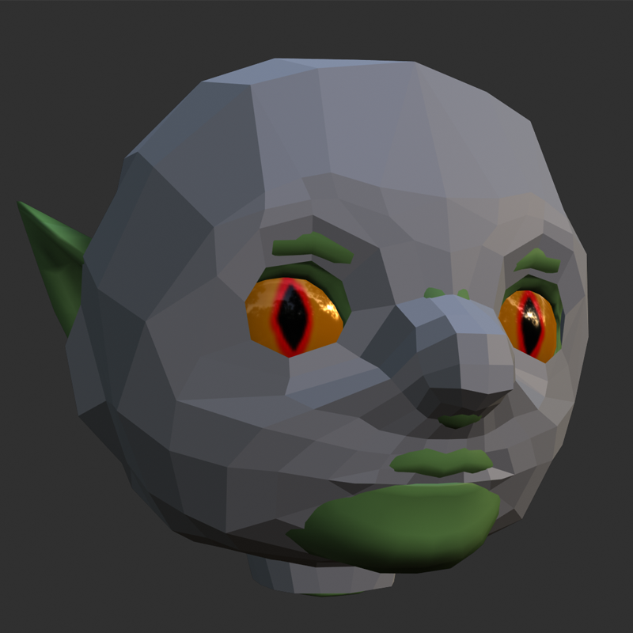
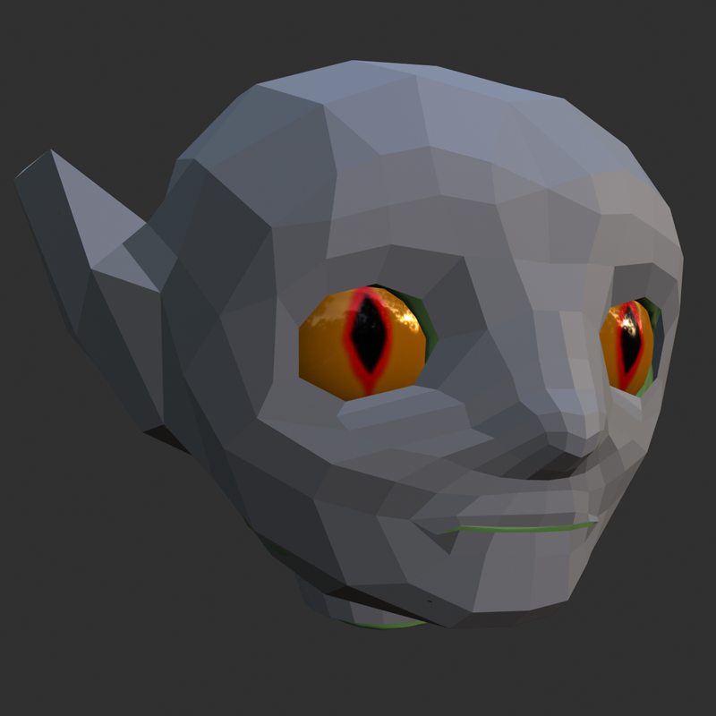
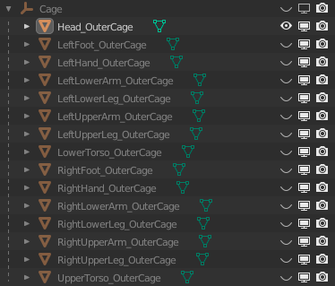
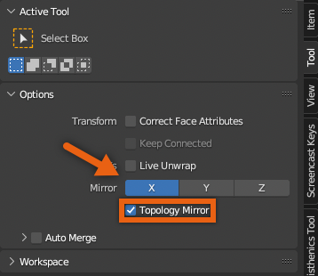

# Caging

## 목차
- [Caging](#caging)
  - [목차](#목차)
  - [출처](#출처)
  - [다음](#다음)

---

케이징(Caging)은 아바타 캐릭터의 [케이지 메시 구성 요소](https://create.roblox.com/docs/art/characters#cage-meshes)를 업데이트하는 과정입니다. 캐릭터가 레이어드 의류와 액세서리를 올바르게 착용할 수 있도록 하려면, 맞춤형 캐릭터에 적용한 조형 변경 사항에 맞게 기본 템플릿 케이지 메시 객체를 업데이트해야 합니다.

이 튜토리얼에서는 머리에만 모델링 변경 사항을 적용하므로, 아래의 케이징 지침은 **Head_OuterCage** 객체에만 적용됩니다. 캐릭터의 다른 부분에 기하학적 변경을 가한 경우, 해당 **\_OuterCage** 객체들도 조형 변경 사항에 맞게 조정해야 합니다.

제공된 케이지의 어떤 정점이나 면도 삭제하지 마십시오. 케이지를 파괴적으로 수정하면 가져오기 문제를 일으킬 수 있으며, 캐릭터 모델이 의류와 화장품을 장착하지 못하게 할 수 있습니다.

<!-- <GridContainer numColumns="2">
  <figure>  <figcaption>조형된 머리에 맞지 않는 기본 머리 케이지 메시</figcaption></figure>

  <figure><figcaption>조정 후의 머리 케이지 메시</figcaption></figure>
</GridContainer> -->

|조형된 머리에 맞지 않는 기본 머리 케이지 메시|조정 후의 머리 케이지 메시|
|---|---|
|||

캐릭터 몸체 모양이 여러 부분에서 많은 변화를 포함하는 경우, [Blender 케이지 템플릿](https://prod.docsiteassets.roblox.com/assets/modeling/meshes/reference-files/Body_Cage_Template.blend)을 사용하는 것이 더 효율적일 수 있습니다. 이 Blender 프로젝트 파일에는 전체 몸체 `std_cage_deformable` 메시가 포함되어 있어 각 부분별 케이지에 정점 변경을 동시에 자동으로 적용할 수 있습니다.

캐릭터의 케이징을 시작하려면:

1. Layout 탭에서 시작하여, Outliner에서 **Head_OuterCage**와 **Head_Geo** 객체를 제외한 모든 항목을 숨깁니다.

   
   <!-- <video controls src="../img/05_11_Caging/Caging_01.mp4" width="100%"></video> -->
   
   

2. **Head_OuterCage**를 선택한 상태에서 **Object Properties** > **Viewport Display**로 이동하여 **Display As**를 **Wire**로 설정합니다. 완료 후 이 설정을 **Solid**로 다시 전환합니다.
   <!-- <video controls src="../img/05_11_Caging/Caging_02.mp4" width="100%"></video> -->
   
3. **Head_OuterCage** 객체를 클릭하고 **Edit Mode**로 전환합니다.
4. **X-Axis symmetry**와 **Topology Mirror**를 활성화하여 케이지에 대칭적으로 정점 변경을 수행합니다.

   

5. **Edit Mode**로 전환합니다.
6. **Grab tool** (<kbd>G</kbd>)을 사용하여 케이지 메시의 일부를 클릭하고 드래그하여 고블린 머리 메시 위에 딱 맞게 정렬합니다. 다음 사항을 유의하십시오:

   1. **케이지의 어떤 정점도 삭제하지 마십시오.** 누락된 정점은 의류 액세서리를 장착할 때 오류와 문제를 일으킬 수 있습니다.
   2. 머리 케이지의 밑부분을 편집하는 경우, 머리 케이지의 밑부분이 UpperTorso 케이지의 윗부분과 일치하도록 해야 합니다.
   3. 다른 선택 모드에서 <kbd>Shift</kbd>를 누른 상태로 여러 정점/모서리/면을 클릭하여 기하학을 선택하고 편집합니다.
   4. 정점을 잡고 Head_Geo 메시 안으로 이동시켜 메시가 교차하는 위치를 확인하고 케이지 메시가 머리 메시를 덮을 때까지 케이지 정점을 이동시켜 딱 맞는지 확인할 수 있습니다.

      <!-- <video controls src="../img/05_11_Caging/Caging_03.mp4" width="100%"></video> -->
      

   5. 정점에 대한 접근성과 가시성을 개선하기 위해 다른 메시 객체의 가시성을 전환합니다.
   6. 와이어프레임이 머리 메시 위에 딱 맞게 조정된 후, **Display As**를 다시 **Solid**로 설정하고 교차하는 정점을 확인하고 수정합니다.
      <!-- <video controls src="../img/05_11_Caging/Caging_04.mp4" width="100%"></video> -->
      

최종 결과물은 헤드 메시의 기하학이 케이지의 솔리드 섹션을 통해 교차하지 않고 헤드 메시 위에 직접 위치한 케이지 메시를 특징으로 해야 합니다.

비교 참조를 위해, [케이징이 완료된 이 튜토리얼 프로젝트 버전](https://prod.docsiteassets.roblox.com/assets/art/reference-files/checkpoint/3_Goblin-caged.blend)을 다운로드할 수 있습니다.

---
## 출처
 - [Caging](https://create.roblox.com/docs/art/characters/creating/caging)

---
## [다음](./05_12_Combining_Head_Geometry.md)