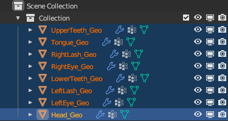

# Combining Head Geometry

## 목차
- [Combining Head Geometry](#combining-head-geometry)
  - [목차](#목차)
  - [헤드 기하학 결합](#헤드-기하학-결합)
  - [출처](#출처)
  - [다음](#다음)

---

모델을 내보낼 준비가 되면, 프로젝트를 정리하여 모델이 내보낼 준비가 되었는지 확인하는 것이 중요합니다. 이를 위해 사용자 정의 템플릿 모델과 모든 아바타 구성 요소가 Studio로 성공적으로 가져올 수 있도록 다음 작업을 수행해야 합니다:

- 추가 헤드 기하학 결합
- 추가 헤드 뼈 제거
- 부착 지점 확인
- 최종 기술 검사

헤드 기하학을 결합하지 않고 [헤드 뼈를 제거](https://create.roblox.com/docs/art/characters/creating/removing-extra-bones)하지 않으면, 캐릭터가 예상된 R15 기하학 및 관절 계층 구조를 따르지 않게 되어 검증에 문제가 발생합니다.

## 헤드 기하학 결합

이 시점에서 단일 Head_Geo 객체 내의 개별 헤드 및 얼굴 객체를 결합해야 합니다. 일부 템플릿에는 속눈썹과 같은 일부 얼굴 객체가 포함되지 않을 수 있습니다. 헤드 및 얼굴 메시를 결합하려면:

1. Outliner에서 <kbd>Ctrl</kbd>/<kbd>⌘</kbd> 키를 누르고 다음 객체를 클릭하여 Head_Geo로 끝냅니다:

   1. UpperTeeth_Geo
   2. LowerTeeth_Geo
   3. Tongue_Geo
   4. RightLash_Geo
   5. RightEye_Geo
   6. LeftLash_Geo
   7. LeftEye_Geo
   8. Head_Geo

   

   
   여러 헤드 객체를 선택할 때 **Head_Geo**가 노란색으로 강조 표시되어 다른 객체들이 이 객체에 병합된다는 것을 나타내야 합니다. 이는 헤드 메시에 저장된 사용자 정의 속성을 올바르게 유지합니다. Outliner에서 마지막으로 헤드를 선택하여 이를 달성할 수 있습니다.
   

2. Object 모드에서 Viewport를 오른쪽 클릭하고 **Join**을 선택합니다. 객체가 단일 **Head_Geo**로 결합됩니다.
   <!-- <video controls src="../img/05_12_Combining_Head_Geometry/Cleanup_01.mp4" width="100%"></video> -->
   

---
## 출처
 - [Combining Head Geometry](https://create.roblox.com/docs/art/characters/creating/combining-head-geometry)

---
## [다음](./05_13_Removing_Extra_Bones.md)