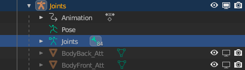

# Removing Extra Bones

## 목차
- [Removing Extra Bones](#removing-extra-bones)
  - [목차](#목차)
  - [출처](#출처)
  - [다음](#다음)

---

머리 기하학을 배치하는 데 사용된 보조 뼈도 올바르게 검증되도록 제거해야 합니다. 이러한 추가 뼈는 스키닝 데이터가 포함되어 있지 않지만, DynamicHead 내에 포함된 얼굴 애니메이션 뼈는 삭제하지 마십시오. 이 뼈들은 얼굴 애니메이션을 구동하는 중요한 스키닝 데이터를 포함하고 있습니다.

[머리 기하학 결합](https://create.roblox.com/docs/art/characters/creating/combining-head-geometry) 및 헤드 뼈 제거를 하지 않으면, 캐릭터가 예상된 R15 기하학 및 관절 계층 구조를 따르지 않게 되어 검증에 문제가 발생합니다.

다음과 같은 절차를 통해 추가 헤드 뼈를 선택하고 편집 모드에서 삭제하십시오:

1. 필요한 경우 **Armature** 객체의 가시성을 토글합니다. 뼈들이 뷰포트에 표시됩니다.
2. Outliner에서 캐릭터의 아마추어 객체를 확장하고 뼈 구조의 부모 객체인 **Joints** 객체를 찾습니다.

   

3. 확장 드롭다운을 클릭하면서 **shift** 키를 눌러 Joints 계층 구조를 확장합니다.
4. 뷰포트에서 임의의 뼈를 선택하고 **Edit Mode**로 전환합니다.
   
5. Head 관절 아래에서 **shift** 키를 눌러 DynamicHead를 제외한 모든 헤드 자식 관절을 선택합니다.
6. 추가 헤드 뼈를 선택한 상태에서 뷰포트에서 마우스 오른쪽 버튼을 클릭하고 **Delete Selected Bones**를 선택합니다.
   <video controls src="../img/05_13_Removing_Extra_Bones/Cleanup_01-1.mp4" width="100%"></video>

---
## 출처
 - [Removing Extra Bones](https://create.roblox.com/docs/art/characters/creating/removing-extra-bones)

---
## [다음](./05_14_Verifying_Attachment_Placement.md)