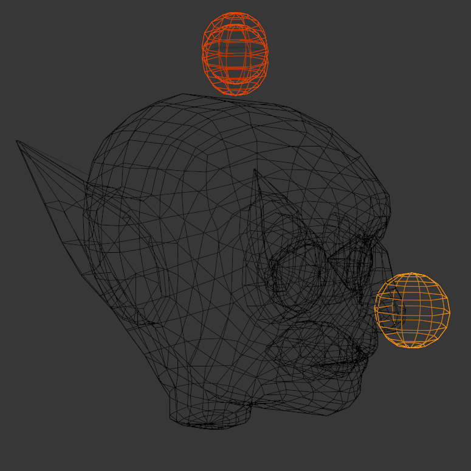
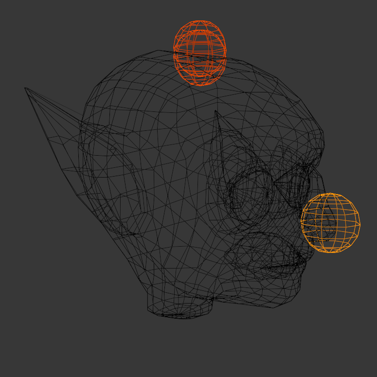
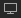

# Verifying Attachment Placement

## 목차
- [Verifying Attachment Placement](#verifying-attachment-placement)
  - [목차](#목차)
  - [출처](#출처)
  - [다음](#다음)

---

부착 지점은 리지드 액세서리가 아바타에 부착되는 비렌더링 객체입니다. 각 템플릿에는 **\_Att**로 끝나는 예상 위치에 필요한 부착 지점이 포함되어 있습니다. 내보내기 전에 부착 위치를 확인하고 모델의 형태를 변경한 경우 위치를 조정하는 것이 중요합니다.

<!-- <GridContainer numColumns="2">
  <figure>  <figcaption>원래 템플릿의 부착 위치</figcaption></figure>

  <figure><figcaption>조정 후 부착 위치</figcaption></figure>
</GridContainer> -->

|원래 템플릿의 부착 위치|조정 후 부착 위치|
|---|---|
|||

각 부착 지점을 해당 위치의 중앙에 배치합니다. 각 부착 지점은 캐릭터의 메시와 약 절반 정도 겹쳐야 합니다.

이 튜토리얼에서는 모델의 머리만 변경하므로 **Hat**, **Hair** 및 **FaceFront** 부착 지점만 조정하면 됩니다. 가시성을 활성화하고 머리 부착 지점을 확인하려면 다음 단계를 따르십시오:

1. 아직 하지 않았다면 Outliner에서 [비활성화된 객체](https://create.roblox.com/docs/art/characters/creating#disabled-objects)를 활성화합니다.
2. Outliner에서 Joints 부모 객체를 찾습니다.
3. **Shift** 키를 누른 상태에서 Joints 객체의 **Hide** 아이콘을 클릭하여 모든 것을 숨깁니다.
4. Joints 객체를 확장하고 Head_Geo, Hat_Att 및 Hair_Att를 숨김 해제합니다.
   1. 필요한 경우 \_Att 객체 옆의 **Disable In Viewport** 을 비활성화합니다.
5. **Hat_Att**, **Hair_Att**, **FaceFront_Att**의 가시성을 토글합니다.
6. 부착 위치를 확인합니다. 고블린의 머리는 시작 템플릿보다 짧으므로 부착 지점의 수직 조정이 필요합니다.
7. 부착 지점을 선택합니다.
8. **Edit** 모드로 전환합니다.
9. Grab 도구를 사용하여 부착 지점을 y축을 따라 수직으로 위치시켜 머리에 약 절반 정도 매립되도록 합니다.
   <video controls muted src="../img/05_14_Verifying_Attachment_Placement/Cleanup_02.mp4" width="100%"></video>

---
## 출처
 - [Verifying Attachment Placement](https://create.roblox.com/docs/art/characters/creating/verifying-attachments)

---
## [다음](./05_15_Final_Checks.md)