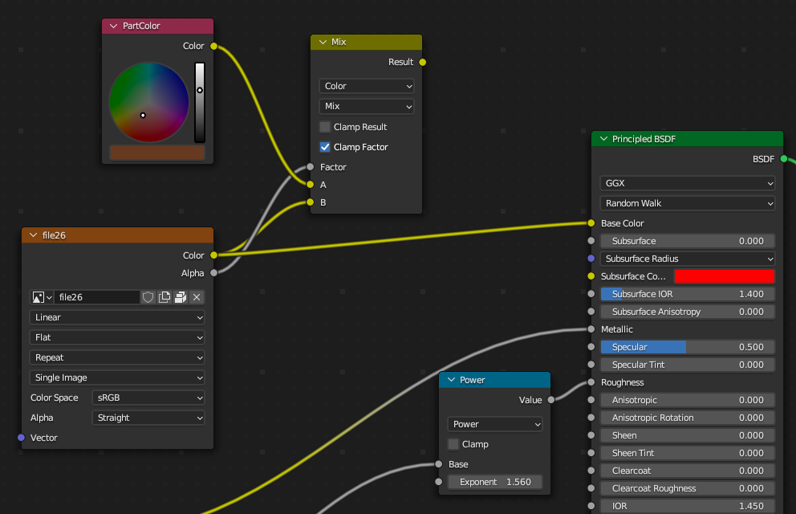
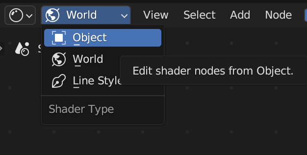
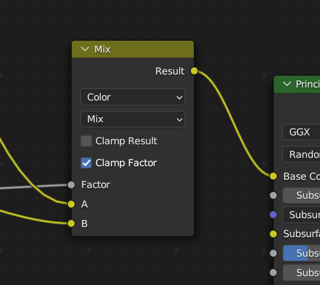
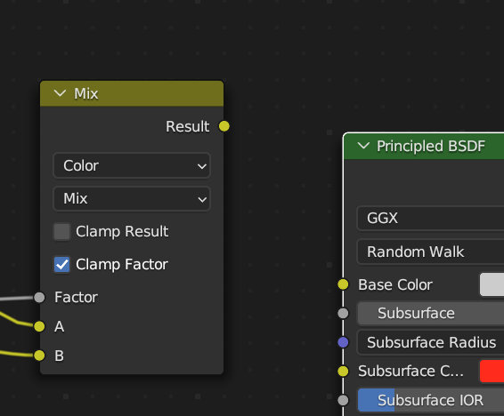
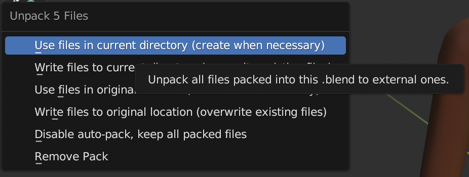

# Exporting Textures

## 목차
- [Exporting Textures](#exporting-textures)
  - [목차](#목차)
  - [텍스처 내보내기](#텍스처-내보내기)
    - [텍스처 포함](#텍스처-포함)
    - [이미지 파일 분리](#이미지-파일-분리)
  - [출처](#출처)
  - [다음](#다음)

---

자산 생성 과정의 모든 단계에서 자산을 여러 번 테스트하는 것이 중요합니다. Blender 내에서든 Studio로 가져온 후든 마찬가지입니다. 자세한 내용은 [캐릭터 테스트](https://create.roblox.com/docs/art/characters/testing)를 참조하세요.

캐릭터를 테스트용으로 내보내거나 Blender에서 최종 내보내기를 수행하는 경우, Blender가 적절한 캐릭터 데이터를 내보내도록 올바른 내보내기 설정을 적용해야 합니다.

## 텍스처 내보내기

기본 PBR 텍스처를 포함하여, 템플릿 캐릭터에는 표면 외관을 구성하는 네 개의 개별 이미지 맵이 포함되어 있습니다. 워크플로에 따라 이미지 맵을 내보내기 파일에 포함시키거나 텍스처를 개별 이미지 파일로 내보낼 수 있습니다. 두 방법 모두 장점이 있습니다.

- `텍스처 포함`은 모든 텍스처를 단일 `.fbx` 파일 내에 패킹하여 내보내기를 단순화합니다.
- `텍스처 이미지 내보내기`는 이미지 텍스처에 직접 접근할 수 있어 더 빠르게 테스트하고 교체할 수 있습니다.

### 텍스처 포함

텍스처 맵을 `.fbx` 내보내기에 포함시키면 Blender 내보내기 및 Studio 가져오기 과정을 단순화할 수 있습니다. Roblox의 템플릿 파일을 사용하여 텍스처를 포함시킬 때, Blender 파일의 사용자 정의 피부 톤 셰이더 노드에 약간의 조정이 필요합니다.

  <figure><figcaption>내보낼 수 있는 노드 구성: Color 노드가 Base Color에 직접 연결됨</figcaption></figure>

텍스처를 내보내기에 포함시키기 위해 준비하려면:

1. 객체 모드에서 캐릭터의 일부를 선택합니다.
2. **Shading** 탭으로 이동합니다.
3. **데이터 유형** 드롭다운이 **Object**로 설정되어 있는지 확인합니다.
   

4. **Principled BSDF's Base Color**에 연결된 노드를 찾습니다.
   
5. **Base Color**에서 선을 클릭하고 드래그하여 노드를 분리합니다.
   
6. 색상 텍스처 맵이 있는 **file26** 노드를 찾아 **Color**를 **Principled BSDF's color** 노드로 클릭하고 드래그합니다.
   
   <video controls src="../img/05_16_Exporting_Textures/Exporting_01.mp4" width="100%"></video>

### 이미지 파일 분리

텍스처 포함의 대안으로, 텍스처 파일을 개별 `.png` 이미지 파일로 내보내면 이미지 텍스처 맵에 빠르게 접근하고 교체할 수 있습니다.

텍스처 이미지 파일을 내보내려면:

1. **File** > **External Data** > **Unpack Resources**로 이동합니다.
2. **Use files in current directory**를 선택하여 현재 디렉토리에 저장합니다. Blender는 이미지 파일을 프로젝트의 상위 디렉토리 내의 텍스처 디렉토리에 내보냅니다.
   

---
## 출처
 - [Exporting Textures](https://create.roblox.com/docs/art/characters/creating/exporting-textures)

---
## [다음](./05_17_Exporting_Character_Model.md)