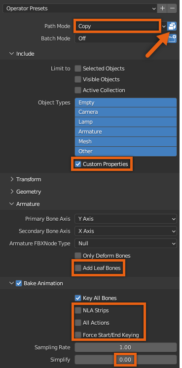

# Exporting Character Model

## 목차
- [Exporting Character Model](#exporting-character-model)
  - [목차](#목차)
  - [출처](#출처)

---

<Alert severity = 'warning'>
자산 생성 과정의 모든 단계에서 자산을 여러 번 테스트하는 것이 중요합니다. Blender 내에서든 Studio로 가져온 후든 마찬가지입니다. 자세한 내용은 캐릭터 테스트를 참조하세요.
</Alert>

캐릭터를 테스트용으로 내보내거나 Blender에서 최종 내보내기를 수행하는 경우, Blender가 적절한 캐릭터 데이터를 내보내도록 올바른 내보내기 설정을 적용해야 합니다.

캐릭터를 내보내려면:

1. 상단 메뉴에서 **File** > **Export** > FBX (.fbx)를 클릭합니다. Blender 파일 브라우저 창이 나타납니다.
2. **Path Mode**를 **Copy**로 설정하고 **Embed Textures** 아이콘을 활성화합니다.
3. Include 섹션에서 **Custom Properties**를 활성화합니다.
4. Armature 섹션을 확장하고 **Add Leaf Bones**의 선택을 해제합니다.
5. **Bake Animation**을 활성화합니다.
6. Bake Animation을 확장하고 **NLA Strips**, **All Actions**, **Force Start/End Keyframes**의 선택을 해제합니다.
7. Bake Animation에서 **Simplify**를 **0.0**으로 설정합니다.
8. **Export FBX** 버튼을 클릭합니다. `.fbx` 파일을 원하는 디렉토리에 저장합니다.

<Alert severity = 'warning'>
.fbx 파일을 내보낸 후, 캐릭터 테스트에서 Studio로 캐릭터 모델을 가져와 테스트 장소에서 아바타 및 관련 구성 요소를 확인하는 단계를 참조하세요.
</Alert>

<Alert severity = 'success'>
`Class.Model` 캐릭터를 Studio로 가져온 후, 이 자산으로 다음 작업을 수행할 수 있습니다:

- [캐릭터 업로드](https://create.roblox.com/docs/art/accessories/creating-rigid/publishing)하여 마켓플레이스에 공개.
- 기존 경험에 [HumanoidDescription](https://create.roblox.com/docs/characters/appearance#humanoiddescription)을 `Model` 객체에 적용하여 휴머노이드 캐릭터로 사용.
- 자산을 [Toolbox](https://create.roblox.com/docs/projects/assets/toolbox)에 저장하여 공유하거나 경험 내에서 사용.

</Alert>

---
## 출처
 - [Exporting Character Model](https://create.roblox.com/docs/art/characters/creating/exporting-character)
