# Creating Neon Signs

## 목차
- [Creating Neon Signs](#creating-neon-signs)
  - [목차](#목차)
  - [뒷면과 테두리 만들기](#뒷면과-테두리-만들기)
  - [네온 테두리 형성하기](#네온-테두리-형성하기)
  - [네온 3D 텍스트 포함하기](#네온-3d-텍스트-포함하기)
  - [출처](#출처)
  - [다음](#다음)

---

**네온 사인**은 건물의 입구나 아이템 구매 위치를 사용자에게 알리는 밝고 화려한 전기 간판입니다. 모델링 및 조명 기술을 결합하여 네온 사인을 제작하면 환경 내 몰입감을 높일 수 있습니다.

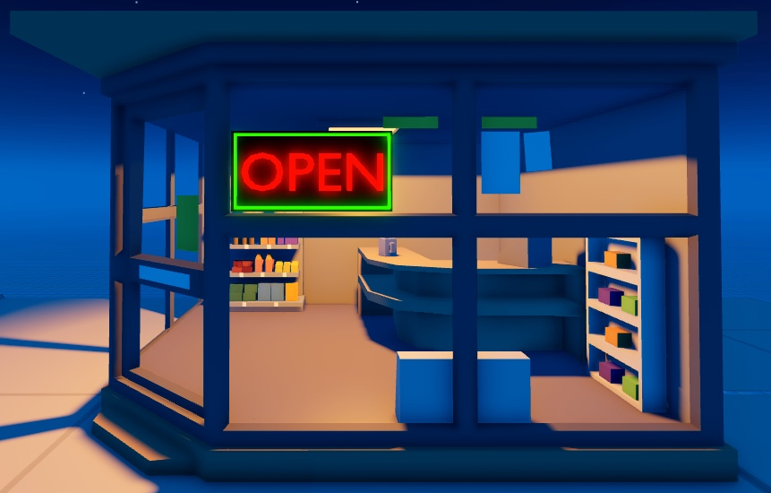

모든 3D 제작과 마찬가지로 특정 목표를 달성하는 데는 여러 가지 방법이 있습니다. 이 가이드에서는 기본 자산만을 사용하여 Studio 내에서만 사용할 수 있는 도구와 방법을 통해 네온 사인을 빠르게 만들 수 있습니다. 여기에는 간판 모델의 3D 텍스트를 위한 [`.obj`](https://prod.docsiteassets.roblox.com/assets/tutorials/creating-neon-signs/open-text.obj) 파일이 포함됩니다.

이 가이드의 방법을 따라 네온 사인을 만드는 방법은 다음과 같습니다:

- 기본 파트를 사용하여 간판의 뒷면과 테두리를 만듭니다.
- Studio의 솔리드 모델링 도구를 사용하여 간판을 형성합니다.
- 간판에 3D 텍스트를 포함시키고 모델로 저장합니다.

   타사 모델링 도구에서 자체 자산을 만들고 자신만의 디자인으로 따라 할 수 있습니다. Studio에서 모델을 사용하기 위한 내보내기 정보는 [내보내기 요구 사항](https://create.roblox.com/docs/art/modeling/export-requirements)을 참조하십시오.

## 뒷면과 테두리 만들기

`Part`는 이동, 크기 조정, 회전 및 색상과 재질을 변경하여 외형을 커스터마이징할 수 있는 Roblox의 기본 빌딩 블록입니다. 네온 사인의 뒷면과 테두리를 만들기 위해 기본 파트를 사용하는 것은 유용합니다. 기본 도형만 필요하기 때문입니다.

뒷면과 테두리를 만들려면:

1. 메뉴 막대에서 **Model** 탭을 선택합니다.
2. **Parts** 섹션에서 **Part Type Picker**를 클릭하고 **Block**을 선택합니다. 블록 파트가 작업 공간에 표시되며 네온 사인의 뒷면이 됩니다.

   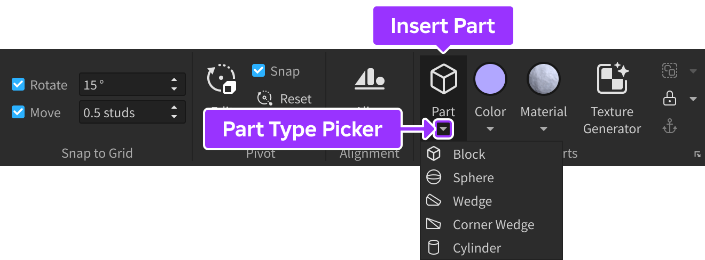

3. **Explorer** 창에서 블록을 선택한 다음 **Properties** 창에서

   1. **BrickColor**를 **Black**으로 설정합니다.
   2. **Size**를 `8,4,1`로 설정합니다.
   3. **Name**을 **Backboard**로 설정합니다.
   4. **Anchored** 속성을 활성화합니다.

      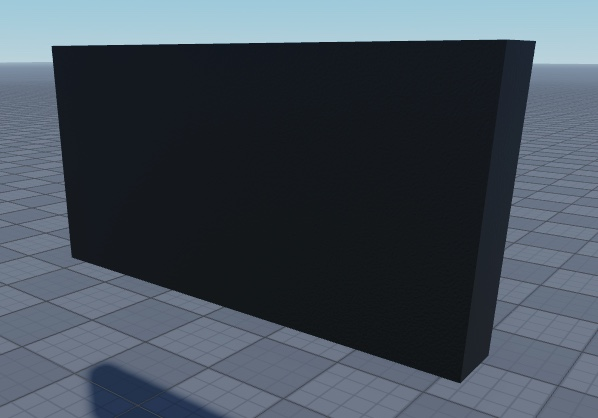

4. **Explorer** 창에서 **Backboard**를 선택한 다음 <kbd>Ctrl</kbd><kbd>D</kbd> (<kbd>⌘</kbd><kbd>D</kbd>)를 눌러 파트를 복제합니다.
5. 메뉴 막대에서 **Move** 도구를 선택하고 축 화살표 중 하나를 사용하여 복제된 뒷면 파트를 원래 위치에서 이동시켜 각 객체를 볼 수 있도록 합니다.

   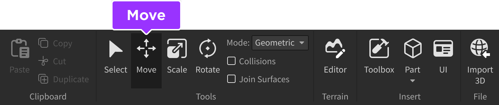

6. **Explorer** 창에서 네온 사인의 테두리가 될 복제된 뒷면 파트를 선택한 다음 **Properties** 창에서

   1. **BrickColor**를 **Lime Green**으로 설정합니다.
   2. **Size**를 `7.75, 3.75, 0.25`로 설정합니다.
   3. **Name**을 **Border**로 설정합니다.

      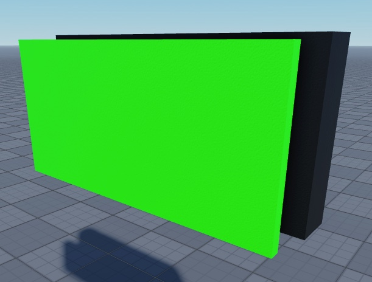

7. **Explorer** 창에서 **Border**를 선택한 다음 <kbd>Ctrl</kbd><kbd>D</kbd> (<kbd>⌘</kbd><kbd>D</kbd>)를 눌러 파트를 복제합니다. **이 새 파트를 이동시키지 마십시오**. 다음 조각 단계에 필요합니다.

이제 네온 사인의 기본 형태를 이루는 세 가지 파트가 생겼으므로 테두리의 형태를 조각할 수 있습니다.

## 네온 테두리 형성하기

[솔리드 모델링](https://create.roblox.com/docs/parts/solid-modeling)을 사용하여 고유한 방식으로 파트를 결합하고 분리하여 **연합**으로 알려진 더 복잡한 형태를 만들 수 있습니다. 이 과정을 통해 복제된 테두리 파트를 크기 조정하고 수정하여 네온 테두리로 만들 수 있습니다.

네온 테두리 형태를 만들려면:

1. **Explorer** 창에서 복제된 테두리 파트를 선택한 다음 **Properties** 창에서 **Size**를 `7.5, 3.5, 1.0`으로 설정합니다.

   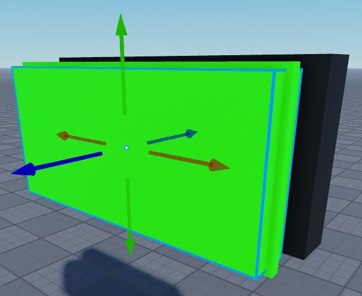

2. 복제된 테두리 파트를 선택한 상태에서 메뉴 막대의 **Solid Modeling** 섹션으로 이동하여 **Negate**를 선택합니다. 테두리 파트가 반투명으로 변하고 **Name** 속성이 자동으로 **NegativePart**로 변경됩니다.

   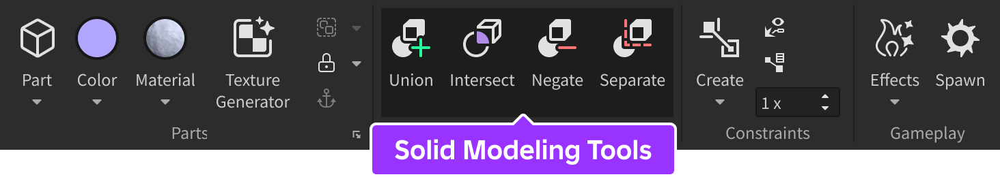

3. **NegativePart**가 선택된 상태에서 <kbd>Ctrl</kbd>/<kbd>⌘</kbd>를 누른 상태에서 원래 테두리 파트를 클릭하여 두 파트를 동시에 선택합니다.

   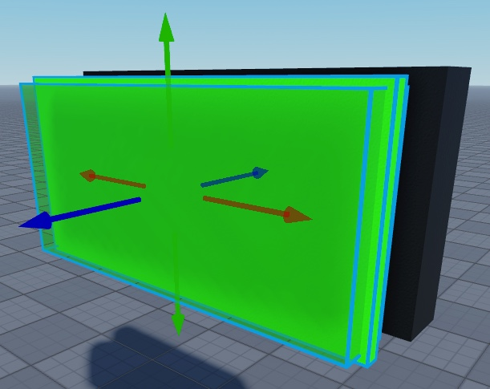

4. 메뉴 막대에서 **Union**을 선택하여 두 파트를 결합합니다. 테두리 모양의 파트가 표시되며 **Name** 속성이 자동으로 **Union**으로 변경됩니다.

5. **Explorer** 창에서 연합을 선택한 다음 **Properties** 창에서

   1. **Name**을 **Border**로 설정합니다. 이는 작업 공간 내의 모든 객체를 정리하는 데 도움이 됩니다.
   2. **Material**을 **Neon**으로 설정합니다. 이렇게 하면 파트가 빛납니다.

6. 메뉴 막대에서 **Move** 도구를 선택하고 축 화살표 중 하나를 사용하여 **Border**를 **Backboard** 앞에 이동시킵니다.

   <GridContainer numColumns="2">
     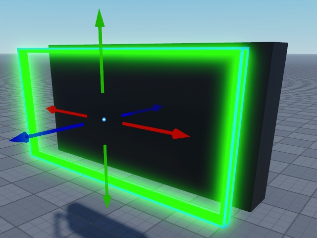
     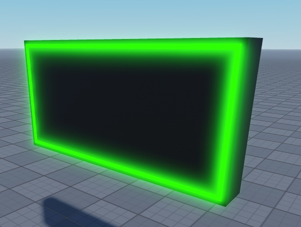
   </GridContainer>

이제 완성된 뒷면과 빛나는 네온 테두리가 생겼으므로, 간판의 글자를 위한 돌출된 네온 3D 텍스트를 만들 수 있습니다.

## 네온 3D 텍스트 포함하기

Studio는 기본적으로 3D 텍스트를 지원하지 않으므로, 이 가이드에서는 "OPEN"이라는 단어를 스펠링하는 3D 텍스트 모델이 포함된 open-text.obj 파일을 제공하여 장면에 가져오도록 합니다. 이 과정을 위해 다른 방법을 사용하여 3D 텍스트나 커스텀 디자인을 만들 수도 있습니다. 타사 모델링 소프트웨어에서 자체 모델을 사용하거나, 커뮤니티 플러그인을 사용하거나, Studio에서 솔리드 모델링을 통해 자체 텍스트를 수동으로 만드는 등의 방법이 있습니다.

[open-text](https://prod.docsiteassets.roblox.com/assets/tutorials/creating-neon-signs/open-text.obj) `.obj` 파일에서 네온 3D 텍스트를 포함하려면:

1. **open-text** `.obj` 파일을 가져옵니다.

   1. 메뉴 막대의 **Home** 탭으로 이동한 다음 **Import 3D**를 클릭합니다. 파일 탐색기가 표시됩니다.

      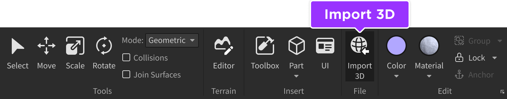

   2. **open-text** `.obj` 파일을 선택한 다음 **Open** 버튼을 클릭합니다. **Import Preview** 창이 표시됩니다.
   3. 기본 가져오기 설정을 유지한 후 **Import** 버튼을 클릭합니다. open 텍스트 모델이 뷰포트에 표시됩니다.

2. 메뉴 막대에서 Move 도구를 선택하고 축 화살표 중 하나를 사용하여 텍스트를 간판의 중앙으로 이동시킵니다.

   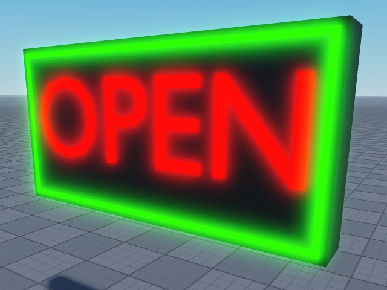

3. **Properties** 창에서

   1. **Color**를 `170,0,0`으로 설정합니다.
   2. **Material**을 **Neon**으로 설정합니다.

4. **Explorer** 창에서 텍스트 모델, **Border**, **Backboard**를 선택한 다음 <kbd>Ctrl</kbd><kbd>G</kbd> (<kbd>⌘</kbd><kbd>G</kbd>)를 눌러 단일 `Class.Model` 객체로 그룹화합니다.

      이 네온 사인이 Studio 내에서 어떻게 보이는지 참고하려면 [기본 프로젝트 파일](https://prod.docsiteassets.roblox.com/assets/tutorials/creating-neon-signs/neon-sign-baseplate.rbxl)을 다운로드하여 모델과 비교해 보십시오.

5. 새 모델의 이름을 **NeonSign**으로 변경합니다.
6. **Explorer** 창에서 **NeonSign**을 마우스 오른쪽 버튼으로 클릭합니다. 컨텍스트 메뉴가 표시됩니다.
7. **Save to Roblox**를 선택합니다.

[Toolbox](https://create.roblox.com/docs/projects/assets/toolbox)에 자산을 저장한 후에는 어느 경험에서든 사용할 수 있습니다. 또한 [Creator Store에 자산을 배포](https://create.roblox.com/docs/production/creator-store)하여 모든 제작자가 자신의 경험에서 사용할 수 있도록 공개적으로 제공할 수 있습니다.

---
## 출처
 - [Creating Neon Signs](https://create.roblox.com/docs/tutorials/3D-art/creating-neon-signs)

---
## [다음](./01_02_Rigging_a_Simple_Mesh.md)