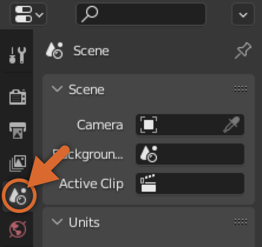
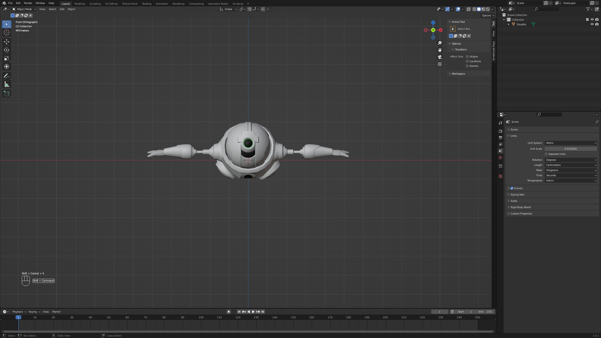

# Rigging a Simple Mesh

## 목차
- [Rigging a Simple Mesh](#rigging-a-simple-mesh)
  - [목차](#목차)
  - [Blender 설정](#blender-설정)
    - [장면 및 스케일 설정](#장면-및-스케일-설정)
    - [모델 가져오기](#모델-가져오기)
  - [뼈대 구조 생성](#뼈대-구조-생성)
    - [뼈대 추가](#뼈대-추가)
    - [뼈 추가 및 위치 조정](#뼈-추가-및-위치-조정)
  - [뼈대 종속](#뼈대-종속)
  - [정점을 뼈에 할당](#정점을-뼈에-할당)
  - [테스트](#테스트)
  - [출처](#출처)
  - [다음](#다음)

---

**리깅 메시**는 [Blender](https://www.blender.org) 또는 [Maya](https://www.autodesk.com/products/maya/overview)와 같은 서드파티 모델링 도구를 사용하여 만들 수 있습니다. 모델을 디자인한 후, [내보내기](https://create.roblox.com/docs/art/modeling/export-requirements) 전에 모델을 리깅해야 합니다.

Blender에서 간단한 모델을 리깅하려면 다음 단계를 따르십시오:

- 리깅을 위해 모델을 가져오기 전에 Studio의 상대적인 장면 단위로 Blender를 [설정](#blender-설정)합니다.
- 메시 객체 내에서 뼈대를 [생성하고 재배치](#뼈대-구조-생성)합니다.
- 뼈대 골격을 메시 객체에 연결하기 위해 메시를 뼈대에 [종속](#뼈대-종속)시킵니다.
- 메시의 어느 부분이 어느 뼈에 의해 제어되는지를 정의하기 위해 정점들을 특정 뼈에 [할당](#정점을-뼈에-할당)합니다.
- 뼈가 메시 내에서 올바르게 위치하고 영향을 미치는지 확인하기 위해 리깅된 메시를 [테스트](#테스트)합니다.

<Alert severity="info">
  이 가이드는 다운로드 가능한 [예제 로봇 모델](https://prod.docsiteassets.roblox.com/assets/modeling/meshes/reference-files/shoebot-base-model.fbx)과 [Blender 버전 3.0](hhttps://www.blender.org/download/releases/3-0/)을 사용합니다. 다른 버전의 Blender를 사용하는 경우 UI 및 설정에 약간의 차이가 있을 수 있습니다.
  </Alert>

## Blender 설정

리깅 메시를 만드는 과정을 시작하려면, Blender 프로젝트에서 다음을 설정하십시오:

- Blender의 [장면 단위 및 단위 스케일 속성](#장면-및-스케일-설정)을 Studio의 비율에 맞추어 설정합니다.
- Blender의 파일 가져오기 도구를 사용하여 모델을 [가져옵니다](#모델-가져오기).

### 장면 및 스케일 설정

Roblox Studio로 가져오기 위한 Blender 프로젝트를 설정할 때, Blender의 기본 **장면 단위** 및 **단위 스케일** 속성을 수정하여 Studio의 스케일과 가깝게 맞추는 것이 좋습니다.

새로운 Blender 프로젝트를 시작하고 장면 단위 속성을 설정하려면:

1. Blender에서 새로운 **일반** 프로젝트를 엽니다.
2. 기본 도형, 카메라 및 조명을 선택한 다음 <kbd>Delete</kbd>를 누릅니다.
3. **속성 편집기**의 왼쪽 탐색에서 **장면 속성**으로 이동합니다.

   

4. **단위** 섹션에서 **단위 스케일**을 **0.01**로 변경하고 **길이**를 **센티미터**로 변경합니다.

   <video controls src="../img/01_02_Rigging_a_Simple_Mesh/1-setting-up-blender.mp4" width="80%"></video>

### 모델 가져오기

이 예제에서는 [로봇 모델](https://prod.docsiteassets.roblox.com/assets/modeling/meshes/reference-files/shoebot-base-model.fbx)을 Blender로 가져와서 메시 객체로 사용합니다.

기존 `.fbx` 모델을 가져오려면:

1. 상단 메뉴에서 **파일**을 클릭합니다. 팝업 메뉴가 표시됩니다.
2. **가져오기**를 선택한 다음 가져올 모델의 파일 형식을 선택합니다. 이 예제에서는 **FBX (.fbx)**를 선택하고 `.fbx` 참조 모델을 선택합니다. 모델이 3D 뷰포트에 표시됩니다.

   

## 뼈대 구조 생성

이제 모델이 Blender에 있으므로, 메시 객체에 **뼈대(armature)**와 **뼈(bones)**를 추가해야 합니다. **뼈대**는 뼈를 담는 컨테이너 역할을 하는 스켈레톤 같은 리깅 객체이며, **뼈**는 해당 뼈를 둘러싼 정점 그룹 또는 **정점 그룹**의 이동 및 변형을 제어하는 객체입니다.

### 뼈대 추가

뼈대를 추가하려면:

1. 3D 뷰포트 상단에서 **추가** &rarr; **뼈대**를 선택합니다.

2. 뼈대를 더 잘 시각화하기 위해, **속성 편집기**의 왼쪽 탐색에서 **뼈대 객체 속성**으로 이동합니다.

3. **뷰포트 표시** 섹션에서 **표시** 속성으로 이동한 다음 **앞에** 표시를 활성화합니다.

   <video controls src="../img/01_02_Rigging_a_Simple_Mesh/2-adding-armature.mp4" width="80%"></video>

### 뼈 추가 및 위치 조정

프로젝트에 뼈대를 추가하면 Blender는 기본 위치와 스케일에서 하나의 뼈를 뼈대에 자동으로 추가합니다. 이 뼈는 루트 뼈로 작동합니다.

두 개의 추가 뼈를 추가하고 위치를 조정하려면:

1. **뼈**를 클릭하여 강조 표시합니다.
2. 3D 뷰포트 상단에서 모드 드롭다운을 클릭한 다음 **편집 모드**로 전환합니다.
3. 뷰포트에서 **추가** &rarr; **단일 뼈**를 클릭합니다. 이 단계를 두 번 수행합니다.

   <video controls src="../img/01_02_Rigging_a_Simple_Mesh/3.1-positioning-bones.mp4" width="80%"></video>

4. 뷰포트 또는 아웃라이너에서 **새로 생성된 뼈**를 클릭하여 강조 표시합니다.
5. <kbd>G</kbd>를 눌러 마우스를 사용하여 뼈를 **오른쪽 팔**로 이동시킵니다.
6. 두 번째 뼈를 클릭하고 <kbd>G</kbd>를 눌러 뼈를 **왼쪽 팔**로 이동시킵니다.
   <video controls src="../img/01_02_Rigging_a_Simple_Mesh/3.2-positioning-bones.mp4" width="80%"></video>

7. **오른쪽 뼈**의 상단을 클릭하여 끝부분이 강조 표시되도록 합니다. <kbd>G</kbd>를 눌러 뼈를 오른쪽으로 수평으로 이동 및 방향을 조정합니다.
8. **왼쪽 뼈**의 상단을 클릭하여 끝부분이 강조 표시되도록 합니다. <kbd>G</kbd>를 눌러 뼈를 왼쪽으로 수평으로 이동 및 방향을 조정합니다.

   <video controls src="../img/01_02_Rigging_a_Simple_Mesh/3.3-positioning-bones.mp4" width="80%"></video>

9. 아웃라이너에서 두 번 클릭하여 나중에 쉽게 참조할 수 있도록 뼈의 이름을 변경합니다.

   <video controls src="../img/01_02_Rigging_a_Simple_Mesh/4-rename-bones.mp4" width="80%"></video>

## 뼈대 종속

뼈대 구조를 생성하고 위치를 지정한 후, 뼈대를 메시 객체에 연결하여 뼈대를 메시 객체에 종속시켜야 합니다.

이 가이드에서는 뼈대를 종속시킬 때 Blender의 **자동 가중치** 기능을 사용하여 메시에 자동으로 가중치와 영향을 추가합니다.

뼈대를 메시에 종속시키려면:

1. 3D 뷰포트 상단에서 모드 드롭다운을 클릭한 다음 **객체 모드**로 전환합니다.
2. 모든 객체를 선택 해제하려면 <kbd>Alt</kbd><kbd>A</kbd> (Windows) 또는 <kbd>⌥</kbd><kbd>A</kbd> (Mac)를 누릅니다.
3. <kbd>Shift</kbd>를 누른 상태에서 **메시 객체**를 선택한 다음 **뼈대**를 선택합니다. 선택 순서가 중요합니다.
4. **뷰포트**에서 메시 객체를 마우스 오른쪽 버튼으로 클릭합니다. 팝업 메뉴가 표시됩니다.
5. **종속**을 선택한 다음 **자동 가중치로**를 선택합니다.

   <video controls src="../img/01_02_Rigging_a_Simple_Mesh/5-parenting-armature.mp4" width="80%"></video>

## 정점을 뼈에 할당

뼈대가 메시 객체에 연결된 후, 이제 메시의 정점을 해당 뼈에 완전히 영향을 받도록 할당할 수 있습니다. 로봇과 같은 비유기적 캐릭터에는 각 팔다리가 완전히 구부러지고 뼈가 회전할 때 관절이 되는 것이 이상적입니다.

왼쪽 및 오른쪽 팔

에 뼈의 영향을 할당하려면:

1. 객체 모드에서 **로봇 메시 객체**를 선택합니다.
2. 모드 드롭다운에서 **편집 모드**로 전환합니다.
3. 뷰포트 오른쪽 상단에서 소재 미리보기 옵션을 사용하여 **X-Ray** 뷰로 전환합니다.

   <video controls src="../img/01_02_Rigging_a_Simple_Mesh/6.1-assigning-vertices.mp4" width="80%"></video>

4. 오른쪽 뼈와 함께 이동할 정점을 드래그하여 선택합니다.
5. **객체 속성 패널**로 이동합니다.
6. **정점 그룹** 섹션에서 할당할 뼈의 이름을 선택하고 **할당**을 클릭합니다.
7. **4-6단계**를 다른 뼈와 팔 정점에 대해 반복합니다.

   <video controls src="../img/01_02_Rigging_a_Simple_Mesh/6.2-assigning-vertices.mp4" width="80%"></video>

8. 로봇 중앙의 나머지 정점을 드래그하여 선택합니다.
9. **객체 속성 패널**로 이동합니다.
10. 정점 그룹 섹션에서 **가운데 뼈**를 선택하고 **할당**을 클릭합니다.

    <video controls src="../img/01_02_Rigging_a_Simple_Mesh/6.3-assigning-vertices.mp4" width="80%"></video>

## 테스트

포즈 모드에서 다른 포즈로 리깅을 테스트할 수 있습니다. 영향을 적용하거나 변경한 후 리깅을 테스트하는 것이 중요합니다.

적용된 영향을 테스트하려면:

1. **객체 모드**에서 모델의 임의의 부분을 선택합니다.
2. 3D 뷰포트 상단에서 모드 드롭다운을 클릭한 다음 **포즈** 모드로 전환합니다.
3. <kbd>Shift</kbd>를 누른 상태에서 테스트할 뼈를 클릭하여 강조 표시한 다음 <kbd>R</kbd>을 눌러 회전을 테스트합니다.
4. 현재 뼈의 선택을 취소하려면 <kbd>Alt</kbd><kbd>A</kbd> (<kbd>⌥</kbd><kbd>A</kbd>)를 누른 다음 다른 뼈를 다시 선택하고 테스트합니다.

   <video controls src="../img/01_02_Rigging_a_Simple_Mesh/7-testing.mp4" width="80%"></video>

<Alert severity="info">
   선택한 뼈의 회전을 중립으로 재설정하려면 <kbd>Alt</kbd>+<kbd>R</kbd>을 누릅니다. 회전 중에 마우스의 스크롤 휠을 눌러 회전 축을 변경할 수도 있습니다.
</Alert>

이제 로봇 모델이 리깅된 메시가 되었으며 Studio로 [내보내기](https://create.roblox.com/docs/art/modeling/export-requirements)할 준비가 되었습니다. 참고용으로 이 가이드에서 리깅된 모델의 [최종 내보내기](https://prod.docsiteassets.roblox.com/assets/modeling/meshes/reference-files/shoebot-rigged-model.fbx) (`.fbx`)를 다운로드할 수 있습니다.

---
## 출처
 - [Rigging a Simple Mesh](https://create.roblox.com/docs/art/modeling/rigging-a-simple-mesh)

---
## [다음](./01_03_Skinning_a_Simple_Mesh.md)