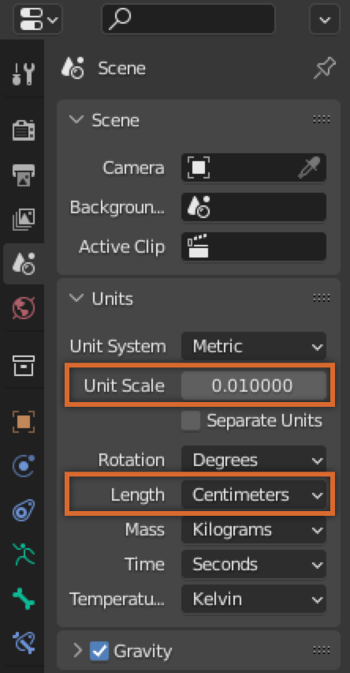
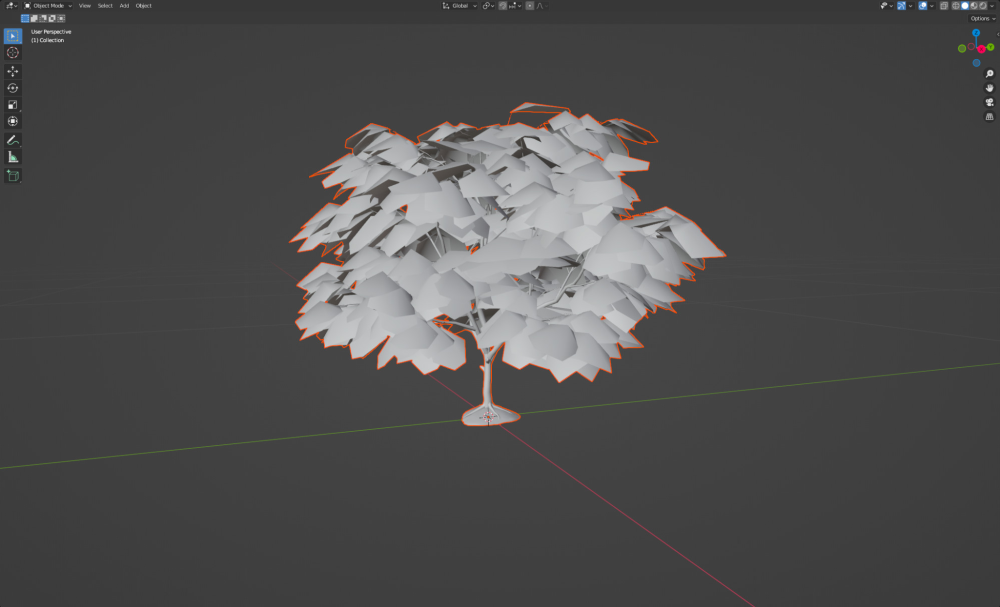
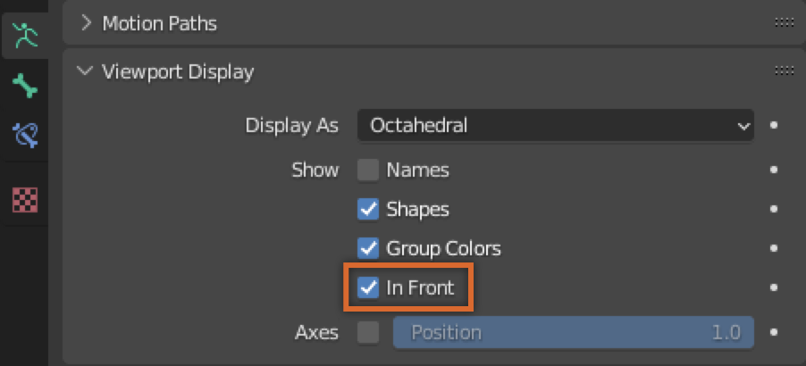
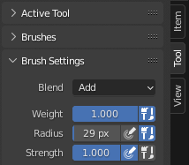

# Skinning a Simple Mesh

## 목차
- [Skinning a Simple Mesh](#skinning-a-simple-mesh)
  - [목차](#목차)
  - [Blender 설정](#blender-설정)
    - [장면 단위 및 스케일 조정](#장면-단위-및-스케일-조정)
    - [모델 가져오기](#모델-가져오기)
  - [뼈대 구조 생성](#뼈대-구조-생성)
    - [뼈대 추가](#뼈대-추가)
    - [뼈 위치 조정](#뼈-위치-조정)
    - [추가 뼈 추가](#추가-뼈-추가)
  - [뼈대 종속](#뼈대-종속)
  - [웨이트 페인팅](#웨이트-페인팅)
    - [설정](#설정)
      - [뼈 시각화](#뼈-시각화)
      - [자동 정규화](#자동-정규화)
      - [투영 브러시](#투영-브러시)
    - [영향 페인팅](#영향-페인팅)
      - [하단 뼈](#하단-뼈)
      - [중간 뼈](#중간-뼈)
      - [상단 뼈](#상단-뼈)
    - [테스트](#테스트)
  - [출처](#출처)
  - [다음](#다음)

---

**스킨 메시**는 내부 스켈레톤 리그가 포즈를 취하거나 애니메이션될 때 자연스럽게 구부러지고 굽혀지는 리깅된 메시입니다. [Blender](https://www.blender.org) 또는 [Maya](https://www.autodesk.com/products/maya/overview)와 같은 서드파티 모델링 도구를 사용하여 스킨 메시를 만들 수 있습니다. 스킨 작업은 모델을 [리깅](./01_02_Rigging_a_Simple_Mesh.md)한 후에 완료해야 합니다.

이 가이드는 3개의 뼈를 가진 간단한 나무 모델을 Blender에서 리깅하고 스킨 작업을 하는 과정을 다룹니다. 리깅에 대한 기본 사항은 [간단한 메시 리깅](./01_02_Rigging_a_Simple_Mesh)을 참조하십시오.

간단한 메시를 스킨하기 위해서는 다음 단계를 수행해야 합니다:

- 모델을 가져오기 전에 Blender를 Studio의 상대적인 장면 단위로 [설정](#blender-설정)합니다.
- 뼈대를 내부 구조에 맞게 [생성, 크기 조정 및 위치 조정](#뼈대-구조-생성)합니다.
- 스켈레톤 리그를 메시 객체에 바인딩하기 위해 메시를 뼈대에 [종속](#뼈대-종속)시킵니다.
- [웨이트 페인팅](#영향-페인팅)을 통해 메시의 어느 부분이 어느 뼈와 함께 움직일지 할당합니다.

이 가이드는 다운로드 가능한 [예제 나무 모델](https://prod.docsiteassets.roblox.com/assets/modeling/skinned-meshes/MapleLeafTree.fbx)과 [Blender 버전 3.0](https://www.blender.org/download/releases/3-0/)을 사용합니다. 다른 버전의 Blender를 사용하는 경우 UI와 설정에 약간의 차이가 있을 수 있습니다.

## Blender 설정

스킨 메시를 만드는 과정을 시작하려면, Blender 프로젝트에서 다음을 설정하십시오:

- Blender의 기본 **장면 단위**와 **단위 스케일** 속성을 수정하여 Studio의 스케일과 가깝게 맞춥니다.
- Blender의 파일 가져오기 도구를 사용하여 모델을 [가져옵니다](#모델-가져오기).

### 장면 단위 및 스케일 조정

Blender 프로젝트를 Roblox Studio로 가져오기 위해 설정할 때, Blender의 기본 **장면 단위**와 **단위 스케일** 속성을 수정하여 Studio의 스케일과 가깝게 맞추는 것이 좋습니다.

새 프로젝트에서 Blender의 장면 단위와 스케일을 수정하려면:

1. Blender에서 새로운 **일반** 프로젝트를 엽니다.
2. 기본 도형, 카메라, 조명을 선택한 다음 <kbd>Delete</kbd>를 누릅니다.
3. **속성 편집기**의 왼쪽 탐색에서 **장면 속성**으로 이동합니다.

   

4. **단위** 섹션에서 **단위 스케일**을 **0.01**로 변경하고 **길이**를 **센티미터**로 변경합니다.

   

### 모델 가져오기

이 가이드에서는 [단풍나무 모델](https://prod.docsiteassets.roblox.com/assets/modeling/skinned-meshes/MapleLeafTree.fbx)을 Blender로 가져와서 메시 객체로 사용합니다.

Blender에 모델을 가져오려면:

1. 상단 메뉴에서 **파일**을 클릭합니다. 팝업 메뉴가 표시됩니다.
2. **가져오기**를 선택한 다음 가져올 모델의 파일 형식을 선택합니다. 이 예제에서는 **FBX (.fbx)**를 선택하고 `.fbx` 참조 모델을 선택합니다. 모델이 3D 뷰포트에 표시됩니다.

   

## 뼈대 구조 생성

이제 모델이 Blender에 있으므로, 메시 객체에 **뼈대**와 **뼈**를 추가해야 합니다. **뼈대**는 뼈를 담는 컨테이너 역할을 하는 스켈레톤 같은 리깅 객체이며, **뼈**는 해당 뼈를 둘러싼 정점 그룹 또는 **정점 그룹**의 이동 및 변형을 제어하는 객체입니다.

### 뼈대 추가

뼈대를 추가하려면:

1. 3D 뷰포트 상단에서 **추가** &rarr; **뼈대**를 선택합니다.

   <!-- <video controls src="../img/01_03_Skinning_a_Simple_Mesh/Adding-Armature.mp4" width="80%"></video> -->
   

2. 뼈대를 더 잘 시각화하기 위해, **속성 편집기**의 왼쪽 탐색에서 **뼈대 객체 속성**으로 이동합니다.

3. **뷰포트 표시** 섹션에서 **표시** 속성으로 이동한 다음 **앞에** 표시를 활성화합니다.

   

   <!-- <video controls src="../img/01_03_Skinning_a_Simple_Mesh/Bone-In-Front.mp4" width="80%"></video> -->
   

### 뼈 위치 조정

프로젝트에 뼈대를 추가하면 Blender는 기본 위치와 스케일에서 하나의 뼈를 뼈대에 자동으로 추가합니다. 이 뼈를 회전하고 스케일을 조정하여 메시 객체의 내부 구조를 더 정확하게 나타낼 수 있습니다.

뼈의 위치를 조정하려면:

1. **뼈 객체**를 클릭하여 강조 표시합니다.
2. 3D 뷰포트 상단에서 모드 드롭다운을 클릭한 다음 **편집 모드**로 전환합니다.
3. **뼈의 상단**을 클릭하고 <kbd>G</kbd>를 누릅니다. 뼈의 상단이 커서와 함께 움직입니다.
4. 이 뼈를 모델의 내부 중심에 맞추고 클릭하여 뼈의 위치를 설정합니다.

   <!-- <video controls src="../img/01_03_Skinning_a_Simple_Mesh/Position-First-Bone.mp4" width="80%"></video> -->
   

5. 마우스의 스크롤 휠을 눌러 메시 객체 주위로 카메라를 이동하여 뼈가 메시 객체 내에 중심에 있는지 다양한 뷰와 각도에서 확인합니다.

### 추가 뼈 추가

이 가이드에서는 나무가 세 지점에서 움직이고 회전할 수 있도록 메시 내에 3개의 뼈가 필요합니다.

추가 뼈를 뼈대에 추가하려면:

1. **편집 모드**에서 뼈 끝부분을 클릭합니다.
2. <kbd>E</kbd>를 누르고 마우스를 위로 드래그합니다. 이것은 원래 루트 뼈에서 추가 뼈를 확장합니다.

   <!-- <video controls src="../img/01_03_Skinning_a_Simple_Mesh/Extrude-Second-Bone.mp4" width="80%"></video> -->
   

3. 두 번째 뼈에 대해 이 과정을 반복합니다.

   <!-- <video controls src="../img/01_03_Skinning_a_Simple_Mesh/Extrude-Last-Bone.mp4" width="80%"></video> -->
   

4. 마우스의 스크롤 휠을 눌러 메시 객체 주위로 카메라를 이동하여 뼈가 메시 객체 내에 있는지 다양한 뷰와 각도에서 확인합니다. 필요에 따라 [뼈의 위치를 조정](#뼈-위치-조정)합니다.
5. 아웃라이너에서 **뼈대** 객체를 확장합니다. 뼈대의 뼈 계층 구조가 표시됩니다.
6. 아웃라이너에서 각 뼈의 이름을 두 번 클릭하여 **이름을 변경**합니다. 뼈 객체 이름은 Studio로 메시 객체를 가져올 때 동일하게 유지됩니다.

   <!-- <video controls src="../img/01_03_Skinning_a_Simple_Mesh/Renaming-Bones.mp4" width="80%"></video> -->
   

## 뼈대 종속

뼈 구조를 생성하고 위치를 지정한 후, 뼈대를 메시 객체에 연결하여 뼈대를 메시 객체에 종속시켜야 합니다.

이 가이드에서는 뼈대를 종속시킬 때 Blender의 **자동 가중치** 기능을 사용하여 메시에 자동으로 가중치와 영향을 추가합니다. 이것은 [웨이트 페인팅](#웨이트-페인팅) 과정에서 시간을 절약할 수 있습니다.

뼈대를 메시에 종속시키려면:

1. 3D 뷰포트 상단에서 모드 드롭다운을 클릭한 다음 **객체 모드**로 전환합니다.
2. 모든 객체를 선택 해제하려면 <kbd>Alt</kbd><kbd>A</kbd> (Windows) 또는 <kbd>⌥</kbd><kbd>A</kbd> (Mac)를 누릅니다.
3. <kbd>Shift</kbd>를 누르고 **메시 객체**와 **뼈대**를 선택합니다. 선택 순서가 중요합니다.
4. 뷰포트에서 **메시 객체**를 마우스 오른쪽 버튼으로 클릭합니다. 팝업 메뉴가 표시됩니다.
5. **종속**을 선택한 다음 **자동 가중치**를 선택합니다.

   <!-- <video controls src="../img/01_03_Skinning_a_Simple_Mesh/Parenting-Armature.mp4" width="80%"></video> -->
   

## 웨이트 페인팅

뼈대를 메시 객체에 연결한 후, **웨이트 페인팅**을 통해 특정 정점에 영향을 주는 뼈의 양을 변경하여 더 자연스러운 움직임과 유연성을 부여할 수 있습니다.

Blender는 가중치 강도를 **파란색에서 빨간색으로의 그라데이션**으로 표시합니다. **파란색**은 **0**의 값을 나타내고 **빨간색**은 **1**의 완전히 영향을 받는 값을 나타냅니다. 메시 객체의 정점이 빨간색으로 페인팅되면 해당 뼈의 회전에 완전히 영향을 받으며, 노란색 또는 녹색으로 페인팅된 정점은 뼈의 회전에 부분적으로 영향을 받습니다.

Blender의 **웨이트 페인트** 모드에서 **그리기**, **추가** 또는 **제거** 브러시 도구를 사용하여 브러시 도구를 사용하여 빠르게 영향을 할당할 수 있습니다. 각 브러시에 대해 **도구** 설정에서 영향 가중치와 반경을 설정할 수 있습니다.

페인팅 과정을 최적화하려면, [시각화 및 브러시 설정](#설정)을 설정한 후 메시에 [영향을 페인팅](#영향-페인팅)합니다.

### 설정

복잡한 모델에 영향을 할당할 때, 다음 Blender 설정을 구성하여 웨이트 페인팅 과정을 최적화할 수 있습니다.

#### 뼈 시각화

기본적으로 Blender는 뼈 객체를 팔각형 형태로 표시합니다. 이 원래 형태는 리깅 내에서 뼈를 배치할 때 유용하지만 페인팅하는 동안 방해가 될 수 있습니다. 웨이트 페인팅 과정을 시각화하기 위해 뼈 시각화를 막대로 변경합니다.

뼈 시각화를 업데이트하려면:

1. **객체 모드**에서 **뼈대**를 선택합니다.
2. **속성 편집기**의 왼쪽 탐색에서 **객체 데이터 속성**으로 이동합니다.
3. **표시 방식** 값을 **막대**로 변경합니다.

   <!-- <video controls src="../img/01_03_Skinning_a_Simple_Mesh/Stick-Visualization.mp4" width="80%"></video> -->
   

#### 자동 정규화

[**자동 정규화**](https://docs.blender.org/manual/en/latest/sculpt_paint/weight_paint/tool_settings/options.html) 설정은 정점에 대한 영향을 1로 강제합니다. 이는 각 정점이 적어도 하나의 뼈에 의해 완전히 영향을 받도록 하여 웨이트 페인팅을 더 효율적으로 만듭니다. 이 가이드에서는 자동 정규화를 사용하여 먼저 전체 메시에 완전한 영향을 빠르게 적용한 후 각 뼈에 대해 작은 조정을 수행합니다.

자동 정규화를 활성화하려면:

1. **객체 모드**에서 **뼈대**를 선택합니다.
2. <kbd>Shift</kbd>를 누르고 **메시 객체**를 선택합니다.
3. 3D 뷰포트 상단에서 모드 드롭다운을 클릭한 다음 **웨이트 페인트** 모드로 전환합니다.

   <Alert severity="info">
    특정 모드에 액세스하려면 적절한 객체를 선택해야 합니다. 예를 들어, **웨이트 페인트** 모드에 액세스하려면 메시 객체를 선택해야 합니다. 모드 전환에 익숙하지 않은 경우 <a href ="https://docs.blender.org/manual/en/latest/editors/3dview/modes.html">객체 모드</a>를 참조하십시오.
   </Alert>

4. 뷰포트 오른쪽에서 **도구** 탭을 클릭합니다.
5. **옵션** 섹션에서 **자동 정규화**를 활성화합니다.

   <!-- <video controls src="../img/01_03_Skinning_a_Simple_Mesh/Enabling-Autonormalize.mp4" width="80%"></video> -->
   

#### 투영 브러시

투영 브러시는 메시를 통해 쉽게 영향을 적용할 수 있습니다. 이는 나무의 잎과 같이 기하학적으로 겹쳐진 메시에 영향을 페인팅할 때 유용합니다.

투영 브러시를 설정하려면:

1. **객체 모드**에서 **뼈대**를 선택합니다.
2. <kbd>Shift</kbd>를 누르고 **메시 객체**를 선택합니다.
3. 3D 뷰포트 상단에서 모드 드롭다운을 클릭한 다음 **웨이트 페인트** 모드로 전환합니다.
4. 뷰포트 오른쪽에서 **도구** 탭을 클릭합니다.
5. **고급** 섹션을 확장한 다음 **전면만** 옵션을 해제합니다.
6. **폴오프** 섹션을 확장한 다음 **투영**을 선택합니다.

   <!-- <video controls src="../img/01_03_Skinning_a_Simple_Mesh/Setting-Projected-Brush.mp4" width="80%"></video> -->
   

### 영향 페인팅

[투영 브러시](#투영-브러시)를 설정한 후, 이제 나무에 영향을 적용할 수 있습니다. [자동 정규화](#자동-정규화) 설정을 활용하여 전체 나무에 하단 뼈에 대해 완전한 빨간색 영향을 페인팅한 후 중간 및 상단 뼈에 부분적인 영향을 할당합니다.

#### 하단 뼈

하단 뼈는 나무의 밑동에서 시작하여 전체 나무의 이동을 완전히 제어해야 합니다.

하단 뼈에 영향을 페인팅하려면:

1. **객체 모드**에서 <kbd>Shift</kbd>를 누르고 뼈와 메시 객체를 선택합니다.
2. 3D 뷰포트 상단에서 모드 드롭다운을 클릭한 다음 **웨이트 페인트** 모드로 전환합니다.
3. <kbd>Shift</kbd>를 누르고 하단 뼈를 클릭합니다.
4. 브러시 도구를 사용하여 뼈의 밑동과 나무의 나머지 부분에 빨간색 영향을 페인팅합니다.

   <!-- <video controls src="../img/01_03_Skinning_a_Simple_Mesh/Paint-Bottom-Bone.mp4" width="80%"></video> -->
   

   브러시의 반경을 도구 탭에서 조정하거나 <kbd>F</kbd>를 누른 상태에서 마우스를 드래그하여 크기를 변경할 수 있습니다.

5. 뼈가 강조 표시된 상태에서 <kbd>R</kbd>을 눌러 회전을 테스트하여 뼈가 전체 모델에 영향을 주는지 확인합니다. 올바르게 영향을 받지 않는 정점을 페인팅하여 영향을 적용합니다.

   <!-- <video controls src="../img/01_03_Skinning_a_Simple_Mesh/Test-Bottom-Bone.mp4" width="80%"></video> -->
   

#### 중간 뼈

중간 뼈는 하단 뼈 위의 대부분의 잎을 나타냅니다. 더 미묘한 효과를 위해 중간 뼈 위쪽으로 50% 영향(녹색)을 적용합니다.

중간 뼈에 영향을 페인팅하려면:

1. **웨이트 페인트** 모드에서 <kbd>Alt</kbd><kbd>A</kbd> (Windows) 또는 <kbd>⌥</kbd><kbd>A</kbd> (Mac)를 눌러 현재 뼈 객체 선택을 취소합니다.
2. <kbd>Shift</kbd>를 누르고 중간 뼈를 클릭합니다.
3. 뷰포트 오른쪽에서 **도구** 탭을 클릭합니다.
4. **가중치** 값을 **0.5**로 변경합니다.
5. 중간 뼈에서 시작하여 나무의 중간 및 상단 부분을 페인팅합니다.
6. <kbd>R</kbd>을 눌러 뼈를 회전시키고 다양한 각도에서 영향을 테스트합니다.

   <!-- <video controls src="../img/01_03_Skinning_a_Simple_Mesh/Paint-Middle-Bone.mp4" width="80%"></video> -->
   

#### 상단 뼈

상단 뼈는 중간 뼈 위의 상단 잎 부분에 영향을 줘야 합니다. 더 자연스러운 효과를 위해 25% 영향(청록색)으로 상단 부분을 페인팅합니다.

상단 뼈에 영향을 페인팅하려면:

1. **웨이트 페

인트** 모드에서 <kbd>Alt</kbd><kbd>A</kbd> (Windows) 또는 <kbd>⌥</kbd><kbd>A</kbd> (Mac)를 눌러 현재 뼈 객체 선택을 취소합니다.
2. <kbd>Shift</kbd>를 누르고 상단 뼈를 클릭합니다.
3. 뷰포트 오른쪽에서 **도구** 탭을 클릭합니다.
4. **가중치** 값을 **0.25**로 변경합니다.
5. 상단 뼈에서 시작하여 나무의 상단 부분을 페인팅합니다.
6. <kbd>R</kbd>을 눌러 뼈를 회전시키고 다양한 각도에서 영향을 테스트합니다.

   <!-- <video controls src="../img/01_03_Skinning_a_Simple_Mesh/Paint-Top-Bone.mp4" width="80%"></video> -->
   

각 뼈를 웨이트 페인팅한 후, 이 나무의 각 부분은 하단, 중간 또는 상단 뼈에 의해 영향을 받게 됩니다. 하단 뼈는 나무의 밑동을 완전히 제어하고 중간 및 상단 뼈는 가지와 잎에 감소된 영향을 미칩니다.

<!-- <video controls src="../img/01_03_Skinning_a_Simple_Mesh/Test-Bones.mp4" width="80%"></video> -->

### 테스트

웨이트 페인팅 과정 전반에 걸쳐 뼈의 영향을 지속적으로 테스트하는 것이 중요합니다.

Blender는 웨이트 페인팅 모드로 전환하기 전에 객체 모드에서 뼈대와 메시를 모두 선택한 경우 페인팅 중에 뼈를 테스트하고 포즈를 취할 수 있습니다. 이 하이브리드 포즈 및 웨이트 페인트 기능은 웨이트 페인트 모드로 들어가기 전에 뼈대와 메시를 모두 선택하지 않으면 작동하지 않습니다.

웨이트 페인팅을 테스트하려면:

1. **객체 모드**에서 **뼈대**를 선택합니다.
2. <kbd>Shift</kbd>를 누르고 **메시 객체**를 선택합니다.
3. 3D 뷰포트 상단에서 모드 드롭다운을 클릭한 다음 **웨이트 페인트** 모드로 전환합니다.
4. <kbd>Shift</kbd>를 누르고 테스트하려는 뼈를 클릭한 다음 <kbd>R</kbd>을 눌러 회전을 테스트합니다.
5. <kbd>Alt</kbd><kbd>A</kbd> (<kbd>⌥</kbd><kbd>A</kbd>)를 눌러 현재 뼈를 선택 취소한 다음 다른 뼈를 다시 선택하고 테스트합니다.

   <!-- <video controls loop muted src="../img/01_03_Skinning_a_Simple_Mesh/Weight-Painting-Example-Gradient.mp4" width="80%"></video> -->
   

   선택된 뼈를 중립으로 되돌리려면 <kbd>Alt</kbd>+<kbd>R</kbd>을 누르십시오. 회전하는 동안 마우스의 스크롤 휠을 눌러 회전 축을 변경할 수도 있습니다. Studio에서 사용할 애니메이션과 포즈에서 기대되는 위치를 우선 테스트하는 것이 좋습니다.

S1 나무 모델은 이제 스킨 메시가 되었으며, Studio로 [내보내기](https://create.roblox.com/docs/art/modeling/export-requirements)할 준비가 되었습니다. <a href="https://prod.docsiteassets.roblox.com/assets/modeling/skinned-meshes/MapleTreeS1.blend" download>Blender 프로젝트 파일</a> 및 [최종 내보내기](https://prod.docsiteassets.roblox.com/assets/modeling/skinned-meshes/MapleLeafTree.fbx) (`.fbx`)를 참조용으로 사용할 수 있습니다.

---
## 출처
 - [Skinning a Simple Mesh](https://create.roblox.com/docs/art/modeling/skinning-a-simple-mesh)

---
## [다음](./01_04_Rigging_a_Humanoid_Model.md)