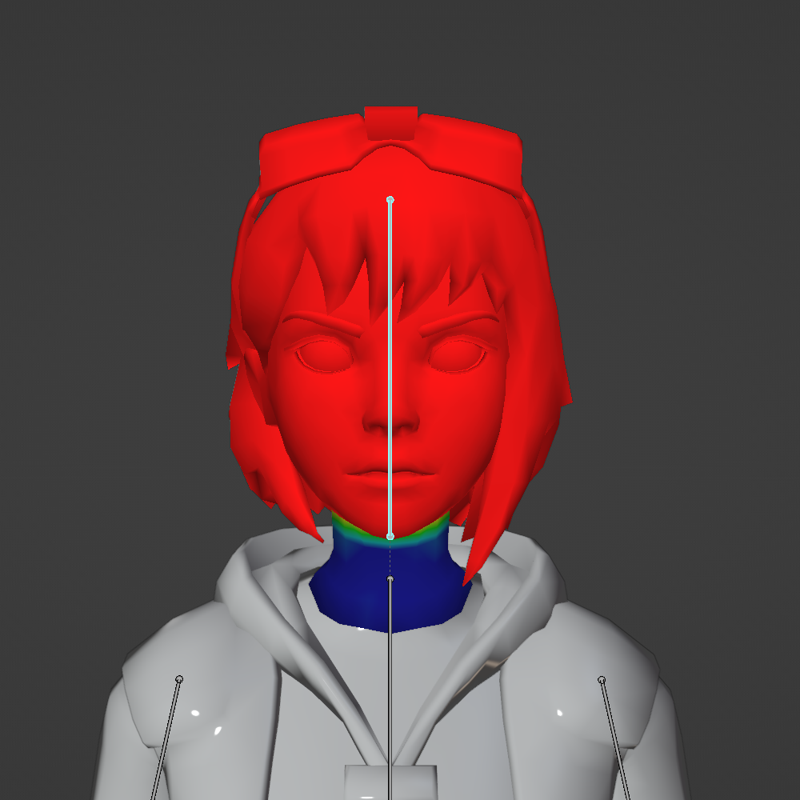
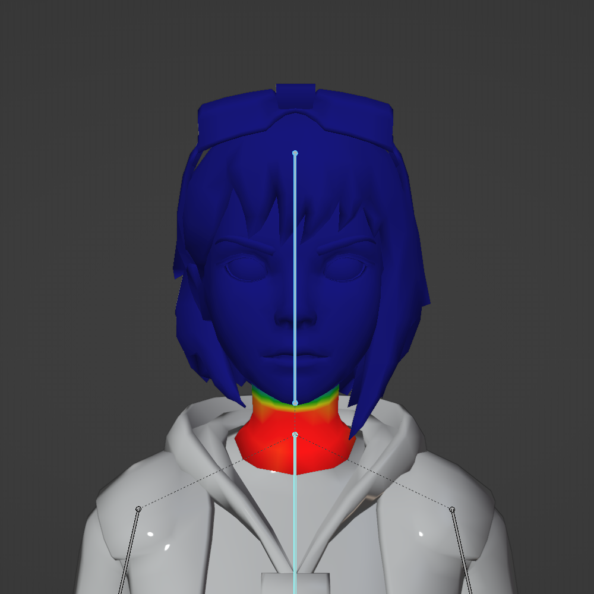

# Skinning a Humanoid Model

## 목차
- [Skinning a Humanoid Model](#skinning-a-humanoid-model)
  - [목차](#목차)
  - [Blender 설정](#blender-설정)
    - [뼈 시각화](#뼈-시각화)
    - [자동 정규화](#자동-정규화)
  - [웨이트 페인팅](#웨이트-페인팅)
    - [머리 메시 페인팅](#머리-메시-페인팅)
    - [팔 메시 페인팅](#팔-메시-페인팅)
      - [손](#손)
      - [하부 팔](#하부-팔)
      - [상부 팔](#상부-팔)
      - [어깨](#어깨)
  - [출처](#출처)
  - [다음](#다음)

---

휴머노이드 스킨 메시 모델은 포즈를 취하거나 애니메이션을 적용할 때 관절 부위에서 자연스럽게 구부러지고 늘어나는 캐릭터 모델입니다. [Blender](https://www.blender.org)나 [Maya](https://www.autodesk.com/products/maya/overview)와 같은 서드파티 모델링 도구를 사용하여 스킨 메시를 만들 수 있습니다.

이 가이드는 [휴머노이드 모델 리깅](./01_04_Rigging_a_Humanoid_Model.md)에서 완료된 휴머노이드 모델을 Blender에서 R15 모델로 스킨닝하는 고급 가이드입니다. 휴머노이드 모델을 스킨닝하기 전에 [간단한 메시 스킨닝](./01_03_Skinning_a_Simple_Mesh.md)의 기본 개념을 숙지해야 합니다.

Blender에서 휴머노이드 모델을 스킨닝하려면 다음 단계를 수행해야 합니다:

- [Blender 설정](#blender-설정)에서 뼈 시각화 설정과 자동 정규화를 통해 웨이트 페인팅 프로세스를 최적화합니다.
- 휴머노이드 리그 아키텍처의 두 개 이상의 뼈 사이에서 정점의 영향을 균형 있게 조정하여 메시 객체의 정점을 [웨이트 페인팅](#웨이트-페인팅)합니다.

<Alert severity="info">
이 가이드는 [휴머노이드 모델 리깅](./01_04_Rigging_a_Humanoid_Model.md)에서 리깅된 휴머노이드 모델과 [Blender 버전 3.0](https://www.blender.org/download/releases/3-0/)을 사용합니다. 다른 버전의 Blender를 사용하는 경우 UI 및 설정에 약간의 차이가 있을 수 있습니다.
</Alert>

## Blender 설정

이 가이드는 [휴머노이드 모델 리깅](./01_04_Rigging_a_Humanoid_Model.md)에서 완료된 리깅 모델을 사용합니다. 이 가이드와 함께 진행하려면 리깅된 모델 [Blender 프로젝트](https://prod.docsiteassets.roblox.com/assets/modeling/meshes/reference-files/lola-rigged-r15.blend)를 다운로드할 수 있습니다.

리깅된 캐릭터를 스킨닝하는 프로세스를 최적화하려면, 먼저 Blender 프로젝트에서 다음을 설정합니다:

- Blender 프로젝트를 열고 [뼈 시각화](#뼈-시각화) 설정을 구성합니다.
- 웨이트 페인팅 프로세스를 최적화하기 위해 [자동 정규화](#자동-정규화)를 활성화합니다.

### 뼈 시각화

기본적으로 Blender는 뼈 객체를 팔면체 모양으로 표시합니다. 이 기본 모양은 뼈를 위치시키는 데 유용하지만 웨이트 페인팅할 때 방해가 될 수 있습니다. 웨이트 페인팅 프로세스 동안 시각화를 돕기 위해 뼈 시각화를 스틱으로 변경합니다.

뼈 시각화를 업데이트하려면:

1. 객체 모드에서 **armature**를 클릭합니다.
2. **객체 데이터 속성**에서 **Display As** 값을 **Sticks**로 변경합니다.

   <video controls src="../img/01_05_Skinning_a_Humanoid_Model/1-bone-visualizations.mp4" width="100%"></video>

### 자동 정규화

자동 정규화 설정은 정점에 대한 영향을 1로 강제합니다. 이는 캐릭터의 각 정점이 최소한 하나의 뼈에 완전히 영향을 받도록 하여 여러 메시와 뼈에 대한 웨이트 페인팅을 더 효율적으로 만듭니다. 자세한 내용은 Blender의 [자동 정규화](https://docs.blender.org/manual/en/latest/sculpt_paint/weight_paint/tool_settings/options.html) 문서를 참조하십시오.

자동 정규화는 또한 정점이 여러 뼈에 의해 완전히 영향을 받는 경우를 방지하고 일반적인 웨이트 페인팅 실수를 예방할 수 있습니다.

<!-- <GridContainer numColumns="2">
  <figure>
    <video controls src="../img/01_05_Skinning_a_Humanoid_Model/autonormalize-example2.mp4"></video>
    <figcaption>자동 정규화가 없으면 이 완전히 영향을 받는 머리가 다른 뼈에도 영향을 받는지 테스트할 때까지 명확하지 않습니다.</figcaption>
  </figure>
  <figure>
    <video controls src="../img/01_05_Skinning_a_Humanoid_Model/autonormalize-example.mp4"></video>
    <figcaption>자동 정규화를 사용하면 잘못된 뼈에 영향을 페인팅해도 기존 뼈의 영향을 제거합니다. 이렇게 하면 실수를 쉽게 발견하고 수정할 수 있습니다.</figcaption>
  </figure>
</GridContainer> -->

|<video controls src="../img/01_05_Skinning_a_Humanoid_Model/autonormalize-example2.mp4"></video>|<video controls src="../img/01_05_Skinning_a_Humanoid_Model/autonormalize-example.mp4"></video>|
|---|---|
|자동 정규화가 없으면 이 완전히 영향을 받는 머리가 다른 뼈에도 영향을 받는지 테스트할 때까지 명확하지 않습니다.|자동 정규화를 사용하면 잘못된 뼈에 영향을 페인팅해도 기존 뼈의 영향을 제거합니다. 이렇게 하면 실수를 쉽게 발견하고 수정할 수 있습니다.|

<Alert severity="warning">
Studio는 단일 정점에 4개 이상의 뼈가 영향을 미치는 것을 지원하지 않습니다. 이는 복잡한 리그에서 발생할 수 있거나 자동 정규화가 비활성화된 경우 발생할 수 있습니다.
</Alert>

자동 정규화를 활성화하려면:

1. **객체 모드**에서 **armature**를 선택합니다.
2. <kbd>Shift</kbd>를 누른 상태에서 모델의 **임의의 메시 객체**를 선택합니다.
3. 3D 뷰포트 상단의 모드 드롭다운을 클릭하고 **웨이트 페인트** 모드로 전환합니다.
4. 뷰포트 오른쪽의 **도구** 탭을 확장합니다.
5. **옵션**에서 **자동 정규화**를 활성화합니다.

<video controls src="../img/01_05_Skinning_a_Humanoid_Model/2-auto-normalize.mp4" width="100%"></video>

## 웨이트 페인팅

웨이트 페인팅은 뼈가 메시의 부분에 미치는 특정 웨이트 또는 영향을 페인팅 워크플로를 사용하여 적용합니다. 웨이트 페인팅이나 기타 도구를 통해 영향을 적용하는 추가적인 방법도 있으며, 이는 [간단한 메시 스킨닝](./01_03_Skinning_a_Simple_Mesh.md)에서 다룹니다. 스킨닝 및 웨이트 적용에 대한 자세한 내용은 Blender의 [캐릭터 리깅](https://www.youtube.com/watch?v=f2pTkW-1JkE) 및 [정점 그룹](https://www.youtube.com/watch?v=dKZrzG5r13g) 기본 가이드를 참조하십시오.

이 가이드는 휴머노이드 모델의 머리와 팔 메시에 웨이트 페인팅하는 한 가지 과정을 다룹니다. 이러한 웨이트 페인팅 기술을 사용하여 모델의 나머지 부분도 웨이트 페인팅할 수 있습니다.

<Alert severity="warning">
휴머노이드 리그의 Root 또는 HumanoidRootNode 부모 뼈에 영향을 적용하지 마십시오. 추가된 영향은 Studio로 가져올 때 삭제됩니다.
</Alert>

### 머리 메시 페인팅

머리 메시는 목의 하단 정점에서 상체에 연결됩니다. 모델에서 현실적인 구부러짐을 만들려면, 머리 메시는 목선 근처에서 머리 뼈와 상체 뼈의 영향을 공유해야 합니다.

머리 메시 객체를 웨이트 페인팅하려면:

1. 객체 모드에서 **armature**를 클릭한 다음 <kbd>Shift</kbd>를 누른 상태에서 **머리 메시 객체**를 클릭합니다.
2. 모드 드롭다운에서 **웨이트 페인트** 모드로 전환합니다.
3. <kbd>Shift</kbd>를 누른 상태에서 **상체 뼈**를 클릭합니다. 상체가 아직 머리 정점에 영향을 미치지 않았으므로 머리는 완전히 파란색이어야 합니다.

   <video controls src="../img/01_05_Skinning_a_Humanoid_Model/3-select-head.mp4" width="100%"></video>

   <Alert severity="info">
   일반적인 오류는 잘못된 뼈를 선택한 상태에서 웨이트를 적용하는 것입니다. 웨이트를 적용할 때 올바른 뼈를 <kbd>Shift</kbd> 선택 및 선택 해제하십시오. 현재 페인팅 중인 뼈의 이름은 뷰포트에 표시됩니다.
   </Alert>

4. 뷰포트 오른쪽 상단에서 **도구** 메뉴를 열고 **브러시 강도**를 **1**로 설정합니다.
5. 상체 뼈가 선택된 상태에서, 모델의 목선 부분에 **페인팅**합니다. 상체 메시를 임시로 **숨기기**하여 목 하단에 직접 접근할 수 있습니다.
   <video controls src="../img/01_05_Skinning_a_Humanoid_Model/4-weight-paint-head.mp4" width="100%"></video>

6. 언제든지 <kbd>Shift</kbd>를 누른 상태에서 상체 뼈를 선택 해제하고 머리 뼈를 선택하여 적용된 영향을 확인합니다. <kbd>R</kbd>을 눌러 머리 뼈를 회전시키고 메시 객체가 머리와 상체 뼈 사이에서 어떻게 영향을 공유하는지 테스트합니다.
   <video controls src="../img/01_05_Skinning_a_Humanoid_Model/5-test-head.mp4" width="100%"></video>

7. 추가 페인팅이 필요한 경우, <kbd>Shift</kbd>를 누른 상태에서 영향을 추가하거나 제거할 뼈를 선택하고 브러시 도구를 사용하여 적용합니다.

모델의 머리를 웨이트 페인팅한 최종 결과는 머리 메시가 머리 뼈와 상체 뼈의 영향을 균형 있게 공유해야 합니다:

<!-- <GridContainer numColumns="2">
  <figure>
    
    <figcaption>머리 뼈는 목 위의 Head_Geo 메시에 완전히 영향을 미칩니다.</figcaption>
  </figure>
  <figure>
    
    <figcaption>상체 뼈는 목 아래의 Head_Geo 메시에 완전히 영향을 미칩니다.</figcaption>
  </figure>
</GridContainer> -->

|||
|---|---|
|머리 뼈는 목 위의 Head_Geo 메시에 완전히 영향을 미칩니다.|상체 뼈는 목 아래의 Head_Geo 메시에 완전히 영향을 미칩니다.|

### 팔 메시 페인팅

머리 뼈와 상체 뼈 사이의 영향을 균형 있게 조정하는 과정과 유사하게, 팔과 다리에도 유사한 웨이트 페인팅 과정이 필요합니다.

오른팔에는 Right Hand, Right Lower Arm, Right Upper Arm이 있으며, 각각의 대응하는 뼈가 있습니다. 다음 지침은 모든 팔 메시 객체에 영향을 페인팅하는 방법에 대한 지침을 제공합니다. 그런 다음 이러한 기술을 모델의 나머지 메시에도 적용할 수 있습니다.

#### 손

오른손의 경우, **손 뼈**와 **하부 팔 뼈** 사이에서 메시의 영향을 균형 있게 조정하여 손목에서 자연스러운 구부러짐을 만듭니다.

오른손에 영향을 웨이트 페인팅하려면:

1. 객체 모드에서 **armature**를 클릭하고 <kbd>Shift</kbd>를 누른 상태에서 오른손 **geometry**를 클릭합니다.
2. 모드 드롭다운에서 **웨이트 페인트** 모드로 전환합니다. 이 모드에서 손 뼈를 선택한 상태에서 <kbd>R</kbd>을 눌러 손 메시 객체의 현재 회전을 테스트할 수 있습니다.

   <video controls src="../img/01_05_Skinning_a_Humanoid_Model/6-select-hand-and-test.mp4" width="100%"></video>

3. 뷰포트 오른쪽 상단에서 **도구** 메뉴를 열고 **브러시 강도**를 **1**로 설정합니다.
4. 하부 팔 뼈가 선택된 상태에서, 모델의 손목에 **페인팅**합니다. 하부 팔 메시를 임시로 **숨기기**하여 손목에 더 잘 접근할 수 있습니다.

   <video controls src="../img/01_05_Skinning_a_Humanoid_Model/7-weight-paint-hand.mp4" width="100%"></video>

5. 웨이트 페인팅하는 동안 및 후에 뼈를 선택한 상태에서 <kbd>R</kbd>을 눌러 회전과 유연성을 테스트합니다.

   <video controls src="../img/01_05_Skinning_a_Humanoid_Model/8-test-hand.mp4" width="100%"></video>

<Alert severity="info">
손가락과 같은 추가 제어를 위해 추가 뼈를 추가하고 스킨할 수 있습니다.

추가된 뼈 객체는 메시에 스킨되어 있지만 LowerTorso, LeftFoot, Right UpperArm과 같은 휴머노이드 뼈 객체 이름을 공유하지 않으면, 3D 모델링 소프트웨어에서 할당된 이름으로 Studio에 `Bone`으로 가져옵니다.
</Alert>

#### 하부 팔

오른손의 손목을 웨이트 페인팅한 후, 하부 팔 메시의 영향을 **하부 팔 뼈**와 **상부 팔 뼈** 사이에서 균형 있게 조정하여 팔꿈치에서 자연스러운 구부러짐을 만듭니다.

하부 팔에 영향을 웨이트 페인팅하려면:

1. 객체 모드로 다시 전환합니다.
2. **armature**를 클릭하고 <kbd>Shift</kbd>를 누른 상태에서 오른쪽 **하부 팔** geometry를 클릭합니다.
3. 모드 드롭다운에서 **웨이트 페인트** 모드로 전환합니다.
4. <kbd>Shift</kbd>를 눌러 다른 뼈를 선택 해제하고 하부 팔 뼈만 남깁니다. 강조 표시된 하부 팔 뼈의 현재 회전을 <kbd>R</kbd>을 눌러 테스트할 수 있습니다.

   <video controls src="../img/01_05_Skinning_a_Humanoid_Model/9-switch-to-lower-arm.mp4" width="100%"></video>

5. <kbd>Shift</kbd>를 눌러 상부 팔 뼈를 선택합니다.
6. 상부 팔 뼈가 선택된 상태에서, 모델의 팔꿈치에 **페인팅**합니다. 상부 팔 메시를 임시로 **숨기기**하여 팔꿈치에 더 잘 접근할 수 있습니다.
7. 웨이트 페인팅하는 동안 및 후에 하부 팔 뼈를 선택한 상태에서 <kbd>R</kbd>을 눌러 회전과 유연성을 테스트합니다.

   <video controls src="../img/01_05_Skinning_a_Humanoid_Model/10-weight-paint-lower-arm.mp4" width="100%"></video>

#### 상부 팔

오른쪽 하부 팔의 팔꿈치를 웨이트 페인팅한 후, 상부 팔 메시의 영향을 **상부 팔 뼈**와 **상체 뼈** 사이에서 균형 있게 조정하여 겨드랑이에서 자연스러운 구부러짐을 만듭니다.

상부 팔에 영향을 웨이트 페인팅하려면:

1. 객체 모드로 다시 전환합니다.
2. **armature**를 클릭하고 <kbd>Shift</kbd>를 누른 상태에서 오른쪽 **상부 팔** geometry를 클릭합니다.
3. 모드 드롭다운에서 **웨이트 페인트** 모드로 전환합니다.
4. <kbd>Shift</kbd>를 눌러 다른 뼈를 선택 해제하고 상부 팔 뼈만 남깁니다. 강조 표시된 상부 팔 뼈의 현재 회전을 <kbd>R</kbd>을 눌러 테스트할 수 있습니다.

   <video controls src="../img/01_05_Skinning_a_Humanoid_Model/11-switch-to-upper-arm.mp4" width="100%"></video>

5. <kbd>R</kbd>을 눌러 마우스를 드래그하여 상부 팔을 수평으로 회전시킵니다. 이렇게 하면 겨드랑이의 정점에 더 쉽게 접근할 수 있습니다.
6. <kbd>Shift</kbd>를 눌러 상체 뼈를 선택합니다.
7. 상체 뼈가 선택된 상태에서, 모델의 겨드랑이에 **페인팅**합니다. 상체 메시를 임시로 **숨기기**하여 팔꿈치에 더 잘 접근할 수 있습니다.
8. 웨이트 페인팅하는 동안 및 후에 상부 팔 뼈를 선택한 상태에서 <kbd>R</kbd>을 눌러 회전과 유연성을 테스트합니다.
   <video controls src="../img/01_05_Skinning_a_Humanoid_Model/12-weight-paint-upper-arm.mp4" width="100%"></video>

#### 어깨

겨드랑이를 웨이트 페인팅한 후, 상체 메시의 영향을 **상체 뼈**와 **상부 팔 뼈** 사이에서 균형 있게 조정하여 팔을 움직일 때 어깨에서 자연스러운 구부러짐을 만듭니다. 이 움직임은 미세하기 때문에 이러한 정점에 부분 강도 영향을 적용하기만 하면 됩니다.

상체에 부분 강도 영향을 웨이트 페인팅하려면:

1. 객체 모드로 다시 전환합니다.
2. **armature**를 클릭하고 <kbd>Shift</kbd>를 누른 상태에서 **상체** geometry를 클릭합니다.
3. 모드 드롭다운에서 **웨이트 페인트** 모드로 전환합니다.
4. <kbd>Shift</kbd>를 눌러 다른 뼈를 선택 해제하고 상부 팔 뼈만 남깁니다. 강조 표시된 상부 팔 뼈의 현재 회전을 <kbd>R</kbd>을 눌러 테스트할 수 있습니다.

   <video controls src="../img/01_05_Skinning_a_Humanoid_Model/13-switch-to-upper-torso.mp4" width="100%"></video>

5. 뷰포트 오른쪽 상단에서 **도구** 메뉴를 열고 **브러시 강도**를 **.25**로 설정합니다. 테스트 결과에 따라 이 값을 조정할 수 있습니다.
6. 상체 뼈가 선택된 상태에서, 모델의 어깨에 **페인팅**합니다.
7. 웨이트 페인팅하는 동안 및 후에 상부 팔 뼈를 선택한 상태에서 <kbd>R</kbd>을 눌러 상체에 영향을 주는 회전과 유연성을 테스트합니다.
   <video controls src="../img/01_05_Skinning_a_Humanoid_Model/14-weight-paint-upper-torso.mp4" width="100%"></video>

   <Alert severity = 'warning'>
   <GridContainer numColumns="2">
   <figure>
    
   </figure>
   <figure>
   팔을 최대한 움직일 때, 어깨와 상체 사이에서 피부가 볼륨을 잃고 자연스럽게 변형되지 않는 캔디랩핑 효과가 발생할 수 있습니다. 이 효과는 많은 경우에 피할 수 없을 수 있습니다.
   </figure>
   </GridContainer>
   </Alert>

이러한 과정을 사용하여 모델의 나머지 사지를 웨이트 페인팅할 수 있습니다. 완료되면 Blender 내보내기 설정을 사용하여 스킨된 모델을 `.fbx`로 [내보낼](https://create.roblox.com/docs/art/modeling/export-requirements) 수 있습니다. 참조용으로, 완전히 스킨된 모델이 포함된 [Blender 프로젝트](https://prod.docsiteassets.roblox.com/assets/modeling/meshes/reference-files/lola-skinned-s15.blend)를 다운로드할 수 있습니다.

<Alert severity="warning">
이 참조 모델은 아직 [내부 및 외부 케이지 메시 데이터](https://create.roblox.com/docs/art/characters/specifications#inner-and-outer-cages)가 없기 때문에, 이 모델은 레이어드 의류나 액세서리를 착용할 수 없습니다.
</Alert>

---
## 출처
 - [Skinning a Humanoid Model](https://create.roblox.com/docs/art/modeling/skinning-a-humanoid-model.md)

---
## [다음](./02_01_Playing_Background_Music.md)