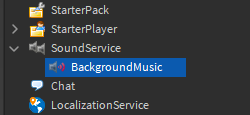
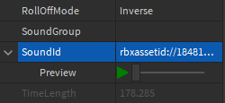
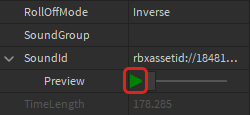
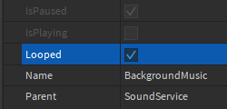
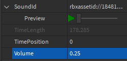

# Playing Background Music

## 목차
- [Playing Background Music](#playing-background-music)
  - [목차](#목차)
  - [음악 재생하기](#음악-재생하기)
    - [사운드 설정](#사운드-설정)
    - [노래 재생하기](#노래-재생하기)
    - [오디오 속성](#오디오-속성)
  - [출처](#출처)
  - [다음](#다음)

---

Roblox에서 오디오는 `Sound` 객체를 사용하여 생성됩니다. 사운드는 폭포 소리와 같이 위치 기반일 수도 있고 모든 플레이어에게 보편적일 수도 있습니다. 이 튜토리얼에서는 배경 음악을 재생하는 보편적인 사운드를 만드는 방법을 보여줍니다.

<video controls>
   <source src="../img/02_01_Playing_Background_Music/introToSound_bgMusic_web.mp4" />
</video>

## 음악 재생하기

음악을 [업로드](https://create.roblox.com/docs/sound/assets#importing-custom-audio)하거나 수천 개의 무료 트랙이 포함된 [마켓플레이스에서 얻을 수 있습니다](https://create.roblox.com/docs/sound/assets#finding-audio-assets). 이 튜토리얼에서는 트랙의 **에셋 ID**가 필요합니다.

기본 단계는 에셋 ID를 복사하고, `Sound` 객체를 만들고, 스크립트를 사용하여 음악을 재생하는 것입니다.

### 사운드 설정

사운드 객체가 파트에 상위로 설정되면, 사운드는 해당 위치에서 방출됩니다. 사운드 객체가 **SoundService**에 상위로 설정되면, 게임 월드의 모든 지점에서 동일한 볼륨으로 재생됩니다. 이것은 SoundService가 배경 음악을 저장하는 데 이상적이라는 것을 의미합니다.

1. **SoundService**에 **Sound** 객체를 삽입하고 이름을 **BackgroundMusic**으로 지정합니다.

   

2. 새로 생성된 사운드에서 **SoundId** 속성을 찾습니다. 이전에 복사한 사운드 ID를 붙여넣고 <kbd>Enter</kbd>를 누릅니다.

   

3. 사운드가 작동하는지 확인하려면 미리보기 버튼을 클릭합니다.

   

다음은 사용할 수 있는 샘플 음악 ID입니다:

- **Creepy Organ/Dungeon** - `rbxassetid://1843463175`
- **Upbeat Electronica** - `rbxassetid://1837849285`
- **Grandiose Fantasy** - `rbxassetid://1848183670`

### 노래 재생하기

배경 음악은 스크립트를 통해 게임에서 재생할 수 있습니다.

1. **StarterPlayer** > **StarterPlayerScripts**에서 **LocalScript**를 생성하고 이름을 **MusicPlayer**로 지정합니다.

   

2. 스크립트에서 **SoundService**와 **BackgroundMusic** 객체를 저장할 변수를 만듭니다.

   ```lua
   local SoundService = game:GetService("SoundService")
   local backgroundMusic = SoundService.BackgroundMusic
   ```

3. 사운드는 `Class.Sound:Play()|Play` 함수를 사용하여 재생됩니다. 새로운 줄에 `backgroundMusic` 변수에서 이 함수를 호출합니다.

   ```lua
   local SoundService = game:GetService("SoundService")
   local backgroundMusic = SoundService.BackgroundMusic

   backgroundMusic:Play()
   ```

4. 게임을 테스트하고 음악이 들리는지 확인합니다.

### 오디오 속성

현재 음악은 반복되지 않습니다. 또한 원래 사운드 파일이 배경 음악으로는 너무 시끄러울 수 있습니다. 이러한 설정은 두 가지 속성을 통해 변경할 수 있습니다.

1. **BackgroundMusic** 속성에서 **Looped**를 **on**으로 전환합니다.

   

2. **Volume**을 약 **0.25**로 낮춥니다.

   

이 프로젝트가 완료되면 스크립트를 사용하여 음악에 다른 기능을 구현해 보세요. 예를 들어, 사운드트랙에서 곡을 섞어 재생하거나 게임 월드의 다른 영역에서 노래를 재생하는 스크립트를 시도해보세요.

사운드와 배경 음악에 대한 자세한 내용은 [오디오](https://create.roblox.com/docs/sound)를 참조하세요.

---
## 출처
 - [Playing Background Music](https://create.roblox.com/docs/tutorials/building/environments/playing-background-music)

---
## [다음](./02_02_In_Game_Sounds.md)