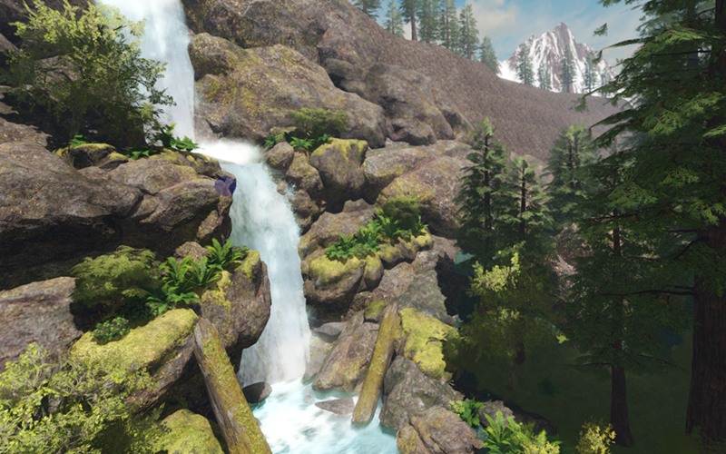
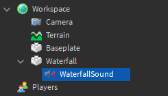
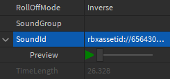
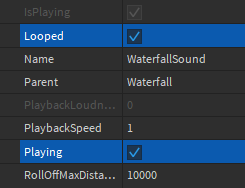
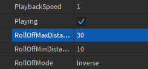
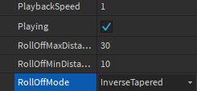
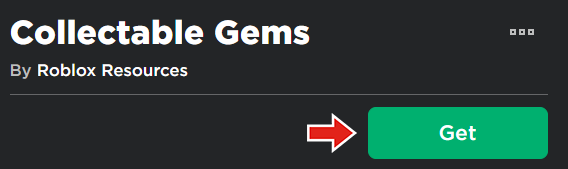
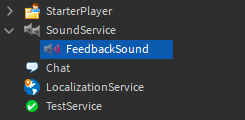

# In-Game Sounds

## 목차
- [In-Game Sounds](#in-game-sounds)
  - [목차](#목차)
  - [위치 기반 사운드](#위치-기반-사운드)
    - [사운드 생성](#사운드-생성)
    - [사운드 거리 조정](#사운드-거리-조정)
    - [롤오프 미세 조정](#롤오프-미세-조정)
  - [피드백 사운드](#피드백-사운드)
    - [수집품 설정](#수집품-설정)
    - [스크립트 설정](#스크립트-설정)
    - [사운드 재생](#사운드-재생)
  - [출처](#출처)
  - [다음](#다음)

---

게임 내 오디오는 플레이어의 경험을 향상시킬 수 있습니다. 이 튜토리얼에서는 **위치 기반** 사운드와 **피드백** 사운드의 두 가지 형태의 게임 내 소리를 다룹니다.

첫 번째 예제에서는 폭포를 위한 위치 기반 사운드를 생성합니다. 두 번째 예제에서는 플레이어가 수집 가능한 아이템을 터치할 때 징글을 재생하는 스크립트를 사용합니다.

## 위치 기반 사운드

**Sound** 객체가 파트나 부착물에 상위로 설정되면 위치 기반이 됩니다. 오디오는 해당 위치에서 방출되며, 플레이어가 가까워질수록 소리가 커집니다. 이 폭포의 경우도 마찬가지입니다.

<video controls muted>
    <source src="../img/02_02_In_Game_Sounds/ingameSounds-waterfall-web.mp4" />
</video>

### 사운드 생성

1. 원하는 파트에서 **Sound** 객체를 생성하고 **WaterfallSound**로 이름을 지정합니다.

   <GridContainer numColumns="2">
     
     
   </GridContainer>

2. 속성에서 **SoundId**를 찾아서 이 폭포 환경 소리로 변경합니다: `rbxassetid://6564308795`.

   

   <Alert severity="info">
   사용자 지정 소리는 [에셋 관리자](https://create.roblox.com/docs/projects/assets/manager)를 사용하여 가져올 수 있습니다. 또한 Roblox와 커뮤니티가 업로드한 무료 소리는 [툴박스](https://create.roblox.com/docs/projects/assets/toolbox)를 통해 찾을 수 있습니다.
   </Alert>

3. 게임이 시작될 때 연속 재생되도록 **Playing**과 **Looped**를 **on**으로 전환합니다.

   

4. 게임을 테스트하여 폭포 소리가 들리는지 확인합니다.

### 사운드 거리 조정

테스트 시, 플레이어가 객체에서 멀리 떨어져 있어도 오디오가 즉시 재생되는 것을 확인할 수 있습니다. 롤오프 속성을 사용하여 플레이어가 사운드를 듣는 거리를 수정하여 페이드 효과를 만들 수 있습니다.

1. `RollOffMaxDistance`를 **30**으로 변경합니다. 이 속성은 스터드 단위로 측정됩니다.

   

2. 부드러운 페이드를 위해 **RollOffMode**를 **InverseTapered**로 변경합니다. 이로 인해 소리 접근이 덜 갑작스럽게 느껴집니다.

   

3. 프로젝트를 실행합니다. 소리가 객체 근처에서만 들리는 것을 확인할 수 있습니다.

   <video controls muted>
   <source src="../img/02_02_In_Game_Sounds/ingameSounds-waterfall-web.mp4" />
   </video>

### 롤오프 미세 조정

필요에 따라 특수 효과나 현실감을 높이기 위해 다양한 속성을 조정할 수 있습니다. 다음 속성을 참조하세요:

- `RollOffMinDistance` - 소리가 볼륨을 감소시키기 시작하는 최소 거리(스터드 단위).
- `SoundGroup` - 배경 음악 및 게임 내 효과와 같은 소리 그룹 간의 볼륨을 조정하고 균형을 맞추는 데 사용됩니다.

## 피드백 사운드

사운드는 스크립트를 사용하여 명령에 따라 재생할 수 있습니다. 플레이어가 파트를 터치하거나 메뉴와 상호 작용하는 이벤트에 사운드를 연결할 수 있습니다. 여기에서는 플레이어가 수집 가능한 아이템을 터치할 때 징글을 재생하는 스크립트를 생성합니다.

<video controls muted>
    <source src="../img/02_02_In_Game_Sounds/ingameSounds-collectables.mp4" />
</video>

### 수집품 설정

이 튜토리얼의 나머지 부분에서는 미리 만들어진 모델을 사용합니다. 이 모델에는 플레이어가 보석을 수집할 수 있는 파트와 스크립트가 포함되어 있습니다.

1. 브라우저에서 [수집 가능한 보석 모델](https://www.roblox.com/library/6564500052/Collectable-Gems) 페이지를 열고 **가져오기** 버튼을 클릭합니다.

   

- Studio에서 **보기** 탭으로 이동하여 **툴박스**를 클릭합니다.
- 툴박스 창에서 **인벤토리** 버튼을 클릭합니다. 그런 다음 드롭다운이 **내 모델**로 설정되어 있는지 확인합니다.
- **수집 가능한 보석** 모델을 선택하여 게임에 추가합니다.

1. **SoundService**에서 **Sound**를 새로 생성하고 이름을 **FeedbackSound**로 지정합니다.

   

2. FeedbackSound에서 **SoundId**를 `rbxassetid://4110925712`로 설정합니다. 이는 모델 페이지에서 다운로드한 간단한 징글의 SoundId입니다.

   

### 스크립트 설정

1. **StarterPlayer** > **StarterPlayerScripts**에서 새 로컬 스크립트를 생성하고 이름을 **CollectableSounds**로 지정합니다.

2. 아래 코드는 플레이어가 수집 가능한 아이템을 터치할 때마다 `partTouched` 함수를 실행합니다. 코드를 스크립트에 복사합니다.

   ```lua
   local pickupObjects = workspace.Collectables.Objects
   local objectsArray = pickupObjects:GetChildren()

   local function partTouched(otherPart, objectPart)
   	local whichCharacter = otherPart.Parent
   	local humanoid = whichCharacter:FindFirstChildWhichIsA("Humanoid")

   	if humanoid and objectPart.CanCollide == true then

   	end
   end

   -- 모든 객체 파트를 터치 함수에 연결하여 모든 파트에서 작동하도록 합니다
   for objectIndex = 1, #objectsArray do
   	local objectPart = objectsArray[objectIndex]
   	objectPart.Touched:Connect(function(otherPart)
   		partTouched(otherPart, objectPart)
   	end)
   end
   ```

### 사운드 재생

1. **SoundService**에 대한 변수를 생성한 후 **feedback sound**를 저장할 변수를 생성합니다.

   ```lua
   local pickupObjects = workspace.Collectables.Objects
   local objectsArray = pickupObjects:GetChildren()

   local SoundService = game:GetService("SoundService")
   local feedbackSound = SoundService:FindFirstChild("FeedbackSound")

   local function partTouched(otherPart, objectPart)
   ```

2. 징글을 재생하려면 `partTouched` 함수에서 if 문 내에 `feedbackSound:Play()`를 호출합니다.

   ```lua
   local function partTouched(otherPart, objectPart)
   	local whichCharacter = otherPart.Parent
   	local humanoid = whichCharacter:FindFirstChildWhichIsA("Humanoid")

   	-- 사운드를 재생한 후 객체를 제거합니다
   	if humanoid and objectPart.CanCollide == true then
   		feedbackSound:Play()
   	end
   end
   ```

3. 게임을 테스트하여 플레이어가 수집 가능한 아이템을 터치할 때 그것이 사라지고 소리가 재생되는지 확인합니다.

   <video controls muted>
   <source src="../img/02_02_In_Game_Sounds/ingameSounds-collectables.mp4" />
   </video>

---
## 출처
 - [In-Game Sounds](https://create.roblox.com/docs/tutorials/building/environments/in-game-sounds)

---
## [다음](./02_03_Creating_Flickering_Lights.md)