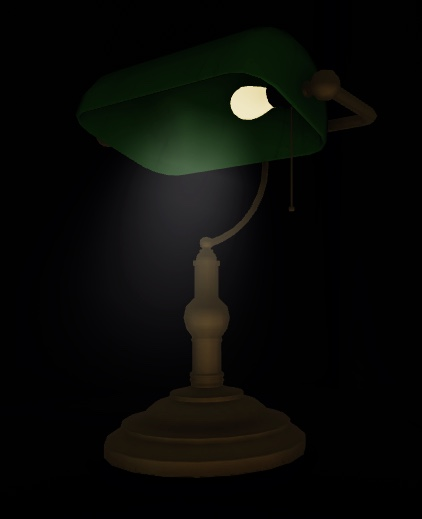
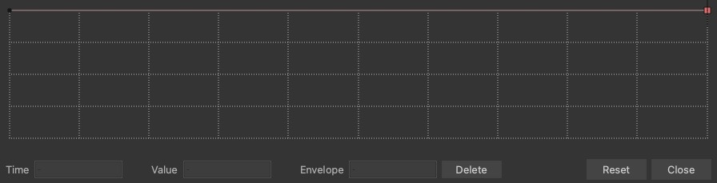
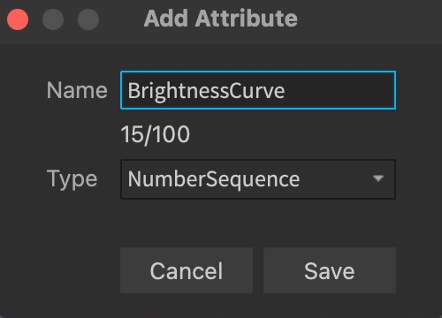
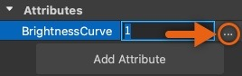
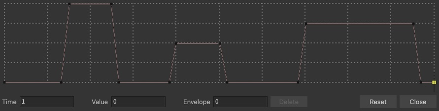
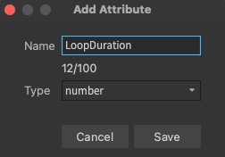

# Creating Flickering Lights

## 목차
- [Creating Flickering Lights](#creating-flickering-lights)
	- [목차](#목차)
	- [샘플 램프 가져오기](#샘플-램프-가져오기)
	- [밝기 NumberSequence 생성](#밝기-numbersequence-생성)
	- [루프 지속 시간 생성](#루프-지속-시간-생성)
	- [조명 깜박임 스크립트 작성](#조명-깜박임-스크립트-작성)
	- [출처](#출처)
	- [다음](#다음)

---

**깜박이는 조명**은 환경의 분위기를 조성하는 데 강력한 도구입니다. 예를 들어, 일정한 밝기의 조명이 있는 집은 따뜻하고 환영받는 느낌을 줄 수 있지만, 같은 집의 복도에 깜박이는 조명을 추가하면 으스스한 분위기를 조성하고 앞에 있을지도 모를 위험을 암시할 수 있습니다. 다양한 조명 소스를 전략적으로 모델링하고 스크립팅함으로써 환경 이야기의 깊이를 더할 수 있습니다.

<!-- <video controls src="../img/02_03_Creating_Flickering_Lights/Overview.mp4" width="50%"></video> -->
[](https://prod.docsiteassets.roblox.com/assets/tutorials/creating-flickering-lights/Overview.mp4)

모든 3D 창작과 마찬가지로 특정 목표를 달성하는 여러 가지 방법이 있습니다. 이 가이드에서는 Studio에서 사용할 수 있는 도구와 방법만을 사용하여 몇 가지 기본 에셋으로 깜박이는 조명 애니메이션을 빠르게 만드는 방법을 배울 수 있습니다. 여기에는 자식 `MeshParts`를 포함하는 은행원의 램프 모델 `.rbxm` 파일이 포함되어 있으며, 이를 사용자 경험에 맞게 사용자 정의할 수 있습니다.

깜박이는 조명을 만들기 위한 다음 방법에서는 각 섹션을 따라가며 다음을 만드는 방법을 배웁니다:

- 램프의 밝기를 시간에 따라 조절하는 밝기 `NumberSequence`
- 각 깜박임 루프가 걸리는 시간을 결정하는 루프 지속 시간 속성
- 두 속성이 모델의 자식 `MeshParts`와 함께 작동하여 램프의 조명을 깜박이게 하는 `Script`


   서드 파티 모델링 도구에서 사용자 에셋을 생성하고 사용자 디자인과 함께 따라할 수 있습니다. Studio에서 모델을 내보내는 방법에 대한 정보는 [내보내기 요구 사항](https://create.roblox.com/docs/art/modeling/export-requirements)을 참조하십시오.


## 샘플 램프 가져오기

이 가이드에서는 고품질의 사용자 정의 가능한 은행원의 램프 모델 `.rbxm` 파일을 다운로드하여 깜박이는 조명 기법을 시연합니다. 이 모델을 사용하여 기본 원리를 이해한 다음, Studio나 다른 서드 파티 모델링 소프트웨어에서 생성한 사용자 모델에 적용할 수 있습니다.

[BankersLamp](https://prod.docsiteassets.roblox.com/assets/tutorials/creating-flickering-lights/BankersLamp.rbxm) `.rbxm` 파일을 가져오려면:

1. **탐색기** 창에서 **Workspace**를 마우스 오른쪽 버튼으로 클릭합니다. 컨텍스트 메뉴가 표시됩니다.
2. **파일에서 삽입…**을 선택합니다. 파일 탐색기가 표시됩니다.
3. **BankersLamp** `.rbxm` 파일을 선택한 다음 **열기** 버튼을 클릭합니다. 모델이 뷰포트에 표시됩니다.

   

## 밝기 NumberSequence 생성

`NumberSequence`는 인스턴스의 수명 동안 0에서 1까지의 일련의 숫자 값을 나타내는 데이터 유형입니다. 이 데이터 유형은 램프 조명의 밝기를 수명 동안 변경하는 방법을 지정할 수 있기 때문에 깜박이는 조명을 만드는 데 유용합니다. 밝기를 짧은 시간 내에 최대 밝기에서 아무 빛도 없는 상태로 변경하면 깜박이는 효과를 얻을 수 있습니다.

`NumberSequence`의 X 축은 시간을 나타내고 Y 축은 상대적 밝기를 나타냅니다. 시퀀스 시작과 끝의 각 사각형은 밝기의 수명 동안 속성의 값을 결정하는 **키포인트**입니다. 처음에 `NumberSequence`를 만들면 그래프가 직선으로 표시되고 수명 동안 조명의 밝기 강도가 동일하게 유지되지만, 키포인트를 추가하고 이동함으로써 시퀀스 내에 곡선을 만들고 시간에 따라 램프의 밝기를 변경할 수 있습니다.



기본적으로 램프에는 밝기 `NumberSequence`가 없지만, 밝기 속성을 만들고 이를 `NumberSequence` 유형으로 설정한 다음, 다양한 값으로 키포인트를 추가하여 설정한 주기에 따라 조명이 깜박일 때까지 실험할 수 있습니다.

밝기 `NumberSequence`를 만들려면:

1. 램프 모델에 새로운 NumberSequence 속성을 추가합니다.

   1. **탐색기** 창에서 램프 모델을 선택합니다.
   2. **속성** 창에서 **속성** 섹션으로 이동한 다음 **속성 추가** 버튼을 클릭합니다. **속성 추가** 대화 상자가 표시됩니다.

   3. **속성 추가** 대화 상자에서,

      1. **이름** 필드에 **BrightnessCurve**를 입력합니다.
      2. **유형** 드롭다운 메뉴를 클릭한 다음 **NumberSequence**를 선택합니다.
      3. **저장** 버튼을 클릭합니다. 새 속성이 **속성** 창의 **속성** 섹션에 표시됩니다.

         

2. 새 **BrightnessCurve** 속성을 선택한 다음 **…** 버튼을 클릭합니다. 숫자 시퀀스 팝업이 표시됩니다.

   

3. 다음 작업 중 하나를 수행합니다:

   - 특정 시점에서 밝기를 변경하려면 키포인트를 클릭하고 위 또는 아래로 드래그하거나 **값** 필드에 값을 입력합니다.
   - 새 키포인트를 삽입하려면 그래프의 아무 지점이나 클릭합니다.
   - 키포인트를 삭제하려면 키포인트를 선택한 다음 **삭제** 버튼을 클릭합니다.
   - 밝기의 임의 범위를 추가하려면 키포인트를 클릭하고 엔벨로프 라인을 위 또는 아래로 드래그합니다. 이때 조명은 핑크색 엔벨로프 사이에서 임의의 밝기로 생성됩니다.

예를 들어, 다음 그래프는 첫 번째 깜박임에서는 최대 밝기로, 두 번째 깜박임에서는 50% 밝기로, 세 번째 깜박임에서는 75% 밝기로 깜박이게 만듭니다.



## 루프 지속 시간 생성

이제 램프 조명의 밝기가 수명 동안 어떻게 변하는지 결정하는 `NumberSequence`를 만들었으므로, 깜박임 루프가 걸리는 시간을 결정해야 합니다. 즉, 이 루프 지속 시간은 기본적으로 `NumberSequence`가 몇 초마다 반복되는지를 제어합니다.

루프 지속 시간을 생성하려면:

1. 램프 모델에 새로운 루프 지속 시간 속성을 추가합니다.

   1. **탐색기** 창에서 램프 모델을 선택합니다.
   2. **속성** 창에서 **속성** 섹션으로 이동한 다음 **속성 추가** 버튼을 클릭합니다. **속성 추가** 대화 상자가 표시됩니다.
   3. **속성 추가** 대화 상자에서,

      1. **이름** 필드에 **LoopDuration**을 입력합니다.
      2. **유형** 드롭다운 메뉴를 클릭한 다음 **Number**를 선택합니다.
      3. **저장** 버튼을 클릭합니다. 새 속성이 **속성** 창의 **속성** 섹션에 표시됩니다.

         

2. 새 **LoopDuration** 속성을 **1**로 설정합니다. 이는 `NumberSequence`가 1초 후에 반복됨을 나타냅니다.

## 조명 깜박임 스크립트 작성

이제 램프의 수명 동안 밝기를 제어하는 모든 요소가 있으므로, 모든 것이 함께 작동하여 조명을 깜박이게 하는 `Script`를 작성할 때입니다.

조명 깜박임을 스크립트로 작성하려면:

1. **탐색기** 창에서 램프 모델 위에 마우스를 가져가고 ⊕ 버튼을 클릭합니다. 컨텍스트 메뉴가 표시됩니다.
2. 메뉴에서 **스크립트**를 삽입합니다.
3. 새 스크립트에 다음 내용을 입력합니다:

```lua
local RunService = game:GetService("RunService")

-- 모델에 설정된 속성 값을 가져옵니다.
local brightnessCurve = script.Parent:GetAttribute("BrightnessCurve")
local loopDuration = script.Parent:GetAttribute("LoopDuration")

-- 변경될 모델 인스턴스의 참조를 저장합니다.
local light = script.Parent.lamp_hood.SpotLight
local bulb = script.Parent.lightbulb
local beam = script.Parent.lamp_hood.Beam

-- 변경될 속성의 원래 값을 저장합니다.
local origLightBrightness = light.Brightness
local origBeamBrightness = beam.Brightness
local origBulbColor = bulb.Color

-- 특정 시간 (nsTime)에 NumberSequence (ns)의 값을 가져옵니다.
function evaluateNumberSequence(ns: NumberSequence, nsTime: number)
	-- nsTime이 0 또는 1일 경우, 각각 첫 번째 또는 마지막 키포인트의 값을 반환합니다.
	if nsTime == 0 then
		return ns.Keypoints[1].Value
	end
	if nsTime == 1 then
		return ns.Keypoints[#ns.Keypoints].Value
	end

	-- 그렇지 않으면, 각 연속적인 키포인트 쌍을 단계적으로 처리합니다.
	for i = 1, #ns.Keypoints - 1 do
		-- 현재 키포인트와 다음 키포인트를 가져옵니다.
		local currKp = ns.Keypoints[i]
		local nextKp = ns.Keypoints[i + 1]

		-- nsTime이 키포인트의 시간 사이에 있는 경우,
		if nsTime >= currKp.Time and nsTime < nextKp.Time then
			-- nsTime이 키포인트 시간 사이에 있는 위치를 계산하고 이를 알파라고 부릅니다.
			local alpha = (nsTime - currKp.Time) / (nextKp.Time - currKp.Time)
			-- 알파를 사용하여 nsTime에 대한 값을 키포인트 사이에서 반환합니다.
			return currKp.Value + (nextKp.Value - currKp.Value) * alpha
		end
	end
end

RunService.Heartbeat:Connect(function()
	-- NumberSequence의 시간을 0과 1 사이에서 해결합니다.
	local t = time() / loopDuration
	local numberSequenceTime = t - math.floor(t)

	-- 이 시간에 대한 NumberSequence의 값을 가져옵니다.
	local brightnessValue = evaluateNumberSequence(brightnessCurve, numberSequenceTime)

	-- 이 값을 기준으로 밝기 및 색상 속성을 조정합니다.
	light.Brightness = origLightBrightness * brightnessValue
	beam.Brightness = origBeamBrightness * brightnessValue
	bulb.Color = Color3.new(
		origBulbColor.r * brightnessValue,
		origBulbColor.g * brightnessValue,
		origBulbColor.b * brightnessValue
	)
end)
```

[경험을 테스트](https://create.roblox.com/docs/studio/test-tab)할 때, Heartbeat 함수는 매 프레임마다 다음을 실행합니다:

1. 현재 시간을 기준으로 `brightnessCurve` `NumberSequence` 내의 시간(`numberSequenceTime`)을 해결합니다.
   - 시간은 0과 1 사이에 있으며, 이는 각각 NumberSequence의 시작과 끝을 나타냅니다.
2. 시간 `numberSequenceTime`에서 `brightnessCurve` `Datatype.NumberSequence`의 값(`brightnessValue`)을 해결합니다.
   - `evaluateNumberSequence()`는 모든 `NumberSequence`에 대해 시간과 관련된 값을 계산합니다.
   - 이 값은 시간에 따라 변하는 속성에 적용할 상대적 밝기 값으로 사용됩니다.
3. `brightnessValue`를 조명의 밝기, 빔의 밝기, 전구의 색상에 곱하여 속성을 변경합니다.

시간에 따른 이러한 속성의 변경은 아래의 깜박이는 효과를 가져옵니다.

<!-- <video controls src="../img/02_03_Creating_Flickering_Lights/Scripting-Light-Flicker.mp4" width="80%"></video> -->
[](https://prod.docsiteassets.roblox.com/assets/tutorials/creating-flickering-lights/Scripting-Light-Flicker.mp4)

---
## 출처
 - [Creating Flickering Lights](https://create.roblox.com/docs/tutorials/3D-art/creating-flickering-lights)

---
## [다음](./02_04_Assembling_Modular_Environments.md)