# Assembling Modular Environments

## 목차
- [Assembling Modular Environments](#assembling-modular-environments)
  - [목차](#목차)
  - [일관된 피벗 포인트 위치의 중요성](#일관된-피벗-포인트-위치의-중요성)
  - [스냅 동작 구성](#스냅-동작-구성)
  - [모듈식 자산 결합](#모듈식-자산-결합)
  - [모듈식 자산 사용자 정의](#모듈식-자산-사용자-정의)
    - [대체 사용자 정의 재료 사용](#대체-사용자-정의-재료-사용)
    - [대체 SurfaceAppearance 객체 사용](#대체-surfaceappearance-객체-사용)
    - [가시적 반복 줄이기](#가시적-반복-줄이기)
    - [장식 소품 추가](#장식-소품-추가)
  - [출처](#출처)
  - [다음](#다음)

---

**모듈식 환경**은 재사용 가능한 자산으로 구성된 3D 공간으로, 다양한 구성에서 원활하게 결합하여 더 큰 복합 객체의 변형을 만드는 데 사용됩니다. 예를 들어, Studio의 [현대 도시 템플릿](https://www.roblox.com/games/13165709401/Modern-City)은 [모듈식 빌딩 키트](https://create.roblox.com/store/asset/13168370735/Modular-Building-Kit-Modern-City) 및 [재료 팩](https://create.roblox.com/store/asset/13168345645/Modern-City-Materials-Pack)의 재사용 가능한 벽, 창문 및 문을 활용하여 전체 도심 지역을 구성하는 건물 변형을 만듭니다.

모듈식 환경을 조립하면 경험에서 개별 자산을 수동으로 만들 필요가 없기 때문에 유용합니다. 대신, 장면 전체에 다양성을 창출하기 위해 재사용하고 사용자 정의할 수 있는 몇 가지 자산만 만들면 됩니다. 이 과정은 대규모 환경을 신속하게 구축할 수 있을 뿐만 아니라 각 개별 객체가 경험 내에서 일관성을 느끼게 하는 데도 도움이 됩니다.

<!-- <GridContainer numColumns="2">
  <figure>
    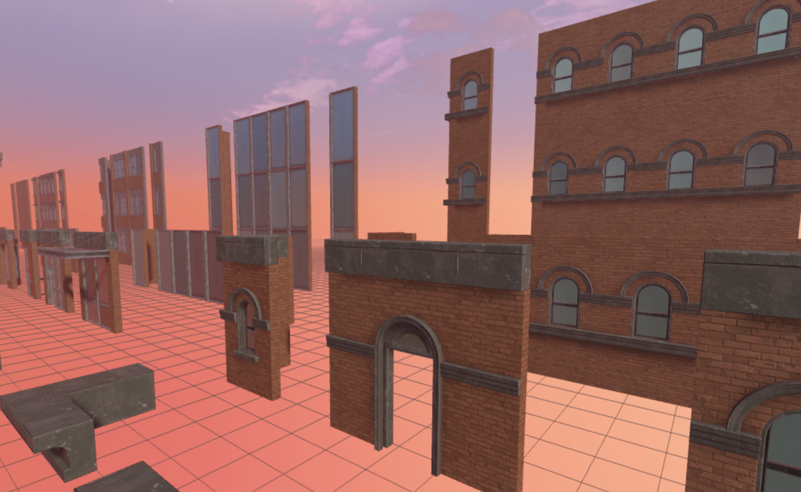
    <figcaption>샘플 모듈식 빌딩 키트</figcaption>
  </figure>
  <figure>
    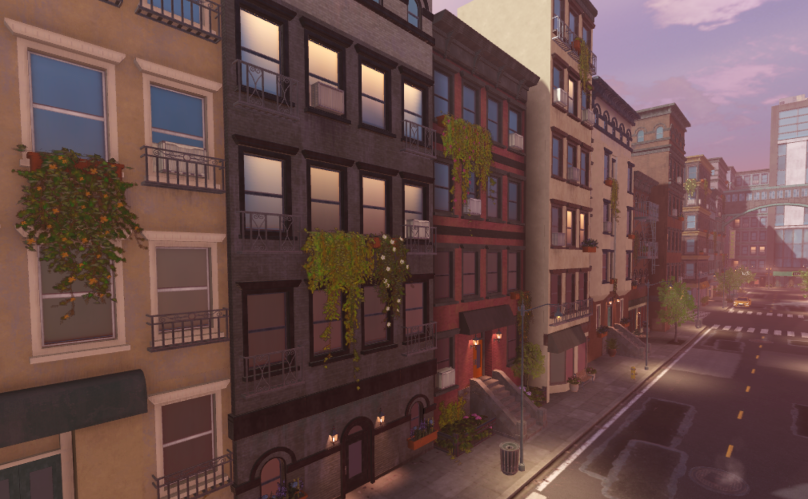
    <figcaption>Studio의 현대 도시 템플릿</figcaption>
  </figure>
</GridContainer> -->

|||
|---|---|
|샘플 모듈식 빌딩 키트|Studio의 현대 도시 템플릿|

Studio의 현대 도시 템플릿을 구축한 동일한 모듈식 빌딩 키트 조각을 사용하여, 이 가이드는 모듈식 자산이 일치하고 스냅되도록 하기 위해 일관된 피벗 포인트 위치의 중요성을 설명하고, 모듈식 자산을 결합하여 현실적인 빌딩을 만드는 방법을 보여주며, 환경 내에서 변화를 창출하기 위해 모듈식 자산을 사용자 정의하는 방법을 시연합니다.

## 일관된 피벗 포인트 위치의 중요성

Studio의 모든 객체는 피벗 포인트의 위치에 따라 이동하고 회전합니다. 기본적으로 파트와 메시는 객체의 중심에 피벗 포인트 위치를 시작하므로 이동할 때 객체의 중심에서 바깥쪽으로 이동합니다. 기본 피벗 포인트 위치는 대칭적 크기 조정 및 회전에 유용하지만, 다양한 모양의 객체를 예측 가능하고 일관된 방식으로 결합하려고 할 때 문제가 됩니다.

예를 들어, 다음 두 파트는 모두 크기 값이 [10, 10, 1]이고 기본 피벗 포인트 위치를 유지합니다. 노란색 파트를 X 축에서 5 스터드 단위로 이동하면 중심에서 가장자리로 이동하여 쉽게 파란색 파트의 양쪽에 맞추고 스냅할 수 있습니다.

<!-- <video controls src="../img/02_04_Assembling_Modular_Environments/Pivot-Points-Aligned.mp4" width="60%"></video> -->

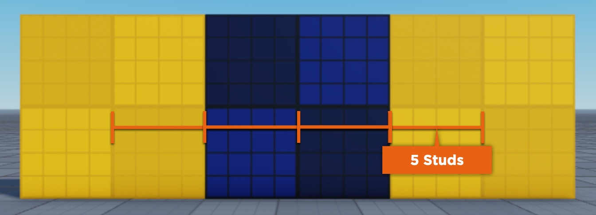

그러나 노란색 파트를 회전시키고 X 축에서 5 스터드 단위로 계속 이동하면 파란색 파트의 양쪽에 맞추고 스냅할 수 없습니다. 이는 노란색 파트의 너비가 이제 1 스터드이기 때문에, 중심에서 5 스터드 이동하면 중심에서 0.5 스터드 + 세계 그리드에서 4.5 스터드 이동하여 파란색 파트의 양쪽에 0.5 스터드 중복이 발생하기 때문입니다.

<!-- <video controls src="../img/02_04_Assembling_Modular_Environments/Pivot-Points-Misaligned.mp4" width="60%"></video> -->

<GridContainer numColumns="2">
  <figure>
    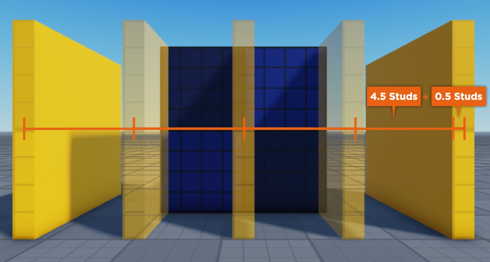
  </figure>
  <figure>
    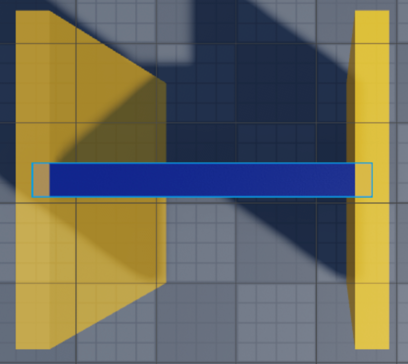
  </figure>
</GridContainer>

다시 맞추려면 스터드 이동 값 변경하거나 위치를 수동으로 조정해야 하지만, 이 과정은 많은 객체의 다양한 크기, 고유한 피벗 포인트 위치 또는 서드 파티 모델링 도구에서 만든 복잡한 기하학의 경우 빠르게 번거로워지고 지속 가능하지 않습니다.

이것이 모듈식 자산의 일관된 피벗 위치가 중요한 이유입니다. 모듈식 자산이 그리드 스냅을 활성화했을 때 서로에 대한 예측 가능한 거리에서 결합할 수 있도록 하기 위해서입니다. 예를 들어, Modern City 샘플 모듈식 빌딩 키트의 각 메시의 최소 길이는 7.5 스터드이고 최대 길이는 7.5 스터드의 배수이므로 모든 메시는 회전해도 중첩 없이 원활하게 정렬되고 연결될 수 있습니다.

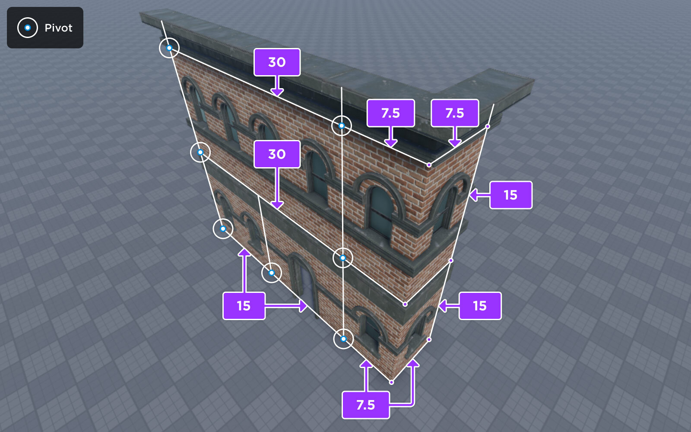

모듈식 자산은 거의 무한한 다양한 모양, 크기, 실루엣으로 구성될 수 있으며 벽, 모서리 또는 장식용 추가물과 같은 다양한 목적을 가질 수 있으므로 일관된 피벗 위치가 각 모듈식 빌딩 키트마다 다를 수 있습니다. Modern City 샘플 모듈식 빌딩 키트의 경우, 모든 메시의 일관된 피벗 위치는 전방의 하단 모서리 또는 발코니, 코니스, 차양과 같은 건물의 논리적 위치에 스냅할 수 있는 위치에 있습니다.

<!-- <GridContainer numColumns="3">
  <figure>
    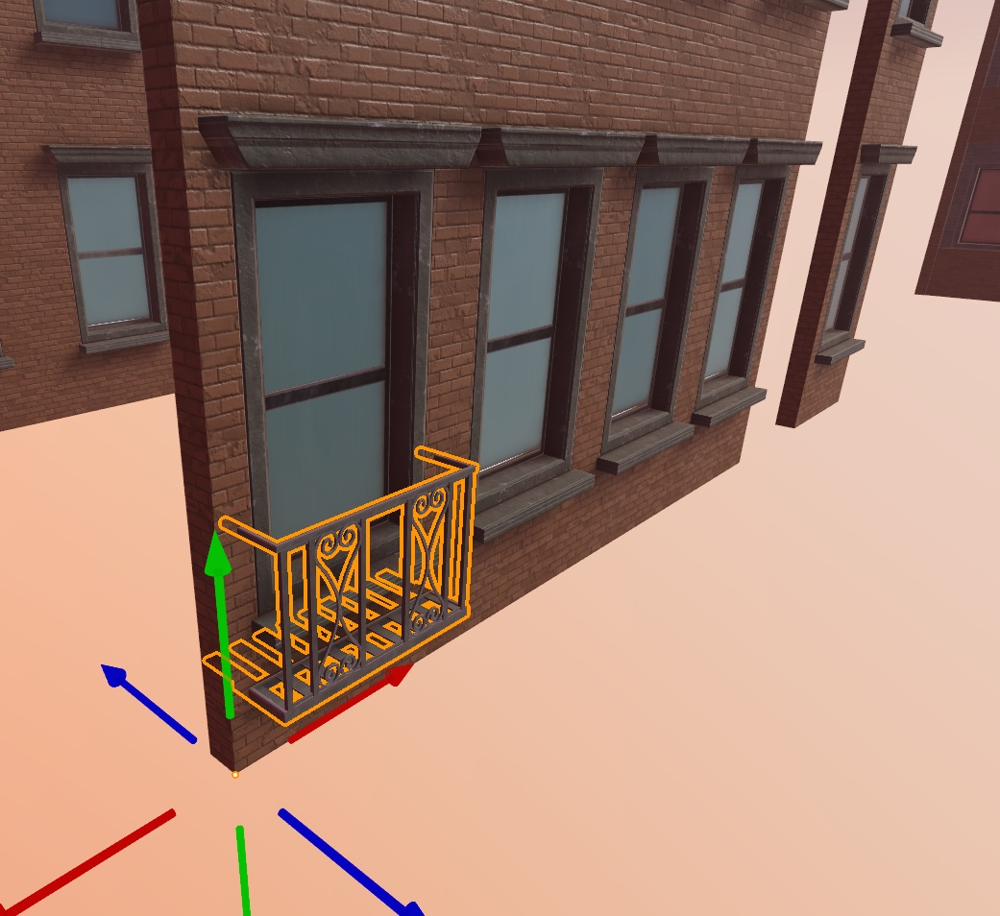
  </figure>
  <figure>
    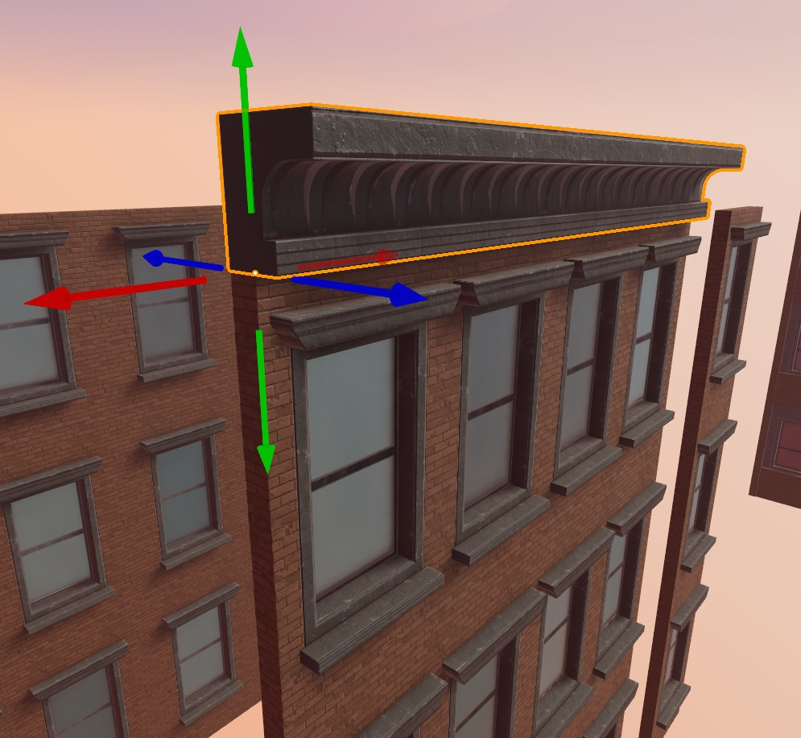
  </figure>
  <figure>
    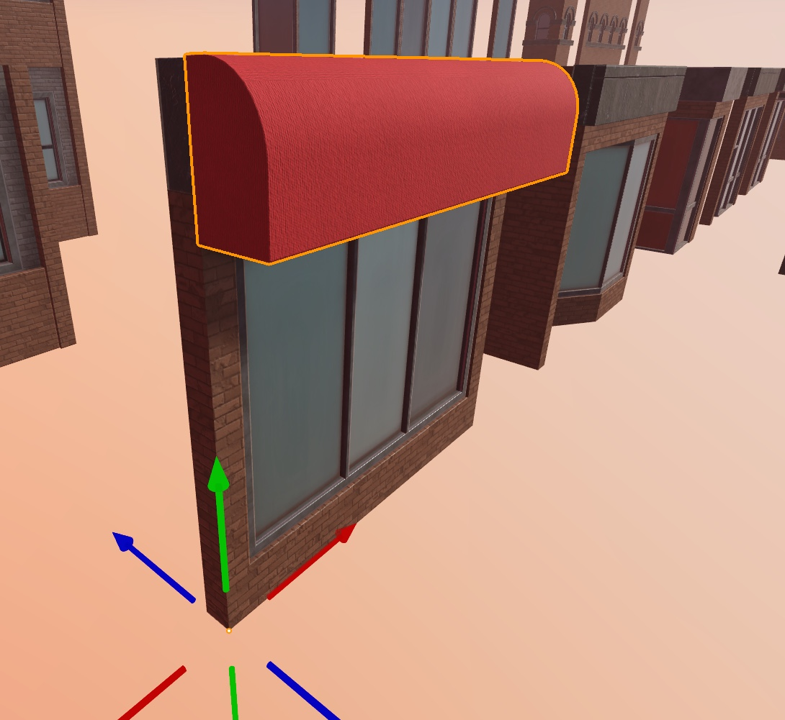
  </figure>
</GridContainer> -->

||||
|---|---|---|

Studio에서 만든 파트 및 모델의 피벗 위치를 구성하는 방법에 대한 정보는 [피벗 도구](https://create.roblox.com/docs/studio/pivot-tools#edit-pivot)를 참조하십시오. 서드 파티 모델링 도구에서 만든 메시의 피벗 위치를 구성하는 방법에 대한 정보는 [Blender](https://docs.blender.org/manual/en/2.80/scene_layout/object/editing/transform/control/pivot_point.html) 또는 [Maya](https://knowledge.autodesk.com/support/maya/learn-explore/caas/CloudHelp/cloudhelp/2022/ENU/Maya-Basics/files/GUID-150B390E-840B-4FE3-B8E9-8DEBCE7CEC97-htm.html)의 피벗 포인트 문서를 참조하십시오.

## 스냅 동작 구성

Studio의 기본 설정은 객체를 스터드나 각도의 분수로 자유롭게 이동하고 회전할 수 있도록 합니다. 그러나 모듈식 빌딩 키트는 정확한 단위로 자산이 스냅되어야 하므로 **각 모듈식 빌딩 키트의 요구 사항에 따라** 이러한 기본 설정을 변경해야 합니다. 예를 들어, Modern City 샘플 [모듈식 빌딩 키트](https://create.roblox.com/store/asset/13168370735/Modular-Building-Kit-Modern-City)는 각 메시가 충돌 없이 7.5 스터드 및 45도 단위로 회전해야 합니다. 이를 통해 메시를 3D 환경 주위로 이동하고 회전할 때 건물이 확장되면서 서로 명확하게 정렬될 수 있습니다.

샘플 모듈식 빌딩 키트의 이상적인 스냅 동작을 위한 Studio 설정을 구성하려면:

1. 메뉴 모음에서 **모델** 탭을 선택합니다.
1. **도구** 섹션에서 **충돌**을 비활성화합니다.
1. **그리드 스냅** 섹션에서,

   1. **회전**을 활성화하고 45로 설정합니다.
   1. **이동**을 활성화하고 7.5로 설정합니다.

     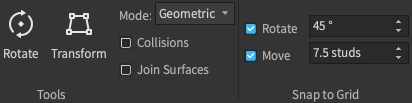

## 모듈식 자산 결합

모듈식 자산을 더 큰 복합 객체로 조립할 때, 참조할 수 있는 위치 좌

표를 가지는 핵심 객체를 선택하는 것이 유용합니다. 이를 통해 각 추가 객체가 올바른 피벗 위치에 빠르게 정렬된 후 다른 위치로 이동할 수 있습니다.

샘플 모듈식 빌딩 키트를 사용하여 빌딩을 만들기 위해 모듈식 자산을 결합하려면:

1. 하단 모듈식 메시 중 하나를 선택합니다. 이 예제에서는 문을 사용합니다.
1. 뷰포트에서 이 메시를 빌딩을 만들고자 하는 위치에 배치합니다.

   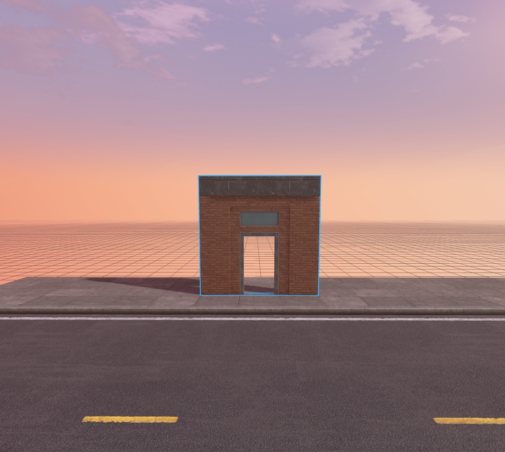

1. **속성** 창에서 **위치** 좌표를 복사합니다.
1. 뷰포트에서 연결할 두 번째 메시를 선택합니다.
1. **속성** 창에서 첫 번째 메시의 **위치** 좌표를 붙여넣습니다. 두 번째 메시가 첫 번째 메시 위에 표시됩니다.

   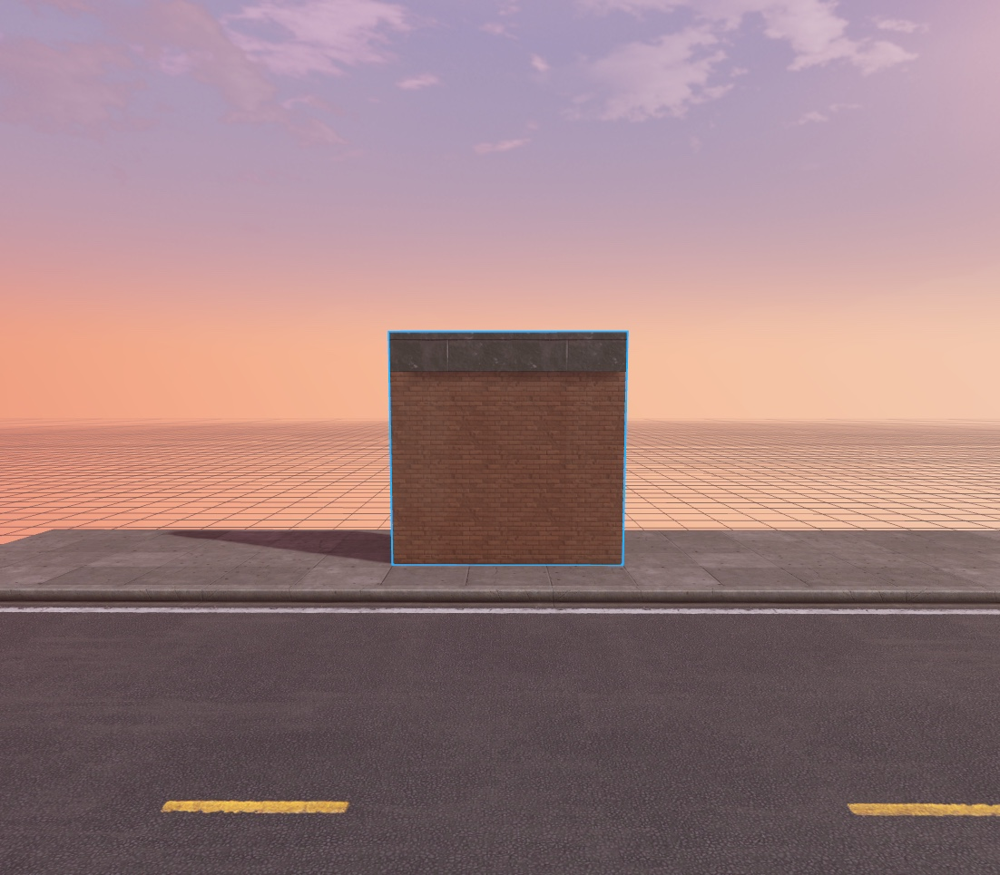

1. 메뉴 모음에서 **이동** 도구를 선택한 후 두 번째 메시를 첫 번째 메시의 양쪽 중 하나로 이동합니다. 이 메시가 동일한 축을 따라 7.5 단위로 스냅됩니다.

   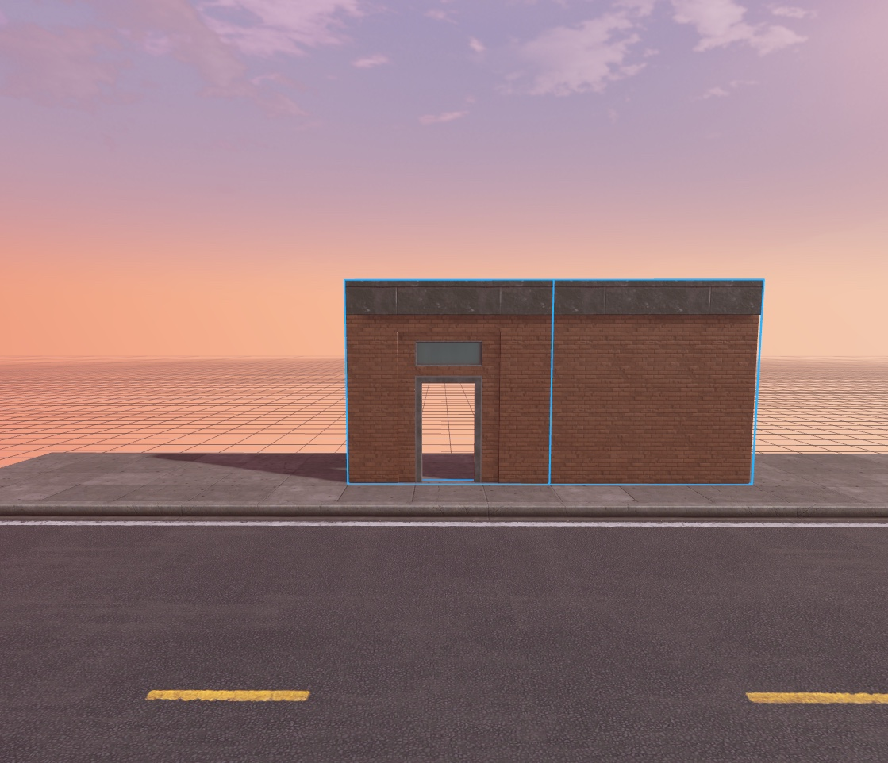

   <Alert severity="warning">
      모듈식 메시를 결합하는 과정에서는 한 번에 하나의 메시만 이동해야 합니다. 여러 메시를 동시에 선택하면 Studio가 두 피벗 포인트 위치를 평균화하여, 메시가 정렬되고 스냅되는 데 필요한 일관된 피벗 포인트 위치가 효과적으로 제거됩니다.
   </Alert>

1. 빌딩을 구성할 각 추가 메시에 대해 첫 번째 메시의 위치 좌표를 계속 붙여넣어 각 메시의 시작 피벗 위치가 동일하게 유지되도록 합니다.

   <!-- <video controls src="../img/02_04_Assembling_Modular_Environments/Combining-Making-A-Building.mp4" width="50%"></video> -->
   

## 모듈식 자산 사용자 정의

각 객체가 더 큰 모듈식 환경 내에서 독특하게 보이고 느껴지도록 하기 위해, 시각적 다양성을 창출하기 위해 모듈식 자산을 사용자 정의하는 것이 중요합니다. 다음 섹션에서는 샘플 모듈식 빌딩 키트의 사용자 정의 전략을 탐구합니다. 예를 들어, 벽과 트림에 대체 재료를 사용하고, 이 장식물의 색조를 실험하고, 큰 표면에서 타일링된 재료의 반복을 제거하고, 장식용 소품으로 객체를 꾸미는 등 다양한 방법을 통해 환경 내에서 변화를 창출할 수 있습니다.

### 대체 사용자 정의 재료 사용

샘플 모듈식 빌딩 키트 내의 모든 메시에는 벽의 외관과 물리적 특성을 변경하는 데 사용할 수 있는 샘플 [재료 팩](https://create.roblox.com/store/asset/13168345645/Modern-City-Materials-Pack)에서 [사용자 정의 재료](https://create.roblox.com/docs/parts/materials#custom-materials)가 사용됩니다. 예를 들어, 기본적으로 모든 벽은 **PaintedBrick** 사용자 정의 재료로 시작하지만, 다양한 형태의 대체 벽돌, 콘크리트, 석고로 변경할 수 있으며, 각 빌딩에 독특한 외관을 부여하기 위해 재료의 색조를 설정할 수 있습니다.

벽 메시에 대체 사용자 정의 재료를 사용하려면:

1. 뷰포트에서 <kbd>Alt</kbd><kbd>Shift</kbd> (<kbd>⌥</kbd><kbd>Shift</kbd>)를 누른 상태에서 벽 재료가 있는 빌딩의 메시를 클릭합니다.

   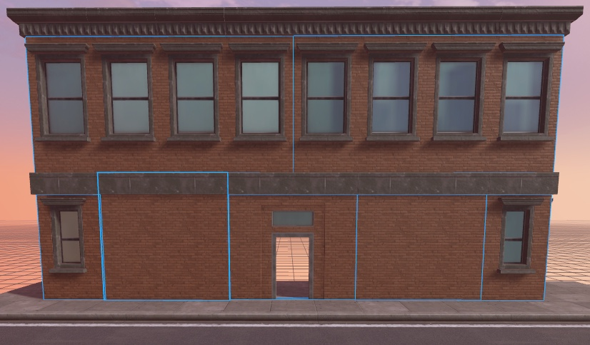

2. **속성** 창에서 **MaterialVariant** 드롭다운 메뉴를 클릭합니다. 모든 대체 사용자 정의 재료가 표시됩니다.

   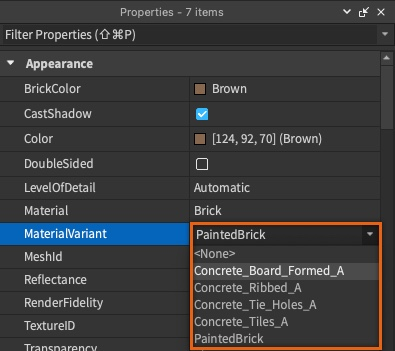

3. 대체 재료 변형을 선택합니다. 모든 활성 벽 메시가 뷰포트에서 재료를 업데이트합니다.

   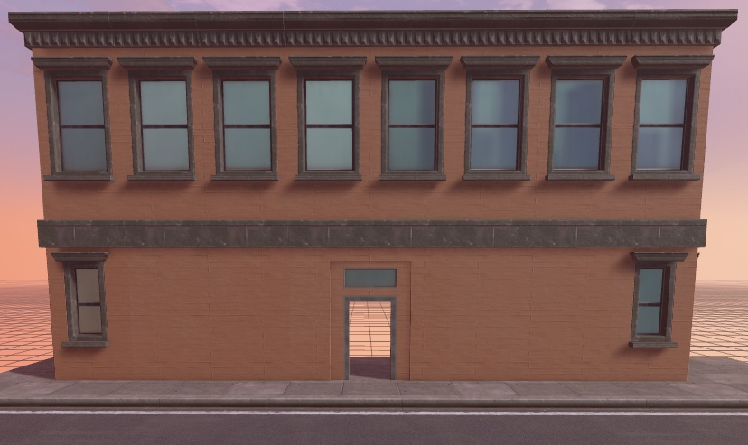

4. **(선택 사항)** 새 사용자 정의 재료를 추가로 사용자 정의하려면, 새 색조를 선택합니다.

   1. **속성** 창에서 **BrickColor** 또는 **Color**를 클릭합니다. 각각 육각형 맵 또는 색상 팝업이 표시됩니다.
   2. 새 색상을 선택합니다. 모든 활성 벽 메시가 뷰포트에서 색조를 업데이트합니다.

      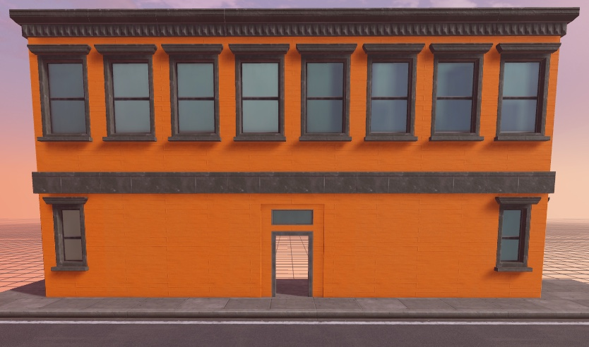

### 대체 SurfaceAppearance 객체 사용

샘플 모듈식 빌딩 키트 내의 모든 트림 메시에는 각 빌딩의 장식이 더 현실적으로 느껴지도록 사용자 정의 텍스처를 활용하는 `SurfaceAppearance` 객체가 포함되어 있습니다. 경험 내에서 각 빌딩이 독특하게 느껴지도록 하기 위해, `SurfaceAppearance` 폴더의 다른 `SurfaceAppearance` 객체를 교체할 수 있습니다. 여기에는 콘크리트, 석고, 나무와 같은 재료가 포함되며, 추가적인 다양성을 위해 트림의 색조를 설정할 수 있습니다.

트림 메시에 `SurfaceAppearance` 객체를 교체하려면:

1. 트림이 있는 메시를 뷰포트에서 선택합니다.

   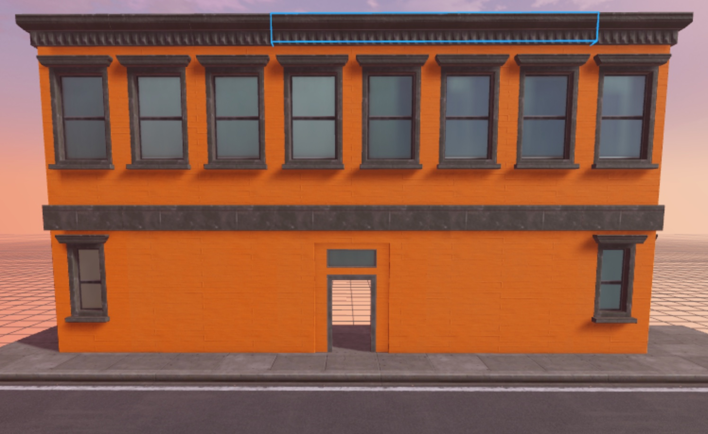

2. **탐색기** 창에서 부모 모델을 확장한 다음, 자식 메시를 확장하여 `SurfaceAppearance` 객체를 볼 수 있습니다.

   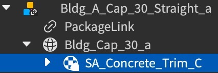

3. `SurfaceAppearance` 객체를 삭제합니다. 메시의 시각적 외관이 뷰포트에서 업데이트됩니다.

   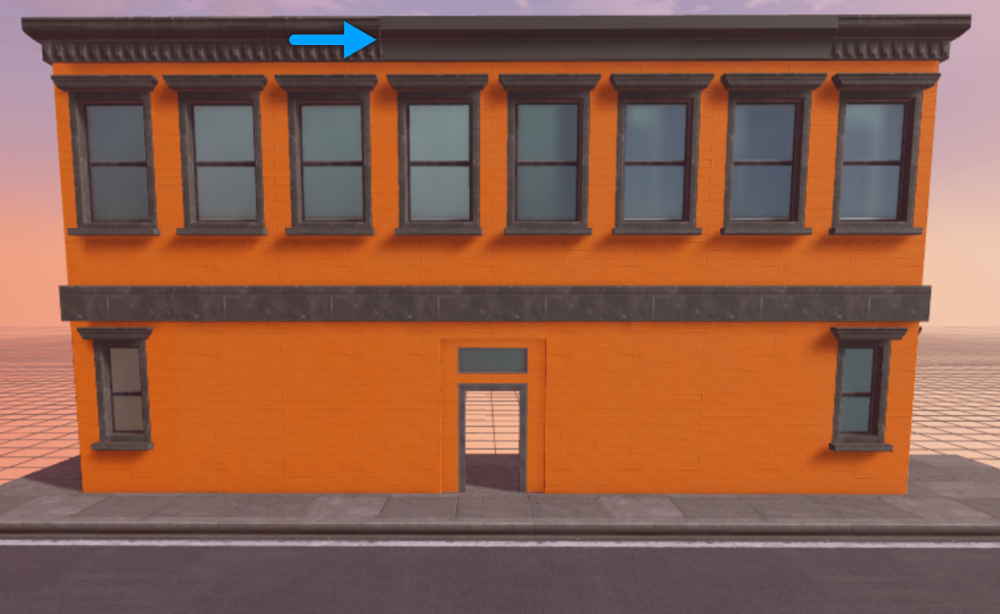

4. **SurfaceAppearance** 폴더에서 트림에 사용할 대체 `SurfaceAppearance` 객체를 복사합니다.

   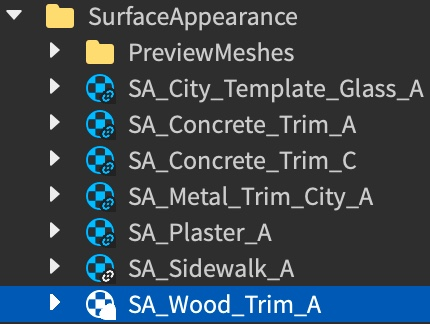

5. 트림 모델로 이동한 후, 자식 메시에 새 `SurfaceAppearance` 객체를 붙여넣습니다. 메시의 시각적 외관이 뷰포트에서 업데이트됩니다.

   <GridContainer numColumns="2">
     <figure>
       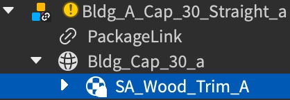
     </figure>
     <figure>
       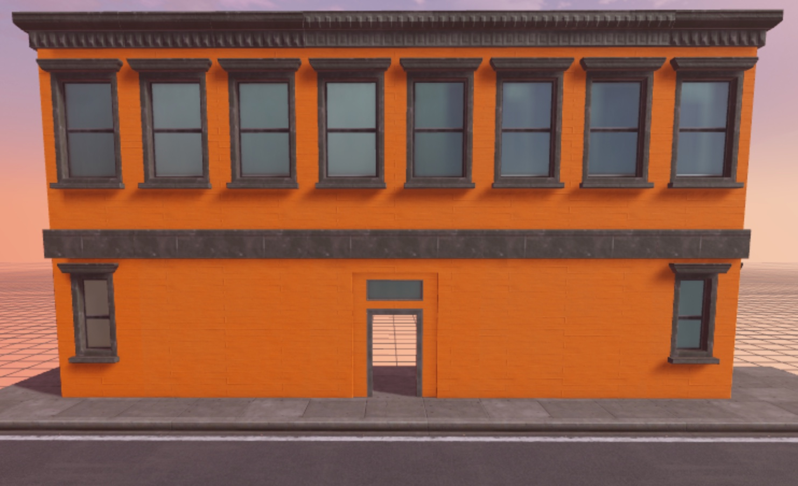
     </figure>
   </GridContainer>

6. 빌딩의 각 트림 메시에 대해 이 과정을 반복합니다.

   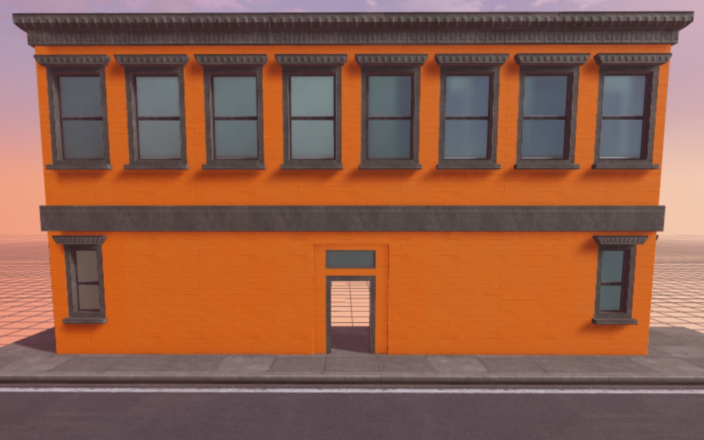

7. **(선택 사항)** 새 `SurfaceAppearance` 객체를 추가로 사용자 정의하려면, 새 색조를 선택합니다.

   1. 뷰포트에서 <kbd>Alt</kbd><kbd>Shift</kbd> (<kbd>⌥</kbd><kbd>Shift</kbd>)를 누른 상태에서 트림이 있는 빌딩의 메시를 클릭합니다.
   2. **속성** 창에서 **BrickColor** 또는 **Color**를 클릭합니다. 각각 육각형 맵 또는 색상 팝업이 표시됩니다.
   3. 새 색상을 선택합니다. 모든 활성 트림 메시가 뷰포트에서 색조를 업데이트합니다.

      

### 가시적 반복 줄이기

타일링 재료(예: 벽돌, 콘크리트)를 사용하는 대형 객체를 만들 때, 타일링 패턴은 눈에 띄게 반복될 수 있습니다. 이러한 재료의 눈에 띄는 타일링을 줄이기 위해, 그런지 데칼이나 텍스처를 만들어 벽 메시의 자식으로 추가하여 벽의 활성 재료 위에 오버레이할 수 있습니다. 이 사용자 정의 전략은 빌딩에 추가적인 현실감을 더해주어 3D 환경의 품질을 빠르게 향상시킬 수 있습니다. 텍스처 적용 및 사용자 정의에 대한 자세한 내용은 [텍스처와 데칼](https://create.roblox.com/docs/parts/textures-decals)을 참조하십시오.

<!-- <GridContainer numColumns="2">
  <figure>
    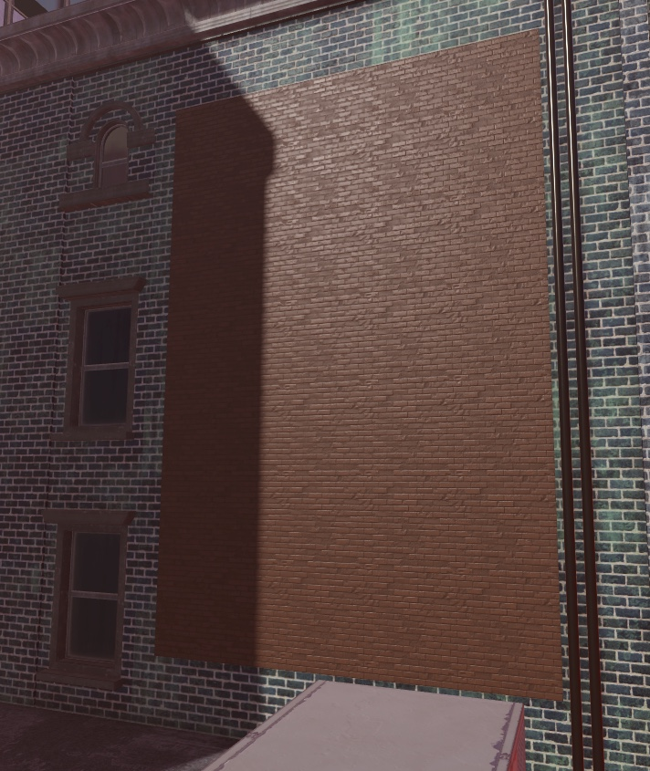
    <figcaption>그런지 텍스처 오버레이 없는 벽</figcaption>
  </figure>
  <figure>
    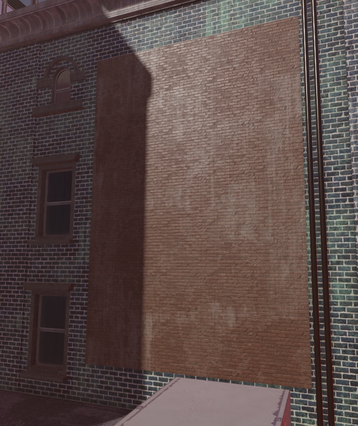
    <figcaption>그런지 텍스처 오버레이 있는 벽</figcaption>
  </figure>
</GridContainer> -->

|||
|---|---|
|그런지 텍스처 오버레이 없는 벽|그런지 텍스처 오버레이 있는 벽|

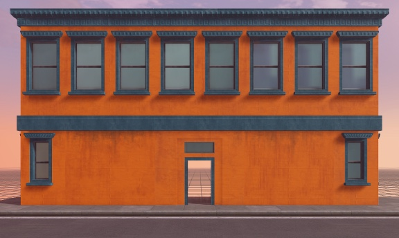

### 장식 소품 추가

더 큰 모듈식 환경 내에서 객체를 독특하게 만드는 마지막 단계로, 장식 소품으로 각 객체를 꾸미면 많은 캐릭터를 추가할 수 있습니다. 예를 들어, 샘플 모듈식 빌딩 키트에는 소방 탈출구, 창 발코니, 에어컨 유닛, 식물 등 자산이 포함되어 있어 각 빌딩을 꾸미고 생동감 있게 만들 수 있습니다. 몇 가지 장식 소품만 추가해도 장면에 많은 스토리텔링 요소를 추가할 수 있습니다.

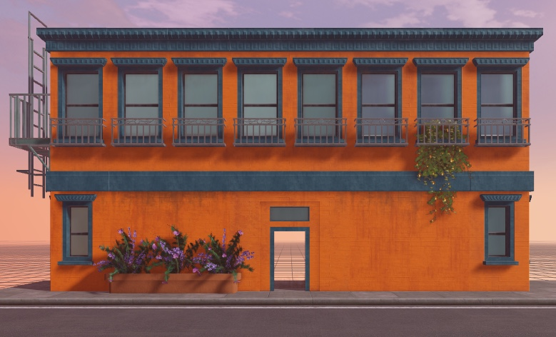

---
## 출처
 - [Assembling Modular Environments](https://create.roblox.com/docs/tutorials/3D-art/assembling-modular-environments)

---
## [다음](./02_05_Enhancing_Outdoor_Environments.md)