# Enhancing Outdoor Environments with Future Lighting

## 목차
- [Enhancing Outdoor Environments with Future Lighting](#enhancing-outdoor-environments-with-future-lighting)
  - [목차](#목차)
  - [글로벌 조명 구성](#글로벌-조명-구성)
    - [미래 조명 시스템 활성화](#미래-조명-시스템-활성화)
    - [금속 반사 강화](#금속-반사-강화)
    - [시간 변경](#시간-변경)
    - [주변광 색상 조정](#주변광-색상-조정)
    - [스카이박스 선택](#스카이박스-선택)
    - [대기 효과](#대기-효과)
      - [공기 입자 밀도 증가](#공기-입자-밀도-증가)
      - [헤이즈 추가](#헤이즈-추가)
      - [대기 색상 조정](#대기-색상-조정)
  - [로컬 조명 구성](#로컬-조명-구성)
    - [PointLight 추가](#pointlight-추가)
    - [PointLight의 범위 증가](#pointlight의-범위-증가)
    - [그림자 활성화](#그림자-활성화)
    - [조명의 밝기 및 색상 조정](#조명의-밝기-및-색상-조정)
  - [출처](#출처)
  - [다음](#다음)

---

**미래 조명**은 경험 내에서 3D 환경을 렌더링하는 데 사용할 수 있는 가장 고급스럽고 강력한 `Lighting.Technology` 시스템입니다. 다른 사용 가능한 조명 시스템과 달리 미래 조명은 실내외 공간 모두에서 실제 조명을 모방하는 픽셀 완벽한 빛 방출, 세부적인 그림자 및 반사 하이라이트를 제공합니다.

시작 지점으로 [Lighting Outdoors - Start](https://www.roblox.com/games/17835285085/Lighting-Outdoors-Start) `.rbxl` 파일을 사용하고 참고 자료로 [Lighting Outdoors - Complete](https://www.roblox.com/games/17835194683/Lighting-Outdoors-Complete)를 사용하여, 이 튜토리얼에서는 전략적 글로벌 및 로컬 광원 구성을 통해 저녁 캠프파이어 장면에 대해 현실적이고 몰입감 있는 야외 조명 동작을 생성하는 방법을 보여줍니다. 다음 항목에 대한 지침을 포함합니다:

- 금속 표면이 환경 내에서 지속적으로 이동하는 빛 원천, 예를 들어 캠프파이어의 동적 움직임과 같이 정확한 반사를 생성하도록 보장합니다.
- 태양을 현실 세계의 시간대에 맞게 새로운 위치로 이동합니다.
- 대기의 층별 색조, 밀도 및 헤이즈를 사용자 정의합니다.
- 전체 환경과 상호 작용하는 방법을 조정하기 위해 포인트 소스 로컬 조명을 구성합니다.

과정 중 어느 시점에서든 막히면 **Lighting Outdoors - Complete**를 참고하여 진행 상황을 비교할 수 있습니다.

<!-- <GridContainer numColumns="2">
  <figure>
    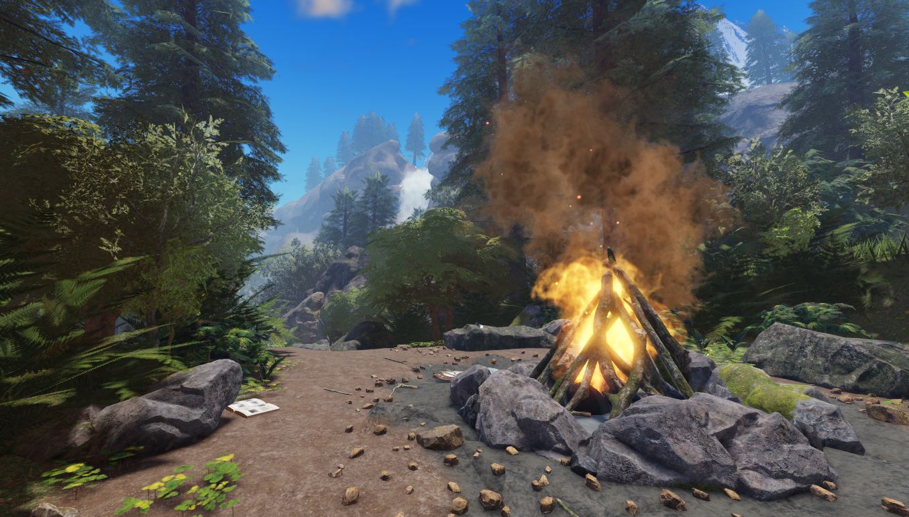
    <figcaption>Lighting Outdoors - Start</figcaption>
  </figure>
  <figure>
    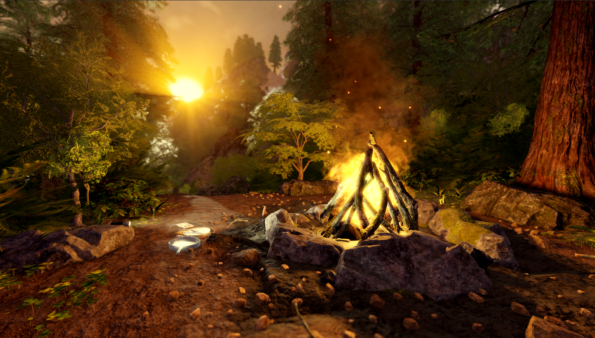
    <figcaption>Lighting Outdoors - Complete</figcaption>
  </figure>
</GridContainer> -->

|||
|---|---|
|Lighting Outdoors - Start|Lighting Outdoors - Complete|

## 글로벌 조명 구성

글로벌 조명은 경험 내에서 태양 또는 달의 빛에서 나오는 빛입니다. `Lighting` 서비스의 몇 가지 기본 속성을 조정하여 플레이어에게 빛이 나타나는 방식과 경험 내에 배치한 다른 객체와 상호 작용하는 방식을 크게 변경할 수 있습니다.

### 미래 조명 시스템 활성화

`Lighting.Technology` 속성은 경험 내의 글로벌 및 로컬 조명의 동작을 결정합니다. Studio는 모든 경험을 `Technology.ShadowMap` 조명 시스템으로 시작하여 글로벌 조명이 정확한 그림자와 조명을 갖도록 합니다. 그러나 환경을 향상시키고 캠프파이어의 빛과 같은 로컬 조명도 정확한 그림자와 조명을 생성하도록 하기 위해, Studio에서 `Technology.Future` 조명 시스템 기술을 직접 활성화해야 합니다. 이를 통해 글로벌 및 로컬 조명이 함께 작동하여 더 현실적이고 몰입감 있는 비주얼을 제공합니다.

이 개념을 설명하기 위해, 다른 조명 시스템 기술을 사용한 동일한 캠프파이어의 두 이미지를 참조하세요. `Technology.ShadowMap` 조명 시스템의 로컬 조명은 글로벌 조명처럼 그림자를 생성하지 않아 환경의 이 영역이 비현실적인 그림자와 함께 불균형하게 조명됩니다. 반면, `Technology.Future` 조명 시스템 기술의 로컬 조명은 환경 주변의 연료, 바위 및 덤불과 상호 작용하여 저녁 시간에 선명하고 현실적인 그림자를 생성합니다.

<!-- <GridContainer numColumns="2">
  <figure>
    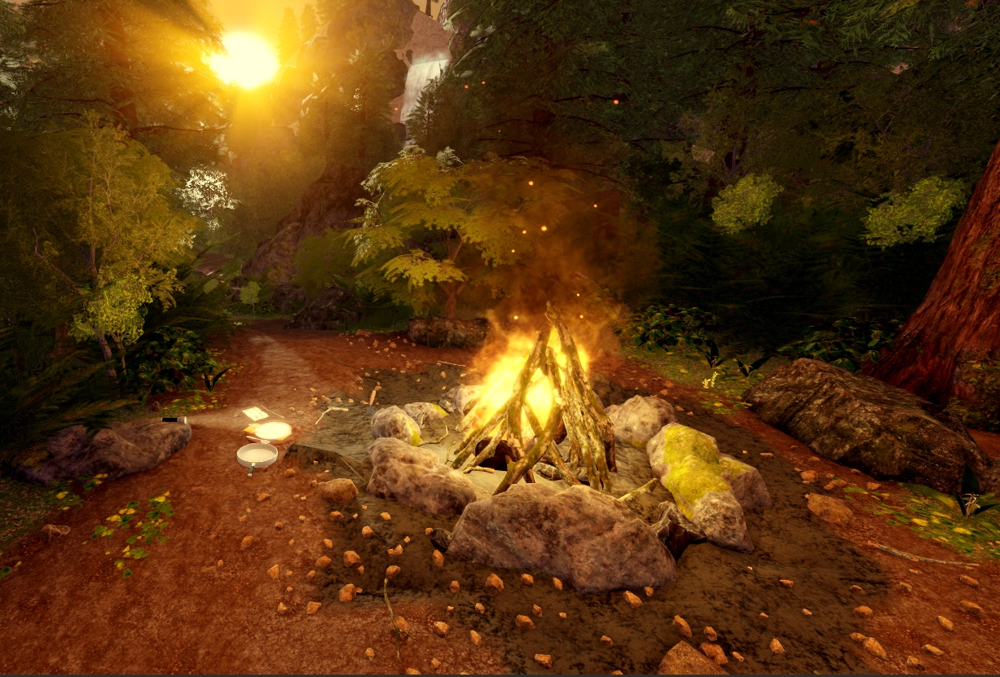
    <figcaption>`Technology.ShadowMap` 조명 시스템</figcaption>
  </figure>
  <figure>
    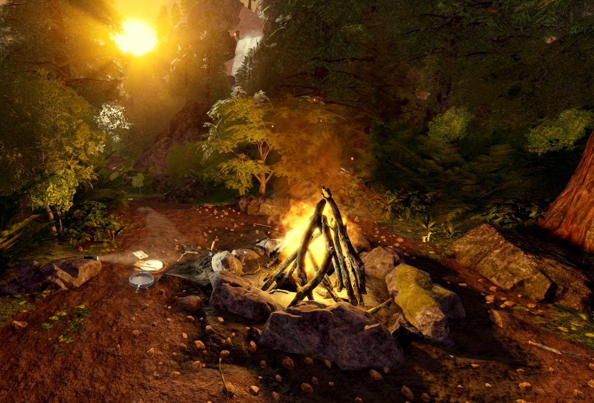
    <figcaption>`Technology.Future` 조명 시스템</figcaption>
  </figure>
</GridContainer> -->

|||
|---|---|
|`Technology.ShadowMap` 조명 시스템|`Technology.Future` 조명 시스템|

`Technology.Future` 조명 시스템을 활성화하려면:

1. **탐색기** 창에서 **조명**을 선택합니다.
1. **속성** 창에서 **기술** 드롭다운을 클릭한 후 **미래**를 선택합니다.

   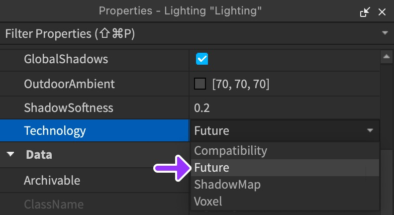

### 금속 반사 강화

기본적으로 모든 재료는 단일 객체에 여러 이미지 파일을 사용하여 다양한 조명 시나리오에서 현실적인 표면을 표시할 수 있는 물리 기반 렌더링(PBR) 텍스처를 사용합니다. 즉, Studio의 내장된 재료를 사용할 때 특정 표면의 금속성과 거칠기가 이미 정의되어 있으며, 해당 재료를 사용하는 객체는 환경의 조명에 더 정확하게 반응하여 현실적인 반사를 생성합니다. 이 효과를 더욱 향상시키기 위해 `Lighting.EnvironmentDiffuseScale` 및 `Lighting.EnvironmentSpecularScale` 속성을 `1`로 설정하여 `Technology.Future` 조명 시스템의 금속 반사를 최대한 활용할 수 있습니다.

이 단계는 경험 내의 모든 PBR 텍스처가 최상의 상태로 보이고 주변을 더 잘 반사하도록 보장하므로 중요합니다. 예를 들어, 다른 `Lighting.EnvironmentDiffuseScale` 및 `Lighting.EnvironmentSpecularScale` 속성 값으로 동일한 팬과 캠프파이어 근처의 도구 이미지를 비교해보세요. 이러한 값을 조정하면 금속이 더욱 분명해지고 글로벌 및 로컬 광원 모두에서 조명을 훨씬 더 많이 반사합니다.

<!-- <GridContainer numColumns="2">
  <figure>
    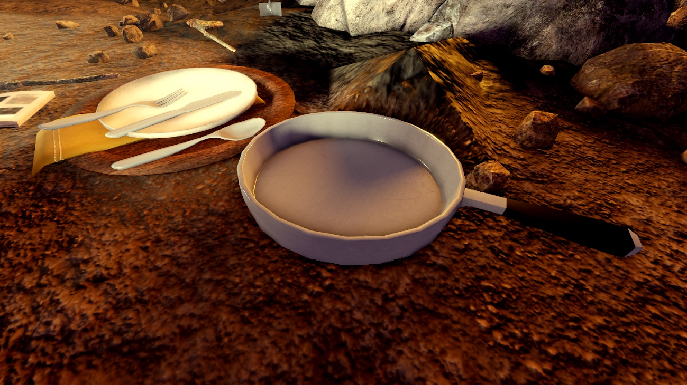
    <figcaption>`Lighting.EnvironmentDiffuseScale` 및 `Lighting.EnvironmentSpecularScale` = `0`</figcaption>
  </figure>
  <figure>
    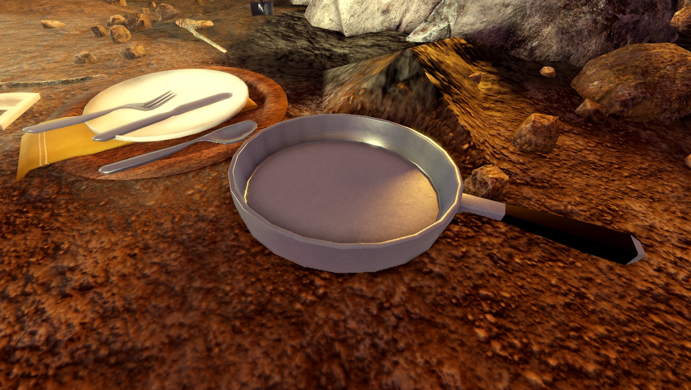
    <figcaption>`Lighting.EnvironmentDiffuseScale` 및 `Lighting.EnvironmentSpecularScale` = `1`</figcaption>
  </figure>
</GridContainer> -->

|||
|---|---|
|`Lighting.EnvironmentDiffuseScale` 및 `Lighting.EnvironmentSpecularScale` = `0`|`Lighting.EnvironmentDiffuseScale` 및 `Lighting.EnvironmentSpecularScale` = `1`|

금속 반사를 향상시키려면:

1. **탐색기** 창에서 **조명**을 선택합니다.
1. **속성** 창에서 **환경 확산 스케일** 및 **환경 반사 스케일**을 **1**로 설정합니다. 경험 내의 금속이 더 반사됩니다.

### 시간 변경

이제 경험이 `Technology.Future` 조명 시스템을 사용하고 재료가 경험 내의 빛 원천에 현실적으로 반응하기 시작했으므로, 현실 세계의 시간에 따라 태양을 다른 위치로 이동할 때입니다. 태양의 기본 위치는 하늘 높이에 있어 현실 세계의 정오쯤을 모방하므로, 태양을 산 위쪽에 가깝게 이동시키는 것이 좋습니다. 이 단계는 빛이 경로를 따라 캠프파이어로 내려가 멋진 황금빛 태양을 만들 수 있게 합니다.

<!-- <GridContainer numColumns="2">
  <figure>
    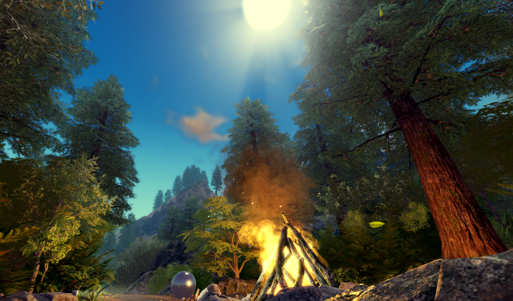
    <figcaption>기본 태양 위치는 하늘 높이에 있습니다. 캠프파이어가 정오쯤 발생한다면 이 배치는 훌륭하지만, 저녁에는 현실적이지 않습니다.</figcaption>
  </figure>
  <figure>
    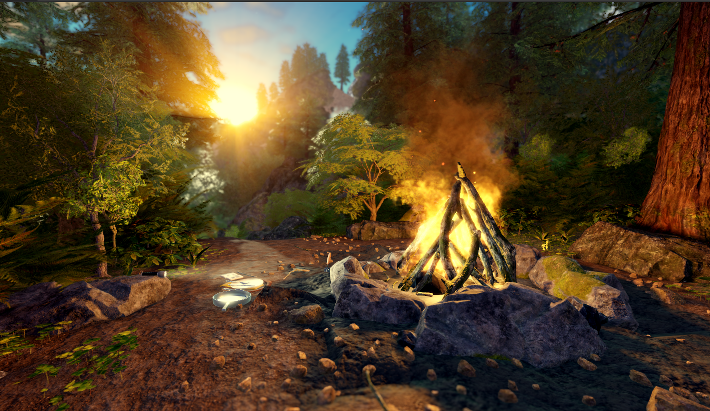
    <figcaption>새로운 태양 위치는 일몰 직전의 시간에 더 적합합니다.</figcaption>
  </figure>
</GridContainer> -->

|||
|---|---|
|기본 태양 위치는 하늘 높이에 있습니다. 캠프파이어가 정오쯤 발생한다면 이 배치는 훌륭하지만, 저녁에는 현실적이지 않습니다.|새로운 태양 위치는 일몰 직전의 시간에 더 적합합니다.|

시간을 변경하려면:

1. **탐색기** 창에서 **조명**을 선택합니다.
1. **속성** 창에서 **시계 시간**을 **17**로 설정합니다. 태양이 약 5pm에 있을 위치로 이동합니다.

### 주변광 색상 조정

주변광의 색상을 제어하는 두 가지 `Lighting` 속성이 있습니다:

- `Lighting.OutdoorAmbient`는 하늘이 보이는 곳의 주변광을 제어합니다.
- `Lighting.Ambient`는 실내 공간이나 나무 덮개 아래와 같이 하늘을 차단하는 공간 내의 주변광을 제어합니다.

기본적으로 이러한 속성은 회색 주변광을 생성하도록 설정되어 있지만, 저녁 하늘을 보완하기 위해 이러한 값을 조정하여 저녁 시간에 어두운 공간

에서 현실적인 색조와 밝기를 추가해야 합니다. 예를 들어, 저녁 하늘에는 회색보다 보라색이 훨씬 많기 때문에, 주변광에 보라색 색조를 선택하면 현실적인 환경을 만듭니다.

<!-- <GridContainer numColumns="2">
  <figure>
    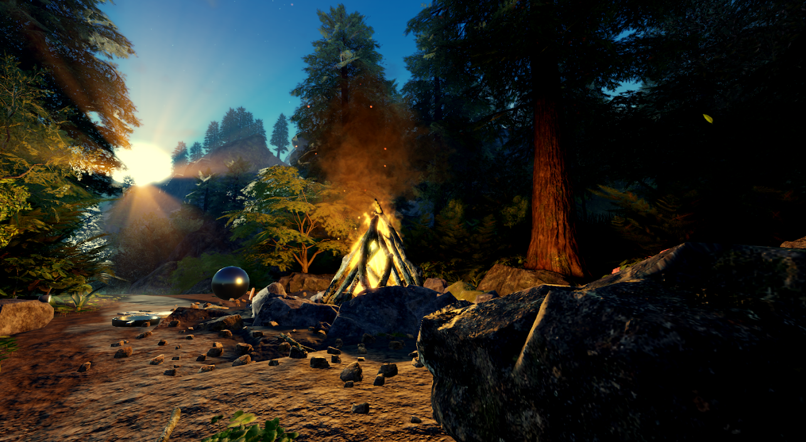
    <figcaption>`Lighting.OutdoorAmbient` 및 `Lighting.Ambient` = `70, 70, 70`</figcaption>
  </figure>
  <figure>
    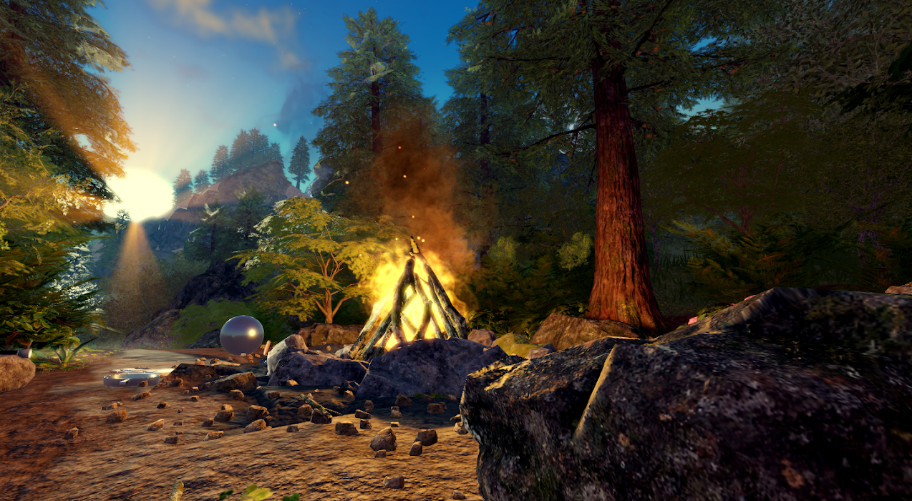
    <figcaption>`Lighting.OutdoorAmbient` 및 `Lighting.Ambient` = `156, 136, 176`</figcaption>
  </figure>
</GridContainer> -->

|||
|---|---|
|`Lighting.OutdoorAmbient` 및 `Lighting.Ambient` = `70, 70, 70`|`Lighting.OutdoorAmbient` 및 `Lighting.Ambient` = `156, 136, 176`|

주변광의 색상을 조정하려면:

1. **탐색기** 창에서 **조명**을 선택합니다.
1. **속성** 창에서 **야외 주변광** 및 **주변광**을 **156, 136, 176**으로 설정합니다. 주변광이 연보라색 색조로 변경됩니다.

### 스카이박스 선택

스카이박스는 경험의 하늘을 만드는 여섯 개의 개별 이미지로 구성된 큐브로, 지평선 위아래 모두를 포함합니다. 스카이박스는 환경의 모습과 느낌에 큰 영향을 미칠 수 있으므로, 경험의 시각적 품질을 향상시킬 수 있는 스카이박스를 신중하게 선택하는 것이 중요합니다. 예를 들어:

- 스카이박스의 하반구는 일반 지형의 색상과 유사해야 합니다. 이는 하반구가 지표면과 밀접하게 관련되고, 객체에서 반사되는 색상이 스카이박스와 대략적으로 일치하도록 보장합니다.
- 스카이박스의 하반구는 상반구보다 어두워야 합니다. 어두운 하반구는 지면 아래에서 빛의 자연적인 차단을 복제하여 조명을 더욱 몰입감 있게 만듭니다.
- 스카이박스는 구름이 필요하지 않습니다. 동적 구름을 추가하여 동일한 효과를 얻고 스카이박스를 보완할 수 있습니다.

이러한 개념을 설명하기 위해, 동일한 크롬 구가 두 개의 다른 스카이박스를 반사하는 이미지를 비교해보세요. 첫 번째 스카이박스는 상반구와 하반구의 밝기 수준이 동일하여 구가 주변 세계를 잘 반사하지 않는 것처럼 보입니다. 반면, 두 번째 스카이박스는 하반구가 상반구보다 어두워 더욱 자연스러운 모습을 구현합니다. 스카이박스 생성 및 사용자 정의에 대한 정보는 [Skyboxes](https://create.roblox.com/docs/environment/skybox)를 참조하십시오.

<!-- <GridContainer numColumns="2">
  <figure>
    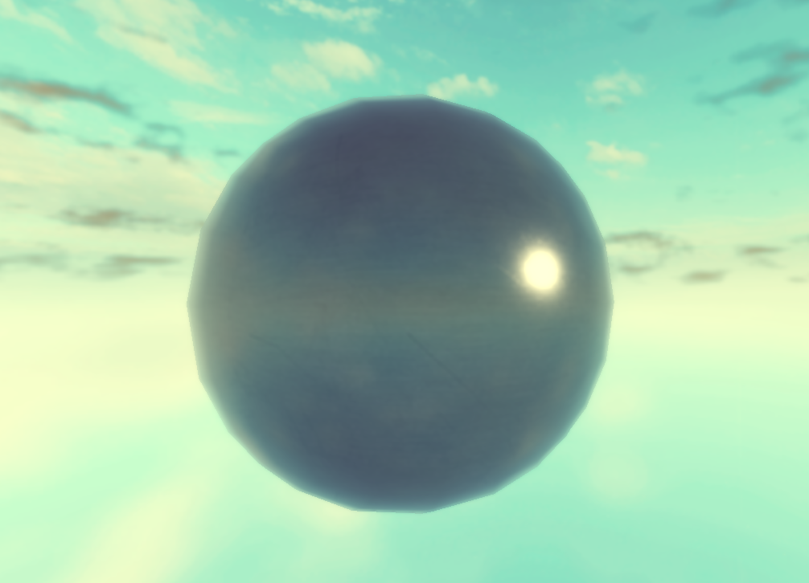
  </figure>
  <figure>
    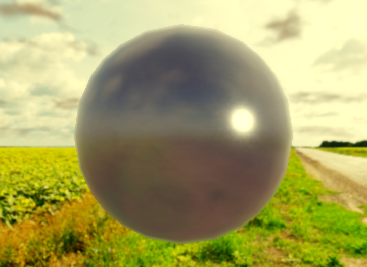
  </figure>
</GridContainer> -->

|||
|---|---|

### 대기 효과

`Lighting` 서비스는 태양광을 독특한 방식으로 산란시키는 현실적인 환경을 시뮬레이션할 수 있는 속성을 가진 자식 `Atmosphere` 객체를 가지고 있습니다. 이러한 속성은 경험의 공기 두께를 만들어 환경에 실질적인 깊이감을 부여하는 데 매우 유용합니다. `Atmosphere` 객체는 대부분의 색상을 직접 스카이박스에서 가져오므로, 이전 스카이박스에 대한 결정이 매우 중요했습니다.

#### 공기 입자 밀도 증가

`Atmosphere.Density` 속성은 경험의 공기 중 입자 수를 제어합니다. 이 속성을 증가시키면 추가된 입자가 플레이어가 배경의 객체를 볼 수 없게 합니다. 예를 들어, `Atmosphere.Density`가 `0`일 때 배경의 나무, 태양, 스카이박스가 선명하게 보이지만, 이 속성을 `0.391`로 증가시키면 입자가 빛을 산란시키고 나무를 감추기 시작합니다.

<!-- <GridContainer numColumns="2">
  <figure>
    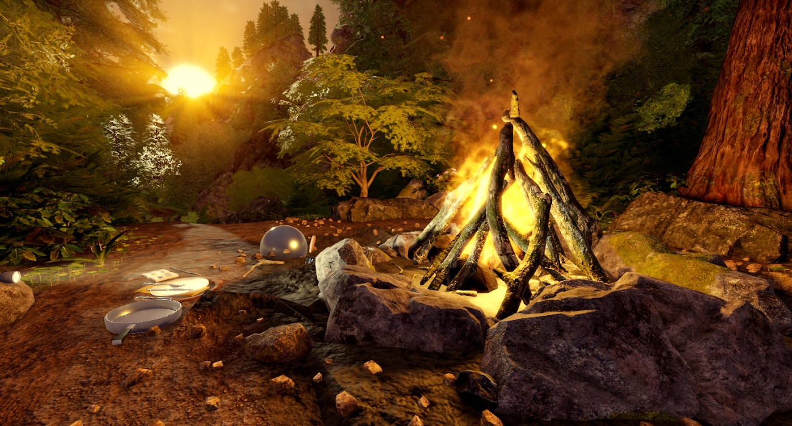
    <figcaption>`Atmosphere.Density` = `0`</figcaption>
  </figure>
  <figure>
    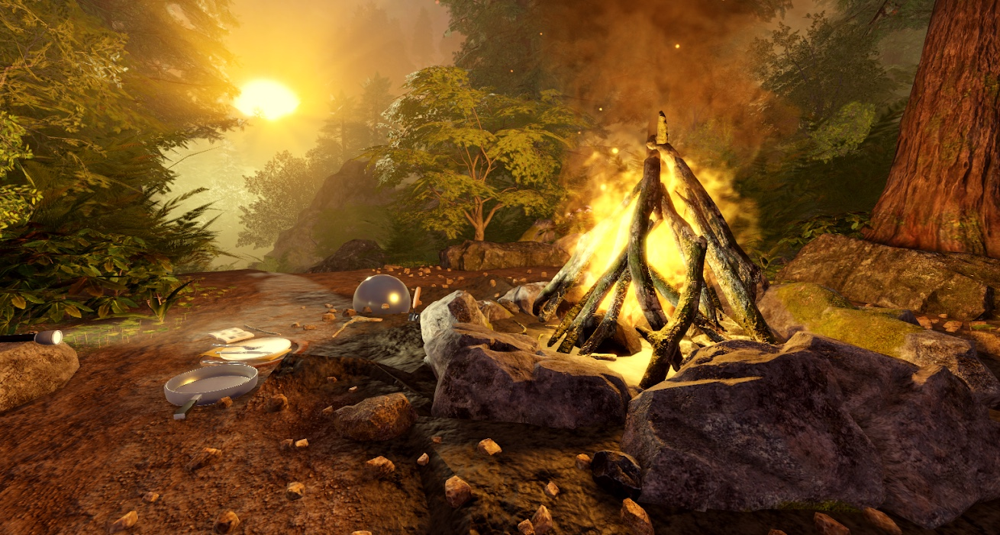
    <figcaption>`Atmosphere.Density` = `0.391`</figcaption>
  </figure>
</GridContainer> -->

|||
|---|---|
|`Atmosphere.Density` = `0`|`Atmosphere.Density` = `0.391`|

대기의 공기 입자 밀도를 증가시키려면:

1. **탐색기** 창에서 **대기**를 선택합니다.
1. **속성** 창에서 **밀도**를 **0.272**로 설정합니다.

   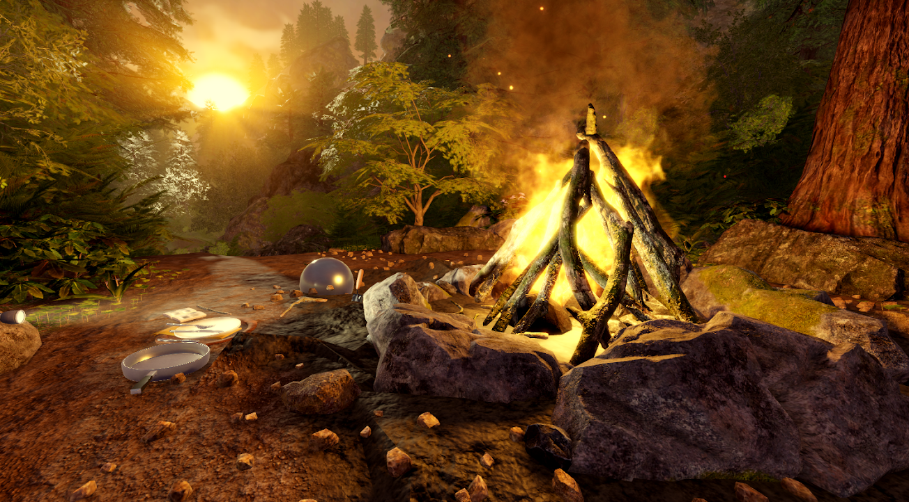

#### 헤이즈 추가

`Atmosphere.Haze` 속성은 지평선 위와 카메라에서 멀리 떨어진 곳에서 전체적인 대기의 흐림 정도를 제어합니다. 이 속성을 증가시키면 전체 환경에 영향을 미칠 뿐만 아니라 주변을 반사하는 금속 객체와 같은 강력한 프레넬 효과를 가진 객체에도 영향을 미칩니다.

대기에 헤이즈를 추가하려면:

1. **탐색기** 창에서 **대기**를 선택합니다.
1. **속성** 창에서 **헤이즈**를 **1**로 설정합니다.

   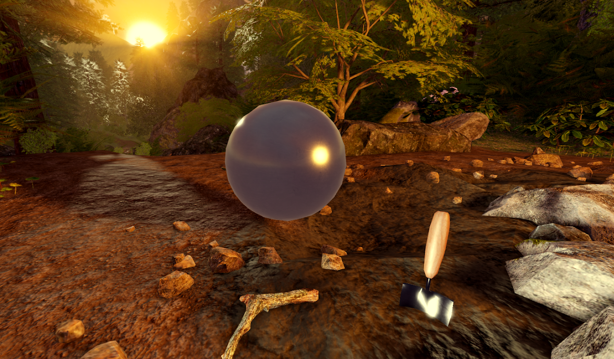

#### 대기 색상 조정

`Atmosphere.Color` 속성은 미묘한 환경 분위기와 테마를 위한 대기의 색조를 설정하며, 경험 내의 헤이즈를 크게 향상시킬 수 있습니다. 원하는 색상으로 설정할 수 있지만, 환경 내의 객체의 평균에 가까운 색상 값을 설정하는 것이 좋습니다.

대기의 색상을 조정하려면:

1. **탐색기** 창에서 **대기**를 선택합니다.
1. **속성** 창에서 **색상**을 **85, 78, 54**로 설정합니다.

   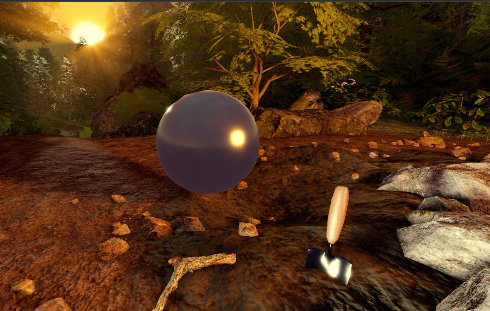

## 로컬 조명 구성

로컬 조명은 `SpotLight`, `SurfaceLight`, `PointLight` 객체와 같은 경험 내의 로컬 [광원](https://create.roblox.com/docs/effects/light-sources)에서 나오는 빛입니다. 이 경험을 위해 생성할 주요 로컬 광원은 캠프파이어의 빛이며, 기본 속성 몇 가지를 조정하면 이 로컬 조명이 전체 환경과 상호 작용하는 방식을 크게 변경하여 글로벌 조명 구성과 조화를 이룰 수 있습니다.

### PointLight 추가

한 방향에서만 빛을 발사하는 `SpotLight` 또는 `SurfaceLight` 객체와 달리, `PointLight` 객체는 전방위 조명을 발사할 수 있습니다. 즉, `PointLight`를 캠프파이어 메시에 추가하면 실제 캠프파이어처럼 모든 방향으로 발사되어 그림자를 가진 모든 주변 객체를 조명하고 표면의 거칠기를 더 선명하게 볼 수 있습니다.

<!-- <GridContainer numColumns="2">
  <figure>
    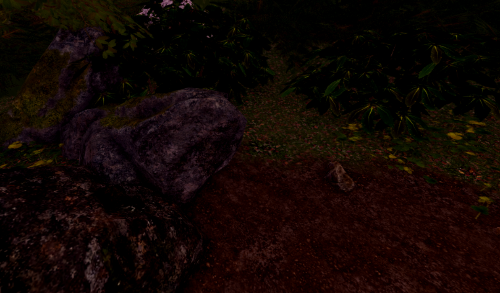
    <figcaption>로컬 광원이 없는 장면</figcaption>
  </figure>
  <figure>
    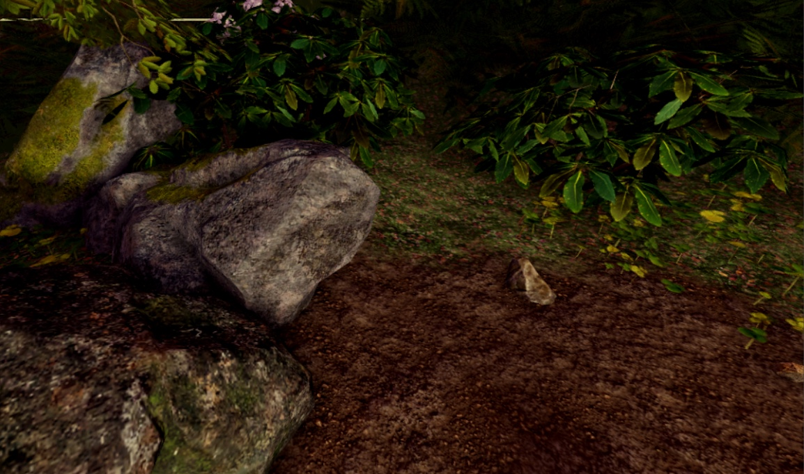
    <figcaption>로컬 광원이 있는 동일한 장면</figcaption>
  </figure>
</GridContainer> -->

|||
|---|---|
|로컬 광원이 없는 장면|로컬 광원이 있는 동일한 장면|

캠프파이어에 `PointLight`를 추가하려면:

1. **탐색기** 창에서 **FireLight** 위에 마우스를 올리고 **⊕** 버튼을 클릭합니다. 상황별 메뉴가 표시됩니다.
1. 메뉴에서 **PointLight**를 선택합니다. `PointLight` 객체가 캠프파이어 메쉬의 자식으로 표시됩니다.

   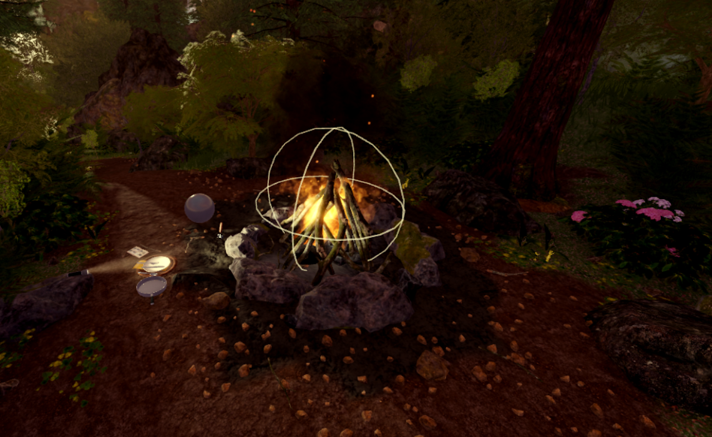

### PointLight의 범위 증가

`PointLight`의 기본 속성은 캠프파이어 주변 객체를 완전히 밝히기에 충분하지 않으므로 빛이 닿을 수 있는 범위를 증가시켜야 합니다. 불이 크고 밝기 때문에 빛이 근처 나무, 바위 및 덤불을 비추도록 멀리까지 캐스팅되어야 합니다. 이는 공간을 따뜻하고 아늑하게 만들어 불의 열이 자연스럽게 확장되는 것처럼 느껴지게 합니다.

`PointLight`의 범위를 증가시키려면:

1. **탐색기** 창에서 캠프파이어의 **PointLight**를 선택합니다.
1. **속성** 창에서 **범위**를 **48**로 설정합니다. 빛의 최대 조명 범위가 확장됩니다.

   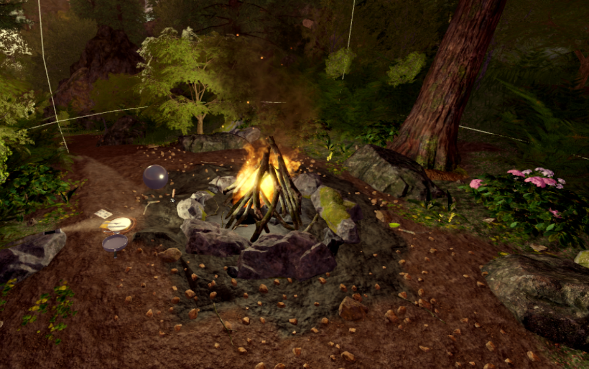

### 그림자 활성화

빛의 범위가 크기에 비해 캠프파이어의 빛에서 주변 나무와 바위가 그림자를 생성하지 않는 것은 비현실적입니다. 이는 경험 내 어두운 공간을 밝히기 위해 몇 가지 포인트 라이트를 추가할 때 유용할 수 있지만, 현실 세계를 모방하려는 경우 로컬 조명의 그림자 생성 기능을 활성화할 수 있습니다. 추가 그림자는 저사양 기기에서 경험 성능에 영향을 미칠 수 있으므로, 장면에 크게 기여할 때만 그림자를 활성화하는 것이 좋습니다.

캠프파이어의 로컬 조명에서 그림자를 활성화하려면:

1. **탐색기** 창에서 캠프파이어의 **PointLight**를 선택합니다.
1. **속성** 창에서 **그림자**를 활성화합니다.

   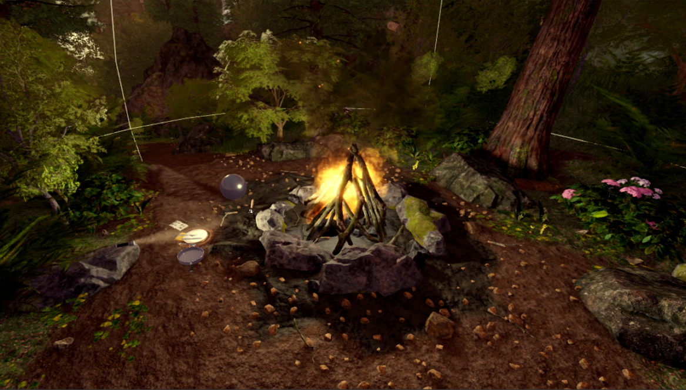

### 조명의 밝기 및 색상 조정

로컬 조명이 이미 현실적인 동작에 가까워지고 있지만, 여전히 강도가 약하고 따뜻한 빛에 비해 너무 하얗습니다. 캠프파이어의 밝기를 높이고 따뜻한 색조를 추가하면 불이 더 생동감 있게 느껴지고 장면의 아늑함을 더합니다.

캠프파이어의 로컬 조명에서 그림자를 활성화하려면:

1. **탐색기** 창에서 캠프파이어의 **PointLight**를 선택합니다.
1. **속성** 창에서
   1. **밝기**를 **2**로 설정합니다.
   1. **색상**을 **255, 179, 73**으로 설정합니다.

   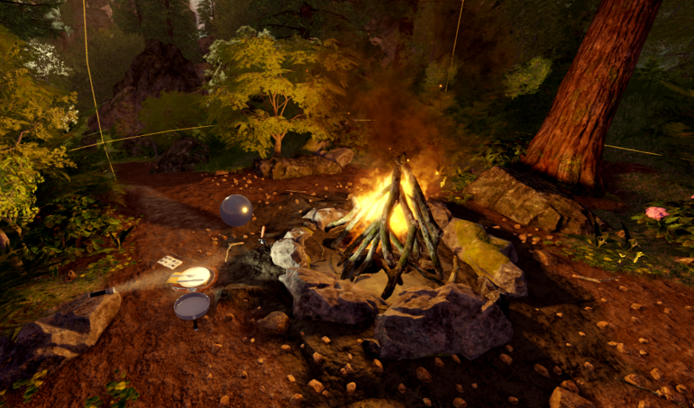

이제 플레이어가 쉴 수 있는 완전하고 환영받는 캠프파이어 장면이 완성되었습니다. 이 튜토리얼의 기술을 사용하여 미래 조명 시스템과 PBR 재료를 결합하여 풍부하고 몰입감 있는 경험을 만들 수 있습니다. 올바른 속성을 설정하고 이러한 기능에 대해 환경에 맞는 결정을 내리기만 하면 됩니다.

---
## 출처
 - [Enhancing Outdoor Environments with Future Lighting](https://create.roblox.com/docs/tutorials/3D-art/enhancing-outdoor-environments-with-future-lighting)

---
## [다음](./02_06_Enhancing_Indoor_Environments.md)