# Enhancing Indoor Environments with Future Lighting

## 목차
- [Enhancing Indoor Environments with Future Lighting](#enhancing-indoor-environments-with-future-lighting)
  - [목차](#목차)
  - [글로벌 조명 구성](#글로벌-조명-구성)
    - [미래 조명 시스템 활성화](#미래-조명-시스템-활성화)
    - [금속 반사 효과 향상](#금속-반사-효과-향상)
    - [시간 설정 변경](#시간-설정-변경)
    - [태양 광선 증폭](#태양-광선-증폭)
    - [주변 조명 색상 조정](#주변-조명-색상-조정)
    - [보완적인 스카이박스 선택](#보완적인-스카이박스-선택)
    - [공기 입자 밀도 증가](#공기-입자-밀도-증가)
  - [로컬 조명 구성](#로컬-조명-구성)
    - [촛불 조명](#촛불-조명)
    - [책상 램프 켜기](#책상-램프-켜기)
    - [라디오 화면 조명](#라디오-화면-조명)
  - [광원 균형 맞추기](#광원-균형-맞추기)
    - [노출 조정](#노출-조정)
    - [색상 대비 조정](#색상-대비-조정)
  - [출처](#출처)
  - [다음](#다음)

---

**미래 조명**은 경험 내 3D 환경을 렌더링하는 데 사용할 수 있는 가장 고급스럽고 강력한 `Lighting.Technology` 시스템입니다. 다른 조명 시스템과 달리, 미래 조명은 실내 및 실외 공간 모두에서 실제 조명을 모방한 픽셀 완벽한 빛 방출, 세밀한 그림자 및 스펙큘러 하이라이트를 제공합니다.

[Lighting Indoors - Start](https://www.roblox.com/games/17561948176/UCT-Lighting-Indoors) `.rbxl` 파일을 시작 지점으로 사용하고 [Lighting Indoors - Complete](https://www.roblox.com/games/17562253150/UCT-Lighting-Indoors-After)를 참조하여, 이 튜토리얼에서는 전략적인 글로벌 및 로컬 광원 구성을 사용하여 플레이어가 오두막의 출구를 향해 이동할 수 있도록 현실적이고 몰입감 있는 실내 조명 동작을 구현하는 방법을 설명합니다. 이를 통해 다음을 안내합니다:

- 반짝이는 표면이 환경이 동적으로 변화함에 따라 주기적으로 업데이트되는 정확한 반사를 갖도록 보장합니다.
- 태양과 지구를 새로운 위치로 이동시켜 창문을 통해 특정 표면에 햇빛을 비춥니다.
- 대기의 주변 색조와 밀도를 사용자 정의합니다.
- 성능과 최적화를 염두에 두고 독특한 환경 문제를 해결할 수 있는 광원을 선택합니다.
- 카메라가 조명 동작을 인식하는 방식을 통해 광원을 균형 있게 배치합니다.

과정 중에 막히는 경우 **Lighting Indoors - Complete**를 참조하여 진행 상황을 비교할 수 있습니다.

<!-- <GridContainer numColumns="2">
  <figure>
    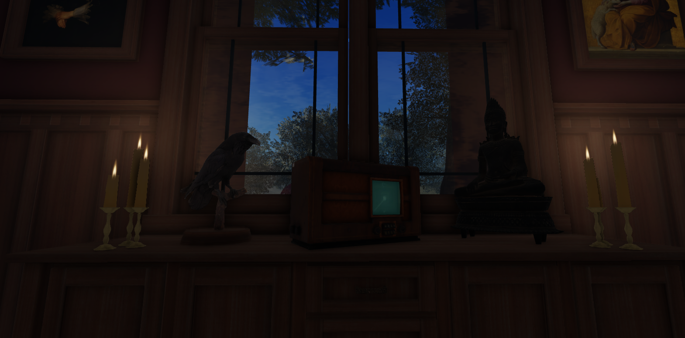
    <figcaption>Lighting Indoors - Start</figcaption>
  </figure>
  <figure>
    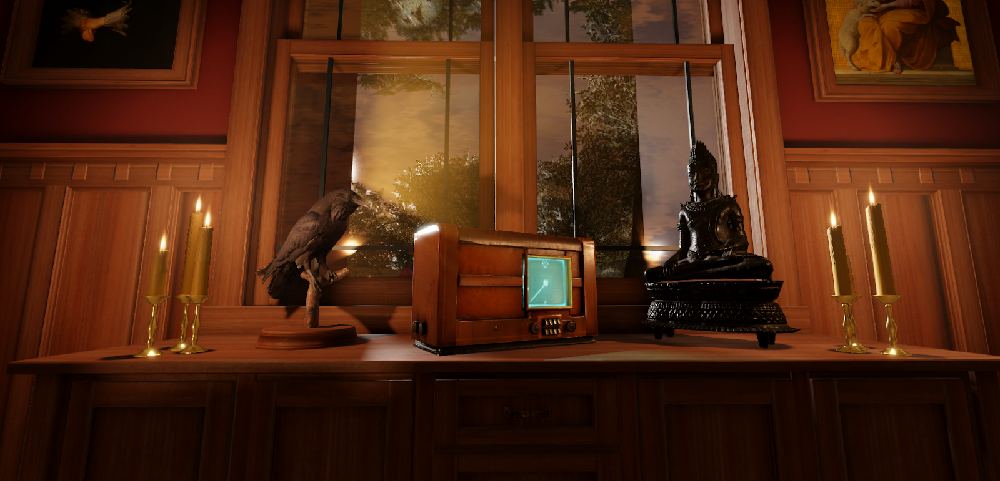
    <figcaption>Lighting Indoors - Complete</figcaption>
  </figure>
</GridContainer> -->

|Lighting Indoors - Start|Lighting Indoors - Complete|
|---|---|
|||

## 글로벌 조명 구성

글로벌 조명은 경험에서 태양 또는 달에서 나오는 빛입니다. 이 튜토리얼은 태양으로부터 가려진 오두막 내부의 조명을 개선하는 데 중점을 두지만, 글로벌 조명을 구성하는 것이 중요합니다. 이는 실내외와 관계없이 경험 내 일반 대기의 공기 입자에 영향을 미치기 때문입니다.

`Lighting` 서비스와 그 자식 `Atmosphere` 객체의 몇 가지 기본 속성을 조정하면, 대기와 창을 통해 들어오는 햇빛이 플레이어에게 어떻게 보이는지, 그리고 이 조명이 경험 내 다른 객체와 어떻게 상호 작용하는지를 크게 변경할 수 있습니다.

### 미래 조명 시스템 활성화

`Lighting.Technology` 속성은 경험 내 글로벌 및 로컬 조명의 동작을 결정합니다. 스튜디오는 모든 경험을 `Technology.ShadowMap` 조명 시스템으로 시작하여 글로벌 조명이 정확한 그림자와 조명을 제공하도록 합니다. 그러나 환경을 개선하고 로컬 광원에서도 정밀한 그림자, 조명 및 스펙큘러 하이라이트를 생성하려면 `Technology.Future` 조명 시스템 기술을 활성화해야 합니다.

이 조명 구성은 글로벌 및 로컬 조명이 함께 작동하여 더 현실적이고 몰입감 있는 시각 효과를 제공합니다. 이를 증명하기 위해, **Lighting Indoors - Complete**가 다른 조명 기술 시스템을 사용할 때 라디오의 조명 동작이 어떻게 변하는지 검토하십시오. `Technology.ShadowMap` 조명 시스템의 촛불과 라디오에서 나오는 로컬 조명은 태양의 글로벌 조명과 같은 그림자를 생성하지 않으며, 라디오의 가죽 및 나무 재질의 세부 사항이 사라집니다.

<!-- <GridContainer numColumns="2">
  <figure>
    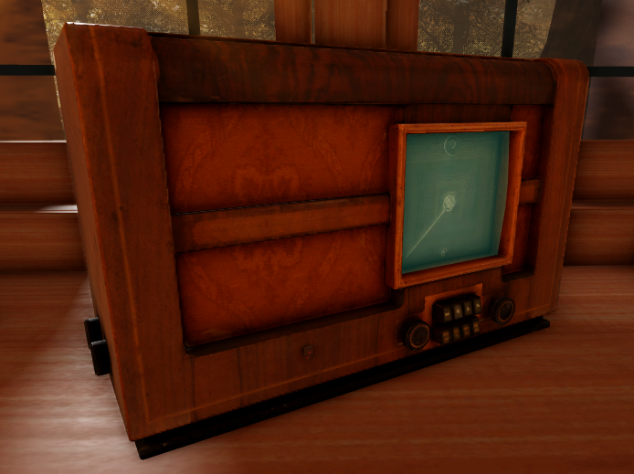
    <figcaption>ShadowMap 기술</figcaption>
  </figure>
  <figure>
    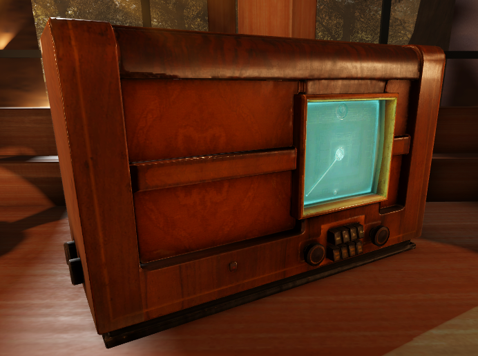
    <figcaption>미래 기술</figcaption>
  </figure>
</GridContainer> -->

|||
|---|---|
|ShadowMap 기술|미래 기술|

미래 조명 시스템이 실내 공간을 감지하여 해당 그림자를 계산하고 렌더링하는 방식 때문에 실내 공간을 `Part` 객체로 최소 1 스터드 두께로 둘러싸서 오두막 내부로 원하지 않는 외부 빛이 스며들지 않도록 하는 것이 가장 좋습니다. 예를 들어, 실내외 조명이 혼합되지 않도록 하기 위해 샘플 **Lighting Indoors - Start**는 모든 `MeshPart` 벽과 천장 객체를 둘러싸되 창문을 가리지 않도록 최소 2.5 스터드 두께의 파트를 사용합니다.

<!-- <GridContainer numColumns="2">
  <figure>
    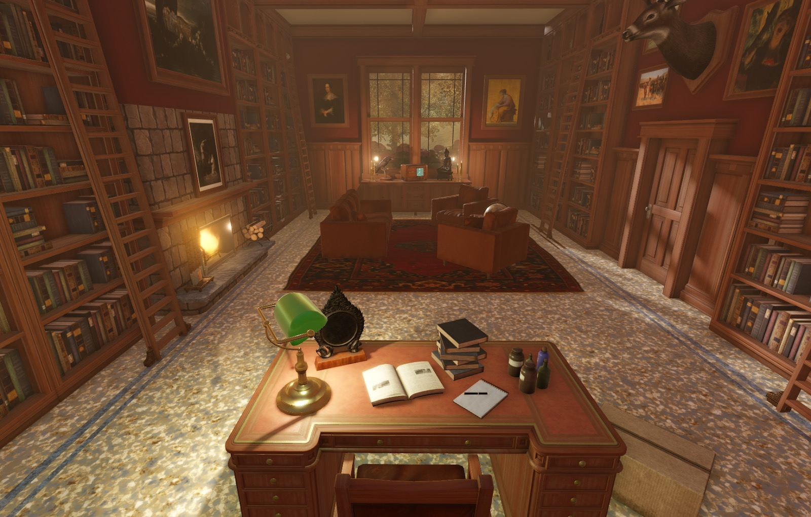
    <figcaption>메쉬 벽과 천장을 파트로 둘러싸지 않은 오두막</figcaption>
  </figure>
  <figure>
    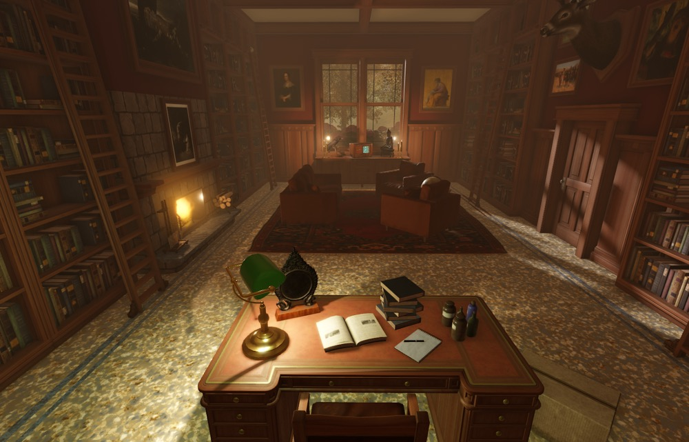
    <figcaption>메쉬 벽과 천장을 파트로 둘러싼 오두막</figcaption>
  </figure>
</GridContainer> -->

|메쉬 벽과 천장을 파트로 둘러싸지 않은 오두막|메쉬 벽과 천장을 파트로 둘러싼 오두막|
|---|---|
|||

**Future** 조명 기술을 활성화하려면:

1. **탐색기** 창에서 **Lighting**을 선택합니다.
1. **속성** 창에서 **Technology** 드롭다운을 클릭한 다음 **Future**를 선택합니다.

   

   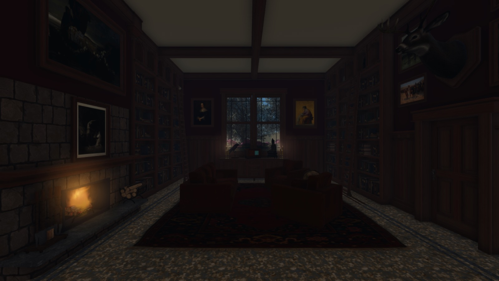

### 금속 반사 효과 향상

미래 조명 시스템을 사용할 때의 주요 이점 중 하나는 반짝이는 금속 표면에 스펙큘러 하이라이트를 생성할 수 있다는 것입니다. 이는 실내 환경의 현실감을 높여 실제 조명 동작을 모방하고 3D 공간의 객체에 깊이감을 제공합니다.

기본적으로 모든 재질은 여러 텍스처 맵을 단일 객체에 사용하여 다양한 조명 시나리오에서 현실적인 표면을 표시할 수 있는 [물리 기반 렌더링](https://create.roblox.com/docs/art/modeling/surface-appearance) (PBR) 텍스처를 사용합니다. 이는 스튜디오의 내장 재질을 사용할 때:

- 특정 표면의 금속성과 거칠기가 추가 단계 없이 이미 정의되어 있습니다.
- 스튜디오의 내장 재질을 사용하는 객체는 환경의 조명에 더 정확하게 반응하여 현실적인 반사를 나타냅니다.

미래 조명 시스템을 사용하여 글로벌 조명의 `Lighting.EnvironmentDiffuseScale` 및 `Lighting.EnvironmentSpecularScale` 속성을 증가시켜 이 효과를 향상시킬 수 있습니다. 특히 각 속성을 `1`로 설정하면 더욱 좋습니다. 이 단계는 경험 내의 PBR 텍스처, `MaterialVariant` 또는 `SurfaceAppearance` 객체에서 나오는 반사가 최적의 상태로 나타나도록 보장하므로 특히 중요합니다.

이 개념을 증명하기 위해, `Lighting.EnvironmentDiffuseScale` 및 `Lighting.EnvironmentSpecularScale` 속성 값이 다른 촛대의 금속 받침대를 살펴보십시오. 이러한 값을 증가시키면 금속은 글로벌 및 로컬 광원에서 나오는 조명을 더 정확하게 반사하게 되어 플레이어가 환경을 탐험할 때 재질이 더 실질적으로 느껴집니다.

<!-- <GridContainer numColumns="2">
  <figure>
    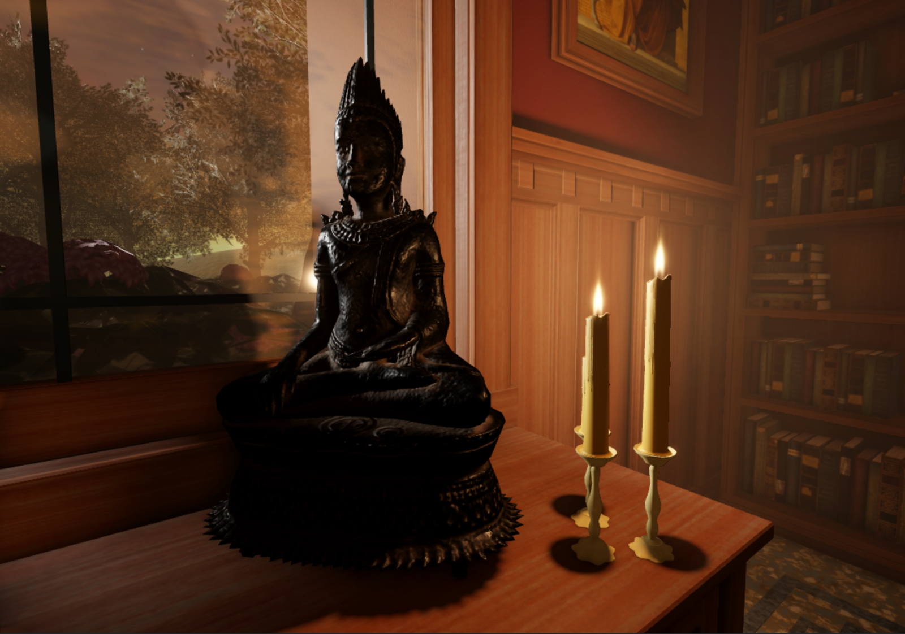
    <figcaption>`Lighting.EnvironmentDiffuseScale` 및 `Lighting.EnvironmentSpecularScale` = `0`</figcaption>
  </figure>
  <figure>
    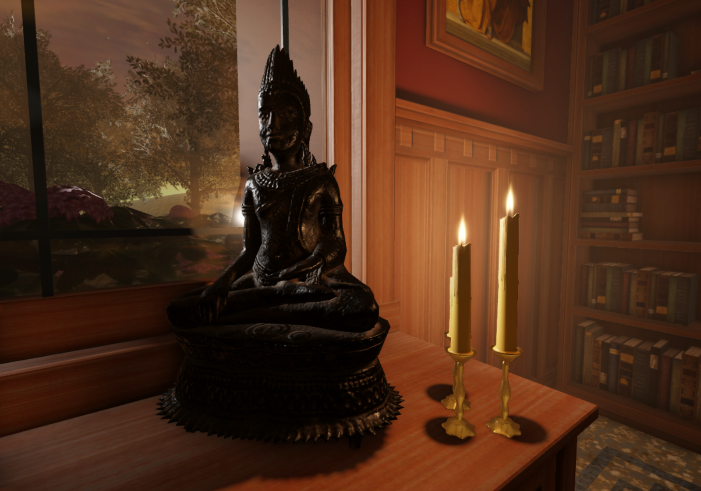
    <figcaption>`Lighting.EnvironmentDiffuseScale` 및 `Lighting.EnvironmentSpecularScale` = `1`</figcaption>
  </figure>
</GridContainer> -->

|`Lighting.EnvironmentDiffuseScale` 및 `Lighting.EnvironmentSpecularScale` = `0`|`Lighting.EnvironmentDiffuseScale` 및 `Lighting.EnvironmentSpecularScale` = `1`|
|---|---|
|||

샘플 [Lighting Indoors - Complete](https://www.roblox.com/games/17562253150/UCT-Lighting-Indoors-After) 파일에서 금속 반사를 재현하려면:

1. **탐색기** 창에서 **Lighting**을 선택합니다.
2. **속성** 창에서 **EnvironmentalDiffuseScale** 및 **EnvironmentSpecularScale**이 `1`로 설정되어 있는지 확인합니다. 그러면 경험 내의 금속이 정확하게 반사됩니다.

### 시간 설정 변경

3D 공간의 일반적인 분위기를 사용자 정의하는 것 외에도 글로벌 조명은 플레이어가 탐험할 공간 내 특정 지점을 조명하는 데 강력한 도구입니다. 이 기술을 로컬 광원과 결합하면 플레이어가 게임 공간의 각 섹션을 간접적으로 안내하고 중요한 내용을 놓치지 않도록 할 수 있습니다.

이 과정을 설명하기 위해, **Lighting Indoors - Complete** 샘플은 햇빛이 오두막의 유일한 문을 강조하는 각도로 들어오도록 태양을 전략적으로 재배치합니다. 플레이어가 방을 스캔할 때, 각 광원이 플레이어의 주의를 간접적으로 끌어 시계 방향으로 이동하게 합니다: 먼저 로컬 광원의 벽난로 쪽으로, 두 번째로 창문 근처의 글로벌 및 로컬 광원 쪽으로, 마지막으로 출구 쪽으로 비치는 글로벌 광원 쪽으로.

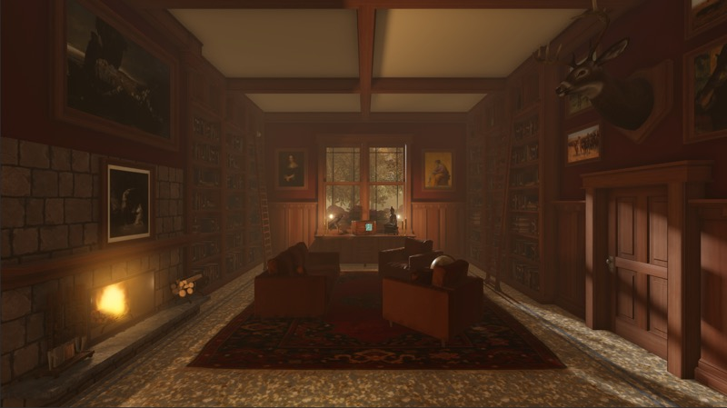

샘플 [Lighting Indoors - Complete](https://www.roblox.com/games/17562253150/UCT-Lighting-Indoors-After) 파일에서 시간을 재현하려면:

1. **탐색기** 창에서 **Lighting**을 선택합니다.
1. **속성** 창에서
   1. **ClockTime**을 `15.6`으로 설정합니다. 태양이 오후 3시 45분 정도의 위치로 이동합니다.
   1. **(선택 사항)** **GeographicLatitude**를 `323`으로 설정합니다.

   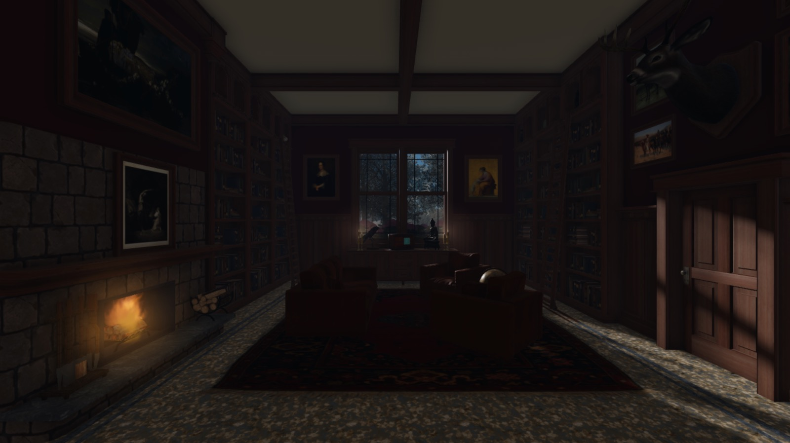

### 태양 광선 증폭

이제 태양이 창을 통해 빛이 비추는 이상적인 위치에 있으므로, `Lighting` 서비스의 자식 객체인 `SunRaysEffect|SunRays` 객체를 사용하여 태양의 개별 광선을 증폭시켜 태양의 조명을 과장할 수 있습니다. 다른 정적 대기 효과와 달리, 태양 광선은 플레이어의 카메라와 태양 사이에 물체가 있을 때 동적으로 모양이 변하여 현실적인 빛과 그림자 시각 효과를 생성합니다.

이를 설명하기 위해, 태양 광선의 강도와 확산을 증가시켰을 때 태양 광선의 모양이 어떻게 변하는지 검토하십시오. 기본 구성의 태양 광선은 창문에 가까워지지만, 사용자 정의 구성의 태양 광선은 오두막으로 빛이 들어옵니다. 이 효과는 플레이어가 공간을 탐험하면서 거의 모든 각도에서 태양 광선이 공기 입자의 밀도를 강조하기 때문에 대기 입자 밀도 효과를 향상시킵니다.

<!-- <GridContainer numColumns="2">
  <figure>
    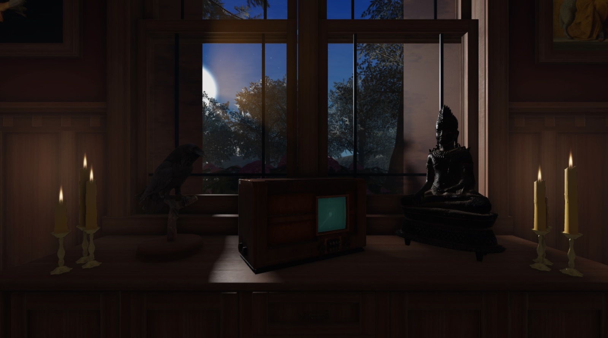
    <figcaption>기본 태양 광선</figcaption>
  </figure>
  <figure>
    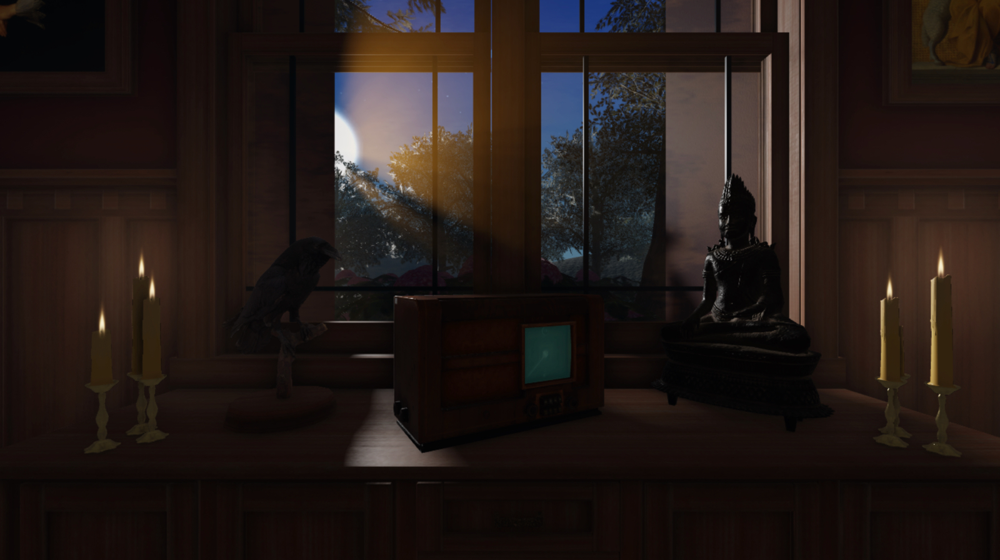
    <figcaption>사용자 정의 태양 광선</figcaption>
  </figure>
</GridContainer> -->

|||
|---|---|
|기본 태양 광선|사용자 정의 태양 광선|

샘플 [Lighting Indoors - Complete](https://www.roblox.com/games/17562253150/UCT-Lighting-Indoors-After) 파일의 대기 내 태양 광선을 재현하려면:

1. **탐색기** 창에서 **Lighting** 서비스의 자식 객체 **SunRays**를 선택합니다.
1. **속성** 창에서
   1. **Intensity**를 `0.023`으로 설정하여 태양의 후광의 불투명도를 증가시킵니다.
   1. **Spread**를 `0.266`으로 설정하여 하늘에 걸친 태양 광선의 확산을 넓힙니다.

### 주변 조명 색상 조정

주변 조명, 즉 3D 공간의 일반적이고 간접적인 빛의 색상을 사용자 정의하는 것은 환경의 분위기를 설정하고 조명의 따뜻함이나 차가움을 결정하는 일반적인 방법입니다. 두 가지 `Lighting` 속성이 주변 조명의 색상을 제어합니다:

- `Lighting.OutdoorAmbient`는 하늘이 보이는 곳의 주변 조명을 제어합니다.
- `Lighting.Ambient`는 하늘이 차단된 공간의 주변 조명을 제어합니다, 예를 들어 실내 환경과 같은 곳에서.

기본적으로 두 속성 모두 차가운 회색 색조를 생성하도록 설정되어 있지만, 이는 오두막 내부의 광원과 일치하지 않습니다. 이 문제를 해결하기 위해, **Lighting Indoors - Complete** 샘플은 `Lighting.Ambient`를 조정하여 벽난로와 촛불의 따뜻함뿐만 아니라 저녁 햇빛의 빛과 일치하는 따뜻한 주황색 색조를 생성합니다. 이 변경은 미묘하지만, 바닥의 그림자와 같은 간접적으로 조명된 영역에서 차이를 크게 느낄 수 있습니다.

<!-- <GridContainer numColumns="2">
  <figure>
    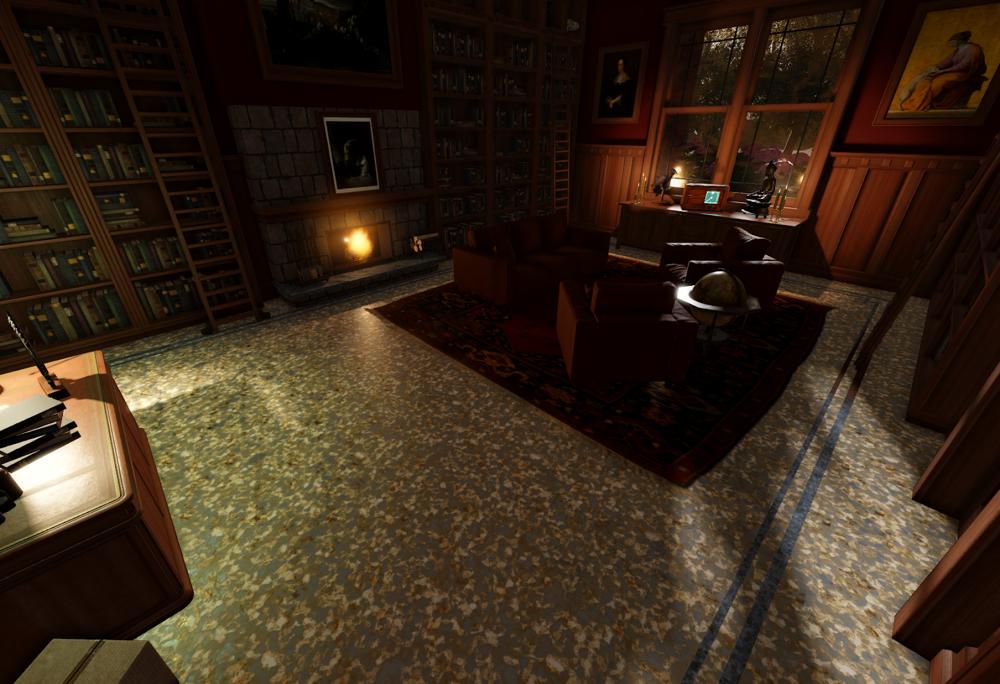
    <figcaption>`Lighting.Ambient` = `70, 70, 70`</figcaption>
  </figure>
  <figure>
    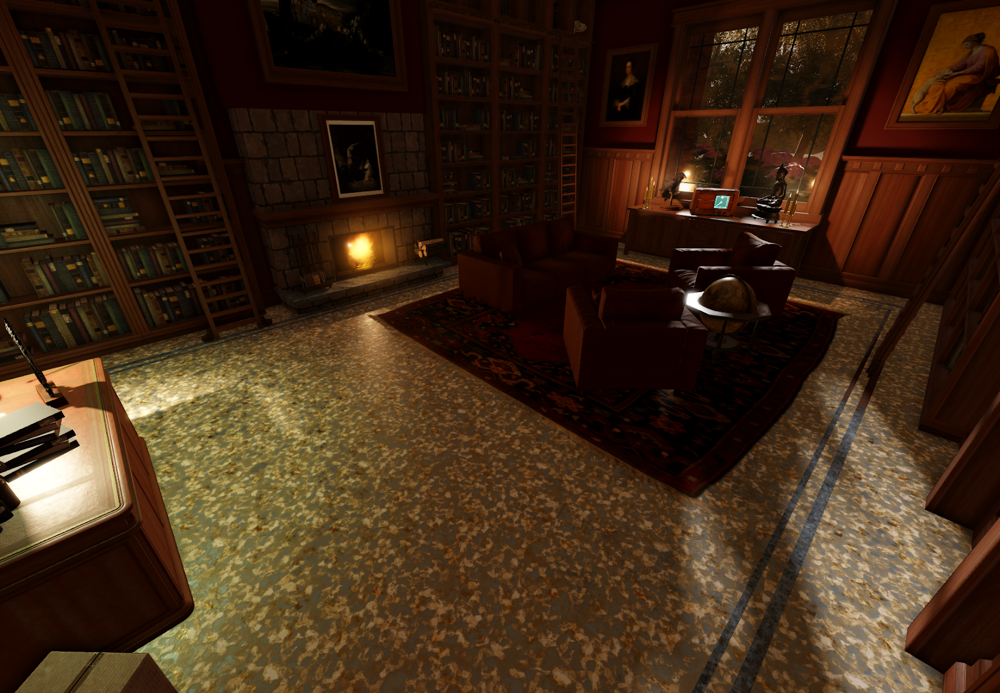
    <figcaption>`Lighting.Ambient` = `83, 70, 57`</figcaption>
  </figure>
</GridContainer> -->

|||
|---|---|
|`Lighting.Ambient` = `70, 70, 70`|`Lighting.Ambient` = `83, 70, 57`|

샘플 [Lighting Indoors - Complete](https://www.roblox.com/games/17562253150/UCT-Lighting-Indoors-After) 파일의 주변 조명 색상을 재현하려면:

1. **탐색기** 창에서 **Lighting**을 선택합니다.
1. **속성** 창에서 **Ambient**를 `83, 70, 57`로 설정합니다. 주변 조명이 더 따뜻하고 어두운 주황색 색조로 변경됩니다.

   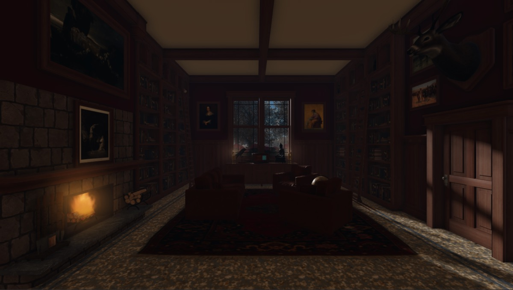

### 보완적인 스카이박스 선택

`Lighting` 서비스에는 경험의 하늘을 구성하는 6개의 개별 속성을 가진 자식 `Sky` 객체가 있습니다. 스카이박스는 환경의 외관과 느낌에 큰 영향을 미칠 수 있으므로, 경험의 시각적 품질을 향상시킬 수 있는 스카이박스를 신중하게 선택하는 것이 중요합니다. 특히 실내 공간에 스며드는 전반적인 분위기에 영향을 미칩니다.

**Lighting Indoors - Complete** 샘플은 따뜻한 분위기를 요구하기 때문에, 밝은 노란색, 생생한 주황색 및 약간의 연두색 등 주로 따뜻한 색조를 우선으로 하는 스카이박스를 사용합니다. 스카이박스를 만들고 사용자 정의하는 방법에 대한 정보는 [Skyboxes](https://create.roblox.com/docs/environment/skybox)를 참조하십시오.

<!-- <GridContainer numColumns="3">
  <figure>
    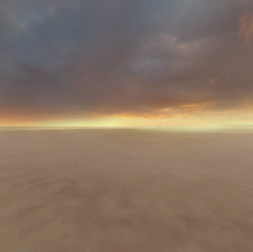
    <figcaption>SkyboxBk</figcaption>
  </figure>
  <figure>
    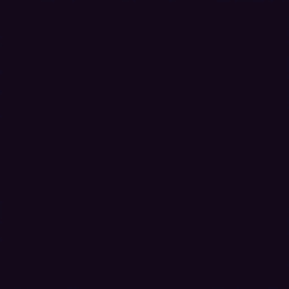
    <figcaption>SkyboxDn</figcaption>
  </figure>
  <figure>
    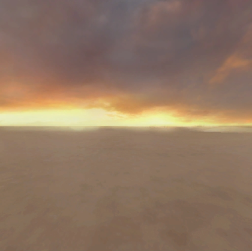
    <figcaption>SkyboxFt</figcaption>
  </figure>
</GridContainer>

<GridContainer numColumns="3">
  <figure>
    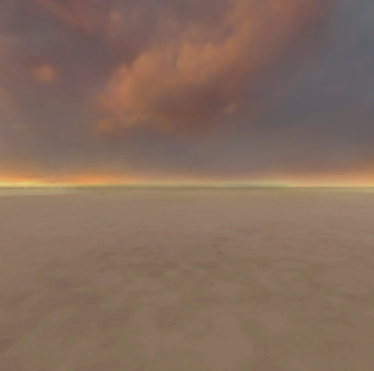
    <figcaption>SkyboxLf</figcaption>
  </figure>
  <figure>
    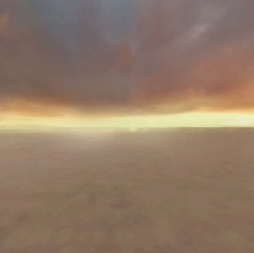
    <figcaption>SkyboxRt</figcaption>
  </figure>
  <figure>
    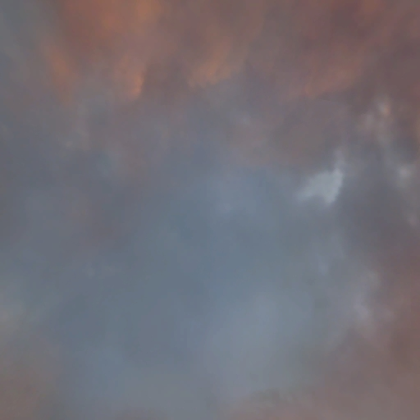
    <figcaption>SkyboxUp</figcaption>
  </figure>
</GridContainer> -->

|<figure><figcaption>SkyboxBk</figcaption></figure>|<figure><figcaption>SkyboxDn</figcaption></figure>|<figure><figcaption>SkyboxFt</figcaption></figure>|
|---|---|---|
|<figure><figcaption>SkyboxLf</figcaption></figure>|<figure><figcaption>SkyboxRt</figcaption></figure>|<figure><figcaption>SkyboxUp</figcaption></figure>|

샘플 [Lighting Indoors - Complete](https://www.roblox.com/games/17562253150/UCT-Lighting-Indoors-After) 파일의 스카이박스를 재현하려면:

1. **탐색기** 창에서 **Lighting** 서비스의 자식 객체 **Sky**를 선택합니다.
2. **속성** 창에서
   1. **SkyboxBk**를 `rbxassetid://162001887`로 설정합니다.
   2. **SkyboxDn**를 `rbxassetid://161998893`로 설정합니다.
   3. **SkyboxFt**를 `rbxassetid://162001897`로 설정합니다.
   4. **SkyboxLf**를 `rbxassetid://162001904`로 설정합니다.
   5. **SkyboxRt**를 `rbxassetid://162001919`로 설정합니다.
   6. **SkyboxUp**를 `rbxassetid://162001926`로 설정합니다.

   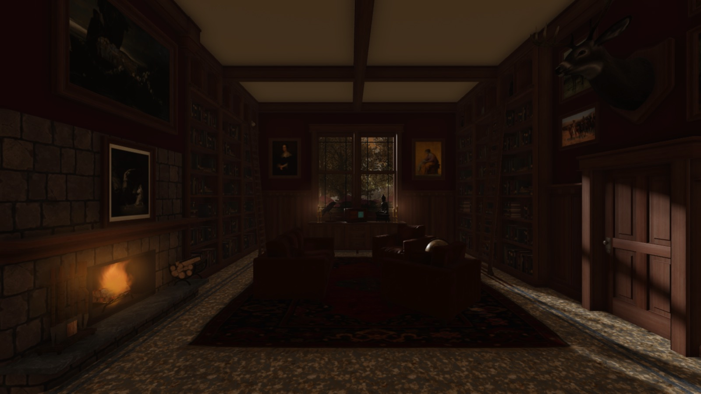

### 공기 입자 밀도 증가

`Lighting` 서비스에는 햇빛을 독특한 방식으로 산란시켜 현실적인 환경을 시뮬레이션할 수 있는 속성을 가진 자식 `Atmosphere` 객체가 있습니다. 이러한 속성 중 일부는 외부 환경에서 실루엣 및 지평선 근처의 먼 물체의 블렌딩에 영향을 미치지만, 다른 속성은 실내외에 관계없이 3D 공간 전체의 공기 입자의 밀도와 색상에 영향을 미칩니다.

예를 들어, `Atmosphere.Density` 속성은 경험의 공기 중에 존재하는 입자의 양을 제어합니다. 이 속성을 증가시키면 추가된 입자가 3D 공간에 질감과 무게감을 더하여 플레이어가 탐험할 수 있는 현실감을 제공합니다. 이는 명확한 로컬 조명 객체 없이도 환경에 질감과 간접 조명을 추가하는 데 유용합니다.

이 기술을 설명하기 위해, 공기 입자 밀도가 다른 **Lighting Indoors - Complete** 오두막의 이미지를 검토하십시오. `Atmosphere.Density`가 `0`으로 설정되었을 때, 오두막은 로컬 광원이 있음에도 불구하고 차갑고 어둡지만, `Atmosphere.Density`가 `0.5`로 설정되면 오두막은 따뜻하고 흐릿해집니다. 이 효과는 `Atmosphere` 객체가 스카이박스의 색상을 기반으로 공기 입자에 따뜻한 주황색 색조를 추가하기 때문에 특히 강력합니다.

<!-- <GridContainer numColumns="2">
  <figure>
    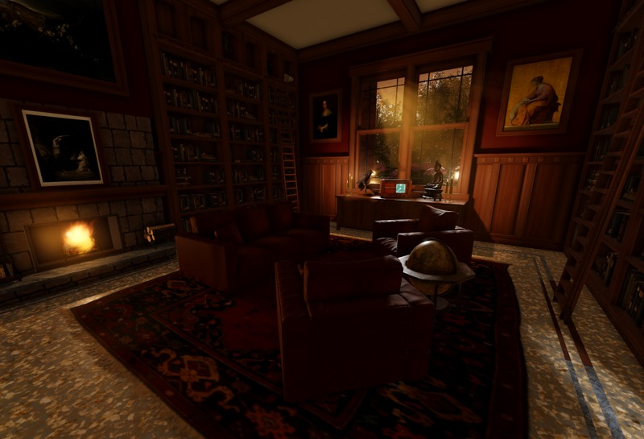
    <figcaption>`Atmosphere.Density` = `0`</figcaption>
  </figure>
  <figure>
    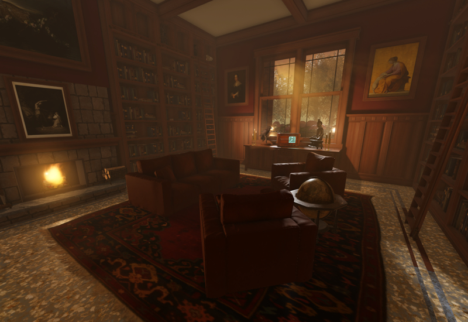
    <figcaption>`Atmosphere.Density` = `0.5`</figcaption>
  </figure>
</GridContainer> -->

|||
|---|---|
|`Atmosphere.Density` = `0`|`Atmosphere.Density` = `0.5`|

샘플 [Lighting Indoors - Complete](https://www.roblox.com/games/17562253150/UCT-Lighting-Indoors-After) 파일에서 대기 중 공기 입자의 밀도를 재현하려면:

1. **탐색기** 창에서 **Lighting** 서비스의 자식 객체 **Atmosphere**를 선택합니다.
1. **속성** 창에서 **Density**를 `0.5`로 설정합니다. 공기가 흐릿해집니다.

   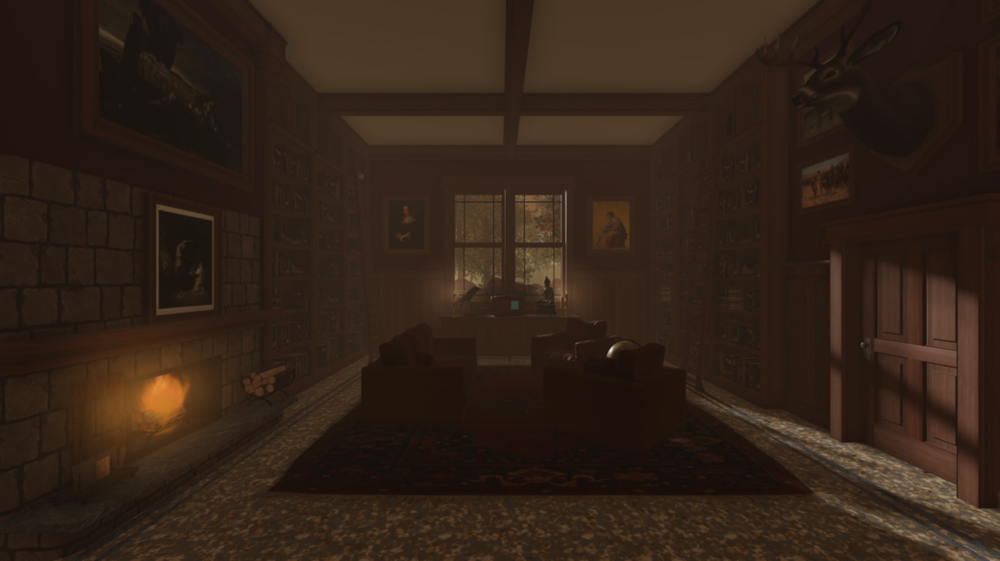

## 로컬 조명 구성

로컬 조명은 `PointLight`, `SpotLight`, `SurfaceLight` 객체와 같은 경험 내 로컬 [광원](https://create.roblox.com/docs/effects/light-sources)에서 나오는 빛입니다. 경험의 일반적인 조명과 대기 요구 사항을 충족하도록 글로벌 조명을 구성한 후, 3D 공간 내에서 조명하려는 특정 조명 요구 사항을 충족하기 위해 이러한 로컬 광원을 사용하는 것이 중요합니다.

다음 섹션에서는 각 유형의 로컬 광원을 생성하고 몇 가지 기본 속성을 조정하여 로컬 조명이 글로벌 조명과 상호 작용하고 전체 환경과 상호 작용하는 방식을 크게 변경하는 방법을 설명합니다.

### 촛불 조명

장면에서 공간을 조명해야 하는 첫 번째 객체는 창문 근처 드레서 위의 촛불 그룹입니다. **Lighting Indoors - Start** 샘플의 기본 구성에는 촛불의 부드러운 빛을 에뮬레이트하기 위해 다음과 같은 `ParticleEmitter` 객체가 포함되어 있습니다:

- **CandleFire** - 촛불의 불꽃을 에뮬레이트하기 위해 가벼운 테이퍼 입자를 생성합니다.
- **CandleSmoke** - 촛불의 연기를 에뮬레이트하기 위해 어두운 테이퍼 입자를 생성합니다.
- **CandleFillLight** - 촛불의 부드러운 빛을 에뮬레이트하기 위해 원형 입자를 생성합니다.

이는 훌륭한 시작이지만, 촛불은 여전히 실제 조명 동작을 생성하지 않아 주변 영역을 완전히 조명하거나 주변 객체에 반사되지 않습니다. 이 조명 필요를 해결하기 위해, **Lighting Indoors - Complete** 샘플은 촛불 그룹의 가운데에 `PointLight` 객체를 도입합니다.

`PointLight` 객체는 작은 태양처럼 모든 방향으로 빛을 구형으로 방출합니다. 이 조명 동작은 덮개가 없는 전구, 횃불 및 촛불과 같은 모든 방향으로 빛을 방출하는 객체에 유용합니다. 이를 설명하기 위해, 포인트 라이트가 있는 것과 없는 것의 장면이 어떻게 변하는지 검토하십시오. 포인트 라이트가 없는 장면은 촛불 자체만 조명하지만, 포인트 라이트가 있는 장면은 촛불, 인근 벽 및 조각의 미세한 세부 사항을 조명합니다.

<!-- <GridContainer numColumns="2">
  <figure>
    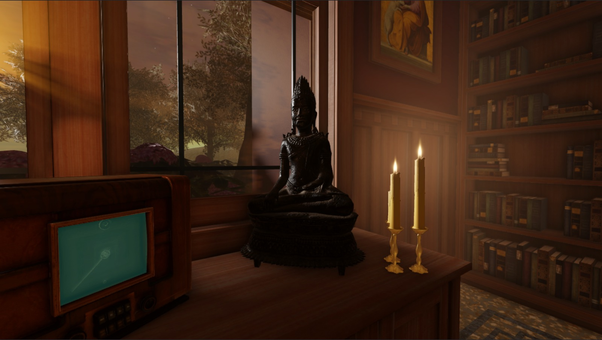
    <figcaption>포인트 라이트 없음</figcaption>
  </figure>
  <figure>
    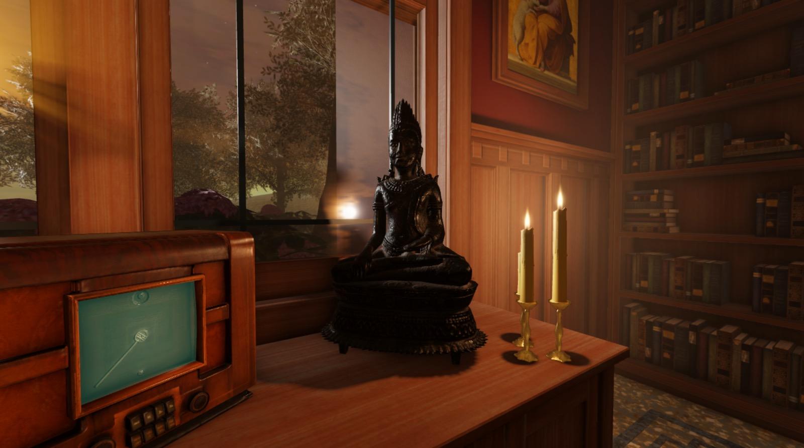
    <figcaption>포인트 라이트 있음</figcaption>
  </figure>
</GridContainer> -->

|||
|---|---|
|포인트 라이트 없음|포인트 라이트 있음|

포인트 라이트는 모든 방향으로 빛을 방출하므로 다른 로컬 광원보다 저사양 장치에서 더 성능 집약적일 수 있습니다. 경험을 최적화하려면 원하는 조명 동작을 손상시키지 않으면서 필요한 포인트 라이트의 수를 고려하십시오. 예를 들어, 샘플은 촛불이 충분히 작아 개별 포인트 라이트가 게임 플레이 영역 내에서 시각적 요소를 크게 향상시키지 않으므로 촛불의 중앙에 단일 포인트 라이트만 배치합니다.

샘플 [Lighting Indoors - Complete](https://www.roblox.com/games/17562253150/UCT-Lighting-Indoors-After) 파일에서 촛불 로컬 조명을 재현하려면:

1. 촛불 그룹에 포인트 라이트를 삽입합니다.
   1. **탐색기** 창에서 **Candle_Group_A** 모델을 확장합니다.
   1. **FillLight** 파트 위로 커서를 이동한 다음 ⊕ 아이콘을 클릭합니다. 컨텍스트 메뉴가 표시됩니다.
   1. 컨텍스트 메뉴에서 **PointLight**를 삽입합니다.

   <!-- <video controls src="../img/02_06_Enhancing_Indoor_Environments/Candles-1.mp4" alt="기본 포인트 라이트가 있는 촛불 그룹의 클로즈업 뷰." width="90%"></video> -->
   

1. 새로운 포인트 라이트를 선택한 다음 **속성** 창에서
   1. **Brightness**를 `0.7`로 설정하여 촛불에 더 적합한 밝기로 빛의 강도를 줄입니다.
   1. **Color**를 `255, 202, 156`으로 설정하여 빛을 복숭아 색조로 틴팅하여 촛불 광원의 따뜻함을 복제합니다.
   1. **Shadows**를 활성화하여 촛불이 그림자를 생성할 수 있도록 합니다.

   <!-- <video controls src="../img/02_06_Enhancing_Indoor_Environments/Candles-2.mp4" alt="커스터마이징된 포인트 라이트가 있는 촛불 그룹의 클로즈업 뷰." width="90%"></video> -->
   

1. **Candle_Group_B**에 대해 이 과정을 반복합니다.

   <!-- <video controls src="../img/02_06_Enhancing_Indoor_Environments/Candles-3.mp4" alt="두 촛불 그룹이 공간을 밝히는 오두막 드레서의 정면 뷰." width="90%"></video> -->
   

1. **(선택 사항)** 이전 단계의 동일한 기술을 사용하여 벽난로에서 타는 불을 비추기 위해 포인트 라이트를 추가합니다.

   <!-- <video controls src="../img/02_06_Enhancing_Indoor_Environments/Candles-4.mp4" alt="모든 불 광원이 공간을 비추는 오두막 전체 뷰." width="90%"></video> -->
   

### 책상 램프 켜기

장면에서 공간을 조명해야 하는 두 번째 객체는 오두막 뒷면 구석에 있는 책상 램프입니다. 어떤 로컬 조명 객체를 사용할지 결정할 때, 실제 세계에서 빛을 비추는 방식이 객체의 유형과 모양에 어떻게 영향을 미치는지 검토하는 것이 중요합니다. 예를 들어, **Lighting Indoors - Start** 샘플의 책상 램프에는 어두운 초록색 후드 아래 하얀 전구가 포함되어 있으므로 램프는 두 가지 다른 유형의 빛을 생성해야 합니다:

- 램프에서 밝은 하얀 빛이 한 방향으로 비춥니다.
- 밝은 하얀 빛 외에 모든 방향에서 어두운 초록색 후드에서 새어 나오는 미세한 초록색 빛.

첫 번째 조명 필요를 해결하기 위해, **Lighting Indoors - Complete** 샘플은 램프 후드에서 노출되지 않은 부분에서 빛을 비추기 위해 `SpotLight` 객체를 책상 램프에 도입합니다. `SpotLight` 객체는 단일 방향으로 원뿔 모양의 빛을 방출하며, `Face` 속성을 사용하여 빛이 방출되는 면/축을 결정합니다. 이 조명 동작은 가로등, 손전등 및 헤드라이트와 같이 방향성 빛을 생성하는 객체에 유용합니다.

두 번째 조명 필요를 해결하기 위해, 샘플은 램프의 어두운 초록색 후드에서 새어 나오는 미세한 초록색 빛을 생성하기 위해 `PointLight` 객체를 사용합니다. 이를 설명하기 위해, 포인트 라이트가 있는 것과 없는 것의 장면이 어떻게 변하는지 검토하십시오. 두 장면 모두 비교 가능한 밝은 하얀 빛을 포함하지만, 포인트 라이트가 있는 장면은 현실적인 조명 동작을 생성하여 인근 조각상과 책장에 반사되어 오두막 구석을 보이게 하고 관심 지점으로 만듭니다.

<!-- <GridContainer numColumns="2">
  <figure>
    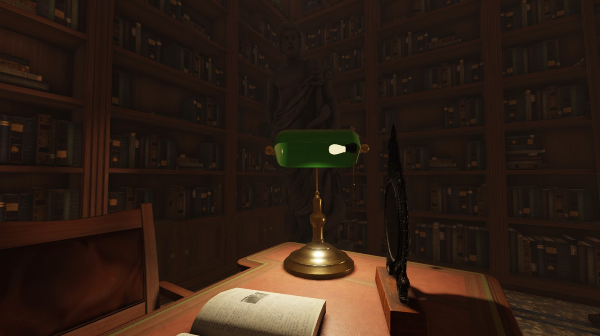
    <figcaption>포인트 라이트 없음</figcaption>
  </figure>
  <figure>
    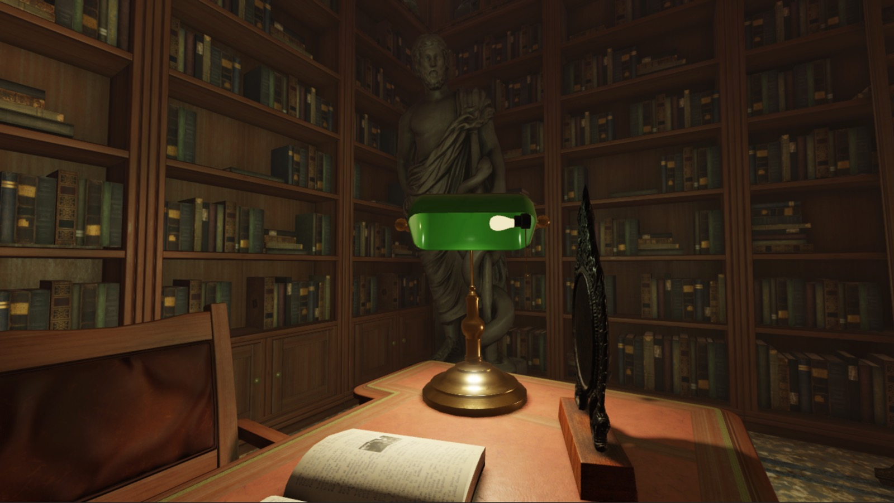
    <figcaption>포인트 라이트 있음</figcaption>
  </figure>
</GridContainer> -->

|||
|---|---|
|포인트 라이트 없음|포인트 라이트 있음|

샘플 [Lighting Indoors - Complete](https://www.roblox.com/games/17562253150/UCT-Lighting-Indoors-After) 파일에서 램프 로컬 조명을 재현하려면:

1. 촛불 그룹에 스포트라이트를 삽입합니다.
   1. **탐색기** 창에서 **Bankers_Lamp** 모델을 확장한 다음 **Lamp_Hood** 메쉬를 확장합니다.
   2. **Lightbulb** 메쉬 위로 커서를 이동한 다음 ⊕ 아이콘을 클릭합니다. 컨텍스트 메뉴가 표시됩니다.
   3. 컨텍스트 메뉴에서 **SpotLight**를 삽입합니다.

   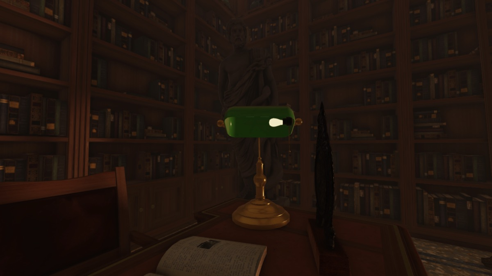

2. 새로운 스포트라이트를 선택한 다음 **속성** 창에서
   1. **Face**를 **Bottom**으로 설정하여 스포트라이트가 책상을 향하도록 합니다.
   2. **Angle**을 `140`으로 설정하여 빛이 원뿔 모양이 아닌 반구형으로 비추도록 합니다.
   3. **Brightness**를 `4`로 설정하여 빛의 강도를 높입니다.
   4. **Color**를 `255, 238, 202`로 설정하여 빛을 연한 황갈색 색조로 틴팅하여 램프 광원의 미묘한 따뜻함을 복제합니다.
   5. **Range**를 `12`로 설정하여 스포트라이트가 조명하는 영역의 크기를 줄여 바닥에 닿도록 합니다.
   6. **Shadows**를 활성화하여 램프 조명이 그림자와 극적인 효과를 생성할 수 있도록 합니다.

   

3. 램프 후드에서 새어 나오는 간접적인 초록색 빛을 모방하기 위해 포인트 라이트를 삽입합니다.
   1. **탐색기** 창에서 **FillLight** 파트 위로 커서를 이동한 다음 ⊕ 아이콘을 클릭합니다. 컨텍스트 메뉴가 표시됩니다.
   2. 컨텍스트 메뉴에서 **PointLight**를 삽입합니다.

   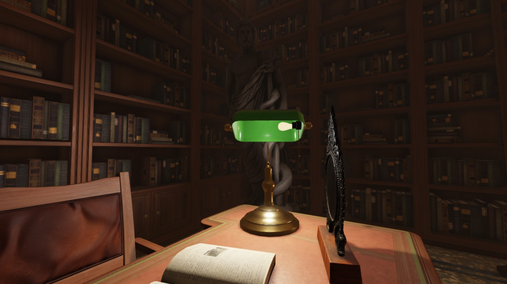

1. 새로운 포인트 라이트를 선택한 다음 **속성** 창에서
   1. **Range**를 `12`로 설정하여 포인트 라이트가 조명하는 영역의 크기를 늘려 책상 뒤의 벽을 조명합니다.
   1. **Color**를 `142, 157, 125`로 설정하여 빛을 연한 이끼 초록색 색조로 틴팅하여 밝기를 간접적으로 줄입니다.

   

### 라디오 화면 조명

장면에서 공간을 조명해야 하는 마지막 객체는 드레서 중간에 있는 고전 라디오입니다. 이전 섹션과 유사하게, 사용할 로컬 조명 객체를 결정할 때, 조명 객체의 유형과 모양이 실제 세계에서 빛을 비추지 않는 방식을 검토하는 것이 중요합니다. 예를 들어, 이전 로컬 조명 객체는 라디오에 적합하지 않습니다. 라디오 화면이 `PointLight` 객체처럼 모든 방향으로 빛을 비추지 않으며, `SpotLight`처럼 한 방향으로 단일 지점에서 빛을 방출하지 않기 때문입니다.

<!-- <GridContainer numColumns="2">
  <figure>
    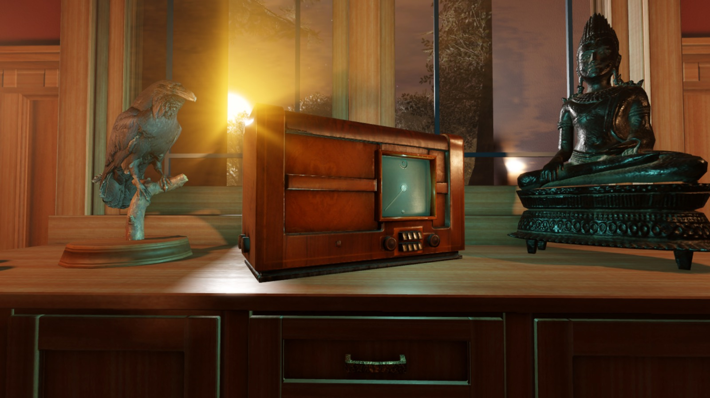
    <figcaption>포인트 라이트를 사용하는 라디오</figcaption>
  </figure>
  <figure>
    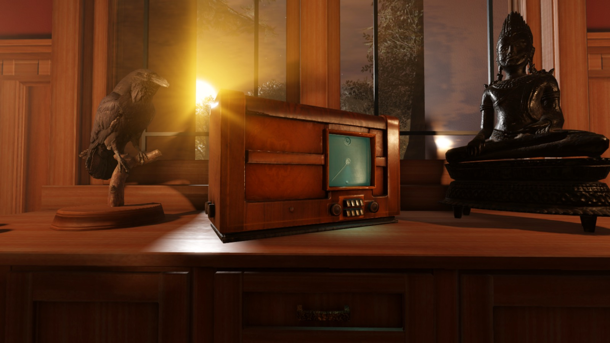
    <figcaption>스포트라이트를 사용하는 라디오</figcaption>
  </figure>
</GridContainer> -->

|||
|---|---|
|포인트 라이트를 사용하는 라디오|스포트라이트를 사용하는 라디오|

대신, 이 조명을 해결하기 위해, **Lighting Indoors - Complete** 샘플은 라디오에 `SurfaceLight` 객체를 도입하여 화면 전체에서 빛을 비추도록 합니다. `SurfaceLight` 객체는 `Attachment` 또는 `BasePart`의 면에서 빛을 방출하며, `Face` 속성을 사용하여 빛이 방출되는 면/축을 결정합니다. 이 조명 동작은 TV나 컴퓨터 화면, 빌보드 및 형광 패널과 같이 평면에 가까운 표면에서 빛을 방출하는 객체에 유용합니다.

스포트라이트와 표면 라이트는 모두 `Face` 속성을 사용하여 빛을 방출할 큐빅 면을 결정하지만, 표면 라이트는 부모 객체의 표면 크기에 따라 빛 방출이 달라집니다. 이를 설명하기 위해, 부모 블록 파트의 크기 상대적으로 표면 라이트가 빛을 방출하는 방식을 비교한 이미지를 검토하십시오.

<GridContainer numColumns="2">
  <figure>
    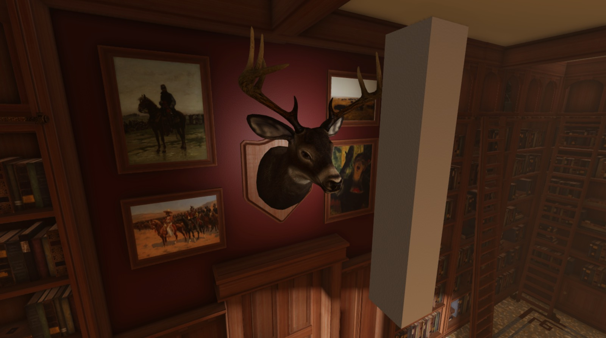
    <figcaption>스포트라이트는 부모 파트의 중심에서 사슴을 비춥니다.</figcaption>
  </figure>
  <figure>
    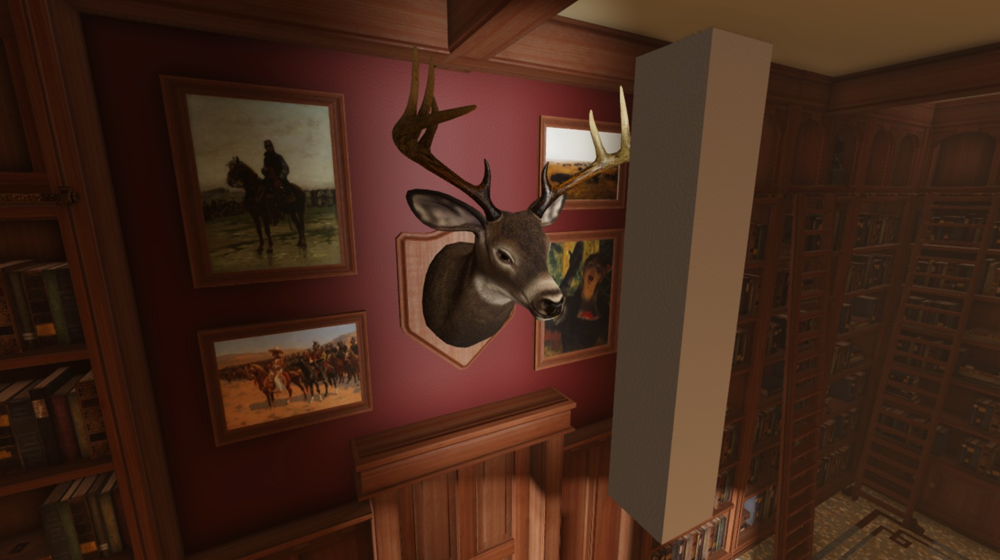
    <figcaption>표면 라이트는 부모 파트의 전체 표면에서 사슴을 비춥니다.</figcaption>
  </figure>
</GridContainer>

샘플 [Lighting Indoors - Complete](https://www.roblox.com/games/17562253150/UCT-Lighting-Indoors-After) 파일에서 라디오 표면 라이트를 재현하려면:

1. 라디오 화면에 표면 라이트를 삽입합니다.
   1. **탐색기** 창에서 **Radio_Noise** 모델을 확장한 다음 자식 **Radio** 모델을 확장합니다.
   2. **Radio_Backglow** 메쉬 위로 커서를 이동한 다음 ⊕ 아이콘을 클릭합니다. 컨텍스트 메뉴가 표시됩니다.
   3. 컨텍스트 메뉴에서 **SurfaceLight**를 삽입합니다.

   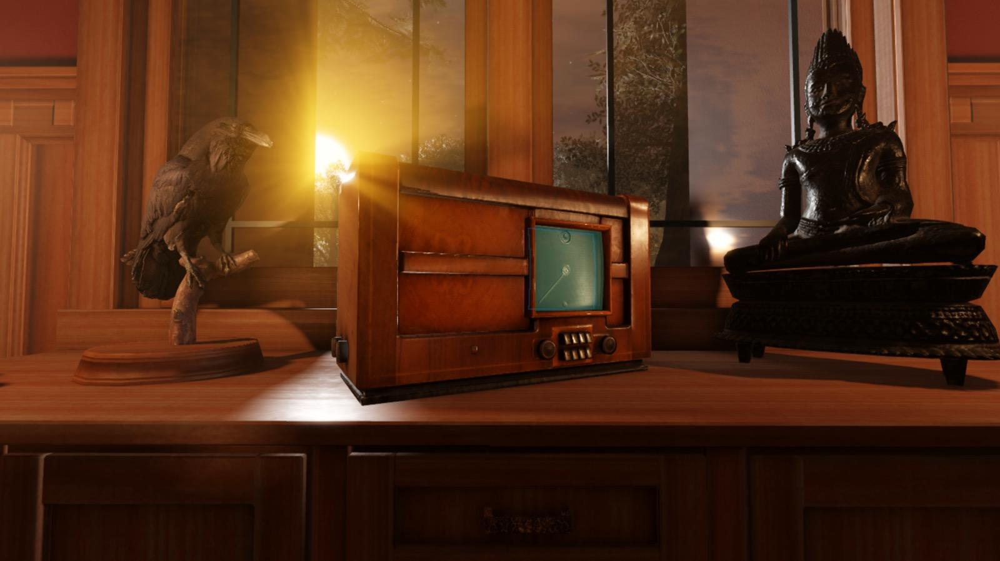

2. 새로운 표면 라이트를 선택한 다음 **속성** 창에서
   1. **Face**를 **Left**로 설정하여 시계 표면에서 빛을 비춥니다.
   2. **Brightness**를 `2`로 설정하여 빛의 강도를 약간 증가시킵니다.
   3. **Color**를 `146, 255, 251`로 설정하여 빛을 청록색 색조로 틴팅합니다.
   4. **Range**를 `4`로 설정하여 표면 라이트가 조명하는 영역의 크기를 줄여 책상에만 닿도록 합니다.

   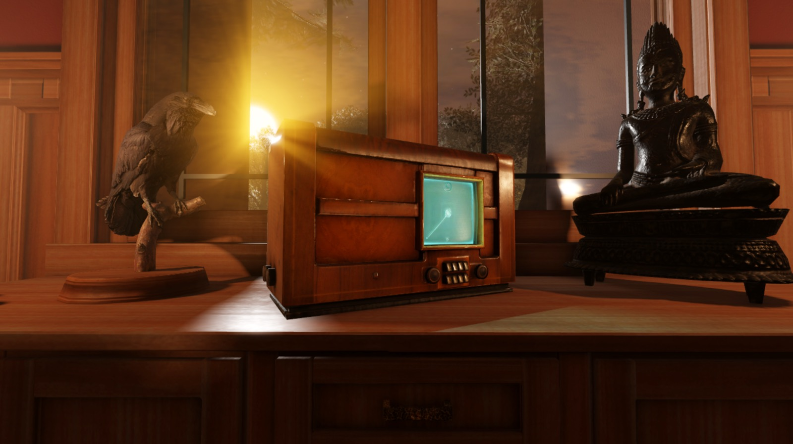

## 광원 균형 맞추기

환경을 조명하는 것은 광원과 카메라의 조명 인식 간의 균형입니다. 광원이 공간을 실제 세계에서 조명하는 방식에 적합한 설정을 가지고 있더라도, 원하는 조명 동작을 달성하기 위해 카메라가 조명을 인식하는 방식을 조정하고 균형을 맞춰야 할 수 있습니다.

예를 들어, 현재 상태의 장면은 의도적으로 오두막 전체에 따뜻한 빛을 가지고 있지만, 색상과 그림자가 모두 흐릿하고 채도가 낮습니다. 이 문제를 해결하기 위해, **Lighting Indoors - Complete** 샘플은 전체 3D 공간의 밝은 색상과 어두운 색상 사이의 세부 사항과 대비를 잃지 않고 카메라에서 색상의 풍부함을 높이기 위해 글로벌 조명을 조정합니다.

### 노출 조정

실제 카메라 렌즈가 사진을 찍기 위해 열려 있는 시간을 사용자 정의하는 것과 유사하게, `Lighting` 서비스의 `ExposureCompensation` 속성을 사용하여 카메라에 도달하는 빛의 양을 조정할 수 있습니다. 이 속성을 사용하는 것은 `Brightness` 속성을 조정하는 것과 다릅니다. `ExposureCompensation`은 환경의 밝은 부분을 강조하는 편향을 적용하기 때문입니다.

예를 들어, 오두막을 밝게 하려면 글로벌 조명의 `Brightness` 속성을 증가시키거나 `ExposureCompensation` 속성을 증가시켰을 때 조명이 어떻게 변하는지 비교해 보십시오. `Brightness` 속성이 높은 오두막은 공간의 모든 밝기를 증가시켜 그림자 내에서도 밝기를 높여 오두막이 의도치 않게 흐릿해집니다. 반면, `ExposureCompensation` 속성이 높은 오두막은 빛과 그림자의 밝기를 동등하게 증가시키지 않아 공간을 더 밝게 보이게 하면서도 어두운 색상을 완전히 씻어내지 않습니다.

<!-- <GridContainer numColumns="3">
  <figure>
    
    <figcaption>기존 오두막</figcaption>
  </figure>
  <figure>
    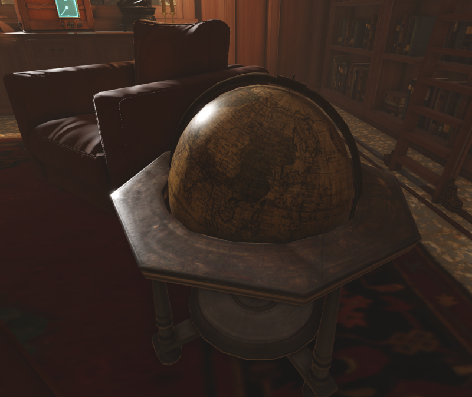
    <figcaption>밝기가 높은 오두막</figcaption>
  </figure>
  <figure>
    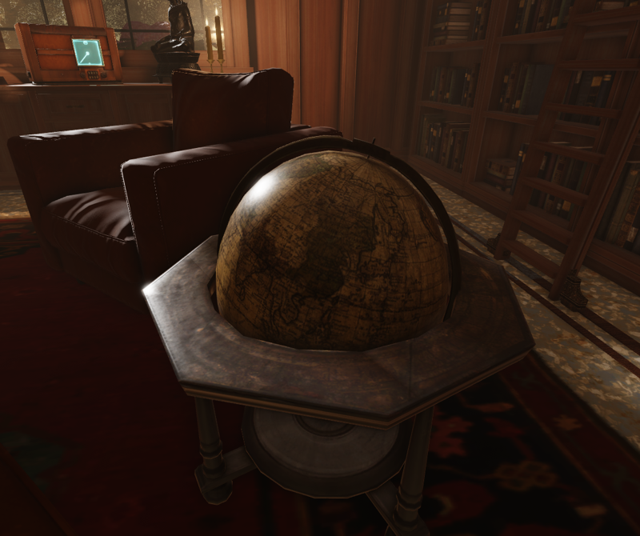
    <figcaption>노출이 높은 오두막</figcaption>
  </figure>
</GridContainer> -->

||||
|---|---|---|
|기존 오두막|밝기가 높은 오두막|노출이 높은 오두막|

샘플 [Lighting Indoors - Complete](https://www.roblox.com/games/17562253150/UCT-Lighting-Indoors-After) 파일에서 노출 수준을 재현하려면:

1. **탐색기** 창에서 **Lighting**을 선택합니다.
1. **속성** 창에서 **ExposureCompensation**을 `0.5`로 설정하여 장면에 추가 노출을 적용합니다.

   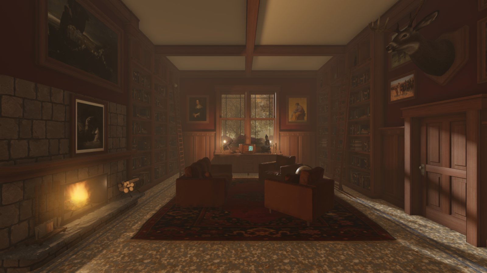

### 색상 대비 조정

카메라에 필터를 적용하는 것과 유사하게, `Lighting` 서비스에 `ColorCorrectionEffect` 후처리 객체를 추가하여 카메라가 색상을 인식하는 방식을 조정할 수 있습니다. 이는 단일 객체나 게임 플레이 영역이 아닌 전체 환경에 영향을 미치는 색상 조정을 하고 싶을 때 유용합니다.

**Lighting Indoors - Complete** 샘플은 `ColorCorrectionEffect`를 사용하여 모든 밝고 어두운 색상 사이의 생동감과 대비를 증가시킵니다. 이는 따뜻하고 포화된 공간을 만들어 플레이어에게 매력적입니다.

샘플 [Lighting Indoors - Complete](https://www.roblox.com/games/17562253150/UCT-Lighting-Indoors-After) 파일에서 카메라가 색상을 인식하는 방식을 재현하려면:

1. **탐색기** 창에서 **Lighting** 서비스 위로 커서를 이동한 다음 ⊕ 아이콘을 클릭합니다. 컨텍스트 메뉴가 표시됩니다.
1. 컨텍스트 메뉴에서 **ColorCorrectionEffect**를 삽입합니다.
1. 새로운 후처리 효과를 선택한 다음 **속성** 창에서
   1. **Contrast**를 `0.05`로 설정하여 밝은 색상과 어두운 색상 사이의 대비를 증가시킵니다.
   1. **Saturation**을 `0.1`로 설정하여 모든 색상을 더 생생하게 만듭니다.

   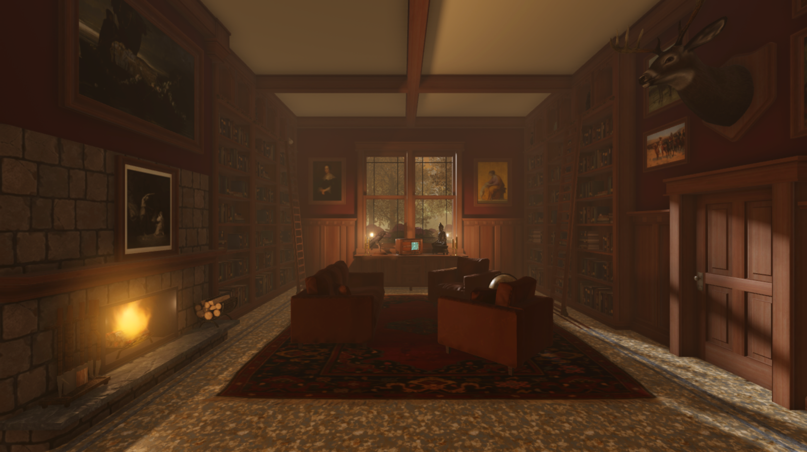

---
## 출처
 - [Enhancing Indoor Environments with Future Lighting](https://create.roblox.com/docs/tutorials/building/environments/enhancing-indoor-environments)

---
## [다음](./03_01_Creating_Lasers_Beams.md)