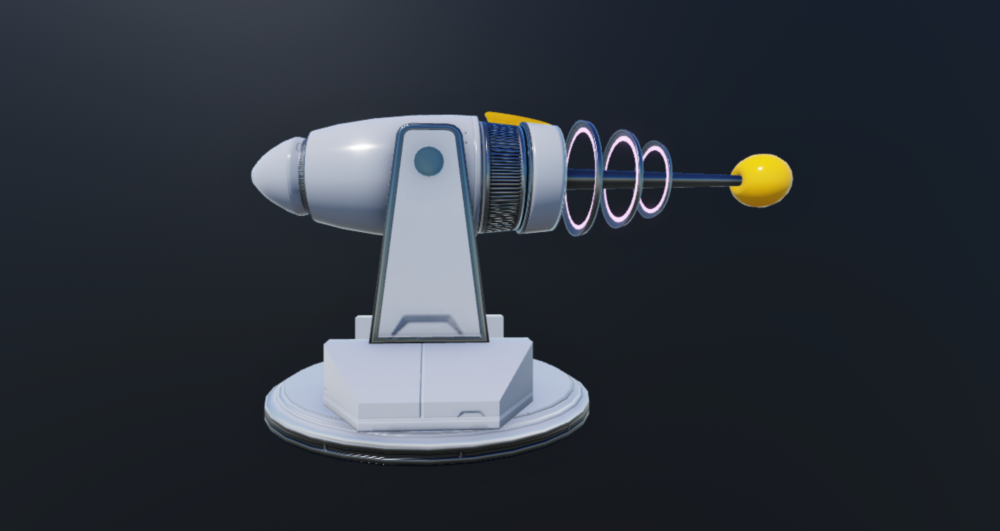
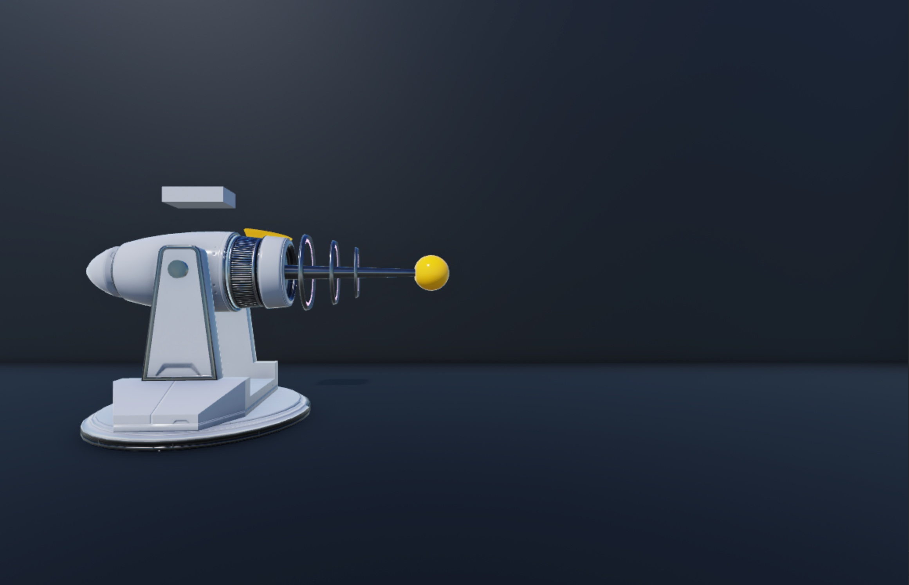
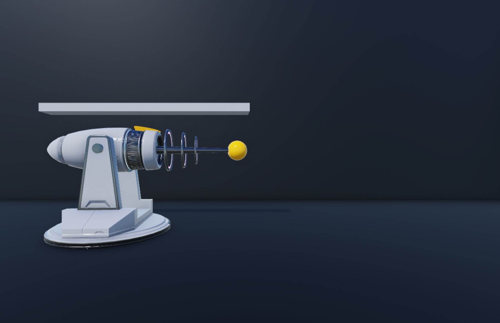
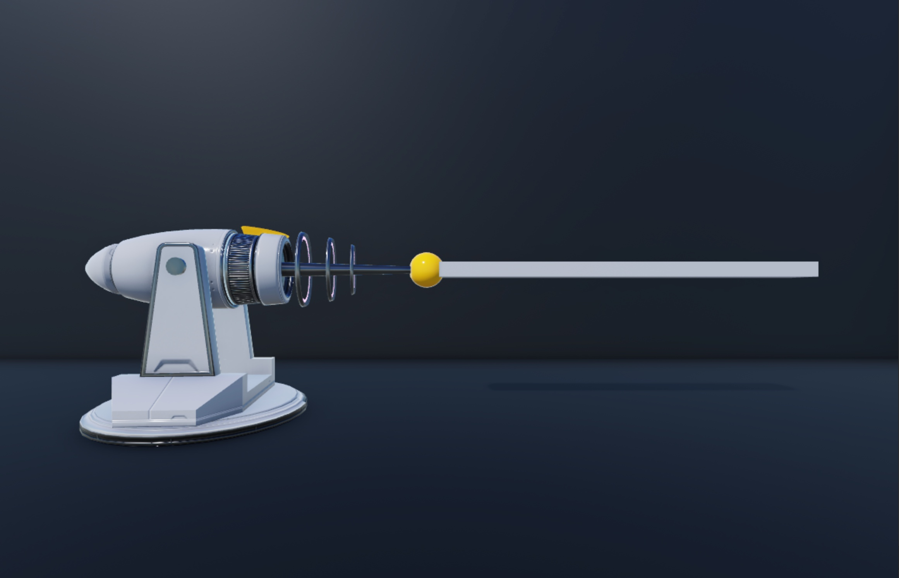
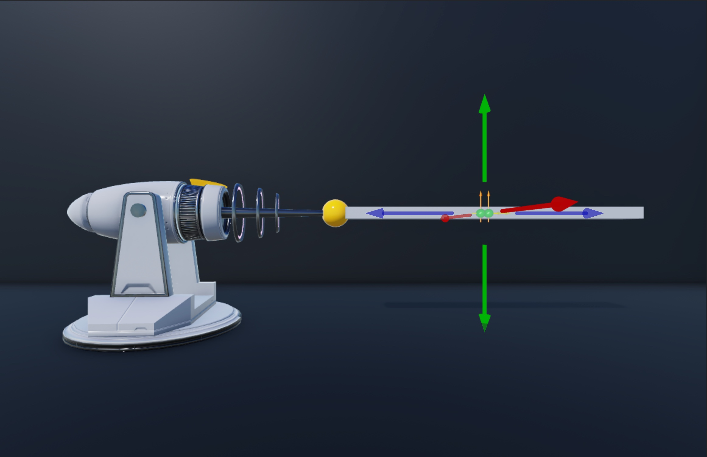
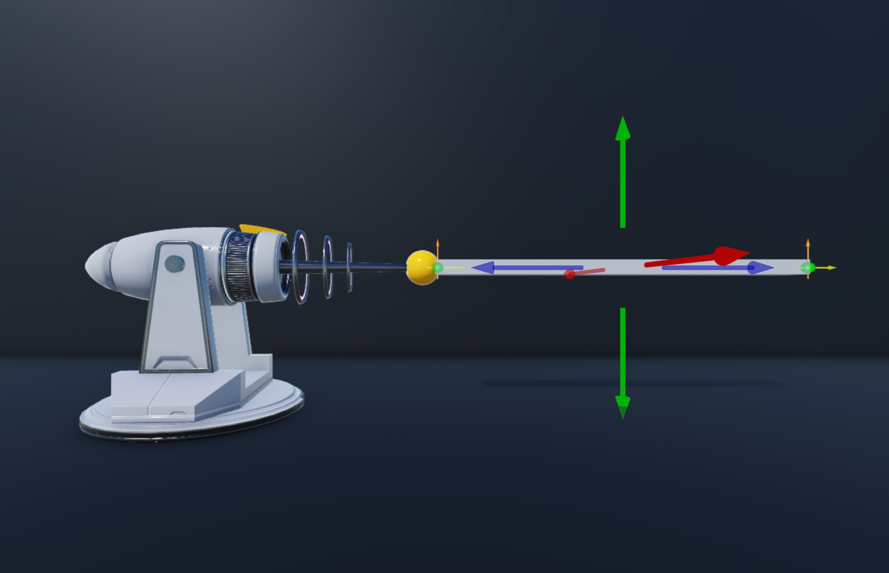
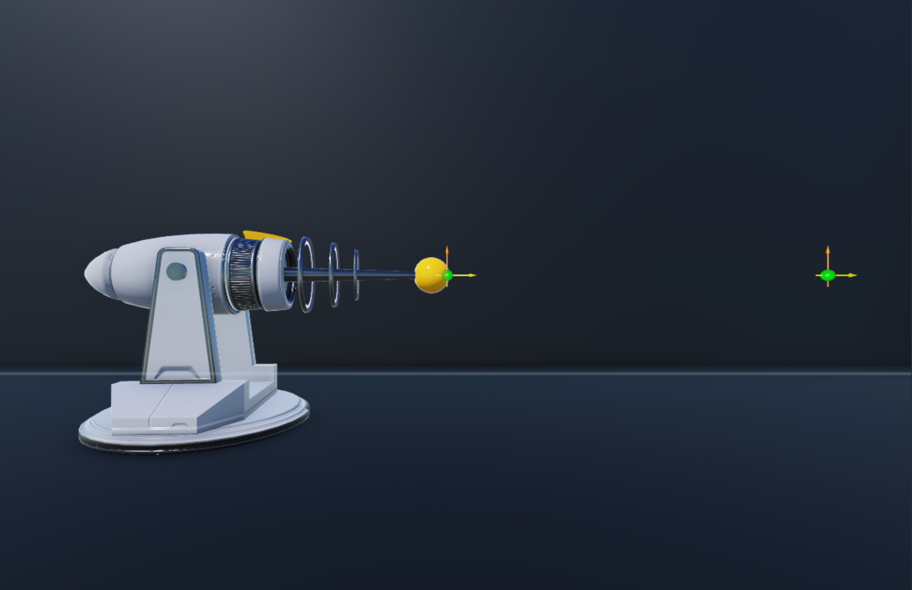
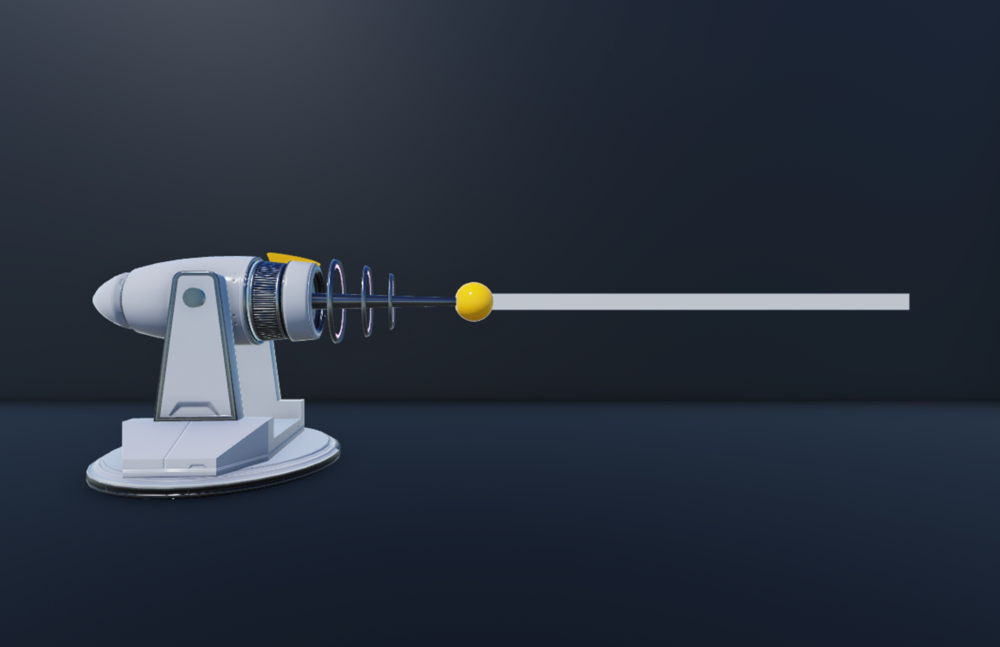
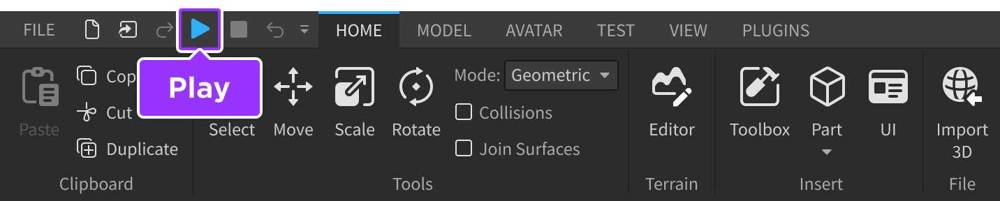
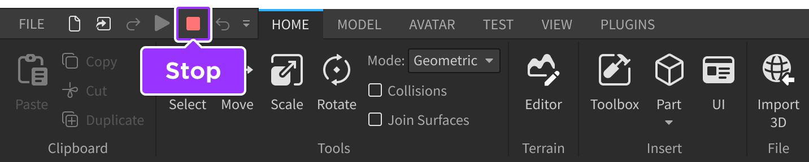

# Creating Lasers Beams

## 목차
- [Creating Lasers Beams](#creating-lasers-beams)
  - [목차](#목차)
  - [블래스터 자산 가져오기](#블래스터-자산-가져오기)
  - [충돌 상자 설정](#충돌-상자-설정)
  - [부착물 구성](#부착물-구성)
  - [빔 커스터마이징](#빔-커스터마이징)
  - [피해 행동 스크립트](#피해-행동-스크립트)
  - [출처](#출처)
  - [다음](#다음)

---

**레이저 빔**은 빛의 광선입니다. 실제로는 거의 위험하지 않지만, 공상 과학 경험에서는 레이저 빔을 충돌 시 플레이어에게 피해를 주는 메커니즘으로 자주 사용합니다. 그러나 미래지향적인 매체에서의 활용도와 두드러짐으로 인해, 레이저 빔은 블래스터 무기, 퍼즐, 장애물, 환경 미학 등 다양한 게임 플레이 메커니즘에 유용합니다.

샘플 [레이저 빔 블래스터](https://create.roblox.com/store/asset/16382650186) 모델을 사용하여, 이 튜토리얼에서는 충돌 시 플레이어의 체력을 0으로 설정하는 선택적 스크립트와 함께 레이저 빔 특수 효과를 만드는 방법을 안내합니다. 여기에는 다음과 같은 지침이 포함됩니다:

- 플레이어가 레이저 빔과 충돌할 때 감지하는 보이지 않는 충돌 상자 설정
- 레이저 빔의 방출 범위를 나타내는 부착물 구성
- 미래지향적인 레이저 빔의 시각적 특성을 모방하는 빔 커스터마이징
- 플레이어의 캐릭터에 피해를 주는 충돌 상자 스크립팅


   서드 파티 모델링 도구에서 자신의 자산을 만들고 자신의 디자인을 따라 할 수 있습니다. 스튜디오에서 사용할 모델을 내보내는 방법에 대한 정보는 [내보내기 요구 사항](https://create.roblox.com/docs/art/modeling/export-requirements)을 참조하십시오.


<!-- <video controls src="../img/03_01_Creating_Lasers_Beams/Script.mp4" width="90%"></video> -->
[](https://prod.docsiteassets.roblox.com/assets/tutorials/laser-traps-with-beams/Script.mp4)

## 블래스터 자산 가져오기

**크리에이터 스토어**는 툴박스의 탭으로, 모델, 이미지, 메쉬, 오디오, 플러그인, 비디오 및 글꼴 자산을 포함한 프로젝트 내에서 사용할 수 있는 Roblox와 커뮤니티에서 만든 모든 자산을 찾을 수 있습니다. 크리에이터 스토어를 사용하여 개별 자산 또는 자산 라이브러리를 열려 있는 경험에 직접 추가할 수 있습니다.

이 튜토리얼에서는 각 단계를 따라 하는 동안 사용할 수 있는 고품질의 레이저 빔 블래스터 모델을 참조합니다.



[다음 페이지로 이동하여](https://create.roblox.com/store/asset/16382650186/Laser-Beam-Blaster) `모델 획득`을 클릭하여 이 모델을 스튜디오 내 인벤토리에 추가할 수 있습니다. 인벤토리에 있는 자산은 플랫폼의 어떤 프로젝트에서도 다시 사용할 수 있습니다.

<!-- <BrowseSampleCard href='https://create.roblox.com/store/asset/16382650186' description='이 고품질 레이저 빔 블래스터로 레이저 빔을 만들어보세요.' title='레이저 빔 블래스터' assetId={16382650186}  /> -->

이 블래스터 자산을 인벤토리에서 경험으로 가져오려면:

1. 메뉴 바에서 **보기** 탭을 선택합니다.
2. **표시** 섹션에서 **툴박스**를 클릭합니다. **툴박스** 창이 표시됩니다.

   

3. **툴박스** 창에서 **인벤토리** 탭을 클릭합니다. **내 모델** 정렬이 표시됩니다.

   

4. **레이저 빔 블래스터** 타일을 클릭합니다. 모델이 뷰포트에 표시됩니다.

## 충돌 상자 설정

충돌 시 플레이어의 체력을 0으로 설정하는 레이저 빔은 플레이어가 레이저와 충돌할 때 감지할 수 있어야 합니다. `Beam` 객체에는 기본적으로 충돌 감지 기능이 없으므로 기본 부품으로 충돌 감지를 설정해야 합니다.

예를 들어, 이 튜토리얼에서는 `Beam` 객체가 있는 보이지 않는 블록 파트를 충돌 상자로 사용하여 캐릭터의 `Humanoid` 객체가 레이저 빔과 닿았을 때 감지합니다. 튜토리얼의 마지막 섹션에서는 이 정보를 사용하여 플레이어의 체력에 피해를 주는 스크립트를 만듭니다.

충돌 상자를 설정하려면:

1. **LaserBeamBlaster**에 **블록** 파트를 삽입합니다.

   

1. 파트를 선택한 다음 **속성** 창에서,
   1. **이름**을 **CollisionBox**로 설정합니다. 파트의 이름과 대소문자 스타일은 튜토리얼 후반의 스크립트에서 중요합니다.
   1. **Anchored**를 활성화하여 경험이 시작될 때 물리 시스템이 파트를 이동하지 않도록 합니다.

1. **CollisionBox**를 블래스터에서 레이저 빔이 발사될 길이로 조정합니다. 예를 들어, 이 튜토리얼에서는 블래스터와 동일한 길이로 조정합니다.

   

1. **CollisionBox**를 블래스터의 방출 전구에서 확장되도록 위치를 이동합니다. 이제 충돌 상자는 블래스터에서 레이저 빔이 발사되는 범위를 나타냅니다.

   

## 부착물 구성

블래스터에 `Beam` 객체를 추가하기 전에, 3D 공간에서 레이저의 방출 범위를 나타내는 두 개의 `Attachment` 객체를 구성하는 것이 중요합니다. 빔은 부착물 사이에 텍스처를 렌더링하여 작동하므로, 참조할 부착물이 없으면 전혀 작동하지 않습니다.

레이저 빔용 부착물을 구성하려면:

1. **(선택 사항)** 3D 공간에서 부착물 시각적 보조 도구를 크게 만들어 레이저 빔의 시작과 끝을 명확하게 시각화할 수 있습니다.
   1. 메뉴 바에서 **모델** 탭으로 이동한 다음 **제약 조건** 섹션으로 이동합니다.
   1. **Scale**을 `2.5`로 설정하여 각 부착물 시각적 보조 도구를 크게 만듭니다.

   

1. 충돌 상자에 두 개의 부착물을 삽입합니다.
   1. **탐색기** 창에서 **CollisionBox** 위로 커서를 이동한 다음 ⊕ 아이콘을 클릭합니다. 컨텍스트 메뉴가 표시됩니다.
   1. 컨텍스트 메뉴에서 **Attachment**를 삽입합니다.
   1. 이 과정을 반복하여 **CollisionBox**에 두 개의 부착물 객체를 만듭니다.
   1. 두 부착물의 이름을 각각 **StartAttachment**와 **EndAttachment**로 변경합니다.

   

1. **StartAttachment**를 방출 전구와 겹치는 **CollisionBox**의 가장자리로 이동한 다음 **EndAttachment**를 레이저 빔의 범위를 나타내는 **CollisionBox**의 가장자리로 이동합니다.

   

1. **CollisionBox**를 투명하게 만들어 부착물 사이에 렌더링되는 텍스처를 가리지 않도록 합니다.
   1. **탐색기** 창에서 **CollisionBox**를 선택합니다.
   1. **속성** 창에서 **Transparency**를 `1`로 설정하여 파트를 완전히 투명하게 만듭니다.

   

## 빔 커스터마이징

이제 3D 공간에 `Attachment` 객체가 있으므로, `Beam` 객체를 추가하고 커스터마이징하여 레이저 빔의 시각적 특성을 모방할 수 있습니다. 이 튜토리얼에서는 미래지향적인 밝은 핑크색 빔을 빠르게 애니메이션하는 방법을 안내하지만, 동일한 속성을 실험하여 다양한 특수 효과를 만들 수 있습니다.

빔을 커스터마이징하려면:

1. **CollisionBox**에 빔을 삽입합니다.
   1. **탐색기** 창에서 **CollisionBox** 위로 커서를 이동한 다음 ⊕ 아이콘을 클릭합니다. 컨텍스트 메뉴가 표시됩니다.
   1. 컨텍스트 메뉴에서 **Beam**을 삽입합니다.
1. 충돌 상자의 부착물을 새 `Beam` 객체에 할당합니다.
   1. **탐색기** 창에서 빔을 선택합니다.
   1. **속성** 창에서,
      1. **Attachment0**을 **StartAttachment**로 설정합니다.
      1. **Attachment1**을 **EndAttachment**로 설정합니다. 빔이 두 부착물 사이에 기본 텍스처를 렌더링합니다.

   

1. 미래지향적인 레이저 빔처럼 보이도록 빔의 시각적 외관을 커스터마이징합니다.
   1. **탐색기** 창에서 빔이 여전히 선택되어 있는지 확인합니다.
   1. **속성** 창에서,
      1. **Texture**를 `rbxassetid://6060542021`로 설정하여 레이저 빔처럼 보이는 새로운 텍스처를 렌더링합니다.
      1. **Color**를 `255, 47, 137`로 설정하여 레이저를 밝은 핑크색으로 착색합니다.
      1. **LightEmission**을 `0.5`로 설정하여 레이저에 약간의 빛나는 효과를 추가합니다.
      1. **Width0**와 **Width1**을 `4`로 설정하여 레이저를 넓게 만듭니다.
      1. **TextureSpeed**를 `2`로 설정하여 레이저를 더 빠르게 애니메이션합니다.
      1. **FaceCamera**를 활성화하여 플레이어가 레이저를 보는 각도에 관계없이 레이저가 보이도록 합니다.

   <!-- <video controls src="../img/03_01_Creating_Lasers_Beams/Beam-3.mp4" width="80%"></video> -->
   [](https://prod.docsiteassets.roblox.com/assets/tutorials/laser-traps-with-beams/Beam-3.mp4)


   커스터마이징할 수 있는 모든 빔 속성에 대한 자세한 정보는 [빔](https://create.roblox.com/docs/effects/beams)을 참조하십시오.


## 피해 행동 스크립트

현재 레이저 빔은 환경에 미적으로 어울리지만, 블래스터 무기로서는 완전히 무해합니다. 레이저 블래스터가 플레이어에게 피해를 줄 수 있도록 수정하려면, 충돌 상자에 이 동작을 트리거하는 스크립트를 추가해야 합니다.

샘플 스크립트는 충돌 상자를 터치하는 객체를 기다리는 방식으로 작동합니다. 충돌 상자를 터치하는 객체에 `Humanoid` 객체가 포함되어 있으면, 스크립트는 `Health` 속성을 `0`으로 설정합니다. 기본적으로 모든 플레이어 캐릭터에는 `Humanoid` 객체가 포함되어 있으므로, 플레이어가 충돌 상자와 충돌할 때마다 스크립트가 즉시 체력을 0으로 설정하여 캐릭터가 무너집니다.

플레이어에게 피해를 주는 행동을 스크립트로 작성하려면:

1. **LaserBeamBlaster**에 스크립트를 삽입합니다.
   1. **탐색기** 창에서 **LaserBeamBlaster** 위로 커서를 이동한 다음 ⊕ 아이콘을 클릭합니다. 컨텍스트 메뉴가 표시됩니다.
   1. 컨텍스트 메뉴에서 **Script**를 삽입합니다.

2. 기본 코드를 다음 코드로 교체합니다:

   ```lua
   local laserTrap = script.Parent
   local collisionBox = laserTrap.CollisionBox

   local function onTouch(otherPart)
   	local character = otherPart.Parent
   	local humanoid = character:FindFirstChildWhichIsA("Humanoid")

   	if humanoid then
   		humanoid.Health = 0
   	end
   end

   collisionBox.Touched:Connect(onTouch)
   ```

3. 레이저 빔에 걸어 들어가 행동을 테스트합니다.

   1. 메뉴 바에서 **재생** 버튼을 클릭합니다. 스튜디오가 플레이테스트 모드로 들어갑니다.

      

   1. 레이저 빔에 걸어 들어가 캐릭터가 무너지는 것을 확인합니다. 완료되면 메뉴 바로 이동하여 **정지** 버튼을 클릭합니다. 스튜디오가 플레이테스트 모드를 종료합니다.

      

   
      동작이 제대로 작동하지 않으면, 스크립트가 **LaserBeamBlaster**의 자식인지 확인하고, 충돌 상자가 `CollisionBox`로 명명되었는지 확인하십시오.
   

이제 위험한 레이저 빔 블래스터가 완성되었습니다! 이 튜토리얼의 기술을 사용하여 빔 특수 효과를 다양하게 커스터마이징할 수 있습니다. 예를 들어, 추가 빔 속성인 `CurveSize0`와 `CurveSize1`을 실험해 보고, 자신의 텍스처를 [가져오기](https://create.roblox.com/docs/production/creator-store)하여 빔을 다른 특수 효과와 결합할 수 있습니다. 예를 들어, [입자 방출기](https://create.roblox.com/docs/effects/particle-emitters)와 [광원](https://create.roblox.com/docs/effects/light-sources)과 같은 특수 효과를 빔과 결합할 수 있습니다. 창작을 즐기세요!

---
## 출처
 - [Creating Lasers Beams](https://create.roblox.com/docs/tutorials/building/effects/laser-traps-with-beams)

---
## [다음](./03_02_Creating_Waterfalls.md)