# Creating Waterfalls with VFX

## 목차
- [Creating Waterfalls with VFX](#creating-waterfalls-with-vfx)
  - [목차](#목차)
  - [참조 자료 분해](#참조-자료-분해)
  - [폭포 설정](#폭포-설정)
  - [물보라 설정](#물보라-설정)
  - [백수 설정](#백수-설정)
  - [거품 설정](#거품-설정)
  - [안개 설정](#안개-설정)
  - [출처](#출처)
  - [다음](#다음)

---

**폭포**는 물이 하나 이상의 수직 낙하를 통해 물체에 떨어지는 강 또는 개울의 지점입니다. 경험은 환경을 개선하거나 시각적 관심 지점을 만들기 위해, 또는 자원을 숨기거나 플레이어를 장소 자체 내의 다른 영역으로 전환하기 위해 폭포를 시각적 미학 목적으로 자주 포함합니다.

[Waterfall Island](https://www.roblox.com/games/16454663889/Use-Case-Tutorials-Volcano-Island) `.rbxl` 파일을 참조하여, 이 튜토리얼에서는 실제 물리적 행동을 나타내는 VFX 객체를 사용하여 폭포를 만드는 방법을 안내합니다. 여기에는 다음과 같은 지침이 포함됩니다:

- 참조 자료를 개별 구성 요소로 분해하여 독특한 시각적 및 행동적 특성을 가진 개별 구성 요소로 나누는 방법.
- 절벽에서 떨어질 때 물이 분산되는 것을 모방하기 위해 다른 속도로 떨어지는 폭포 설정.
- 폭포가 하강할 때 충돌 지점에서 물이 기화되는 것을 모방하기 위한 물방울 설정.
- 물이 바위에 부딪히는 곳에서 격렬하게 기포가 생기는 물을 모방하기 위한 백수 설정.
- 표면 장력을 깨는 모세관 파를 모방하기 위한 거품 설정.
- 충돌 지점에서 상승하고 위로 올라가는 안개 증기를 모방하여 플레이어가 어느 각도에서든 볼 수 있는 무지개를 만드는 방법.


   서드 파티 텍스처 제작 도구에서 자신의 텍스처를 만들고 자신의 디자인을 따라 할 수 있습니다. 스튜디오에서 사용할 텍스처를 가져오는 방법에 대한 정보는 [Asset Manager](https://create.roblox.com/docs/projects/assets/manager)를 참조하십시오.


<!-- <video controls src="../img/03_02_Creating_Waterfalls/Intro.mp4" width="90%"></video> -->
[](https://prod.docsiteassets.roblox.com/assets/tutorials/creating-waterfalls/Intro.mp4)

## 참조 자료 분해

신뢰할 수 있는 폭포를 만들기 위해 디자인 과정에서 실제 자연 특징을 참조하는 것이 중요합니다. 이는 주제를 개별 구성 요소로 분해하여 각기 다른 시각적 및 행동적 특성을 갖도록 할 수 있기 때문입니다. 예를 들어, 샘플 [Waterfall Island](https://www.roblox.com/games/16454663889/Use-Case-Tutorials-Volcano-Island) 경험은 워싱턴 주의 Snoqualmie Falls를 참조하여 폭포와 주변 지형과 관련된 모든 텍스처 및 VFX 디자인 결정을 내립니다.

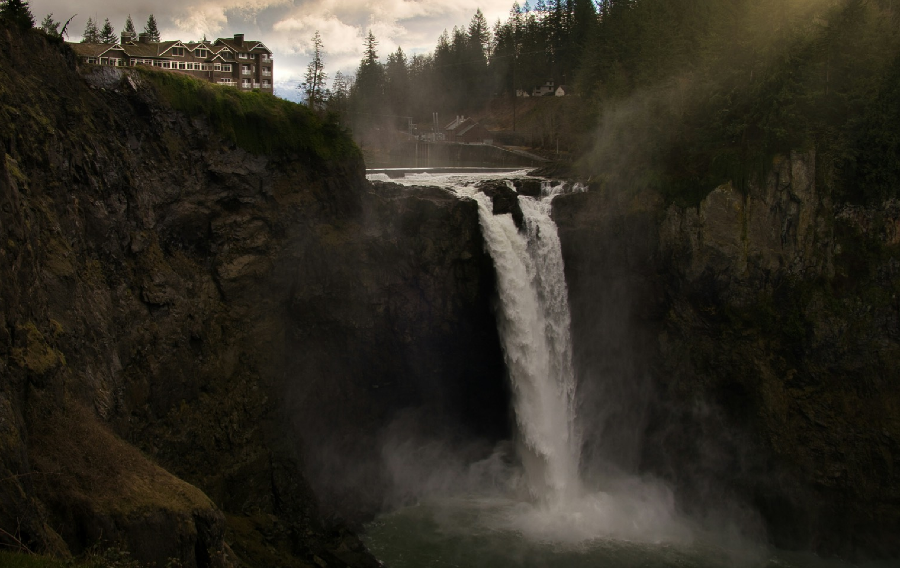

폭포는 여러 상태의 물질이 역동적인 유체 및 공기 운동과 관련된 연속적이고 연결된 물의 흐름이지만, 이 복잡한 시스템을 개별 구성 요소로 분해하면 각 구성 요소를 모방하기 위해 다른 VFX 객체를 사용하는 방법을 계획할 수 있습니다. 이를 설명하기 위해 이 튜토리얼에서는 샘플 폭포를 다섯 가지 고유한 구성 요소로 분해합니다:

- **폭포** – 절벽에서 떨어지는 물.
- **물보라** – 폭포가 하강하여 충돌할 때 흩어지는 물.
- **백수** – 절벽 가장자리에 접근할 때 물이 소용돌이치는 물.
- **거품** – 폭포와 충돌할 때 수평으로 흩어지는 기포가 있는 물.
- **안개** – 전체 폭포의 결과로 공기 중에서 기화된 구름 같은 물.

<!-- <GridContainer numColumns="2">
  <figure>
    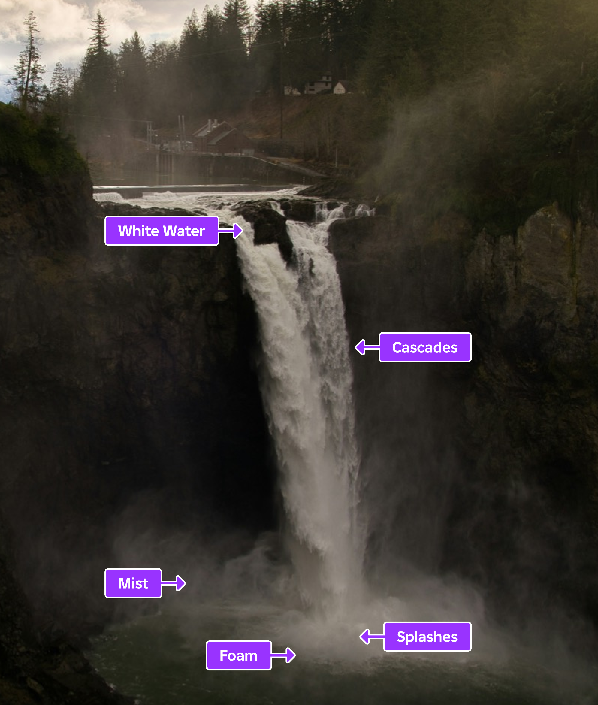
  </figure>
  <figure>
    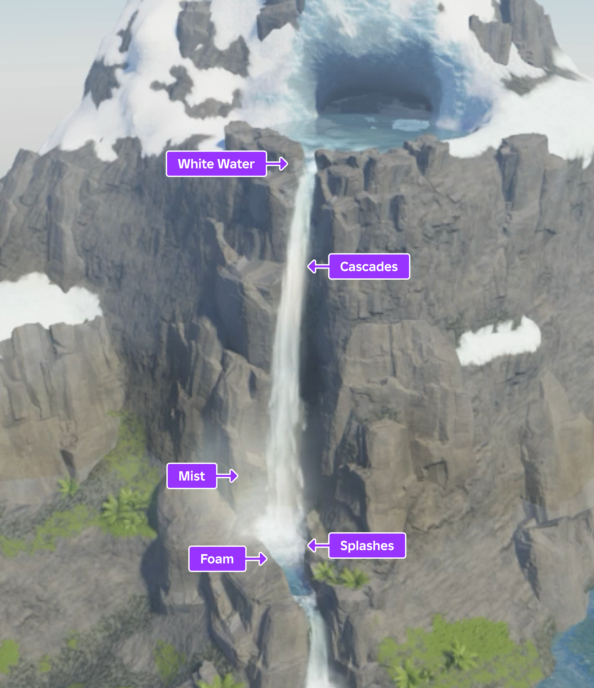
  </figure>
</GridContainer>
 -->

|||
|---|---|

다음 섹션에서는 샘플의 3D 공간에서 주요 낙하를 구성하는 각 폭포 구성 요소를 재현하기 위해 사용할 수 있는 다양한 디자인 결정 및 기술에 대한 심층 분석을 제공합니다. 이러한 결정을 검토하고 다양한 `Beam` 및 `ParticleEmitter` 속성을 실험하면서 자신의 경험에 대한 고유한 환경 요구 사항을 해결하기 위해 VFX를 사용하는 방법을 배우게 됩니다.

## 폭포 설정

**폭포**는 절벽이나 절벽에서 떨어지는 물로, 낙하 수영장에 떨어집니다. 폭포는 물의 양과 낙하하는 거리에 따라 다른 속도로 떨어집니다. 예를 들어, 샘플의 주요 낙하는 많은 양의 물이 큰 거리를 떨어지기 때문에 더 천천히 떨어지는 것처럼 보이지만, 샘플의 두 번째 낙하는 적은 양의 물이 짧은 거리를 떨어지기 때문에 더 빨리 떨어지는 것처럼 보입니다.

<!-- <GridContainer numColumns="2">
  <figure>
    <video controls src="../img/03_02_Creating_Waterfalls/Cascades-MainDrop.mp4" width="100%"></video>
    <figcaption>주요 낙하</figcaption>
  </figure>
  <figure>
    <video controls src="../img/03_02_Creating_Waterfalls/Cascades-SecondDrop.mp4" width="100%"></video>
    <figcaption>두 번째 낙하</figcaption>
  </figure>
</GridContainer> -->

<!-- |<video controls src="../img/03_02_Creating_Waterfalls/Cascades-MainDrop.mp4" width="100%"></video>|<video controls src="../img/03_02_Creating_Waterfalls/Cascades-SecondDrop.mp4" width="100%"></video>|
|---|---|
|주요 낙하|두 번째 낙하|

또한 폭포는 하강하면서 물이 분산되기 때문에 다양한 속도로 떨어지는 폭포 층을 자주 가지고 있습니다. 이 원리를 설명하기 위해 샘플은 다양한 속도와 길이로 `Beam` 객체를 사용하여 여러 개의 원활한 텍스처를 렌더링합니다. 이는 주요 낙하에 더 현실적인 낙하 행동을 제공할 뿐만 아니라 폭포가 깊이와 부피를 가진 것처럼 보이도록 착시를 만들어 내기 때문에 2D 이미지임에도 불구하고 현실감을 더해줍니다. -->

|[](https://prod.docsiteassets.roblox.com/assets/tutorials/creating-waterfalls/Cascades-MainDrop.mp4)|[](https://prod.docsiteassets.roblox.com/assets/tutorials/creating-waterfalls/Cascades-SecondDrop.mp4)|
|---|---|
|주요 낙하|두 번째 낙하|

또한 폭포는 하강하면서 물이 분산되기 때문에 다양한 속도로 떨어지는 폭포 층을 자주 가지고 있습니다. 이 원리를 설명하기 위해 샘플은 다양한 속도와 길이로 `Beam` 객체를 사용하여 여러 개의 원활한 텍스처를 렌더링합니다. 이는 주요 낙하에 더 현실적인 낙하 행동을 제공할 뿐만 아니라 폭포가 깊이와 부피를 가진 것처럼 보이도록 착시를 만들어 내기 때문에 2D 이미지임에도 불구하고 현실감을 더해줍니다.

<!-- <GridContainer numColumns="2">
  <figure>
    <video controls src="../img/03_02_Creating_Waterfalls/Cascades-MainDrop.mp4" width="100%"></video>
    <figcaption>이 폭포는 물이 다양한 속도로 하강하고 분산되기 때문에 자연스럽게 보입니다.</figcaption>
  </figure>
  <figure>
    <video controls src="../img/03_02_Creating_Waterfalls/Cascades-Unnatural.mp4" width="100%"></video>
    <figcaption>이 폭포는 물이 같은 속도로 하강하고 분산되기 때문에 비자연스럽게 보입니다.</figcaption>
  </figure>
</GridContainer> -->

<!-- |<video controls src="../img/03_02_Creating_Waterfalls/Cascades-MainDrop.mp4" width="100%"></video>|<video controls src="../img/03_02_Creating_Waterfalls/Cascades-Unnatural.mp4" width="100%"></video>|
|---|---|
|이 폭포는 물이 다양한 속도로 하강하고 분산되기 때문에 자연스럽게 보입니다.|이 폭포는 물이 같은 속도로 하강하고 분산되기 때문에 비자연스럽게 보입니다.| -->

|[](https://prod.docsiteassets.roblox.com/assets/tutorials/creating-waterfalls/Cascades-MainDrop.mp4)|[](https://prod.docsiteassets.roblox.com/assets/tutorials/creating-waterfalls/Cascades-Unnatural.mp4)|
|---|---|
|이 폭포는 물이 다양한 속도로 하강하고 분산되기 때문에 자연스럽게 보입니다.|이 폭포는 물이 같은 속도로 하강하고 분산되기 때문에 비자연스럽게 보입니다.|

샘플 [Waterfall Island](https://www.roblox.com/games/16454663889/Use-Case-Tutorials-Volcano-Island) 장소 파일에서 주요 낙하의 폭포를 재현하려면:

1. 폭포 물의 유출을 생성합니다.
   1. **탐색기** 창에서 **작업공간**에 **폴더**를 생성하여 모든 유출 객체를 포함시키고, 폴더 이름을 **Outflow**로 변경합니다.
   1. **Outflow** 폴더에 두 개의 **블록** 파트를 삽입한 후, 각각의 이름을 **OutflowStart**와 **OutflowStop**으로 변경합니다.
   1. **OutflowStart**를 유출이 시작될 위치로 이동시키고, **OutflowStop**을 절벽 가장자리로 이동시킵니다.

      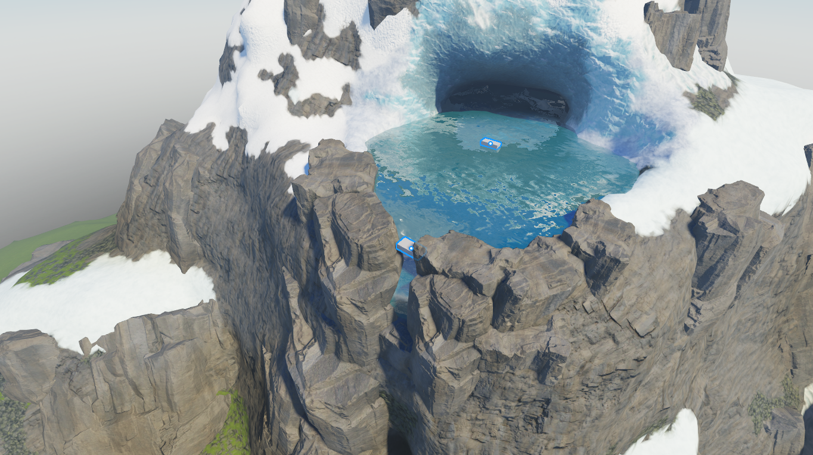

   1. **OutflowStart**와 **OutflowStop**에 각각 부착물을 삽입한 후, 부착물의 노란 시각적 보조 도구가 위를 향하도록 회전시킵니다.

      

   1. **Outflow** 폴더에 **Beam**을 삽입한 후, 이름을 **OutflowWater**로 변경합니다.
   1. 각 파트의 부착물을 **OutflowWater**에 할당합니다.

      1. **탐색기** 창에서 **OutflowWater**를 선택합니다.
      1. **속성** 창에서,
         1. **Attachment0**을 **OutflowStart**의 부착물로 설정합니다.
         1. **Attachment1**을 **OutflowStop**의 부착물로 설정합니다. 빔이 두 부착물 사이에 기본 텍스처를 렌더링합니다.

      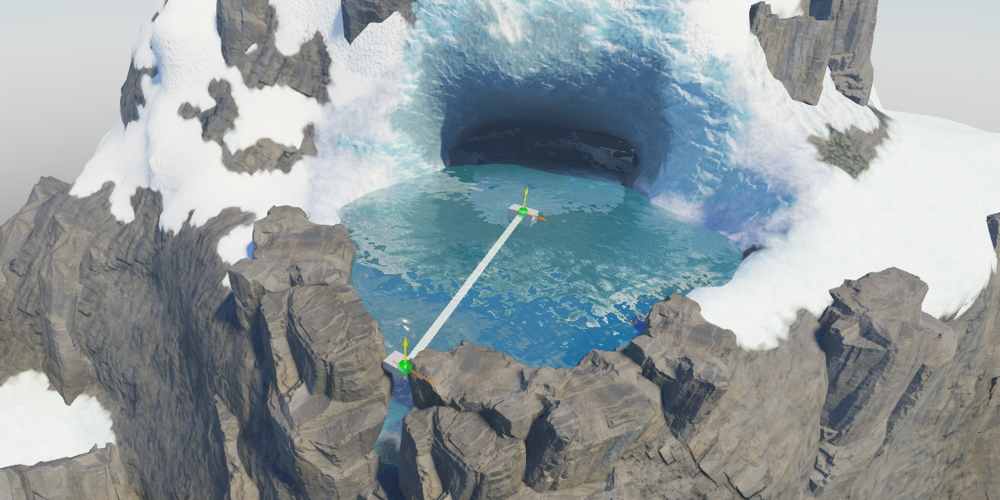

   1. 빔의 시각적 외관을 커스터마이징하여 절벽 가장자리를 향해 흐르는 물처럼 보이게 합니다.

      1. **탐색기** 창에서 **OutflowWater**가 여전히 선택된 상태인지 확인합니다.
      1. **속성** 창에서,
         1. **Texture**를 `rbxassetid://4787437624`로 설정하여 흐르는 거품처럼 보이는 새로운 텍스처를 렌더링합니다.
         1. **Width0**을 `60`으로 설정하여 텍스처가 렌더링을 시작하는 축에서 넓게 만듭니다.
         1. **Width1**을 `20`으로 설정하여 텍스처를 절벽 가장자리로 깔대기 형태로 만듭니다.
         1. **TextureSpeed**를 `0.4`로 설정하여 텍스처의 흐름을 느리게 합니다.
         1. **TextureLength**를 `64`로 설정하여 텍스처의 길이를 늘립니다.
         1. **TextureMode**를 **Wrap**으로 설정하여 부착물 사이의 3D 세계에서 빔의 전체 길이의 양을 텍스처의 **TextureLength**로 나누어 텍스처를 반복합니다. 이는 텍스처가 흐르는 물처럼 보이게 합니다.
         1. **Color**를 어두운 파랑과 밝은 파랑, 흰색으로 번갈아가며 설정하는 색상 시퀀스로 설정합니다.
            1. **Color** 속성을 클릭한 다음 ⋯ 버튼을 클릭합니다. 색상 시퀀스 팝업이 표시됩니다.

               

               색상 시퀀스의 하단 축의 각 삼각형은 입자의 수명 주기 동안 해당 지점에서 속성의 색상 값을 결정하는 **키포인트**입니다.

            1. 색상 시퀀스의 시간 및 값 속성을 다음과 같이 설정합니다:

               - **Time** = `0`, **RGB 값** = `208, 247, 255`
               - **Time** = `0.135`, **RGB 값** = `146, 235, 255`
               - **Time** = `0.248`, **RGB 값** = `255, 255, 255`
               - **Time** = `0.384`, **RGB 값** = `128, 183, 202`
               - **Time** = `0.757`, **RGB 값** = `166, 213, 248`
               - **Time** = `1`, **RGB 값** = `255, 255, 255`

               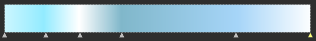

         1. **Transparency**를 절벽 가장자리로 접근하면서 물이 더 생동감 있게 보이도록 하는 숫자 시퀀스로 설정합니다.
            1. **Transparency** 속성을 클릭한 다음 ⋯ 버튼을 클릭합니다. 숫자 시퀀스 팝업이 표시됩니다. 기본적으로 그래프는 직선이며 이미지가 왼쪽에서 오른쪽으로 동일한 투명도로 유지됩니다.

               

               숫자 시퀀스의 시작과 끝에 있는 각 사각형은 텍스처의 왼쪽에서 오른쪽으로 해당 지점에서 속성의 투명도 값을 결정하는 **키포인트**입니다.

            1. 숫자 시퀀스의 시간 및 값 속성을 다음과 같이 설정합니다:

               - **Time** = `0`, **Value** = `1`
               - **Time** = `0.375`, **Value** = `0.725`
               - **Time** = `0.615`, **Value** = `0`
               - **Time** = `0.92`, **Value** = `1`
               - **Time** = `1`, **Value** = `1`

               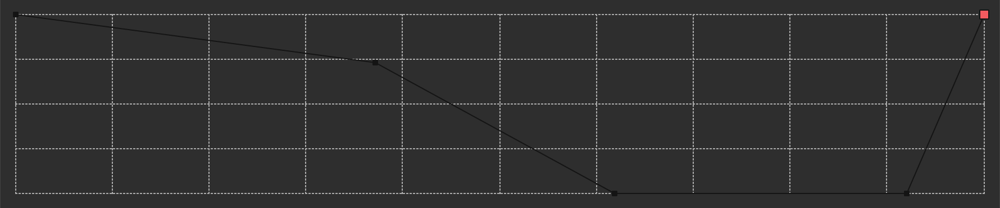

         1. 각 파트를 스케일하여 텍스처가 유출 수영장의 너비를 덮도록 합니다. 이제 유출이 모든 각도에서 절벽 가장자리로 흐르는 것처럼 보입니다.

      <!-- <video controls src="../img/03_02_Creating_Waterfalls/Cascades-1H.mp4" width="90%"></video> -->
      [](https://prod.docsiteassets.roblox.com/assets/tutorials/creating-waterfalls/Cascades-1H.mp4)

1. 주요 낙하에서 빠르게 흐르는 폭포를 생성합니다.
   1. **탐색기** 창에서 **작업공간**에 **폴더**를 생성하여 모든 폭포 객체를 포함시키고, 폴더 이름을 **Cascades**로 변경합니다.
   1. **Cascades** 폴더에 두 개의 **블록** 파트를 삽입한 후, 각각의 이름을 **MainDropStart**와 **MainDropStop**으로 변경합니다.
   1. **MainDropStart**를 절벽 가장자리로 이동시키고, **MainDropStop**을 낙하 수영장 아래로 이동시킵니다.

      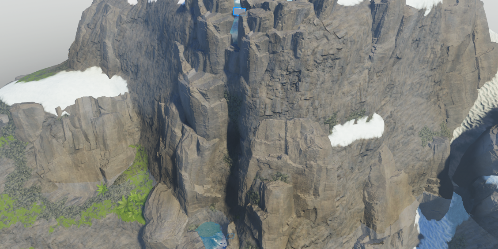

   1. 모든 주요 낙하의 폭포 빔이 텍스처를 렌더링하는 데 사용할 부착물을 구성합니다.
      1. **MainDropStart**에 부착물을 삽입한 후, 부착물의 노란 시각적 보조 도구가 절벽에서 떨어지도록 회전시킵니다.
      1. **MainDropStop**에 부착물을 삽입한 후, 부착물의 노란 시각적 보조 도구가 절벽을 향하도록 회전시킵니다.

      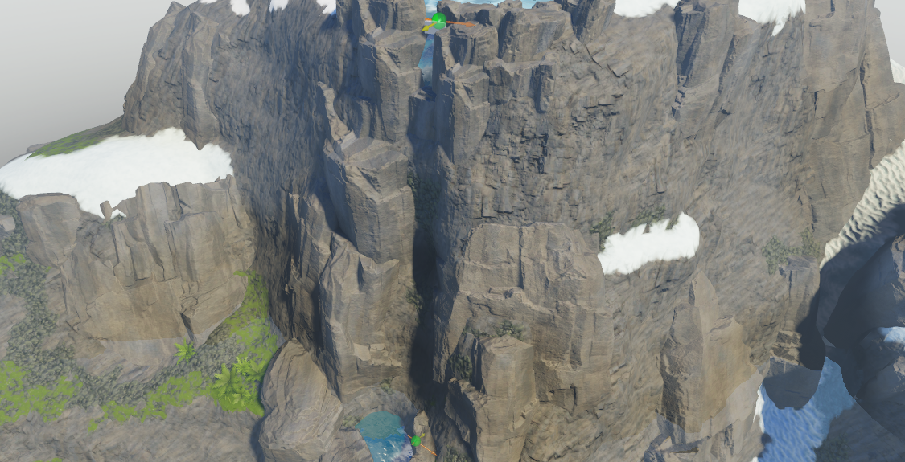

   1. **Cascades** 폴더에 **Beam**을 삽입한 후, 이름을 **FastDrop**으로 변경합니다.
   1. 각 파트의 부착물을 **FastDrop**에 할당합니다.
      1. **탐색기** 창에서 **FastDrop**을 선택합니다.
      1. **속성** 창에서,
         1. **Attachment0**을 **MainDropStart**의 부착물로 설정합니다.
         1. **Attachment1**을 **MainDropStop**의 부착물로 설정합니다. 빔이 두 부착물 사이에 기본 텍스처를 렌더링합니다.

      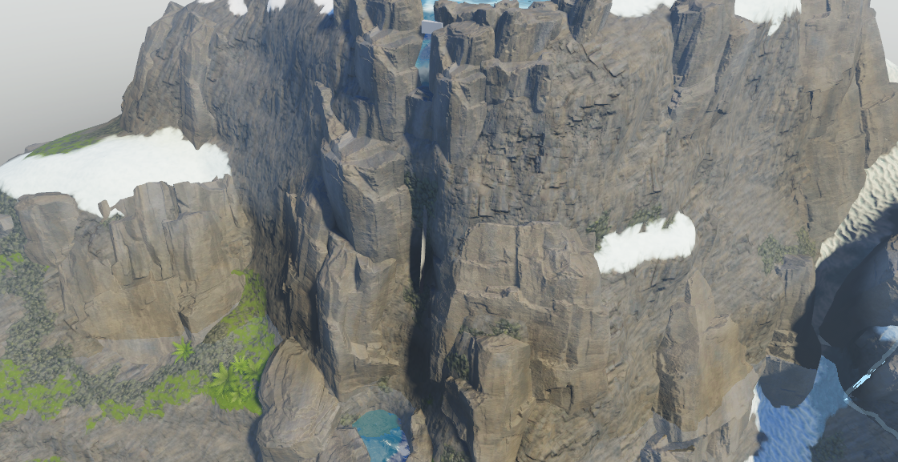

   1. 빔의 시각적 외관을 커스터마이징하여 주요 낙하의 빠르게 흐르는 폭포처럼 보이게 합니다.
      1. **탐색기** 창에서 **FastDrop**이 여전히 선택된 상태인지 확인합니다.
      1. **속성** 창에서,
         1. **Texture**를 `rbxassetid://16808804567`로 설정하여 흐르는 물처럼 보이는 새로운 텍스처를 렌더링합니다.
         1. **Width0**를 `5`로 설정하여 텍스처가 렌더링을 시작하는 축에서 넓게 만듭니다.
         1. **Width1**을 `10`으로 설정하여 텍스처가 낙하 수영장에 도달할 때 넓게 만듭니다.
         1. **CurveSize0**을 `10`으로 설정하여 텍스처를 절벽에서 멀어지게 합니다.
         1. **CurveSize1**을 `20`으로 설정하여 텍스처를 낙하 수영장으로 곡선으로 만들도록 설정합니다.
         1. **TextureSpeed**를 `1.3`으로 설정하여 텍스처를 빠르게 흐르게

 합니다.
         1. **TextureLength**를 `2`로 설정하여 텍스처의 길이를 약간 늘립니다.
         1. **Color**를 어두운 파랑과 밝은 파랑, 흰색으로 번갈아가며 설정하는 색상 시퀀스로 설정합니다.
            - **Time** = `0`, **RGB 값** = `208, 247, 255`
            - **Time** = `0.135`, **RGB 값** = `210, 246, 255`
            - **Time** = `0.25`, **RGB 값** = `255, 255, 255`
            - **Time** = `0.384`, **RGB 값** = `163, 187, 202`
            - **Time** = `0.757`, **RGB 값** = `214, 229, 248`
            - **Time** = `1`, **RGB 값** = `255, 255, 255`
            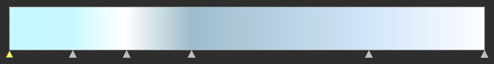
         2. **Transparency**를 부착물 사이에서 물이 더 생동감 있게 보이도록 하는 숫자 시퀀스로 설정합니다.
            - **Time** = `0`, **Value** = `1`
            - **Time** = `0.115`, **Value** = `0`
            - **Time** = `0.835`, **Value** = `0`
            - **Time** = `0.881`, **Value** = `.994`
            - **Time** = `1`, **Value** = `1`
            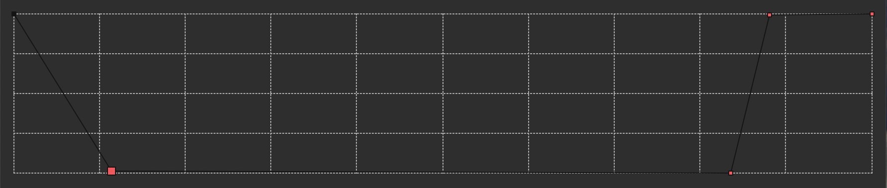
         3. **ZOffset**를 `2`로 설정하여 텍스처를 절벽에서 약간 떨어지도록 합니다.
         4. **FaceCamera**를 활성화하여 플레이어가 물에서 멀리 떨어져도 폭포가 보이도록 합니다.
      <!-- <video controls src="../img/03_02_Creating_Waterfalls/Cascades-2G11.mp4" width="90%"></video> -->
      [](https://prod.docsiteassets.roblox.com/assets/tutorials/creating-waterfalls/Cascades-2G11.mp4)

1. 주요 낙하의 느리게 흐르는 폭포를 생성합니다.
   1. **FastDrop**을 복제한 후, 복제된 빔의 이름을 **SlowDrop**으로 변경합니다.
   2. 빔의 시각적 외관을 커스터마이징하여 주요 낙하의 느리게 흐르는 폭포처럼 보이게 합니다.
      1. **탐색기** 창에서 **SlowDrop**을 선택합니다.
      2. **속성** 창에서,
         1. **Width1**을 `20`으로 설정하여 텍스처가 낙하 수영장에 도달할 때 더 넓게 만듭니다.
         2. **TextureLength**를 `1.5`로 설정하여 텍스처의 길이를 약간 줄입니다.
         3. **TextureSpeed**를 `1`로 설정하여 텍스처가 덜 빠르게 흐르도록 합니다.
         4. **ZOffset**를 `0`로 설정하여 텍스처가 절벽 가장자리에서 직접 흐르도록 합니다.

      <!-- <video controls src="../img/03_02_Creating_Waterfalls/Cascades-3.mp4" width="90%"></video> -->
      [](https://prod.docsiteassets.roblox.com/assets/tutorials/creating-waterfalls/Cascades-3.mp4)

2. **탐색기** 창에서 **Outflow** 폴더의 모든 블록 파트를 선택한 다음, **속성** 창에서 **Transparency**를 `1`로 설정하여 블록을 보이지 않게 만듭니다.

      <!-- <video controls src="../img/03_02_Creating_Waterfalls/Cascades-Final.mp4" width="90%"></video> -->
      [](https://prod.docsiteassets.roblox.com/assets/tutorials/creating-waterfalls/Cascades-Final.mp4)

## 물보라 설정

폭포가 하강하여 낙하 수영장의 밀도에 충돌하면 물이 충돌 지점에서 위로 치솟아 **물보라**를 만듭니다. 이 기화된 물이 위로 치솟으면서 분산되어 다양한 방향으로 물방울을 형성합니다.

이 과정을 시연하기 위해 샘플은 주요 낙하의 바닥에 두 개의 `ParticleEmitter` 객체를 사용합니다. 첫 번째 입자 방출기는 폭포가 낙하 수영장에 충돌할 때 치솟기 시작하는 물의 무게를 나타내는 밀도 있는 물보라 같은 입자를 방출합니다. 두 번째 입자 방출기는 물이 기화되는 물방울 같은 입자를 방출합니다.

이 두 개의 입자 방출기를 동시에 방출하지만 다른 속도로 구성하면 결과적으로 물보라의 실제 물리적 행동을 모방하는 시각적 효과를 나타냅니다. 이러한 세부 사항은 VFX의 현실감을 높이고 플레이어를 3D 공간에 몰입시키는 데 기여합니다.

<GridContainer numColumns="2">
  <figure>
    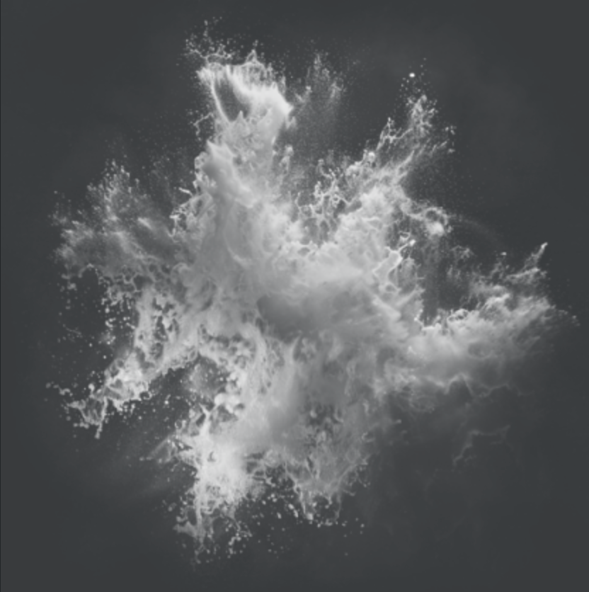
    <figcaption>밀도가 높은 텍스처 = rbxassetid://16829556885</figcaption>
  </figure>
  <figure>
    
    <figcaption>물방울 텍스처 = rbxassetid://17082061238</figcaption>
  </figure>
</GridContainer>

|||
|---|---|
|밀도가 높은 텍스처 = rbxassetid://16829556885|물방울 텍스처 = rbxassetid://17082061238|

샘플 [Waterfall Island](https://www.roblox.com/games/16454663889/Use-Case-Tutorials-Volcano-Island) 장소 파일에서 주요 낙하의 바닥에 물보라를 재현하려면:

1. **탐색기** 창에서 **작업공간**에 **폴더**를 생성하여 모든 물보라 객체를 포함시키고, 폴더 이름을 **Splashes**로 변경합니다.
1. **Splashes**에 **블록** 파트를 삽입한 후, 이름을 **MainDropSplashes**로 변경합니다.
1. **MainDropSplashes**를 위치시키고 스케일하여 폭포가 낙하 수영장에 충돌하는 전체 표면 영역으로 만듭니다.

      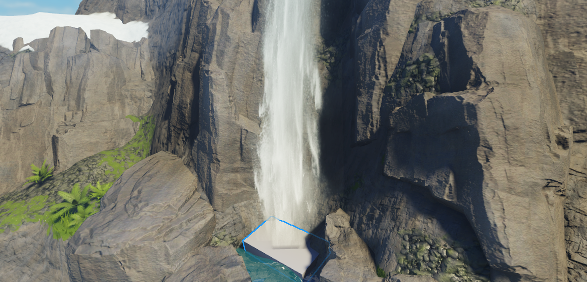

1. 주요 낙하의 폭포가 낙하 수영장에 충돌하는 지점에 밀도가 높은 물보라를 생성합니다.
   1. **MainDropSplashes**에 **ParticleEmitter**를 삽입한 후, 이름을 **SplashDense**로 변경합니다.
   1. **SplashDense**를 선택한 후, **속성** 창에서,
      1. **Texture**를 `rbxassetid://16829556885`로 설정하여 밀도가 높은 물보라처럼 보이는 입자를 렌더링합니다.
      1. **Color**를 파란색에서 흰색으로 변하는 색상 시퀀스로 설정합니다.
         - **Time** = `0`, **RGB 값** = `189, 246, 255`
         - **Time** = `1`, **RGB 값** = `255, 255, 255`

      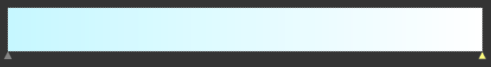

      2. **Size**를 크기가 일정하게 증가하는 숫자 시퀀스로 설정합니다.
         - **Time** = `0`, **Value** = `1.81`, **Envelope** = `0.562`
         - **Time** = `1`, **Value** = `5.75`, **Envelope** = `1.31`

      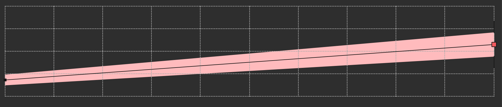

      3. **Transparency**를 입자의 수명 동안 입자가 투명하게 시작하고 불투명해지며 다시 투명해지는 숫자 시퀀스로 설정합니다.
         - **Time** = `0`, **Value** = `1`, **Envelope** = `0`
         - **Time** = `0.5`, **Value** = `0.181`, **Envelope** = `0.181`
         - **Time** = `1`, **Value** = `1`, **Envelope** = `0`

      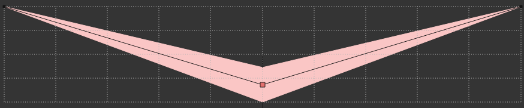

      4. **Lifetime**을 `0.25, 0.35`로 설정하여 각 입자의 수명을 250~350 밀리초 사이로 무작위로 설정합니다.
      5. **Rate**를 `30`으로 설정하여 초당 30개의 입자를 방출합니다.
      6. **Rotation**을 `-45, 45`로 설정하여 각 입자를 초당 -45도에서 45도 사이로 무작위로 방출합니다.
      1. **RotSpeed**를 `-40, 40`으로 설정하여 각 입자를 초당 -45도에서 40도 사이로 무작위로 방출합니다.
      1. **Speed**를 `20, 35`로 설정하여 각 입자를 초당 20~35 스터드 사이로 무작위로 방출합니다.
      1. **SpreadAngle**을 `50, 50`으로 설정하여 입자를 X 및 Z 축을 따라 작은 각도로 방출합니다.
      1. **Acceleration**을 `0, -40, 0`으로 설정하여 중력을 시뮬레이션하고 입자를 아래로 당깁니다.
      1. **LightEmission**을 `0.5`로 설정하여 입자를 밝게 만듭니다.
      1. **LightInfluence**를 `0.1`으로 설정하여 환경 조명이 입자 색상에 미치는 영향을 크게 줄입니다.

      <!-- <video controls src="../img/03_02_Creating_Waterfalls/Splashes-4.mp4" width="90%"></video> -->
      [](https://prod.docsiteassets.roblox.com/assets/tutorials/creating-waterfalls/Splashes-4.mp4)

1. 주요 낙하의 폭포가 낙하 수영장에 충돌하는 지점에 물방울을 생성합니다.
   1. **SplashDense**를 복제한 후, 이름을 **SplashDroplets**로 변경합니다.
   1. **SplashDroplets**를 선택한 후, **속성** 창에서,
      1. **Texture**를 `rbxassetid://17082061238`로 설정하여 물방울처럼 보이는 입자를 렌더링합니다.
      1. **Size**를 크기가 빠르게 증가하는 숫자 시퀀스로 설정합니다.
         - **Time** = `0`, **Value** = `1.81`, **Envelope** = `0.562`
         - **Time** = `1`, **Value** = `8.69`, **Envelope** = `1.31`

      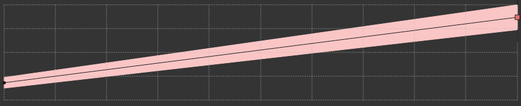

      2. **Transparency**를 입자의 수명 동안 입자가 투명하게 시작하고 불투명해지며 다시 투명해지는 숫자 시퀀스로 설정합니다.
         - **Time** = `0`, **Value** = `1`, **Envelope** = `0`
         - **Time** = `0.104`, **Value** = `0.0625`, **Envelope** = `0.0625`
         - **Time** = `0.429`, **Value** = `0.0562`, **Envelope** = `0.0562`
         - **Time** = `1`, **Value** = `1`, **Envelope** = `0`

      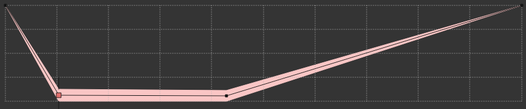

      3. **Lifetime**을 `0.15, 0.6`으로 설정하여 각 입자의 수명을 150~600 밀리초 사이로 무작위로 설정합니다.
      4. **Rate**를 `20`으로 설정하여 초당 20개의 입자를 방출합니다.

      <!-- <video controls src="../img/03_02_Creating_Waterfalls/Splashes-5.mp4" width="90%"></video> -->
      [](https://prod.docsiteassets.roblox.com/assets/tutorials/creating-waterfalls/Splashes-5.mp4)

2. **탐색기** 창에서 **Splashes** 폴더의 모든 블록 파트를 선택한 다음, **속성** 창에서 **Transparency**를 `1`로 설정하여 블록을 보이지 않게 만듭니다.

      <!-- <video controls src="../img/03_02_Creating_Waterfalls/Splashes-Final.mp4" width="90%"></video> -->
      [](https://prod.docsiteassets.roblox.com/assets/tutorials/creating-waterfalls/Splashes-Final.mp4)

## 백수 설정

**백수**는 물이 낙하하여 절벽 가장자리에 접근할 때 물이 더 소용돌이치는 상태에서 발생합니다. 이로 인해 기포가 많은 물이 생성되며, 물속에 더 많은 공기 거품이 있어 물이 흰색으로 보입니다.

이 과정을 모방하기 위해 샘플은 절벽 가장자리에서 유출이 바위에 충돌하는 지점에서 기포가 많은 물보라 같은 입자를 방출하는 두 개의 `ParticleEmitter` 객체를 사용합니다. 방출기는 내장 조명을 사용하지 않으며, 대신 흰색과 회색 색조를 우선시하며 다양한 속도로 떨어지면서 물속의 공기량을 보여줍니다.

<GridContainer numColumns="2">
  <figure>
    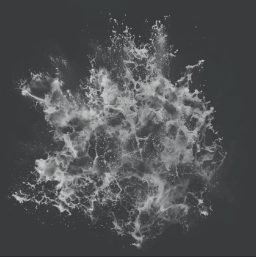
    <figcaption>백수 텍스처 = rbxassetid://16808075391</figcaption>
  </figure>
  <figure>
  </figure>
</GridContainer>

샘플 [Waterfall Island](https://www.roblox.com/games/16454663889/Use-Case-Tutorials-Volcano-Island) 장소 파일에서 유출이 절벽의 바위에 충돌하는 지점의 백수를 재현하려면:

1. **탐색기** 창에서 **작업공간**에 **폴더**를 생성하여 모든 백수 객체를 포함시키고, 폴더 이름을 **WhiteWater**로 변경합니다.
1. **WhiteWater**에 **블록** 파트를 삽입한 후, 이름을 **MainDropWW**로 변경합니다.
1. **MainDropWW**를 위치시키고 스케일하여 유출이 절벽 가장자리에 충돌하는 전체 표면 영역으로 만듭니다.

      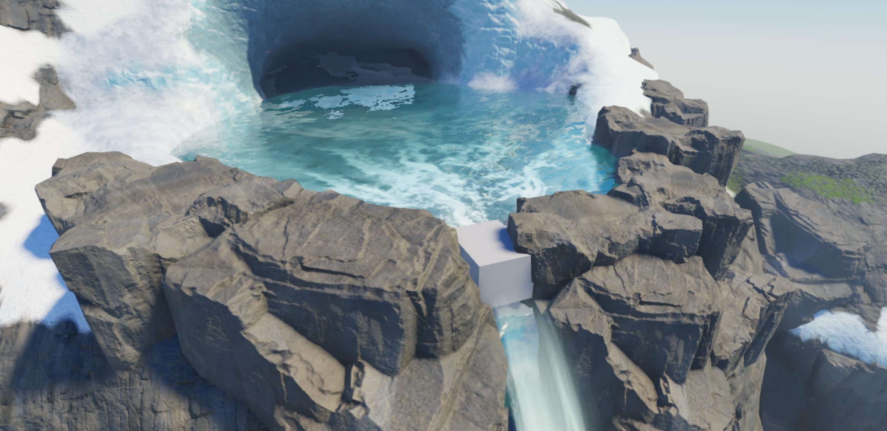

1. 주요 유출이 주변 바위에 충돌하는 지점의 덜 소용돌이치는 백수를 생성합니다.

   1. **MainDropWW**에 **ParticleEmitter**를 삽입한 후, 이름을 **GentleWW**로 변경합니다.
   1. **GentleWW**를 선택한 후, **속성** 창에서,
      1. **Texture**를 `rbxassetid://16808075391`로 설정하여 기포가 많은 물보라처럼 보이는 입자를 렌더링합니다.
      1. **Color**를 파란색에서 흰색으로 변하는 색상 시퀀스로 설정합니다.
         - **Time** = `0`, **RGB 값** = `189, 246, 255`
         - **Time** = `1`, **RGB 값** = `255, 255, 255`

      

      2. **Size**를 크기가 일정하게 증가하는 숫자 시퀀스로 설정합니다.
         - **Time** = `0`, **Value** = `1.13`, **Envelope** = `0.562`
         - **Time** = `1`, **Value** = `5.56`, **Envelope** = `0.563`

      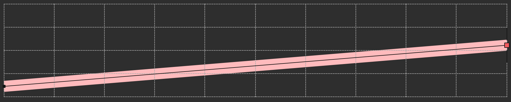

      3. **Transparency**를 입자의 수명 동안 입자가 투명하게 시작하고 불투명해지며 다시 투명해지는 숫자 시퀀스로 설정합니다.
         - **Time** = `0`, **Value** = `1`, **Envelope** = `0`
         - **Time** = `0.143`, **Value** = `0.462`, **Envelope** = `0.0625`
         - **Time** = `0.336`, **Value** = `0.462`, **Envelope** = `0.0562`
         - **Time** = `0.622`, **Value** = `0.788`, **Envelope** = `0.0538`
         - **Time** = `1`, **Value** = `1`, **Envelope** = `0`

      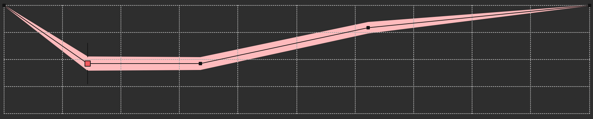

      4. **ZOffset**를 `2`로 설정하여 텍스처를 낙하 수영장에서 약간 떨어지도록 합니다.
      5. **Lifetime**을 `1.25, 1.5`로 설정하여 각 입자의 수명을 1250~1500 밀리초 사이로 무작위로 설정합니다.
      6. **Rate**를 `12`로 설정하여 초당 12개의 입자를 방출합니다.
      7. **Rotation**을 `-45, 45`로 설정하여 각 입자를 초당 -45도에서 45도 사이로 무작위로 방출합니다.
      8. **RotSpeed**를 `-40, 40`으로 설정하여 각 입자를 초당 -45도에서 40도 사이로 무작위로 방출합니다.
      1. **Speed**를 `15, 18`로 설정하여 각 입자를 초당 20~35 스터드 사이로 무작위로 방출합니다.
      1. **SpreadAngle**을 `5, 5`로 설정하여 입자를 X 및 Z 축을 따라 작은 각도로 방출합니다.
      1. **Acceleration**을 `0, -35, 0`으로 설정하여 중력을 시뮬레이션하고 입자를 아래로 당깁니다.
      1. **Drag**를 `0.25`로 설정하여 입자의 속도가 지수적으로 감소하도록 합니다.
      1. **LightEmission**을 `0.6`로 설정하여 입자를 밝게 만듭니다.
      1. **LightInfluence**를 `0.1`으로 설정하여 환경 조명이 입자 색상에 미치는 영향을 크게 줄입니다.

      <!-- <video controls src="../img/03_02_Creating_Waterfalls/WW-4.mp4" width="90%"></video> -->
      [](https://prod.docsiteassets.roblox.com/assets/tutorials/creating-waterfalls/WW-4.mp4)

1. 주요 유출이 주변 바위에 충돌하는 지점의 더 소용돌이치는 백수를 생성합니다.
   1. **GentleWW**를 복제한 후, 이름을 **TurbulentWW**로 변경합니다.
   1. **TurbulentWW**를 선택한 후, **속성** 창에서,
      1. **Size**를 크기가 약간 증가하는 숫자 시퀀스로 설정합니다.
         - **Time** = `0`, **Value** = `1.6`, **Envelope** = `0.562`
         - **Time** = `1`, **Value** = `2.63`, **Envelope** = `0.563`

      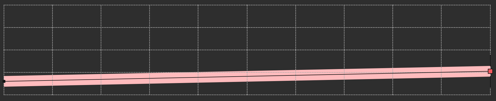

      2. **Transparency**를 입자의 수명 동안 입자가 투명하게 시작하고 불투명해지며 다시 투명해지는 숫자 시퀀스로 설정합니다.
         - **Time** = `0`, **Value** = `1`, **Envelope** = `0`
         - **Time** = `0.156`, **Value** = `0.0437`, **Envelope** = `0.0437`
         - **Time** = `0.55`, **Value** = `0.075`, **Envelope** = `0.0252`
         - **Time** = `1`, **Value** = `1`, **Envelope** = `0`

      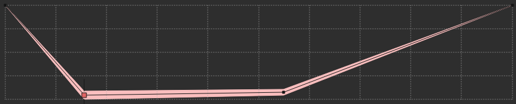

      3. **Lifetime**을 `0.25, 0.5`로 설정하여 각 입자의 수명을 250~500 밀리초 사이로 무작위로 설정합니다.
      4. **Rate**를 `20`으로 설정하여 초당 20개의 입자를 방출합니다.
      5. **Speed**를 `5, 6`로 설정하여 각 입자를 초당 5~6 스터드 사이로 무작위로 방출합니다.
      6. **Acceleration**을 `0, -15, 0`으로 설정하여 중력을 시뮬레이션하고 입자를 아래로 당깁니다.

      <!-- <video controls src="../img/03_02_Creating_Waterfalls/WW-5.mp4" width="90%"></video> -->
      [](https://prod.docsiteassets.roblox.com/assets/tutorials/creating-waterfalls/WW-5.mp4)

2. **탐색기** 창에서 **WhiteWater** 폴더의 모든 블록 파트를 선택한 다음, **속성** 창에서 **Transparency**를 `1`로 설정하여 블록을 보이지 않게 만듭니다.

      <!-- <video controls src="../img/03_02_Creating_Waterfalls/WW-5.mp4" width="90%"></video> -->
      [](https://prod.docsiteassets.roblox.com/assets/tutorials/creating-waterfalls/WW-5.mp4)

## 거품 설정

폭포가 낙하 수영장에 충돌할 때 위로 치솟는 물보라와 달리, **거품**은 충돌 지점의 바닥에서 외부로 퍼지는 기포가 많은 물입니다. 물보라와 마찬가지로, 거품도 분산되어 기화된 물방울처럼 보이는 거미줄 같은 물방울로 나뉩니다.

이 효과를 모방하기 위해, 샘플에서는 `ParticleEmitter` 객체를 사용하여 거품 물결처럼 보이는 입자를 방출합니다. 이 입자는 낙하 수영장과 평행하게 천천히 방출되어, 입자가 수면 장력을 깨는 모세관 파동의 시각적 및 행동적 효과를 모방할 수 있게 합니다.

<GridContainer numColumns="2">
  <figure>
    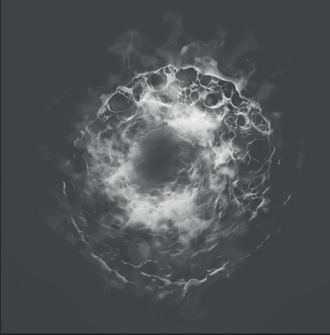
    <figcaption>거품 물결 텍스처 = rbxassetid://16811365086</figcaption>
  </figure>
  <figure>
  </figure>
</GridContainer>

샘플 [Waterfall Island](https://www.roblox.com/games/16454663889/Use-Case-Tutorials-Volcano-Island) 장소 파일에서 주요 낙하의 바닥에 거품을 재현하려면:

1. **탐색기** 창에서 **작업공간**에 **폴더**를 생성하여 모든 거품 객체를 포함시키고, 폴더 이름을 **Foam**으로 변경합니다.
1. **Foam**에 **블록** 파트를 삽입한 후, 이름을 **MainDropFoam**으로 변경합니다.
1. **MainDropFoam**을 위치시키고 스케일하여 주요 폭포가 낙하 수영장에 충돌하는 가장 밀도가 높은 지점으로 만듭니다.

      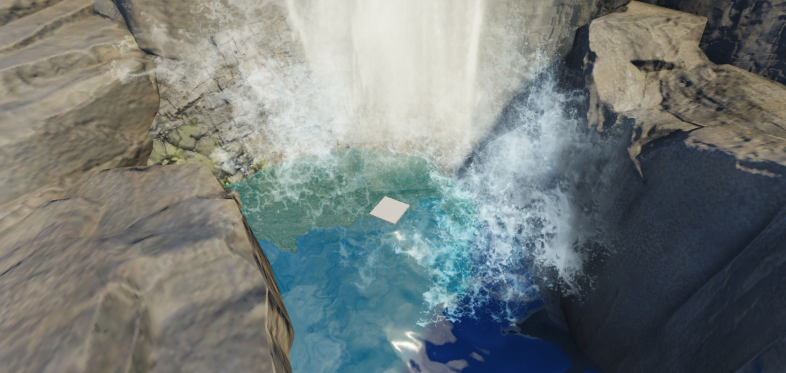

1. **MainDropFoam**에 **ParticleEmitter**를 삽입한 후, 이름을 **FoamRipples**로 변경합니다.
1. **탐색기** 창에서 **FoamRipples**를 선택한 후, **속성** 창에서,
   1. **Texture**를 `rbxassetid://16811365086`로 설정하여 거품 물결처럼 보이는 입자를 렌더링합니다.
   1. **Orientation**을 **VelocityPerpendicular**로 설정하여 입자가 움직이는 방향과 직각으로 방출되도록 합니다.
   1. **Transparency**를 입자의 수명 동안 입자가 투명하게 시작하고 빠르게 불투명해지며 다시 투명해지는 숫자 시퀀스로 설정합니다.
      - **Time** = `0`, **Value** = `1`, **Envelope** = `0`
      - **Time** = `0.143`, **Value** = `0.119`, **Envelope** = `0.1`
      - **Time** = `0.664`, **Value** = `0.125`, **Envelope** = `0.112`
      - **Time** = `1`, **Value** = `1`, **Envelope** = `0`

      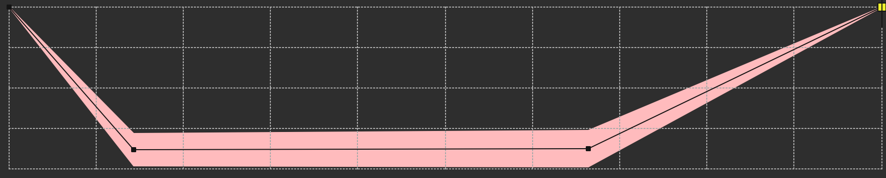

   1. **Lifetime**을 `0.5, 0.7`로 설정하여 각 입자의 수명을 500~700 밀리초 사이로 무작위로 설정합니다.
   1. **Rate**를 `5`로 설정하여 초당 5개의 입자를 방출합니다.
   1. **Rotation**을 `0, 360`으로 설정하여 입자가 방출 지점에서 원형으로 무작위로 배치되도록 합니다.
   1. **RotSpeed**를 `-15, 15`로 설정하여 각 입자를 초당 -15도에서 15도 사이로 무작위로 방출합니다.
   1. **Speed**를 `0, .01`로 설정하여 각 입자를 초당 0~0.01 스터드 사이로 무작위로 방출합니다.
   1. **LightEmission**을 `0.25`로 설정하여 입자를 약간 밝게 만듭니다.
   1. **LightInfluence**를 `0`으로 설정하여 환경 조명이 입자 색상에 미치는 영향을 방지합니다.

1. **명령줄**에 다음 문자열을 입력하여 각 입자의 크기를 수명 동안 5에서 20 스터드로 증가시키고 작은 변동을 추가합니다:

   ``` lua
   workspace.Foam.MainDropFoam.FoamRipples.Size = NumberSequence.new{NumberSequenceKeypoint.new(0,5,0), NumberSequenceKeypoint.new(1,20,5)}
   ```

      <!-- <video controls src="../img/03_02_Creating_Waterfalls/Foam-2.mp4" width="90%"></video> -->
      [](https://prod.docsiteassets.roblox.com/assets/tutorials/creating-waterfalls/Foam-2.mp4)

1. **탐색기** 창에서 **Foam** 폴더의 모든 블록 파트를 선택한 다음, **속성** 창에서 **Transparency**를 `1`로 설정하여 블록을 보이지 않게 만듭니다.

      <!-- <video controls src="../img/03_02_Creating_Waterfalls/Foam-Final.mp4" width="90%"></video> -->
      [](https://prod.docsiteassets.roblox.com/assets/tutorials/creating-waterfalls/Foam-Final.mp4)

## 안개 설정

폭포가 낙하 수영장에 충돌할 때, 일부 물이 증발하고 차갑고 습한 공기에서 응축되어 **안개**를 만듭니다. 안개 증기는 단단한 표면처럼 조명을 잡지 않으며, 대신 예상치 못한 방식으로 빛을 반사하여 전체 환경 내에서 밝게 보이다가 완전히 증발합니다.

샘플은 낙하의 바닥에 두 개의 `ParticleEmitter` 객체를 사용하여 이 과정을 모방합니다. 첫 번째 입자 방출기는 충돌 지점과 절벽에서 멀리 입자를 에너지 있게 방출하며, 두 번째 입자 방출기는 입자를 천천히 하늘로 방출합니다. 두 입자 방출기의 입자는 수명의 시작 부분에서 밝으며, 증발하면서 점차 투명해집니다.

현실 세계와 유사하게, 안개 증발 과정은 작은 물방울에 빛이 반사되면서 무지개가 형성되도록 하며, 샘플은 짧은 수명의 무지개 입자를 방출하는 `ParticleEmitter` 객체로 이를 모방합니다. 이러한 입자는 플레이어가 폭포에서 어느 각도에서 보든지 카메라를 향하여 빛이 기화된 물방울에 반사되는 착시 효과를 만듭니다.

<!-- <GridContainer numColumns="2">
  <figure>
    
    <figcaption>안개 텍스처 = rbxassetid://16830667309</figcaption>
  </figure>
  <figure>
    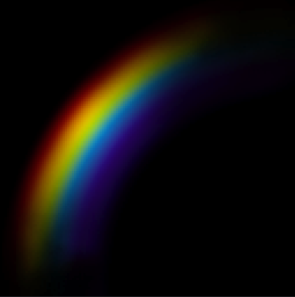
    <figcaption>무지개 텍스처 = rbxassetid://16828911033</figcaption>
  </figure>
</GridContainer> -->

|||
|---|---|
|안개 텍스처 = rbxassetid://16830667309|무지개 텍스처 = rbxassetid://16828911033|

샘플 [Waterfall Island](https://www.roblox.com/games/16454663889/Use-Case-Tutorials-Volcano-Island) 장소 파일에서 주요 낙하의 바닥에서 바깥쪽과 위쪽으로 이동하는 안개를 재현하려면:

1. **탐색기** 창에서 **작업공간**에 **폴더**를 생성하여 모든 안개 관련 객체를 포함시키고, 폴더 이름을 **Mist**로 변경합니다.
1. 폭포가 낙하 수영장에 충돌하는 지점에서 바깥쪽으로 퍼지는 안개를 생성합니다.
   1. **Mist**에 **블록** 파트를 삽입한 후, 이름을 **BaseMist**로 변경합니다.
   1. **BaseMist**를 위치시키고 방향을 조정하여 주요 폭포가 낙하 수영장에 충돌하는 지점에서 가장 밀도가 높은 위치로 하여 상단 면이 절벽에서 떨어지도록 합니다.

      

   1. **BaseMist**에 **ParticleEmitter**를 삽입한 후, 이름을 **Mist**로 변경합니다.
   1. **Mist**를 선택한 후, **속성** 창에서,
      1. **Texture**를 `rbxassetid://16830667309`로 설정하여 두꺼운 안개처럼 보이는 입자를 렌더링합니다.
      1. **Color**를 파란색에서 흰색으로 변하는 색상 시퀀스로 설정합니다.
         - **Time** = `0`, **RGB 값** = `171, 244, 255`
         - **Time** = `0.339`, **RGB 값** = `251, 254, 255`
         - **Time** = `1`, **RGB 값** = `255, 255, 255`

      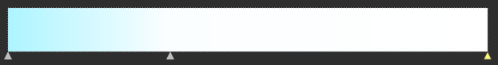

      2. **Size**를 크기가 일정하게 증가하는 숫자 시퀀스로 설정합니다.
         - **Time** = `0`, **Value** = `8`, **Envelope** = `0`
         - **Time** = `1`, **Value** = `10`, **Envelope** = `0`

      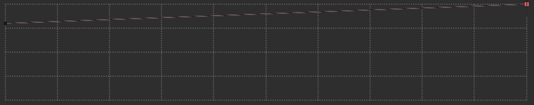

      3. **Transparency**를 입자의 수명 동안 입자가 투명하게 시작하고 불투명해지며 다시 투명해지는 숫자 시퀀스로 설정합니다.
         - **Time** = `0`, **Value** = `1`, **Envelope** = `0`
         - **Time** = `0.0971`, **Value** = `0.8`, **Envelope** = `0.0625`
         - **Time** = `1`, **Value** = `1`, **Envelope** = `0`

      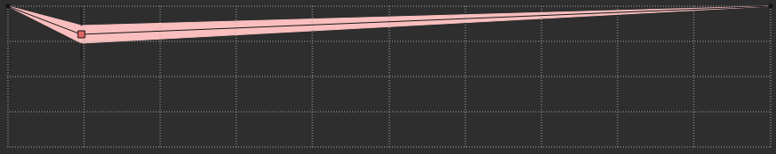

      4. **ZOffset**을 `2`로 설정하여 텍스처가 낙하 수영장에서 약간 떨어지도록 합니다.
      5. **Lifetime**을 `0.5, 1`로 설정하여 각 입자의 수명을 500~1000 밀리초 사이로 무작위로 설정합니다.
      6. **Rate**를 `20`으로 설정하여 초당 20개의 입자를 방출합니다.
      7. **Rotation**을 `-360, 360`으로 설정하여 입자가 원형으로 무작위로 배치되도록 합니다.
      8. **RotSpeed**를 `-50, 50`으로 설정하여 각 입자를 초당 -50도에서 50도 사이로 무작위로 방출합니다.
      9. **Speed**를 `35, 50`으로 설정하여 각 입자를 초당 35~50 스터드 사이로 무작위로 방출합니다.
      10. **SpreadAngle**을 `25, 25`로 설정하여 입자를 X 및 Z 축을 따라 작은 각도로 방출합니다.
      11. **Acceleration**을 `-10, -25, -10`으로 설정하여 낙하 수영장에서 퍼지는 물보라의 영향을 시뮬레이션합니다.
      12. **Drag**를 `1.5`로 설정하여 입자의 속도가 지수적으로 감소하도록 합니다.

      <!-- <video controls src="../img/03_02_Creating_Waterfalls/Mist-2.mp4" width="90%"></video> -->
      [](https://prod.docsiteassets.roblox.com/assets/tutorials/creating-waterfalls/Mist-2.mp4)

2. 낙하 수영장에서 위쪽으로 퍼지는 안개를 생성합니다.
   1. **BaseMist**를 복제한 후, 이름을 **RiseMist**로 변경합니다.
   2. **RiseMist**를 회전시켜 입자를 방출하는 파트의 상단 면이 하늘을 향하도록 합니다.
   3. 자식 입자 방출기를 선택한 후, **속성** 창에서,
      1. **Lifetime**을 `4`로 설정하여 각 입자의 수명을 4초로 설정합니다.
      2. **Rate**를 `3`으로 설정하여 초당 3개의 입자를 방출합니다.
      3. **RotSpeed**를 `-10, 10`으로 설정하여 각 입자를 초당 -10도에서 10도 사이로 무작위로 방출합니다.
      4. **Speed**를 `25`로 설정하여 각 입자를 초당 25 스터드로 방출합니다.
      5. **Acceleration**을 `0, 0, 0`으로 설정하여 이전 시뮬레이션을 제거합니다.
      6. **Drag**를 `1`로 설정하여 입자의 속도가 지수적으로 감소하도록 합니다.
   4. **명령줄**에 다음 문자열을 입력하여 각 입자의 크기를 수명 동안 20에서 20 스터드로 증가시키고 작은 변동을 추가합니다:

   ``` lua
   workspace.Mist.RiseMist.Mist.Size = NumberSequence.new{NumberSequenceKeypoint.new(0,20,1), NumberSequenceKeypoint.new(1,25,5)}
   ```

      <!-- <video controls src="../img/03_02_Creating_Waterfalls/Mist-3.mp4" width="90%"></video> -->
      [](https://prod.docsiteassets.roblox.com/assets/tutorials/creating-waterfalls/Mist-3.mp4)

3. 무지개를 생성합니다.
   1. **Mist**에 **블록** 파트를 삽입한 후, 이름을 **RainbowPart**로 변경합니다.
   2. **RainbowPart**를 다른 블록 파트보다 약간 위에 위치시킵니다.

      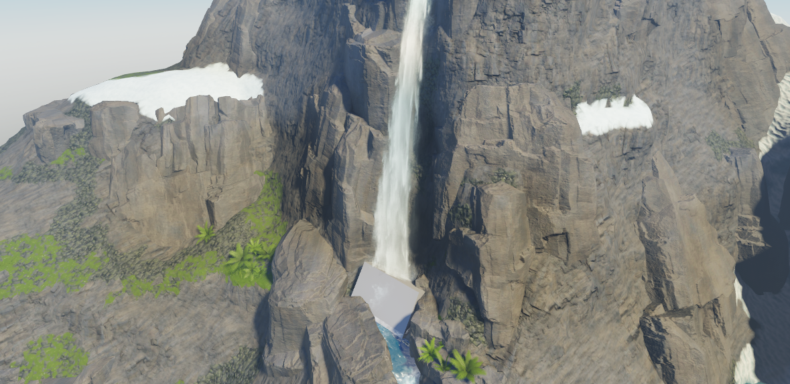

   3. **Rainbow**에 **ParticleEmitter**를 삽입한 후, 이름을 **Rainbow**로 변경합니다.
   4. **Rainbow**를 선택한 후, **속성** 창에서,
      1. **Texture**를 `rbxassetid://16828911033`로 설정하여 희미한 무지개처럼 보이는 입자를 렌더링합니다.
      2. **Size**를 `25`로 설정하여 큰 입자를 렌더링합니다.
      3. **Transparency**를 입자의 수명 동안 입자가 투명하게 시작하고 불투명해지며 다시 투명해지는 숫자 시퀀스로 설정합니다.
         - Time = `0`, Value = `1`, Envelope = `0`
         - Time = `0.497`, Value = `0.363`, Envelope = `0.05`
         - Time = `1`, Value = `1`, Envelope = `0`

      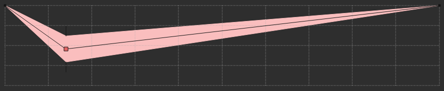

      4. **Lifetime**을 `2, 4`로 설정하여 각 입자의 수명을 2~4초 사이로 무작위로 설정합니다.
      5. **Rate**를 `0.25`로 설정하여 4초마다 하나의 입자를 방출합니다.
      6. **Rotation**을 `-20`으로 설정하여 각 입자를 약간 기울이도록 설정합니다.
      7. **Speed**를 `0`으로 설정하여 각 입자를 초당 0 스터드로 방출합니다.
      8. **Drag**를 `1`로 설정하여 입자의 속도가 지수적으로 감소하도록 합니다.
      9. **LightEmission**을 `1`로 설정하여 입자를 배경 색상과 함께 렌더링합니다. 이 단계는 텍스처 자체의 검은 배경도 제거합니다.
      10. **LightInfluence**를 `0`으로 설정하여 환경 조명이 입자 색상에 미치는 영향을 방지합니다.

      <!-- <video controls src="../img/03_02_Creating_Waterfalls/Mist-4.mp4" width="90%"></video> -->
      [](https://prod.docsiteassets.roblox.com/assets/tutorials/creating-waterfalls/Mist-4.mp4)

4. **탐색기** 창에서 **Mist** 폴더의 모든 블록 파트를 선택한 다음, **속성** 창에서 **Transparency**를 `1`로 설정하여 블록을 보이지 않게 만듭니다.

      <!-- <video controls src="../img/03_02_Creating_Waterfalls/Mist-Final.mp4" width="90%"></video> -->
      [](https://prod.docsiteassets.roblox.com/assets/tutorials/creating-waterfalls/Mist-Final.mp4)

---
## 출처
 - [Creating Waterfalls with VFX](https://create.roblox.com/docs/tutorials/building/effects/creating-waterfalls)

---
## [다음](./03_03_Creating_Volcanic.md)