# Creating Volcanic Eruptions with VFX

## 목차
- [Creating Volcanic Eruptions with VFX](#creating-volcanic-eruptions-with-vfx)
  - [목차](#목차)
  - [참조 분해](#참조-분해)
  - [조명 구성](#조명-구성)
    - [국부 조명](#국부-조명)
    - [전역 조명](#전역-조명)
  - [화산 구성](#화산-구성)
    - [표면 물결](#표면-물결)
    - [불꽃](#불꽃)
    - [용암 분출](#용암-분출)
    - [용암 흐름](#용암-흐름)
    - [연기 기둥](#연기-기둥)
  - [출처](#출처)
  - [다음](#다음)

---

**화산**은 용암과 연기가 내부 압력으로 인해 뿜어져 나오는 지각 내의 분화구입니다. 체험은 종종 플레이어가 귀중한 자원, 보스 전투 아레나, 또는 화산이 주기적으로 분출할 때마다 역동적으로 변하는 환경에서 용암과 용융암석 위험의 균형을 잡아야 하는 도전적인 게임 플레이 영역 내에 화산을 포함합니다.

이 튜토리얼은 시작 지점으로 [Volcano Island - Start](https://create.roblox.com/dashboard/creations/experiences/5825677169/overview) `.rbxl` 파일과 참고 자료로 [Volcano Island - Complete](https://www.roblox.com/games/17374256579/Volcano-Island-Complete)를 사용하여, 환경을 실제 물리적 행동을 나타내는 맞춤 조명 및 VFX 객체로 변형하는 방법을 보여줍니다. 여기에는 다음에 대한 지침이 포함됩니다:

- 참조 자료를 개별 구성 요소로 분해하여 고유한 시각적 및 행동 특성을 가지도록 구성합니다.
- 뜨거운 액체가 표면으로 올라오고 칼데라 표면을 교란시키는 것을 모방하기 위해 표면 물결을 설정합니다.
- 용암 조각이 대기 중으로 상승하면서 빠르게 냉각되는 것을 모방하기 위해 불꽃을 설정합니다.
- 다양한 유형의 용암 점성을 모방하기 위해 칼데라에서 튀고 흐르는 용암을 설정합니다.
- 플레이어의 주의를 끄는 불순물이 하늘로 상승하는 것을 모방하기 위해 연기 기둥을 설정합니다.

<Alert severity='info'>
서드파티 텍스처 생성 도구에서 자신의 텍스처를 생성하고 자신의 디자인과 함께 따라할 수 있습니다. Studio에서 사용하기 위한 텍스처를 가져오는 방법에 대한 자세한 내용은 [Asset Manager](https://create.roblox.com/docs/projects/assets/manager)를 참조하세요.
</Alert>

<!-- <GridContainer numColumns="2">
  <figure>
    
    <figcaption>Volcano Island - Start</figcaption>
  </figure>
  <figure>
    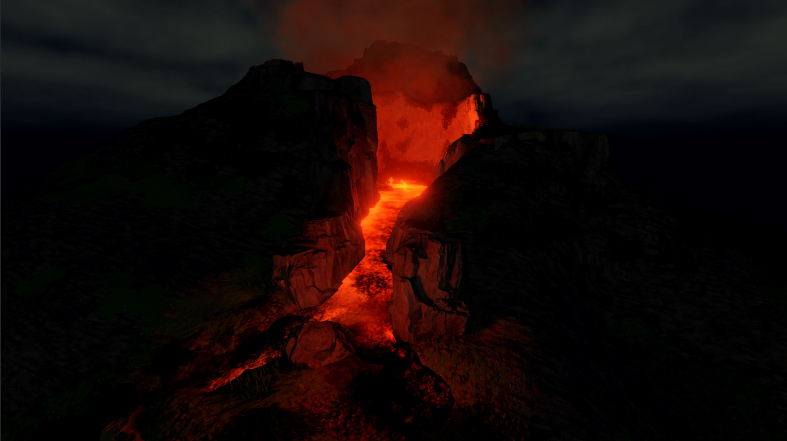
    <figcaption>Volcano Island - Complete</figcaption>
  </figure>
</GridContainer> -->

|||
|---|---|
|Volcano Island - Start|Volcano Island - Complete|

## 참조 분해

신뢰할 수 있는 화산을 만들려면 설계 과정에서 실제 화산 분출을 참조하는 것이 중요합니다. 이는 주제를 고유한 시각적 및 행동 특성을 가진 개별 구성 요소로 분해할 수 있게 해주기 때문입니다. 예를 들어, 샘플 [Volcano Island - Complete](https://www.roblox.com/games/17374256579/Volcano-Island-Complete) 체험은 아이슬란드 화산 분출을 참조하여 칼데라와 주변 지형과 관련된 모든 텍스처 및 VFX 디자인 결정을 안내합니다.

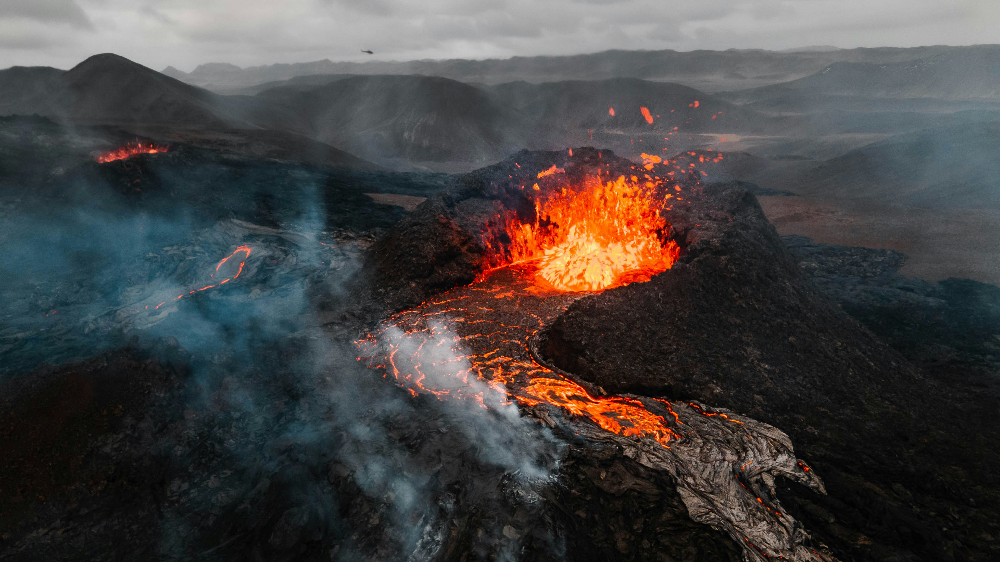

분출 중인 화산을 개별 구성 요소로 분해하여 다양한 VFX 객체를 사용하여 실제와 유사하게 모방하는 방법을 계획하는 것이 유용합니다. 이를 시연하기 위해 이 튜토리얼은 샘플 화산을 여섯 가지 고유한 구성 요소로 분해합니다:

- **표면 물결** – 칼데라 표면에서 흐르는 작은 용암 물결입니다.
- **불꽃** – 칼데라에서 하늘로 상승하는 작고 가벼운 용암 조각입니다.
- **용암 분출** – 화산 내부 압력으로 인해 칼데라에서 튀어 나오는 얇은 용암입니다.
- **용암 흐름** – 칼데라에서 흘러나오는 점성 용암입니다.
- **연기 기둥** – 칼데라에서 하늘로 상승하는 따뜻한 가스입니다.

<!-- <GridContainer numColumns="2">
  <figure>
    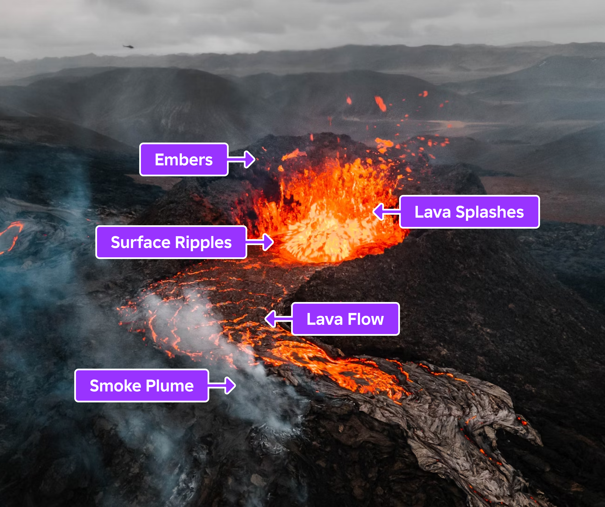
  </figure>
  <figure>
    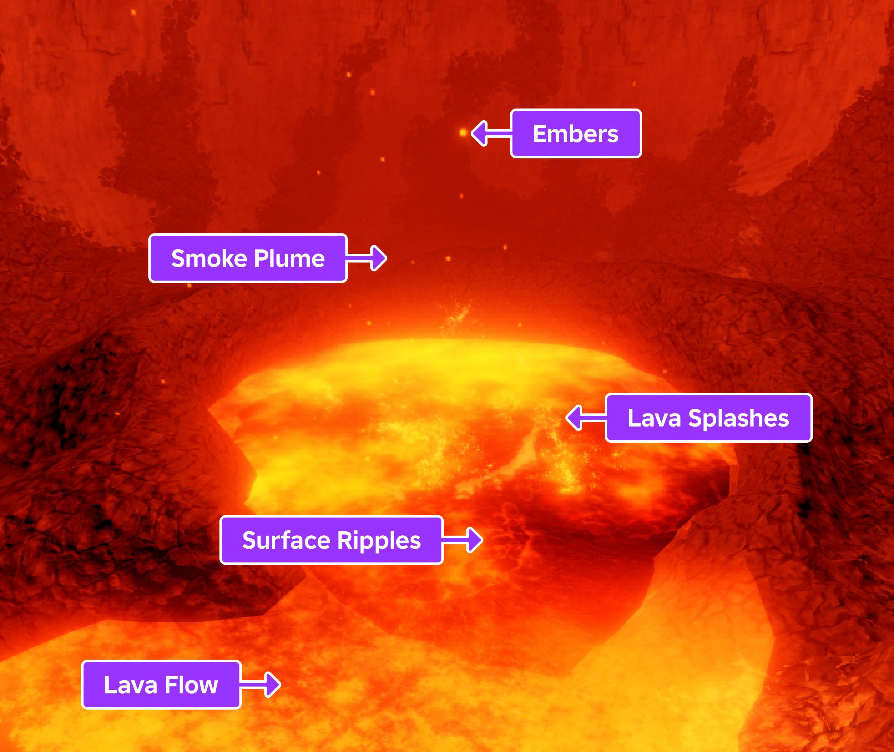
  </figure>
</GridContainer> -->

|||
|---|---|

다음 섹션에서는 이러한 구성 요소 각각을 재현하기 위해 사용할 수 있는 다양한 설계 결정 및 기법에 대한 심층 분석을 제공합니다. 이러한 결정을 검토하고 다양한 조명, `ParticleEmitter`, 및 `Beam` 속성을 실험하면서 자신의 체험에 고유한 환경 요구를 해결하기 위해 조명과 VFX를 사용하는 방법을 배울 수 있습니다.

## 조명 구성

경험 내에서 환경 요소를 관심 포인트로 만들려면, 환경 전체와 대비를 높여 플레이어가 탐험해야 할 대상으로 두드러지게 만드는 것이 중요합니다. 예를 들어, 플레이어를 칼데라로 유도하려면 화산의 용암이 어두운 환경 속에서 유일한 빛의 원천으로 보이도록 조명 소스를 구성할 수 있습니다.

Studio는 이 기술에 사용할 수 있는 두 가지 고급 조명 소스를 제공합니다:

- **전역 조명** - 전체 실외 환경에 조명을 제공합니다.
- **국부 조명** - 체험 내에서 배치된 위치 주변에 조명을 제공합니다.

이 튜토리얼 섹션에서는 이 두 가지 유형의 조명 소스를 사용하여 장면 내에서 화산 분출을 가장 중요한 관심 포인트로 만들고, 환경 스토리텔링에 극적인 효과를 주는 방법을 가르칩니다. 예를 들어, 맞춤형 조명이 없는 최종 화산은 다른 즐거운 환경 속에서 눈에 띄지 않는 위험 요소처럼 느껴지지만, 맞춤형 조명이 있는 화산은 어두운 우울한 환경에서 위험한 존재처럼 느껴집니다.

<!-- <GridContainer numColumns="2">
  <figure>
    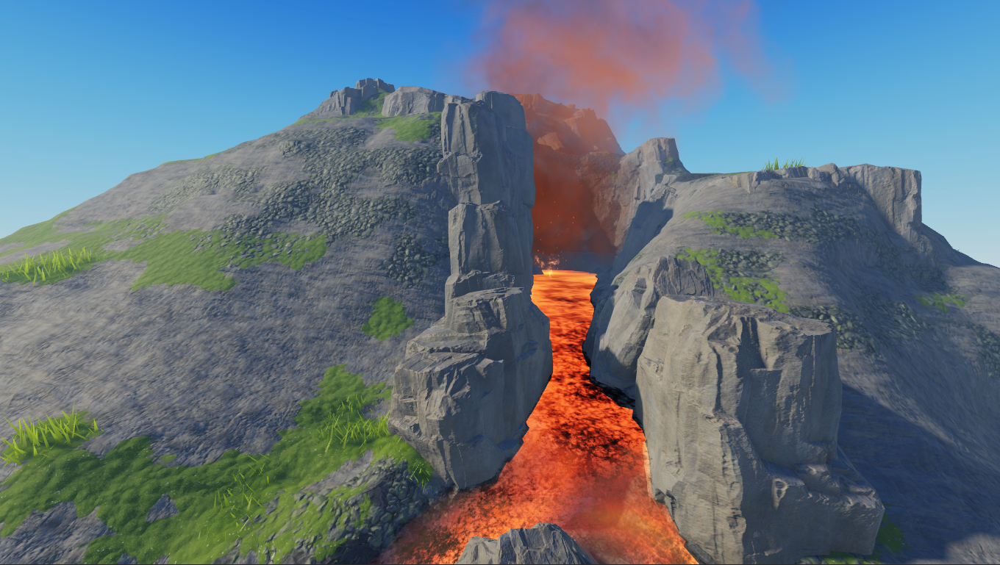
    <figcaption>기본 광원 사용</figcaption>
  </figure>
  <figure>
    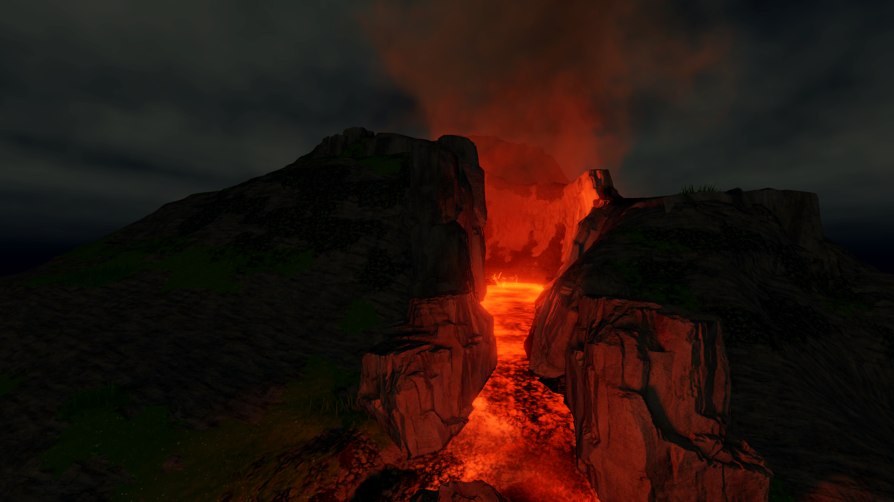
    <figcaption>맞춤형 광원 사용</figcaption>
  </figure>
</GridContainer> -->

|||
|---|---|
|기본 광원 사용|맞춤형 광원 사용|

### 국부 조명

국부 조명은 `SpotLight`, `SurfaceLight`, 및 `PointLight` 객체와 같은 체험 내의 로컬 [광원](https://create.roblox.com/docs/effects/light-sources)에서 나오는 빛입니다. 국부 조명은 화산에 추가하는 것이 중요한데, 이는 `ParticleEmitter` 및 `Beam` 텍스처에 밝기를 적용할 수 있지만, 혼자서는 칼데라와 흐르는 용암이 실제 세계에서 환경을 비추는 방식을 사실적으로 시뮬레이션할 수 있을 만큼 충분한 빛을 채울 수 없기 때문입니다.

<!-- <GridContainer numColumns="2">
  <figure>
    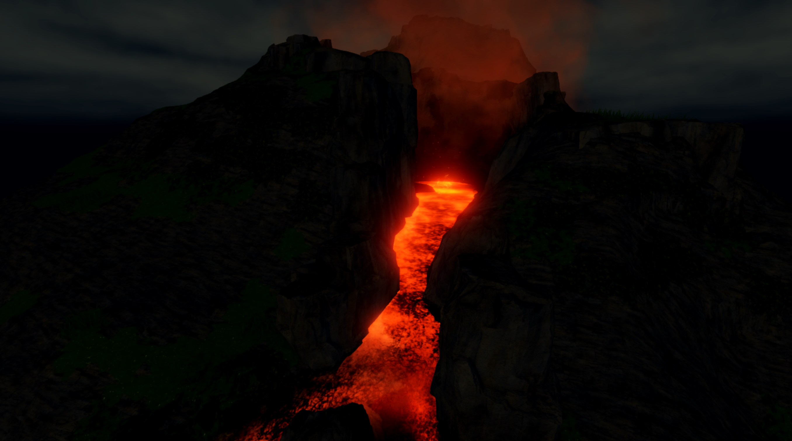
    <figcaption>국부 조명 없음</figcaption>
  </figure>
  <figure>
    
    <figcaption>국부 조명 있음</figcaption>
  </figure>
</GridContainer> -->

|||
|---|---|
|국부 조명 없음|국부 조명 있음|

이 튜토리얼에서는 국부 광원을 구성하지 않고는 VFX 객체를 구성할 3D 공간을 볼 수 없기 때문에 전역 조명보다 국부 광원을 먼저 구성하는 것이 좋습니다. 그러나 일반적인 워크플로우에서는 VFX 객체에 대한 변경 사항의 영향을 보기 위해 국부 및 전역 조명을 동시에 반복적으로 조정해야 하므로, 자신의 체험의 설계 요구에 유연하게 대응하는 것이 중요합니다.

샘플 [Volcano Island - Complete](https://www.roblox.com/games/17374256579/Volcano-Island-Complete) 장소 파일에서 화산의 국부 조명을 재현하려면:

1. **탐색기** 창에서 **작업 공간**에 모든 로컬 광원 객체를 포함할 **폴더**를 만든 다음, 폴더 이름을 **LocalLighting**으로 변경합니다.
2. **LocalLighting** 폴더에 세 개의 **블록** 부품을 삽입한 다음, 각각의 이름을 **LightCaldera**, **LightMagma**, 및 **LightOutflow**로 변경합니다.
3. 부품을 이동하여 화산 전체를 비출 수 있는 위치로 이동합니다.
   1. **LightCaldera**를 칼데라와 절벽 사이의 공간 중앙으로 이동합니다.
   2. **LightMagma**를 칼데라와 용암 흐름 사이의 틈 중앙으로 이동합니다.
   3. **LightOutflow**를 용암 흐름이 두 갈래로 나뉘는 부분 바로 위로 이동합니다.

   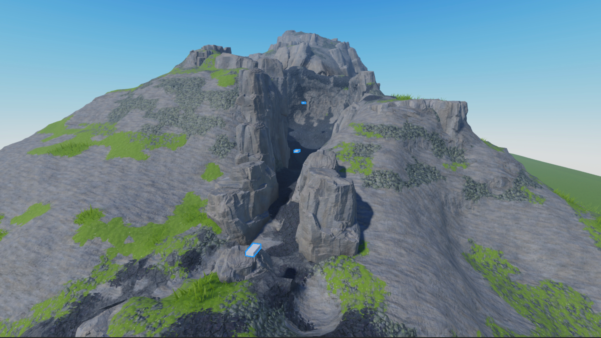

4. 각 부품에 **포인트 라이트**를 삽입합니다.

   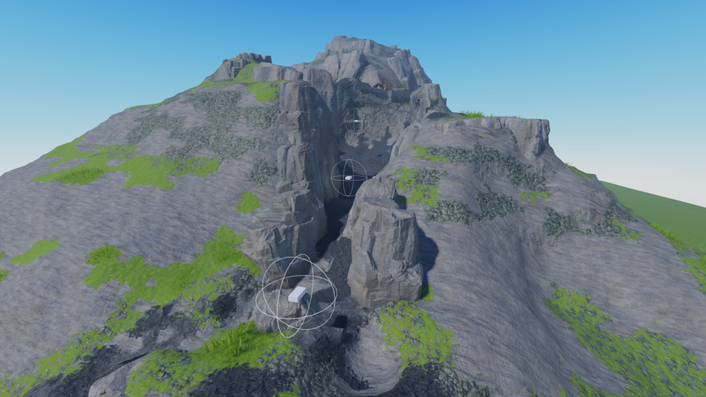

5. **LightCaldera**의 **PointLight** 자식을 선택한 다음, **속성** 창에서,
   1. **밝기**를 `15`로 설정하여 광원을 훨씬 더 밝게 만듭니다.
   2. **색상**을 `255, 85, 0`로 설정하여 빛을 어두운 주황색으로 변경합니다.
   3. **범위**를 `60`으로 설정하여 칼데라 전체 영역을 비춥니다.

   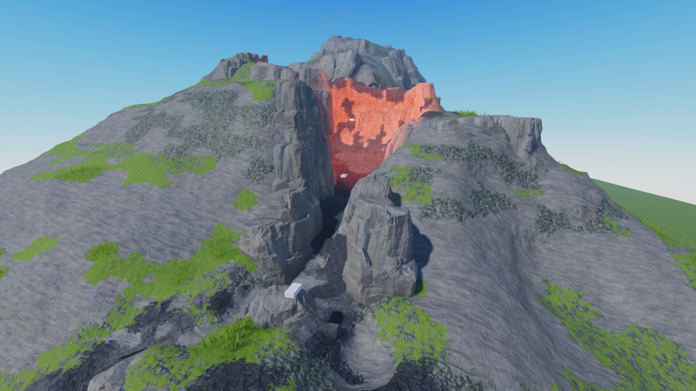

6. **LightMagma** 및 **LightOutflow**의 **PointLight** 자식을 선택한 다음, **속성** 창에서,
   1. **밝기**를 `2`로 설정하여 광원을 약간 더 밝게 만듭니다.
   2. **색상**을 `255, 81, 0`로 설정하여 빛을 주황색으로 변경합니다.
   3. **범위**를 `50`으로 설정하여 틈과 용암 흐름 영역을 비춥니다.

   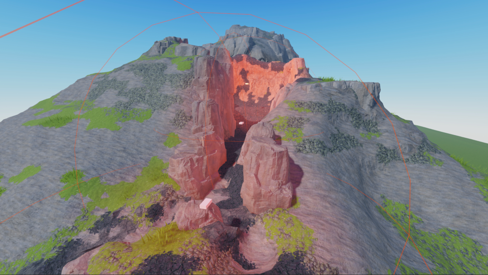

7. **탐색기** 창에서 **LocalLighting** 폴더의 모든 블록 부품을 선택한 다음, **속성** 창에서 **투명도**를 `1`로 설정하여 블록을 보이지 않게 만듭니다.

   

### 전역 조명

전역 조명은 체험에서 태양 또는 달로부터 나오는 빛입니다. `Lighting` 서비스 및 그 자식 후처리 효과 객체의 몇 가지 기본 속성을 조정하여, 플레이어에게 전역 빛이 나타나는 방식을 극적으로 변경할 수 있으며, `ParticleEmitter` 및 `Beam` 텍스처를 포함하여 체험 내에 배치한 다른 모든 객체와 상호 작용하는 방식을 변경할 수 있습니다.

예를 들어, 튜토리얼 후반에 흐르는 용암 효과를 생성하는 `Beam` 텍스처가 빛날 수 있도록 하려면 `BloomEffect` 속성을 구성하여 카메라가 밝은 빛을 보는 것처럼 조명을 과장해야 합니다. 유사하게, 밤에 더 현실적인 색상을 시뮬레이션하기 위해 효과의 속성을 조정하여 전체 환경의 채도를 낮춰야 합니다.

<!-- <GridContainer numColumns="2">
  <figure>
    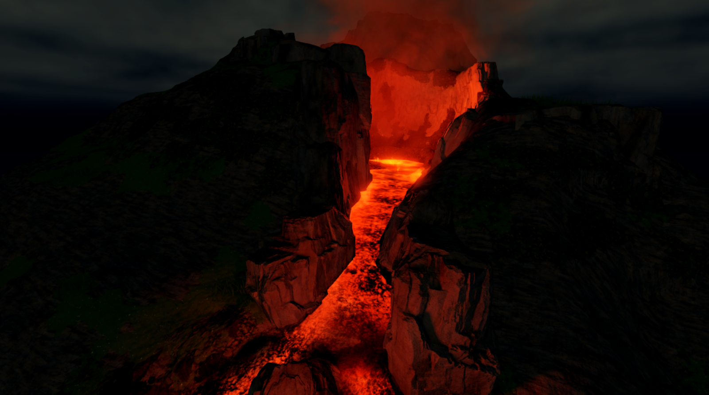
    <figcaption>블룸 없음</figcaption>
  </figure>
  <figure>
    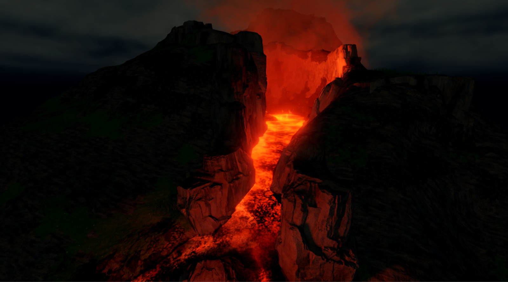
    <figcaption>블룸 있음</figcaption>
  </figure>
</GridContainer> -->

|||
|---|---|
|블룸 없음|블룸 있음|


샘플 [Volcano Island - Complete](https://www.roblox.com/games/17374256579/Volcano-Island-Complete) 장소 파일에서 전역 조명을 재현하려면:

1. **탐색기** 창에서 **조명** 서비스를 선택한 다음, **속성** 창에서,
   1. **주변광**을 `133, 152, 176`으로 설정하여 전체 실외 환경에 연한 회색 색조를 설정합니다.
   1. **밝기**를 `2`로 설정하여 전역 광원을 약간 어둡게 만듭니다.
   1. **ColorShift_Top**을 `207, 178, 72`로 설정하여 전역 광원에서 반사되는 표면에 노란색 색조를 설정합니다.
   1. **기술**을 **미래**로 설정하여 조명 기술 시스템을 업데이트합니다.
   1. **시계 시간**을 `4.3`으로 설정하여 오전 4시 15분쯤으로 시간을 설정합니다.
   1. **지리적 위도**를 `199`로 설정하여 달의 위치를 수정합니다.
   1. **노출 보정**을 `-1`로 설정하여 달의 노출을 반으로 노출합니다.

   

1. **탐색기** 창에서 **조명** 서비스의 **블룸** 자식을 선택한 다음, **속성** 창에서,
   1. **강도**를 `0.75`로 설정하여 환경의 모든 색상을 약간 어둡게 만듭니다.
   1. **크기**를 `80`으로 설정하여 더 넓은 블룸 효과를 만듭니다.
   1. **임계값**을 `0.85`로 설정하여 환경의 더 많은 색상이 빛날 수 있도록 합니다.

   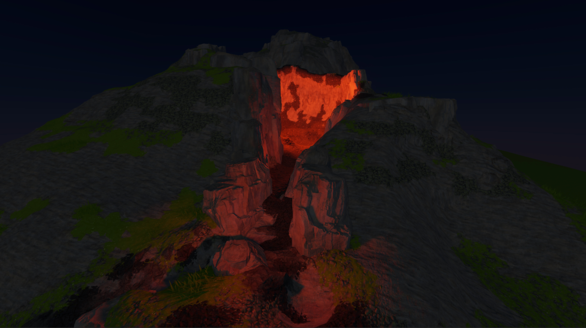

1. **탐색기** 창에서 **조명** 서비스에 **색 보정** 객체를 삽입한 다음, **속성** 창에서,
   1. **밝기**를 `0.017`로 설정하여 픽셀 색을 약간 변경합니다.
   1. **대비**를 `0.25`로 설정하여 환경의 밝고 어두운 색 사이의 대비를 더 날카롭게 만듭니다.
   1. **채도**를 `-0.15`로 설정하여 환경의 색상을 탈색합니다.
   1. **색조**를 `255, 214, 143`으로 설정하여 픽셀을 연한 노란색 색조로 변경합니다.

   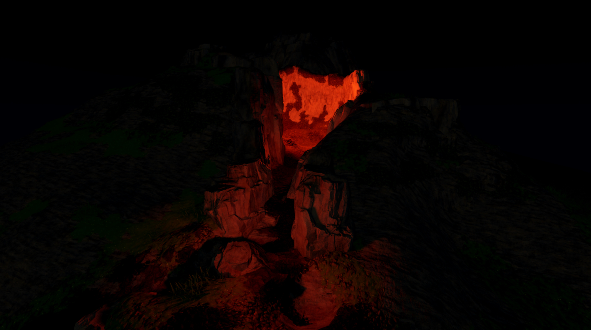

1. **(선택 사항)** 하늘에 구름을 추가하여 간접 조명을 제공합니다.
   1. **탐색기** 창에서 **지형** 서비스에 **구름** 객체를 삽입합니다.
   1. **구름** 객체를 선택한 다음, **속성** 창에서,
      1. **덮개**를 `1`로 설정하여 하늘에 완전한 구름 덮개를 제공합니다.
      1. **밀도**를 `0.08`로 설정하여 구름 덮개를 덜 밀집하게 만듭니다.
      1. **색상**을 `136, 143, 152`로 설정하여 구름 덮개에 연한 회색 색조를 설정합니다.

   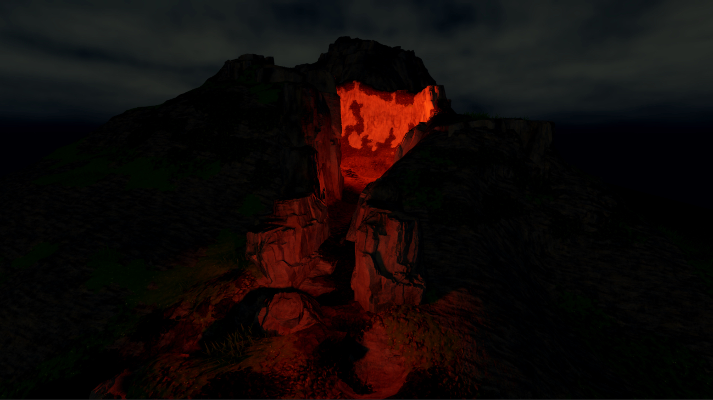

## 화산 구성

이제 국부 및 전역 조명 구성이 완료되었으므로, 실제 화산과 주변 지형과 관련된 모든 VFX 객체를 구성할 시간입니다. 이 튜토리얼의 지침을 따라 샘플 [Volcano Island](https://www.roblox.com/games/17374256579/Volcano-Island-Complete) `.rbxl` 파일 내 최종 환경을 정확히 재현하면서, 각 단계가 환경에 캐릭터, 움직임 및 밝기를 추가하는 방식을 관찰하세요.

### 표면 물결

**표면 물결**은 내부 용암과 압축 가스가 지각 아래에서 위로 이동하여 칼데라 표면에 흐르는 작은 용암 파도입니다. 이 시각적 현상은 대류 또는 유체 내에서 더 뜨거운 유체가 표면으로 상승하는 움직임의 실제 물리적 과정을 전달하며, 장면의 현실감을 더해줍니다.

표면 물결은 화산 분출의 상태에 대한 귀중한 통찰력을 플레이어에게 제공합니다. 예를 들어, 용암과 가스가 충분한 힘으로 위로 이동하여 칼데라 위의 용암 상태를 교란하고 끓게 만든다면, 플레이어는 화산이 뜨거운 용암과 함께 활발히 분출하고 있음을 추론할 수 있으며, 이 게임 플레이 영역 주변에서 주의해야 함을 알 수 있습니다.

<!-- <GridContainer numColumns="2">
  <figure>
    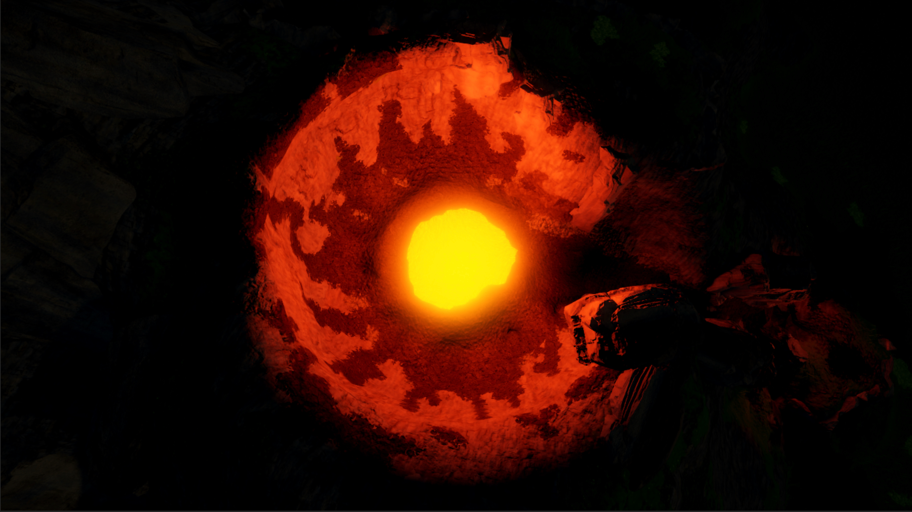
    <figcaption>표면 물결 없음</figcaption>
  </figure>
  <figure>
    <video controls src="../img/03_03_Creating_Volcanic/With-SurfaceRipples.mp4" alt="표면 물결이 있는 칼데라의 위에서 본 모습" width="100%"></video>
    <figcaption>표면 물결 있음</figcaption>
  </figure>
</GridContainer> -->

||<video controls src="../img/03_03_Creating_Volcanic/With-SurfaceRipples.mp4" alt="표면 물결이 있는 칼데라의 위에서 본 모습" width="100%"></video>|
|---|---|
|표면 물결 없음|표면 물결 있음|


이 과정을 시연하기 위해 샘플은 칼데라의 기저 아래 약간에 위치한 `ParticleEmitter` 객체를 사용하여 평평하고 밝은 입자를 어두운 배경 위에 천천히 확장하고 수축시킵니다. 이를 통해 입자가 매끄럽고 연속적으로 끓는 용암의 행동을 모방할 수 있게 합니다.

<GridContainer numColumns="2">
  <figure>
    
    <figcaption>Foam Ripples Texture = rbxassetid://16811365086</figcaption>
  </figure>
  <figure>
  </figure>
</GridContainer>

샘플 [Volcano Island - Complete](https://www.roblox.com/games/17374256579/Volcano-Island-Complete) 장소 파일에서 칼데라 위의 표면 물결을 재현하려면:

1. **탐색기** 창에서 **작업 공간**에 모든 칼데라 객체를 포함할 **폴더**를 만든 다음, 폴더 이름을 **Caldera**로 변경합니다.
1. 표면 물결의 높은 대비 배경을 제공하기 위해 배경을 만듭니다.
   1. **Caldera** 폴더에 **블록** 부품을 삽입한 다음, 이름을 **Backdrop**으로 변경합니다.
   1. **Backdrop**의 위치와 크기를 조정하여 칼데라의 전체 표면 영역을 약간 넘도록 설정합니다. 부품은 칼데라의 국부 광원과의 근접성 때문에 빛나는 것처럼 보입니다.

      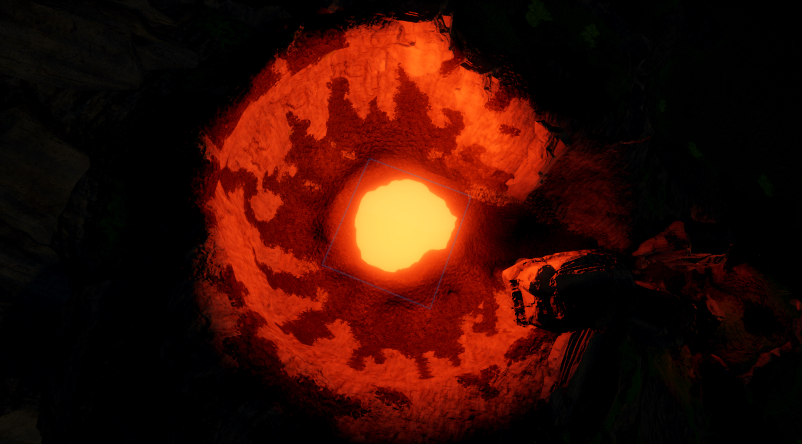

1. **Backdrop**을 선택한 다음, **속성** 창에서,
   1. **색상**을 `0, 0, 0`으로 설정하여 블록을 검은색으로 만듭니다.
   1. **재질**을 **호일**로 설정하여 배경에 텍스처를 제공합니다.

      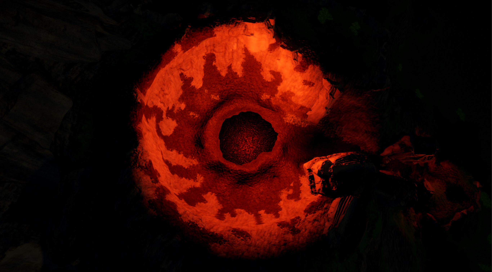

1. 물결 효과를 만듭니다.
   1. **Backdrop**을 복제하고 이름을 **MagmaRipples**로 변경한 다음, 칼데라 표면 영역에 맞게 크기를 약간 줄입니다.
   1. **MagmaRipples**를 선택한 다음, **속성** 창에서 **투명도**를 `1`로 설정하여 블록을 보이지 않게 만듭니다.
   1. **MagmaRipples**에 **ParticleEmitter**를 삽입한 다음, 이름을 **Ripples**로 변경합니다.
   1. **Ripples**를 선택한 다음, **속성** 창에서,
      1. **텍스처**를 `rbxassetid://16829556885`로 설정하여 거품 물결처럼 보이는 입자를 렌더링합니다.
      1. **방향**을 **속도 수직**으로 설정하여 입자가 이동 방향에 수직으로 방출되도록 합니다.
      1. **색상**을 입자가 갈색, 밝은 빨간색, 그런 다음 자주색으로 변하는 색상 시퀀스로 설정합니다.
         1. **색상** 속성을 클릭한 다음, ⋯ 버튼을 클릭합니다. 색상 시퀀스 팝업이 표시됩니다.

         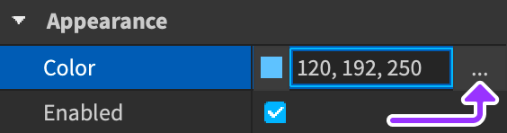

         색상 시퀀스의 아래쪽 축의 각 삼각형은 입자의 수명 동안 해당 속성의 색상 값을 결정하는 **키포인트**입니다.

         1. 색상 시퀀스의 각 지점에 다음 시간 및 값 속성을 설정합니다:
            - **시간** = `0`, **RGB 값** = `130, 53, 2`
            - **시간** = `0.5`, **RGB 값** = `224, 37, 0`
            - **시간** = `1`, **RGB 값** = `147, 5, 0`

         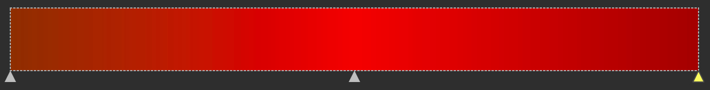

      2. **크기**를 입자가 수명 중간쯤에 크기가 증가했다가 원래 크기로 돌아가는 숫자 시퀀스로 설정합니다.
         1. **크기** 속성을 클릭한 다음, ⋯ 버튼을 클릭합니다. 숫자 시퀀스 팝업이 표시됩니다. 기본적으로 그래프는 직선이며 이미지가 왼쪽에서 오른쪽으로 동일한 크기를 유지합니다.

         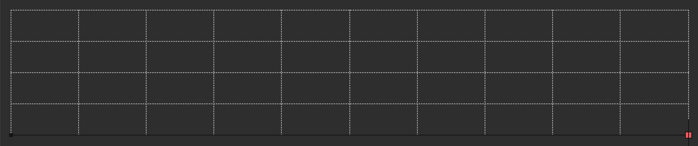

         숫자 시퀀스의 시작과 끝에 있는 각 사각형은 텍스처의 왼쪽에서 오른쪽으로 해당 속성의 크기 값을 결정하는 **키포인트**입니다.

         2. 숫자 시퀀스의 각 지점에 다음 시간 및 값 속성을 설정합니다:

            - **시간** = `0`, **값** = `4.81`, **엔벨로프** = `0.438`
            - **시간** = `0.341`, **값** = `8.75`, **엔벨로프** = `0.48`
            - **시간** = `0.497`, **값** = `9.38`, **엔벨로프** = `0.5`
            - **시간** = `0.644`, **값** = `8.75`, **엔벨로프** = `0.48`
            - **시간** = `1`, **값** = `4.81`, **엔벨로프** = `0.438`

         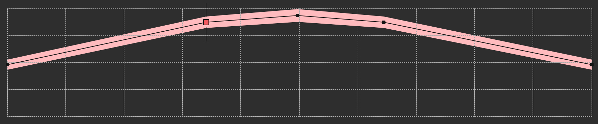

      3. **투명도**를 입자가 투명하게 시작하여 수명 중간쯤에 더 불투명해졌다가 수명 끝에 다시 투명해지는 숫자 시퀀스로 설정합니다.
         

      4. **투명도** 속성을 클릭한 다음, ⋯ 버튼을 클릭합니다.
   
      5. 숫자 시퀀스의 각 지점에 다음 시간 및 값 속성을 설정합니다:

         - **시간** = `0`, **값** = `1`, **엔벨로프** = `0`
         - **시간** = `0.3`, **값** = `0.387`, **엔벨로프** = `0.0375`
         - **시간** = `0.5`, **값** = `0.269`, **엔벨로프** = `0.0812`
         - **시간** = `0.7`, **값** = `0.381`, **엔벨로프** = `0.05`
         - **시간** = `0`, **값** = `1`, **엔벨로프** = `0`

         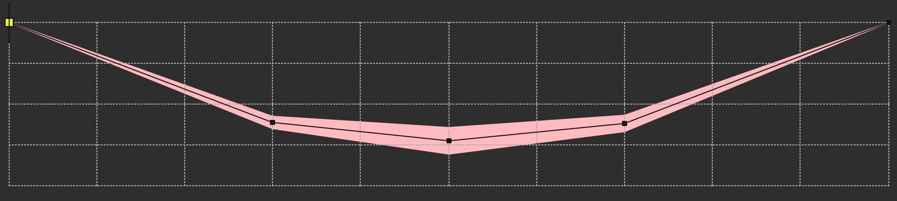

      6. **ZOffset**을 `-2`로 설정하여 텍스처가 칼데라에서 약간 떨어지도록 합니다.
      7. **수명**을 `5, 8`로 설정하여 각 입자의 수명을 무작위로 5초에서 8초 사이로 설정합니다.
      8. **비율**을 `12`로 설정하여 초당 12개의 입자를 방출합니다.
      9.  **회전**을 `-360, 360`으로 설정하여 각 입자를 원형으로 무작위로 정렬합니다.
      10. **속도**를 `0.01`로 설정하여 각 입자를 초당 0.01 스터드 속도로 방출합니다.
      11. **빛 방출**을 `1`로 설정하여 입자를 크게 밝힙니다.
      12. **빛 영향**을 `0`으로 설정하여 환경 조명이 입자 색상에 미치는 영향을 크게 줄입니다.
      13. **밝기**를 `15`로 설정하여 방출기에서 나오는 빛을 스케일합니다.

   <video controls src="../img/03_03_Creating_Volcanic/With-SurfaceRipples.mp4" alt="표면 물결이 있는 칼데라의 위에서 본 모습" width="90%"></video>

### 불꽃

**불꽃**은 칼데라에서 터져 나와 대기 중으로 상승하면서 열을 빠르게 방출하는 작고 가벼운 용암 조각입니다. 표면 물결과 유사하게 불꽃은 지각 아래의 내부 압력이 위로 밀어 올려 뜨거운 요소가 용암의 표면 장력을 깨뜨려 압력을 방출하는 것을 보여줍니다.

샘플은 `ParticleEmitter` 객체를 사용하여 질감에 모션 블러가 내장된 입자를 방출하여 이 과정을 모방합니다. 입자가 상승하고 수명이 끝날 때 방출기가 입자를 1:1 비율로 압축하여 입자가 원형으로 다시 형성됩니다. 이 기술을 사용하면 입자가 칼데라를 빠르게 빠져나가면서 상승하고, 하늘에서 사라지면서 느려지는 것처럼 보이게 합니다.

<GridContainer numColumns="2">
  <figure>
    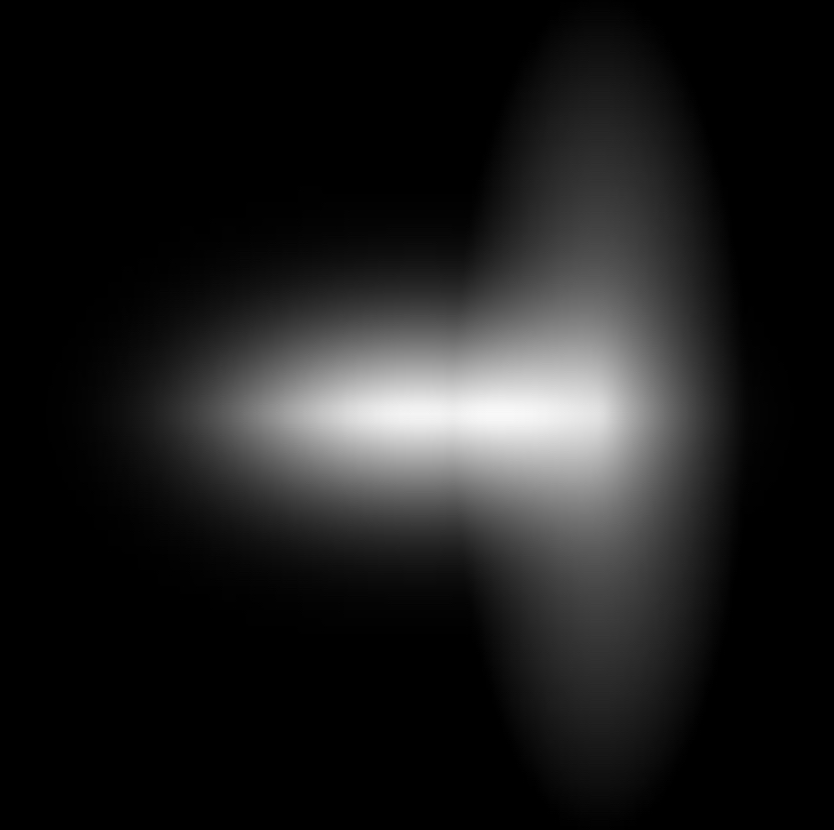
    <figcaption>Embers Texture = rbxassetid://17581858560</figcaption>
  </figure>
  <figure>
  </figure>
</GridContainer>

또한, 입자가 상승하면서 색상, 불투명도 및 크기를 변경하여 온도가 변하는 것을 반영합니다. 예를 들어, 수명 초반에는 큰 갈색 입자로 시작하지만, 빠르게 작은 주황색, 그런 다음 자주색 입자로 변합니다. 이 전략은 또한 계곡 전체에 은은하게 빛을 반사하여 플레이어의 몰입감을 높이는 이점이 있습니다.

샘플 [Volcano Island - Complete](https://www.roblox.com/games/17374256579/Volcano-Island-Complete) 장소 파일에서 칼데라 표면에서 올라오는 불꽃을 재현하려면:

1. **Caldera** 폴더에 **실린더** 부품을 삽입한 다음, 이름을 **GlowingEmbers**로 변경합니다.
1. **GlowingEmbers**를 표면 물결 위로 위치시키고, 칼데라 내부를 채울 수 있도록 크기를 조정합니다. 부품은 칼데라의 국부 광원과의 근접성 때문에 빛나는 것처럼 보입니다.

   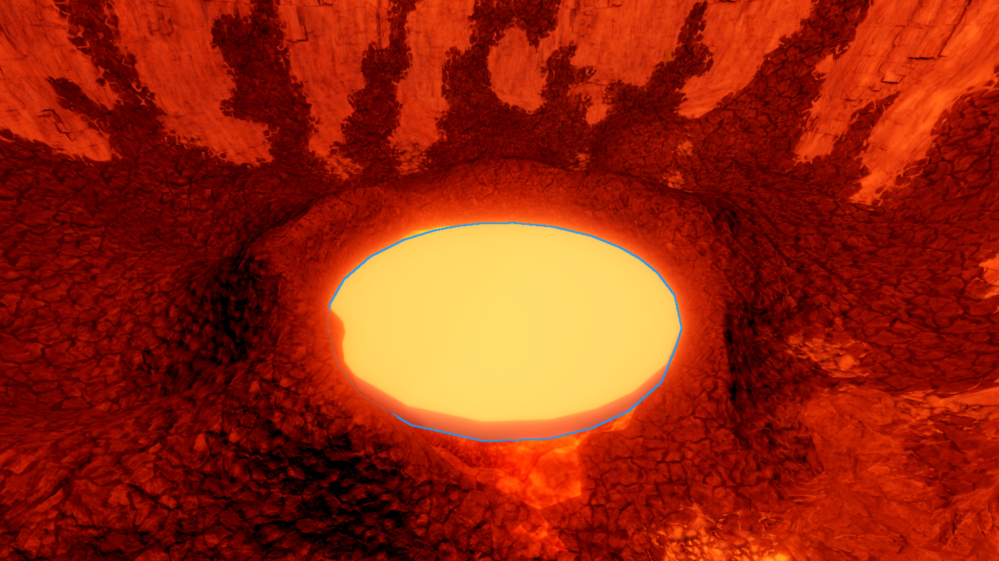

1. **GlowingEmbers**를 선택한 다음, **속성** 창에서 **투명도**를 `1`로 설정하여 실린더를 보이지 않게 만듭니다.
1. **GlowingEmbers**에 **ParticleEmitter**를 삽입한 다음, 이름을 **Embers**로 변경합니다.
1. **Embers**를 선택한 다음, **속성** 창에서,
   1. **텍스처**를 `rbxassetid://17581858560`으로 설정하여 가로 및 세로로 길쭉한 타원처럼 보이는 입자를 렌더링합니다.
   1. **방향**을 **속도 평행**으로 설정하여 입자가 이동 방향과 평행하게 방출되도록 합니다.
   1. **색상**을 갈색에서 주황색, 그런 다음 자주색으로 변하는 색상 시퀀스로 설정합니다.
      - **시간** = `0`, **RGB 값** = `130, 53, 2`
      - **시간** = `0.5`, **RGB 값** = `224, 82, 0`
      - **시간** = `1`, **RGB 값** = `147, 5, 0`

   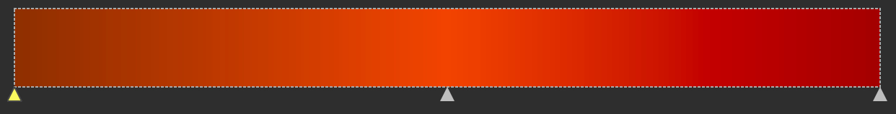

   2. **크기**를 수명 동안 입자가 천천히 크기를 줄이는 숫자 시퀀스로 설정합니다.
      - **시간** = `0`, **값** = `0.313`, **엔벨로프** = `0.1`
      - **시간** = `1`, **값** = `0`, **엔벨로프** = `0`

   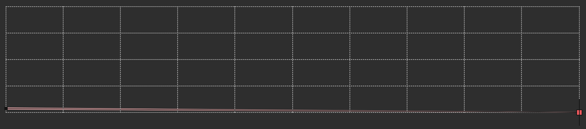

   3. **스쿼시**를 입자가 수명 중간쯤에 약간 길어지는 숫자 시퀀스로 설정합니다.
      - **시간** = `0`, **값** = `-3`, **엔벨로프** = `0`
      - **시간** = `0.323`, **값** = `-0.188`, **엔벨로프** = `0`
      - **시간** = `1`, **값** = `-0.5`, **엔벨로프** = `0`

   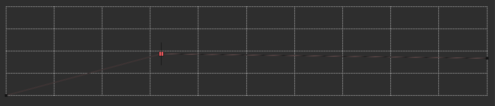

   4. **투명도**를 입자가 상승하면서 빛나는 것을 시뮬레이션하기 위해 불투명도를 무작위로 변경하는 숫자 시퀀스로 설정합니다. 실제 값은 중요하지 않으며, 단지 수명 동안 많이 변해야 합니다.

   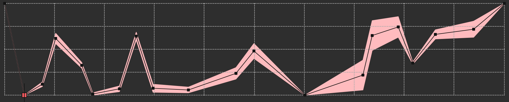

   5. **ZOffset**을 `1`로 설정하여 텍스처가 칼데라에서 약간 떨어지도록 합니다.
   6. **수명**을 `1, 5`로 설정하여 각 입자의 수명을 무작위로 1초에서 5초 사이로 설정합니다.
   7. **속도**를 `5, 8`로 설정하여 각 입자를 무작위로 초당 5에서 8 스터드 사이로 방출합니다.
   8. **확산 각도**를 `180, 180`으로 설정하여 입자를 X 및 Z 축을 따라 각도로 방출합니다.
   9. **가속**을 `0, 10, 0`으로 설정하여 위로 가는 힘을 시뮬레이션하고 입자를 하늘로 끌어올립니다.
   10. **저항**을 `0.8`로 설정하여 입자가 지수적으로 속도를 잃도록 합니다.
   11. **빛 방출**을 `1`로 설정하여 입자를 크게 밝힙니다.
   12. **빛 영향**을 `0`으로 설정하여 환경 조명이 입자 색상에 미치는 영향을 크게 줄입니다.
   13. **밝기**를 `20`으로 설정하여 방출기에서 나오는 빛을 스케일합니다.

   <video controls src="../img/03_03_Creating_Volcanic/Embers-5.mp4" alt="표면이 물결치고 불꽃을 방출하는 칼데라의 앞쪽 보기" width="90%"></video>

### 용암 분출

**용암 분출**은 내부 용암과 압축 가스가 충분한 힘을 가하여 칼데라 위의 용암 표면 장력을 깨뜨리면서 화산에서 위로 분출되는 얇은 용암입니다. 화산의 이 핵심 구성 요소는 화산이 더 이상 휴면 상태가 아니며 활발히 분출하고 있음을 나타내는 가장 흔한 징후 중 하나입니다.

샘플에서는 각 입자의 텍스처를 수명 동안 애니메이션화하기 위해 [플립북](https://create.roblox.com/docs/effects/particle-emitters#flipbooks)을 사용하는 두 개의 `ParticleEmitter` 객체를 사용하여 이 과정을 나타냅니다. 첫 번째 입자 방출기는 무겁고 두꺼운 고점도 분출물처럼 보이는 입자를 방출하여 천천히 올라갔다가 다시 화산으로 떨어지게 합니다. 반대로 두 번째 입자 방출기는 가볍고 얇은 저점도 분출물처럼 보이는 입자를 방출하여 빠르게 올라갔다가 떨어지게 합니다.

<!-- <GridContainer numColumns="2">
  <figure>
    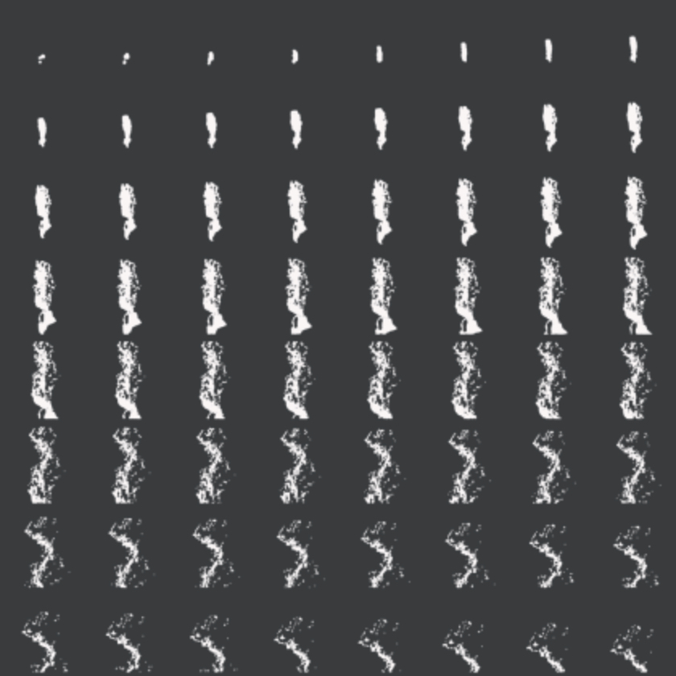
    <figcaption>Dense Splash Texture = rbxassetid:/17363669906</figcaption>
  </figure>
  <figure>
    
    <figcaption>Webby Splash Texture = rbxassetid://17363668312</figcaption>
  </figure>
</GridContainer> -->

|||
|---|---|
|Dense Splash Texture = rbxassetid:/17363669906|Webby Splash Texture = rbxassetid://17363668312|

각 입자 방출기는 64 프레임 동안 텍스처를 애니메이션화하여 부드럽고 생동감 있는 물리적 행동을 모방합니다. 하나의 입자 방출기만 사용할 수도 있지만, 애니메이션의 반복이 눈에 띄게 되어 플레이어에게 몰입감을 깨뜨릴 수 있습니다. 그러나 두 개의 입자가 약간 다른 사용자 정의 속성을 가진 플립북을 애니메이션화할 때 반복을 발견하기가 훨씬 더 어려워집니다.

샘플은 또한 매우 가벼운 웹 분출을 나타내기 위해 기포가 있는 분출처럼 보이는 입자를 방출하는 `ParticleEmitter` 객체를 제공합니다. 이 기술은 공간을 역동적인 움직임으로 채우고 플립북 애니메이션의 반복을 더욱 숨깁니다. 추가 보너스로, 체험에 폭포 생성에서 나오는 폭포가 포함되어 있는 경우, 동일한 텍스처를 두 번 재사용하여 다른 게임 플레이 영역에서 메모리를 절약하고 저성능 장치에서 성능을 향상시킬 수 있습니다.

<GridContainer numColumns="2">
  <figure>
    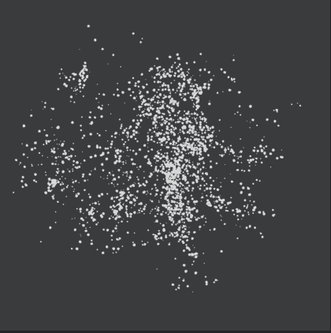
    <figcaption>Webby Texture = rbxassetid://17082061238</figcaption>
  </figure>
  <figure>
  </figure>
</GridContainer>

샘플 [Volcano Island - Complete](https://www.roblox.com/games/17374256579/Volcano-Island-Complete) 장소 파일에서 칼데라 표면에서 튀어 오르는 용암을 재현하려면:

1. **Caldera** 폴더에 **실린더** 부품을 삽입한 다음, 이름을 **SplashingLava**로 변경합니다.
2. **SplashingLava**를 표면 물결 위로 위치시키고, 용암이 튀길 칼데라의 중간 부분을 덮을 때까지 크기를 조정합니다. 부품은 칼데라의 국부 광원과의 근접성 때문에 빛나는 것처럼 보입니다.

   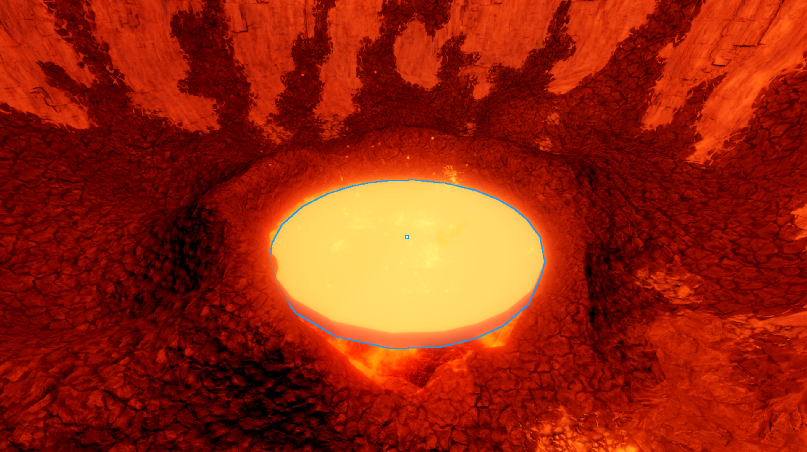

3. **SplashingLava**를 선택한 다음, **속성** 창에서 **투명도**를 `1`로 설정하여 실린더를 보이지 않게 만듭니다.
4. **SplashingLava**에 **ParticleEmitter**를 삽입한 다음, 이름을 **WebbySplashes**로 변경합니다.
5. **WebbySplashes**를 선택한 다음, **속성** 창에서,
   1. **텍스처**를 **rbxassetid://17363668312**로 설정하여 웹 분출처럼 보이는 입자를 렌더링합니다.
   2. **방향**을 **FacingCameraWorldUp**으로 설정하여 입자가 카메라를 향해 방출되도록 하되, 수직 위쪽의 세계 Y 축에서만 회전하도록 설정합니다.
   3. **색상**을 `255, 152, 79`로 설정하여 입자를 밝은 주황색으로 칠합니다.
   4. **크기**를 입자가 수명 동안 변동 창을 가지고 크기가 커지는 숫자 시퀀스로 설정합니다.
      - **시간** = `0`, **값** = `4.31`, **엔벨로프** = `0.762`
      - **시간** = `1`, **값** = `6.2`, **엔벨로프** = `0.875`

   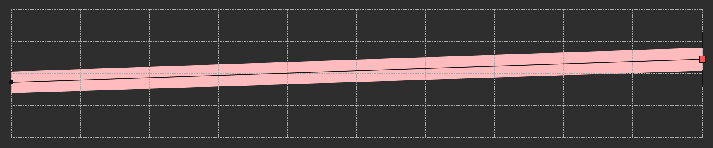

   5. **스쿼시**를 입자가 수명 동안 변동 창을 가지고 약간 길어지는 숫자 시퀀스로 설정합니다.
      - **시간** = `0`, **값** = `-0.075`, **엔벨로프** = `0.263`
      - **시간** = `1`, **값** = `-0.413`, **엔벨로프** = `0.412`

   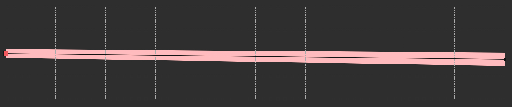

   6. **ZOffset**을 `1`로 설정하여 텍스처가 칼데라에서 약간 떨어지도록 합니다.
   7. **수명**을 `1.5, 2`로 설정하여 각 입자의 수명을 무작위로 1.5초에서 2초 사이로 설정합니다.
   8. **비율**을 `0.37`로 설정하여 약 3초마다 입자를 방출합니다.
   9. **회전 속도**를 `-20, 20`으로 설정하여 각 입자를 무작위로 초당 -20도에서 20도 사이로 방출합니다.
   10. **속도**를 `2`로 설정하여 각 입자를 초당 2 스터드 속도로 방출합니다.
   11. **확산 각도**를 `5, 5`로 설정하여 입자를 X 및 Z 축을 따라 작은 각도로 방출합니다.
   12. **플립북 레이아웃**을 **Grid8x8**으로 설정하여 텍스처를 64 프레임 동안 애니메이션화합니다.
   13. **플립북 모드**를 **Oneshot**으로 설정하여 애니메이션이 수명 동안 한 번만 재생되도록 합니다.
   14. **저항**을 `0.5`로 설정하여 입자가 지수적으로 속도를 잃도록 합니다.
   15. **빛 방출**을 `0.1`로 설정하여 입자를 약간 밝힙니다.
   16. **빛 영향**을 `0.25`로 설정하여 환경 조명이 입자 색상에 미치는 영향을 크게 줄입니다.

   <video controls src="../img/03_03_Creating_Volcanic/Splashes-5.mp4" alt="표면이 물결치고 불꽃과 웹 분출을 방출하는 칼데라의 앞쪽 보기" width="90%"></video>

6. **DenseSplashes**를 복제한 다음, **속성** 창에서 추가 용암 분출에 변화를 주기 위해 다음 속성을 수정합니다.
   1. **이름**을 **DenseSplashes**로 설정합니다.
   2. **텍스처**를 **rbxassetid://17363669906**으로 설정하여 고밀도 분출처럼 보이는 입자를 렌더링합니다.
   3. **크기**를 입자가 수명 동안 변동 창을 가지고 크기가 커지는 숫자 시퀀스로 설정합니다.
      - **시간** = `0`, **값** = `5.75`, **엔벨로프** = `0.762`
      - **시간** = `1`, **값** = `7.37`, **엔벨로프** = `0.875`

   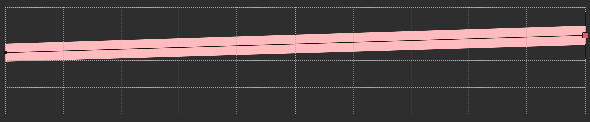

   4. **스쿼시**를 입자가 수명 동안 변동 창을 가지고 약간 길어지는 숫자 시퀀스로 설정합니다.
      - **시간** = `0`, **값** = `0`, **엔벨로프** = `0.225`
      - **시간** = `1`, **값** = `-0.262`, **엔벨로프** = `0.15`

   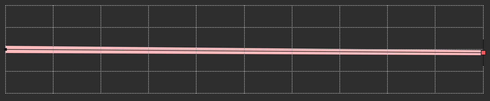

   5. **비율**을 `0.289`로 설정하여 약 4초마다 입자를 방출합니다.

   <video controls src="../img/03_03_Creating_Volcanic/Splashes-6.mp4" alt="표면이 물결치고 불꽃과 웹 분출, 고밀도 분출을 방출하는 칼데라의 앞쪽 보기" width="90%"></video>

7. 칼데라를 추가 분출로 채웁니다.
   1. **SplashingLava**에 **ParticleEmitter**를 삽입한 다음, 이름을 **SplashFill**로 변경합니다.
   2. **SplashFill**을 선택한 다음, **속성** 창에서,
      1. **텍스처**를 **rbxassetid://17082061238**로 설정하여 더 가벼운 웹 분출처럼 보이는 입자를 렌더링합니다.
      2. **방향**을 **FacingCameraWorldUp**으로 설정하여 입자가 카메라를 향해 방출되도록 하되, 수직 위쪽의 세계 Y 축에서만 회전하도록 설정합니다.
      3. **색상**을 `255, 152, 33`으로 설정하여 입자를 주황색으로 칠합니다.
      4. **크기**를 입자가 수명 동안 변동 창을 가지고 크기가 커지는 숫자 시퀀스로 설정합니다.
         - **시간** = `0`, **값** = `1.25`, **엔벨로프** = `0.388`
         - **시간** = `1`, **값** = `6.38`, **엔벨로프** = `0.563`

      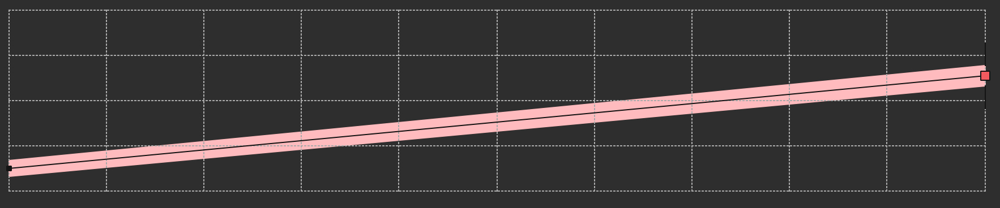

      5. **투명도**를 입자가 투명하게 시작하여 불투명해졌다가 수명 끝에 다시 투명해지는 숫자 시퀀스로 설정합니다.
         - **시간** = `0`, **값** = `1`, **엔벨로프** = `0`
         - **시간** = `0.19`, **값** = `0`, **엔벨로프** = `0`
         - **시간** = `0.795`, **값** = `0`, **엔벨로프** = `0`
         - **시간** = `1`, **값** = `1`, **엔벨로프** = `0`

      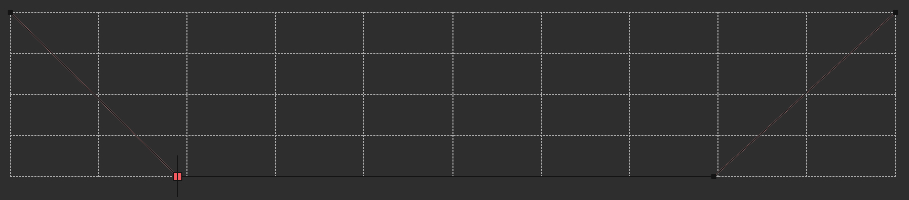

      6. **ZOffset**을 `1`로 설정하여 텍스처가 칼데라에서 약간 떨어지도록 합니다.
      7. **수명**을 `1.5`로 설정하여 각 입자의 수명을 1.5초로 설정합니다.
      8. **비율**을 `8`로 설정하여 8초마다 입자를 방출합니다.
      9. **회전**을 `0, 360`으로 설정하여 각 입자를 반원으로 무작위로 정렬합니다.
      10. **회전 속도**를 `-50, 50`으로 설정하여 각 입자를 무작위로 초당 -50도에서 50도 사이로 방출합니다.
      11. **속도**를 `12, 20`으로 설정하여 각 입자를 무작위로 초당 12에서 20 스터드 사이로 방출합니다.
      12. **확산 각도**를 `45, 45`로 설정하여 입자를 X 및 Z 축을 따라 각도로 방출합니다.
      13. **가속**을 `0, -25, 0`으로 설정하여 중력을 시뮬레이션하고 입자를 아래로 끌어내립니다.
      14. **저항**을 `1`로 설정하여 입자가 지수적으로 속도를 잃도록 합니다.
      15. **빛 방출**을 `1`로 설정하여 입자를 크게 밝힙니다.
      16. **빛 영향**을 `0`으로 설정하여 환경 조명이 입자 색상에 미치는 영향을 크게 줄입니다.
      17. **밝기**를 `8`로 설정하여 방출기에서 나오는 빛을 스케일합니다.

   <video controls src="../img/03_03_Creating_Volcanic/Splashes-7.mp4" alt="표면이 물결치고 불꽃과 다양한 분출을 방출하는 칼데라의 앞쪽 보기" width="90%"></video>

<Alert severity = 'warning'>
플립북과 같은 사용자 정의 텍스처가 있는 기능은 렌더링하는 데 메모리가 필요합니다. 많은 플립북을 다른 고메모리 기능과 함께 사용하면 클라이언트가 메모리가 부족할 때 자동으로 플립북을 비활성화합니다. 이는 오래된 모바일 폰에서 특히 그렇습니다. 플립북의 메모리 사용량을 줄이려면 고유한 애니메이션 입자 효과를 적게 사용하거나 해상도가 낮은 텍스처를 선택하세요.
</Alert>

### 용암 흐름

**용암 흐름**은 분출하여 칼데라에서 지구 표면을 따라 흘러내리는 용암 덩어리입니다. 용암이 공기에 노출되어 식으면 고체 암석으로 변하여 새로운 지형을 만듭니다.

이 과정을 시뮬레이션하기 위해 샘플은 여러 개의 `Beam` 객체를 서로 겹쳐 놓아 매끄러운 텍스처와 속성 구성을 사용하여 용암이 칼데라에서 멀어질수록 냉각되는 행동 특성을 모방합니다:

- **하단 층**은 용암이 온도가 떨어지기 시작함을 나타내기 위해 밝은 빨간색에서 어두운 자주색으로 변하는 평평한 색을 렌더링합니다.
- **중간 층**은 구멍이 있는 어두운 껍질처럼 보이는 검은색 텍스처를 렌더링하여 아래에 있는 빛나는 용암을 드러냅니다.
- **상단 층**은 중간 층과 동일한 텍스처를 느린 속도로 렌더링하고, 첨부 파일을 반전시키며, 반대 속성 구성을 사용합니다. 이렇게 하면 동일한 방향으로 렌더링될 때 텍스처가 완전히 일치할 기회를 제공하지 않아 플레이어가 비현실적인 텍스처 반복을 쉽게 감지할 수 없습니다.

<!-- <GridContainer numColumns="3">
  <figure>
    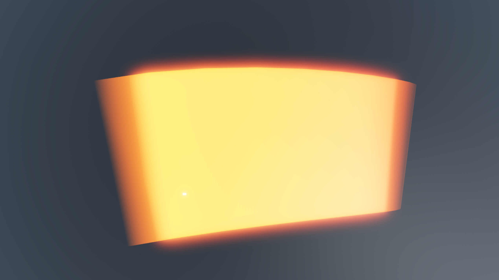
    <figcaption>하단 층</figcaption>
  </figure>
  <figure>
    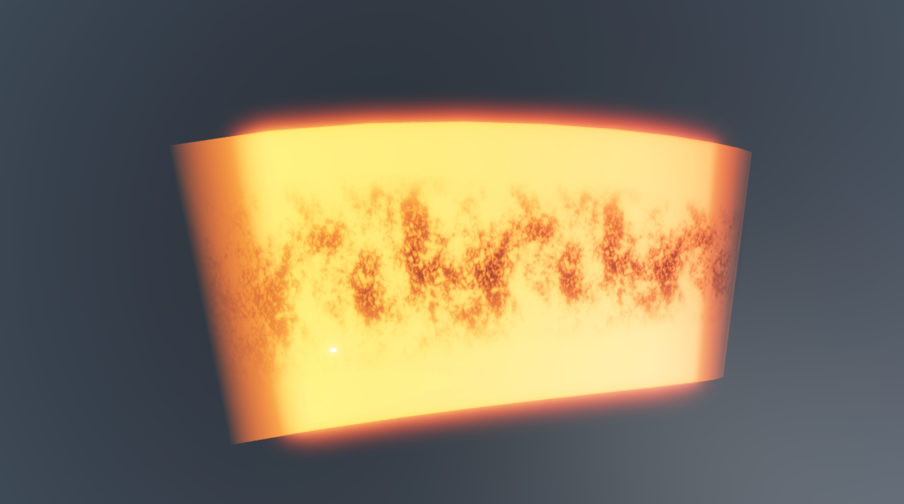
    <figcaption>중간 층</figcaption>
  </figure>
  <figure>
    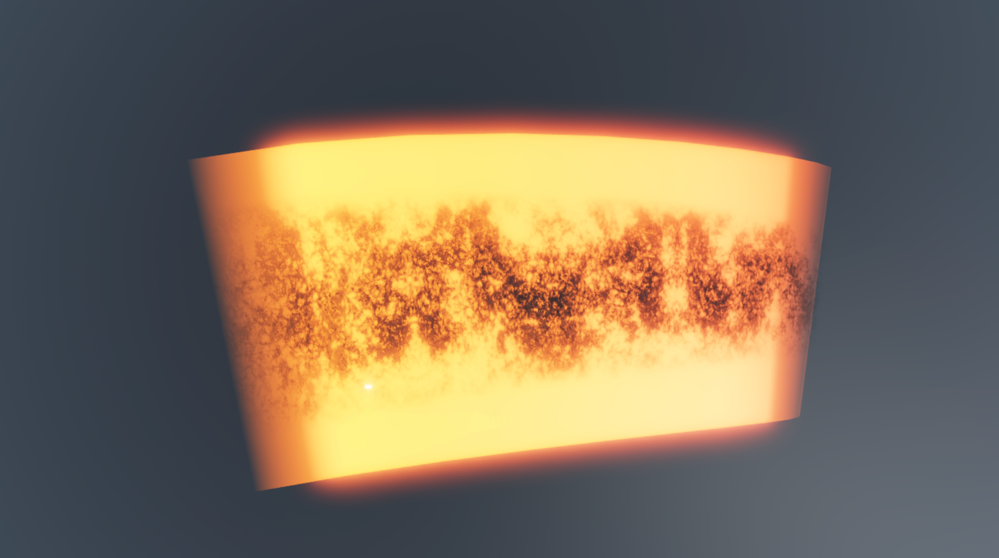
    <figcaption>상단 층</figcaption>
  </figure>
</GridContainer> -->

||||
|---|---|---|
|하단 층|중간 층|상단 층|

세 개의 `Beam` 객체를 겹쳐 놓으면 용암이 서로 다른 속도로 흐르는 것처럼 보이는 깊이와 부피의 느낌을 주어 플레이어가 용암의 표면 위와 아래에 난기류가 있음을 알 수 있게 하는 착시 현상을 만듭니다.

<GridContainer numColumns="2">
  <figure>
    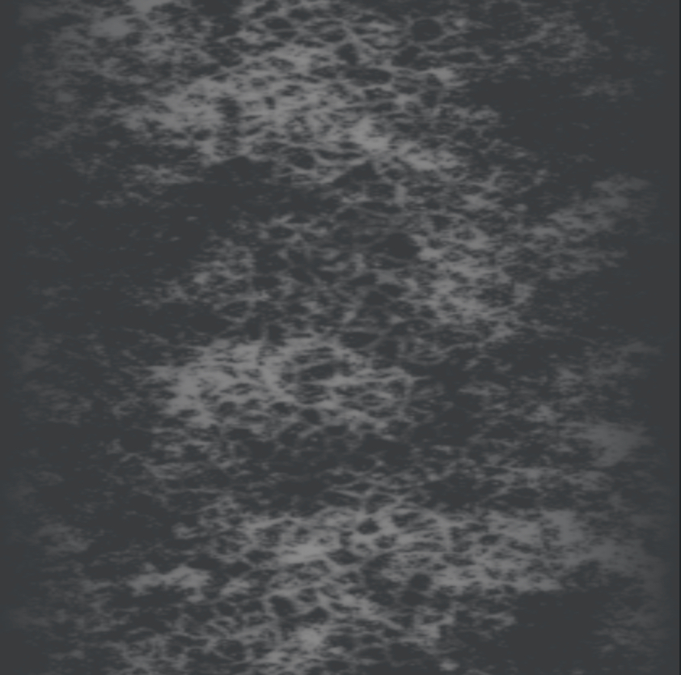
    <figcaption>Crust Texture = rbxassetid://17023930265</figcaption>
  </figure>
  <figure>
  </figure>
</GridContainer>

샘플 [Volcano Island - Complete](https://www.roblox.com/games/17374256579/Volcano-Island-Complete) 장소 파일에서 칼데라에서 흐르는 용암을 재현하려면:

1. **탐색기** 창에서 **작업 공간**에 모든 흐르는 용암 객체를 포함할 **폴더**를 만든 다음, 폴더

 이름을 **FlowingMagma**로 변경합니다.
1. **FlowingMagma** 폴더에 **블록** 부품을 삽입한 다음, 이름을 **MagmaRiverBeam**으로 변경합니다.
1. **MagmaRiverBeam**을 칼데라의 가장자리 아래로 약간 이동시킵니다.

   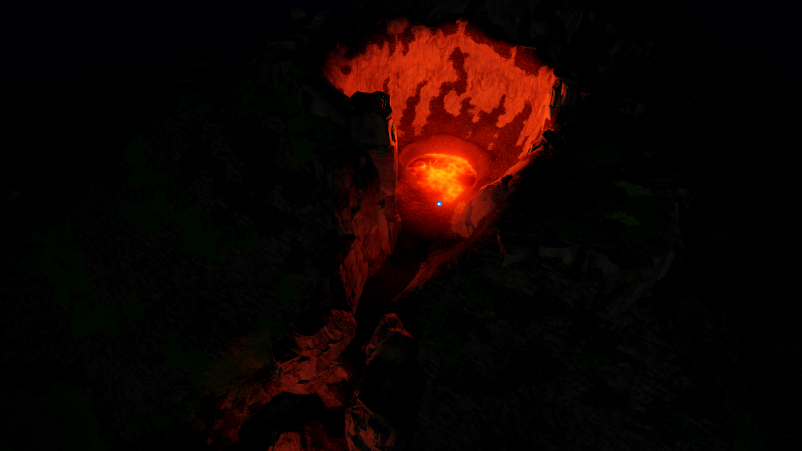

1. 칼데라에서 사용하는 모든 흐르는 용암 빔을 위한 부착물을 구성하여 텍스처를 렌더링합니다.
   1. **MagmaRiverBeam**에 부착물을 삽입한 다음, 부착물이 노란색 시각적 보조 도구가 칼데라를 향하도록 회전시킵니다.
   1. **MagmaRiverBeam**에 다른 부착물을 삽입한 다음, 틈의 갈래 방향으로 위치시키고, 부착물이 노란색 시각적 보조 도구가 바닥을 향하도록 회전시킵니다.

   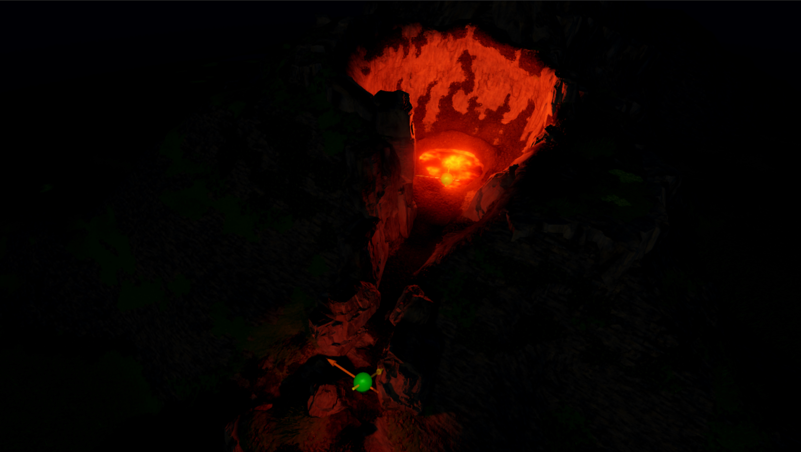

1. **MagmaRiverBeam**에 **Beam**을 삽입한 다음, 이름을 **Magma**로 변경합니다.
1. 부품의 부착물을 **Magma**에 할당합니다.
   1. **탐색기** 창에서 **Magma**를 선택합니다.
   1. **속성** 창에서,
      1. **Attachment0**를 칼데라 가장자리의 부착물로 설정합니다.
      1. **Attachment1**을 틈의 갈래 방향의 부착물로 설정합니다. 빔이 두 부착물 사이에 기본 텍스처를 렌더링합니다.

   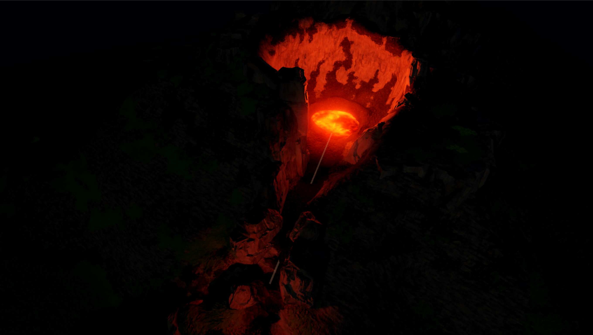

1. 빔의 시각적 외관을 사용자 정의하여 흐르는 용암처럼 보이게 합니다.
   1. **탐색기** 창에서 **Magma**가 여전히 선택되어 있는지 확인합니다.
   1. **속성** 창에서,
      1. **Width0**를 `50`으로 설정하여 텍스처가 렌더링되는 축에서 확장합니다.
      1. **Width1**을 `50`으로 설정하여 텍스처가 틈의 갈래 방향에서 확장됩니다.
      1. **CurveSize0**를 `-50`으로 설정하여 텍스처를 틈의 바닥에서 멀어지게 만듭니다.
      1. **CurveSize1**을 `5`로 설정하여 텍스처를 틈의 갈래 방향으로 곡선화합니다.
      1. **색상**을 용암이 냉각되는 것을 시뮬레이션하기 위해 빔의 수명 동안 밝은 빨간색에서 어두운 빨간색으로 변하는 색상 시퀀스로 설정합니다.
         - **시간** = `0`, **RGB 값** = `255, 51, 0`
         - **시간** = `0.5`, **RGB 값** = `211, 39, 0`
         - **시간** = `1`, **RGB 값** = `118, 24, 0`

         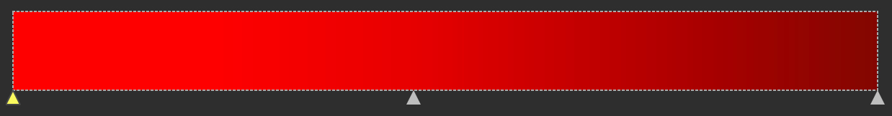

      1. **투명도**를 부착물 사이에서 용암이 더 생동감 있게 보이도록 하는 숫자 시퀀스로 설정합니다.
         - **시간** = `0`, **값** = `1`
         - **시간** = `0.0916`, **값** = `0`
         - **시간** = `0.867`, **값** = `0`
         - **시간** = `0.941`, **값** = `0.725`
         - **시간** = `1`, **값** = `1`

         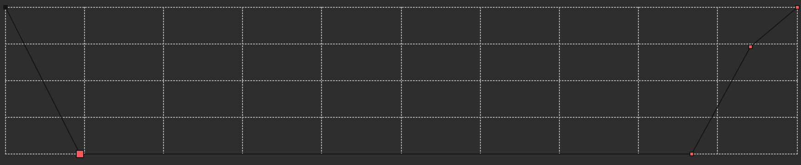

      1. **빛 방출**을 `1`로 설정하여 빔을 크게 밝힙니다.
      1. **빛 영향**을 `0`으로 설정하여 환경 조명이 빔의 색상에 영향을 미치지 않도록 합니다.
      1. **밝기**를 `8`로 설정하여 빔에서 나오는 빛을 스케일합니다.

   <video controls src="../img/03_03_Creating_Volcanic/LavaFlow-7.mp4" alt="하단 층 사용자 정의 텍스처를 렌더링하는 두 개의 블록 부품이 있는 화산의 위에서 본 비스듬한 보기" width="90%"></video>

2. **MagmaRiverBeam**에 다른 **Beam**을 삽입하고, 이름을 **Crust1**로 변경한 다음, 6단계에서와 동일한 프로세스를 사용하여 부품의 부착물을 **Crust1**에 연결합니다.
3. 빔의 시각적 외관을 사용자 정의하여 용암 위의 껍질처럼 보이게 합니다.
   1. **탐색기** 창에서 **Crust1**가 여전히 선택되어 있는지 확인합니다.
   2. **속성** 창에서,
      1. **텍스처**를 **rbxassetid://17023930265**로 설정하여 흐르는 껍질처럼 보이는 새로운 텍스처를 렌더링합니다.
      2. **Width0**를 `35`로 설정하여 텍스처가 렌더링되는 축에서 확장합니다.
      3. **Width1**을 `25`로 설정하여 텍스처가 틈의 갈래 방향에서 확장됩니다.
      4. **텍스처 속도**를 `0.01`로 설정하여 텍스처의 흐름 속도를 크게 늦춥니다.
      5. **텍스처 길이**를 `3`로 설정하여 텍스처의 길이를 약간 늘립니다.
      6. **CurveSize0**를 `-50`으로 설정하여 텍스처를 틈의 바닥에서 멀어지게 만듭니다.
      7. **CurveSize1**을 `5`로 설정하여 텍스처를 틈의 갈래 방향으로 곡선화합니다.
      8. **색상**을 `83, 83, 83`으로 설정하여 빔을 회색으로 칠합니다.
      9. **투명도**를 부착물 사이에서 껍질이 더 생동감 있게 보이도록 하는 숫자 시퀀스로 설정합니다.
         - **시간** = `0`, **값** = `1`
         - **시간** = `0.22`, **값** = `0`
         - **시간** = `0.85`, **값** = `0`
         - **시간** = `1`, **값** = `1`

      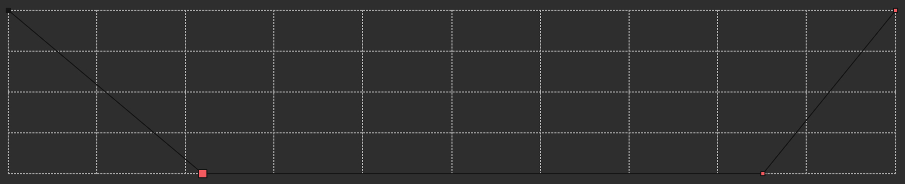

      10. **ZOffset**을 `1`로 설정하여 텍스처가 칼데라에서 약간 떨어지도록 합니다.

   <video controls src="../img/03_03_Creating_Volcanic/LavaFlow-9.mp4" alt="하단 층과 중간 층 사용자 정의 텍스처를 렌더링하는 두 개의 블록 부품이 있는 화산의 위에서 본 비스듬한 보기" width="90%"></video>

4. **Crust1**을 복제하고, 이름을 **Crust2**로 변경한 다음, **속성** 창에서,
   1. **Attachment0**를 틈의 갈래 방향의 부착물로 설정합니다.
   2. **Attachment1**을 칼데라 가장자리의 부착물로 설정합니다.
   3. **Width0**를 `25`로 설정하여 텍스처가 렌더링되는 축에서 확장합니다.
   4. **Width1**을 `35`로 설정하여 텍스처가 틈의 갈래 방향에서 확장됩니다.
   5. **텍스처 속도**를 `-0.008`로 설정하여 텍스처의 흐름 속도를 크게 늦춥니다.
   6. **텍스처 길이**를 `2`로 설정하여 텍스처의 길이를 약간 줄입니다.
   7. **CurveSize0**를 `-5`로 설정하여 텍스처를 틈의 바닥에서 멀어지게 만듭니다.
   1. **CurveSize1**을 `50`으로 설정하여 텍스처를 틈의 갈래 방향으로 곡선화합니다.
   1. **ZOffset**을 `2`로 설정하여 다른 껍질과 텍스처를 분리합니다.

   <video controls src="../img/03_03_Creating_Volcanic/LavaFlow-10.mp4" alt="하단 층, 중간 층 및 상단 층 사용자 정의 텍스처를 렌더링하는 두 개의 블록 부품이 있는 화산의 위에서 본 비스듬한 보기" width="90%"></video>

1. **(선택 사항)** 동일한 프로세스를 사용하여 틈의 갈래 방향으로 더 많은 빔을 만들어 용암을 분기시킵니다. 텍스처를 느리게 조정하고 용암이 온도가 떨어지면서 더 어두운 색으로 변하는 것을 시뮬레이션하기 위해 속성을 조정해야 합니다.

   <video controls src="../img/03_03_Creating_Volcanic/LavaFlow-11.mp4" alt="하단 층, 중간 층 및 상단 층 사용자 정의 텍스처와 분기 빔을 렌더링하는 두 개의 블록 부품이 있는 화산의 위에서 본 비스듬한 보기" width="90%"></video>

### 연기 기둥

칼데라에서 나오는 **연기 기둥**은 따뜻한 압축 가스, 증기 및 화산재를 대기 중으로 방출합니다. 이 화산 배출 혼합물은 실제 세계에서 수 마일 떨어진 곳에서도 볼 수 있어 화산 설계는 종종 3D 공간에서 중요한 관심 지점이 되도록 큰 연기 기둥을 통합합니다.

폭발적인 분출 직후에 볼 수 있는 두꺼운 화쇄암 연기를 방출하는 대신, 샘플은 얇은 연기 증기처럼 보이는 입자를 방출하는 `ParticleEmitter` 객체를 사용하여 상승하면서 색상이 변하는 입자를 방출합니다. 이 기술은 두 가지 목표를 달성합니다:

- 배경 분화구의 실루엣을 깨뜨려 화산 분출 주변에 더 많은 시각적 흥미를 생성합니다.
- 연기가 환경에서 빛을 수용하는 것처럼 보이면서도 연기가 불순물을 태우고 회색으로 변하는 것처럼 어두운 존재감을 유지할 수 있게 합니다.

<GridContainer numColumns="2">
  <figure>
    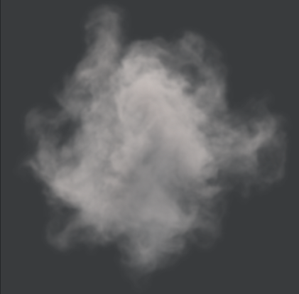
    <figcaption>Smoke Texture = rbxassetid://16830667309</figcaption>
  </figure>
  <figure>
  </figure>
</GridContainer>

샘플 [Volcano Island - Complete](https://www.roblox.com/games/17374256579/Volcano-Island-Complete) 장소 파일에서 칼데라에서 나오는 연기 기둥을 재현하려면:

1. **Caldera** 폴더에 **블록** 부품을 삽입한 다음, 이름을 **SmokePlume**으로 변경합니다.
1. **SmokePlume**을 칼데라 아래에 위치시키고, 칼데라의 표면 영역 크기에 맞게 크기를 조정합니다.

   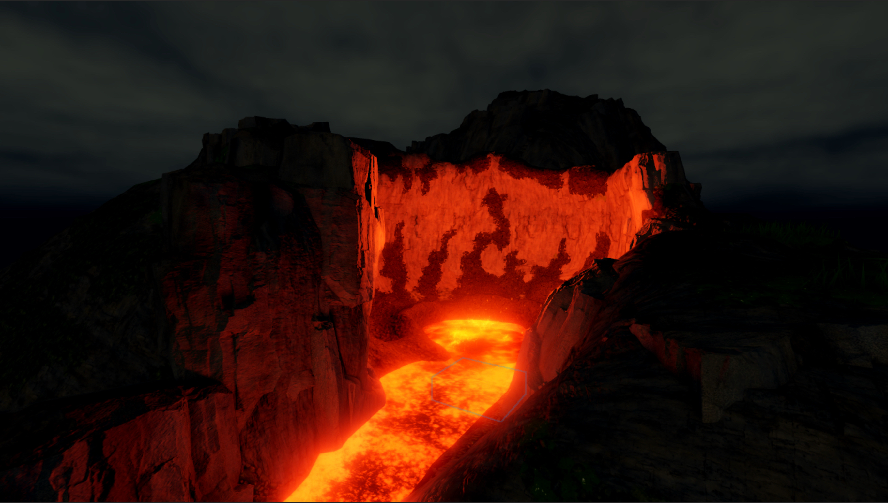

1. **SmokePlume**에 **ParticleEmitter**를 삽입한 다음, 이름을 **Smoke**로 변경합니다.
1. **Smoke**를 선택한 다음, **속성** 창에서,
   1. **텍스처**를 **rbxassetid://16830673704**로 설정하여 두꺼운 연기처럼 보이는 입자를 렌더링합니다.
   2. **색상**을 칼데라에서 하늘까지 환경 조명을 시뮬레이션하여 검은색에서 밝은 복숭아색, 그런 다음 회색으로 변하는 색상 시퀀스로 설정합니다.
      - **시간** = `0`, **RGB 값** = `0, 0, 0`
      - **시간** = `0.374`, **RGB 값** = `195, 104, 76`
      - **시간** = `0.469`, **RGB 값** = `225, 121, 86`
      - **시간** = `0.709`, **RGB 값** = `111, 111, 111`
      - **시간** = `1`, **RGB 값** = `113, 113, 113`

   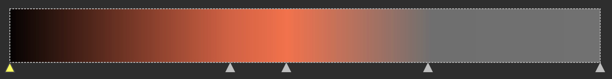

   3. **투명도**를 입자가 투명하게 시작하여 수명 초반에 완전히 불투명해졌다가 수명 끝에 다시 투명해지는 숫자 시퀀스로 설정합니다.
      - **시간** = `0`, **값** = `1`
      - **시간** = `0.0622`, **값** = `0`
      - **시간** = `0.845`, **값** = `0`
      - **시간** = `0`, **값** = `1`

   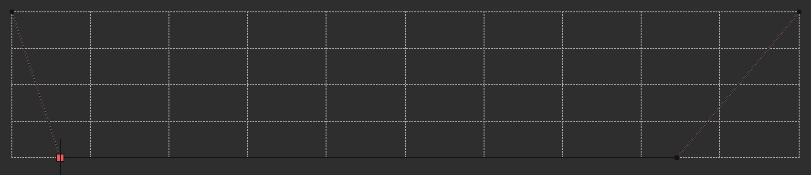

   4. **ZOffset**을 `-10`으로 설정하여 텍스처가 칼데라 상단에 더 가까워지도록 합니다.
   5. **수명**을 `50, 60`으로 설정하여 각 입자의 수명을 무작위로 50초에서 60초 사이로 설정합니다.
   6. **비율**을 `0.3`으로 설정하여 약 3초마다 입자를 방출합니다.
   7. **회전**을 `-360, 360`으로 설정하여 각 입자를 원형으로 무작위로 정렬합니다.
   8. **회전 속도**를 `-5, 5`로 설정하여 각 입자를 무작위로 초당 -5도에서 5도 사이로 방출합니다.
   9. **확산 각도**를 `5, 5`로 설정하여 입자를 X 및 Z 축을 따라 작은 각도로 방출합니다.
   10. **가속**을 `0, 7, 0`으로 설정하여 위로 가는 힘을 시뮬레이션하고 입자를 하늘로 끌어올립니다.
   11. **저항**을 `1`로 설정하여 입자가 지수적으로 속도를 잃도록 합니다.
   12. **WindAffectsDrag**을 활성화하여 환경에서 바람이 연기를 밀어내도록 합니다.
   13. **빛 방출**을 `0.1`로 설정하여 입자를 약간 밝힙니다.
   14. **빛 영향**을 `0.06`으로 설정하여 환경 조명이 입자 색상에 미치는 영향을 크게 줄입니다.
2. **명령줄**에 다음 문자열을 입력하여 각 입자의 크기를 수명 동안 40에서 100 스터드로 변동 창을 가지고 증가시킵니다:

   ``` lua
   workspace.Caldera.SmokePlume.Smoke.Size = NumberSequence.new{NumberSequenceKeypoint.new(0,40,5), NumberSequenceKeypoint.new(1,100,15)}
   ```

   <video controls src="../img/03_03_Creating_Volcanic/Plume-5.mp4" alt="완성된 화산의 비스듬한 측면 보기" width="90%"></video>

---
## 출처
 - [Creating Volcanic Eruptions with VFX](https://create.roblox.com/docs/tutorials/building/effects/creating-volcanoes)

---
## [다음](./03_04_Using_Particles_for_Explosions.md)