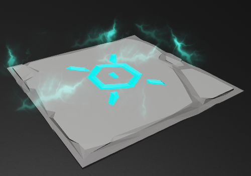
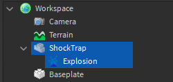
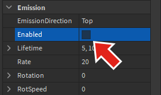
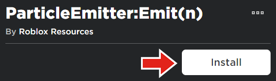
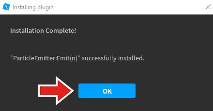
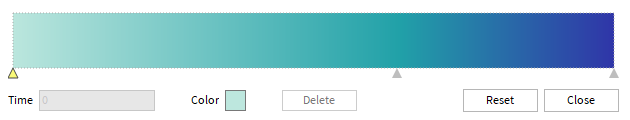
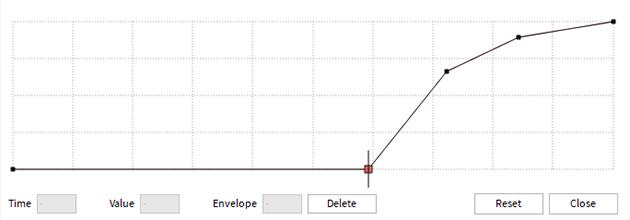
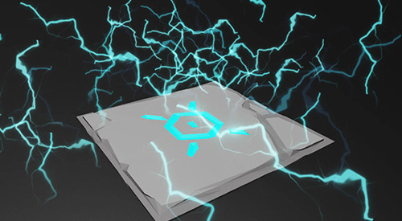
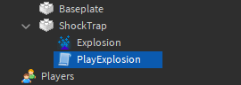

# Using Particles for Explosions

## 목차
- [Using Particles for Explosions](#using-particles-for-explosions)
  - [목차](#목차)
  - [방출기 설정](#방출기-설정)
  - [입자 분출 테스트](#입자-분출-테스트)
  - [색상 및 투명도](#색상-및-투명도)
  - [스크립트 설정](#스크립트-설정)
  - [폭발 재생](#폭발-재생)
  - [출처](#출처)
  - [다음](#다음)

---

이전에, 당신은 `화산에서 나오는 연기`와 같은 연속적으로 재생되는 입자와 작업했습니다. 입자는 또한 폭발과 같은 단일 분출에서도 사용할 수 있습니다. 이 튜토리얼에서는 입자의 분출을 통해 플레이어를 죽이는 함정을 만드는 방법을 보여줍니다.

<!-- <video controls loop muted>
    <source src="../img/03_04_Using_Particles_for_Explosions/burstParticle_finalInContext.mp4" />
</video> -->
[](https://prod.docsiteassets.roblox.com/assets/tutorials/using-particles-for-explosions/burstParticle_finalInContext.mp4)

## 방출기 설정

폭발은 입자의 분출을 생성할 몇 가지 속성이 변경된 ParticleEmitter를 사용할 것입니다.

1. 위험해 보이는 함정을 설계합니다. 그런 다음 **Explosion**이라는 이름의 **ParticleEmitter**를 부품에 삽입합니다.

   <GridContainer numColumns="2">
     
     
   </GridContainer>

2. 다음 속성을 사용하여 전기 스파크 효과를 만듭니다.

   <table>
   <thead>
   <tr>
      <th>속성</th>
      <th>값</th>
      <th>설명</th>
   </tr>
   </thead>
   <tr>
   <td><b>Texture</b></td>
   <td>rbxassetid://6101261905</td>
   <td>전기 스파크 텍스처.</td>
   </tr>
   <tr>
   <td><b>Drag</b></td>
   <td>10</td>
   <td>입자가 속도를 잃는 속도.</td>
   </tr>
   <tr>
   <td><b>Lifetime</b></td>
   <td>0.2, 0.6</td>
   <td>폭발 입자가 짧은 시간 동안 존재하게 합니다.</td>
   </tr>
   <tr>
   <td><b>Speed</b></td>
   <td>20, 40</td>
   <td>짧은 수명을 보상합니다.</td>
   </tr>
   <tr>
   <td><b>SpreadAngle</b></td>
   <td>180, 180</td>
   <td>모든 방향으로 입자를 발사합니다.</td>
   </tr>
   </table>

3. 함정이 지속적으로 입자를 방출하지 않도록 **Enabled**를 **off**로 전환합니다.

   

## 입자 분출 테스트

입자 분출을 테스트하려면 Roblox에서 개발한 Studio 플러그인을 사용할 수 있습니다.

1. [Emit() 플러그인](https://www.roblox.com/library/303835976/ParticleEmitter-Emit-n) 플러그인의 마켓플레이스 페이지로 이동합니다. 해당 페이지에서 **설치** 버튼을 클릭합니다.

   

2. Studio가 열리면 플러그인이 자동으로 설치됩니다.

   

3. **Explosion** 방출기를 선택하고 게임 창의 왼쪽 상단에 나타나는 플러그인 UI를 확인합니다. 숫자 상자에 **100**(방출할 입자의 수)을 입력하고 <kbd>Enter</kbd>를 누릅니다.

   

4. **Emit** 버튼을 눌러 방출기를 테스트합니다.

<!-- <video controls loop muted>
    <source src="../img/03_04_Using_Particles_for_Explosions/burstParticle_testParticleEmit.mp4" />
</video> -->
[](https://prod.docsiteassets.roblox.com/assets/tutorials/using-particles-for-explosions/burstParticle_testParticleEmit.mp4)

## 색상 및 투명도

몇 가지 추가 단계를 통해 폭발을 더욱 인상적으로 만들 수 있습니다.

1. 방출기의 **Color** 속성 옆에 있는 점 세 개를 클릭하여 시퀀스 창을 엽니다. 그런 다음 창에서 색상 그라데이션을 만들기 위해 키포인트를 생성합니다.

   

2. **Transparency**에 대해 부드러운 곡선을 따라 투명도가 증가하는 **number sequence**를 사용하여 점진적으로 사라지는 효과를 만듭니다.

   

   완성된 입자 효과는 아래와 같을 수 있습니다.

   

## 스크립트 설정

방출기가 완료되면 이제 스크립트를 통해 폭발을 재생할 수 있습니다. 이 스크립트는 함정을 터치하는 플레이어를 확인하여 누군가를 감지하면 입자를 방출하고 플레이어를 죽입니다.

1. 함정 부품에 **PlayExplosion**이라는 새로운 **Script**를 추가합니다.

   

2. 부품과 방출기를 저장할 변수를 설정합니다. 그런 다음 폭발당 방출되는 입자의 수를 저장하는 `EMIT_AMOUNT`라는 변수를 포함시킵니다.

   ```lua
   local trapObject = script.Parent
   local particleEmitter = trapObject.Explosion

   local EMIT_AMOUNT = 100
   ```

3. `Humanoid`가 부품을 터치하는지 확인하는 이벤트를 코딩합니다. 만약 그렇다면, 해당 휴머노이드의 건강을 0으로 설정하여 다시 스폰되도록 합니다.

   ```lua
   local trapObject = script.Parent
   local particleEmitter = trapObject.Explosion

   local EMIT_AMOUNT = 100

   local function killPlayer(otherPart)
   	local character = otherPart.Parent
   	local humanoid = character:FindFirstChildWhichIsA("Humanoid")

   	if humanoid then
   		humanoid.Health = 0
   	end
   end

   trapObject.Touched:Connect(killPlayer)
   ```

## 폭발 재생

스크립트에서 입자는 `Emit()` 함수를 사용하여 방출됩니다. 이것은 한 번에 다수의 입자를 분출합니다.

1. `Emit()` 함수를 호출하고 이전에 만든 변수인 `EMIT_AMOUNT`를 전달합니다.

   ```lua
   local trapObject = script.Parent
   local particleEmitter = trapObject.Explosion

   local EMIT_AMOUNT = 100

   local function killPlayer(otherPart)
   	local character = otherPart.Parent
   	local humanoid = character:FindFirstChildWhichIsA("Humanoid")

   	if humanoid then
   		humanoid.Health = 0
   		particleEmitter:Emit(EMIT_AMOUNT)
   	end
   end

   trapObject.Touched:Connect(killPlayer)
   ```

2. 함정에 걸어 들어가서 스크립트를 테스트합니다.

<!-- <video controls loop muted>
    <source src="../img/03_04_Using_Particles_for_Explosions/burstParticle_genericFinal.mp4" />
</video> -->
[](https://prod.docsiteassets.roblox.com/assets/tutorials/using-particles-for-explosions/burstParticle_genericFinal.mp4)

이 튜토리얼의 예제를 약간만 변경하면 다양한 효과를 만들 수 있습니다. 일부 대안에는 수집 가능한 물체를 모으기 위한 반짝임 또는 투사체의 충격을 나타내기 위한 폭발이 포함됩니다.

---
## 출처
 - [Using Particles for Explosions](https://create.roblox.com/docs/tutorials/building/effects/using-particles-for-explosions)

---
## [다음](./04_01_Creating_Score_Bars.md)