# Creating Score Bars

## 목차
- [Creating Score Bars](#creating-score-bars)
  - [목차](#목차)
  - [프레임 만들기](#프레임-만들기)
  - [아이콘 추가](#아이콘-추가)
  - [점수 텍스트 삽입](#점수-텍스트-삽입)
  - [디자인 테스트](#디자인-테스트)
  - [출처](#출처)
  - [다음](#다음)

---

**점수 바**는 플레이어의 레벨 업 통계, 화폐 수량 또는 인벤토리에 있는 파워업 아이템과 같은 게임 플레이에 중요한 플레이어 정보를 표시하는 UI 요소입니다. 점수 바를 플레이어 화면에 직접 표시함으로써, 플레이어가 경험 내 다양한 목표를 달성하기 위해 필요한 것에 집중할 수 있도록 합니다.

[Gold Rush](https://www.roblox.com/games/5268331031/Gold-Rush) `.rbxl` 파일을 참조하여, 이 튜토리얼에서는 플레이어가 수집한 금의 양을 추적하는 점수 바를 만드는 방법을 안내합니다. 여기에는 다음 내용이 포함됩니다:

- 화면 상단 중앙에 프레임 만들기.
- 점수 바가 텍스트 없이도 추적하는 내용을 전달하는 왕관 아이콘 추가.
- 플레이어가 수집한 금의 양을 기록하는 점수 텍스트 삽입.
- 다양한 화면과 화면 비율에서 UI 디자인을 검토하기 위해 여러 에뮬레이트된 장치에서 테스트하기.

<Alert severity="info">
모든 2D 제작과 마찬가지로 특정 목표를 달성하는 방법은 여러 가지가 있습니다. 타사 UI 도구에서 자체 2D 에셋을 만들고 자신의 디자인으로 따라 할 수 있습니다.
</Alert>

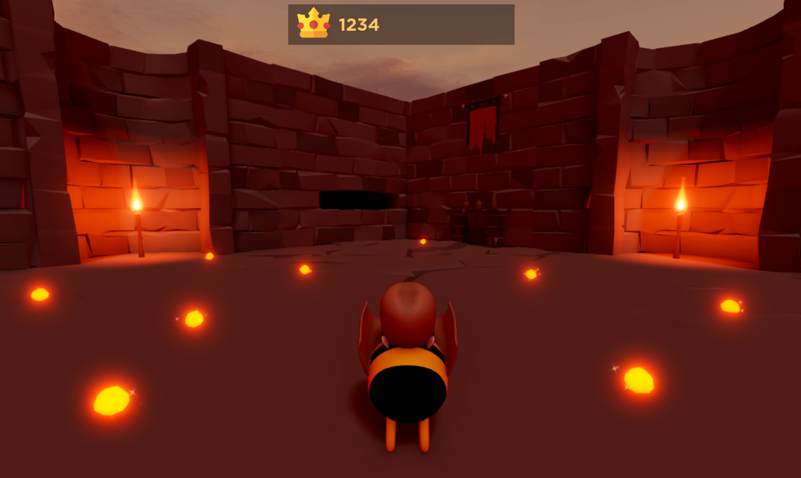

## 프레임 만들기

모든 플레이어의 화면에 UI 요소를 표시하려면 `StarterGui` 서비스에 `ScreenGui` 객체를 만들 수 있습니다. `ScreenGui` 객체는 화면 UI의 주요 컨테이너이며, `StarterGui` 서비스는 경험에 들어갈 때 각 플레이어의 `PlayerGui` 컨테이너에 그 내용을 복사합니다.

`ScreenGui` 객체를 만든 후에는 각 컨테이너의 목적에 따라 자식 `GuiObjects`를 만들고 사용자 정의할 수 있습니다. 이 개념을 설명하기 위해, 이 섹션에서는 점수 바의 아이콘과 텍스트를 포함할 자식 `Frame` 객체가 있는 `ScreenGui` 객체를 만드는 방법을 가르칩니다.

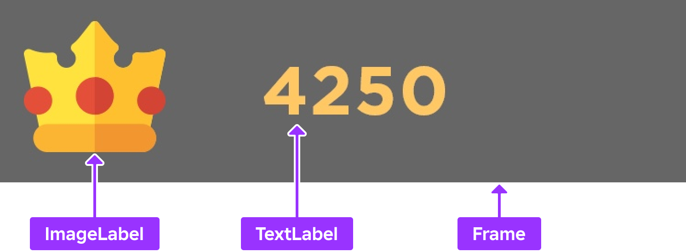

프레임의 속성을 사용자 정의하는 것 외에도, 이 섹션에서는 프레임에 자식 `UISizeConstraint` 및 `UIListLayout` 객체를 추가하는 방법도 설명합니다. 이 기술을 통해 `GuiObjects`가 프레임에 삽입될 때 자동으로 가로로 배열되고 작은 화면 크기에서도 항상 읽을 수 있게 됩니다. 이 지침을 따르지 않으면, 프레임에 추가되는 모든 `GuiObject`가 프레임의 경계 밖으로 배열됩니다.

<GridContainer numColumns="2">
  <figure>
    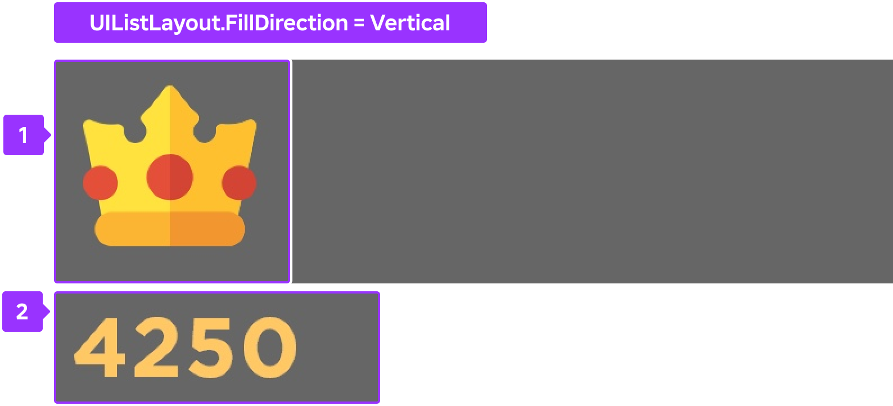
  </figure>
  <figure>
    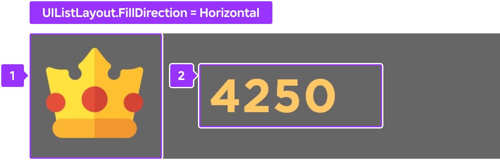
  </figure>
</GridContainer>

샘플 [Gold Rush](https://www.roblox.com/games/5268331031/Gold-Rush) 장소 파일 내에서 프레임 컨테이너를 재현하려면:

1. 화면 UI를 포함할 `ScreenGui` 객체를 만듭니다.
   1. **탐색기** 창에서 **StarterGui** 위에 마우스를 올리고 ⊕ 아이콘을 클릭합니다. 상황에 맞는 메뉴가 표시됩니다.
   2. **ScreenGui**를 삽입합니다.
2. 전체 점수 바 UI 구성 요소를 위한 컨테이너를 만듭니다.
   1. **ScreenGui** 객체에 **Frame**을 삽입합니다.

      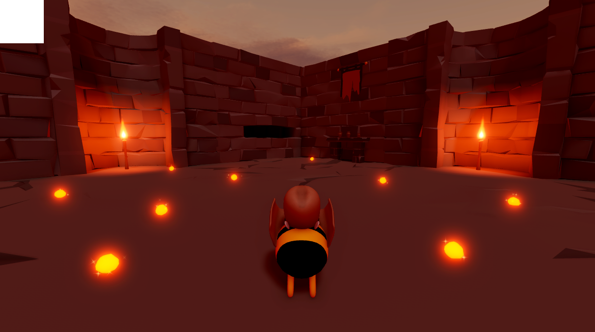

   2. 새 **Frame**을 선택한 다음, **속성** 창에서,
      1. **AnchorPoint**를 `0.5, 0`로 설정하여 프레임의 원점을 상단 중앙으로 설정합니다(왼쪽에서 오른쪽으로 프레임의 50%, 위에서 아래로 프레임의 0%).
      2. **BackgroundColor**를 `0.6`으로 설정하여 프레임의 배경을 검정색으로 만듭니다.
      3. **BackgroundTransparency**를 `0.6`으로 설정하여 프레임의 배경을 반투명하게 만듭니다.
      4. **Position**을 `{0.5, 0},{0.01, 0}`로 설정하여 프레임을 화면 상단 중앙 근처에 배치합니다(왼쪽에서 오른쪽으로 화면의 50%, 위에서 아래로 화면의 1%).
      5. **Size**를 `{0.25, 0},{0.08, 0}`로 설정하여 프레임이 화면 중간의 큰 부분을 차지하도록 합니다(가로로 25%, 세로로 8%).
      6. **Name**을 **ScoreBarFrame**으로 설정합니다.

      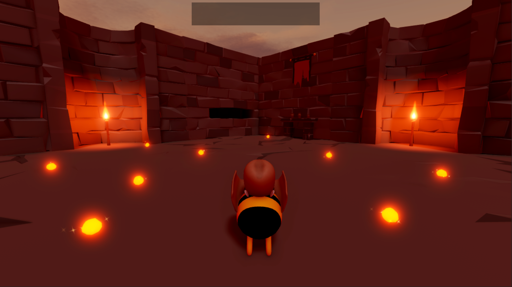

3. 작은 화면 크기에서도 내용이 항상 읽을 수 있도록 프레임에 제약 조건을 추가합니다.
   1. **ScoreBarFrame**에 **UISizeConstraint** 객체를 삽입합니다.
   2. 새 제약 조건을 선택한 다음, **속성** 창에서 **MinSize**를 `0, 40`으로 설정하여 프레임이 세로로 40픽셀 이하로 줄어들지 않도록 합니다.
4. 프레임에 레이아웃 객체를 추가하여 내용이 프레임의 경계 내에서 왼쪽에서 오른쪽으로 배열되고 세로로 가운데에 정렬되도록 합니다.
   1. **ScoreBarFrame**에 **UIListLayout** 객체를 삽입합니다.
   2. 새 레이아웃 객체를 선택한 다음, **속성** 창에서,
      1. **FillDirection**을 **Horizontal**로 설정합니다.
      2. **VerticalAlignment**를 **Center**로 설정합니다.

## 아이콘 추가

아이콘은 경험 내에서 액션, 객체 또는 개념을 나타내는 기호입니다. 단순하고 직관적인 아이콘을 사용하면 텍스트를 사용하지 않고도 UI를 통해 전달하고자 하는 내용을 쉽게 인식할 수 있습니다. 텍스트는 화면을 어지럽히고 중요한 콘텐츠에서 주의를 분산시킬 수 있습니다.

예를 들어, 샘플에서는 플레이어가 수집한 금의 양을 나타내기 위해 간단한 금 왕관 아이콘을 사용합니다. 이 아이콘은 경험 내에서 가장 중요한 목표로 쉽게 인식할 수 있으며, 모바일 장치 화면에서도 읽을 수 있도록 최소한의 세부 정보만 포함하고 있습니다.

샘플 [Gold Rush](https://www.roblox.com/games/5268331031/Gold-Rush) 장소 파일 내에서 금 왕관 아이콘을 재현하려면:

1. **ScoreBarFrame**에 **ImageLabel** 객체를 삽입합니다.
   1. **탐색기** 창에서 **ScoreBarFrame** 위에 마우스를 올리고 ⊕ 아이콘을 클릭합니다. 상황에 맞는 메뉴가 표시됩니다.
   1. **ImageLabel**을 삽입합니다.

      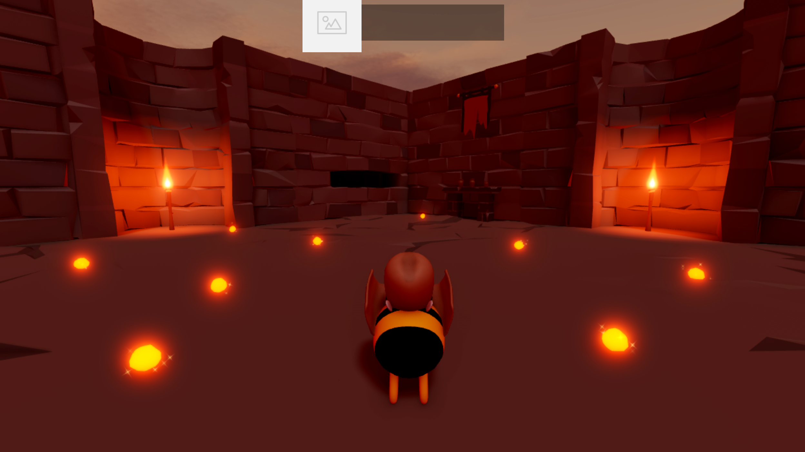

1. 새 레이블을 선택한 다음, **속성** 창에서,
   1. **Image**를 `rbxassetid://5673786644`로 설정하여 아이콘을 왕관으로 만듭니다.
   1. **BackgroundTransparency**를 `1`로 설정하여 레이블의 배경을 완전히 투명하게 만듭니다.
   1. **LayoutOrder**를 `1`로 설정합니다. 이렇게 하면 다음 섹션에서 텍스트를 삽입할 때 아이콘이 프레임의 왼쪽에서 오른쪽으로 첫 번째 GuiObject로 유지됩니다.
   1. **Size**를 `{1.25,0},{1,0}`로 설정하여 레이블 영역을 프레임의 전체 너비 너머로 확장합니다.
   1. **SizeConstraint**를 **RelativeYY**로 설정하여 상위 프레임의 높이와 함께 레이블 크기가 조정되도록 하여 아이콘의 가로 세로 비율을 유지합니다.

      

## 점수 텍스트 삽입

점수 텍스트는 플레이어가 경험 내에서 얻는 점수를 기록합니다. 모든 UI 텍스트가 명확하고 읽기 쉬워야 플레이어가 경험 내에서 성공하기 위해 필요한 정보를 빠르게 이해할 수 있습니다.

예를 들어, 샘플에서는 배경의 소음과 섞이지 않도록 대비되는 색상 위에 큰 텍스트를 사용

합니다. 이는 플레이어가 3D 공간을 이동할 때 텍스트가 항상 읽을 수 있도록 보장하기 때문에 접근성 면에서 특히 중요합니다. 3D 공간에는 텍스트와 같은 색상의 객체가 포함될 수 있습니다.

샘플 [Gold Rush](https://www.roblox.com/games/5268331031/Gold-Rush) 장소 파일 내에서 점수 텍스트를 재현하려면:

1. **ScoreBarFrame**에 **TextLabel** 객체를 삽입합니다.
   1. **탐색기** 창에서 **ScoreBarFrame** 위에 마우스를 올리고 ⊕ 아이콘을 클릭합니다. 상황에 맞는 메뉴가 표시됩니다.
   1. **TextLabel**을 삽입합니다.

      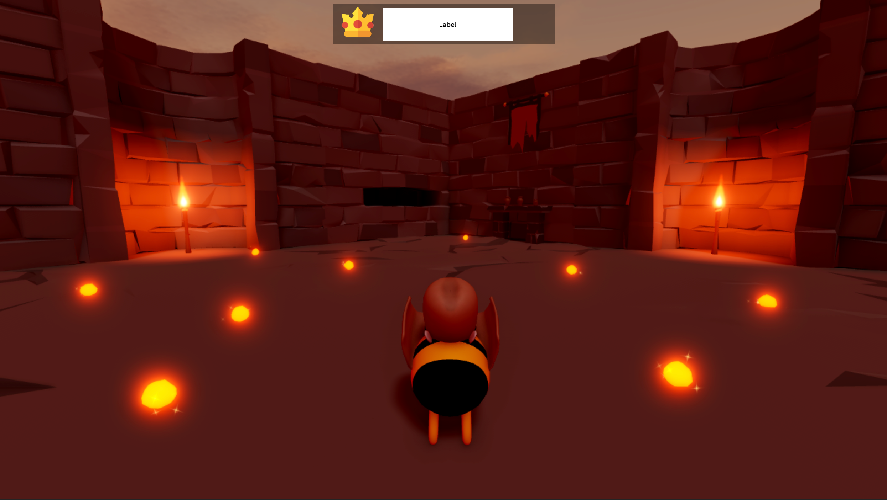

1. 새 레이블을 선택한 다음, **속성** 창에서,
   1. **BackgroundTransparency**를 `1`로 설정하여 레이블의 배경을 완전히 투명하게 만듭니다.
   1. **Size**를 `{1,0},{1,0}`로 설정하여 레이블을 전체 프레임 너비로 확장합니다(상위 프레임의 가로 100% 및 세로 100%). 레이블은 아이콘에 의해 오프셋되기 때문에 프레임의 경계를 넘어서 확장됩니다.
   1. **SizeConstraint**를 **RelativeYY**로 설정하여 상위 프레임의 높이에 따라 레이블 크기를 조정하고 아이콘의 가로 세로 비율을 유지합니다. 이 단계는 레이블을 정사각형으로 만들어 프레임의 경계 내에 유지합니다.
   1. **Font**를 **GothamSSm**으로 설정하여 환경의 미학에 맞춥니다.
   1. **Text**를 `0`으로 설정하여 점수를 0부터 시작합니다.
   1. **TextColor3**를 `255, 200, 100`으로 설정하여 텍스트를 금색으로 칠합니다.
   1. **TextSize**를 `30`으로 설정하여 화면에서 텍스트를 더 크게 만듭니다.
   1. **TextXAlignment**를 **Left**로 설정하여 플레이어의 점수가 0, 1,000 또는 1,000,000인지에 관계없이 점수 텍스트가 왕관 아이콘 근처에 왼쪽 정렬되도록 합니다.

      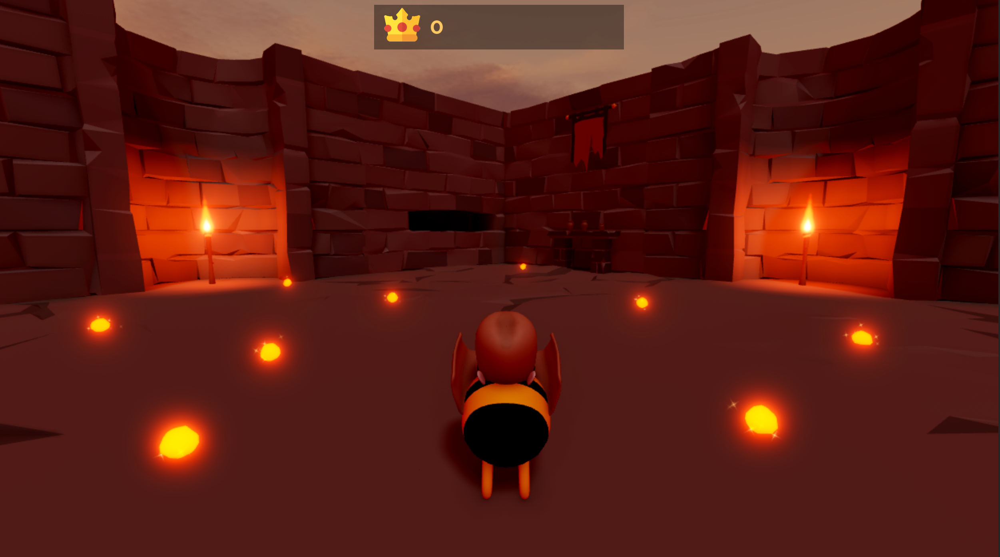

## 디자인 테스트

Studio의 **장치 에뮬레이터**를 사용하면 플레이어가 다양한 장치에서 UI를 어떻게 보고 상호작용할지 테스트할 수 있습니다. 이 도구는 UI 설계의 중요한 부분입니다. Studio의 뷰포트의 화면 비율이 플레이어가 경험에 접근하는 화면 비율을 반드시 반영하지 않기 때문에, 모든 장치에서 UI가 읽기 쉽고 접근 가능하도록 하는 것이 중요합니다.

예를 들어, 화면 크기를 다양한 범위에서 테스트하지 않으면, 큰 화면을 사용하는 플레이어는 텍스트를 읽지 못하거나 아이콘을 해독하지 못할 수 있고, 작은 화면을 사용하는 플레이어는 UI 요소가 화면의 너무 많은 공간을 차지하여 3D 공간을 볼 수 없을 수 있습니다.

다양한 화면 크기에서 UI를 에뮬레이트하려면:

1. 메뉴 바에서 **테스트** 탭을 선택합니다.
1. **에뮬레이션** 섹션에서 **장치**를 클릭합니다. 뷰포트가 평균 노트북의 화면 비율을 반영하도록 변경됩니다.

   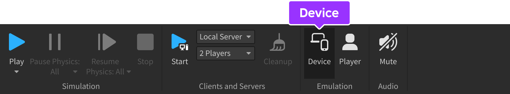

1. 해상도 드롭다운에서 **실제 해상도**를 선택합니다. 이렇게 하면 에뮬레이트 중인 장치에서 UI 요소의 실제 해상도를 확인할 수 있습니다.

   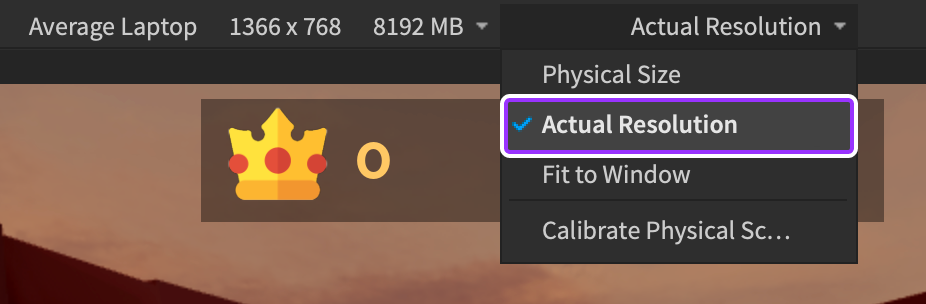

1. 장치 드롭다운에서 **전화**, **태블릿**, **데스크탑** 및 **콘솔** 섹션 내에서 최소한 하나의 장치를 선택합니다.

   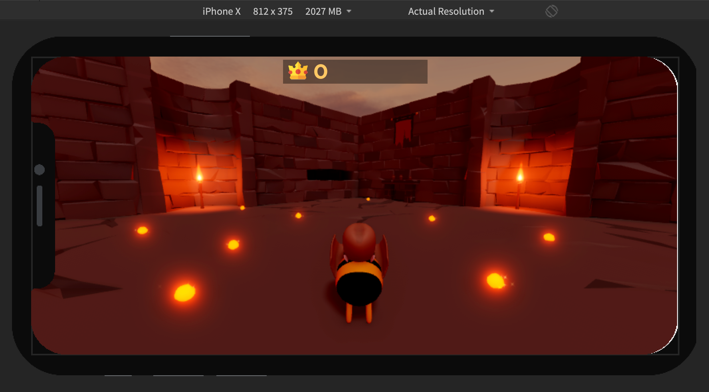

---
## 출처
 - [Creating Score Bars](https://create.roblox.com/docs/tutorials/building/ui/creating-a-score-bar)

---
## [다음](./04_02_Interactive_Buttons.md)