# Interactive Buttons

## 목차
- [Interactive Buttons](#interactive-buttons)
  - [목차](#목차)
  - [버튼 유형](#버튼-유형)
  - [버튼 만들기](#버튼-만들기)
    - [크기](#크기)
    - [크기 조정](#크기-조정)
    - [위치](#위치)
    - [이미지](#이미지)
    - [스타일링](#스타일링)
  - [버튼 기능](#버튼-기능)
    - [문제 해결](#문제-해결)
  - [출처](#출처)
  - [다음](#다음)

---

이 튜토리얼에서는 메뉴, 인터페이스 액션 등을 위한 화면 상의 버튼을 만드는 방법을 보여줍니다.

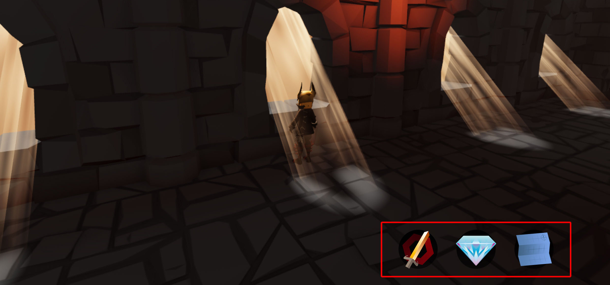

## 버튼 유형

UI 디자인에서 사용할 수 있는 버튼 객체에는 두 가지 유형이 있습니다:

<table>
    <thead>
        <tr>
            <th>
            텍스트 버튼
            </th>
            <th>
            이미지 버튼
            </th>
        </tr>
    </thead>
    <tbody>
    <tr>
            <td >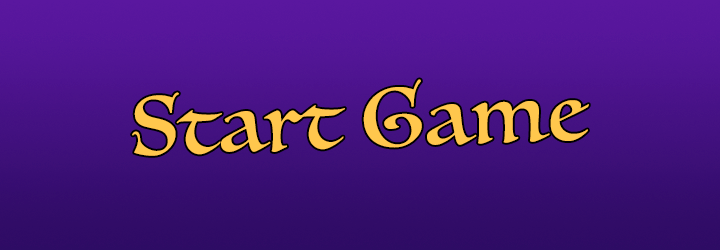
            </td>
            <td>
            </td>
        </tr>
        <tr>
            <td>
            `TextButton`은 `TextLabel`과 유사하지만, 플레이어가 클릭/탭하여 활성화할 수 있습니다. 또한 글꼴, 배경 색상, 테두리 색상 등 많은 시각적 속성을 공유합니다.
            </td>
            <td>
            `ImageButton`은 `ImageLabel` 객체의 인터랙티브 버전과 같습니다. 또한 비버튼 객체와 대부분의 동일한 속성을 공유합니다.
            </td>
        </tr>
    </tbody>
</table>

## 버튼 만들기

다음 단계에서는 화면에 `ImageButton`을 추가하고 플레이어의 상호작용에 따라 세 가지 모양으로 전환하는 방법을 보여줍니다.

1. 탐색기 창에서 **StarterGui** 객체 위에 마우스를 올리고 **+** 버튼을 클릭하여 **ScreenGui**를 삽입합니다.

   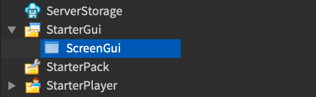

2. 새 **ScreenGui** 객체를 선택하고, 비슷한 방식으로 **ImageButton**을 삽입합니다.

   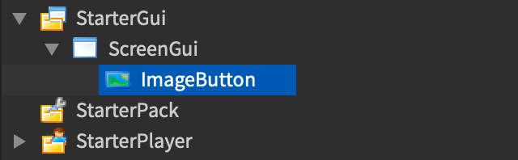

   이렇게 하면 게임 뷰의 모서리에 빈 이미지 버튼이 추가됩니다.

   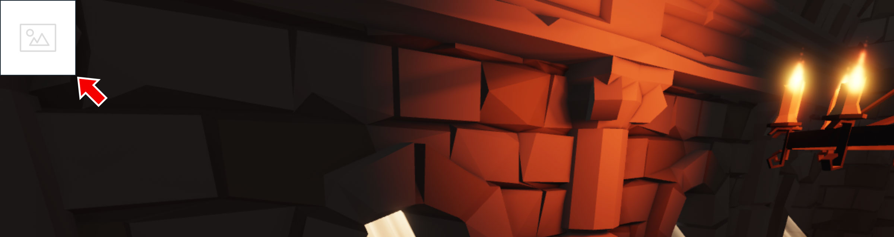

3. 모범 사례로서, 새 버튼의 목적에 따라 이름을 변경합니다. 예를 들어 **MapButton**으로 이름을 변경합니다.

   

### 크기

버튼이 다양한 장치와 화면에서 동적으로 크기를 조정하려면 **Scale** 속성을 사용하는 것이 좋습니다.

1. **속성** 창에서 **Size** 속성을 찾아 화살표를 클릭하여 트리를 확장합니다.

   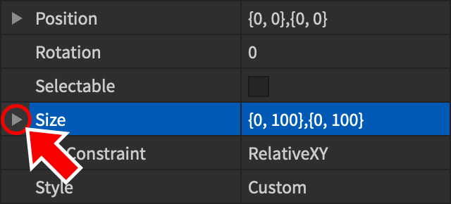

2. 다음 크기 속성을 설정합니다:

   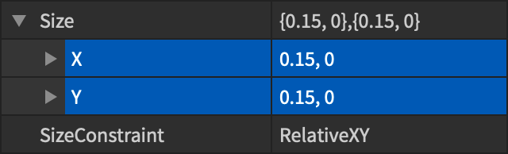

3. **SizeConstraint**를 **RelativeYY**로 설정하여 버튼을 정사각형 경계 상자에 제약합니다.
   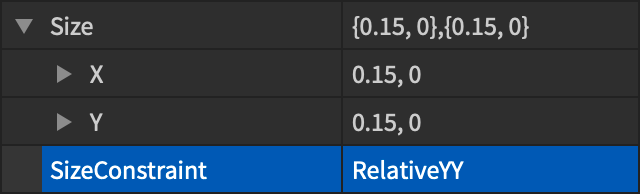

### 크기 조정

현재 크기는 전화기에서 잘 작동할 수 있지만 **X/Y** 스케일 **0.15**(15%)는 컴퓨터 화면에서는 너무 크게 보일 수 있습니다. 이를 수정하려면 `UISizeConstraint`를 추가할 수 있습니다.

1. **MapButton** 객체 위에 마우스를 올리고 **UISizeConstraint**를 삽입합니다.

   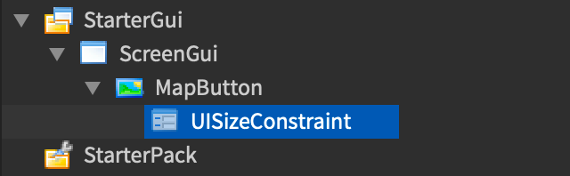

2. 새 크기 제약 객체를 선택하고 **MaxSize** 속성을 **90, 90**으로 설정합니다.

   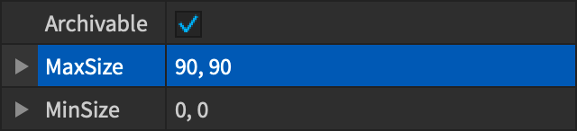

### 위치

버튼은 일반적으로 모바일 장치에서 플레이어의 엄지손가락이 닿는 위치로 이동해야 합니다. 예를 들어 화면의 오른쪽 하단 영역입니다.

1. 버튼의 **AnchorPoint** 속성을 **0.5, 1**로 변경하여 위치가 하단 중앙 기준으로 설정되도록 합니다.

   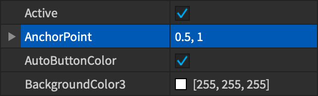

2. 버튼의 **Position** 트리를 확장하고 다음 속성 값을 설정합니다. 이렇게 하면 버튼이 전화기/태블릿에서 기본 점프 버튼 근처로 이동합니다.

   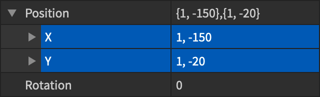

   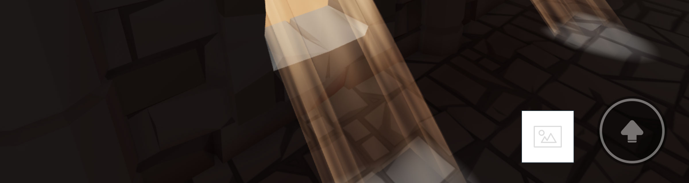

### 이미지

이 버튼은 세 가지 사용자 정의 이미지가 필요합니다 — 화면의 일반적인 모양, 호버링 시 모양, 플레이어가 누를 때의 최종 이미지.

<!-- <Grid container spacing={4}>
    <Grid item xs={4}>
      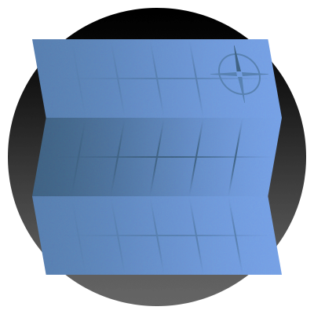
      <h4>일반</h4>
    </Grid>
    <Grid item xs={4}>
      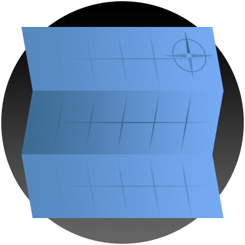
      <h4>호버</h4>
    </Grid>
    <Grid item xs={4}>
      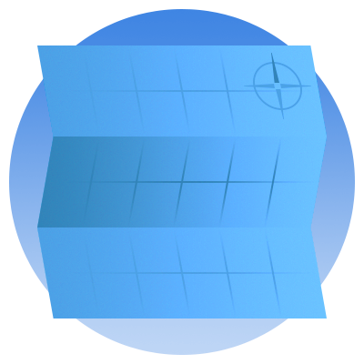
      <h4>누름</h4>
    </Grid>
</Grid> -->

||||
|---|---|---|
|일반|호버|누름|

이 모양을 설정하는 것은 **Image**, **HoverImage**, **PressedImage** 속성을 통해 수행할 수 있습니다.

1. 버튼의 **Image** 속성을 찾아 `rbxassetid://6025368017`을 붙여넣거나 [자신의 에셋을 사용](https://create.roblox.com/docs/production/creator-store)합니다.

   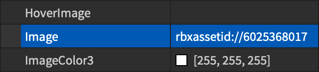

2. **HoverImage** 속성에는 `rbxassetid://6025452347`을 붙여넣습니다.

   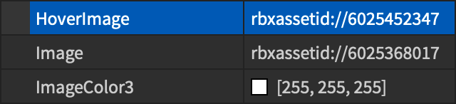

3. **PressedImage** 속성에는 `rbxassetid://6025454897`을 붙여넣습니다.

   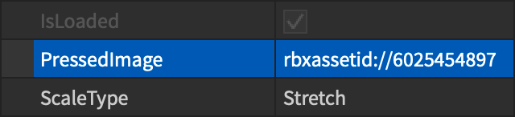

### 스타일링

버튼의 화면상 외관을 최종적으로 조정하려면 다음과 같은 조정을 합니다:

1. **BackgroundTransparency**를 **1**로 설정하여 배경을 투명하게 만듭니다.

   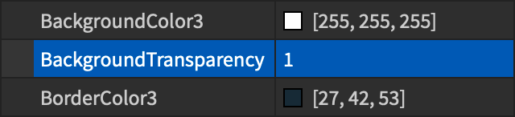

   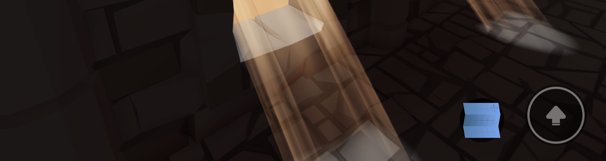

2. **Rotation**을 **-5**로 설정하여 버튼을 약간 회전시킵니다.

   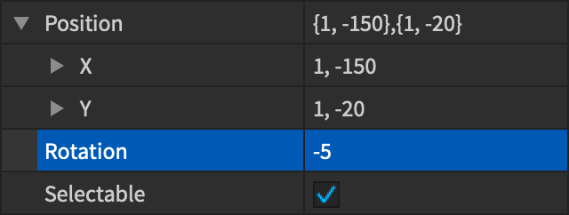

   

## 버튼 기능

마지막 작업은 기본 버튼 기능을 연결하는 것입니다.

1. 탐색기 창에서 **MapButton** 객체 위에 마우스를 올리고 **LocalScript**를 삽입합니다.

   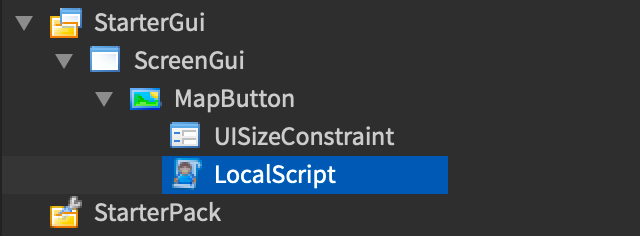

2. 스크립트에 다음 새 줄을 복사하여 붙여넣습니다:

   ```lua
   local button = script.Parent

   local function onButtonActivated()
   	print("Button activated!")
   	-- 여기에서 예상되는 버튼 동작을 수행합니다
   end

   button.Activated:Connect(onButtonActivated)
   ```

이 간단한 버튼 스크립트는 다음과 같이 작동합니다:

- 첫 번째 줄은 변수 button을 설정하여 스크립트가 연결된 특정 객체를 알려줍니다. 이 경우 스크립트의 부모인 `ImageButton`에 연결됩니다.
- `onButtonActivated` 함수는 버튼의 활성화를 처리합니다. 이 함수 내에서 게임의 메인 메뉴를 여는 등의 의도된 동작을 수행해야 합니다.
- 마지막 줄은 `Activated` 이벤트와 함께 버튼을 `onButtonActivated` 함수에 연결합니다. 이를 통해 플레이어가 게임 내에서 버튼을 활성화할 때마다 함수가 실행됩니다.

<Alert severity="info">
여러 `events`가 버튼에 연결될 수 있지만, `Activated` 이벤트는 PC, 전화기/태블릿, 콘솔 등 모든 플랫폼에서 표준 버튼 동작을 제공하므로 기본 버튼에 가장 신뢰할 수 있는 이벤트입니다.
</Alert>

### 문제 해결

버튼이 예상대로 작동하지 않는 경우 다음을 확인하십시오:

- 클라이언트 측 `LocalScript`를 사용했는지, 서버 측 `Script`를 사용하지 않았는지 확인하십시오.
- `LocalScript`가 버튼 객체의 **직접 자식**인지 확인하십시오 (`ScreenGui` 컨테이너의 자식이 아닌).
- 버튼의 **Image**, **HoverImage**, **PressedImage** 속성이 적절한 이미지 자산으로 설정되었는지 확인하십시오.

---
## 출처
 - [Interactive Buttons](https://create.roblox.com/docs/tutorials/building/ui/interactive-buttons)

---
## [다음](./04_03_Adding_Proximity_Prompts.md)