# Adding Proximity Prompts

## 목차
- [Adding Proximity Prompts](#adding-proximity-prompts)
  - [목차](#목차)
  - [프롬프트 만들기](#프롬프트-만들기)
    - [프롬프트 외관](#프롬프트-외관)
    - [활성화 거리](#활성화-거리)
    - [유지 시간](#유지-시간)
  - [동작 구현](#동작-구현)
  - [출처](#출처)
  - [다음](#다음)

---

사용자가 3D 공간에서 객체에 접근할 때 나타나며 사용자 입력에 따라 동작을 트리거하는 인터랙티브 근접 프롬프트를 만들 수 있습니다.

<video controls muted>
    <source src="../img/04_03_Adding_Proximity_Prompts/PromptsShowcase.mp4" />
</video>

이 튜토리얼은 [Dungeon Delve](https://www.roblox.com/games/6749940622/Dungeon-Delve-Learn) 프로젝트를 쇼케이스로 사용합니다. 진행하기 전에 Studio에서 해당 프로젝트를 열어 따라 해 보세요.

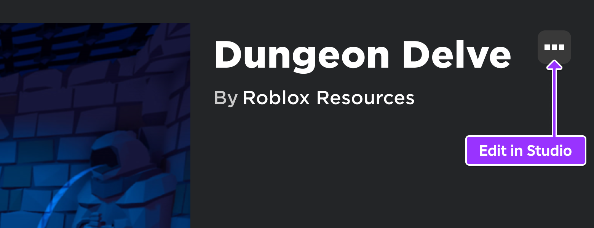

## 프롬프트 만들기

화면상의 프롬프트는 `Attachment`, `BasePart`, 또는 `Model`에 부모로 설정된 `ProximityPrompt` 객체에 의해 생성됩니다.

1. 3D 뷰 또는 탐색기에서 **PrisonDoor** 모델을 선택합니다 (**Workspace** &rarr; **PromptObjects** &rarr; **PrisonDoor**).

   <GridContainer numColumns="2">
     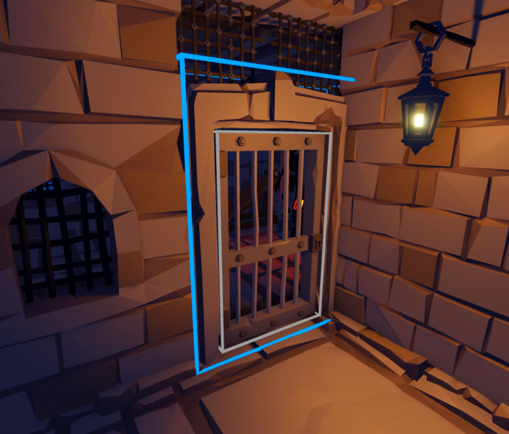
     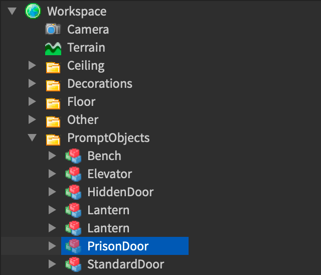
   </GridContainer>

2. 트리를 확장하여 **Door** 객체를 선택합니다.

   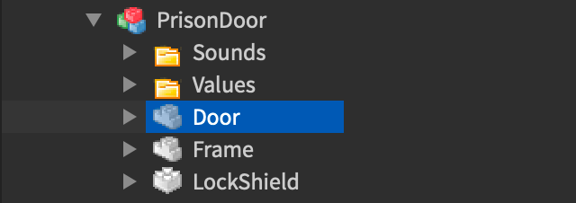

3. 프롬프트를 `Attachment`에 배치하면 상호작용 지점을 더 세밀하게 조정할 수 있습니다. 새 **Attachment**를 삽입하고 **PromptAttachment**로 이름을 변경합니다.

   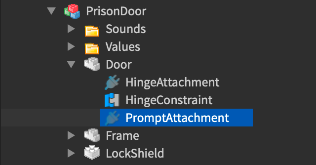

4. 새 Attachment의 **Position** 속성을 **-2.25**, **-0.5**, **-0.5**로 설정합니다. 이렇게 하면 문 열쇠 구멍 앞쪽으로 이동하게 됩니다.

   <GridContainer numColumns="2">
     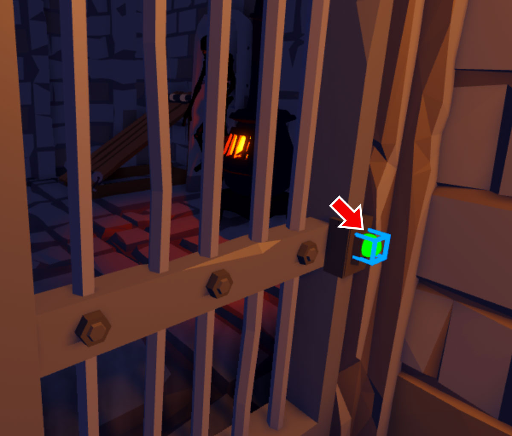
     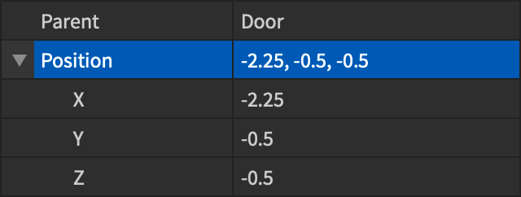
   </GridContainer>

5. **PromptAttachment** 위에 마우스를 올리고 새 **ProximityPrompt** 객체를 삽입합니다.

   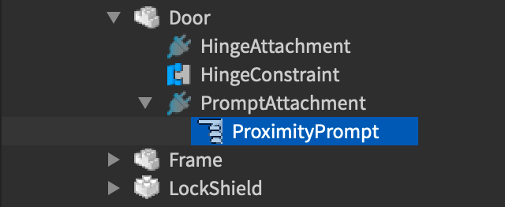

### 프롬프트 외관

프롬프트는 세 가지 주요 요소로 구성되며, 각각 다음 속성으로 제어할 수 있습니다:

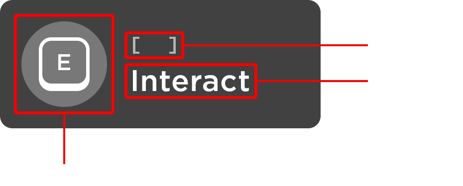

- **ObjectText** &mdash; 상호작용하는 객체의 선택적 이름.
- **ActionText** &mdash; 사용자에게 표시되는 선택적 액션 이름.
- **KeyboardKeyCode** &mdash; 프롬프트를 트리거할 키보드 키.
- **GamepadKeyCode** &mdash; 프롬프트를 트리거할 게임패드 버튼.

감옥 문 프롬프트의 외관을 사용자 정의하려면 다음 변경 사항을 적용합니다:

1. 속성 창에서 **ObjectText** 속성을 찾아 **Door**를 입력합니다.

   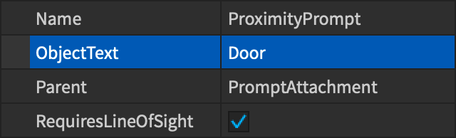

2. **ActionText** 속성에는 **Pick Lock**을 입력합니다.

   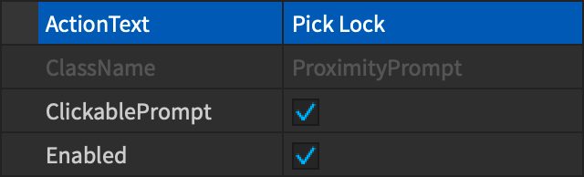

### 활성화 거리

프롬프트는 사용자의 **캐릭터**가 프롬프트 객체 부모의 정의된 **MaxActivationDistance** 범위 내로 이동할 때 나타납니다.

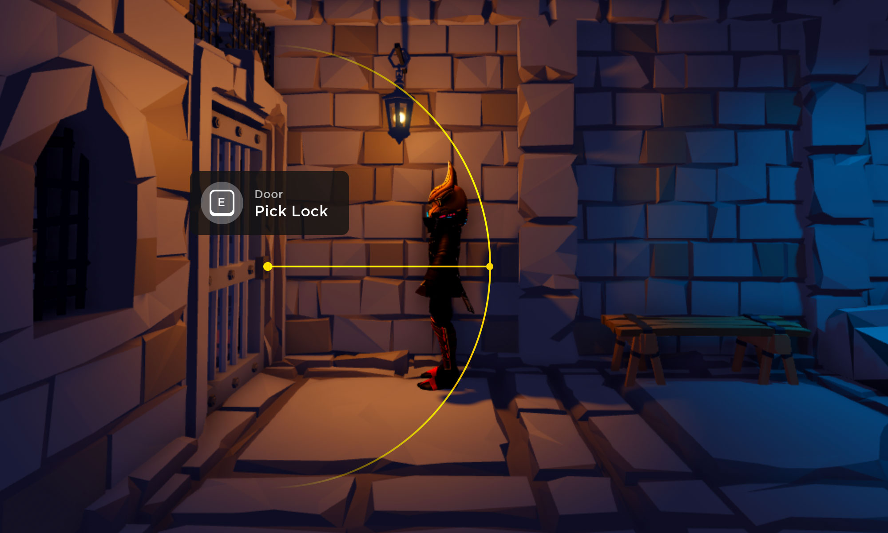

기본값은 대부분의 경우 잘 작동하지만, **MaxActivationDistance**를 **4**로 변경하여 사용자 상호작용을 자물쇠에 더 가깝게 조정할 수 있습니다.

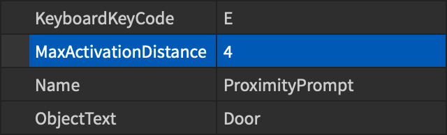

### 유지 시간

**HoldDuration** 속성 값은 프롬프트의 액션이 트리거되는 시간을 초 단위로 결정합니다. 이 문은 열기 위해 잠금을 해제해야 하므로 **HoldDuration** 속성을 **4**로 변경합니다.

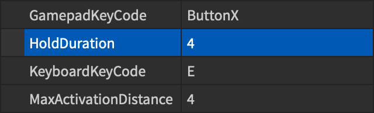

<video controls loop muted>
    <source src="../img/04_03_Adding_Proximity_Prompts/HoldDuration.mp4" />
</video>

## 동작 구현

프롬프트 이벤트를 감지하는 가장 좋은 방법은 `ProximityPromptService`를 통해 하는 것입니다. 이를 통해 각 프롬프트 객체에 스크립트를 연결하지 않고 중앙에서 이벤트를 감지할 수 있습니다.

기본 프레임워크는 다음과 같습니다:

```lua
local ProximityPromptService = game:GetService("ProximityPromptService")

-- 프롬프트가 트리거될 때 감지
local function onPromptTriggered(promptObject, player)

end

-- 프롬프트 홀드가 시작될 때 감지
local function onPromptHoldBegan(promptObject, player)

end

-- 프롬프트 홀드가 끝날 때 감지
local function onPromptHoldEnded(promptObject, player)

end

-- 프롬프트 이벤트를 처리 함수에 연결
ProximityPromptService.PromptTriggered:Connect(onPromptTriggered)
ProximityPromptService.PromptButtonHoldBegan:Connect(onPromptHoldBegan)
ProximityPromptService.PromptButtonHoldEnded:Connect(onPromptHoldEnded)
```

<table>
    <thead>
        <tr>
            <th>이벤트</th>
            <th>설명</th>
        </tr>
    </thead>
    <tbody>
        <tr>
            <td>`PromptTriggered`</td>
            <td>사용자가 프롬프트와 상호작용할 때 발생합니다 (`HoldDuration`이 0이 아닌 경우 <b>후에</b>).</td>
        </tr>
        <tr>
            <td>`PromptButtonHoldBegan`</td>
            <td>사용자가 `HoldDuration`이 0이 아닌 프롬프트와 상호작용을 시작할 때 발생합니다.</td>
        </tr>
        <tr>
            <td>`PromptButtonHoldEnded`</td>
            <td>사용자가 `HoldDuration`이 0이 아닌 프롬프트와의 상호작용을 중단할 때 발생합니다.</td>
        </tr>
    </tbody>
</table>

[Dungeon Delve](https://www.roblox.com/games/6749940622/Dungeon-Delve-Learn) 프로젝트에서는 이러한 이벤트가 **ServerScriptService** 내의 **PromptEvents** 스크립트에 의해 관리됩니다.

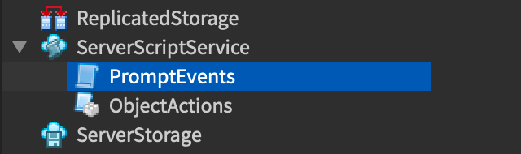

스크립트 내부에서 위 이벤트는 **ServerScriptService**에 있는 **ObjectActions** `ModuleScript` 내의 함수를 호출합니다.

```lua
local ProximityPromptService = game:GetService("ProximityPromptService")
local ServerScriptService = game:GetService("ServerScriptService")

local ObjectActions = require(ServerScriptService.ObjectActions)

-- 프롬프트가 트리거될 때 감지
local function onPromptTriggered(promptObject, player)
	ObjectActions.promptTriggeredActions(promptObject, player)
end

-- 프롬프트 홀드가 시작될 때 감지
local function onPromptHoldBegan(promptObject, player)
	ObjectActions.promptHoldBeganActions(promptObject, player)
end

-- 프롬프트 홀드가 끝날 때 감지
local function onPromptHoldEnded(promptObject, player)
	ObjectActions.promptHoldEndedActions(promptObject, player)
end

-- 프롬프트 이벤트를 처리 함수에 연결
ProximityPromptService.PromptTriggered:Connect(onPromptTriggered)
ProximityPromptService.PromptButtonHoldBegan:Connect(onPromptHoldBegan)
ProximityPromptService.PromptButtonHoldEnded:Connect(onPromptHoldEnded)
```

근접 프롬프트는 게임 내 객체 상호작용을 위한 편리하고 사용자 정의 가능한 솔루션입니다. `ProximityPrompt` 및 `ProximityPromptService` 참조 페이지를 확인하여 프롬프트 동작을 제어하는 더 많은 방법을 알아보고, [Dungeon Delve](https://www.roblox.com/games/6749940622/Dungeon-Delve-Learn)에서 다른 인터랙티브 객체를 탐색하여 창의적인 영감을 얻어보세요.

---
## 출처
 - [Adding Proximity Prompts](https://create.roblox.com/docs/tutorials/building/ui/proximity-prompts)

---
## [다음](./04_04_Interfaces_on_Parts.md)