# Interfaces on Parts

## 목차
- [Interfaces on Parts](#interfaces-on-parts)
  - [목차](#목차)
  - [서피스 GUI 만들기](#서피스-gui-만들기)
  - [GUI 조정](#gui-조정)
    - [면](#면)
    - [크기](#크기)
    - [스타일링](#스타일링)
  - [콘텐츠 추가](#콘텐츠-추가)
  - [SurfaceGui 속성](#surfacegui-속성)
    - [LightInfluence](#lightinfluence)
    - [Adornee](#adornee)
  - [출처](#출처)
  - [다음](#다음)

---

`SurfaceGui` 객체를 사용하면 3D 세계의 표면에 GUI 콘텐츠를 표시할 수 있습니다. 일반적으로 리더보드를 표시하거나 3D 공간의 영역을 안내하는 데 사용됩니다. 이 튜토리얼에서는 롱소드 통계에 대한 정보 게시판을 만드는 방법을 보여줍니다.

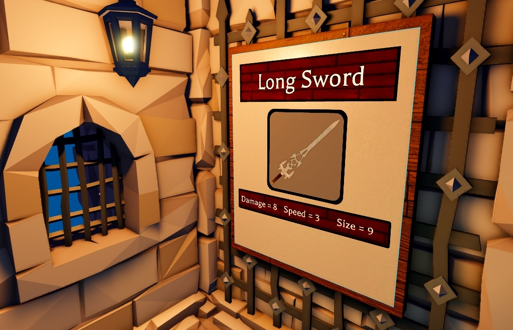

## 서피스 GUI 만들기

1. **InfoBoard**라는 이름의 파트를 만듭니다.

2. 파트의 **Size**를 **15, 18, 1**로 변경합니다.

   <GridContainer numColumns="2">
     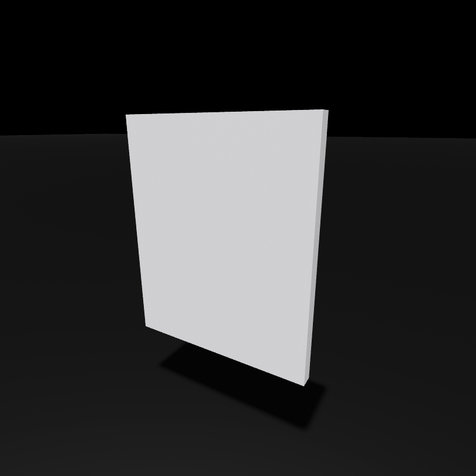
     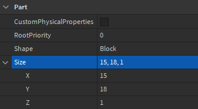
   </GridContainer>

3. 파트에 **SurfaceGui**를 삽입하고 **InfoSurfaceGui**로 이름을 변경합니다.

4. GUI에 `Frame`을 삽입하고 **BackgroundFrame**으로 이름을 지정합니다. 이는 정보가 표시될 배경입니다.

   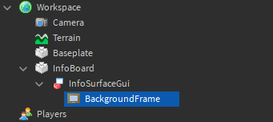

## GUI 조정

### 면

`Face` 속성은 SurfaceGui가 표시될 파트의 면을 결정합니다. 올바른 면이 선택되면 **BackgroundFrame** 객체가 작은 흰색 사각형으로 표면에 나타납니다.

- **InfoSurfaceGui**의 **Face** 속성을 **Front**로 설정합니다.

  <GridContainer numColumns="2">
    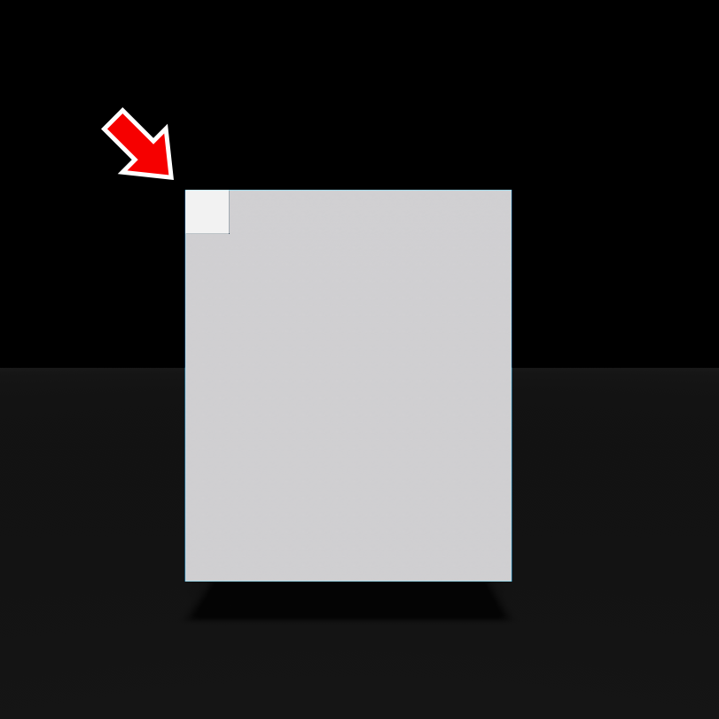
    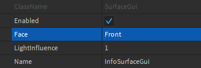
  </GridContainer>

<Alert severity="warning">
면을 선택한 후에도 프레임이 보이지 않으면 파트가 잘못된 방향을 가리키고 있을 수 있습니다. 파트를 회전시키거나 다른 면을 선택해보세요.
</Alert>

### 크기

프레임이 전체 면을 덮도록 하려면 **Size** 속성을 조정해야 합니다.

- **BackgroundFrame**의 **Size** 속성을 **1, 0, 1, 0**으로 설정하여 선택한 면 전체를 덮도록 합니다.

  <GridContainer numColumns="2">
    
    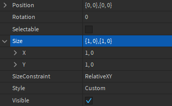
  </GridContainer>

### 스타일링

GUI 객체와 그 내용물의 테두리 사이에 간격을 만들기 위해 `UIPadding` 제약 조건을 추가하는 것이 좋습니다.

1. **InfoSurfaceGui**에 **UIPadding** 제약 조건을 삽입합니다.

   

2. **PaddingBottom**, **PaddingLeft**, **PaddingRight** 및 **PaddingTop** 속성을 **0.05, 0**으로 설정하여 프레임 주위에 테두리를 만듭니다.

   <GridContainer numColumns="2">
     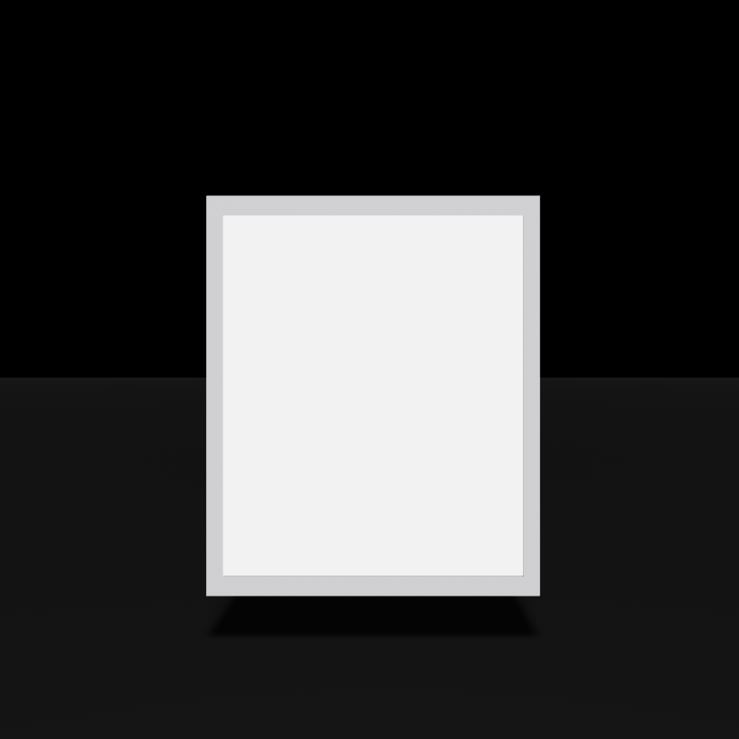
     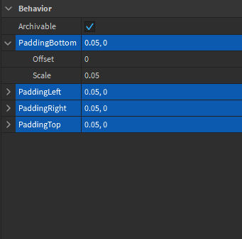
   </GridContainer>

3. **BackgroundFrame**의 **BackgroundTransparency** 속성을 **1**로 설정합니다.

   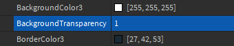

## 콘텐츠 추가

이전 UI 튜토리얼에서 배운 기술을 사용하여 **BackgroundFrame** 내에 정보를 표시할 수 있습니다. 다음은 프레임의 예제 콘텐츠입니다:

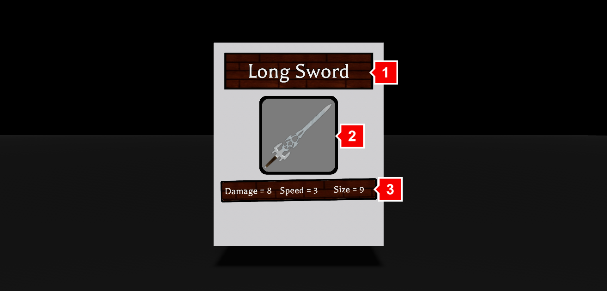

<table>
    <thead>
        <tr>
            <th>객체</th>
            <th>설명</th>
        </tr>
    </thead>
    <tbody>
        <tr>
            <td><b>1</b></td>
            <td> 항목 이름을 표시하기 위한 `TextLabel`과 아래에 나무 판자를 표시하는 `ImageLabel`.</td>
        </tr>
        <tr>
            <td><b>2</b></td>
            <td>항목 이미지를 표시하기 위한 ImageLabel과 회색 BackgroundColor3 값. 각 모서리에 둥근 가장자리를 적용하기 위한 `UICorner` 제약 조건.</td>
        </tr>
        <tr>
            <td><b>3</b></td>
            <td>세 개의 TextLabel을 포함하는 프레임으로, `UIListLayout` 제약 조건을 사용하여 수평 순서로 배치됩니다. 자세한 내용은 <a href="https://create.roblox.com/docs/tutorials/building/ui/creating-a-score-bar">점수 막대 만들기</a>를 참조하세요.</td>
        </tr>
    </tbody>
</table>

## SurfaceGui 속성

이제 완료된 SurfaceGui가 있으므로 다음 속성을 변경하여 그 효과를 확인해보세요.

### LightInfluence

서피스 GUI는 3D 세계에 존재하기 때문에 다른 객체와 마찬가지로 빛의 영향을 받을 수 있습니다. `Class.SurfaceGui.LightInfluence|LightInfluence` 속성은 SurfaceGui가 빛의 영향을 받는 정도를 제어합니다. 일반 값은 1로, GUI 공간이 주변 객체와 동일하게 조명됩니다. 0으로 설정하면 내부 이미지는 설계한 대로 조명이 유지됩니다. 이는 어두운 환경에서도 밝게 빛나는 네온 사인을 만들 때 유용할 수 있습니다.

<video controls loop muted>
  <source src="../img/04_04_Interfaces_on_Parts/Video-Light-Influence.mp4" />
</video>

### Adornee

SurfaceGui가 표시되는 파트는 **Adornee** 속성에 의해 결정됩니다. 비어 있으면 자동으로 부모 파트에 표시됩니다. `Adornee`를 설정하면 GUI가 파트에 부모로 설정되지 않았을 때도 인터랙티브 [버튼](https://create.roblox.com/docs/tutorials/building/ui/interactive-buttons)을 만들 수 있습니다. SurfaceGui를 파트에 장식하려면:

1. SurfaceGui를 `StarterGui`로 드래그합니다.

2. Adornee 입력 상자를 클릭한 다음 보드 파트를 클릭하여 파트에 장식합니다.

<video controls loop muted>
  <source src="../img/04_04_Interfaces_on_Parts/Video-Adornee.mp4" />
</video>

---
## 출처
 - [Interfaces on Parts](https://create.roblox.com/docs/tutorials/building/ui/interfaces-on-parts)

---
## [다음](./05_01_Building_a_Hinged_Door.md)