# Building a Hinged Door

## 목차
- [Building a Hinged Door](#building-a-hinged-door)
  - [목차](#목차)
  - [문 설정](#문-설정)
  - [부속품 이동](#부속품-이동)
  - [부속품 회전](#부속품-회전)
  - [제약 조건 추가](#제약-조건-추가)
  - [문 조정](#문-조정)
  - [출처](#출처)
  - [다음](#다음)

---

Roblox의 물리 시스템을 사용하면 **제약 조건**을 사용하여 문, 회전 플랫폼, 차량과 같은 이동 메커니즘을 구성할 수 있습니다. 예를 들어, `HingeConstraint`를 사용하여 스윙 도어를 만들 수 있습니다.

<!-- <video controls loop muted>
   <source src="../img/05_01_Building_a_Hinged_Door/introToConstraints_finalExample.mp4" />
</video> -->

## 문 설정

먼저 문과 그 부속품을 만들기 위한 부품을 만듭니다. **Attachments**는 한 객체가 다른 객체와 연결될 수 있는 위치입니다. 이러한 부속품은 나중에 경첩으로 문을 프레임에 연결하는 데 사용됩니다.

1. **Door**와 **DoorFrame**과 같은 이름으로 두 부품을 만듭니다.

   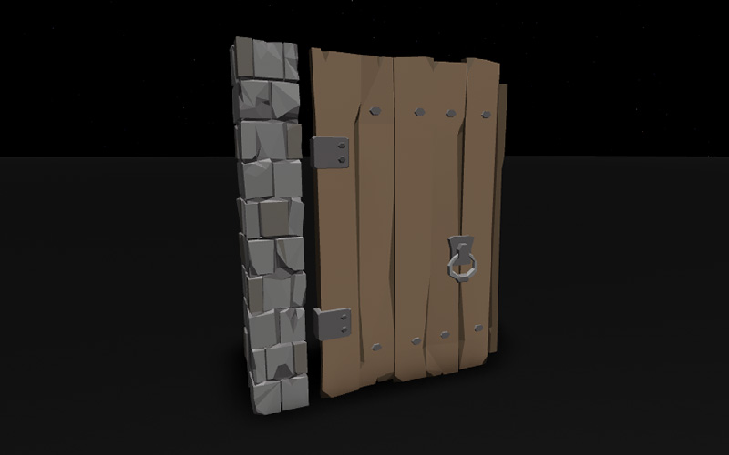

2. **DoorFrame**을 선택합니다. 속성에서 **Anchored**를 활성화하여 움직이지 않도록 설정합니다.

   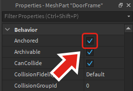

3. 탐색기에서 **DoorFrame** 위로 마우스를 올리고 새 **Attachment**를 추가합니다. **Door**에도 동일한 방법으로 부속품을 추가합니다.

   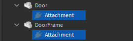

4. 부속품의 이름을 **DoorAttachment**와 **FrameAttachment**와 같이 부착된 객체를 나타내도록 변경합니다.

   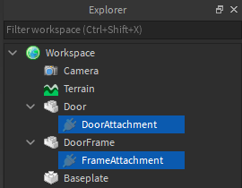

## 부속품 이동

새로운 부속품은 부품의 중심에 생성됩니다. 문과 함께 작동하도록 하려면 두 부속품을 서로 마주 보도록 이동해야 합니다.

1. 제약 조건과 부속품을 보려면 **Model** 탭에서 **Constraint Details**를 활성화합니다.

   

2. 탐색기에서 **FrameAttachment**를 선택합니다.

   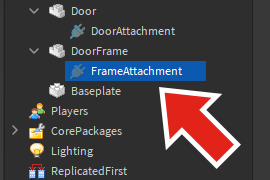

3. <kbd>F</kbd> 키를 눌러 부속품에 초점을 맞추고 필요에 따라 확대합니다. 그런 다음 **Move** 도구를 사용하여 부속품을 도어 프레임의 표면에 문을 향해 위치시킵니다.

   <!-- <video controls loop muted>
      <source src="../img/05_01_Building_a_Hinged_Door/introToConstraints_showMoveAttachment.mp4" />
   </video> -->
   

   
   부속품을 정확하게 정렬하는 것이 좋습니다. 부정확하게 정렬된 부속품은 문이 올바르게 회전하지 않게 할 수 있습니다. 정확한 위치를 위해 **Snap to Grid**를 사용하고 파트 크기에 맞는 증분을 설정하십시오. 또는 속성 창에서 부속품의 위치를 편집하십시오.
   

4. 동일한 방법으로 **DoorAttachment**를 이동합니다. 부속품이 서로 마주 보도록 표면에 위치해야 합니다.

<figure>
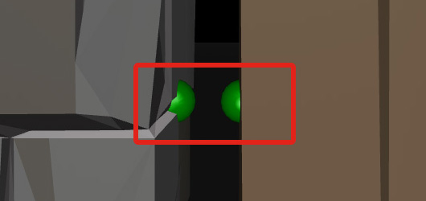
<figcaption><b>왼쪽</b>: FrameAttachment / <b>오른쪽</b>: DoorAttachment</figcaption>
</figure>

## 부속품 회전

부속품의 방향은 제약 조건의 움직임에 영향을 미칩니다. 문의 경우, 두 부속품이 일반 문처럼 좌우로 회전하도록 회전해야 합니다.

1. 도어 프레임에서 **FrameAttachment** 위로 마우스를 올립니다. **노란색 화살표**가 보입니다. 이 화살표는 **축**으로, 경첩의 회전을 결정합니다.

   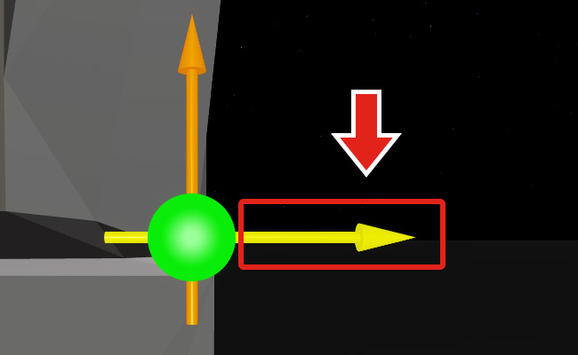

   
   **DoorFrame** 객체에 따라 축이 다른 방향을 가리킬 수 있습니다. 위에 표시된 부속품에 추가된 경첩은 아래 동영상처럼 노란색 화살표를 중심으로 회전합니다.

   <!-- <video controls loop muted>
      <source src="../img/05_01_Building_a_Hinged_Door/introToConstraints_doorSwingingWrong.mp4" />
   </video> -->
   
   

2. 정확한 회전을 위해 **Model** → **Snap to Grid**에서 스냅을 켜고 **Rotate**를 체크합니다. 값을 `90`으로 설정합니다.

   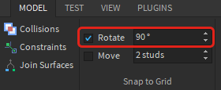

3. **Rotate** 도구를 사용하여 **두** 노란색 부속품을 **위로** 향하도록 회전시킵니다. 축이 이미 수직이면 아무 조치도 필요하지 않습니다.

   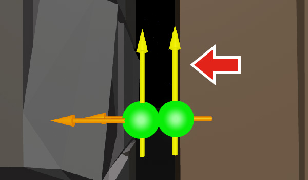

## 제약 조건 추가

제약 조건은 두 부속품을 특정 방식으로 움직이도록 연결하는 방법입니다. 이 문은 `HingeConstraint`를 사용하여 두 부속품의 축을 따라 객체를 회전시키는 일반적인 제약 조건을 사용합니다.

1. **DoorFrame** 아래에 새 **HingeConstraint**를 만듭니다.

   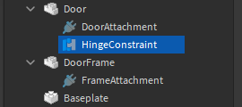

2. 제약 조건의 속성에서 **Attachment0**를 찾습니다. 속성 오른쪽의 빈 상자를 클릭한 다음, 탐색기에서 **DoorAttachment**를 클릭합니다.

   <!-- <video controls muted>
      <source src="../img/05_01_Building_a_Hinged_Door/introToConstraints_selectAttachment0.mp4" />
   </video> -->
   

3. 동일한 방법으로 **Attachment1**을 **FrameAttachment**에 연결합니다. 속성이 아래와 같이 나타납니다.

   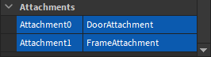

4. 캐릭터로 문에 걸어 들어가 프로젝트를 테스트합니다.

   <!-- <video controls loop muted>
      <source src="../img/05_01_Building_a_Hinged_Door/introToConstraints_finalDoor.mp4" />
   </video> -->
   

   <Alert severity="warning">
   테스트 시 다음 문제에 직면할 수 있습니다:

   **부품이 움직이지 않음:**

   - 문이 고정되어 있지 않은지 확인합니다.
   - 문의 움직임이 지형이나 인근 부품에 의해 차단되지 않았는지 확인합니다.

   **문이 예상대로 회전하지 않음:**

   - 각 부속품의 축이 위쪽을 향하고 있는지 확인합니다 (부속품 회전 참조).
   </Alert>

## 문 조정

현재 문이 문 프레임을 지나서 흔들릴 수 있습니다. 이는 경첩 **제한**을 조정하여 수정할 수 있습니다.

1. **HingeConstraint**의 속성에서 **LimitsEnabled**를 찾아 활성화합니다. 활성화되면 경첩의 회전 제한을 설정할 수 있습니다.

   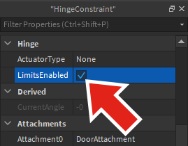

2. 올바른 방향으로 정렬되었는지 확인하려면 **DoorAttachment**를 선택하고 회전 도구를 사용하여 주황색 화살표가 문 프레임을 향하도록 설정합니다.

   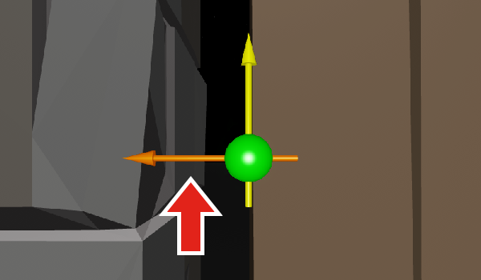

   <Alert severity="warning">
   노란 축 화살표가 경첩의 회전축에 영향을 미친다는 점을 기억하세요. 제한은 주황색 축 화살표에 영향을 받습니다.
   </Alert>

3. 속성의 **Limits** 섹션에서 LowerAngle과 UpperAngle을 각각 -90과 90으로 설정합니다. 이는 아래 왼쪽 이미지와 같은 움직임 범위를 생성합니다.

   <GridContainer numColumns="2">
     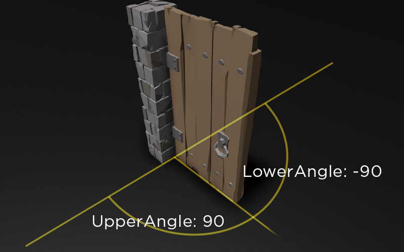
     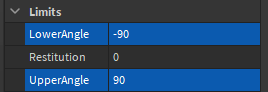
   </GridContainer>

4. 문을 테스트하고 경첩이 제한된 것을 확인합니다.

   <!-- <video controls loop muted>
      <source src="../img/05_01_Building_a_Hinged_Door/introToConstraints_finalDoor_WithLimits.mp4" />
   </video> -->
   

   <Alert severity="warning">
   문 제한이 예상대로 작동하지 않으면, 부속품의 주황색 축이 제대로 정렬되지 않았을 수 있습니다. DoorAttachment를 선택하고 아래 이미지처럼 초록색 평면이 문 프레임을 향하도록 합니다.

   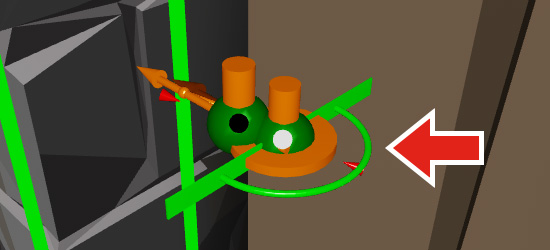
   </Alert>

문이 완성되면 경첩 제약 조건을 사용하여 함정 문

이나 흔들리는 도끼 함정과 같은 다양한 상황에서 사용해 보세요.

---
## 출처
 - [Building a Hinged Door](https://create.roblox.com/docs/tutorials/building/physics/building-a-hinged-door)

---
## [다음](./05_02_Building_a_Ferris_Wheel.md)