# Building a Ferris Wheel

## 목차
- [Building a Ferris Wheel](#building-a-ferris-wheel)
  - [목차](#목차)
  - [대관람차 설정](#대관람차-설정)
  - [부착물 추가](#부착물-추가)
  - [HingeConstraint 만들기](#hingeconstraint-만들기)
  - [모터로 변경](#모터로-변경)
  - [출처](#출처)
  - [다음](#다음)

---

지난 강의에서는 `HingeConstraints`를 사용하여 문을 만드는 방법을 배웠습니다. Roblox의 많은 장치들은 더 복잡한 메커니즘을 만들기 위해 여러 제약 조건을 사용합니다. 특히 여러 제약 조건을 **구동**하도록 구성할 수 있습니다. 이는 스스로 움직이게 하는 것을 의미합니다. 이 튜토리얼에서는 `HingeConstraint`를 **모터**로 구동하여 대관람차를 만드는 방법을 보여줍니다.

<video controls loop muted>
    <source src="../img/05_02_Building_a_Ferris_Wheel/ferrisWheel-inContext.mp4" />
</video>

## 대관람차 설정

1. [이 모델](https://www.roblox.com/library/6448931648/FerrisWheel) 또는 [미리 구축된 장소](https://www.roblox.com/games/6448937909/Ferris-Wheel)를 사용하여 장소에 대관람차를 추가합니다.

   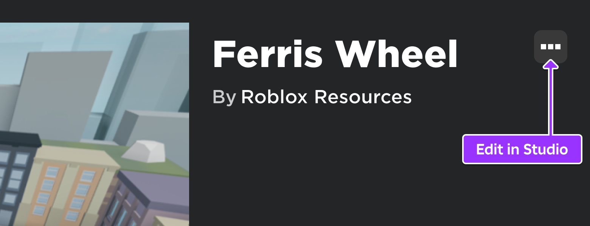

2. 제약 조건과 부착물을 보려면 **모델** 탭에서 **제약 조건 세부 정보**를 켭니다.

   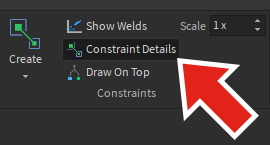

## 부착물 추가

대관람차가 회전할 위치를 결정하기 위해 부착물을 추가해야 합니다. 부착물 작업을 할 때, 부착물의 위치와 방향을 명확하게 보기 위해 작업할 조각들을 분리하는 것이 도움이 됩니다.

1. 탐색기에서 **FerrisWheel**을 확장하고 **MainSupport** 모델을 선택한 다음, 휠 축과 지지대 축의 측면을 볼 수 있도록 이동합니다.

   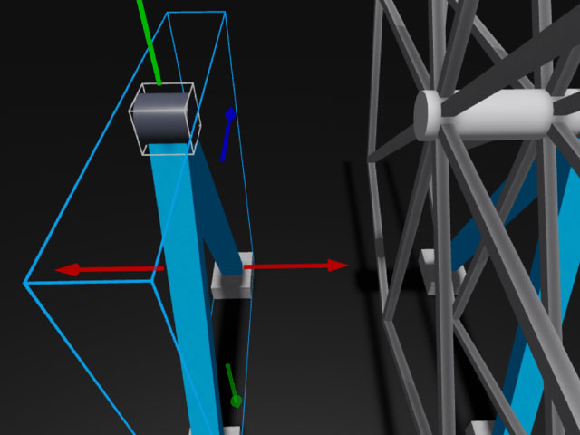

2. MainSupport를 확장하고 **SupportAxle**을 선택합니다. 부착물을 추가하고 이름을 **SupportAttachment**로 변경합니다.

   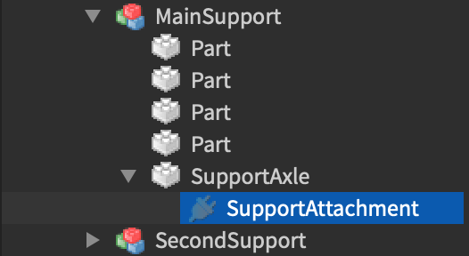

3. **SupportAttachment**를 **SupportAxle**의 내부 가장자리에 배치합니다.

   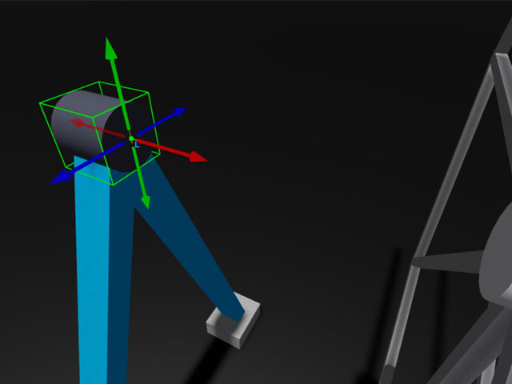

4. FerrisWheel에서 **WheelAxle**을 선택하고 **WheelAttachment**라는 새로운 부착물을 추가합니다.

   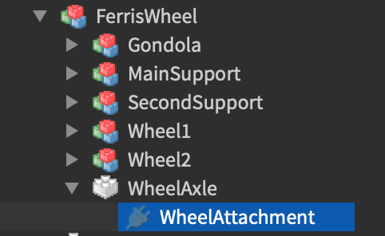

5. **WheelAttachment**를 축의 가장자리로 이동합니다. **SupportAttachment**를 배치한 지지대 쪽을 향하도록 합니다.

   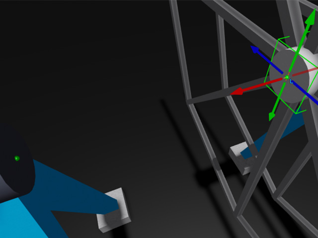

6. 부착물 위로 마우스를 올리면 노란색과 주황색 화살표가 나타나는 것을 볼 수 있습니다. 두 부착물의 노란색 화살표가 동일한 방향을 가리키고 있는지 확인합니다. 그렇지 않다면 **회전** 도구를 사용하여 동일한 방향을 가리키도록 합니다.

   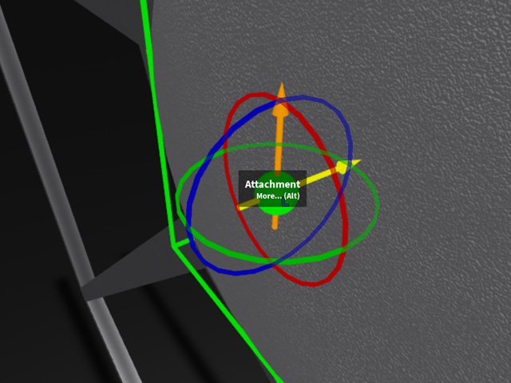

## HingeConstraint 만들기

이제 두 부착물이 제자리에 있으므로, 바퀴의 모터 역할을 할 `HingeConstraint`를 추가할 차례입니다.

1. SupportAxle에 새 **HingeConstraint**를 만들고 이름을 **MainMotor**로 설정합니다.

   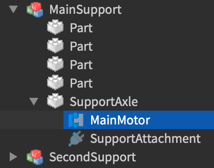

2. **MainMotor**의 속성에서 Attachment0를 SupportAttachment로, Attachment1를 WheelAttachment로 설정합니다.

   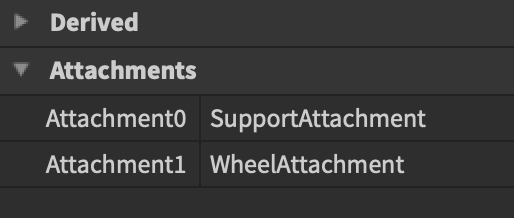

3. **MainSupport** 모델을 선택하고 원래 위치로 되돌립니다.

   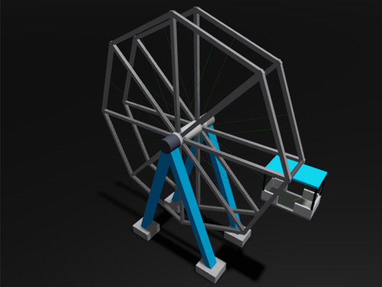

## 모터로 변경

기본적으로 `HingeConstraints`는 연결된 부품을 누르는 사용자 캐릭터와 같은 외부 힘이 작용해야만 회전합니다. `HingeConstraint`가 스스로 회전하도록 만들려면 **모터**로 구성하고 원하는 회전 속도를 설정하며 경첩에 충분한 토크를 제공해야 합니다.

1. **MainMotor**를 선택하고 속성에서 **ActuatorType**을 **Motor**로 변경합니다.

   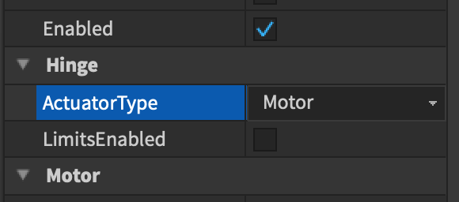

2. **AngularVelocity**를 0.314로 변경합니다.

   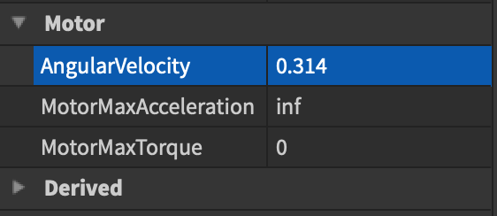

   <Alert severity="info">

   **AngularVelocity** 속성은 모터가 회전하는 속도를 설정하기 위해 **초당 라디안**을 사용합니다. 라디안은 각도를 측정하는 단위입니다. 대부분의 라디안 값은 대략 3.14인 파이(pi)를 기반으로 합니다. 경첩이 얼마나 빨리 또는 천천히 회전하는지 정확히 구성하려면 파이와 관련된 값을 시도하는 것이 좋은 시작점입니다.

   - 초당 1회전 = 2 \* 파이 = 6.28
   - 초당 ½회전 = 파이 = 3.14
   - 초당 ¼회전 = 파이 / 2 = 1.57
   - 초당 1/10회전 = 파이 / 10 = .314

   </Alert>

3. **MotorMaxAcceleration**의 무한대 값을 **MotorMaxTorque**로 복사하여 바퀴가 어떤 무게도 견딜 수 있도록 합니다.

   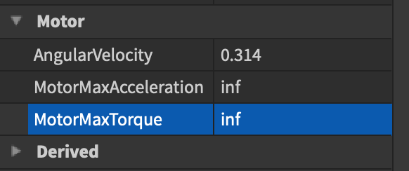

4. **Play**를 선택하여 대관람차 회전 동작을 테스트하고 경험을 확인합니다.

<video controls loop muted>
    <source src="../img/05_02_Building_a_Ferris_Wheel/ferrisWheel-finalExample.mp4" />
</video>

대관람차 바퀴의 한쪽에만 모터가 필요하며, 양쪽에 모터가 필요하지 않음을 주목하세요. 장치로 빌드할 때는 가능한 적은 제약 조건을 사용해 보세요. 이는 장치가 안정적이고 신뢰할 수 있도록 보장합니다.

이제 대관람차를 완전히 구축했으므로, 더 많은 제약 조건을 실험해 보세요. 대관람차에 더 많은 차량을 추가하거나 원래의 장치를 만드는 것을 시도해 볼 수 있습니다.

---
## 출처
 - [Building a Ferris Wheel](https://create.roblox.com/docs/tutorials/building/physics/building-a-ferris-wheel)

---
## [다음](./05_03_Creating_Moving_Objects.md)