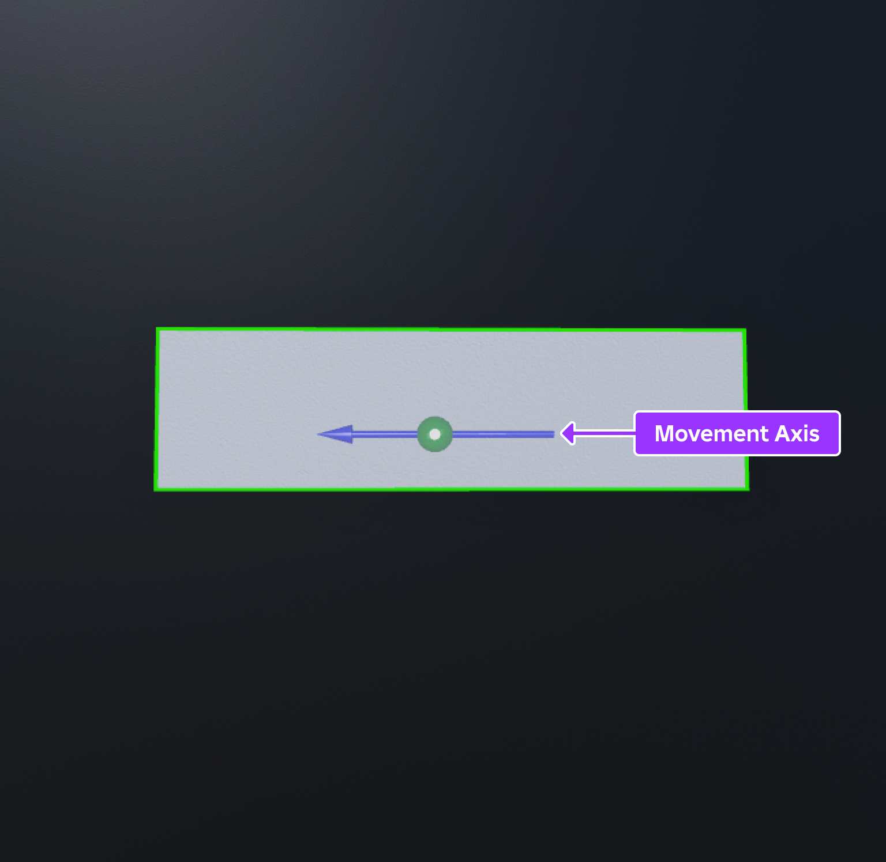
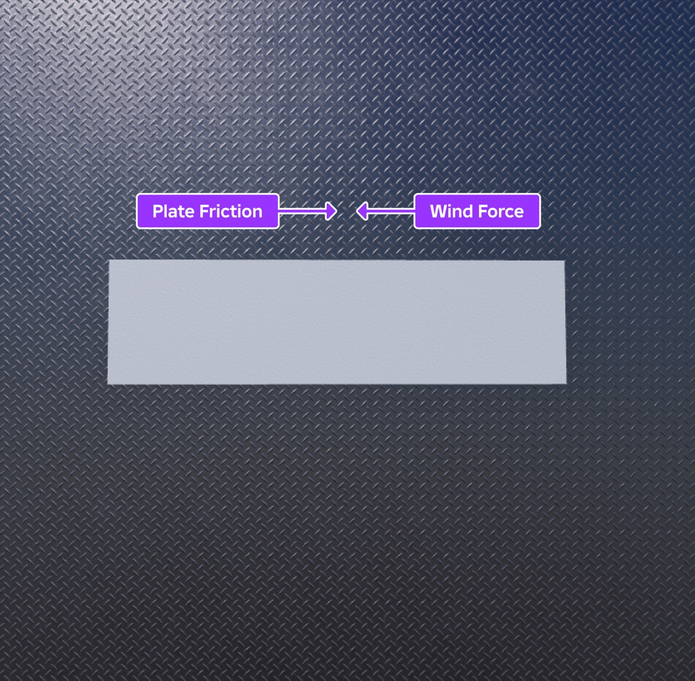
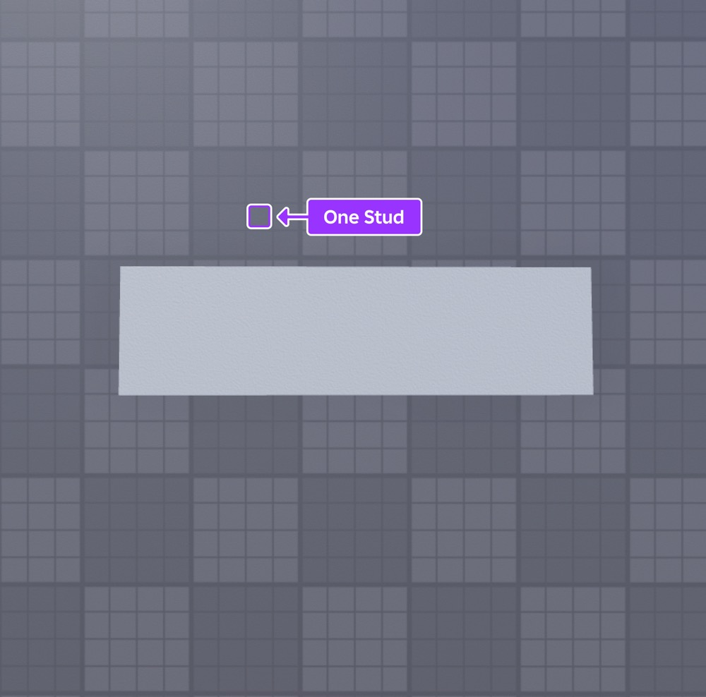
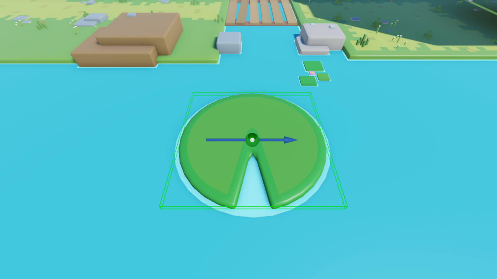
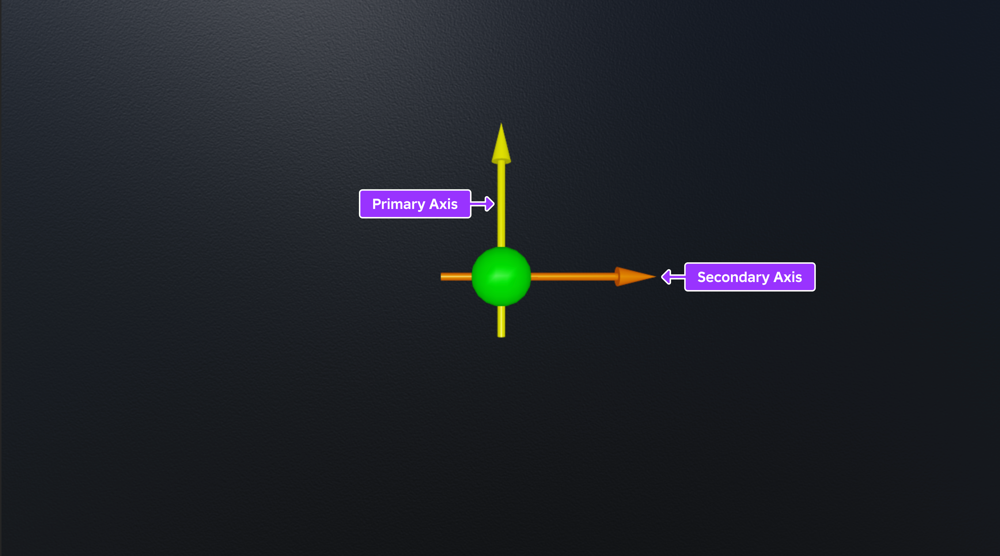
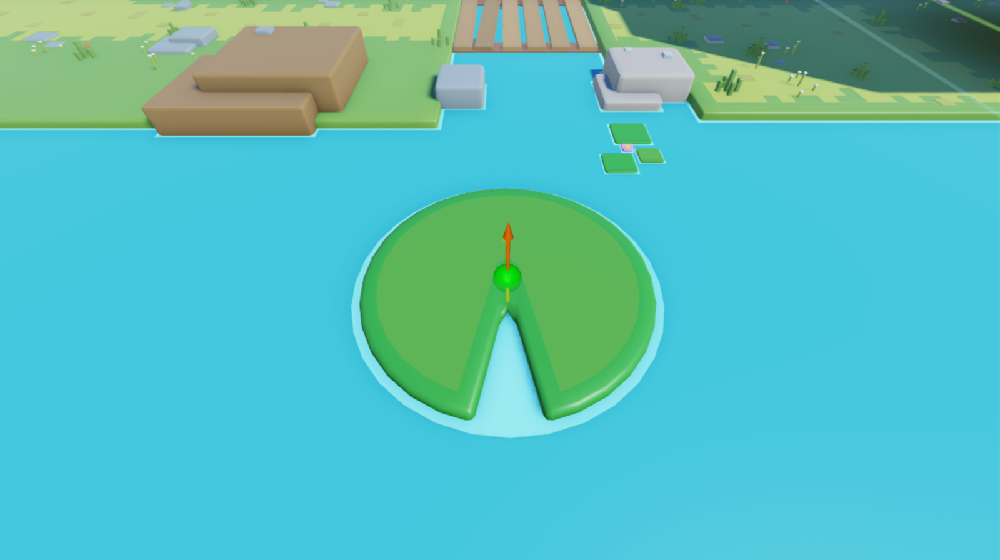
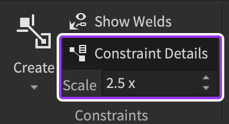
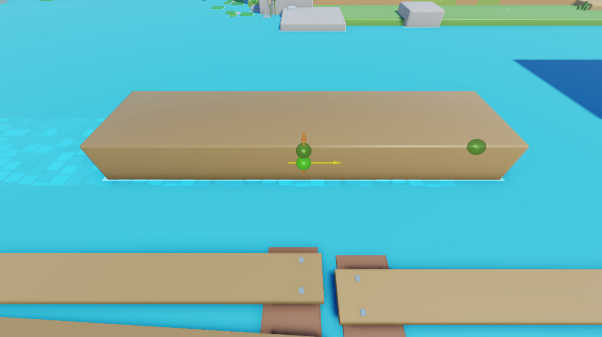
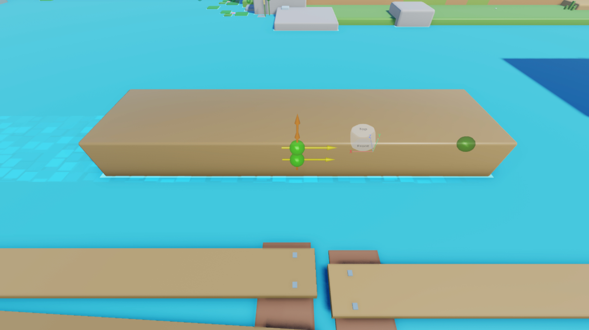

# Creating Moving Objects

## 목차
- [Creating Moving Objects](#creating-moving-objects)
  - [목차](#목차)
  - [선형 운동과 물리적 힘](#선형-운동과-물리적-힘)
  - [일정한 선형 속도 유지](#일정한-선형-속도-유지)
    - [LinearVelocity 제약 사용](#linearvelocity-제약-사용)
      - [부착물 추가](#부착물-추가)
      - [제약 구성](#제약-구성)
    - [PrismaticConstraint 제약 사용](#prismaticconstraint-제약-사용)
      - [부착물 구성](#부착물-구성)
      - [제약 구성](#제약-구성-1)
  - [초기 선형 힘 적용](#초기-선형-힘-적용)
    - [ApplyImpulse 사용](#applyimpulse-사용)
  - [출처](#출처)
  - [다음](#다음)

---

**움직이는 물체**는 3D 공간 내에서 하나 이상의 축을 따라 움직이는 물체를 의미합니다. Roblox의 시뮬레이션 엔진을 사용하여, 물체가 중력, 공기역학, 마찰과 같은 실제 물리적 행동을 모방하여 움직이고 환경과 상호 작용하게 만들 수 있습니다. 이는 플레이어에게 익숙하고 직관적인 경험을 제공합니다.

[움직이는 물체](https://www.roblox.com/games/17560154079/UCT-Linear-Movement) `.rbxl` 파일을 참조하여, 이 튜토리얼에서는 물리적 힘이 스튜디오에서 선형 운동에 미치는 영향을 설명하고, 다음과 같은 다양한 움직임 행동을 통해 물체를 A 지점에서 B 지점으로 이동시키는 다양한 기술을 보여줍니다:

- `LinearVelocity` 이동 제약을 사용하여 전체 어셈블리를 일정한 선형 속도로 이동시키기
- `PrismaticConstraint`를 사용하여 어셈블리를 단일 축으로 제한하고 3D 공간의 한 지점에 대해 일정한 선형 속도로 이동시키기
- `ApplyImpulse` 메서드를 사용하여 초기 힘의 임펄스를 사용해 어셈블리를 이동시키고 시간이 지나면서 천천히 감속시키기


   기본 부품이나 서드파티 모델링 도구의 메시를 사용하여 자신의 어셈블리를 만들고, 자신의 자산을 사용하여 따라해 볼 수 있습니다. 스튜디오에서 메시를 사용하는 방법에 대한 정보는 [내보내기 요구 사항](https://create.roblox.com/docs/art/modeling/export-requirements)을 참조하세요.

<!-- 
<video controls src="../img/05_03_Creating_Moving_Objects/Intro.mp4" alt="샘플 경험의 주요 게임 플레이 영역의 측면 뷰, 강 레인에서 떠다니는 통나무와 수련 잎, 밝은 파란색 점프 패드가 포함되어 있음" width="90%"></video> -->
[](https://prod.docsiteassets.roblox.com/assets/tutorials/creating-moving-objects/Intro.mp4)

## 선형 운동과 물리적 힘

Roblox Studio는 실제 물리적 행동을 실시간으로 모방하는 시뮬레이션 엔진입니다. 따라서 경험에서 선형으로 움직이는 물체가 어떻게 행동할지 예측하기 위해서는 실제 생활에서 물체가 선형 운동을 하는 방식을 고수준으로 이해하는 것이 중요합니다.

**선형 운동**은 축을 따라 움직이는 것을 의미합니다. 예를 들어, 블록이 선형 운동을 할 때, 그것은 설정된 축을 따라 움직입니다.

<GridContainer numColumns="2">
  <figure>
    
  </figure>
  <figure>
    <!-- <video controls src="../img/05_03_Creating_Moving_Objects/Move-Block.mp4" alt="회색 블록이 화면의 오른쪽에서 왼쪽으로 움직이는 모습" width="100%"></video> -->
    [](https://prod.docsiteassets.roblox.com/assets/tutorials/creating-moving-objects/Move-Block.mp4)
  </figure>
</GridContainer>

선형 운동은 물체를 움직이기 위해 외부의 물리적 힘이 밀거나 당기지 않으면 존재할 수 없습니다. 뉴턴의 [운동의 제1법칙](https://en.wikipedia.org/wiki/Newton%27s_laws_of_motion#First_law)에 따르면, 정지한 물체는 외부 힘이 작용하지 않는 한 계속 정지해 있고, 움직이는 물체는 계속해서 일정한 속도로 움직입니다. 예를 들어, 정지한 블록은 바람과 같은 물리적 힘이 밀어 움직이게 되지 않는 한 계속 정지해 있습니다.

<GridContainer numColumns="2">
  <figure>
    <!-- <video controls src="../img/05_03_Creating_Moving_Objects/Wind-Block.mp4" alt="바람이 회색 블록을 화면의 오른쪽에서 왼쪽으로 밀어 움직이는 모습" width="100%"></video> -->
    [](https://prod.docsiteassets.roblox.com/assets/tutorials/creating-moving-objects/Wind-Block.mp4)
  </figure>
  <figure>
  </figure>
</GridContainer>

**힘**은 물체의 선형 속도를 변화시키는 물리적 밀기 또는 당기기의 방향과 크기를 측정한 것입니다. 속도의 변화는 **가속도**로 알려져 있습니다. 이 개념은 스튜디오에서 물체를 움직이는 데 특히 중요합니다. 더 많은 힘을 물체에 가할수록 더 빨리 가속됩니다.

이는 힘이 중력이나 마찰과 같은 물체에 반대되는 물리적 힘보다 커야 하기 때문입니다. 예를 들어, 블록을 금속판에 놓으면, 바람의 힘이 금속판의 마찰을 극복하여 블록을 계속 가속시켜야 합니다. 바람의 힘이 금속판의 마찰보다 크지 않으면, 블록은 천천히 가속됩니다.

<GridContainer numColumns="2">
  <figure>
    
  </figure>
  <figure>
    <!-- <video controls src="../img/05_03_Creating_Moving_Objects/Plate-Friction.mp4" alt="이전 이미지의 동일한 회색 블록이 금속판의 마찰 때문에 천천히 움직이는 모습" width="100%"></video> -->
    [](https://prod.docsiteassets.roblox.com/assets/tutorials/creating-moving-objects/Plate-Friction.mp4)
  </figure>
</GridContainer>

**선형 속도**는 물체의 움직임을 측정한 것으로, 물체가 일정 시간 동안 축을 따라 얼마나 빠르게 위치를 변화시키는지를 나타냅니다. 스튜디오는 선형 속도를 물체가 초당 몇 스터드를 이동하는지에 따라 측정합니다. 스터드는 Roblox의 길이를 측정하는 주요 물리적 단위로, 각 스터드는 실제 세계에서 약 28cm에 해당합니다.

<GridContainer numColumns="2">
  <figure>
    
  </figure>
  <figure>
  </figure>
</GridContainer>

선형 속도를 이해하는 것은 경험에서 게임플레이를 설계하는 데 중요합니다. 이는 움직이는 물체가 특정 속도를 달성하기 위해 얼마나 많은 힘이 필요한지를 결정하는 데 도움이 됩니다. 예를 들어, 물체를 위로 추진하고자 할 때, 물체가 환경 내에서 중력을 극복하여 정확하게 움직이게 하려면 힘을 어떻게 조정해야 하는지 고려하는 것이 중요합니다.

다음 섹션에서는 일정한 선형 속도 또는 초기 선형 속도를 달성하기 위해 필요한 힘으로 물체를 움직이는 방법에 대해 자세히 다룹니다. 이러한 물리학 개념과 함께 다양한 기술을 검토하면서, 스튜디오에서 이상적인 선형 운동 행동을 달성하기 위해 속성 값을 조정하는 방법을 더 정확하게 예측할 수 있습니다.

## 일정한 선형 속도 유지

물체가 일정한 선형 속도에 도달하고 이를 유지하기 위해서는, 물체의 선형 속도를 감속시키거나 물체를 정지 상태로 유지하는 반대 물리적 힘을 극복할 수 있는 힘이 필요합니다. 예를 들어, 스튜디오에서 물체가 `[0, 12, 0]`의 선형 속도를 가지려면, 물체가 환경 내에서 Y 축을 따라 초당 12 스터드를 이동할 수 있는 충분한 힘이 필요합니다.

필요한 힘의 양은 환경 내의 반대 물리적 힘, 예를 들어 중력이나 마찰뿐만 아니라 물체 자체의 특성에 따라 다릅니다. 예를 들어, 동일한 모양의 두 물체가 같은 축을 따라 움직일 때, 더 많은 질량을 가진 물체는 동일한 선형 가속도를 달성하기 위해 더 많은 힘이 필요합니다.

<GridContainer numColumns="2">
  <figure>
    <!-- <video controls src="../img/05_03_Creating_Moving_Objects/Small-Triangle.mp4" alt="작은 삼각형이 이동하는 모습" width="100%"></video> -->
    [](https://prod.docsiteassets.roblox.com/assets/tutorials/creating-moving-objects/Small-Triangle.mp4)
    <figcaption>작은 삼각형은 질량이 적기 때문에 동일한 가속도를 달성하기 위해 적은 힘이 필요합니다.</figcaption>
  </figure>
  <figure>
    <!-- <video controls src="../img/05_03_Creating_Moving_Objects/Big-Triangle.mp4" alt="큰 삼각형이 이동하는 모습" width="100%"></video> -->
    [](https://prod.docsiteassets.roblox.com/assets/tutorials/creating-moving-objects/Big-Triangle.mp4)
    <figcaption>큰 삼각형은 질량이 많기 때문에 동일한 가속도를 달성하기 위해 더 많은 힘이 필요합니다.</figcaption>
  </figure>
</GridContainer>

다음 하위 섹션에서는 다양한 모양과 크기의 어셈블리를 사용하여 전체 물체 또는 물체의 일부를 일정한 선형 속도로 이동시키는

 방법을 배우게 됩니다. 속성 값을 조정하면서 자신의 경험에서 어셈블리를 위한 최대 힘을 예측하는 방법을 배울 수 있습니다.

### LinearVelocity 제약 사용

`LinearVelocity` 객체는 [이동 제약](https://create.roblox.com/docs/physics/mechanical-constraints)의 일종으로, 전체 어셈블리에 힘을 가하여 일정한 선형 속도를 유지합니다. 어셈블리의 위치를 움직이는 동안 축에 고정하지 않기 때문에, 어셈블리는 3D 공간에서 다른 물체와 충돌할 때 자유롭게 회전할 수 있습니다. 이러한 유형의 움직임은 플레이어가 예측하기 어려운 놀라운 게임플레이 시나리오를 유도합니다.

<!-- <video controls src="../img/05_03_Creating_Moving_Objects/LV-Intro.mp4" width="90%" alt="강을 따라 떠다니는 수련 잎이 서로 충돌하며 흐르는 모습"></video> -->
[](https://prod.docsiteassets.roblox.com/assets/tutorials/creating-moving-objects/LV-Intro.mp4)
<figcaption>수련 잎이 서로 충돌하면서 방향이 바뀌지만 일정한 선형 속도로 계속 흐릅니다.</figcaption>

어셈블리를 이동시키기 위해, `LinearVelocity` 제약은 다음을 알아야 합니다:

- 힘을 가할 지점과 방향.
- 어셈블리를 초당 몇 스터드로 이동시키고 싶은지.
- 어셈블리가 일정한 선형 속도에 도달할 수 있도록 엔진이 가할 수 있는 최대 힘.

이 과정을 시연하기 위해, 연꽃잎에 부착물을 구성하고, `LinearVelocity` 제약이 부착물을 참조하여 연꽃잎을 일정한 선형 속도로 세계의 음의 X 축을 따라 초당 15 스터드 이동시키는 방법을 설명합니다.



#### 부착물 추가

어셈블리에 `Attachment` 객체를 추가하고 3D 공간에서 부착물의 위치를 구성하여 힘을 가할 지점을 지정할 수 있습니다. 샘플 [움직이는 물체](https://www.roblox.com/games/17560154079/UCT-Linear-Movement) 경험에서는 제약이 부착물을 특정 축을 따라 이동시킬 수 있도록 연꽃잎의 중앙에 부착물을 배치합니다.

부착물에는 축의 움직임을 시각화하는 데 도움이 되는 시각적 보조 도구가 포함되어 있습니다. 노란색 화살표는 부착물의 주요 축을 나타내며, 주황색 화살표는 부착물의 보조 축을 나타냅니다. 이 기술의 단계에서는 연꽃잎의 움직임에 영향을 미치지 않지만, 이는 다른 유형의 제약, 예를 들어 다음 기술의 `PrismaticConstraint`에서 이상적인 행동을 결정하는 데 도움이 될 수 있으므로 이해하는 것이 중요합니다.



부착물을 추가하려면:

1. **탐색기** 창에서 **LinearVelocityExample** 폴더를 확장한 다음, 자식 **LilyPad_DIY** 모델을 확장합니다.
2. **Pad** 메시에 부착물을 삽입합니다.
   1. 메시 위로 마우스를 올리고 ⊕ 버튼을 클릭합니다. 컨텍스트 메뉴가 표시됩니다.
   2. 메뉴에서 **부착물**을 삽입합니다. 부착물이 부품의 중심에 표시됩니다.
   3. 부착물의 이름을 **MoveAttachment**로 변경합니다.

   

#### 제약 구성

이제 메시가 연꽃잎을 이동시키기 위한 고정된 지점을 가졌으므로, `LinearVelocity` 제약의 속성을 구성하여 일정한 선형 속도, 메시를 초당 이동시키고 싶은 스터드 수, 메시가 일정한 선형 속도에 도달할 수 있도록 엔진이 가할 수 있는 최대 힘을 지정할 수 있습니다.

샘플 [움직이는 물체](https://www.roblox.com/games/17560154079/UCT-Linear-Movement) 경험에서는 최대 5000 Rowtons의 일정한 힘을 가하여 연꽃잎을 세계의 음의 X 축을 따라 초당 15 스터드의 일정한 선형 속도로 이동시킵니다. Rowtons는 Roblox의 주요 물리적 힘 측정 단위입니다. Roblox 물리적 단위와 이들이 미터 단위로 변환되는 방법에 대한 참조는 [Roblox 단위](https://create.roblox.com/docs/physics/units)를 참조하세요.

`LinearVelocity` 제약을 구성하려면:

1. **(선택 사항)** 제약 시각적 보조 도구를 3D 공간에 표시하여 선형 방향을 참조할 수 있도록 합니다.
   1. 메뉴 모음에서 **모델** 탭으로 이동한 다음 **제약** 섹션으로 이동합니다.
   2. 현재 활성화되어 있지 않으면 **제약 세부 정보**를 클릭하여 제약 시각적 보조 도구를 표시합니다.

   

2. **Pad** 메시에 `LinearVelocity` 제약을 삽입합니다.
   1. **탐색기** 창에서 메시 위로 마우스를 올리고 ⊕ 아이콘을 클릭합니다. 컨텍스트 메뉴가 표시됩니다.
   2. 컨텍스트 메뉴에서 **LinearVelocity**를 삽입합니다.
3. 새로운 제약에 메시의 부착물을 할당합니다.
   1. **탐색기** 창에서 제약을 선택합니다.
   2. **속성** 창에서,
      1. **Attachment0**를 **MoveAttachment**로 설정합니다.
      2. **MaxForce**를 `5000`으로 설정하여 목표 선형 속도를 달성하기 위해 최대 5000 Rowtons의 일정한 힘을 가합니다.
      3. **RelativeTo**를 **World**로 유지하여 연꽃잎이 세계의 위치와 방향에 상대적으로 이동합니다.
      4. **VelocityConstraint**를 **Line**으로 설정하여 부착물의 선을 따라 힘을 제약합니다.
      5. **LineDirection**을 `-1, 0, 0`으로 설정하여 연꽃잎이 세계의 음의 X 축을 따라 이동하도록 합니다. 이 속성을 `1, 0, 0`으로 설정하면 연꽃잎이 세계의 양의 X 축을 따라 이동합니다.
      6. **LineVelocity**를 `15`로 설정하여 연꽃잎이 초당 15 스터드 이동하도록 합니다.

   
      **RelativeTo**를 **Attachment**로 설정하면 제약이 부착물의 방향에 상대적으로 연꽃잎을 이동시킵니다. 그러나 연꽃잎이 물체와 충돌하면 부착물도 회전하여 새로운 방향으로 연꽃잎을 이동시킵니다.
   

   

4. 설정한 힘이 메시를 세계의 음의 X 축을 따라 초당 15 스터드 이동시키는지 확인합니다.

   1. 메뉴 모음에서 **테스트** 탭으로 이동합니다.
   2. **시뮬레이션** 섹션에서 **모드 선택기**를 클릭합니다. 드롭다운 메뉴가 표시됩니다.

      

   3. **실행**을 선택합니다. 스튜디오는 3D 공간에서 아바타 없이 현재 카메라 위치에서 경험을 시뮬레이션합니다.

   <!-- <video controls src="../img/05_03_Creating_Moving_Objects/LV-4.mp4" width="80%" alt="연꽃잎이 강을 따라 화면 왼쪽에서 오른쪽으로 흐르는 모습"></video> -->
   [](https://prod.docsiteassets.roblox.com/assets/tutorials/creating-moving-objects/LV-4.mp4)

### PrismaticConstraint 제약 사용

`PrismaticConstraint` 객체는 [기계적 제약](https://create.roblox.com/docs/physics/mechanical-constraints)의 일종으로, 두 부착물 사이에 강성 조인트를 생성하여 부모 어셈블리가 서로 **상대적으로** 단일 축을 따라 이동할 수 있게 합니다. 두 어셈블리의 위치를 단일 축에 고정함으로써, 어셈블리는 동일한 방향으로 함께 회전할 때만 회전할 수 있습니다.

<!-- <video controls src="../img/05_03_Creating_Moving_Objects/Prismatic-Demo.mp4" width="90%" alt="PrismaticConstraint 데모 비디오"></video> -->
[](https://prod.docsiteassets.roblox.com/assets/tutorials/creating-moving-objects/Prismatic-Demo.mp4)

이러한 유형의 움직임은 플레이어가 예측하기 쉬운 안정적인 게임플레이 시나리오를 유도합니다. 예를 들어, 샘플 [움직이는 물체](https://www.roblox.com/games/17560154079/UCT-Linear-Movement) 경험에서는 `PrismaticConstraint` 객체를 사용하여 플레이어가 거대한 강을 신중하게 건널 수 있는 통나무 플랫폼을 이동시킵니다.

<!-- <video controls src="../img/05_03_Creating_Moving_Objects/PC-Intro.mp4" width="90%" alt="강을 따라 떠다니는 통나무의 측면 뷰. 일부 행은 화면의 상단에서 하단으로 흐르고, 하나의 행은 화면의 하단에서 상단으로 흐릅니다."></video> -->
[](https://prod.docsiteassets.roblox.com/assets/tutorials/creating-moving-objects/PC-Intro.mp4)

`PrismaticConstraint.ActuatorType`을 **Motor**로 설정하면, 이 제약은 목표 선형 속도에 도달하고 유지하기 위해 두 부착물에 힘을 가합니다. 부착물 중 하나의 부모 어셈블리를 고정하면, 힘은 고정된 어셈블리는 정지 상태로 유지되는 반면 고정되지 않은 어셈블리를 일정한 선형 속도로 계속 이동시킵니다.

어셈블리를 이동시키기 위해, `PrismaticConstraint` 제약은 다음을 알아야 합니다:

- 힘을 가할 지점과 방향.
- 부착물을 초당 몇 스터드로 이동시키고 싶은지.
- 부착물과 부모 어셈블리가 일정한 선형 속도에 도달할 수 있도록 엔진이 가할 수 있는 최대 힘.

이 과정을 시연하기 위해, 고정되지 않은 통나무와 고정된 부품이 중첩되는 위치 근처에서 부착물이 정렬되고 세계의 X 축을 따라 정렬된 통나무 어셈블리를 구성하고, 세계의 음의 X 축을 따라 초당 40 스터드의 일정한 선형 속도로 통나무를 이동시키는 방법을 설명합니다.

</video>

#### 부착물 구성

어셈블리 내의 특정 물체를 이동할 방향을 지정하려면 두 `Attachment` 객체를 어셈블리에 추가한 다음 3D 공간에서 정렬과 방향을 구성할 수 있습니다. 샘플 [움직이는 물체](https://www.roblox.com/games/17560154079/UCT-Linear-Movement) 경험에서는 세계의 X 축을 따라 부착물 두 개를 정렬하여 고정된 부품과 고정되지 않은 통나무가 중첩되는 위치 근처에 배치하고, 각 부착물의 주요 축이 세계의 음의 X 축을 향하도록 구성합니다.

`PrismaticConstraint` 제약을 다음 섹션에서 구성할 때, 통나무가 **고정된** 부품에 대해 상대적으로 이동합니다. 즉, 통나무는 3D 공간에서 고정된 부품에서 떨어져 이동합니다.

프리즘 제약을 위한 부착물을 구성하려면:

1. **탐색기** 창에서 **PrismaticConstraintExample** 폴더를 확장한 다음, 자식 **Log_DIY** 모델을 확장합니다.
2. **Log** 메시에 부착물을 삽입합니다.
   1. 메시 위로 마우스를 올리고 ⊕ 버튼을 클릭합니다. 컨텍스트 메뉴가 표시됩니다.
   2. 메뉴에서 **부착물**을 삽입합니다. 부착물이 부품의 중심에 표시됩니다.
   3. 부착물의 이름을 **LogAttachment**로 변경합니다.

   </img>

3. 동일한 방법으로 **Anchor** 부품에 부착물을 삽입한 다음, 부착물의 이름을 **AnchorAttachment**로 변경합니다.

   </img>

4. **보기 선택기** 도구를 세계의 좌표계로 참조하여 **LogAttachment**와 **AnchorAttachment**의 주요 축이 세계의 음의 X 축을 향하도록 회전합니다.

   </img>

5. **AnchorAttachment**를 재배치하여 두 부착물이 세계의 X 축에서 정렬되도록 합니다.

   </img>

#### 제약 구성

이제 부착물이 동일한 축에서 정렬되고 이동하려는 방향을 향하고 있으므로, `PrismaticConstraint` 제약의 속성을 구성하여 각 부착물의 주요 축의 양 또는 음의 방향으로 목표 일정한 선형 속도를 적용할지, 부착물을 초당 이동시키고 싶은 스터드 수, 통나무가 일정한 선형 속도에 도달할 수 있도록 엔진이 가할 수 있는 최대 힘을 지정할 수 있습니다.

자신의 사용 사례에 대해 다른 값을 선택할 수 있지만, 샘플 [움직이는 물체](https://www.roblox.com/games/17560154079/UCT-Linear-Movement) 경험에서는 최대 50000 Rowtons의 일정한 힘을 가하여 세계의 음의 X 축을 따라 초당 40 스터드의 일정한 선형 속도로 부착물을 이동시킵니다. 그러나 고정된 부착물은 고정된 물체에 있어 움직일 수 없으므로, 통나무의 부착물만 움직일 수 있습니다.

프리즘 제약을 구성하려면:

1. **Log** 메시에 `PrismaticConstraint` 객체를 삽입합니다.
   1. **탐색기** 창에서 메시 위로 마우스를 올리고 ⊕ 아이콘을 클릭합니다. 컨텍스트 메뉴가 표시됩니다.
   2. 컨텍스트 메뉴에서 **PrismaticConstraint**를 삽입합니다.
2. 통나무의 부착물을 새로운 제약에 할당하여 통나무가 고정된 블록 부품에 대해 **상대적으로** 이동하도록 합니다.
   1. **탐색기** 창에서 제약을 선택합니다.
   2. **속성** 창에서,
      1. **Attachment0**를 **AnchorAttachment**로 설정합니다.
      2. **Attachment1**을 **LogAttachment**로 설정합니다. 제약이 뷰포트에 표시됩니다.

   </img>

3. **탐색기** 창에서 제약을 선택한 다음, 속성 창에서,
   1. **ActuatorType**을 **Motor**로 설정합니다. 새로운 속성 필드가 표시됩니다.
   2. **MotorMaxForce**를 `50000`으로 설정하여 목표 선형 속도를 달성하기 위해 최대 50000 Rowtons의 일정한 힘을 가합니다.
   1

. **Velocity**를 `40`으로 설정하여 통나무가 초당 40 스터드 이동하도록 합니다.

   </img>

1. 설정한 힘이 통나무를 세계의 음의 X 축을 따라 초당 40 스터드 이동시키는지 확인합니다.

   1. 메뉴 모음에서 **테스트** 탭으로 이동합니다.
   1. **시뮬레이션** 섹션에서 **모드 선택기**를 클릭합니다. 드롭다운 메뉴가 표시됩니다.

      </img>

   1. **실행**을 선택합니다. 스튜디오는 3D 공간에서 아바타 없이 현재 카메라 위치에서 경험을 시뮬레이션합니다.

   <!-- <video controls src="../img/05_03_Creating_Moving_Objects/PC-4.mp4" width="90%" alt="통나무가 강을 따라 화면 왼쪽에서 오른쪽으로 흐르는 모습"></video> -->
   [](https://prod.docsiteassets.roblox.com/assets/tutorials/creating-moving-objects/PC-4.mp4)

## 초기 선형 힘 적용

물체의 선형 속도를 변경하는 또 다른 방법은 힘의 임펄스를 적용하는 것입니다. 힘의 임펄스 후에 반대 힘이 있는 경우 물체는 감속하여 정지 상태가 되거나, 반대 힘이 없는 경우 일정한 선형 속도로 움직입니다.

이 기술은 폭발이나 충격적인 충돌과 같은 중요한 게임플레이 이벤트 후에 물체를 이동시키는 데 유용합니다. 플레이어에게 즉각적인 피드백을 제공합니다. 예를 들어, 다음 하위 섹션에서는 점프 패드와 충돌할 때 플레이어의 캐릭터를 초기 임펄스로 하늘로 발사하는 방법을 배웁니다. 이 방법을 사용하여 게임플레이 요구에 맞게 새로운 값으로 조정할 수 있습니다.

### ApplyImpulse 사용

`ApplyImpulse` 메서드는 전체 어셈블리에 힘을 가하여 초기 선형 속도를 얻은 후 반대 힘이 있는 경우 천천히 멈추게 합니다. 어셈블리를 이동시키기 위해, 메서드는 다음을 알아야 합니다:

- 이동할 어셈블리.
- 초기 선형 속도에 도달하기 위해 힘을 가할 축.
- 각 축에 가할 힘의 양.

이 모든 값을 스크립트에서 정의할 수 있습니다. 예를 들어, 샘플 스크립트는 플레이어 캐릭터의 `Humanoid` 객체를 이동할 어셈블리로 정의한 다음, 플레이어를 세계의 양의 Y 축으로 발사하기 위해 2500 Rowton-seconds의 힘의 임펄스를 적용합니다. 플레이어 캐릭터는 질량이 다르기 때문에, 캐릭터가 너무 높이 발사되지 않도록 모든 플레이어를 발사하기 위해 이 힘을 조정하고 균형을 맞춰야 할 수 있습니다.

`ApplyImpulse`를 사용하여 어셈블리를 이동시키려면:

1. **탐색기** 창에서 **ApplyImpulseExample** 폴더를 확장한 다음, 자식 **JumpPad_DIY** 모델을 확장합니다.
2. **JumpPad** 부품에 스크립트를 삽입합니다.
   1. 부품 위로 마우스를 올리고 ⊕ 버튼을 클릭합니다. 컨텍스트 메뉴가 표시됩니다.
   2. 메뉴에서 **스크립트**를 삽입합니다. 부착물이 부품의 중심에 표시됩니다.
   3. 스크립트의 이름을 **JumpScript**로 변경합니다.
3. 기본 코드를 다음 코드로 교체합니다:

``` lua

local volume = script.Parent

local function onTouched(other)
	local impulse = Vector3.new(0, 2500, 0)
	local character = other.Parent
	local humanoid = character:FindFirstChildWhichIsA("Humanoid")
	if humanoid and other.Name == "LeftFoot" then
		other:ApplyImpulse(impulse)
	end
end

volume.Touched:Connect(onTouched)

```

   <!-- <video controls src="../img/05_03_Creating_Moving_Objects/Impulse-3.mp4" width="90%" alt="벌 캐릭터가 점프 패드로 뛰어가고, 점프 패드에 닿으면 공중으로 발사되는 모습"></video> -->
   [](https://prod.docsiteassets.roblox.com/assets/tutorials/creating-moving-objects/Impulse-3.mp4)

---
## 출처
 - [Creating Moving Objects](https://create.roblox.com/docs/tutorials/building/physics/creating-moving-objects)

---
## [다음](./05_04_Creating_Spinning_Objects.md)