# Creating Spinning Objects

## 목차
- [Creating Spinning Objects](#creating-spinning-objects)
  - [목차](#목차)
  - [각운동과 물리적 힘](#각운동과-물리적-힘)
  - [일정한 각속도 유지](#일정한-각속도-유지)
    - [AngularVelocity 제약 사용](#angularvelocity-제약-사용)
      - [부착물 추가](#부착물-추가)
      - [제약 구성](#제약-구성)
    - [HingeConstraint 제약 사용](#hingeconstraint-제약-사용)
      - [프로펠러 자산 가져오기](#프로펠러-자산-가져오기)
      - [부착물 구성](#부착물-구성)
      - [제약 구성](#제약-구성-1)
  - [초기 각힘 적용](#초기-각힘-적용)
    - [ApplyAngularImpulse 사용](#applyangularimpulse-사용)
  - [출처](#출처)
  - [다음](#다음)

---

**회전하는 물체**는 3D 공간 내에서 하나 이상의 축을 따라 회전하는 물체입니다. Roblox의 시뮬레이션 엔진을 사용하여 물체가 회전하고 주변 환경과 상호 작용하는 방식이 중력, 공기역학 및 마찰과 같은 실제 물리적 행동을 에뮬레이트하여 플레이어에게 친숙하고 직관적인 방식으로 작동할 수 있습니다.

[회전하는 물체](https://www.roblox.com/games/16550477904/Spinning-Objects) `.rbxl` 파일을 참조하여, 이 튜토리얼은 Studio에서 물리적 힘이 각운동에 어떻게 영향을 미치는지 설명하고, 다양한 회전 행동을 통해 물체를 회전시키는 여러 기술을 보여줍니다. 여기에는 다음이 포함됩니다:

- `AngularVelocity` 무버 제약을 사용하여 전체 어셈블리를 일정한 각속도로 회전시키기
- `HingeConstraint` 기계적 제약을 사용하여 어셈블리 내의 일부를 회전시키기
- `ApplyAngularImpulse` 메서드를 사용하여 초기 각힘으로 어셈블리를 회전시키기

<!-- <video controls src="../img/05_04_Creating_Spinning_Objects/Overview.mp4" width="90%"></video> -->
[](https://prod.docsiteassets.roblox.com/assets/tutorials/creating-spinning-objects/Overview.mp4)


   기본 파트나 타사 모델링 도구에서 만든 메시를 사용하여 자신만의 어셈블리를 만들 수 있으며, 자신의 자산을 사용하여 따라 할 수 있습니다. Studio에서 메시를 내보내는 방법에 대한 자세한 내용은 [내보내기 요구사항](https://create.roblox.com/docs/art/modeling/export-requirements)을 참조하세요.


## 각운동과 물리적 힘

Roblox Studio는 실시간으로 물리적 행동을 에뮬레이트하는 실제 시뮬레이션 엔진이므로, 경험에서 회전하는 물체의 행동을 예측하기 위해 각운동의 실제 동작에 대한 고수준의 이해가 중요합니다.

**각운동** 또는 회전운동은 고정된 점이나 축을 중심으로 한 운동입니다. 예를 들어, 프로펠러가 각운동을 할 때, 프로펠러의 중심 회전축을 중심으로 회전합니다.

<GridContainer numColumns="2">
  <figure>
    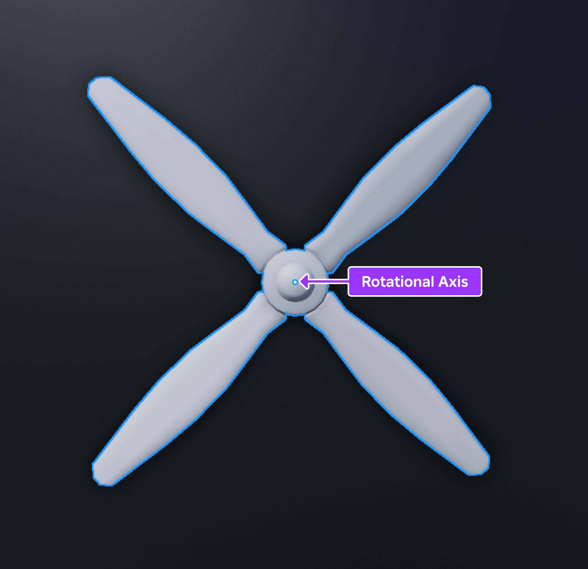
  </figure>
  <figure>
    <!-- <video controls src="../img/05_04_Creating_Spinning_Objects/Rotational-Axis.mp4" width="100%"></video> -->
    [](https://prod.docsiteassets.roblox.com/assets/tutorials/creating-spinning-objects/Rotational-Axis.mp4)
  </figure>
</GridContainer>

외부의 물리적 힘이 물체를 밀거나 당겨 회전시키지 않는 한, 각운동은 존재할 수 없습니다. 뉴턴의 [운동의 첫 번째 법칙](https://en.wikipedia.org/wiki/Newton%27s_laws_of_motion#First_law)에 따르면, 정지해 있는 물체는 외부 힘이 작용하지 않는 한 정지해 있고, 움직이는 물체는 일정한 속도로 계속 움직입니다. 예를 들어, 정지해 있는 프로펠러는 바람 같은 물리적 힘이 회전시키지 않는 한 정지해 있습니다.

<GridContainer numColumns="2">
  <figure>
    <!-- <video controls src="../img/05_04_Creating_Spinning_Objects/Stop-Propeller.mp4" width="100%"></video> -->
    [](https://prod.docsiteassets.roblox.com/assets/tutorials/creating-spinning-objects/Stop-Propeller.mp4)
  </figure>
  <figure>
  </figure>
</GridContainer>

**토크**는 물체를 회전시키는 물리적 힘의 측정치이며, 물체가 각가속도를 얻는 데 중요한 역할을 합니다. 이 개념은 Studio에서 물체를 회전시키는 데 특히 중요합니다. 더 많은 토크를 물체에 가하면 더 빨리 가속할 수 있습니다.

이는 토크가 중력이나 마찰과 같은 물체에 반대하는 방향의 물리적 힘보다 커야 하기 때문입니다. 예를 들어, 프로펠러를 흙에 놓으면, 바람의 물리적 힘이 계속해서 회전하는 프로펠러의 마찰을 극복해야 합니다. 바람의 힘이 흙의 마찰보다 크지 않으면 프로펠러는 더 천천히 가속됩니다.

<GridContainer numColumns="2">
  <figure>
    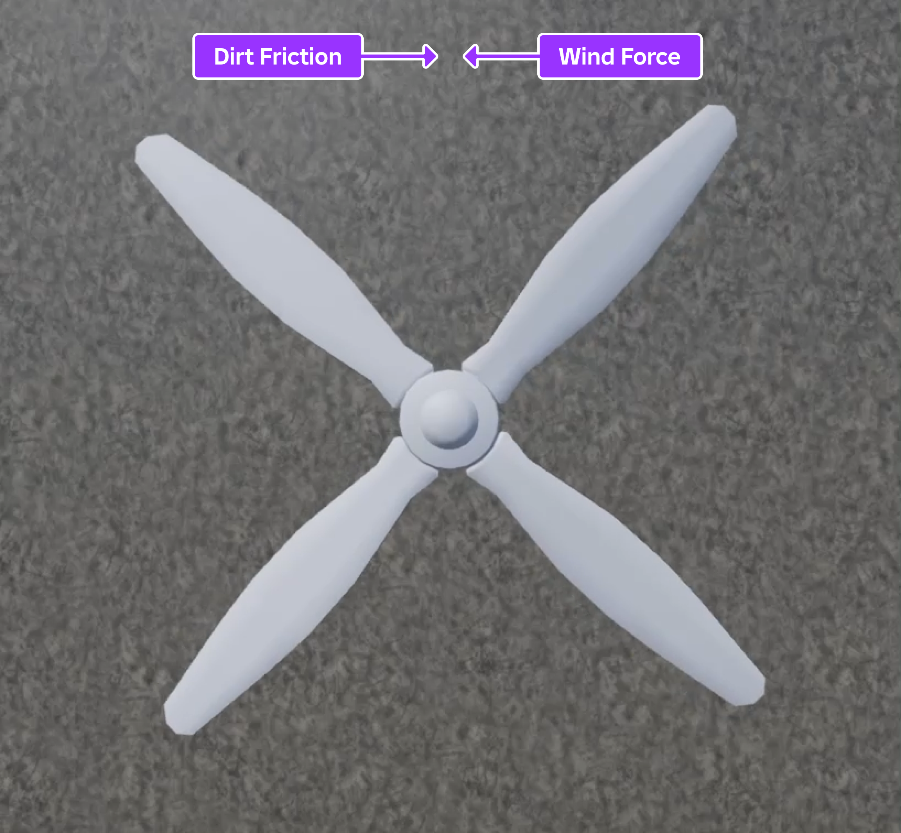
  </figure>
  <figure>
    <!-- <video controls src="../img/05_04_Creating_Spinning_Objects/Dirt-Propeller.mp4" width="100%"></video> -->
    [](https://prod.docsiteassets.roblox.com/assets/tutorials/creating-spinning-objects/Dirt-Propeller.mp4)
  </figure>
</GridContainer>

**각속도**는 물체가 고정된 점이나 축을 중심으로 일정 시간 동안 회전하는 속도를 측정한 것입니다. Studio는 물체가 초당 몇 [라디안](https://en.wikipedia.org/wiki/Radian)을 회전하는지에 따라 각속도를 측정합니다. 한 회전에 2π 라디안(6.283)이 있으므로, 물체가 초당 한 바퀴를 회전하려면 약 6 라디안의 각속도를 가져야 합니다. 각속도를 이해하는 것은 경험에서 게임플레이를 설계하는 데 중요합니다. 이는 회전하는 물체에 특정 가속도를 달성하기 위해 필요한 토크의 양을 결정하는 데 도움이 됩니다.

다음 섹션에서는 필요한 토크를 극복하기 위해 물체를 일정하거나 초기 각속도로 회전시키는 방법을 배우면서 이러한 개념을 더 깊이 탐구합니다. 다가오는 기술과 함께 이러한 물리 개념을 검토하면 Studio에서 이상적인 회전 동작을 달성하기 위해 속성 값을 조정하는 방법을 더 정확하게 예측할 수 있습니다.

## 일정한 각속도 유지

물체가 일정한 각속도에 도달하고 유지하려면, 물체의 각속도를 감속시키거나 물체를 정지 상태로 유지하는 반대 물리적 힘을 극복하기 위해 각힘이 필요합니다. 예를 들어, Studio에서 물체가 `[0, 12, 0]`의 각속도를 가지려면, 물체가 환경에서 Y 축을 따라 초당 `12` 라디안에 도달하고 유지할 수 있는 토크가 필요합니다.

물체에 가하는 토크의 양은 중력이나 마찰과 같은 환경 내의 반대 물리적 힘뿐만 아니라 물체 자체에도 따라 달라집니다. 예를 들어, 동일한 축에서 회전하는 두 물체가 있을 때, 더 큰 [관성 모멘트](https://en.wikipedia.org/wiki/Moment_of_inertia)를 가진 더 큰 물체는 동일한 각가속도를 달성하기 위해 더 많은 토크가 필요합니다.

<GridContainer numColumns="2">
  <figure>
    <!-- <video controls src="../img/05_04_Creating_Spinning_Objects/Little-Triangle.mp4" width="100%"></video> -->
    [](https://prod.docsiteassets.roblox.com/assets/tutorials/creating-spinning-objects/Little-Triangle.mp4)
    <figcaption>작은 삼각형 파트는 관성 모멘트가 낮아 동일한 가속도를 달성하기 위해 적은 각힘이 필요합니다.</figcaption>
  </figure>
  <figure>
    <!-- <video controls src="../img/05_04_Creating_Spinning_Objects/Big-Triangle.mp4" width="100%"></video> -->
    [](https://prod.docsiteassets.roblox.com/assets/tutorials/creating-spinning-objects/Big-Triangle.mp4)
    <figcaption>큰 삼각형 파트는 관성 모멘트가 커 동일한 가속도를 달성하기 위해 더 많은 각힘이 필요합니다.</figcaption>
  </figure>
</GridContainer>

다음 하위 섹션에서는 어셈블리의 전체 또는 일부를 회전시키는 방법을 배웁니다. 다양한 속성 값을 실험해 보면서, 자신의 경험에서 어셈블리에 필요한 최대 토크를 추정하는 방법을 배우게 됩니다.

### AngularVelocity 제약 사용

`AngularVelocity` 객체는 전체 어셈블리에 일정한 각속도를 유지하기 위해 토크를 가하는 [무버 제약](https://create.roblox.com/docs/physics/mover-constraints)의 일종입니다. 어셈블리를 회전시키려면, `AngularVelocity` 제약은 다음을 알아야 합니다:

- 각힘을 가할 지점과 방향
- 어셈블리가 초당 회전할 라디안의 양
- 어셈블리가 일정한 각속도에 도달하기 위해 엔진이 가할 수 있는 최대 토크

이 과정을 시연하기 위해, Workspace에 부착물을 추가한 블록을 추가하고 `AngularVelocity` 제약이 부착물을 참조하여 블록을 세계의 Y 축을 따라 초당 `6` 라디안, 즉 약 한 바퀴 회전시키는 방법을 설명합니다.

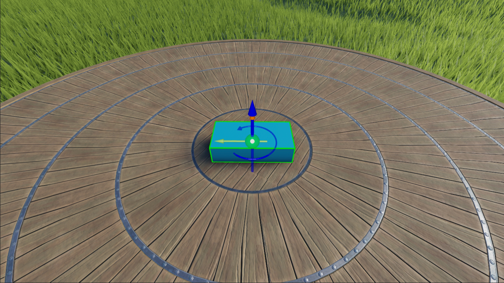

#### 부착물 추가

어셈블리를 회전시키기 위해 고정된 지점을 지정하려면, 어셈블리에 `Attachment` 객체를 추가하고 3D 공간에서 부착물의 위치를 구성할 수 있습니다. 샘플 [회전하는 물체](https://www.roblox.com/games/16550477904/Spinning-Objects) 경험에서는 블록 파트의 중심에 부착물을 배치하여 제약이 파트의 중심을 기준으로 시계 반대 방향으로 회전하도록 합니다.

부착물에는 회전축을 시각화하는 데 도움이 되는 시각적 보조 기능이 포함되어 있습니다. 노란색 화살표는 부착물의 주요 축을 나타내고, 주황색 화살표는 부차 축을 나타냅니다. 이 기술의 단계에서는 회전축이 블록의 회전에 영향을 미치지 않지만, 이후 기술에서 `HingeConstraint`와 같은 다른 유형의 제약의 이상적인 행동을 결정하는 데 도움이 될 수 있으므로 이러한 시각적 보조 기능을 이해하는 것이 중요합니다.


부착물을 추가하려면:

1. **탐색기** 창에서 **Workspace**에 **블록** 파트를 삽입합니다.

   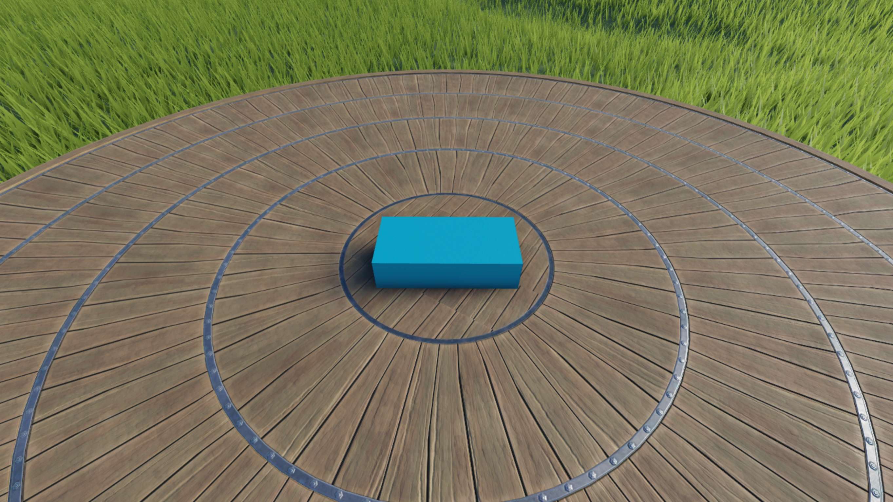

2. 새 파트에 부착물을 삽입합니다.
   1. **탐색기** 창에서 파트를 마우스 오버하고 ⊕ 버튼을 클릭합니다. 컨텍스트 메뉴가 표시됩니다.
   2. 메뉴에서 **부착물**을 삽입합니다. 부착물이 파트의 중심에 표시됩니다.
   3. 부착물의 이름을 **SpinAttachment**로 변경합니다.

   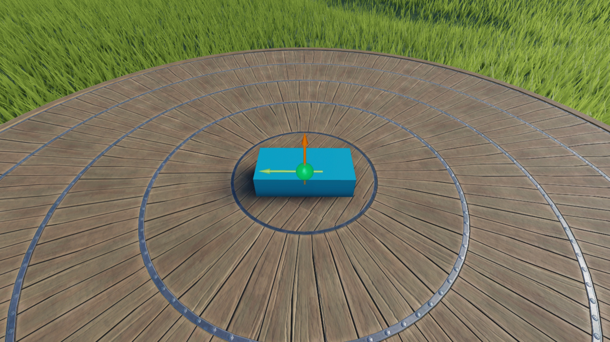

#### 제약 구성

이제 블록에 고정된 지점을 지정했으므로, `AngularVelocity` 제약의 속성을 구성하여 회전 방향, 목표 일정 각속도에 도달할 축 또는 축, 블록이 초당 회전할 라디안의 양, 블록이 일정한 각속도에 도달하기 위해 엔진이 가할 수 있는 최대 토크를 지정할 수 있습니다.

샘플 [회전하는 물체](https://www.roblox.com/games/16550477904/Spinning-Objects) 경험은 최대 1000 Rowton-studs의 일정한 각힘을 가하여 블록을 세계의 Y 축을 따라 초당 `6` 라디안으로 회전시킵니다. Rowton-studs는 토크를 측정하는 Roblox의 기본 물리 단위입니다. Roblox 물리 단위 및 메트릭 단위로의 변환에 대한 자세한 내용은 [Roblox 단위](https://create.roblox.com/docs/physics/units)를 참조하세요.

`AngularVelocity` 제약을 구성하려면:

1. **(선택 사항)** 제약을 3D 공간에서 시각화할 수 있도록 제약 시각적 보조 기능을 활성화합니다.
   1. 메뉴 모음에서 **모델** 탭으로 이동한 다음, **제약** 섹션으로 이동합니다.
   2. 현재 활성화되어 있지 않다면, **제약 세부 정보**를 클릭하여 제약 시각적 보조 기능을 표시합니다.

   

2. 파트에 `AngularVelocity` 제약을 삽입합니다.
   1. **탐색기** 창에서 파트를 마우스 오버하고 ⊕ 아이콘을 클릭합니다. 컨텍스트 메뉴가 표시됩니다.
   2. 컨텍스트 메뉴에서 **AngularVelocity**를 삽입합니다. 제약의 시각적 보조 기능이 파트의 중앙에 표시됩니다.
3. 새 제약에 파트의 부착물을 할당합니다.
   1. **탐색기** 창에서 제약을 선택합니다.
   2. **속성** 창에서
      1. **Attachment0**를 **SpinAttachment**로 설정합니다.
      2. **AngularVelocity**를 `0, 6, 0`으로 설정하여 파트를 Y 축을 따라 초당 6 라디안 회전시킵니다. 이 속성을 `0, -6, 0`으로 설정하면 블록이 시계 방향으로 회전합니다.
      3. **MaxTorque**를 `1000`으로 설정하여 목표 각속도에 도달하기 위해 초당 최대 1000 Rowton-studs의 일정 각힘을 가합니다.
      4. **RelativeTo**를 **World**로 유지하여 블록을 세계의 위치와 방향에 따라 회전시킵니다.

   

4. 설정한 토크가 블록을 세계의 Y 축을 따라 초당 6 라디안 회전시키는지 확인합니다.
   1. 메뉴 모음에서 **테스트** 탭으로 이동합니다.
   2. **시뮬레이션** 섹션에서 **모드 선택기**를 클릭합니다. 드롭다운 메뉴가 표시됩니다.

      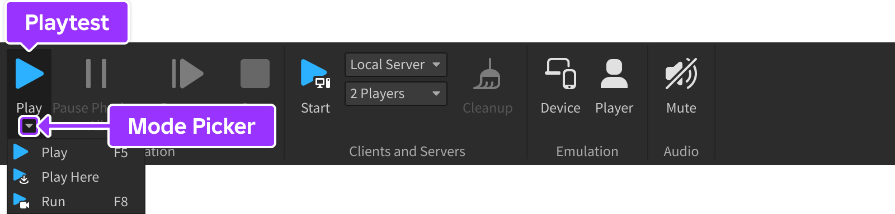

   3. **실행**을 선택합니다. Studio는 3D 공간에서 아바타 없이 현재 카메라 위치에서 경험을 시뮬레이션합니다.

   <!-- <video controls src="../img/05_04_Creating_Spinning_Objects/AV-Constraint-2.mp4" width="80%"></video> -->
   [](https://prod.docsiteassets.roblox.com/assets/tutorials/creating-spinning-objects/AV-Constraint-2.mp4)

설정한 토크는 블록의 크기와 환경 내의 반대 물리적 힘에 따라 달라질 수 있습니다. 예를 들어, 샘플 경험의 `AngularVelocity` 제약 속성은 기본 크기 `4, 1, 2`의 블록 파트, 플라스틱 재질의 평평한 플랫폼, 고전적인 중력 설정 환경에 맞게 작동합니다.

그러나 블록이 더 큰 크기이고 잔디 지형에 있다면, 블록의 질량과 환경의 마찰을 극복하기 위해 `AngularVelocity.MaxTorque` 속성을 증가시켜야 합니다. 예를 들어, 샘플의 파트보다 4배 큰 블록 파트는 설정된 각속도에 도달하기 위해 최소 `300000` Rowton-studs의 일정 각힘이 필요합니다!

<!-- <video controls src="../img/05_04_Creating_Spinning_Objects/Big-Block.mp4" width="80%"></video> -->
[](https://prod.docsiteassets.roblox.com/assets/tutorials/creating-spinning-objects/Big-Block.mp4)

### HingeConstraint 제약 사용

`HingeConstraint` 객체는 두 부착물이 동일한 축을 중심으로 회전하도록 하는 [기계적 제약](https://create.roblox.com/docs/physics/mechanical-constraints)의 일종으로, 부착물이 동일한 위치와 방향을 유지합니다. `HingeConstraint.ActuatorType`을 **Motor**로 설정하면, 이 제약은 두 부착물에 각힘을 가하여 일정한 각속도에 도달하고 유지하려고 합니다.

<!-- <video controls src="../img/05_04_Creating_Spinning_Objects/Hinge-ActuatorType-Motor.mp4" alt="모터 동작으로 구성된 각파워를 보여주는 비디오" width="60%"></video> -->
[](https://prod.docsiteassets.roblox.com/assets/tutorials/creating-spinning-objects/Hinge-ActuatorType-Motor.mp4)

더욱이, 두 개체로 구성된 어셈블리에 부착물을 배치하면, 부착물의 고정된 주축에 따라 함께 회전하려고 합니다. 이러한 개체 중 하나를 고정하면, 각힘은 나머지 어셈블리가 정지된 상태에서 다른 개체를 일정한 각속도로 계속 회전시킵니다.

예를 들어, 어셈블리 내의 특정 개체를 회전시키려면, `HingeConstraint` 제약은 다음을 알아야 합니다:

- 부착물이 겹칠 위치
- 각힘을 가할 지점과 방향
- 부착물이 초당 회전할 라디안의 양
- 부착물이 일정한 각속도에 도달하기 위해 엔진이 가할 수 있는 최대 토크

이 과정을 시연하기 위해, Workspace에 두 개체로 구성된 프로펠러 어셈블리를 추가하고, `HingeConstraint` 제약이 부착물을 참조하여 프로펠러를 Y 축을 따라 초당 `3` 라디안(약 초당 반 바퀴)으로 회전시키면서 프로펠러의 기본을 고정된 상태로 유지합니다.

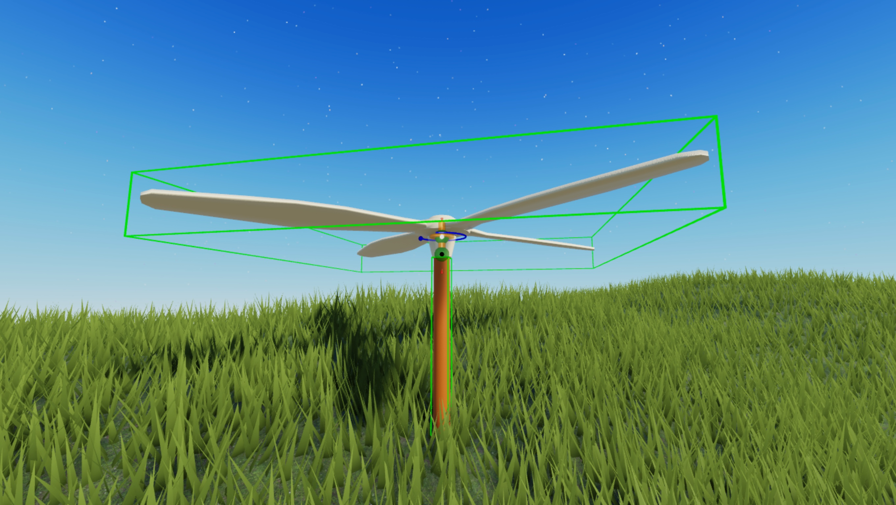

#### 프로펠러 자산 가져오기

**크리에이터 스토어**는 Roblox와 Roblox 커뮤니티에서 만든 모든 자산을 프로젝트 내에서 사용할 수 있도록 찾을 수 있는 도구 상자의 탭입니다. 여기에는 모델, 이미지, 메시, 오디오, 플러그인, 비디오 및 글꼴 자산이 포함됩니다. 크리에이터 스토어를 사용하여 개별 자산이나 자산 라이브러리를 열려 있는 경험에 직접 추가할 수 있습니다.

이 튜토리얼에서는 `HingeConstraint` 기법의 단계를 복제할 때 사용할 수 있는 프로펠러 모델을 참조합니다. [다음 페이지](https://create.roblox.com/store/asset/16558528602)에서 **모델 획득** 링크를 클릭하여 이 모델을 Studio 내 인벤토리에 추가할 수 있습니다. 인벤토리에 있는 자산은 플랫폼의 모든 프로젝트에서 재사용할 수 있습니다.

경험에서 인벤토리에서 이 프로펠러 자산을 가져오려면:

1. 메뉴 모음에서 **보기** 탭을 선택합니다.
2. **표시** 섹션에서 **도구 상자**를 클릭합니다. **도구 상자** 창이 표시됩니다.

   

3. **도구 상자** 창에서 **인벤토리** 탭을 클릭합니다. **내 모델** 정렬이 표시됩니다.

   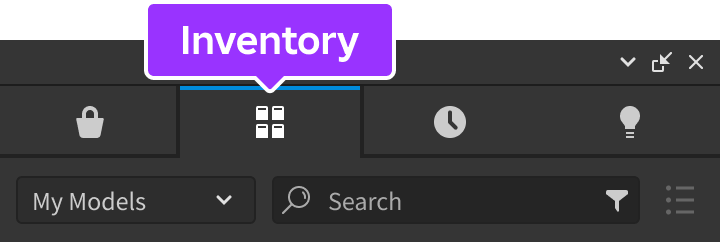

4. **프로펠러** 타일을 클릭합니다. 모델이 뷰포트에 표시됩니다.

   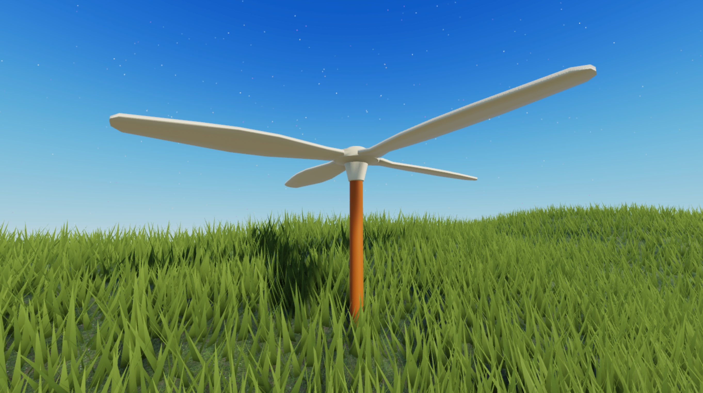

#### 부착물 구성

어셈블리 내 특정 개체의 회전 이동 방향을 지정하려면, 두 개의 `Attachment` 객체를 어셈블리에 추가한 다음, 3D 공간에서 정렬과 방향을 구성할 수 있습니다.

샘플 [회전하는 물체](https://www.roblox.com/games/16550477904/Spinning-Objects) 경험은 고정되지 않은 프로펠러가 고정된 기본과 겹치는 위치 근처에 두 개의 부착물을 정렬하고, 주 회전축이 위로 향하도록 설정하여 시계 반대 방향으로 회전하도록 구성합니다. 이 예제에서는 기본 부착물이 고정되어 있기 때문에 회전할 수 없습니다.

힌지 제약을 위한 부착물을 구성하려면:

1. **Head**와 **Base**에 `Class.Attachment` 객체를 삽입합니다.
   1. **탐색기** 창에서 **Head**를 마우스 오버하고 ⊕ 버튼을 클릭합니다. 컨텍스트 메뉴가 표시됩니다.
   2. 메뉴에서 **부착물**을 삽입합니다.
   3. **Base**에 대해 이 과정을 반복합니다.
   4. 두 부착물의 이름을 각각 **HeadAttachment**와 **BaseAttachment**로 변경합니다.

   

2. **HeadAttachment**와 **BaseAttachment**의 회전축이 Y 축을 따라 위로 향하도록 회전합니다. 이는 Studio에 부착물을 시계 반대 방향으로 회전시키도록 지시합니다.

   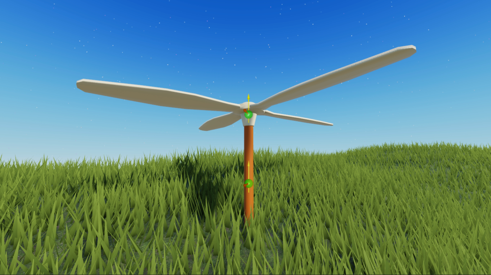

3. **Base**의 상단에 **BaseAttachment**를 이동하고, **Propeller**의 하단 가장자리에 **HeadAttachment**를 이동합니다. 이는 Studio에 부착물을 연결할 위치와 런타임에 부착물을 겹치도록 지시합니다.

   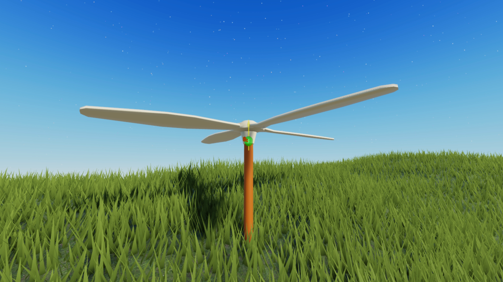

#### 제약 구성

이제 부착물이 겹칠 위치와 회전 이동 방향이 지정되었으므로, `HingeConstraint` 제약의 속성을 구성하여 부착물이 초당 회전할 라디안의 양과 부착물이 일정한 각속도에 도달하기 위해 엔진이 가할 수 있는 최대 토크를 지정할 수 있습니다.

이전 기술과 유사하게, 샘플 [회전하는 물체](https://www.roblox.com/games/16550477904/Spinning-Objects) 경험은 최대 1000 Rowton-studs의 일정 각힘을 가하여 부착물을 Y 축을 따라 초당 `3` 라디안으로 회전시킵니다. 그러나 기본 부착물이 고정된 개체에 있기 때문에 프로펠러의 부착물만 회전할 수 있습니다.

힌지 제약을 구성하려면:

1. **Head**에 `HingeConstraint` 객체를 삽입합니다.
   1. **탐색기** 창에서 **Head**를 마우스 오버하고 ⊕ 아이콘을 클릭합니다. 컨텍스트 메뉴가 표시됩니다.
   2. 컨텍스트 메뉴에서 **HingeConstraint**를 삽입합니다.
2. 프로펠러의 부착물을 새 제약에 할당하여 프로펠러가 고정된 기본에 대해 회전하도록 합니다.
   1. **탐색기** 창에서 제약을 선택합니다.
   2. **속성** 창에서
      1. **Attachment0**를 **BaseAttachment**로 설정합니다.
      2. **Attachment1**을 **HeadAttachment**로 설정합니다. 힌지가 뷰포트에 표시됩니다.

   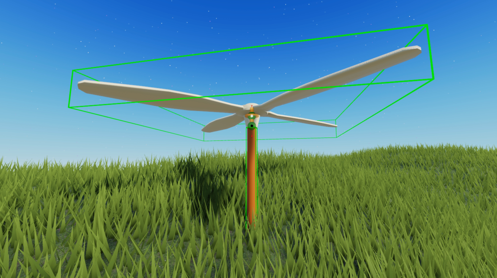

3. **탐색기** 창에서 제약을 선택한 다음, **속성** 창에서
   1. **ActuatorType**을 **Motor**로 설정합니다. 새로운 속성 필드가 표시됩니다.
   2. 목표 각속도에 도달하기 위해 최대 1000 Rowton-studs의 일정 각힘을 가하기 위해 **MotorMaxTorque**를 `1000`으로 설정합니다.
   3. 프로펠러의 헤드를 초당 3 라디안 회전시키기 위해 **AngularVelocity**를 `3`으로 설정합니다.

   

4. 설정한 토크가 프로펠러를 Y 축을 따라 초당 3 라디안 회전시키는지 확인합니다.
   1. 메뉴 모음에서 **테스트** 탭으로 이동합니다.
   2. **시뮬레이션** 섹션에서 **모드 선택기**를 클릭합니다. 드롭다운 메뉴가 표시됩니다.

      

   3. **실행**을 선택합니다. Studio는 3D 공간에서 아바타 없이 현재 카메라 위치에서 경험을 시뮬레이션합니다.

   <!-- <video controls src="../img/05_04_Creating_Spinning_Objects/HC-Hinge-3.mp4" width="80%"></video> -->
   [](https://prod.docsiteassets.roblox.com/assets/tutorials/creating-spinning-objects/HC-Hinge-3.mp4)

## 초기 각힘 적용

물체의 각속도를 변경하는 또 다른 방법은 초기 각힘을 가하는 것입니다. 각힘을 가한 후, 마찰과 같은 반대 힘이 있으면 물체는 감속하여 정지하고, 반대 힘이 없으면 일정한 속도로 계속 회전합니다.

이 기술은 강한 바람과 같은 중요한 게임플레이나 날씨 이벤트 후에 물체를 회전시키는 데 유용합니다. 이는 플레이어에게 즉각적인 피드백을 제공합니다. 다음 하위 섹션에서는 초기 랜덤 각힘으로 어셈블리를 회전시키는 방법을 배웁니다. 이 값을 변경하여 자신의 게임플레이 요구사항에 맞출 수 있습니다.

### ApplyAngularImpulse 사용

`ApplyAngularImpulse` 메서드는 초기 각속도를 얻기 위해 전체 어셈블리에 토크를 가합니다. 각힘을 가한 후, 반대 힘이 있을 때는 감속하여 멈추고, 없을 때는 일정한 속도로 회전합니다. 어셈블리를 회전시키려면, 메서드는 다음을 알아야 합니다:

- 회전시킬 어셈블리
- 초기 각속도에 도달할 축
- 각 축에 가할 토크의 양

이 모든 값을 스크립트에서 정의할 수 있습니다. 예를 들어, 샘플 스크립트는 스크립트의 부모를 회전시킬 어셈블리로 정의하고, Y 축에서 `0`에서 `100` 사이의 랜덤 각힘을 가합니다.

`ApplyAngularImpulse`를 사용하여 어셈블리를 회전시키려면:

1. **Workspace**에 **구** 파트를 삽입합니다. 샘플에서는 구의 이동을 명확히 시각화하기 위해 `MaterialVariant`를 사용합니다.

   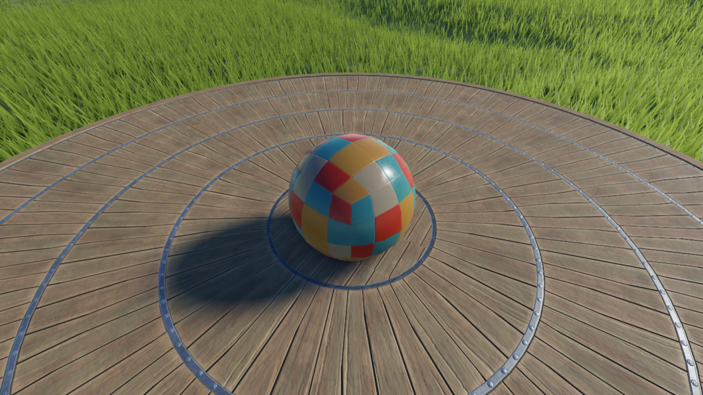

2. 새 파트에 스크립트를 삽입합니다.
   1. **탐색기** 창에서 파트를 마우스 오버하고 ⊕ 버튼을 클릭합니다. 컨텍스트 메뉴가 표시됩니다.
   2. 메뉴에서 **스크립트**를 삽입합니다.
3. 기본 코드를 다음 코드로 대체합니다:

``` lua

local part = script.Parent
local impulse = Vector3.new(0, math.random(0, 100), 0)
part:ApplyAngularImpulse(impulse)

```

   <!-- <video controls src="../img/05_04_Creating_Spinning_Objects/Impulse-3.mp4" width="80%"></video> -->
   [](https://prod.docsiteassets.roblox.com/assets/tutorials/creating-spinning-objects/Impulse-3.mp4)

---
## 출처
 - [Creating Spinning Objects](https://create.roblox.com/docs/tutorials/3D-art/creating-spinning-objects)

---
## [다음](./05_05_Creating_Elevators.md)