# Creating Elevators

## 목차
- [Creating Elevators](#creating-elevators)
  - [목차](#목차)
  - [플랫폼과 트랙 만들기](#플랫폼과-트랙-만들기)
  - [프리즈매틱 제약 구성](#프리즈매틱-제약-구성)
    - [프리즈매틱 제약 및 부착물 만들기](#프리즈매틱-제약-및-부착물-만들기)
    - [부착물 정렬](#부착물-정렬)
    - [프리즈매틱 제약 값 설정](#프리즈매틱-제약-값-설정)
  - [근접 프롬프트 만들기](#근접-프롬프트-만들기)
  - [엘리베이터 움직임 스크립팅](#엘리베이터-움직임-스크립팅)
  - [출처](#출처)

---

**엘리베이터**는 사용자가 경험의 한 부분에서 다른 부분으로 이동할 수 있도록 하는 플랫폼입니다. 이 장치는 사용자가 만든 세계에서 새로운 영역에 도달할 수 있도록 할 때 유용합니다. 이 가이드에서는 사용자가 근접 프롬프트와 상호 작용할 때 상하로 이동하는 엘리베이터를 빠르게 만드는 방법을 배울 수 있습니다.

<video controls src="../img/05_05_Creating_Elevators/Overview.mp4" width="50%"></video>

이 엘리베이터를 만드는 방법에서는 다음 섹션을 따라 다음을 배우십시오:

- 기본 부품을 사용하여 사용자가 서 있을 플랫폼과 위아래로 이동할 수 있는 트랙을 만듭니다.
- `PrismaticConstraint`를 구성하여 플랫폼의 움직임을 제어합니다.
- 사용자가 플랫폼의 움직임을 시작할 수 있도록 `ProximityPrompt`를 만듭니다.
- 엘리베이터의 모든 구성 요소를 연결하고 플랫폼이 트랙을 따라 이동할 수 있도록 하는 `Script`를 만듭니다.

## 플랫폼과 트랙 만들기

`Part`는 Roblox의 기본 빌딩 블록으로, 이동, 크기 조정, 회전 및 외관(색상 및 재질 변경)을 커스터마이즈할 수 있습니다. 엘리베이터의 기본을 만들기 위해 기본 부품을 사용하는 것은 플랫폼과 트랙이 기본적인 형태만 필요하기 때문에 유용합니다.

엘리베이터의 플랫폼과 트랙을 만들려면:

1. 메뉴 모음에서 **모델** 탭을 선택합니다.
1. **부품** 섹션에서 드롭다운 화살표를 클릭하고 **블록**을 선택합니다. 사용자가 엘리베이터에서 위아래로 이동할 수 있는 블록 부품이 작업 공간에 표시됩니다.

   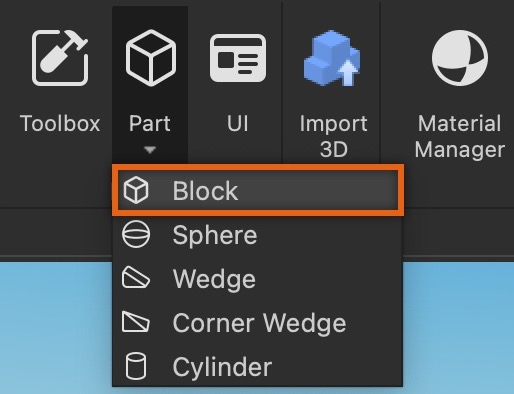

1. **탐색기** 창에서 블록을 선택한 다음 **속성** 창에서,

   1. **이름**을 **Platform**으로 설정합니다.
   2. **크기**를 [8,1,4]로 설정합니다.

2. **탐색기** 창에서 플랫폼을 선택한 다음 <kbd>Ctrl</kbd><kbd>D</kbd> (<kbd>⌘</kbd><kbd>D</kbd>)를 눌러 부품을 복제합니다. 이 복제된 부품은 플랫폼이 위아래로 이동하는 트랙이 됩니다.
3. 메뉴 모음에서 **이동** 도구를 선택한 다음 축 화살표 중 하나를 사용하여 원래 위치에서 복제된 부품을 당겨 두 개체 사이에 작은 간격을 만듭니다.
4. **속성** 창에서,

   1. **이름**을 **Track**으로 설정합니다.
   2. **크기** 속성에서 Y 축을 **20** 스터드 높이로 설정합니다.
   3. **고정됨** 속성을 활성화합니다.

5. **탐색기** 창에서 두 부품을 선택한 다음 <kbd>Ctrl</kbd><kbd>G</kbd> (<kbd>⌘</kbd><kbd>G</kbd>)를 눌러 그룹화합니다.
6. 모델의 이름을 **Elevator**로 변경합니다.

   <GridContainer numColumns="2">
     <figure>
      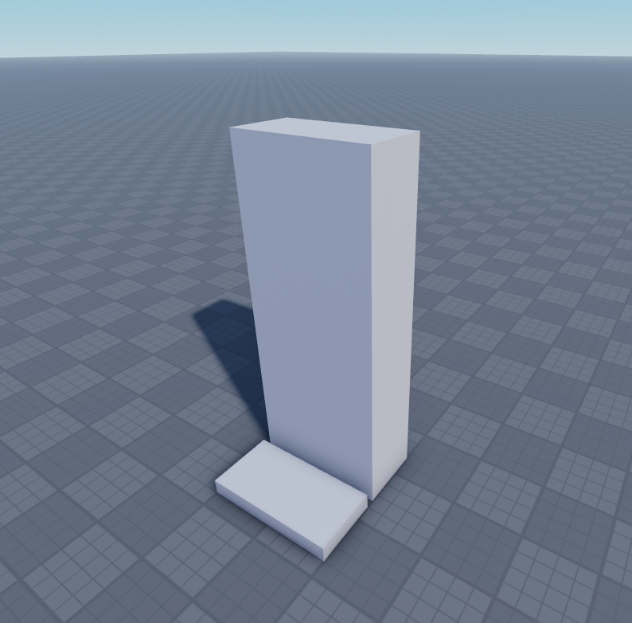
     </figure>
     <figure>
      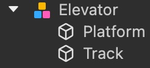
     </figure>
   </GridContainer>
   <figcaption>뷰포트에서 모델은 두 개의 별도 개체로 나타납니다. 탐색기 창에서 모델은 별도의 플랫폼 및 트랙 개체를 포함합니다.</figcaption>

## 프리즈매틱 제약 구성

이제 엘리베이터의 기본을 구성하는 두 개의 부품이 생겼으므로 `PrismaticConstraint`를 만들고 관련 부착물을 정렬하여 플랫폼이 이상적인 경로를 따라 이동하도록 하며, 제약의 값을 설정하여 플랫폼이 트랙을 따라 위아래로 이동할 수 있도록 합니다.

### 프리즈매틱 제약 및 부착물 만들기

`PrismaticConstraint`는 두 개의 `Attachment` 간에 강체 조인트를 생성하여 회전 없이 한 축을 따라 미끄러질 수 있게 합니다. 이 유형의 [제약](https://create.roblox.com/docs/physics/mechanical-constraints)은 플랫폼을 단일 방향으로 유지하면서도 위아래로 이동할 수 있기 때문에 엘리베이터에 이상적입니다.

프리즈매틱 제약 및 부착물을 만들려면:

1. **탐색기** 창에서 **Track**에 프리즈매틱 제약을 삽입합니다.

   1. **Track** 위로 마우스를 가져가고 **⊕** 버튼을 클릭합니다. 컨텍스트 메뉴가 표시됩니다.
   2. 메뉴에서 **PrismaticConstraint**를 삽입합니다.

2. **Track** 및 **Platform**에 부착물을 삽입합니다.

   1. **Track** 위로 마우스를 가져가고 **⊕** 버튼을 클릭합니다. 컨텍스트 메뉴가 표시됩니다.
   2. 메뉴에서 **부착물**을 삽입합니다.
   3. **Platform**에 대해 이 과정을 반복합니다.
   4. 두 부착물의 이름을 각각 **TrackAttachment** 및 **PlatformAttachment**로 변경합니다.

      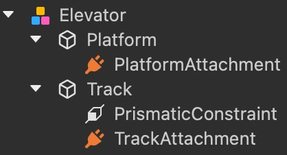

3. **PrismaticConstraint**를 선택합니다.
4. **속성** 창에서 프리즈매틱 제약에 부착물을 할당합니다.

   1. `PrismaticConstraint.Attachment0` 속성을 선택합니다. 커서가 변경됩니다.
   2. **탐색기** 창에서 **TrackAttachment**를 선택합니다.
   3. `PrismaticConstraint.Attachment1` 속성을 선택합니다. 커서가 변경됩니다.
   4. **탐색기** 창에서 **PlatformAttachment**를 선택합니다.

      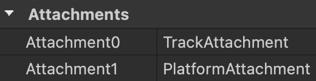

### 부착물 정렬

부착물을 기본 위치에 두면 각 부품이 서로 안으로 당겨지려고 하여 물리적 충돌이 발생하고 엘리베이터가 작동하지 않게 됩니다. 이를 방지하려면 부착물을 부모 부품 외부로 이동하여 플랫폼이 트랙의 외부를 따라 자유롭게 이동할 수 있도록 해야 합니다. 그런 다음, X 및 Z 축을 따라 정렬하여 플랫폼이 Y 축을 따라 위아래로만 이동하도록 합니다.

부착물을 다시 배치하고 정렬하기 전에 제약 세부 사항을 표시하여 뷰포트 내에서 부착물을 볼 수 있도록 설정합니다.

1. 메뉴 모음에서 **모델** 탭으로 이동한 다음 **제약** 섹션으로 이동합니다.
1. 현재 활성화되어 있지 않으면 **제약 세부 사항** 및 **위에 그리기**를 클릭하여 제약 및 부착물 시각적 도움말을 표시합니다.

   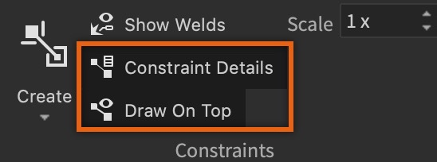

1. 각 부착물의 시각화를 더 크게 하고 싶으면 **크기**를 증가시킵니다.

   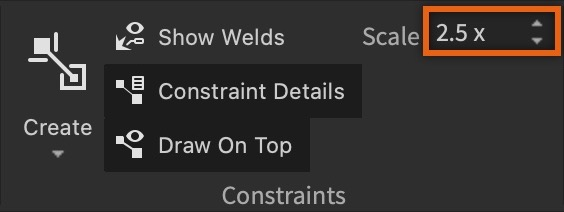

부착물을 시각화하는 것은 제약이 두 부착물을 사용하여 플랫폼을 연결하고 이동시키는 방식을 시각적으로 이해하는 데 중요합니다.

제약의 부착물을 정렬하려면:

1. 메뉴 모음에서 **회전** 도구를 선택하고 **TrackAttachment** 및 **PlatformAttachment**를 회전하여 각 부착물의 노란색 화살표가 Y 축을 따라 위로 향하도록 합니다.

   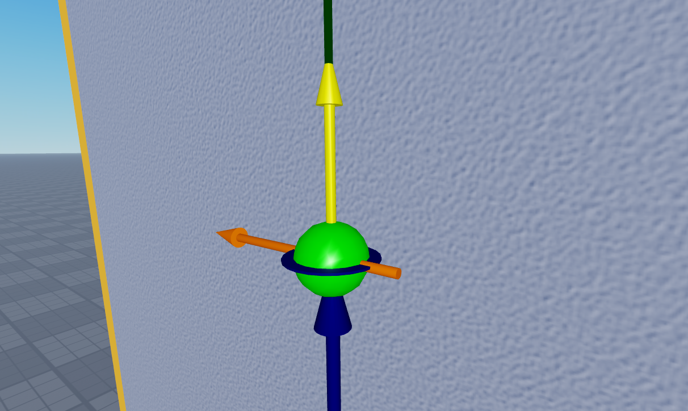

1. **이동** 도구를 선택하고 부착점을 부모 부품 외부로 이동시키고 X 및 Z 축을 따라 정렬합니다.

   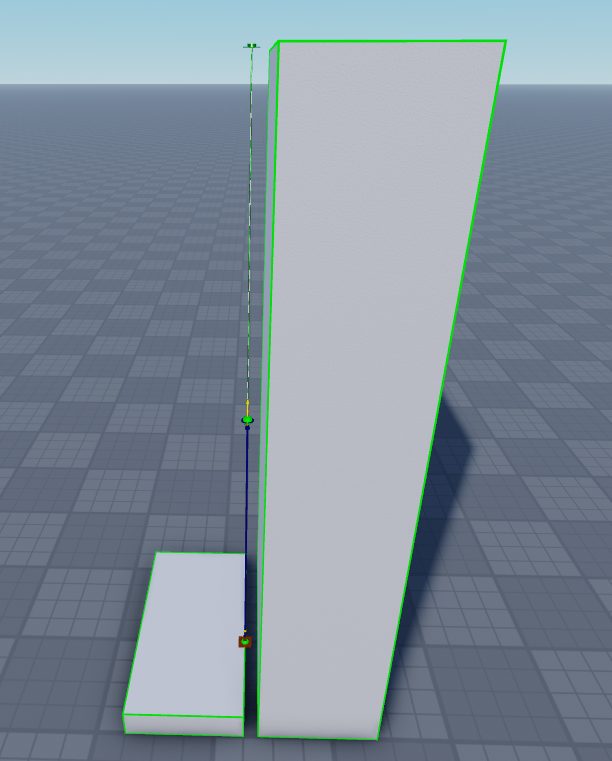

### 프리즈매틱 제약 값 설정

이제 `PrismaticConstraint`가 있고 관련 `Attachment`를 정렬했으므로, 플랫폼이 트랙의 상하 한계를 따라 이동할 수 있도록 하는 제약 값을 설정할 차례입니다. 트랙의 중간에서 10 스터드 위아래로 이동하려면, 제약의 하한과 상한을 각각 `-10` 및 `10`으로 설정해야 합니다.

<GridContainer numColumns="2">
  <figure>
    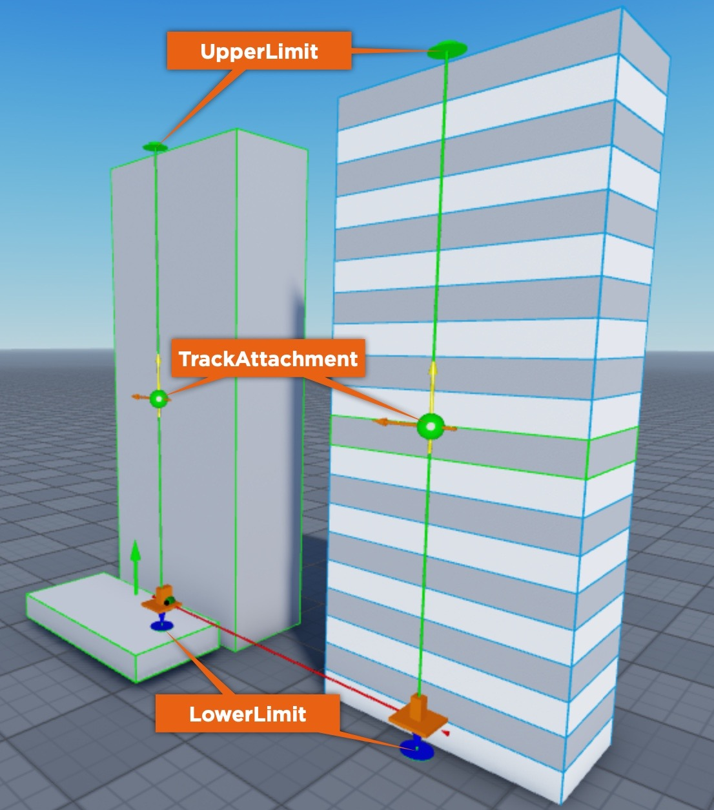
    <figcaption>엘리베이터와 비교하여 트랙이 1 스터드 세그먼트로 나누어져 있어 제약의 하한과 상한을 결정하는 방법을 시각화하는 데 도움이 됩니다.</figcaption>
  </figure>
  <figure>
    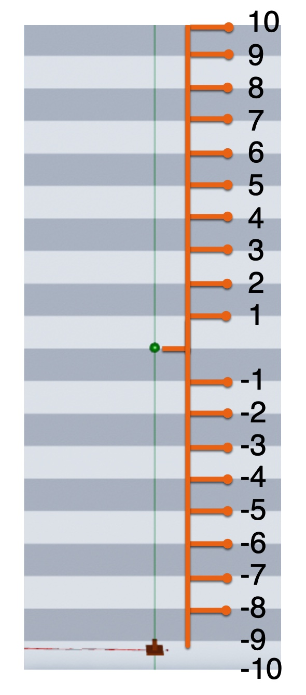
    <figcaption>플랫폼은 사용자를 트랙의 하단에서 상단으로 이동시키기 위해 트랙의 중간에서 10 스터드 위아래로 이동해야 합니다.</figcaption>
  </figure>
</GridContainer>

제약의 값을 설정하여 엘리베이터가 설정된 범위 내에서 이동할 수 있도록 하려면:

1. **탐색기** 창에서 **PrismaticConstraint**를 선택합니다.
1. **속성** 창에서 **슬라이더** 섹션으로 이동한 다음, 서보 스타일 모터로 플랫폼의 이동 범위를 설정할 수 있는 기능을 활성화합니다. 새 속성 필드가 표시됩니다.

   1. **제한 활성화됨**을 **참**으로 설정합니다.
   1. **ActuatorType**을 **Servo**로 설정합니다.

1. **제한** 섹션으로 이동한 다음, 탄성(반동) 없이 플랫폼의 이동 범위를 트랙 중간에서 위아래 10 스터드로 설정합니다. 다음 속성을 설정한 후 하한 및 상한 시각적 도움말이 새 값에 맞게 길어집니다.

   1. **LowerLimit**을 **-10**으로 설정합니다.
   1. **Restitution**을 **0**으로 설정합니다.
   1. **UpperLimit**을 **10**으로 설정합니다.

1. **Servo** 섹션으로 이동하여 플랫폼이 물리적 작용에 저항할 수 있는 무게를 견디고, 위아래로 이동하는 속도가 적당하며, 초기화 지점이 제약의 하한에 있는지 확인합니다.

   1. **ServoMaxForce**를 **10000**으로 설정합니다.
   1. **Speed**를 **10**으로 설정합니다.
   1. **TargetPosition**을 **-10**으로 설정합니다.

## 근접 프롬프트 만들기

`ProximityPrompt`는 사용자가 문, 스위치, 버튼 등의 경험 내 객체에 접근할 때 상호 작용을 유도하여 동작을 트리거하는 객체입니다. 이 과정에서는 사용자가 플랫폼 근처에 있을 때 키를 눌러 엘리베이터의 움직임을 활성화할 수 있는 [근접 프롬프트](https://create.roblox.com/docs/ui/proximity-prompts)를 사용합니다.

근접 프롬프트를 만들려면:

1. **탐색기** 창에서 **Platform** 위로 마우스를 가져가고 **⊕** 버튼을 클릭합니다. 컨텍스트 메뉴가 표시됩니다.
2. 메뉴에서 **ProximityPrompt**를 삽입합니다.

   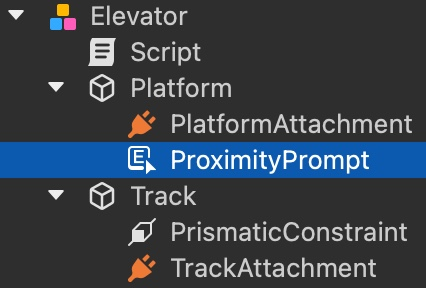

## 엘리베이터 움직임 스크립팅

이제 엘리베이터의 모든 요소가 준비되었으므로, 모든 것을 함께 작동시키고 플랫폼이 트랙을 따라 위아래로 이동하도록 하는 `Script`를 만듭니다.

엘리베이터의 움직임을 스크립팅하려면:

1. **탐색기** 창에서 **Elevator** 위로 마우스를 가져가고 **⊕** 버튼을 클릭합니다. 컨텍스트 메뉴가 표시됩니다.
1. 메뉴에서 **스크립트**를 삽입합니다.
1. 새 스크립트에 다음 코드를 입력합니다:

```lua
local platform = script.Parent.Platform
local prismaticConstraint = script.Parent.Track.PrismaticConstraint

platform.ProximityPrompt.Triggered:Connect(function(player)
	print(prismaticConstraint.CurrentPosition)
	if prismaticConstraint.CurrentPosition <= -9 then
		prismaticConstraint.TargetPosition = 10
	elseif prismaticConstraint.CurrentPosition >= 9 then
		prismaticConstraint.TargetPosition = -10
	end
end)
```

[경험을 플레이테스트](https://create.roblox.com/docs/studio/test-tab)하고 엘리베이터의 근접 프롬프트를 위한 키를 입력하면 스크립트가 실행되어 플랫폼이 제약의 하단에서 9 스터드 이하인지 또는 상단에서 9 스터드 이상인지 확인합니다. 9 스터드 이하이면 사용자가 근접 프롬프트와 상호 작용할 때 플랫폼이 위로 이동하여 제약의 상한에 도달합니다. 반대로, 9 스터드 이상이면 사용자가 근접 프롬프트와 상호 작용할 때 플랫폼이 아래로 이동하여 제약의 하한에 도달합니다.

---
## 출처
 - [Creating Elevators](https://create.roblox.com/docs/tutorials/3D-art/creating-elevators)
