# Creating an Animation

## 목차
- [Creating an Animation](#creating-an-animation)
  - [목차](#목차)
  - [애니메이션 설정](#애니메이션-설정)
  - [애니메이션 만들기](#애니메이션-만들기)
    - [첫 번째 포즈 (중립)](#첫-번째-포즈-중립)
    - [두 번째 포즈 (쿼치)](#두-번째-포즈-쿼치)
    - [세 번째 포즈 (점프)](#세-번째-포즈-점프)
    - [애니메이션 마무리](#애니메이션-마무리)
  - [애니메이션 게시](#애니메이션-게시)
  - [출처](#출처)
  - [다음](#다음)

---

Roblox Studio에는 게임 캐릭터를 위한 맞춤형 애니메이션을 설계할 수 있는 내장 애니메이션 편집기가 있습니다. 애니메이션 편집기 사용법을 배우기 위해 캐릭터가 승리 점프를 하는 애니메이션을 만들어 보겠습니다. 완료된 후에는 이 애니메이션을 모든 Roblox 아바타에서 재생할 수 있습니다.

<video controls muted>
    <source src="../img/01_01_Creating_an_Animation/intro-to-animations-victoryPoseFinal.mp4" />
</video>

## 애니메이션 설정

애니메이션을 시작하기 전에 포즈를 취할 수 있는 캐릭터 리그를 만들고 편집기에서 새 애니메이션 파일의 이름을 지정합니다.

1. 캐릭터 애니메이션을 만들려면 캐릭터 **리그**가 필요합니다. **아바타** 탭에서 **리그 빌더**를 클릭합니다.

   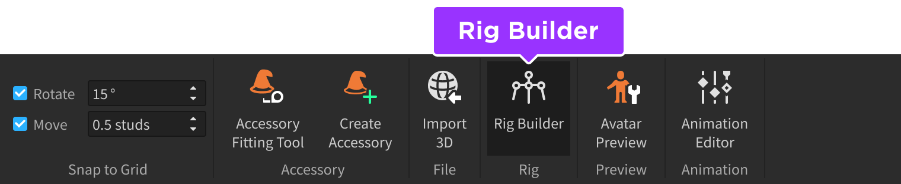

2. 팝업 창에서 **R15**가 선택된 상태에서 **Rthro Normal**을 클릭합니다.

   <GridContainer numColumns="2">
     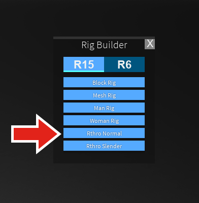
     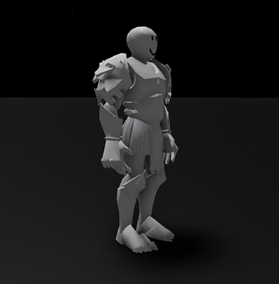
   </GridContainer>

3. 애니메이션 편집기를 열려면 **플러그인** → **애니메이션 편집기**로 이동합니다.

   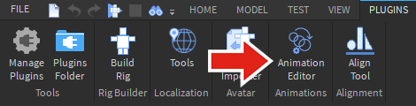

4. **리그**를 선택합니다. 애니메이션 편집기 창에서 이름을 입력하고 **생성**을 클릭합니다.

   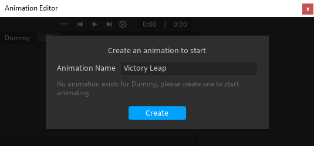

## 애니메이션 만들기

승리 점프 애니메이션은 각 부분의 위치 정보를 저장하는 일련의 **키프레임**으로 구성됩니다. 총 1초 길이의 애니메이션은 점프의 각 포즈에 대해 네 개의 키프레임을 가집니다.

<!-- <Grid container spacing={3}>
    <Grid item xs={3}>
    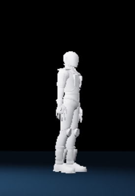
    <b>중립</b>
    </Grid>
    <Grid item xs={3}>
    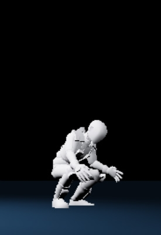
    <b>쿼치</b>
    </Grid>
    <Grid item xs={3}>
    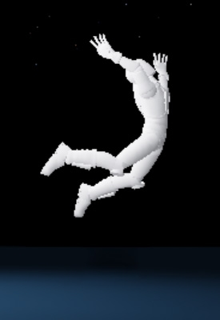
    <b>점프</b>
    </Grid>
    <Grid item xs={3}>
    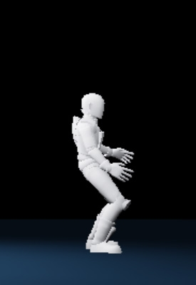
    <b>착지</b>
    </Grid>
</Grid> -->

|중립|쿼치|점프|착지|
|---|---|---|---|
|||||

### 첫 번째 포즈 (중립)

첫 번째 포즈는 캐릭터가 휴식 중인 **중립** 포즈입니다. 시작하려면 리그의 현재 포즈에 키프레임을 설정합니다.

1. 리그가 선택되어 있는지 확인합니다. 그런 다음 애니메이션 편집기에서 **+** 버튼을 클릭합니다. **모두 추가**를 선택하여 편집기에 리그의 모든 부품을 포함시킵니다.

   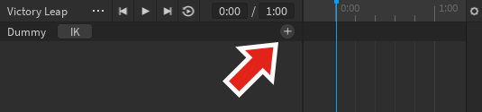

2. 타임라인 아래의 상단 막대를 마우스 오른쪽 버튼으로 클릭하고 **키프레임 추가**를 선택하여 중립 포즈를 설정합니다. 다이아몬드(키프레임) 세트가 나타납니다.

   <video controls loop muted>
   <source src="../img/01_01_Creating_an_Animation/creating-an-animation-AddKeyframe.mp4" />
   </video>

3. **...** 버튼을 클릭하고 **저장**을 선택하여 애니메이션을 저장합니다.

   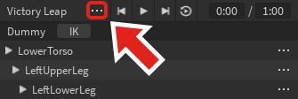

   <Alert severity="warning">
   애니메이션이 게시될 때까지 해당 애니메이션은 게임 장소에 로컬로 저장됩니다. 애니메이션 편집기를 통해 저장하는 것은 게임 자체를 저장하는 것이 아닙니다.
   </Alert>

### 두 번째 포즈 (쿼치)

다음 포즈는 점프하기 전에 캐릭터가 쿼치하는 포즈입니다.

1. 상단 막대를 클릭하여 애니메이션 시간을 길이의 1/3로 설정합니다(예: 0:09).

   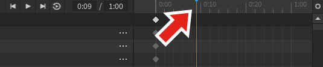

2. 다양한 신체 부위를 선택하고 **회전** 도구를 사용하여 리그를 포즈합니다. 애니메이터가 포즈를 취하는 한 가지 방법은 어깨와 같은 몸통에 연결된 부분부터 시작하여 손과 같은 부분으로 이동하는 것입니다.

   <video controls muted>
       <source src="../img/01_01_Creating_an_Animation/showRotateArms_web.mp4" />
   </video>

   <Alert severity="info">

   모델의 부품을 클릭하는 대신 애니메이션 편집기 계층 구조에서 선택하는 것이 도움이 될 수 있습니다. 특히 손과 같은 작은 부품의 경우에 유용합니다.

   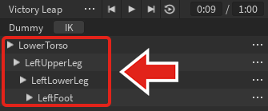

   </Alert>

3. 리그를 이동하려면 <kbd>R</kbd>을 눌러 **이동** 도구로 전환합니다. **LowerTorso** 부품(리그 또는 애니메이션 계층 구조에서)을 클릭하고 몸을 약간 아래로 위치시킵니다.

   <video controls muted>
    <source src="../img/01_01_Creating_an_Animation/showMoveBody.mp4" />
   </video>

4. **이동**과 **회전**을 번갈아 가며 <kbd>R</kbd>을 눌러 리그를 계속 포즈합니다.

   <video controls muted>
    <source src="../img/01_01_Creating_an_Animation/showPose2TimeLapse_optimized.mp4" />
   </video>

### 세 번째 포즈 (점프)

1. 상단 막대를 클릭하여 애니메이션 시간을 중간으로 설정합니다.

   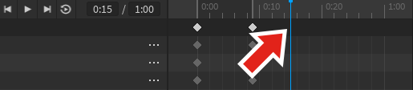

   <Alert severity="info">

   정확한 시간은 위치 표시기 첫 번째 상자에 입력할 수 있습니다.

   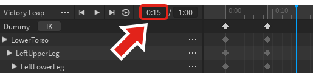

   </Alert>

2. **회전**과 **이동**을 사용하여 아래와 같은 포즈를 만듭니다.

<GridContainer numColumns="2">
  <figure>
    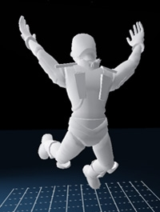
    <figcaption>앞에서 본 모습</figcaption>
  </figure>
  <figure>
    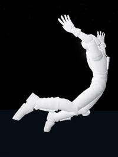
    <figcaption>측면 각도에서 본 모습</figcaption>
  </figure>
</GridContainer>

### 애니메이션 마무리

시간을 절약하고 애니메이션 루프 간 전환을 위해 마지막 포즈는 첫 번째 중립 포즈의 복사본이 됩니다. 그런 다음, 포즈를 그대로 두거나 더 흥미로운 애니메이션을 위해 조정할 수 있습니다.

1. 타임라인에서 첫 번째 포즈의 상단 키프레임(다이아몬드 기호)을 선택합니다. 각 부분의 키프레임이 선택되는 것을 확인합니다. 모든 키프레임을 선택한 후 복사 <kbd>Ctrl</kbd><kbd>C</kbd> (<kbd>⌘</kbd><kbd>C</kbd>).

   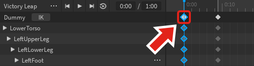

2. 타임라인을 클릭하여 애니메이션의 **끝**으로 이동합니다(예: 1:00). 그런 다음 <kbd>Ctrl</kbd><kbd>V</kbd> (<kbd>⌘</kbd><kbd>V</kbd>)를 사용하여 키프레임을 붙여넣습니다. 원하는 경우, 애니메이션에 더 많은 디테일을 추가하기 위해 포즈를 조정하는 시간을 가집니다.

   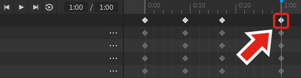

3. 애니메이션이 완료되면 **루프**를 켜고 **재생**을 누릅니다.

   <video controls muted>
    <source src="../img/01_01_Creating_an_Animation/showFinalVictoryPose_simple.mp4" />
   </video>

## 애니메이션 게시

완성된 애니메이션은 게임에서 재생하려면 게시해야 합니다.

1. 애니메이션 편집기 창의 왼쪽

 상단에 있는 **점 세 개** 버튼을 클릭합니다.

   

1. 컨텍스트 메뉴에서 **Roblox에 게시**를 선택합니다. **자산 구성** 창이 표시됩니다.

1. 모든 관련 필드를 작성한 다음 **저장** 버튼을 클릭합니다.

1. **복사** 아이콘을 클릭하여 ID를 복사합니다. "ID 복사됨!"이라는 초록색 텍스트가 표시됩니다.

   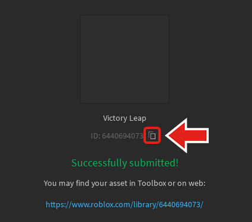

   <Alert severity="info">
   애니메이션 ID를 찾는 방법이 필요하다면 아래 과정을 따르세요.

   1. [애니메이션](https://www.roblox.com/develop?View=24) 섹션의 만들기 페이지를 엽니다.
   2. 게시된 애니메이션을 찾아 클릭합니다.
   3. 브라우저의 URL에서 ID를 복사합니다.

   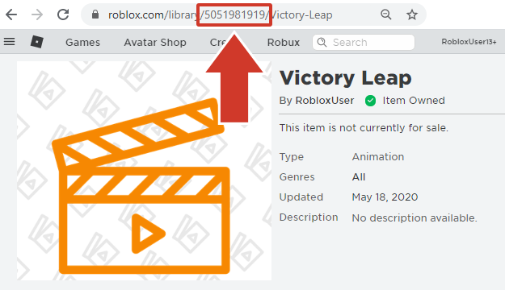
   </Alert>

복사된 ID는 이제 [아바타 애니메이션 스크립팅](https://create.roblox.com/docs/tutorials/building/animation/scripting-avatar-animations) 과정에서 탐색한 대로 Roblox 애니메이션에서 사용할 수 있습니다. 또한 애니메이션에 대한 추가 정보는 [애니메이션 가이드](https://create.roblox.com/docs/animation)를 참조하십시오.

---
## 출처
 - [Creating an Animation](https://create.roblox.com/docs/tutorials/building/animation/creating-an-animation)

---
## [다음](./01_02_Scripting_Avatar_Animations.md)