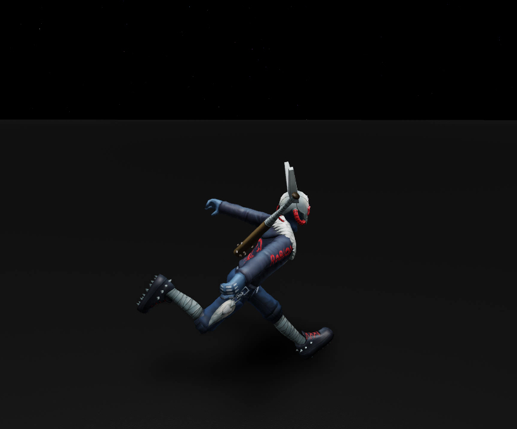
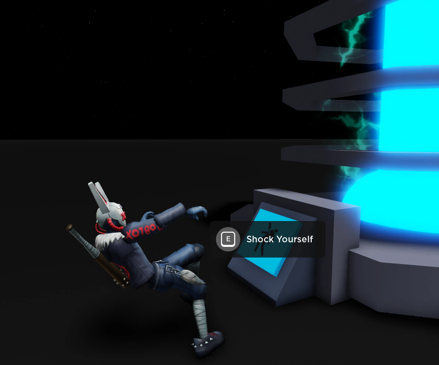
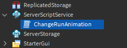
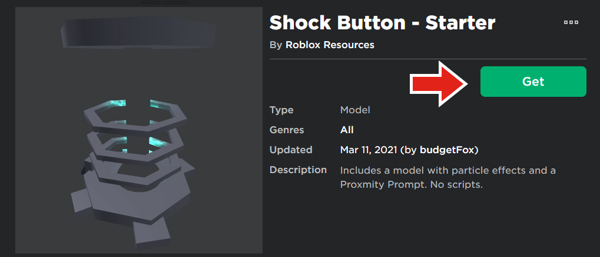
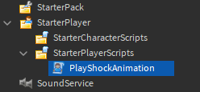

# Scripting Avatar Animations

## 목차
- [Scripting Avatar Animations](#scripting-avatar-animations)
  - [목차](#목차)
  - [기본 애니메이션 변경](#기본-애니메이션-변경)
    - [스크립트 설정](#스크립트-설정)
    - [애니메이션 교체](#애니메이션-교체)
  - [애니메이션 재생](#애니메이션-재생)
    - [설정](#설정)
    - [애니메이션 생성 및 로드](#애니메이션-생성-및-로드)
    - [애니메이션 재생](#애니메이션-재생-1)
    - [이벤트와 함께 애니메이션 사용](#이벤트와-함께-애니메이션-사용)
  - [출처](#출처)
  - [다음](#다음)

---

스크립트를 사용하여 기본 애니메이션을 업데이트하고 새로운 애니메이션을 추가할 수 있습니다. 이 튜토리얼에서 다룰 두 가지 예는 기본 달리기 애니메이션을 변경하고 플레이어가 객체를 터치할 때 애니메이션을 재생하는 방법입니다.

<GridContainer numColumns="2">
  <figure>
    
    <figcaption>기본 달리기 애니메이션 변경</figcaption>
  </figure>
  <figure>
    
    <figcaption>명령에 따른 애니메이션 재생</figcaption>
  </figure>
</GridContainer>

## 기본 애니메이션 변경

기본적으로 Roblox 캐릭터는 달리기, 등반, 점프와 같은 일반 애니메이션을 포함합니다. 첫 번째 예제에서는 기본 달리기 애니메이션을 더 독특한 애니메이션으로 교체하는 스크립트를 작성합니다. 연습할 달리기 애니메이션이 없다면 제공된 예제 애니메이션을 사용할 수 있습니다.

<!-- <video controls loop muted>
    <source src="../img/01_02_Scripting_Avatar_Animations/Using-Animations-FinalDefaultRunExample.mp4" />
</video> -->
[](https://prod.docsiteassets.roblox.com/assets/tutorials/scripting-avatar-animations/Using-Animations-FinalDefaultRunExample.mp4)

### 스크립트 설정

애니메이션 교체가 모든 플레이어에게 적용되도록 스크립트는 ServerScriptService에 저장됩니다.

1. **ServerScriptService**에 **ChangeRunAnimation**이라는 새 스크립트를 만듭니다.

   

2. 스크립트에서 두 개의 변수를 만듭니다:

   - `Class.Players` - 게임에 참가하는 플레이어에 접근할 수 있게 해주는 Players 서비스를 가져옵니다.
   - `runAnimation` - 사용할 애니메이션의 ID를 설정합니다. ID는 애니메이션 생성 시 만든 것 또는 아래 카드에서 찾을 수 있는 것을 사용합니다.

   ```lua
   local Players = game:GetService("Players")
   local runAnimation = "rbxassetid://656118852"
   ```

3. 아래 강조된 코드를 복사합니다. 플레이어가 `PlayerAdded`를 통해 게임에 참가하면 스크립트는 아바타가 로드되었는지 확인합니다. 다음 섹션에서는 `onCharacterAdded` 함수에 애니메이션 교체 코드를 추가합니다.

```lua
local Players = game:GetService("Players")
local runAnimation = "rbxassetid://616163682"

local function onCharacterAdded(character)

end

local function onPlayerAdded(player)
    player.CharacterAppearanceLoaded:Connect(onCharacterAdded)
end

Players.PlayerAdded:Connect(onPlayerAdded)
```

달리기 애니메이션이 필요하면 다음 예제 ID 중 하나를 사용하세요. 추가 카탈로그 애니메이션은 [애니메이션 사용](https://create.roblox.com/docs/animation/using#catalog-animation-reference) 페이지에서 찾을 수 있습니다.

<table>
  <thead>
    <tr>
      <th>애니메이션</th>
      <th>ID</th>
    </tr>
  </thead>
  <tbody>
      <tr>
      <td>
      닌자 런
      </td>
      <td>
      656118852
      </td>
      </tr>
      <tr>
      <td>
      웨어울프 런
      </td>
      <td>
      1083216690
      </td>
      </tr>
      <tr>
      <td>
      좀비 런
      </td>
      <td>
      616163682
      </td>
      </tr>
  </tbody>
</table>

### 애니메이션 교체

기본 애니메이션은 플레이어의 **Humanoid** 객체를 통해 접근할 수 있습니다. 이 경우, 휴머노이드를 사용하여 달리기 애니메이션을 찾아서 새 애니메이션 ID로 교체합니다.

1. `onCharacterAdded`에서 휴머노이드를 저장할 변수를 만듭니다.

   ```lua
   local Players = game:GetService("Players")
   local runAnimation = "rbxassetid://616163682"

   local function onCharacterAdded(character)
       local humanoid = character:WaitForChild("Humanoid")
   end

   local function onPlayerAdded(player)
       player.CharacterAppearanceLoaded:Connect(onCharacterAdded)
   end

   Players.PlayerAdded:Connect(onPlayerAdded)
   ```

2. 휴머노이드에 연결된 **Animate**라는 스크립트에 기본 애니메이션이 포함되어 있습니다. 이를 **animateScript**라는 변수에 저장합니다.

   ```lua
   local Players = game:GetService("Players")
   local runAnimation = "rbxassetid://616163682"

   local function onCharacterAdded(character)
       local humanoid = character:WaitForChild("Humanoid")

       local animateScript = character:WaitForChild("Animate")
   end

   local function onPlayerAdded(player)
       player.CharacterAppearanceLoaded:Connect(onCharacterAdded)
   end

   Players.PlayerAdded:Connect(onPlayerAdded)

   ```

3. 점 연산자를 사용하여 다양한 애니메이션에 접근할 수 있습니다. 예를 들어, `animateScript.run`처럼 접근합니다. 달리기 애니메이션을 변경하려면 `runAnimation`에 저장된 애니메이션 ID로 설정합니다.

   ```lua
   local Players = game:GetService("Players")
   local runAnimation = "rbxassetid://616163682"

   local function onCharacterAdded(character)
       local humanoid = character:WaitForChild("Humanoid")

       local animateScript = character:WaitForChild("Animate")
       animateScript.run.RunAnim.AnimationId = runAnimation
   end

   local function onPlayerAdded(player)
       player.CharacterAppearanceLoaded:Connect(onCharacterAdded)
   end

   Players.PlayerAdded:Connect(onPlayerAdded)
   ```

   <Alert severity="info">

   변경할 수 있는 다른 일반 애니메이션은 다음과 같습니다:

   - `animateScript.climb.ClimbAnim`
   - `animateScript.sit.SitAnim`
   - `animateScript.fall.FallAnim`
   - `animateScript.swim`
   - `animateScript.idle.Animation1`
   - `animateScript.walk.WalkAnim`

   각 애니메이션에 접근할 때 끝에 `.AnimationId`를 추가하는 것을 잊지 마세요. 다른 기본 애니메이션을 변경하는 방법에 대한 전체 가이드는 [애니메이션 사용](https://create.roblox.com/docs/animation/using#replacing-default-animations) 기사를 참조하세요.

   </Alert>

4. 게임을 테스트하고 기본 달리기 애니메이션이 변경되었는지 확인합니다.

<!-- <video controls loop muted>
    <source src="../img/01_02_Scripting_Avatar_Animations/Using-Animations-FinalDefaultRunExample.mp4" />
</video> -->
[](https://prod.docsiteassets.roblox.com/assets/tutorials/scripting-avatar-animations/Using-Animations-FinalDefaultRunExample.mp4)

## 애니메이션 재생

애니메이션을 사용하는 두 번째 방법은 게임 내 캐릭터의 동작에 반응하여 애니메이션을 재생하는 것입니다. 예를 들어, 플레이어가 아이템을 집거나 데미지를 받을 때 애니메이션을 재생할 수 있습니다.

다음 스크립트에서는 플레이어가 버튼을 누를 때마다 충격 애니메이션이 재생되며 애니메이션이 끝날 때까지 플레이어를 마비시킵니다.

<!-- <video controls loop muted>
    <source src="../img/01_02_Scripting_Avatar_Animations/Using-Animations-FinalEventAnimation.mp4" />
</video> -->
[](https://prod.docsiteassets.roblox.com/assets/tutorials/scripting-avatar-animations/Using-Animations-FinalEventAnimation.mp4)

### 설정

이 튜토리얼의 나머지 부분에서는 [근접 프롬프트](https://create.roblox.com/docs/tutorials/building/ui/proximity-prompts)를 포함한 미리 만들어진 모델을 사용합니다. 플레이어는 버튼에 다가가서 이벤트를 활성화하기 위해 버튼을 누를 수 있습니다.

1. [Shock Button](https://www.roblox.com/library/6505388729/Shock-Button-Starter) 모델을 다운로드하여 스튜디오에 삽입합니다.

   

   <Alert severity="info">

   모델을 인벤토리에 추가하여 모든 게임에서 사용할 수 있습니다.

   1. 브라우저에서 모델 페이지를 열고 **Get** 버튼을 클릭합니다. 이렇게 하면 모델이 인벤토리에 추가됩니다.
   2. 스튜디오에서 **보기** 탭으로 이동하여 **도구 상자**를 클릭합니다.
   3. 도구 상자 창에서 **인벤토리** 버튼을 클릭합니다. 그런 다음 드롭다운이 **내 모델**로 설정되어 있는지 확인합니다.
   4. **Shock Button** 모델을 선택하여 게임에 추가합니다.

    </Alert>

2. **StarterPlayer** > **StarterPlayerScripts**에 **PlayShockAnimation**이라는 로컬 스크립트를 만듭니다.

   

3. 아래 코드는 근접 프롬프트가 활성화될 때 `onShockTrigger`라는

 함수를 호출합니다. **스크립트에 복사**하세요.

```lua
local Players = game:GetService("Players")

local player = Players.LocalPlayer
local character = player.Character or player.CharacterAdded:Wait()

local humanoid = character:WaitForChild("Humanoid")
local Animator = humanoid:WaitForChild("Animator")

local shockButton = workspace.ShockButton.Button
local proximityPrompt = shockButton.ProximityPrompt
local shockParticle = shockButton.ExplosionParticle

local function onShockTrigger(player)
    shockParticle:Emit(100)
end

proximityPrompt.Triggered:Connect(onShockTrigger)
```

<Alert severity="warning">
이 스크립트는 특정 이름의 부품을 사용합니다. 가져온 모델의 부품 이름을 변경하면 스크립트의 변수(12-14행)를 업데이트하세요.
</Alert>

### 애니메이션 생성 및 로드

플레이어가 사용하는 애니메이션은 플레이어의 `Animator` 객체에 저장됩니다. 충격 애니메이션을 재생하려면 플레이어가 게임에 참가할 때 Animator 객체에 새로운 애니메이션 트랙을 로드해야 합니다.

1. `onShockTrigger` 위에 `shockAnimation`이라는 새로운 **Animation** 인스턴스를 만듭니다. 그런 다음 해당 애니메이션의 `AnimationID`를 설정합니다. 필요하면 코드 상자의 ID를 사용하세요.

   ```lua
   local shockButton = workspace.ShockButton.Button
   local proximityPrompt = shockButton.ProximityPrompt
   local shockParticle = shockButton.ExplosionParticle

   local shockAnimation = Instance.new("Animation")
   shockAnimation.AnimationId = "rbxassetid://3716468774"

   local function onShockTrigger(player)

   end
   ```

2. `shockAnimationTrack`라는 새 변수를 만듭니다. 플레이어의 Animator에서 `LoadAnimation`을 호출하고, 이전에 만든 애니메이션을 전달합니다.

   ```lua
   local shockAnimation = Instance.new("Animation")
   shockAnimation.AnimationId = "rbxassetid://3716468774"

   local shockAnimationTrack = Animator:LoadAnimation(shockAnimation)
   ```

3. 새 애니메이션을 로드한 상태에서 트랙의 속성을 몇 가지 변경합니다.

   - `AnimationPriority`를 `Action`으로 설정 - 이 애니메이션이 현재 재생 중인 애니메이션을 덮어쓰도록 합니다.
   - `Looped`를 `false`로 설정하여 애니메이션이 반복되지 않도록 합니다.

   ```lua
   local shockAnimation = Instance.new("Animation")
   shockAnimation.AnimationId = "rbxassetid://3716468774"

   local shockAnimationTrack = Animator:LoadAnimation(shockAnimation)
   shockAnimationTrack.Priority = Enum.AnimationPriority.Action
   shockAnimationTrack.Looped = false
   ```

### 애니메이션 재생

누군가 버튼의 근접 프롬프트를 트리거할 때마다 애니메이션을 재생하고 해당 플레이어를 일시적으로 고정시킵니다.

1. `onShockTrigger` 함수를 찾습니다. `shockAnimationTrack`에서 `Play` 함수를 호출합니다.

   ```lua
   local function onShockTrigger(player)
       shockParticle:Emit(100)

       shockAnimationTrack:Play()
   end
   ```

2. 애니메이션이 재생되는 동안 플레이어가 움직이지 못하게 하려면 휴머노이드의 `WalkSpeed` 속성을 0으로 변경합니다.

   ```lua
   local function onShockTrigger(player)
       shockParticle:Emit(100)

       shockAnimationTrack:Play()
       humanoid.WalkSpeed = 0
   end
   ```

### 이벤트와 함께 애니메이션 사용

부품에 Touched 이벤트가 있는 것처럼 애니메이션에는 `AnimationTrack.Stopped`와 같은 이벤트가 있습니다. 스크립트에서는 애니메이션이 끝나면 플레이어의 이동 속도를 복원합니다.

1. 점 연산자를 사용하여 애니메이션 트랙의 `Stopped` 이벤트에 접근한 다음 `Wait` 함수를 호출합니다. 이는 애니메이션이 끝날 때까지 코드를 일시 정지합니다.

   ```lua
   local function onShockTrigger(player)
       shockParticle:Emit(100)

       shockAnimationTrack:Play()
       humanoid.WalkSpeed = 0
       shockAnimationTrack.Stopped:Wait()
   end
   ```

2. 플레이어의 걷기 속도를 Roblox 플레이어의 기본값인 16으로 되돌립니다.

   ```lua
   local function onShockTrigger(player)
       shockParticle:Emit(100)

       shockAnimationTrack:Play()
       humanoid.WalkSpeed = 0
       shockAnimationTrack.Stopped:Wait()
       humanoid.WalkSpeed = 16
   end
   ```

3. 게임을 테스트하여 부품에 다가가 <kbd>E</kbd>를 눌러 충격을 받습니다.

<!-- <video controls loop muted>
    <source src="../img/01_02_Scripting_Avatar_Animations/Using-Animations-FinalEventAnimation.mp4" />
</video> -->
[](https://prod.docsiteassets.roblox.com/assets/tutorials/scripting-avatar-animations/Using-Animations-FinalEventAnimation.mp4)

이 스크립트의 프레임워크는 다양한 게임 상황에 쉽게 적용할 수 있습니다. 예를 들어, 플레이어가 함정 부품을 터치할 때마다 특수 애니메이션을 재생하거나 팀이 게임 라운드를 이길 때마다 애니메이션을 재생해 보세요.

---
## 출처
 - [Scripting Avatar Animations](https://create.roblox.com/docs/tutorials/building/animation/scripting-avatar-animations)

---
## [다음](./02_01_Introduction_to_Scripting.md)