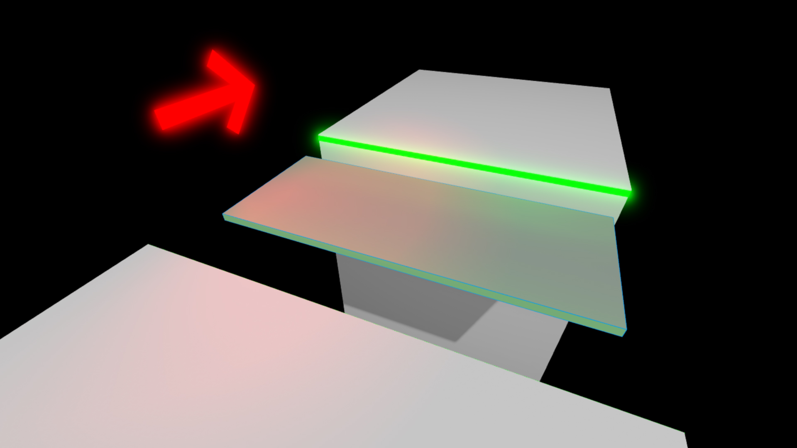
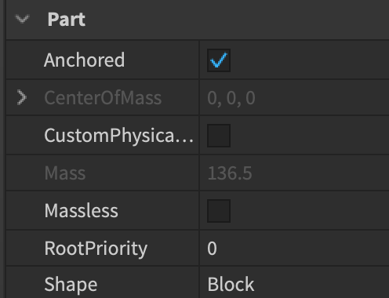
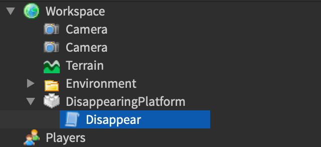

# Introduction to Scripting

## 목차
- [Introduction to Scripting](#introduction-to-scripting)
  - [목차](#목차)
  - [장면 설정](#장면-설정)
  - [스크립트 삽입](#스크립트-삽입)
  - [첫 번째 변수](#첫-번째-변수)
  - [사라짐 함수](#사라짐-함수)
  - [파트 속성](#파트-속성)
  - [함수 호출](#함수-호출)
  - [나타남 함수](#나타남-함수)
  - [코드 반복](#코드-반복)
  - [플랫폼 토글](#플랫폼-토글)
  - [최종 코드](#최종-코드)
  - [출처](#출처)
  - [다음](#다음)

---

Roblox Studio 입문에서는 Roblox Studio에서 파트를 생성하고 조작하는 방법을 배웠습니다. 이번 튜토리얼에서는 **스크립트**를 파트에 적용하여 플랫폼이 나타났다 사라지게 만드는 방법을 배웁니다. 이 기능은 사용자가 점프 타이밍을 맞추어 반대편으로 넘어가도록 하는 플랫폼 게임에서 유용하게 사용할 수 있습니다.

<video controls loop muted>
    <source src="../img/02_01_Introduction_to_Scripting/finishedSinglePlatformShort.mp4" />
</video>

## 장면 설정

우선, 플랫폼 역할을 할 **Part**가 필요합니다. Roblox Studio 입문에서 배운 것처럼 파트를 만들고 이동하는 방법을 기억하세요. 복잡한 월드는 필요하지 않으며, 사용자가 쉽게 점프할 수 없는 간격만 있으면 됩니다.

1. **Part**를 삽입하고 이름을 `DisappearingPlatform`으로 변경합니다.
2. 사용자가 점프할 수 있을 만큼 충분히 크게 크기를 조정합니다.
3. 경험을 테스트할 수 있도록 적절한 위치로 이동시킵니다.

   

4. **Properties** 창에서 **Anchored** 속성을 **true**로 설정합니다.

   

<Alert severity="info">
파트의 Anchored 속성을 **true**로 설정하면 무슨 일이 있어도 제자리에 고정됩니다. 플랫폼이 앵커되지 않으면 떨어집니다.
</Alert>

## 스크립트 삽입

Roblox의 코드는 [Luau](https://create.roblox.com/docs/luau)라는 언어로 작성되며, 이 언어는 **Explorer**의 다양한 컨테이너 내의 스크립트에 넣을 수 있습니다. 파트 아래에 스크립트를 넣으면, Roblox는 파트가 게임에 로드될 때 스크립트의 코드를 실행합니다.

1. **Explorer** 창에서 `DisappearingPlatform` 파트를 마우스로 가리키고 **+** 버튼을 클릭하여 새로운 스크립트를 플랫폼에 삽입합니다. 새 스크립트 이름을 **Disappear**로 변경합니다.

   

2. 기본 코드를 삭제합니다.

<Alert severity="info">

파트와 스크립트를 생성하자마자 **이름을 변경**하여 **Explorer**에서 항목을 잃어버리지 않도록 하세요.

</Alert>

## 첫 번째 변수

스크립트를 시작할 때 플랫폼에 대한 **변수**를 만드는 것이 좋습니다. 변수는 **값**과 연결된 **이름**입니다. 변수를 생성하면 여러 번 사용할 수 있으며 필요에 따라 값을 변경할 수 있습니다.

Luau에서는 변수를 다음과 같이 생성합니다: `local variableName = variableValue`.

`local`이라는 용어는 변수가 선언된 스크립트 블록 내에서만 사용된다는 것을 의미합니다. `=` 기호는 변수의 값을 설정하는 데 사용됩니다. 변수의 이름은 일반적으로 **카멜 케이스**로 작성됩니다. 이는 첫 번째 단어는 소문자로 시작하고 그 다음 단어부터는 대문자로 시작하는 방식입니다, `justLikeThis`.

다음 코드를 복사하여 `script.Parent` 값을 가지는 `platform`이라는 **변수**를 만듭니다.

```lua
local platform = script.Parent
```

<Alert severity="info">
`script.Parent`는 스크립트가 위치한 객체를 찾는 데 사용됩니다. `script`는 현재 작성 중인 스크립트를 나타내며, `Parent`는 스크립트가 위치한 곳을 나타냅니다.
</Alert>

## 사라짐 함수

이제 플랫폼을 사라지게 할 시간입니다. 특정 작업을 수행하는 코드를 **함수**로 그룹화하는 것이 항상 좋습니다. 함수는 이름이 지정된 코드 블록으로, 코드를 체계적으로 관리하고 여러 곳에서 다시 작성하지 않고 사용할 수 있게 해줍니다. 스크립트에 **함수**를 생성하고 이름을 `disappear`로 지정합니다.

```lua
local platform = script.Parent

local function disappear()

end
```

첫 번째 새로운 줄은 함수를 **선언**합니다 — 함수의 시작을 나타내고 이름을 `disappear`로 지정합니다. 함수의 코드는 첫 번째 줄과 `end` 사이에 들어갑니다.

괄호는 필요한 경우 추가 정보를 포함하기 위해 사용됩니다. 함수에 정보를 전달하는 방법은 나중에 배우게 됩니다.

## 파트 속성

플랫폼이 사라질 때, 플랫폼은 보이지 않아야 하고 사용자가 통과해야 합니다 — 하지만 나중에 다시 나타나야 하기 때문에 플랫폼을 파괴할 수는 없습니다.

파트에는 여기서 사용할 수 있는 다양한 **속성**이 있습니다. 파트를 선택하고 **Properties** 창을 보면 파트의 속성을 볼 수 있습니다.

파트는 `Transparency` 속성을 변경하여 투명하게 만들 수 있습니다. 투명도는 0에서 1 사이의 값일 수 있으며, 1은 완전히 투명하므로 보이지 않습니다.

<figure>
<video controls loop muted>
    <source src="../img/02_01_Introduction_to_Scripting/transparency.mp4" />
</video>

<figcaption>큐브의 Transparency 속성 변경</figcaption>
</figure>

`CanCollide` 속성은 다른 파트(및 사용자)가 파트를 통과할 수 있는지 여부를 결정합니다. 이를 **false**로 설정하면 사용자가 플랫폼을 통과합니다.

<figure>
<video controls loop muted>
    <source src="../img/02_01_Introduction_to_Scripting/canCollide.mp4" />
</video>

<figcaption>큐브의 CanCollide 속성 변경</figcaption>
</figure>

`script.Parent`와 마찬가지로 속성은 **점**을 사용하여 접근합니다. 값은 등호를 사용하여 할당됩니다.

1. `disappear` 함수에서 플랫폼의 `CanCollide` 속성을 **false**로 설정합니다.
2. 다음 줄에서 `Transparency` 속성을 **1**로 설정합니다.

   ```lua
   local platform = script.Parent

   local function disappear()
       platform.CanCollide = false
       platform.Transparency = 1
   end
   ```

<Alert severity="info">
스튜디오가 자동으로 함수 내부의 코드를 **들여쓰기**하는 것을 볼 수 있습니다. 항상 이렇게 코드를 들여쓰도록 하세요 — 이는 함수의 시작과 끝을 나타내어 코드를 더 읽기 쉽게 만듭니다.
</Alert>

## 함수 호출

함수를 선언한 후에는 이름 옆에 괄호를 써서 실행할 수 있습니다. 예를 들어, `disappear()`는 `disappear` 함수를 실행합니다. 이를 **함수 호출**이라고 합니다.

1. 스크립트 끝에서 `disappear` 함수를 **호출**합니다.

   ```lua
   local platform = script.Parent

   local function disappear()
       platform.CanCollide = false
       platform.Transparency = 1
   end

   disappear()
   ```

2. **Play** 버튼을 눌러 코드를 테스트합니다. 코드가 작동하면 사용자가 게임에 스폰되었을 때 플랫폼이 사라져야 합니다.

## 나타남 함수

`disappear` 함수와 정확히 반대의 동작을 하는 함수를 작성하여 플랫폼을 쉽게 다시 나타나게 할 수 있습니다.

1. 스크립트에서 `disappear()` 줄을 삭제합니다.
2. `appear`라는 새로운 함수를 선언합니다.
3. 함수 본문에서 `CanCollide` 속성을 **true**로, `Transparency` 속성을 **0**으로 설정합니다.

   ```lua
   local platform = script.Parent

   local function disappear()
       platform.CanCollide = false
       platform.Transparency = 1
   end

   local function appear()
       platform.CanCollide = true
       platform.Transparency = 0
   end
   ```

## 코드 반복

플랫폼은 몇 초 간격으로 계속 사라졌다 나타났다 해야 합니다. 무한히 많은 함수 호출을 작성하는 것은 불가능합니다 — 다행히도 **while 루프**를 사용하면 됩니다.

while 루프는 `while` 다음의 **조건**이 참인 동안 루프 내부의 코드를 실행합니다. 이 특정 루프는 영원히 실행되어야 하므로 조건은 단순히 `true`여야 합니다. 스크립트 끝에 `while true` 루프를 만듭니다.

```lua
local platform = script.Parent

local function disappear()
    platform.CanCollide = false
    platform.Transparency = 1
end

local function appear()
    platform.CanCollide = true
    platform.Transparency = 0
end

while true do

end
```

## 플랫폼 토글

while 루프에서 플랫폼이 사라지고 나타나는 사이에 몇 초를 기다리는 코드를 작성해야 합니다.

이를 위해 내장 함수 `Library.task.wait()`을 사용할 수 있습니다. 괄호 안에 기다릴 시간(초)을 지정합니다: 예를 들어, `task.wait(3)`.

<Alert severity="error">

무엇을 하든지 간에 `task.wait()` 없이 `while true` 루프를 만들지 마세요 — 그리고 추가하기 전에 코드를 테스트하지 마세요! 기다리지 않으면 게임이 **멈추게** 되며, 스튜디오가 루프를 벗어나 다른 작업을 수행할 수 없기 때문입니다.

</Alert>

3초는 각 플랫폼 상태 사이의 시간 길이를 위한 적절한 시작점입니다.

1. while 루프에서 괄호 안에 **3**을 넣고 `task.wait()` 함수를 호출합니다.
2. `disappear` 함수를 호출합니다.
3. 괄호 안에 **3**을 넣고 다시 `task.wait()` 함수를 호출합니다.
4. `appear` 함수를 호출합니다.

```lua
while true do
   task.wait(3)
   disappear()
   task.wait(3)
   appear()
end
```

플랫폼에 대한 코드는 이제 완성되었습니다! 이제 코드를 테스트하면 플랫폼이 3초 후 사라지고 다시 3초 후에 나타나는 것을 반복해야 합니다.

이 플랫폼을 복제하여 더 넓은 간격을 커버할 수 있지만 각 스크립트의 대기 시간을 변경해야 합니다. 그렇지 않으면 모든 플랫폼이 동시에 사라져 사용자가 결코 건널 수 없습니다.

<video controls loop muted>
    <source src="../img/02_01_Introduction_to_Scripting/alternatingPlatforms.mp4" />
</video>

## 최종 코드

```lua
local platform = script.Parent

local function disappear()
    platform.CanCollide = false
    platform.Transparency = 1
end

local function appear()
    platform.CanCollide = true
    platform.Transparency = 0
end

while true do
   task.wait(3)
   disappear()
   task.wait(3)
   appear()
end
```

---
## 출처
 - [Introduction to Scripting](https://create.roblox.com/docs/tutorials/scripting/basic-scripting/intro-to-scripting)

---
## [다음](./02_02_Deadly_Lava.md)