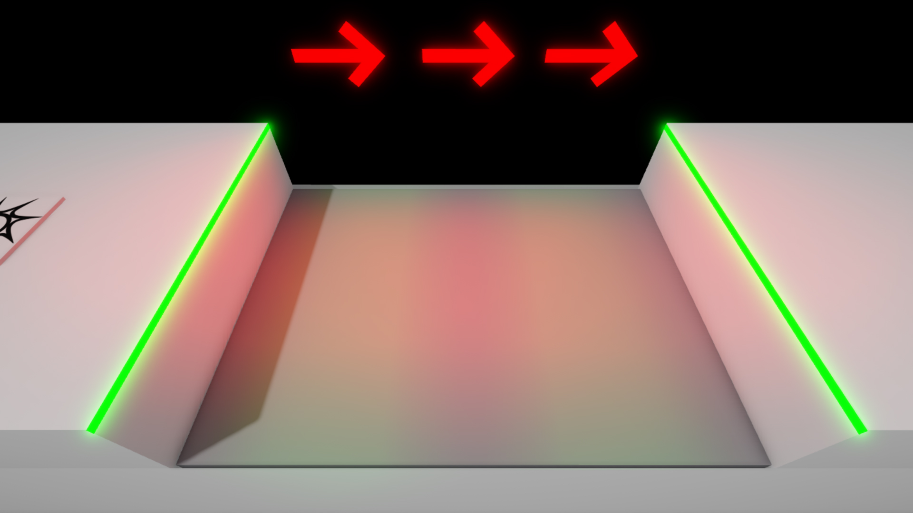
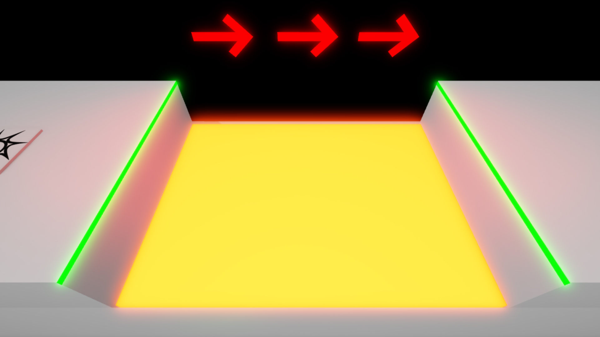
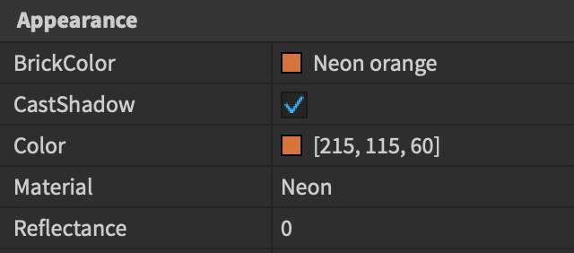
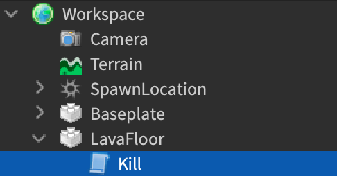

# Deadly Lava

## 목차
- [Deadly Lava](#deadly-lava)
  - [목차](#목차)
  - [설정하기](#설정하기)
  - [이벤트에 연결하기](#이벤트에-연결하기)
  - [접촉한 파트 가져오기](#접촉한-파트-가져오기)
  - [캐릭터와 휴머노이드](#캐릭터와-휴머노이드)
  - [휴머노이드 확인](#휴머노이드-확인)
  - [캐릭터 건강 설정](#캐릭터-건강-설정)
  - [최종 코드](#최종-코드)
  - [출처](#출처)
  - [다음](#다음)

---

[스크립트 입문](https://create.roblox.com/docs/tutorials/scripting/basic-scripting/intro-to-scripting)에서, 경험 속에서 시간이 지남에 따라 루프를 통해 변경을 가하는 방법을 배웠습니다. 사용자 행동에 따라 변경을 가하고 싶다면 어떻게 해야 할까요? 이번 튜토리얼에서는 사용자가 밟았을 때 죽는 치명적인 용암 바닥을 만드는 방법을 배웁니다.

<!-- <video controls loop muted>
  <source src="../img/02_02_Deadly_Lava/lavaFloorGameplay.mp4" />
</video> -->
[](https://prod.docsiteassets.roblox.com/assets/tutorials/deadly-lava/lavaFloorGameplay.mp4)

## 설정하기

치명적인 용암을 놓을 장소가 필요합니다. [스크립트 입문](https://create.roblox.com/docs/tutorials/scripting/basic-scripting/intro-to-scripting) 코스를 따랐다면, 사라지는 플랫폼으로 덮인 간격에 용암 바닥을 놓으면 잘 맞을 것입니다.

1. `Part`를 삽입하고 세계에 배치합니다. 이름을 **LavaFloor**로 설정합니다.
2. 용암이 공간의 바닥을 덮도록 크기를 조정합니다.

   

3. `Material` 속성을 `Neon`으로 설정하고 `Color`를 주황색으로 변경하여 용암처럼 보이게 만듭니다.

   <GridContainer numColumns="2">
     
     
   </GridContainer>

4. `LavaFloor` 파트에 **Script**를 삽입하고 이름을 `Kill`로 변경합니다.

   

5. 기본 코드를 제거하고 용암에 대한 변수를 만듭니다.

   ```lua
   local lava = script.Parent
   ```

## 이벤트에 연결하기

사용자가 용암을 밟았을 때 감지하기 위해 **이벤트**를 사용합니다. 모든 파트에는 무언가가 접촉할 때 발생하는 `Touched` 이벤트가 있습니다. 이 이벤트에 **연결**하여 이벤트가 발생할 때 함수를 실행할 수 있습니다.

1. `kill`이라는 새 함수를 선언합니다.
2. 속성과 마찬가지로 점을 사용하여 용암 객체의 `Touched` 이벤트에 접근합니다: `lava.Touched`.
3. `Touched` 이벤트에서 `Connect` 함수를 호출하고 `kill` 함수를 전달합니다.

   ```lua
   local lava = script.Parent

   local function kill()

   end

   lava.Touched:Connect(kill)
   ```

이제 `kill` 함수에 작성된 모든 코드는 무언가가 용암에 접촉할 때마다 실행됩니다. `Connect` 함수에는 **콜론**이 사용되며, **점**이 아닙니다 - 이유는 지금 걱정하지 말고 차이를 기억하세요.

## 접촉한 파트 가져오기

사용자를 죽이기 위해서는 해당 사용자와 관련된 객체가 필요합니다. 파트의 `Touched` 이벤트는 접촉한 "다른 파트"를 제공할 수 있지만, 함수의 **매개변수**로 요청해야 합니다.

매개변수는 함수가 호출될 때 받을 것으로 예상하는 내용을 정의합니다. 매개변수는 다른 변수와 마찬가지로 함수 내에서 사용할 수 있습니다. 매개변수는 함수가 호출될 때 괄호 안에 포함되어 정보를 전달할 수 있습니다. 매개변수는 함수의 첫 줄 괄호 안에 정의됩니다. `kill` 함수에 `otherPart`라는 **매개변수**를 만듭니다.

```lua
local lava = script.Parent

local function kill(otherPart)

end

lava.Touched:Connect(kill)
```

`kill` 함수가 호출되면 `otherPart` 매개변수는 용암 바닥에 접촉한 파트를 나타내며, 함수 내의 코드에서 이를 사용할 수 있습니다.

## 캐릭터와 휴머노이드

사용자가 용암을 밟았을 때, Roblox는 사용자가 접촉한 특정 신체 부위를 감지할 수 있습니다. 이 부위는 사용자의 **Character** 모델에 있으며, 이 모델에는 사용자 아바타를 구성하는 모든 객체가 포함됩니다:

- 사용자의 개별 신체 부위(머리, 사지, 몸통 등).
- 사용자가 착용한 의류 및 액세서리.
- 사용자의 건강 상태를 포함한 여러 속성을 가진 특수 객체인 `Class.Humanoid`.
- 사용자의 움직임을 제어하는 HumanoidRootPart.

이전에도 언급했듯이, 용암에 접촉하는 모든 신체 부위는 Character 모델의 일부이므로, `otherPart.Parent`를 사용하여 해당 캐릭터에 대한 참조를 얻을 수 있습니다. 용암 바닥에 접촉한 파트의 부모를 저장하는 변수를 만듭니다.

```lua
local lava = script.Parent

local function kill(otherPart)
  local partParent = otherPart.Parent
end

lava.Touched:Connect(kill)
```

캐릭터 모델에서 사용자을 죽이기 위해 Humanoid 객체를 가져와야 합니다. 이는 `FindFirstChild()` 함수를 사용하여 수행할 수 있습니다 — 찾고자 하는 항목의 이름을 전달하면 해당 객체에서 첫 번째 일치하는 자식을 제공합니다. `partParent` 변수에서 `"Humanoid"`라는 자식을 찾도록 `FindFirstChild()`를 호출하고, 결과를 `humanoid`라는 새 변수에 저장합니다.

```lua
local lava = script.Parent

local function kill(otherPart)
  local partParent = otherPart.Parent
  local humanoid = partParent:FindFirstChild("Humanoid")
end

lava.Touched:Connect(kill)
```

## 휴머노이드 확인

**if** 문을 사용하여 Humanoid가 발견되었는지 쉽게 확인할 수 있습니다. if 문의 조건이 참인 경우에만 해당 코드가 실행됩니다.

[연산자](https://create.roblox.com/docs/luau/operators)를 사용하여 더 복잡한 조건을 구성할 수 있으며, 이는 이후 과정에서 다루게 됩니다 - 지금은 `humanoid` 변수를 조건으로 사용하세요. `humanoid`를 조건으로 하는 **if** 문을 만듭니다.

```lua
local lava = script.Parent

local function kill(otherPart)
  local partParent = otherPart.Parent
  local humanoid = partParent:FindFirstChild("Humanoid")
  if humanoid then

  end
end

lava.Touched:Connect(kill)
```

<Alert severity="info">
Lua에서는 false 또는 nil(빈 값) 이외의 모든 값이 조건문에서 참으로 평가되므로, 이 경우 `humanoid`를 조건으로 직접 사용할 수 있습니다.
</Alert>

## 캐릭터 건강 설정

이제 `Humanoid`가 확인되었으므로 해당 속성을 변경할 수 있습니다. `Health` 속성을 **0**으로 설정하면 관련된 Character가 죽습니다. if 문의 본문에서 humanoid의 `Health` 속성을 0으로 설정합니다.

```lua
local function kill(otherPart)
    local partParent = otherPart.Parent
    local humanoid = partParent:FindFirstChild("Humanoid")
    if humanoid then
        humanoid.Health = 0
    end
end

lava.Touched:Connect(kill)
```

이제 용암 바닥이 완성되었습니다! 경험을 테스트해보고, 치명적인 용암이 접촉 시 사용자를 성공적으로 죽이는지 확인하세요. 당신의 용암을 오비(obstacle course)에서 추가 도전 요소로 사용하거나, 세계의 경계로 사용해보세요.

## 최종 코드

```lua
local lava = script.Parent

local function kill(otherPart)
    local partParent = otherPart.Parent
    local humanoid = partParent:FindFirstChild("Humanoid")
    if humanoid then
        humanoid.Health = 0
    end
end

lava.Touched:Connect(kill)
```

---
## 출처
 - [Deadly Lava](https://create.roblox.com/docs/tutorials/scripting/basic-scripting/deadly-lava)

---
## [다음](./02_03_Fading_Trap.md)