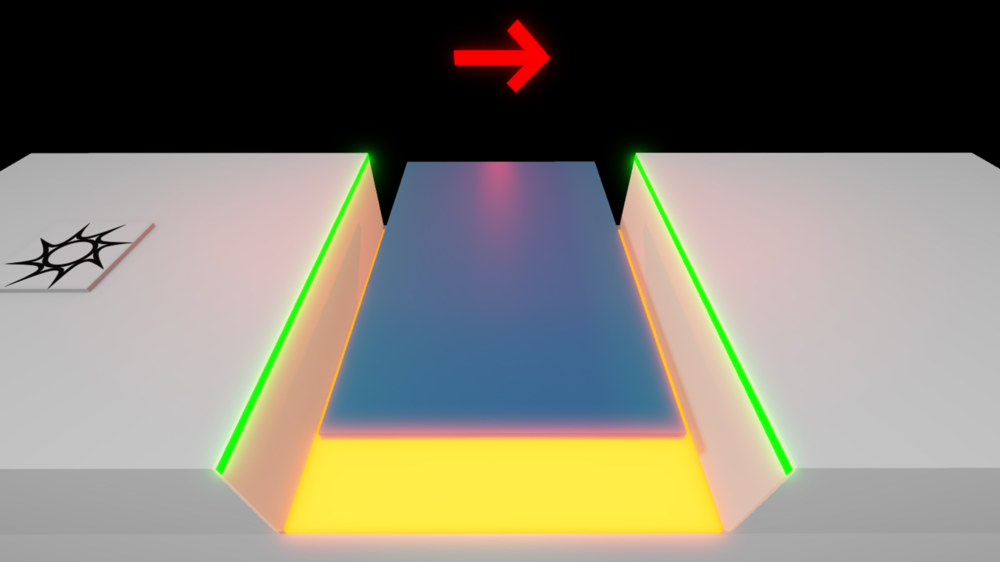
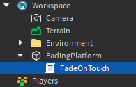
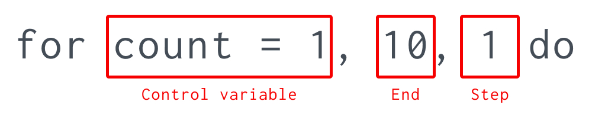

# Fading Trap

## 목차
- [Fading Trap](#fading-trap)
  - [목차](#목차)
  - [설정하기](#설정하기)
  - [플랫폼 사라지게 만들기](#플랫폼-사라지게-만들기)
  - [다시 나타나기](#다시-나타나기)
  - [디바운스 변수](#디바운스-변수)
  - [변수 확인](#변수-확인)
  - [디바운스 토글](#디바운스-토글)
  - [최종 코드](#최종-코드)
  - [출처](#출처)
  - [다음](#다음)

---

치명적인 용암에서, 사용자 행동에 따라 코드를 실행하는 방법을 배웠습니다. 이번 튜토리얼에서는 사용자가 밟으면 사라지는 플랫폼을 만드는 방법을 배웁니다.

<video controls loop muted>
	<source src="../img/02_03_Fading_Trap/completedFadingTrap.mp4" />
</video>

## 설정하기

치명적인 용암을 따랐다면, 사용자가 뛰어넘을 수 없는 용암 바닥 위에 사라지는 플랫폼을 배치할 수 있습니다.

1. 파트를 삽입하고 세계에 배치합니다. 이름을 `FadingPlatform`으로 설정합니다.
2. 사용자가 점프할 수 있을 정도로 크기를 조정합니다.
3. **Anchored** 속성이 설정되어 있는지 확인합니다.

   

4. 파트에 **Script**를 삽입하고 이름을 **FadeOnTouch**로 변경한 후 기본 코드를 제거합니다.

   

5. 플랫폼에 대한 변수를 만들고, 플랫폼의 `Touched` 이벤트에 연결된 빈 함수를 생성합니다.

   ```lua
   local platform = script.Parent

   local function fade()

   end

   platform.Touched:Connect(fade)
   ```

## 플랫폼 사라지게 만들기

플랫폼이 즉시 사라지면 사용자가 간격을 넘어가기가 불가능해지므로 재미가 없습니다. 대신 플랫폼이 사라지기 전에 사용자가 점프할 기회를 주기 위해 **서서히 사라지게** 만들어야 합니다.

이 효과를 얻기 위해 `Transparency` 속성을 반복적으로 아주 짧은 시간 동안 변경할 수 있지만, 점진적인 사라짐은 0에서 1까지 최소 10번의 변화를 요구합니다. 이는 20줄 이상의 매우 반복적인 코드가 됩니다.

이 문제를 훨씬 더 효율적으로 해결하기 위해 **for** 루프를 사용하여 특정 횟수만큼 코드를 반복할 수 있습니다. 코드의 각 루프를 **반복(iteration)**이라고 합니다. for 루프는 세 가지 요소로 정의됩니다:



- **제어 변수** - 루프를 세는 데 사용되는 변수입니다. 이 예에서는 `count`이고 시작 값은 1입니다.
- **종료 값** - 루프가 중지되기 위한 값입니다. 이 예에서는 10입니다.
- **단계 증가값** (선택 사항) - 각 루프마다 제어 변수에 더해질 값을 결정합니다. 생략하면 기본값은 1입니다. 따라서 이 예에서는 불필요합니다.

**FadeOnTouch**에서:

1. 함수 내에서 `1`부터 시작하여 `10`번 반복되는 `for` 루프를 만듭니다.
2. for 루프 안에서 `Transparency` 속성을 제어 변수 나누기 `10`으로 설정합니다.
3. `Library.task.wait()` 함수를 사용하여 `0.1`초 동안 기다립니다.

   ```lua
   local platform = script.Parent

   local function fade()
   	for count = 1, 10 do
   		platform.Transparency = count / 10
   		task.wait(0.1)
   	end
   end

   platform.Touched:Connect(fade)
   ```

루프가 실행될 때마다 count는 1씩 증가합니다. 이는 플랫폼의 `Transparency`가 0.1초마다 0.1씩 증가하여 1초 후에 완전 투명해짐을 의미합니다.

## 다시 나타나기

플랫폼이 사라진 후 사용자는 그를 통해 떨어져야 합니다. 또한, 플랫폼은 사라진 후 몇 초 후에 다시 나타나야 합니다. 그렇지 않으면 사용자가 실패할 경우 점프를 다시 시도할 수 없게 됩니다. CanCollide 속성은 사용자가 파트를 통과할 수 있는지 여부를 제어합니다.

1. for 루프 이후에 플랫폼의 `CanCollide` 속성을 `false`로 설정합니다.
2. `Library.task.wait()` 함수를 사용하여 몇 초 동안 기다립니다.
3. `CanCollide` 속성을 다시 `true`로 설정합니다.
4. `Transparency` 속성을 다시 `0`으로 설정합니다.

   ```lua
   local platform = script.Parent

   local function fade()
      for count = 1, 10 do
         platform.Transparency = count / 10
         task.wait(0.1)
      end
      platform.CanCollide = false
      task.wait(3)
      platform.CanCollide = true
      platform.Transparency = 0
   end

   platform.Touched:Connect(fade)
   ```

## 디바운스 변수

치명적인 용암에서, `Touched` 이벤트는 사용자의 신체 부위가 파트에 접촉할 때마다 실행된다는 것을 배웠습니다. 이 동작은 사용자가 사라지는 플랫폼을 가로지를 때 문제가 됩니다: 함수가 여러 번 실행되어 루프가 매번 초기화됩니다.

코드가 제대로 작동하려면 사용자가 처음으로 플랫폼을 밟았을 때만 함수가 한 번 실행되어야 합니다. 일반적으로 여러 번 트리거되는 경우 한 번만 실행되도록 하는 것을 **디바운싱**이라고 합니다.

함수를 디바운싱하려면 boolean 변수를 사용하여 플랫폼이 이미 접촉되었는지 여부를 추적할 수 있습니다. 부울은 **true**와 **false** 값만을 포함할 수 있습니다. `isTouched`라는 변수를 만들고 `false`로 설정합니다.

```lua
local platform = script.Parent

local isTouched = false

local function fade()
	for count = 1, 10 do
		platform.Transparency = count / 10
		task.wait(0.1)
	end
	platform.CanCollide = false
	task.wait(3)
	platform.CanCollide = true
	platform.Transparency = 0
end

platform.Touched:Connect(fade)
```

## 변수 확인

if 문을 사용하여 `isTouched` 디바운싱 변수가 false인 경우에만 fade 함수의 코드를 실행할 수 있습니다. fade 함수의 본문을 `not isTouched` 조건의 if 문으로 감쌉니다.

```lua
local platform = script.Parent

local isTouched = false

local function fade()
	if not isTouched then
		for count = 1, 10 do
            platform.Transparency = count / 10
            task.wait(0.1)
	    end
		platform.CanCollide = false
		task.wait(3)
		platform.CanCollide = true
		platform.Transparency = 0
	end
end

platform.Touched:Connect(fade)
```

Lua의 `not` 연산자는 뒤따르는 값의 값을 반전시킵니다. 조건문에서 이는 첫 번째 if 문이 다음과 같은 문과 동일하게 작동함을 의미합니다.

```lua
if not isTouched then

end
if isTouched == false then

end

if isTouched == nil then

end
```

## 디바운스 토글

현재, `isTouched`가 false이고 `not isTouched`가 true로 평가되기 때문에 `fade` 함수의 코드는 항상 실행됩니다. 디바운스 루틴을 완성하려면 두 곳에서 변수의 값을 토글해야 합니다.

1. 플랫폼이 사라지기 시작하기 전에 `if` 문 내부에서 `isTouched`를 `true`로 설정합니다.
2. 플랫폼이 다시 나타난 후에 `isTouched`를 다시 `false`로 설정합니다.

```lua
local function fade()
  if not isTouched then
    isTouched = true
    for count = 1, 10 do
      platform.Transparency = count / 10
      task.wait(0.1)
    end
    platform.CanCollide = false
    task.wait(3)
    platform.CanCollide = true
    platform.Transparency = 0
    isTouched = false
  end
end

platform.Touched:Connect(fade)
```

이제 완료되었습니다! 코드를 테스트해보고, 사용자가 플랫폼을 밟으면 플랫폼이 사라지고 몇 초 후에 다시 나타나는 것을 확인할 수 있습니다.

더 넓은 간격을 가로지르는 도전적인 장애물을 만들기 위해 이 플랫폼을 복제하고, 난이도 조정을 위해 사라지는 속도를 변경할 수 있습니다.

<video controls loop muted>
	<source src="../img/02_03_Fading_Trap/multipleFadingTraps.mp4" />
</video>

## 최종 코드

```lua
local platform = script.Parent

local isTouched = false

local function fade()
	if not isTouched then
		isTouched = true
		for count = 1, 10 do
		    platform.Transparency = count / 10
		    task.wait(0.1)
	    end
		platform.CanCollide = false
		task.wait(3)
		platform.CanCollide = true
		platform.Transparency = 0
		isTouched = false
	end
end

platform.Touched:Connect(fade)
```

---
## 출처
 - [Fading Trap](https://create.roblox.com/docs/tutorials/scripting/basic-scripting/fading-trap)

---
## [다음](./02_04_Scoring_Points.md)