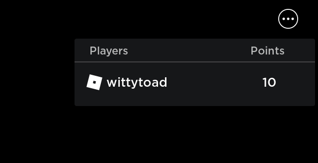
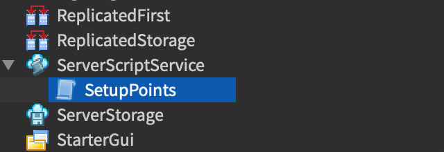

# Scoring Points

## 목차
- [Scoring Points](#scoring-points)
  - [목차](#목차)
  - [설정하기](#설정하기)
  - [플레이어 포인트](#플레이어-포인트)
  - [플레이어 듣기](#플레이어-듣기)
  - [통계 폴더 만들기](#통계-폴더-만들기)
  - [포인트 만들기](#포인트-만들기)
  - [시간 계산](#시간-계산)
  - [플레이어 목록](#플레이어-목록)
  - [포인트 부여](#포인트-부여)
  - [캐릭터 듣기](#캐릭터-듣기)
  - [포인트 리셋](#포인트-리셋)
  - [플레이어 확인](#플레이어-확인)
  - [최종 코드](#최종-코드)
  - [출처](#출처)
  - [다음](#다음)

---

이전 튜토리얼에서는 [사라지는 플랫폼](./02_03_Fading_Trap.md)과 [치명적인 용암](./02_02_Deadly_Lava.md)을 포함한 다양한 경험 기능을 만들었습니다. 이번 튜토리얼에서는 이러한 기능을 통합하여 사용자가 누가 가장 오래 살아남는지 경쟁할 수 있는 플레이 가능한 경험을 만듭니다. 사용자가 살아남는 매 순간마다 점수가 추가됩니다.

<video controls loop muted>
	<source src="../img/02_04_Scoring_Points/finishedScoringPointsSolo.mp4" />
</video>

## 설정하기

먼저, 경험을 위한 장면을 설정해야 합니다. 이전 튜토리얼에서 만든 [사라지는 플랫폼](./02_03_Fading_Trap.md)을 복제하여 사용자가 가능한 한 오랫동안 플랫폼에 머물도록 경쟁하게 합니다.

또한 [치명적인 용암](./02_02_Deadly_Lava.md)을 사용하여 사용자가 플랫폼에서 떨어질 때 죽게 하거나 단순히 추락하게 할 수 있습니다. 사용자가 게임을 시작할 수 있도록 **SpawnLocation**을 플랫폼 위에 배치하세요.


## 플레이어 포인트

Roblox에는 사용자 통계를 보여주는 내장 **Leaderboard**가 있습니다. 리더보드를 통해 플레이어 포인트를 설정하면 경험의 오른쪽에 표시됩니다.



나중에 더 커스터마이즈 가능한 방법으로 정보를 표시하는 방법을 배우게 되겠지만, 리더보드는 Roblox에서 가시적인 점수 시스템을 만드는 가장 간단한 방법입니다.

경험 상태를 설정하는 스크립트는 경험이 시작될 때 자동으로 실행되므로 **ServerScriptService**에 넣는 것이 좋습니다. **ServerScriptService**에 **SetupPoints**라는 스크립트를 만듭니다.



## 플레이어 듣기

Roblox에서 **서비스**는 다양한 유용한 기능을 수행하는 객체입니다. `Players` 서비스에는 사용자가 경험에 참여할 때 포인트를 설정하는 데 사용할 수 있는 `PlayerAdded` 이벤트가 있습니다.

서비스는 `game` 객체의 `GetService` 함수를 사용하여 액세스할 수 있습니다. `game`은 경험의 모든 것을 포함하는 변수로 어디서나 접근할 수 있습니다.

1. `game:GetService("Players")`를 사용하여 Players 서비스에 대한 변수를 만듭니다.
2. 들어오는 플레이어를 위한 매개변수를 가진 `onPlayerAdded`라는 함수를 만듭니다.
3. PlayerAdded 이벤트에 `onPlayerAdded` 함수를 연결합니다.

   ```lua
   local Players = game:GetService("Players")

   local function onPlayerAdded(player)

   end

   Players.PlayerAdded:Connect(onPlayerAdded)
   ```

<Alert severity="info">

서비스를 포함하는 변수를 선언할 때는 변수 명명 규칙을 깨더라도 서비스의 정확한 이름(예: `"Players"`)으로 이름을 지정하는 것이 좋습니다.

</Alert>

## 통계 폴더 만들기

리더보드에 사용자의 포인트를 표시하려면 사용자의 `Player` 객체에 `leaderstats`라는 새 `Folder`를 만들고 그 안에 포인트를 넣기만 하면 됩니다. 새 객체는 `Datatype.Instance.new()` 함수를 통해 스크립트 내에서 만들 수 있습니다.

1. `Instance.new("Folder")`를 사용하여 새 `Folder` 객체를 만들고 결과를 `leaderstats`라는 새 변수에 저장합니다.

   ```lua
   local function onPlayerAdded(player)
   	local leaderstats = Instance.new("Folder")
   end
   ```

2. `leaderstats`의 Name 속성을 `"leaderstats"`로 설정합니다.
3. `leaderstats`를 `player`에 부모로 설정합니다.

   ```lua
   local Players = game:GetService("Players")

   local function onPlayerAdded(player)
   	local leaderstats = Instance.new("Folder")
      leaderstats.Name = "leaderstats"
      leaderstats.Parent = player
   end

   Players.PlayerAdded:Connect(onPlayerAdded)
   ```


폴더의 이름을 정확히 "leaderstats"로 설정해야 작동합니다!


## 포인트 만들기

리더보드 시스템은 `leaderstats` 폴더의 값을 읽고 발견한 모든 것을 표시합니다.

플레이어의 포인트를 추적할 통계를 추가하려면 새 `IntValue` 객체를 `leaderstats` 폴더에 부모로 설정할 수 있습니다. 값 객체의 이름은 현재 값과 함께 표시됩니다.

1. `Datatype.Instance.new()`을 사용하여 `points`라는 변수로 새 `IntValue` 객체를 만듭니다.
2. `Name`을 `"Points"`로 설정합니다.
3. `Value`를 **0**으로 설정합니다. 이것이 리더보드가 처음에 플레이어에게 표시할 값입니다.
4. `points` 객체를 `leaderstats` 폴더에 부모로 설정합니다.

```lua
local Players = game:GetService("Players")

local function onPlayerAdded(player)
  local leaderstats = Instance.new("Folder")
  leaderstats.Name = "leaderstats"
  leaderstats.Parent = player

  local points = Instance.new("IntValue")
  points.Name = "Points"
  points.Value = 0
  points.Parent = leaderstats
end

Players.PlayerAdded:Connect(onPlayerAdded)
```

경험을 테스트하면 리더보드가 오른쪽 상단에 사용자 이름과 함께 점수가 표시되는 것을 볼 수 있습니다.

## 시간 계산

각 사용자는 살아 있는 매 초마다 점수를 얻어야 합니다. `while` 루프와 `Library.task.wait()` 함수를 사용하여 매초 포인트 값을 업데이트할 수 있습니다.

1. 스크립트 끝에 조건이 `true`인 `while` 루프를 만듭니다.
2. 루프에서 `Library.task.wait()`를 사용하여 1초 동안 대기합니다.

```lua
Players.PlayerAdded:Connect(onPlayerAdded)

while true do
  task.wait(1)
end
```

## 플레이어 목록

경험의 모든 사용자에 대해 코드를 실행하려면 `GetPlayers` 함수가 반환하는 **배열**을 반복해야 합니다.

배열은 순서대로 저장된 항목 목록입니다. 각 항목은 인덱스 위치로 액세스할 수 있으며, 1부터 시작합니다. 배열의 길이는 `#`를 접두사로 사용하여 얻을 수 있습니다.

1. `Players:GetPlayers()`의 결과를 `playerList` 변수에 저장합니다.
2. 시작 값이 1이고 종료 값이 `#playerList`인 **for** 루프를 만들어 배열의 각 플레이어에 대해 한 번씩 루프를 반복합니다.

```lua
while true do
  task.wait(1)
  local playerList = Players:GetPlayers()
  for currentPlayer = 1, #playerList do
    -- playerList의 각 플레이어에 대한 로직을 추가하세요.
  end
end
```

## 포인트 부여

for 루프에서 각 사용자에게 포인트를 부여하려면 배열에서 사용자를 가져와 `leaderstats` 폴더에 저장된 **Points** 객체에 1을 추가해야 합니다.

배열에 저장된 객체는 **대괄호**를 사용하여 액세스합니다. 예를 들어, `playerList` 배열의 첫 번째 항목은 `playerList[1]`로 액세스할 수 있습니다. for 루프에서 `playerList[currentPlayer]`를 사용하면 루프의 각 반복마다 목록의 각 사용자를 이동할 수 있습니다.

1. `playerList[currentPlayer]`에 있는 사용자를 `player` 변수에 저장합니다.
2. 사용자의 **Points** 객체를 `points` 변수에 저장합니다.
3. `Class.IntValue.Value|Value` 속성을 `points.Value + 1`로 설정합니다.

```lua
while true do
  task.wait(1)
  local playerList = Players:GetPlayers()
  for currentPlayer = 1, #playerList do
    local player = playerList[currentPlayer]
    local points = player.leaderstats.Points
    points.Value += 1
  end
end
```

경험을 테스트하면 리더보드에 플레이어의 점수가 매초 1씩 증가하는 것을 볼 수 있습니다.

<video controls loop muted>
	<source src="../img/02_04_Scoring_Points/leaderboardCounting.mp4" />
</video>

## 캐릭터 듣기

경험의 목표는 누가 가장 오래 살아남는지 확인하는 것이므로 사용자가 죽으면 점수가 0으로 리셋되어야 합니다.

사용자의 캐릭터 모델을 얻어야 사용자가 죽었을 때를 감지할 수 있습니다. 이 모델은 `Player` 객체가 로드

된 후에만 경험에 추가되며, `CharacterAdded` 이벤트를 사용하여 캐릭터가 사용할 준비가 되었을 때 들을 수 있습니다. 캐릭터와 플레이어를 위한 두 개의 매개변수를 가진 `onCharacterAdded`라는 함수를 만듭니다.

```lua
local Players = game:GetService("Players")

local function onCharacterAdded(character, player)

end

local function onPlayerAdded(player)
  local leaderstats = Instance.new("Folder")
```

`onCharacterAdded` 함수의 매개변수에 사용자를 포함했지만, 실제 `CharacterAdded` 이벤트는 캐릭터만 반환합니다. `player` 객체도 전달하려면 이벤트 연결에 익명 함수를 사용하세요.

```lua
local function onPlayerAdded(player)
  local leaderstats = Instance.new("Folder")
  leaderstats.Name = "leaderstats"
  leaderstats.Parent = player

  local points = Instance.new("IntValue")
  points.Name = "Points"
  points.Value = 0
  points.Parent = leaderstats

  player.CharacterAdded:Connect(function(character)
    onCharacterAdded(character, player)
  end)
end
```

## 포인트 리셋

사용자가 죽으면 `Class.Humanoid` 객체는 자동으로 `Died` 이벤트를 발생시킵니다. 이 이벤트를 사용하여 포인트를 리셋할 시점을 찾을 수 있습니다.

Humanoid는 캐릭터 모델 안에 있지만, 해당 모델의 내용은 사용자가 스폰될 때 조립됩니다. Humanoid 객체가 로드될 때까지 안전하게 대기하려면 `WaitForChild()` 함수를 사용하세요. 부모 객체에서 호출하고 기다리는 자식의 문자열 이름을 전달합니다. `character:WaitForChild("Humanoid")`를 사용하여 Humanoid를 기다리는 변수를 만듭니다.

```lua
local Players = game:GetService("Players")

local function onCharacterAdded(character, player)
  local humanoid = character:WaitForChild("Humanoid")
end
```

Died 이벤트에 연결할 함수는 매우 짧고 여기서만 필요하므로 다시 익명 함수를 사용할 수 있습니다.

1. Humanoid의 **Died** 이벤트에 새 익명 함수를 연결합니다.
2. 익명 함수에서 플레이어의 **Points** 객체를 `points` 변수에 저장합니다.
3. `Value` 속성을 **0**으로 설정합니다.

```lua
local Players = game:GetService("Players")

local function onCharacterAdded(character, player)
  local humanoid = character:WaitForChild("Humanoid")

  humanoid.Died:Connect(function()
    local points = player.leaderstats.Points
    points.Value = 0
  end)
end
```

이제 사용자가 죽으면 점수가 리셋되는 것을 볼 수 있습니다.

## 플레이어 확인

사용자가 죽었을 때도 점수를 계속 얻는다면 경험의 정신에 맞지 않으므로 점수를 부여하기 전에 사용자가 살아 있는지 확인해야 합니다.

사용자가 아직 살아 있지 않고 스폰된 캐릭터 모델이 추가되어야 하므로 `onPlayerAdded` 함수에서 사용자가 살아 있는지 확인할 수 있는 **속성**을 정의하는 것부터 시작해야 합니다.

속성은 Roblox에서 객체를 사용자 정의 데이터로 설정할 수 있습니다. 속성은 이름과 값으로 구성됩니다. `SetAttribute` 함수를 사용하여 객체에 속성을 만들 수 있습니다. `SetAttribute`를 `player`에 호출하여 `"IsAlive"`라는 새 **속성**을 값 `false`로 만듭니다.

```lua
local function onPlayerAdded(player)
  local leaderstats = Instance.new("Folder")
  leaderstats.Name = "leaderstats"
  leaderstats.Parent = player

  local points = Instance.new("IntValue")
  points.Name = "Points"
  points.Value = 0
  points.Parent = leaderstats

  player:SetAttribute("IsAlive", false)

  player.CharacterAdded:Connect(function(character)
    onCharacterAdded(character, player)
  end)
end
```

사용자의 캐릭터 모델이 리스폰되면 `IsAlive` 값이 다시 점수를 얻을 수 있도록 `true`로 변경되어야 합니다.

1. `onCharacterAdded`에서 `player`의 `IsAlive` 속성을 **true**로 설정합니다.
2. `onCharacterDied`에서 `player`의 `IsAlive` 속성을 **false**로 설정합니다.

```lua
local Players = game:GetService("Players")

local function onCharacterAdded(character, player)
  player:SetAttribute("IsAlive", true)

  local humanoid = character:WaitForChild("Humanoid")

  humanoid.Died:Connect(function()
    local points = player.leaderstats.Points
    points.Value = 0
    player:SetAttribute("IsAlive", false)
  end)
end
```

마지막으로, 점수를 부여하기 전에 `while` 루프 끝에서 `IsAlive`를 **확인**해야 합니다. `GetAttribute` 함수는 속성 이름을 받아 값을 반환합니다. `while` 루프에서 점수를 부여하는 코드를 `player:GetAttribute("IsAlive")` 조건의 `if` 문으로 래핑합니다.

```lua
while true do
  task.wait(1)
  local playerList = Players:GetPlayers()

  for currentPlayer = 1, #playerList do
    local player = playerList[currentPlayer]

    if player:GetAttribute("IsAlive") then
      local points = player.leaderstats.Points
      points.Value += 1
    end
  end
end
```

이제 경험을 테스트하고 사용자가 살아 있는 매 순간마다 점수를 얻고, 살아 있지 않을 때는 점수가 0인 것을 볼 수 있습니다. 친구들과 함께 플레이하여 누가 가장 높은 점수를 얻을 수 있는지 확인해보세요.

이것은 시작에 불과합니다. 사용자 경험을 개선하기 위해 계속 노력할 수 있습니다. 다음은 몇 가지 팁입니다:

- 모든 플랫폼에 대한 코드를 단일 스크립트로 작성하여 업데이트를 더 쉽게 만드세요.
- 사용자가 동시에 시작할 수 있도록 로비 구역을 만들어 경험 구역으로 텔레포트하세요.
- 각 라운드의 우승자를 발표하세요.

## 최종 코드

```lua
local Players = game:GetService("Players")

local function onCharacterAdded(character, player)
  player:SetAttribute("IsAlive", true)
  local humanoid = character:WaitForChild("Humanoid")

  humanoid.Died:Connect(function()
    local points = player.leaderstats.Points
    points.Value = 0
    player:SetAttribute("IsAlive", false)
  end)
end

local function onPlayerAdded(player)
  local leaderstats = Instance.new("Folder")
  leaderstats.Name = "leaderstats"
  leaderstats.Parent = player

  local points = Instance.new("IntValue")
  points.Name = "Points"
  points.Value = 0
  points.Parent = leaderstats

  player:SetAttribute("IsAlive", false)

  player.CharacterAdded:Connect(function(character)
    onCharacterAdded(character, player)
  end)
end

Players.PlayerAdded:Connect(onPlayerAdded)

while true do
  task.wait(1)
  local playerList = Players:GetPlayers()
  for i = 1, #playerList do
    local player = playerList[i]
    if player:GetAttribute("IsAlive") then
      local points = player.leaderstats.Points
      points.Value += 1
    end
  end
end
```

---
## 출처
 - [Scoring Points](https://create.roblox.com/docs/tutorials/scripting/basic-scripting/scoring-points)

---
## [다음](./02_05_Creating_a_Health_Pickup.md)