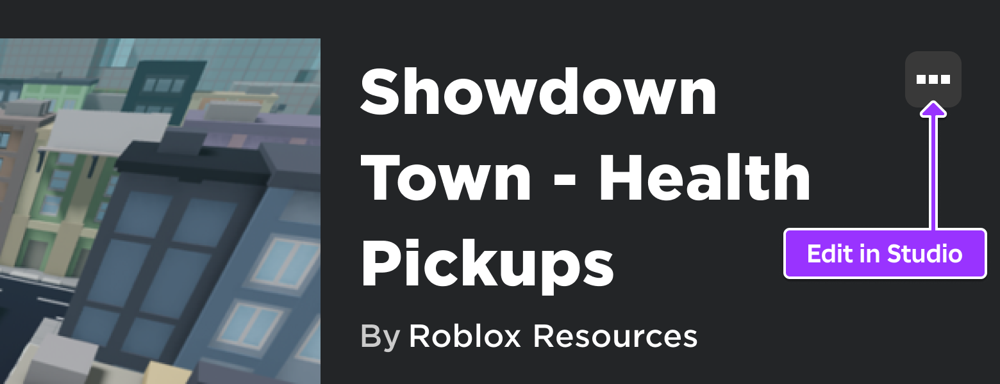
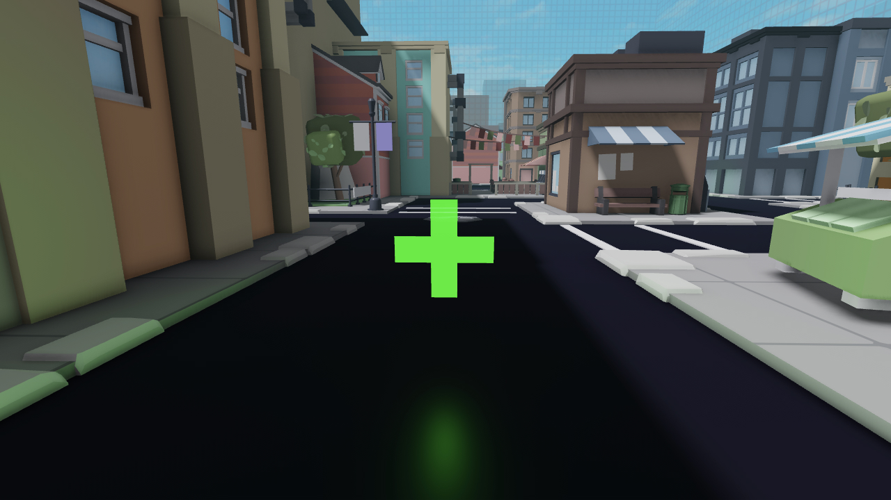
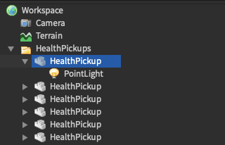
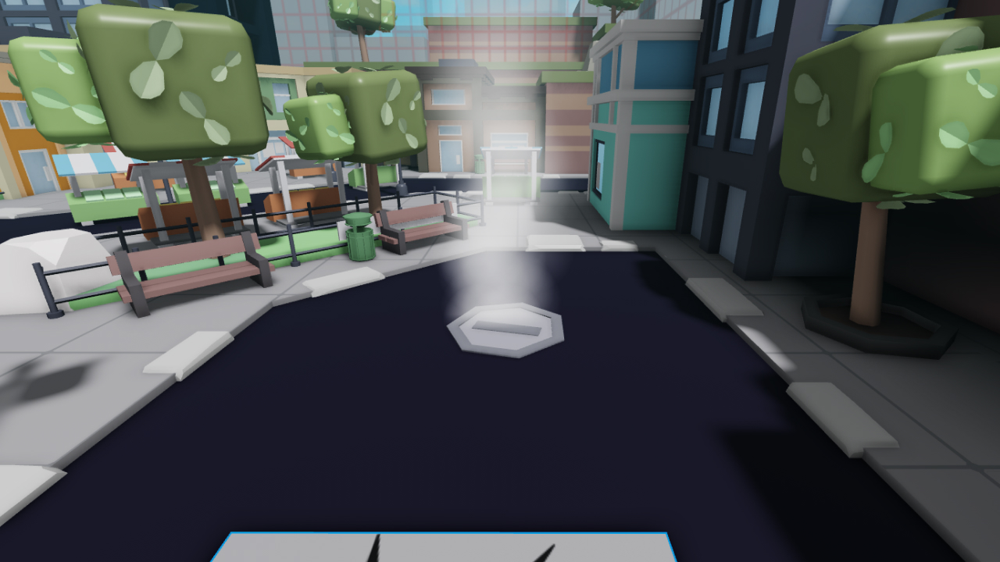

# Creating a Health Pickup

## 목차
- [Creating a Health Pickup](#creating-a-health-pickup)
  - [목차](#목차)
  - [설정하기](#설정하기)
  - [체력 회복](#체력-회복)
  - [픽업 폴더 가져오기](#픽업-폴더-가져오기)
  - [ipairs를 사용한 루프](#ipairs를-사용한-루프)
  - [픽업 쿨다운](#픽업-쿨다운)
  - [픽업 비활성화](#픽업-비활성화)
  - [최종 코드](#최종-코드)
  - [출처](#출처)
  - [다음](#다음)

---

기본 스크립팅 튜토리얼 전반에 걸쳐, 플레이 가능한 장면을 만들기 위해 개별 파트에 스크립트를 작성했습니다. 이전 방법으로 파트를 복제하면 스크립트도 복제됩니다. 이렇게 하면 스크립트를 업데이트할 때 스크립트마다 변경해야 하므로 번거로울 수 있습니다.

이 튜토리얼에서는 건강 회복 아이템을 생성하는 다른 패턴을 사용합니다. 여기서는 건강 회복 동작을 결정하는 스크립트의 단일 복사본만 사용하여 여러 건강 회복 아이템을 생성합니다. 아이템을 터치하면 플레이어의 체력을 회복하고, 약간 희미해지며, 짧은 시간 동안 비활성화됩니다.

<video controls loop muted>
   <source src="../img/02_05_Creating_a_Health_Pickup/finalHealthPickup.mp4" />
</video>

## 설정하기

먼저, 픽업으로 사용할 파트나 모델이 필요합니다. [Showdown Town 예제 월드](https://www.roblox.com/games/6407123421/Showdown-Town-Health-Pickups)에는 맵 전체에 건강 회복 아이템이 많이 포함되어 있습니다.



각 건강 회복 아이템은 두 개의 직사각형 파트와 내부에 녹색 PointLight가 있는 Union입니다. 모든 아이템은 Workspace의 **HealthPickups**라는 폴더에 저장되며, 스크립트는 여기에서 아이템을 찾습니다. 맵에 아이템을 추가하면 반드시 이 폴더에 저장해야 합니다.

<GridContainer numColumns="2">
  
  
</GridContainer>

## 체력 회복

우선, 스크립트는 플레이어의 체력을 회복해야 합니다. 이 패턴은 [치명적인 용암](./02_02_Deadly_Lava.md) 튜토리얼에서 익숙할 것입니다.

1. **ServerScriptService**에 **PickupManager**라는 스크립트를 추가합니다.
2. 이 스크립트에서 값이 **100**인 `MAX_HEALTH`라는 상수를 선언합니다.
3. `onTouchHealthPickup`이라는 함수를 만들고, 파라미터로 터치한 다른 파트와 건강 회복 아이템을 받습니다.

   ```lua
   local MAX_HEALTH = 100

   local function onTouchHealthPickup(otherPart, healthPickup)

   end
   ```

4. 함수 내에서 `otherPart`의 부모에서 캐릭터 모델을 가져옵니다. 다음으로, `Humanoid`가 있는지 `FindFirstChildWhichIsA()`를 사용하여 확인합니다.
5. 만약 humanoid가 있으면, 그들의 **Health** 속성을 `MAX_HEALTH`로 설정합니다.

   ```lua
   local MAX_HEALTH = 100

   local function onTouchHealthPickup(otherPart, healthPickup)
       local character = otherPart.Parent
       local humanoid = character:FindFirstChildWhichIsA("Humanoid")
       if humanoid then
       	humanoid.Health = MAX_HEALTH
       end
   end
   ```

<Alert severity="info">

여기서 `FindFirstChildWhichIsA()`를 호출하여 **유형**을 가져옵니다. 이는 이름만 사용하는 `FindFirstChild()`보다 안전한 옵션입니다. 왜냐하면 이것은 "Humanoid"라고 불리는 다른 것을 반환할 수 있기 때문입니다.

</Alert>

## 픽업 폴더 가져오기

건강 회복 아이템을 보유한 폴더는 스크립트가 실행될 때 게임에 로드되지 않았을 수 있습니다. `WaitForChild`를 사용하여 스크립트를 일시 중지하고 HealthPickups 폴더가 로드될 때 가져올 수 있습니다.

폴더에 호출될 때, `GetChildren` 함수는 폴더의 내용을 배열로 반환합니다.

1. `MAX_HEALTH` 아래에 `healthPickupsFolder`라는 변수를 선언하고 `WaitForChild` 함수를 사용하여 Workspace에서 **HealthPickups** 폴더를 가져옵니다.
2. `healthPickupsFolder`에 `GetChildren` 함수를 호출한 결과를 저장하는 `healthPickups`라는 변수를 만듭니다.

   ```lua
   local MAX_HEALTH = 100

   local healthPickupsFolder = workspace:WaitForChild("HealthPickups")
   local healthPickups = healthPickupsFolder:GetChildren()

   local function onTouchHealthPickup(otherPart, healthPickup)
	local character = otherPart.Parent
   	local humanoid = character:FindFirstChildWhichIsA("Humanoid")
   	if humanoid then
   		humanoid.Health = MAX_HEALTH
   	end
   end
   ```

## ipairs를 사용한 루프

`onTouchHealthPickup`은 배열의 각 건강 회복 아이템에 대해 호출되어야 합니다. 이를 효율적으로 수행하기 위해 새로운 루프 구문을 사용합니다.

`ipairs`는 배열의 각 요소를 순회하는 데 사용할 수 있는 함수입니다. 루프의 시작과 끝을 지정할 필요가 없습니다. `ipairs`를 사용하는 for 루프는 다음과 같이 정의됩니다:


- **Index**: 이는 일반적인 for 루프의 제어 변수와 동일합니다.
- **Value**: 루프가 반복될 때 배열의 각 요소로 채워집니다. 값 변수는 실제로 포함될 내용을 나타내는 이름으로 지정하는 것이 좋습니다.
- **Array**: 순회하려는 배열을 ipairs 함수에 전달합니다.

다음 코드에서는 인덱스를 사용하지 않으므로 빈칸 `_`로 남겨둘 수 있습니다. `ipairs` 함수를 사용하여 **for** 루프를 만들고 `healthPickups`를 전달합니다.

```lua
local function onTouchHealthPickup(otherPart, healthPickup)
    local character = otherPart.Parent
    local humanoid = character:FindFirstChildWhichIsA("Humanoid")
    if humanoid then
        humanoid.Health = MAX_HEALTH
    end
end

for _, healthPickup in ipairs(healthPickups) do

end
```

건강 회복 아이템을 `onTouchHealthPickup` 함수에 전달하기 위해 `Touched` 이벤트에 연결할 래퍼 함수를 만들어야 합니다.

1. for 루프에서, 매개변수로 `otherPart`를 가진 익명 함수를 사용하여 Touched 이벤트에 연결합니다.
2. `onTouchHealthPickups` 함수를 호출하고 `otherPart` 매개변수와 `healthPickup`을 전달합니다.

   ```lua
   for _, healthPickup in ipairs(healthPickups) do
       healthPickup.Touched:Connect(function(otherPart)
       	onTouchHealthPickup(otherPart, healthPickup)
       end)
   end
   ```

이제 코드를 테스트해보세요. 건강 회복 아이템이 체력을 회복시켜야 합니다. 먼저 플레이어에게 피해를 줘야 합니다 - 스폰 지점 옆의 벤트에 서 보세요.



플레이어가 치유되면 상단 오른쪽에 건강 바가 나타나고 사라질 것입니다.

<video controls loop muted>
   <source src="../img/02_05_Creating_a_Health_Pickup/fullHealthPickupEffect.mp4" />
</video>

## 픽업 쿨다운

현재 아이템은 플레이어가 터치할 때마다 무한히 회복시킵니다. 게임에서 더 효과적으로 사용하려면 한 번만 사용할 수 있도록 하고, 짧은 쿨다운 후 다시 사용할 수 있어야 합니다.

먼저, 픽업이 쿨다운 기간인지 여부를 기록해야 합니다. 아래 패턴은 [Fading Trap](./02_03_Fading_Trap.md)에서 익숙할 것입니다. 이번에는 속성을 설정하여 디바운스를 달성합니다.

1. for 루프에서 `"Enabled"`라는 새로운 **속성**을 `true`로 설정합니다.
2. `onTouchHealthPickup` 내부 코드를 `healthPickup:GetAttribute("Enabled")` 조건의 if 문으로 래핑합니다.

   ```lua
   local function onTouchHealthPickup(otherPart, healthPickup)
   	if healthPickup:GetAttribute("Enabled") then
           local character = otherPart.Parent
           local humanoid = character:FindFirstChildWhichIsA("Humanoid")
           if humanoid then
               humanoid.Health = MAX_HEALTH
           end
   	end
   end

   for _, healthPickup in ipairs(healthPickups) do
       healthPickup:SetAttribute("Enabled", true)
       healthPickup.Touched:Connect(function(otherPart)
           onTouchHealthPickup(otherPart, healthPickup)
       end)
   end
   ```

## 픽업 비활성화

픽업이 비활성화되었음을 시각적으로 나타내야 합니다 - 일반적인 방법은 약간 투명하게 만드는 것입니다.

1. 스크립트 상단에 세 개의 상수를 선언합니다(각 값을 원하는 대로 조정할 수 있습니다):

   - `ENABLED_TRANSPARENCY = 0.4`
   - `DISABLED_TRANSPARENCY = 0.9`
   - `COOLDOWN = 10`

   ```lua
   local MAX_HEALTH = 100
   local ENABLED_TRANSPARENCY = 0.4
   local DISABLED_TRANSPARENCY = 0.9
   local COOLDOWN = 10

   local healthPickupsFolder = workspace:WaitForChild("HealthPickups")
   ```

2. `onTouchHealthPickup`의 if 문에서 픽업의 `Transparency`를 `DISABLED_TRANSPARENCY`로 설정하고, `Enabled` 속성 값을 false로 설정합니다.

   ```lua
   local function onTouchHealthPickup(otherPart, healthPickup)
   	if healthPickup:GetAttribute("Enabled") then
   		local character = otherPart.Parent
   		local humanoid = character:FindFirstChildWhichIsA("Humanoid")
   		if humanoid then
   			humanoid.Health = MAX_HEALTH
   			healthPickup.Transparency = DISABLED_TRANSPARENCY
   			healthPickup:SetAttribute("Enabled", false)
   		end
   	end
   end
   ```

3. `Library.task.wait()` 함수를 호출하고 대기 시간을 `COOLDOWN`으로 설정합니다.
4. `Transparency`를 `ENABLED_TRANSPARENCY`로 설정하고 `Enabled`를 true로 다시 설정합니다.

   ```lua
   local function onTouchHealthPickup(otherPart, healthPickup)
   	if healthPickup:GetAttribute("Enabled") then
   		local character = otherPart.Parent
   		local humanoid = character:FindFirstChildWhichIsA("Humanoid")
   		if humanoid then
   			humanoid.Health = MAX_HEALTH
   			healthPickup.Transparency = DISABLED_TRANSPARENCY
   			healthPickup:SetAttribute("Enabled", false)
   			task.wait(COOLDOWN)
   			healthPickup.Transparency = ENABLED_TRANSPARENCY
   			healthPickup:SetAttribute("Enabled", true)
   		end
   	end
   end
   ```

픽업을 다시 테스트해보세요. 아이템을 터치하면 체력이 회복되고, 투명해지며, 다시 사용할 수 있게 될 것입니다.

픽업의 투명도를 변경할 때 PointLight의 밝기를 줄여 플레이어에게 더 강력한 피드백을 제공해보세요.

<video controls loop muted>
   <source src="../img/02_05_Creating_a_Health_Pickup/finalHealthPickupTest.mp4" />
</video>

이 건강 회복 아이템을 자신의 프로젝트에 사용하거나 외형과 효과를 변경하여 플레이어에게 다른 종류의 파워업을 제공해보세요.

## 최종 코드

```lua
local MAX_HEALTH = 100
local ENABLED_TRANSPARENCY = 0.4
local DISABLED_TRANSPARENCY = 0.9
local COOLDOWN = 10

local healthPickupsFolder = workspace:WaitForChild("HealthPickups")
local healthPickups = healthPickupsFolder:GetChildren()

local function onTouchHealthPickup(otherPart, healthPickup)
	if healthPickup:GetAttribute("Enabled") then
		local character = otherPart.Parent
		local humanoid = character:FindFirstChildWhichIsA("Humanoid")
		if humanoid then
			humanoid.Health = MAX_HEALTH
			healthPickup.Transparency = DISABLED_TRANSPARENCY
			healthPickup:SetAttribute("Enabled", false)
			task.wait(COOLDOWN)
			healthPickup.Transparency = ENABLED_TRANSPARENCY
			healthPickup:SetAttribute("Enabled", true)
		end
	end
end

for _, healthPickup in ipairs(healthPickups) do
	healthPickup:SetAttribute("Enabled", true)
	healthPickup.Touched:Connect(function(otherPart)
		onTouchHealthPickup(otherPart, healthPickup)
	end)
end
```

---
## 출처
 - [Creating a Health Pickup](https://create.roblox.com/docs/tutorials/scripting/intermediate-scripting/creating-a-health-pickup)

---
## [다음](./02_06_Saving_Data.md)