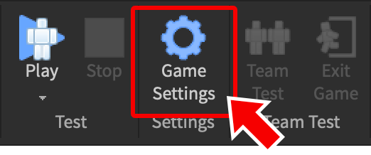
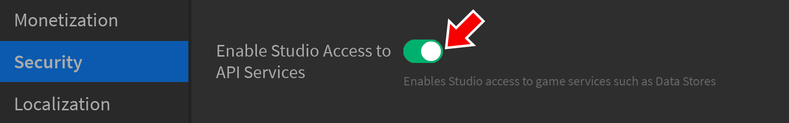
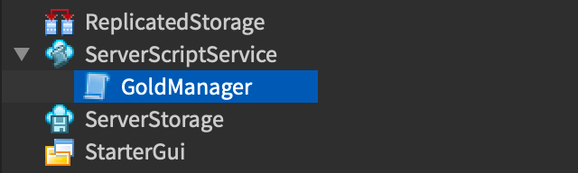
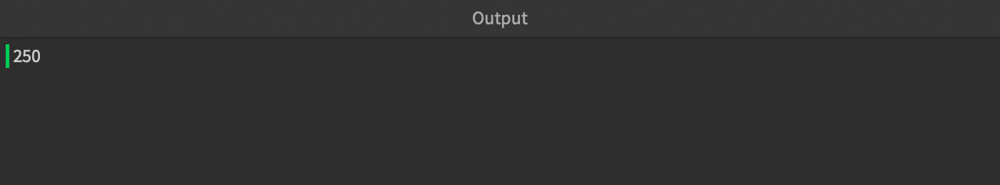
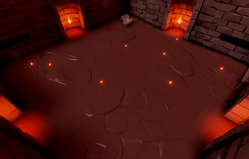
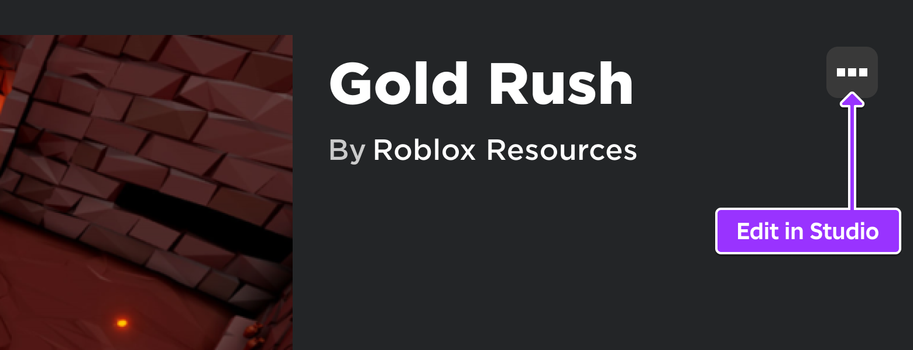
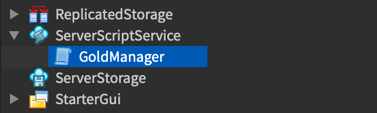

# Saving Data

## 목차
- [Saving Data](#saving-data)
  - [목차](#목차)
  - [스튜디오 액세스 활성화](#스튜디오-액세스-활성화)
  - [데이터 저장소 생성](#데이터-저장소-생성)
  - [데이터 저장](#데이터-저장)
    - [플레이어 데이터 예시](#플레이어-데이터-예시)
    - [프로모션 예시](#프로모션-예시)
  - [데이터 읽기](#데이터-읽기)
  - [샘플 프로젝트](#샘플-프로젝트)
  - [출처](#출처)
  - [다음](#다음)

---

게임은 종종 플레이어의 레벨, 경험치, 인벤토리 아이템, 골드/현금 등 세션 간에 **영구 데이터**를 저장해야 합니다.

이 튜토리얼에서는 기본적인 **데이터 저장소**를 생성하고, 샘플 데이터를 저장하고, 게임 세션에서 데이터를 읽는 방법을 보여줍니다.

## 스튜디오 액세스 활성화

기본적으로, 스튜디오에서 테스트된 게임은 데이터 저장소에 액세스할 수 없으므로 먼저 이를 활성화해야 합니다.

1. 게임을 **게시**(파일 > Roblox에 게시)하여 스튜디오 액세스를 활성화합니다.

2. **홈** 탭에서 **게임 설정** 창을 엽니다.

   

3. **보안** 섹션에서 **API 서비스에 대한 스튜디오 액세스 활성화**를 켭니다.

   

4. 변경 사항을 등록하려면 **저장**을 클릭합니다.

## 데이터 저장소 생성

데이터 저장소는 고유한 **이름**으로 식별됩니다. 이 예에서는 **PlayerGold**라는 데이터 저장소가 각 플레이어의 골드를 영구 저장소에 저장합니다.

1. `ServerScriptService` 내에 **GoldManager**라는 새로운 `Script`를 생성합니다.

   

2. 데이터 저장소는 `DataStoreService`에 의해 관리되므로 첫 번째 줄에서 서비스를 가져옵니다.

   ```lua
   local DataStoreService = game:GetService("DataStoreService")
   ```

3. `"PlayerGold"` 문자열을 사용하여 `DataStoreService:GetDataStore()`를 호출합니다. 이것은 **PlayerGold** 데이터 저장소가 이미 존재하면 이를 액세스하고, 그렇지 않으면 새로 생성합니다.

   ```lua
   local DataStoreService = game:GetService("DataStoreService")
   local goldStore = DataStoreService:GetDataStore("PlayerGold")
   ```

## 데이터 저장

데이터 저장소는 본질적으로 사전과 같으며, Lua 테이블과 유사합니다. 데이터 저장소의 각 값은 고유한 **키**로 인덱싱됩니다. 예를 들어, 플레이어의 고유한 `UserId` 또는 게임 프로모션을 위한 명명된 문자열이 될 수 있습니다.

### 플레이어 데이터 예시

<table>
    <thead>
        <tr>
            <th>키</th>
            <th>값</th>
        </tr>
    </thead>
    <tbody>
        <tr>
            <td>
                31250608
            </td>
            <td>
                50
            </td>
        </tr>
        <tr>
            <td>
                351675979
            </td>
            <td>
                20
            </td>
        </tr>
        <tr>
            <td>
                505306092
            </td>
            <td>
                78000
            </td>
        </tr>
    </tbody>
</table>

### 프로모션 예시

<table>
  <thead>
      <tr>
          <th>키</th>
          <th>값</th>
      </tr>
  </thead>
  <tbody>
      <tr>
          <td>
              ActiveSpecialEvent
          </td>
          <td>
              SummerParty2
          </td>
      </tr>
      <tr>
          <td>
              ActivePromoCode
          </td>
          <td>
              BONUS123
          </td>
      </tr>
      <tr>
          <td>
              CanAccessPartyPlace
          </td>
          <td>
              true
          </td>
      </tr>
  </tbody>
</table>

플레이어 데이터를 데이터 저장소에 저장하려면:

1. 데이터 저장소 키에 대한 `playerUserID`라는 변수를 생성합니다. 그런 다음, 플레이어의 시작 골드 양을 저장하는 `playerGold`를 사용합니다.

   ```lua
   local DataStoreService = game:GetService("DataStoreService")
   local goldStore = DataStoreService:GetDataStore("PlayerGold")

   -- 데이터 저장소 키와 값
   local playerUserID = 505306092
   local playerGold = 250
   ```

2. `PlayerGold` 데이터 저장소에 데이터를 저장하려면, `Global.LuaGlobals.pcall()` 내에서 키와 값을 전달하여 `SetAsync`를 호출합니다.

   ```lua
   local DataStoreService = game:GetService("DataStoreService")
   local goldStore = DataStoreService:GetDataStore("PlayerGold")

   -- 데이터 저장소 키와 값
   local playerUserID = 505306092
   local playerGold = 250

   -- 데이터 저장소 키 설정
   local setSuccess, errorMessage = pcall(function()
       goldStore:SetAsync(playerUserID, playerGold)
   end)
   if not setSuccess then
       warn(errorMessage)
   end
   ```

`SetAsync()`과 같은 함수는 네트워크 호출로 가끔 실패할 수 있습니다. 위에서 보듯이, `Global.LuaGlobals.pcall()`은 이러한 실패가 발생했을 때 감지하고 처리하는 데 사용됩니다.

가장 기본적인 형태에서 `Global.LuaGlobals.pcall()`은 함수를 받아 두 개의 값을 반환합니다:

- 상태 (`boolean`): 함수가 오류 없이 실행되었으면 true, 그렇지 않으면 false입니다.
- 함수의 반환 값 또는 오류 메시지.

위의 예에서, 상태 (`setSuccess`)는 12번째 줄에서 테스트되며, 어떤 이유로 `SetAsync()`가 실패하면, `errorMessage`가 출력 창에 표시됩니다.

<Alert severity="warning">

데이터 저장소에 너무 자주 요청을 보내지 않도록 주의하십시오. 데이터 저장소 키에 대한 요청은 큐에 배치되며, 큐가 가득 차면 추가 요청이 [삭제](https://create.roblox.com/docs/cloud-services/data-stores#error-codes)됩니다.

플레이어가 골드 조각을 획득할 때마다 플레이어의 골드 데이터를 업데이트하는 것은 일반적인 실수입니다. 대신, 플레이어의 골드를 변수에 저장하고, 주기적인 자동 저장 및/또는 플레이어가 게임을 떠날 때 데이터 저장소를 업데이트하십시오.

</Alert>

## 데이터 읽기

1. 데이터 저장소에서 데이터를 읽으려면 원하는 키 이름으로 `GetAsync()`를 호출합니다.

   ```lua
   local setSuccess, errorMessage = pcall(function()
       goldStore:SetAsync(playerUserID, playerGold)
   end)
   if not setSuccess then
       warn(errorMessage)
   end

   -- 데이터 저장소 키 읽기
   local getSuccess, currentGold = pcall(function()
       return goldStore:GetAsync(playerUserID)
   end)
   if getSuccess then
       print(currentGold)
   end
   ```

2. 스크립트를 테스트하려면 **실행**을 클릭하고 **출력** 창에 `currentGold` 값이 출력되는지 확인합니다. 함수가 데이터 저장소 서버에 연결해야 하므로 몇 초가 걸릴 수 있습니다.

   

## 샘플 프로젝트

이제 기본 데이터 저장소 사용법을 이해했으므로, 샘플 게임에서 이를 테스트해보세요.

<Grid container spacing={4}>
    <Grid item xs={6}>
        
    </Grid>
    <Grid item xs={6}>
        [Gold Rush](https://www.roblox.com/games/5268331031/Gold-Rush)<br />
        가능한 한 많은 골드 조각을 모아 게임 세션 간에 지속되는 개인 기록을 설정하세요.
    </Grid>
</Grid>

스튜디오에서 게임을 편집하고, 자동 저장 및 기타 기능이 포함된 향상된 **GoldManager** 스크립트를 탐색할 수도 있습니다.





---
## 출처
 - [Saving Data](https://create.roblox.com/docs/tutorials/scripting/intermediate-scripting/saving-data)

---
## [다음](./02_07_Creating_Player_Tools.md)