# Creating Player Tools

## 목차
- [Creating Player Tools](#creating-player-tools)
  - [목차](#목차)
  - [도구 생성](#도구-생성)
  - [도구 저장](#도구-저장)
    - [수집 가능한 도구](#수집-가능한-도구)
    - [시작 도구](#시작-도구)
  - [도구 속성](#도구-속성)
    - [위치 / 방향](#위치--방향)
    - [핫바 아이콘](#핫바-아이콘)
    - [툴팁](#툴팁)
  - [도구에 스크립트 추가](#도구에-스크립트-추가)
  - [사운드 추가](#사운드-추가)
  - [코드 추가](#코드-추가)
  - [출처](#출처)
  - [다음](#다음)

---

도구는 플레이어가 손에 들고 게임 내에서 사용할 수 있는 아이템을 관리하는 간단한 방법입니다. 도구는 검과 같은 무기부터 음식 아이템까지 다양할 수 있습니다.

이 튜토리얼에서는 장착하거나 활성화될 때 사운드 효과를 재생하는 레이저 블라스터 모양의 도구를 만드는 방법을 배우게 됩니다.

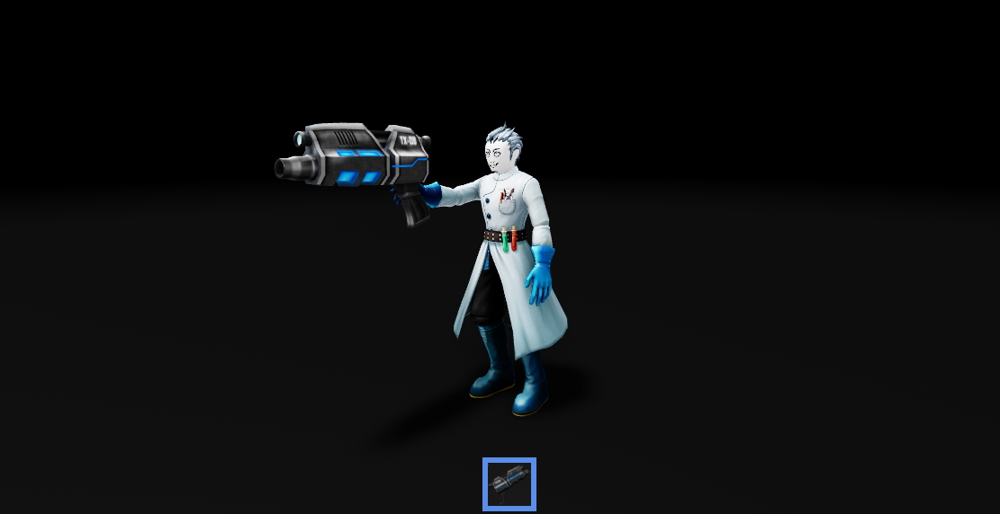

## 도구 생성

`Class.Tool` 객체는 Roblox의 모든 도구의 기본이므로 이를 생성해야 합니다. 도구의 외형을 변경하려면 도구에 부품(Parts)과 메쉬 파트(MeshParts)와 같은 객체를 추가하여 작업 영역에서 시각적으로 확인하는 것이 더 쉽습니다.

1. 작업 공간에 **Tool**을 삽입하고 **Blaster**로 이름을 지정합니다.

   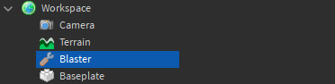

2. 도구에 `Class.MeshPart`를 삽입합니다.

   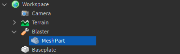

3. **MeshId** 속성을 `rbxassetid://92656610`으로 설정합니다.
4. **TextureId** 속성을 `rbxassetid://92658105`으로 설정합니다.

   <GridContainer numColumns="2">
     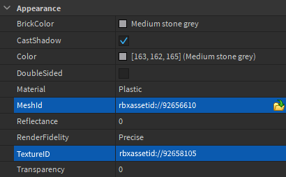
     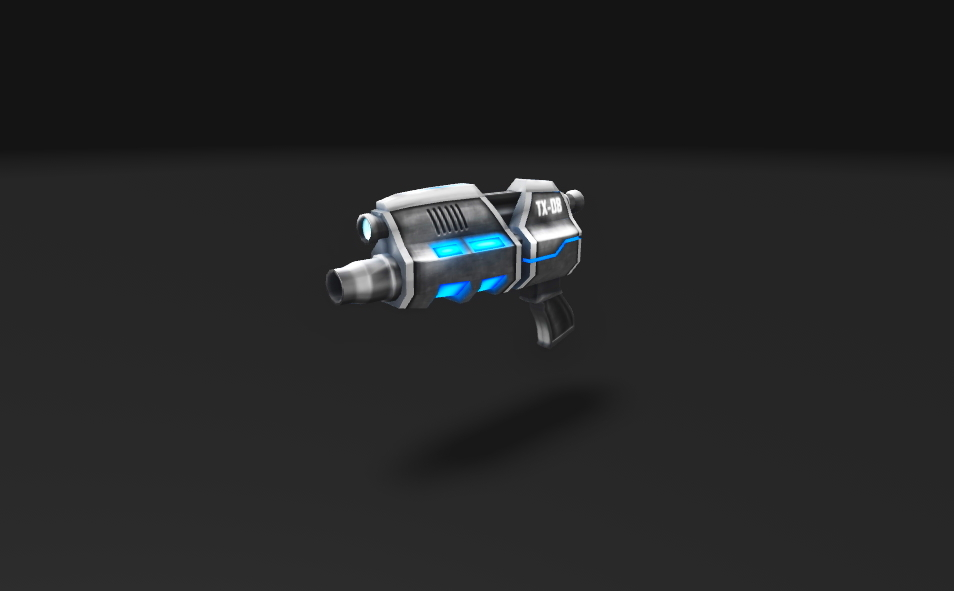
   </GridContainer>

5. 플레이어가 잡을 수 있도록 도구에는 **Handle**이라는 이름의 파트가 필요합니다. MeshPart의 이름을 **Handle**로 변경합니다.

   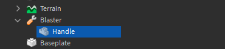

<Alert severity="warning">
  도구에 <b>Handle</b>이라는 이름의 파트를 포함하지 않으면 플레이어가 장착하려고 할 때 도구가 땅에 떨어집니다.
</Alert>

## 도구 저장

도구는 게임 세계에서 **수집 가능한 도구**로 보관하거나 모든 플레이어에게 **시작 도구**로 제공할 수 있습니다.

### 수집 가능한 도구

블라스터는 현재 **Workspace**의 자식이므로 수집 가능합니다. 플레이어가 도구를 만지면 도구가 캐릭터 모델의 자식이 되어 장착되어 핫바에 배치됩니다.

<!-- <video controls loop muted>
  <source src="../img/02_07_Creating_Player_Tools/video-collection.mp4" />
</video> -->
[](https://prod.docsiteassets.roblox.com/assets/tutorials/creating-player-tools/video-collection.mp4)

게임 플레이 중에 장착되지 않은 도구는 플레이어의 계층 구조에서 배낭에 저장되었다가 장착되면 캐릭터 모델로 이동됩니다. 캐릭터의 자식이 된 도구는 자동으로 장착됩니다.

<GridContainer numColumns="2">
  <figure>
    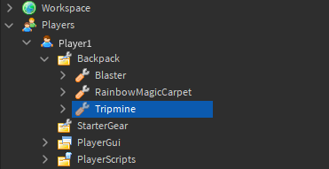
    <figcaption>트립마인 장착 해제</figcaption>
  </figure>
  <figure>
    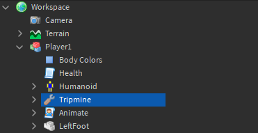
    <figcaption>트립마인 장착</figcaption>
  </figure>
</GridContainer>

### 시작 도구

도구를 `StarterPack`에 저장하면 게임에 참여하거나 리스폰할 때 플레이어의 `Backpack`에 배치됩니다.

1. **Blaster**를 Explorer에서 **StarterPack**으로 이동합니다.

   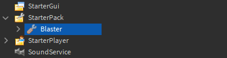

2. 게임을 실행하여 도구를 테스트합니다. 화면 하단의 핫바를 클릭하거나 키보드의 **1** 키를 눌러 도구를 장착합니다.

## 도구 속성

### 위치 / 방향

도구의 위치와 방향은 **그립** 속성을 사용하여 변경할 수 있습니다. **GripPos**는 그립의 위치를 변경하고, **GripForward**, **GripRight**, **GripUp**는 회전을 변경합니다.

현재 플레이어는 블라스터의 중심을 잡고 있습니다.

1. 도구의 **GripPos** 속성을 **0, -0.4, 1.1**로 설정합니다.

   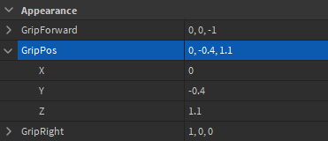

2. **Play** 버튼을 클릭하여 도구를 테스트합니다. 도구가 이제 다른 위치에서 잡히는 것을 확인할 수 있습니다.

   <GridContainer numColumns="2">
     <figure>
       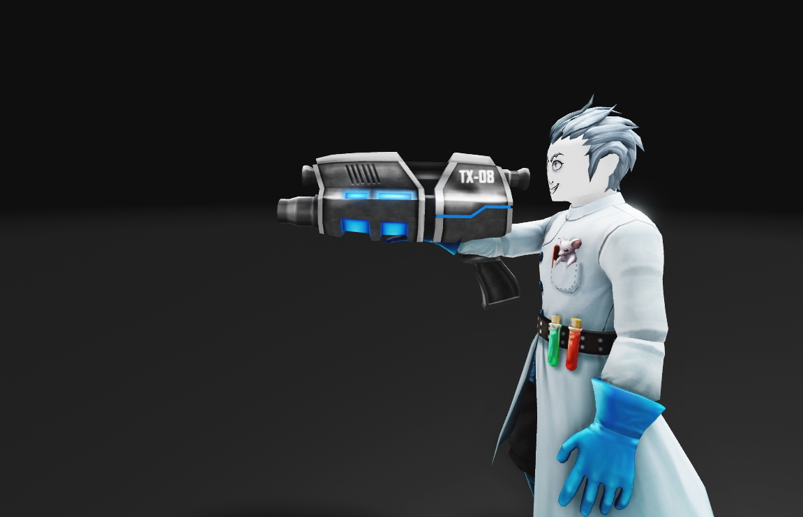
       <figcaption>이전</figcaption>
     </figure>
     <figure>
       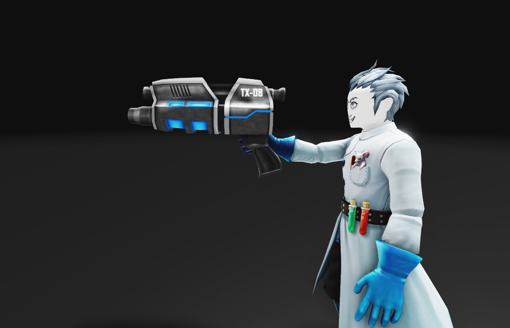
       <figcaption>이후</figcaption>
     </figure>
   </GridContainer>

### 핫바 아이콘

기본적으로 도구 **이름**이 핫바 아이콘에 표시됩니다. 아이콘을 도구의 이미지로 변경하는 것이 좋습니다. 도구의 **TextureId** 속성을 `rbxassetid://92628145`로 설정합니다.

<GridContainer numColumns="2">
  <figure>
    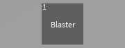
    <figcaption>이전</figcaption>
  </figure>
  <figure>
    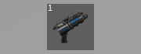
    <figcaption>이후</figcaption>
  </figure>
</GridContainer>

### 툴팁

**툴팁**은 핫바에서 도구 위에 마우스를 올리면 나타나는 작은 텍스트 설명입니다. 도구의 이름 및/또는 기능에 대한 간단한 설명을 포함하는 것이 일반적입니다. **ToolTip** 속성을 **Blaster**로 변경합니다.

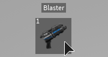

## 도구에 스크립트 추가

도구에는 `Equipped`, `Unequipped`, `Activated`의 세 가지 주요 이벤트를 연결할 수 있습니다.

<table>
    <thead>
        <tr>
            <th>이벤트</th>
            <th>설명</th>
        </tr>
    </thead>
    <tbody>
        <tr>
            <td><b>`Equipped`</b></td>
            <td>도구가 플레이어에 의해 장착될 때 발생합니다. 예를 들어, 도구가 핫바에서 선택될 때.</td>
        </tr>
        <tr>
            <td><b>`Unequipped`</b></td>
            <td>도구가 플레이어에 의해 장착 해제될 때 발생합니다. 예를 들어, 도구가 핫바에서 선택 해제될 때.</td>
        </tr>
        <tr>
            <td><b>`Activated`</b></td>
            <td>도구가 플레이어에 의해 활성화될 때 발생합니다. 예를 들어, 플레이어가 좌클릭할 때.</td>
        </tr>
    </tbody>
</table>

이 방법은 `LocalScripts`에서만 작동합니다. 플레이어의 장치에서만 입력이 발생했는지 알 수 있기 때문입니다. 예를 들어, 마우스 버튼 클릭 또는 화면 터치가 발생했을 때입니다.

## 사운드 추가

이벤트가 발생할 때 사운드를 재생하려면 먼저 사용할 사운드 객체를 생성해야 합니다.

1. **Handle**에 두 개의 `Sound` 객체를 삽입합니다.

2. 하나의 사운드 이름을 **Equip**으로 설정하고, SoundId 속성을 `rbxassetid://282906960`으로 설정합니다.

3. 다른 사운드 이름을 **Activate**로 설정하고, SoundId 속성을 `rbxassetid://130113322`로 설정합니다.

   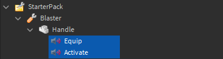

## 코드 추가

아래 예제 코드는 도구가 장착될 때 **Equip** 사운드를, 활성화될 때 **Fire** 사운드를 재생합니다.

1. 도구에 **LocalScript**를 삽입하고 이름을 **ToolController**로 설정합니다.

   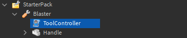

2. 스크립트에 다음 코드를 삽입합니다.

   ```lua
   local tool = script.Parent

   local function toolEquipped()
   	tool.Handle.Equip:Play()
   end

   local function toolActivated()
   	tool.Handle.Activate:Play()
   end

   tool.Equipped:Connect(toolEquipped)
   tool.Activated:Connect(toolActivated)
   ```

3. 도구를 장착하고 클릭하여 블라스터 사운드 효과를 테스트합니다.

이제 기본 도구를 만들고 스크립트를 추가하는 방법을 알게 되었으니, 손전등이나 스피커와 같은 다른 간단한 도구를 만들어 보세요.

---
## 출처
 - [Creating Player Tools](https://create.roblox.com/docs/tutorials/scripting/intermediate-scripting/creating-player-tools)

---
## [다음](./02_08_Hit_Detection_with_Lasers.md)