# Hit Detection with Lasers

## 목차
- [Hit Detection with Lasers](#hit-detection-with-lasers)
  - [목차](#목차)
  - [충돌을 찾기 위한 레이캐스팅](#충돌을-찾기-위한-레이캐스팅)
  - [마우스 위치 찾기](#마우스-위치-찾기)
  - [충돌 정보](#충돌-정보)
  - [목표를 향해 발사](#목표를-향해-발사)
  - [맞은 객체 확인하기](#맞은-객체-확인하기)
  - [다중 플레이어로 테스트하기](#다중-플레이어로-테스트하기)
  - [레이저 위치 찾기](#레이저-위치-찾기)
  - [레이저 파트 생성](#레이저-파트-생성)
  - [무기 발사 속도 제어](#무기-발사-속도-제어)
  - [플레이어에게 피해 입히기](#플레이어에게-피해-입히기)
  - [다른 플레이어의 레이저 빔 렌더링](#다른-플레이어의-레이저-빔-렌더링)
    - [발사한 클라이언트](#발사한-클라이언트)
    - [서버](#서버)
    - [클라이언트에서 렌더링](#클라이언트에서-렌더링)
  - [사운드 효과](#사운드-효과)
  - [검증을 통한 원격 보안](#검증을-통한-원격-보안)
    - [클라이언트](#클라이언트)
    - [서버](#서버-1)
  - [Final Code](#final-code)
    - [ToolController](#toolcontroller)
    - [LaserRenderer](#laserrenderer)
    - [ServerLaserManager](#serverlasermanager)
    - [ClientLaserManager](#clientlasermanager)
  - [출처](#출처)
  - [다음](#다음)

---

이 튜토리얼에서는 [플레이어 도구 생성](https://create.roblox.com/docs/tutorials/scripting/intermediate-scripting/creating-player-tools)에서 만든 블라스터에서 레이저를 쏘고, 플레이어에게 맞았는지 여부를 감지하는 방법을 배웁니다.

<video controls loop muted>
    <source src="../img/02_08_Hit_Detection_with_Lasers/Introduction-Video.mp4" />
</video>

## 충돌을 찾기 위한 레이캐스팅

**레이캐스팅**은 시작 위치에서 주어진 방향으로 일정 길이의 보이지 않는 레이를 생성합니다. 레이가 경로에서 객체나 지형과 충돌하면, 충돌 위치 및 충돌한 객체와 같은 정보를 반환합니다.

<figure>
    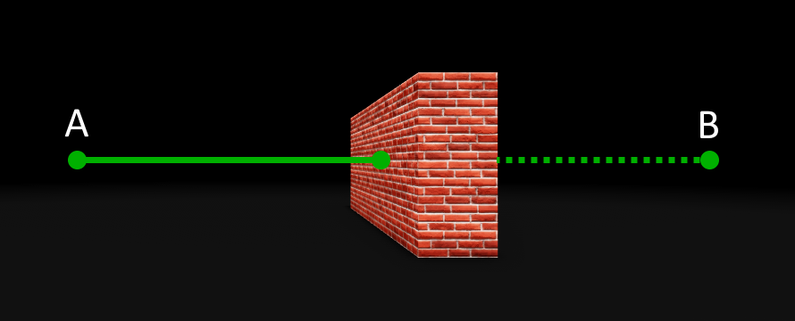
    <figcaption>A에서 B로 향하는 레이캐스트가 벽과 충돌</figcaption>
</figure>

## 마우스 위치 찾기

레이저를 쏘기 전에 플레이어가 어디를 조준하고 있는지 알아야 합니다. 이는 화면상의 플레이어의 2D 마우스 위치에서 게임 세계로 향하는 카메라의 전방으로 레이캐스팅하여 찾을 수 있습니다. 레이는 플레이어가 마우스로 조준하는 객체와 충돌할 것입니다.

1. [플레이어 도구 생성](./02_07_Creating_Player_Tools.md)에서 Blaster 도구 안의 **ToolController** 스크립트를 엽니다. 이 튜토리얼을 완료하지 않았다면 [Blaster](https://www.roblox.com/library/6571559694/Blaster) 모델을 다운로드하여 StarterPack에 삽입할 수 있습니다.

   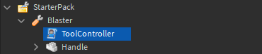

   <Alert severity="info">

   모델을 인벤토리에 추가하여 모든 게임에서 사용할 수 있습니다.

   1. 브라우저에서 [모델](https://www.roblox.com/library/6571559694/Blaster) 페이지를 열고 **Get** 버튼을 클릭합니다. 이렇게 하면 모델이 인벤토리에 추가됩니다.
   2. Studio에서 **View** 탭으로 이동하고 **Toolbox**를 클릭합니다.
   3. Toolbox 창에서 **Inventory** 버튼을 클릭합니다. 그런 다음 드롭다운이 **My Models**로 설정되어 있는지 확인합니다.
   4. **Blaster** 모델을 선택하여 **StarterPack**에 추가합니다.

   </Alert>

2. 스크립트 상단에 MAX_MOUSE_DISTANCE라는 상수를 선언하고 값을 **1000**으로 설정합니다.

3. `getWorldMousePosition`이라는 함수를 만듭니다.

   ```lua
   local tool = script.Parent

   local MAX_MOUSE_DISTANCE = 1000

   local function getWorldMousePosition()

   end

   local function toolEquipped()
       tool.Handle.Equip:Play()
   end

   local function toolActivated()
       tool.Handle.Activate:Play()
   end

   -- 적절한 함수에 이벤트를 연결합니다.
   tool.Equipped:Connect(toolEquipped)
   tool.Activated:Connect(toolActivated)
   ```

4. `UserInputService`의 GetMouseLocation 함수를 사용하여 화면상의 플레이어의 2D 마우스 위치를 가져옵니다. 이를 **mouseLocation** 변수에 할당합니다.

   ```lua
   local UserInputService = game:GetService("UserInputService")

   local tool = script.Parent

   local MAX_MOUSE_DISTANCE = 1000

   local function getWorldMousePosition()
       local mouseLocation = UserInputService:GetMouseLocation()
   end
   ```

이제 2D 마우스 위치가 알려졌으므로, 그 **X** 및 **Y** 속성을 `Camera:ViewportPointToRay()` 함수의 매개변수로 사용하여 화면에서 3D 게임 세계로의 `Datatype.Ray`를 생성할 수 있습니다.

1. `mouseLocation`의 **X** 및 **Y** 속성을 `Camera:ViewportPointToRay()` 함수의 인수로 사용합니다. 이를 **screenToWorldRay** 변수에 할당합니다.

   ```lua
   local function getWorldMousePosition()
       local mouseLocation = UserInputService:GetMouseLocation()

       -- 2D 마우스 위치에서 레이 생성
       local screenToWorldRay = workspace.CurrentCamera:ViewportPointToRay(mouseLocation.X, mouseLocation.Y)
   end
   ```

이제 `WorldRoot:Raycast()` 함수를 사용하여 레이가 객체와 충돌하는지 확인할 차례입니다. 이 함수는 시작 위치와 방향 벡터가 필요합니다. 이 예제에서는 `screenToWorldRay`의 origin과 direction 속성을 사용합니다.

방향 벡터의 길이는 레이의 이동 거리를 결정합니다. 레이가 `MAX_MOUSE_DISTANCE`만큼 길어야 하므로 방향 벡터에 `MAX_MOUSE_DISTANCE`를 곱해야 합니다.

1. **directionVector**라는 변수를 선언하고 `screenToWorldRay.Direction`에 `MAX_MOUSE_DISTANCE`를 곱한 값을 할당합니다.

   ```lua
   local function getWorldMousePosition()
       local mouseLocation = UserInputService:GetMouseLocation()

       -- 2D 마우스 위치에서 레이 생성
       local screenToWorldRay = workspace.CurrentCamera:ViewportPointToRay(mouseLocation.X, mouseLocation.Y)

       -- 레이의 단위 방향 벡터에 최대 거리를 곱한 값
       local directionVector = screenToWorldRay.Direction * MAX_MOUSE_DISTANCE
   ```

2. workspace의 `WorldRoot:Raycast()` 함수를 호출하여 `screenToWorldRay`의 **Origin** 속성을 첫 번째 인수로, `directionVector`를 두 번째 인수로 전달합니다. 이를 **raycastResult** 변수에 할당합니다.

   ```lua
   local function getWorldMousePosition()
       local mouseLocation = UserInputService:GetMouseLocation()

       -- 2D 마우스 위치에서 레이 생성
       local screenToWorldRay = workspace.CurrentCamera:ViewportPointToRay(mouseLocation.X, mouseLocation.Y)

       -- 레이의 단위 방향 벡터에 최대 거리를 곱한 값
       local directionVector = screenToWorldRay.Direction * MAX_MOUSE_DISTANCE

       -- 레이의 원점에서 방향으로 레이캐스트
       local raycastResult = workspace:Raycast(screenToWorldRay.Origin, directionVector)
   ```

## 충돌 정보

레이캐스트 작업이 레이와 충돌한 객체를 찾으면 `Datatype.RaycastResult`를 반환하며, 이는 레이와 객체 사이의 충돌에 대한 정보를 포함합니다.

<table>
    <thead>
        <tr>
            <th>RaycastResult 속성</th>
            <th>설명</th>
        </tr>
    </thead>
    <tbody>
        <tr>
            <td><b>Instance</b></td>
            <td>레이가 교차한 `BasePart` 또는 `Terrain` 셀입니다.</td>
        </tr>
        <tr>
            <td><b>Position</b></td>
            <td>교차가 발생한 위치; 일반적으로 파트나 지형의 표면 바로 위의 점입니다.</td>
        </tr>
        <tr>
            <td><b>Material</b></td>
            <td>충돌 지점의 재질입니다.</td>
        </tr>
        <tr>
            <td><b>Normal</b></td>
            <td>교차된 면의 법선 벡터입니다. 이는 면이 어느 방향으로 향하고 있는지 결정하는 데 사용될 수 있습니다.</td>
        </tr>
    </tbody>
</table>

**Position** 속성은 마우스가 가리키고 있는 객체의 위치가 될 것입니다. 마우스가 `MAX_MOUSE_DISTANCE` 내에 있는 객체를 가리키지 않으면 `raycastResult`는 nil이 됩니다.

1. `raycastResult`가 존재하는지 확인하는 if 문을 만듭니다.

2. `raycastResult`에 값이 있으면, 그 **Position** 속성을 반환합니다.

3. `raycastResult`가 nil이면 레이캐스트의 끝을 찾습니다. 마우스의 3D 위치를 `screenToWorldRay.Origin`과 `directionVector`를 더하여 계산합니다.

```lua
local function getWorldMousePosition()
    local mouseLocation = UserInputService:GetMouseLocation()

    -- 2D 마우스 위치에서 레이 생성
    local screenToWorldRay = workspace.CurrentCamera:ViewportPointToRay(mouseLocation.X, mouseLocation.Y)

    -- 레이의 단위 방향 벡터에 최대 거리를 곱한 값
    local directionVector = screenToWorldRay.Direction * MAX_MOUSE_DISTANCE

    -- 레이의 원점에서 방향으로 레이캐스트
    local raycastResult = workspace:Raycast(screenToWorldRay.Origin, directionVector)

    if raycastResult then
        -- 교차된 3D 점 반환
        return raycastResult.Position
    else
        -- 객체와 충돌하지 않으면 레이의 끝 위치 계산
        return screenToWorldRay.Origin + directionVector
    end
end
```

## 목표를 향해 발사

이

제 3D 마우스 위치가 알려졌으므로, 이를 **목표 위치**로 사용하여 레이저를 쏠 수 있습니다. 두 번째 레이를 플레이어의 무기에서 목표 위치로 발사하는 데 **Raycast** 함수를 사용할 수 있습니다.

1. 스크립트 상단에 `MAX_LASER_DISTANCE`라는 상수를 선언하고 값을 **500**으로 설정합니다.

   ```lua
   local UserInputService = game:GetService("UserInputService")

   local tool = script.Parent

   local MAX_MOUSE_DISTANCE = 1000
   local MAX_LASER_DISTANCE = 500
   ```

2. `getWorldMousePosition` 함수 아래에 **fireWeapon**이라는 함수를 만듭니다.

3. `getWorldMousePosition` 함수를 호출하고 결과를 **mousePosition** 변수에 할당합니다. 이는 레이캐스트의 목표 위치가 될 것입니다.

   ```lua
           -- 객체와 충돌하지 않으면 레이의 끝 위치 계산
           return screenToWorldRay.Origin + directionVector
       end
   end

   local function fireWeapon()
       local mouseLocation = getWorldMousePosition()
   end

   local function toolEquipped()
       tool.Handle.Equip:Play()
   end
   ```

이번에는 레이캐스트 함수의 방향 벡터가 플레이어의 도구 위치에서 목표 위치까지의 방향을 나타냅니다.

1. **targetDirection**이라는 변수를 선언하고 `mouseLocation`에서 도구 위치를 빼서 방향 벡터를 계산합니다.

2. 벡터의 **Unit** 속성을 사용하여 정규화합니다. 이는 벡터의 크기를 1로 만들며, 이후 곱하기 쉬운 값으로 만들어줍니다.

   ```lua
   local function fireWeapon()
       local mouseLocation = getWorldMousePosition()

       -- 정규화된 방향 벡터를 계산하고 레이저 거리를 곱함
       local targetDirection = (mouseLocation - tool.Handle.Position).Unit
   end
   ```

3. **directionVector**라는 변수를 선언하고 `targetDirection`에 `MAX_LASER_DISTANCE`를 곱한 값을 할당합니다.

   ```lua
       local targetDirection = (mouseLocation - tool.Handle.Position).Unit

       -- 무기 발사 방향에 최대 거리를 곱한 값
       local directionVector = targetDirection * MAX_LASER_DISTANCE
   end
   ```

`Datatype.RaycastParams` 객체는 레이캐스트 함수에 추가 매개변수를 저장하는 데 사용할 수 있습니다. 이를 레이저 블라스터에서 사용하여 레이캐스트가 무기를 발사하는 플레이어와 우연히 충돌하지 않도록 할 것입니다. RaycastParams 객체의 `FilterDescendantsInstances` 속성에 포함된 모든 파트는 레이캐스트에서 **무시**됩니다.

1. `fireWeapon` 함수에서 **weaponRaycastParams**라는 변수를 선언하고 새 RaycastParams 객체를 할당합니다.

2. 플레이어의 로컬 **캐릭터**를 포함하는 테이블을 만들고 이를 `weaponRaycastParams.FilterDescendantsInstances` 속성에 할당합니다.

3. 플레이어의 도구 핸들 위치에서 `directionVector` 방향으로 레이캐스트합니다. 이번에는 `weaponRaycastParams`를 인수로 추가하는 것을 잊지 마세요. 이를 **weaponRaycastResult** 변수에 할당합니다.

```lua
local UserInputService = game:GetService("UserInputService")
local Players = game:GetService("Players")

local tool = script.Parent

local MAX_MOUSE_DISTANCE = 1000
local MAX_LASER_DISTANCE = 500

local function getWorldMousePosition()
```

```lua
local function fireWeapon()
    local mouseLocation = getWorldMousePosition()

    -- 정규화된 방향 벡터를 계산하고 레이저 거리를 곱함
    local targetDirection = (mouseLocation - tool.Handle.Position).Unit

    -- 무기 발사 방향에 최대 거리를 곱한 값
    local directionVector = targetDirection * MAX_LASER_DISTANCE

    -- 플레이어의 캐릭터를 무시하여 자가 피해 방지
    local weaponRaycastParams = RaycastParams.new()
    weaponRaycastParams.FilterDescendantsInstances = {Players.LocalPlayer.Character}
    local weaponRaycastResult = workspace:Raycast(tool.Handle.Position, directionVector, weaponRaycastParams)
end
```

마지막으로, 레이캐스트 작업이 값을 반환했는지 확인해야 합니다. 값이 반환되면 레이가 객체와 충돌한 것이고, 레이저를 무기와 히트 위치 사이에 생성할 수 있습니다. 아무것도 반환되지 않으면 레이캐스트의 최종 위치를 계산하여 레이저를 생성해야 합니다.

1. **hitPosition**이라는 빈 변수를 선언합니다.

2. **if** 문을 사용하여 `weaponRaycastResult`에 값이 있는지 확인합니다. 객체와 충돌한 경우 `weaponRaycastResult.Position`을 `hitPosition`에 할당합니다.

   ```lua
       local weaponRaycastResult = workspace:Raycast(tool.Handle.Position, directionVector, weaponRaycastParams)

       -- 시작 위치와 끝 위치 사이에 객체와 충돌했는지 확인
       local hitPosition
       if weaponRaycastResult then
           hitPosition = weaponRaycastResult.Position
       end
   ```

3. `weaponRaycastResult`에 값이 없는 경우, 도구 핸들의 **position**과 `directionVector`를 더하여 레이캐스트의 끝 위치를 계산합니다. 이를 **hitPosition**에 할당합니다.

   ```lua
       local weaponRaycastResult = workspace:Raycast(tool.Handle.Position, directionVector, weaponRaycastParams)

       -- 시작 위치와 끝 위치 사이에 객체와 충돌했는지 확인
       local hitPosition
       if weaponRaycastResult then
           hitPosition = weaponRaycastResult.Position
       else
           -- 최대 레이저 거리를 기준으로 끝 위치 계산
           hitPosition = tool.Handle.Position + directionVector
       end
   end
   ```

4. `toolActivated` 함수로 이동하여 도구가 활성화될 때마다 레이저가 발사되도록 `fireWeapon` 함수를 호출합니다.

   ```lua
   local function toolActivated()
       tool.Handle.Activate:Play()
       fireWeapon()
   end
   ```

## 맞은 객체 확인하기

레이저에 맞은 객체가 플레이어의 캐릭터의 일부인지 아니면 단순한 장식인지 확인하려면 `Humanoid`를 찾아야 합니다. 모든 캐릭터에는 `Humanoid`가 있기 때문입니다.

먼저, **캐릭터 모델**을 찾아야 합니다. 캐릭터의 일부가 맞았다면, 맞은 객체의 부모가 캐릭터일 것이라고 가정할 수 없습니다. 레이저는 신체 부위, 액세서리 또는 도구를 맞출 수 있으며, 이는 모두 캐릭터의 계층 구조에서 다른 부분에 위치해 있습니다.

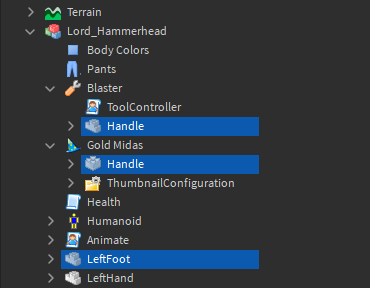

레이저에 맞은 객체의 상위 객체 중 캐릭터 모델이 있는지 확인하려면 `FindFirstAncestorOfClass`를 사용할 수 있습니다. 모델을 찾았고 그 모델에 `Humanoid`가 포함되어 있다면, 대부분의 경우 그것이 캐릭터라고 가정할 수 있습니다.

<Alert severity="warning">
게임에 `Humanoid`를 포함하는 다른 모델이 있는 경우, 추가 확인이 필요합니다.
</Alert>

1. `weaponRaycastResult` **if** 문에 아래 강조된 코드를 추가하여 캐릭터가 맞았는지 확인합니다.

   ```lua
       -- 시작 위치와 끝 위치 사이에 객체와 충돌했는지 확인
       local hitPosition
       if weaponRaycastResult then
           hitPosition = weaponRaycastResult.Position

           -- 맞은 인스턴스는 캐릭터 모델의 자식일 것입니다
           -- 모델에서 Humanoid를 찾으면 플레이어의 캐릭터일 가능성이 큽니다
           local characterModel = weaponRaycastResult.Instance:FindFirstAncestorOfClass("Model")
           if characterModel then
               local humanoid = characterModel:FindFirstChildWhichIsA("Humanoid")
               if humanoid then
                   print("Player hit")
               end
           end
       else
           -- 최대 레이저 거리를 기준으로 끝 위치 계산
           hitPosition = tool.Handle.Position + directionVector
       end
   ```

이제 레이저 블라스터는 레이캐스트 작업이 다른 플레이어를 맞출 때마다 출력 창에 `Player hit`를 출력해야 합니다.

## 다중 플레이어로 테스트하기

무기가 레이캐스트로 다른 플레이어를 찾는지 테스트하려면 두 명의 플레이어가 필요하므로 로컬 서버를 시작해야 합니다.

1. 스튜디오에서 **Test** 탭을 선택합니다.

   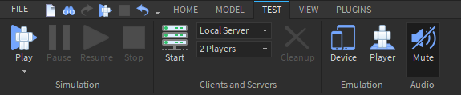

2. 플레이어 드롭다운이 '2 Players'로 설정되어 있는지 확인하고, **시작** 버튼을 클릭하여 2명의 클라이언트로 로컬 서버를 시작합니다. 세 개의 창이 나타날 것입니다. 첫 번째 창은 로컬 서버이고, 나머지 두 개의 창은 Player1과 Player2의 클라이언트입니다.

   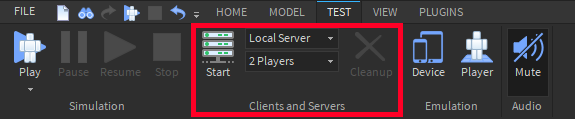

3. 한 클라이언트에서 다른 플레이어를 무기로 쏘아보세요. "Player hit"이 출력 창에 표시될 것입니다.

   <video controls loop muted>
    <source src="../img/02_08_Hit_Detection_with_Lasers/Output-Video.mp4" />
   </video>

테스트 탭에 대한 자세한 내용은 [여기](../../../studio/test-tab.md)에서 확인할 수 있습니다.

## 레이저 위치 찾기

블라스터는 목표를 향해 빨간색 광선을 발사해야 합니다. 이 기능은 `ModuleScript` 내에서 구현되어 나중에 다른 스크립트에서도 재사용할 수 있도록 합니다. 먼저, 레이저 빔을 렌더링할 위치를 찾아야 합니다.

1. StarterPlayerScripts 아래의 StarterPlayer에 **ModuleScript**를 생성하고 이름을 **LaserRenderer**로 설정합니다.

   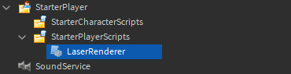

2. 스크립트를 열고 모듈 테이블의 이름을 **LaserRenderer**로 변경합니다.

3. **SHOT_DURATION**이라는 변수를 선언하고 값을 **0.15**로 설정합니다. 이는 레이저가 보이는 시간(초)입니다.

4. LaserRenderer의 **createLaser**라는 함수를 만들고 두 개의 매개변수 **toolHandle**과 **endPosition**을 추가합니다.

   ```lua
   local LaserRenderer = {}

   local SHOT_DURATION = 0.15 -- 레이저가 보이는 시간

   -- 시작 위치에서 끝 위치를 향해 레이저 빔 생성
   function LaserRenderer.createLaser(toolHandle, endPosition)

   end

   return LaserRenderer
   ```

5. **startPosition**이라는 변수를 선언하고 `toolHandle`의 **Position** 속성을 값으로 설정합니다. 이는 플레이어의 레이저 블라스터 위치가 됩니다.

6. **laserDistance**라는 변수를 선언하고 `endPosition`에서 `startPosition`을 빼서 두 벡터 사이의 차이를 찾습니다. 이 벡터의 **Magnitude** 속성을 사용하여 레이저 빔의 길이를 얻습니다.

   ```lua
   function LaserRenderer.createLaser(toolHandle, endPosition)
       local startPosition = toolHandle.Position

       local laserDistance = (startPosition - endPosition).Magnitude
   end
   ```

7. **laserCFrame** 변수를 선언하여 레이저 빔의 위치와 방향을 저장합니다. 위치는 빔의 시작과 끝의 중간이어야 합니다. **CFrame.lookAt**을 사용하여 `startPosition`에 위치한 새로운 `Datatype.CFrame`을 생성하고 `endPosition`을 향해 바라보게 합니다. 이를 레이저 거리의 절반을 음수로 한 새로운 CFrame에 곱하여 중간 위치를 얻습니다.

   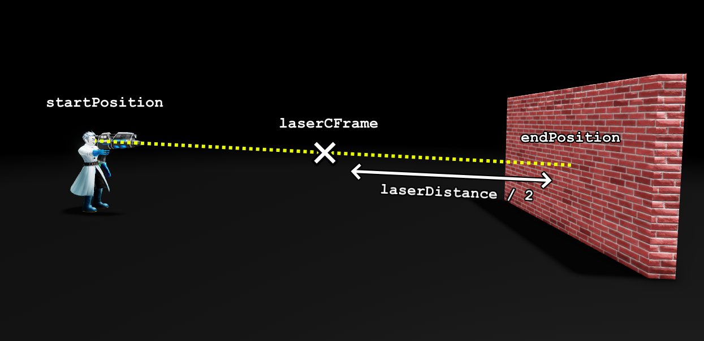

   ```lua
   function LaserRenderer.createLaser(toolHandle, endPosition)
       local startPosition = toolHandle.Position

       local laserDistance = (startPosition - endPosition).Magnitude
       local laserCFrame = CFrame.lookAt(startPosition, endPosition) * CFrame.new(0, 0, -laserDistance / 2)
   end
   ```

## 레이저 파트 생성

이제 레이저 빔을 생성할 위치를 알았으므로, 실제 빔을 추가해야 합니다. 이는 네온 파트로 쉽게 구현할 수 있습니다.

1. **laserPart**라는 변수를 선언하고 새로운 `Part` 인스턴스를 할당합니다.

2. `laserPart`의 다음 속성을 설정합니다:

   1. **Size**: Vector3.new(0.2, 0.2, laserDistance)
   2. **CFrame**: laserCFrame
   3. **Anchored**: true
   4. **CanCollide**: false
   5. **Color**: Color3.fromRGB(225, 0, 0) (강렬한 빨간색)
   6. **Material**: Enum.Material.Neon

3. `laserPart`를 **Workspace**에 부모로 설정합니다.

4. 파트를 `Debris` 서비스에 추가하여 `SHOT_DURATION` 변수에 있는 초 수 이후에 제거되도록 합니다.

   ```lua
   function LaserRenderer.createLaser(toolHandle, endPosition)
       local startPosition = toolHandle.Position

       local laserDistance = (startPosition - endPosition).Magnitude
       local laserCFrame = CFrame.lookAt(startPosition, endPosition) * CFrame.new(0, 0, -laserDistance / 2)

       local laserPart = Instance.new("Part")
       laserPart.Size = Vector3.new(0.2, 0.2, laserDistance)
       laserPart.CFrame = laserCFrame
       laserPart.Anchored = true
       laserPart.CanCollide = false
       laserPart.Color = Color3.fromRGB(225, 0, 0)
       laserPart.Material = Enum.Material.Neon
       laserPart.Parent = workspace

       -- Debris 서비스에 레이저 빔을 추가하여 제거 및 정리
       Debris:AddItem(laserPart, SHOT_DURATION)
   end
   ```

이제 레이저 빔을 렌더링하는 함수가 완성되었으므로 **ToolController**에서 호출할 수 있습니다.

1. **ToolController** 스크립트 상단에서 **LaserRenderer**라는 변수를 선언하고 PlayerScripts에 있는 LaserRenderer ModuleScript를 require 합니다.

   ```lua
   local UserInputService = game:GetService("UserInputService")
   local Players = game:GetService("Players")

   local LaserRenderer = require(Players.LocalPlayer.PlayerScripts.LaserRenderer)

   local tool = script.Parent
   ```

2. `fireWeapon` 함수의 끝에서 LaserRenderer `createLaser` 함수를 도구 핸들과 `hitPosition`을 인수로 호출합니다.

   ```lua
           -- 최대 레이저 거리를 기준으로 끝 위치 계산
           hitPosition = tool.Handle.Position + directionVector
       end

       LaserRenderer.createLaser(tool.Handle, hitPosition)
   end


   ```

3. **플레이** 버튼을 클릭하여 무기를 테스트합니다. 도구가 활성화될 때 무기와 마우스 사이에 레이저 빔이 보여야 합니다.

<video controls loop muted>
    <source src="../img/02_08_Hit_Detection_with_Lasers/Laser-Render-Video.mp4" />
</video>

## 무기 발사 속도 제어

무기가 너무 짧은 시간에 많은 피해를 입지 않도록 하려면 각 발사 사이에 지연 시간을 두어야 합니다. 이는 플레이어가 마지막으로 발사한 후 충분한 시간이 지났는지 확인하여 제어할 수 있습니다.

1. **ToolController** 상단에 **FIRE_RATE**라는 변수를 선언합니다. 이는 각 발사 사이의 최소 시간을 나타냅니다. 이 예제에서는 **0.3**초로 설정합니다.

2. **timeOfPreviousShot**이라는 변수를 그 아래에 선언하고 값을 **0**으로 설정합니다. 이는 플레이어가 마지막으로 발사한 시간을 저장하며, 각 발사 시 업데이트됩니다.

   ```lua
   local MAX_MOUSE_DISTANCE = 1000
   local MAX_LASER_DISTANCE = 300
   local FIRE_RATE = 0.3
   local timeOfPreviousShot = 0
   ```

3. 매개변수가 없는 **canShootWeapon**이라는 함수를 만듭니다. 이 함수는 이전 발사 후 얼마나 시간이 지났는지 확인하고 true 또는 false를 반환합니다.

   ```lua
   local FIRE_RATE = 0.3
   local timeOfPreviousShot = 0

   -- 이전 발사 후 충분한 시간이 지났는지 확인
   local function canShootWeapon()

   end

   local function getWorldMousePosition()
   ```

4. 함수 내부에 **currentTime**이라는 변수를 선언하고 `tick()` 함수를 호출한 결과를 할당합니다. 이 함수는 1970년 1월 1일 이후 경과된 시간을 초 단위로 반환합니다(시간을 계산하는 데 널리 사용되는 임의의 날짜).

5. `currentTime`에서 `timeOfPreviousShot`를 빼고 결과가 `FIRE_RATE`보다 작으면 **false**를 반환하고, 그렇지 않으면 **true**를 반환합니다.

   ```lua
   -- 이전 발사 후 충분한 시간이 지났는지 확인
   local function canShootWeapon()
       local currentTime = tick()
       if currentTime - timeOfPreviousShot < FIRE_RATE then
           return false
       end
       return true
   end
   ```

6. `fireWeapon` 함수의 끝에서 무기를 발사할 때마다 `tick`을 사용하여 `timeOfPreviousShot`을 업데이트합니다.

   ```lua
           hitPosition = tool.Handle.Position + directionVector
       end

       timeOfPreviousShot = tick()

       LaserRenderer.createLaser(tool.Handle, hitPosition)
   end
   ```

7. `toolActivated` 함수 내부에 **if** 문을 추가하고 `canShootWeapon`을 호출하여 무기를 발사할 수 있는지 확인합니다.

   ```lua
   local function toolActivated()
       if canShootWeapon() then
           tool.Handle.Activate:Play()
           fireWeapon()
       end
   end
   ```

블라스터를 테스트할 때 얼마나 빨리 클릭해도 각 발사 사이에 항상 0.3초의 지연이 있을 것입니다.

## 플레이어에게 피해 입히기

클라이언트는 다른 클라이언트에게 직접 피해를 입힐 수 없습니다; 서버가 플레이어가 맞았을 때 피해를 입히는 책임을 져야 합니다.

클라이언트는 `RemoteEvent`를 사용하여 서버에게 캐릭터가 맞았다는 것을 알릴 수 있습니다. 이는 클라이언트와 서버 모두에서 볼 수 있도록 **ReplicatedStorage**에 저장되어야 합니다.

1. ReplicatedStorage에 **Events**라는 폴더를 만듭니다.

   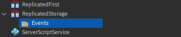

2. Events 폴더에 RemoteEvent를 삽입하고 **DamageCharacter**라고 이름을 지정합니다.

   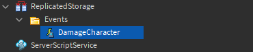

3. **ToolController**에서 스크립트의 시작 부분에 ReplicatedStorage와 Events 폴더에 대한 변수를 생성합니다.

   ```lua
   local UserInputService = game:GetService("UserInputService")
   local Players = game:GetService("Players")
   local ReplicatedStorage = game:GetService("ReplicatedStorage")

   local LaserRenderer = require(Players.LocalPlayer.PlayerScripts.LaserRenderer)

   local tool = script.Parent
   local eventsFolder = ReplicatedStorage.Events

   local MAX_MOUSE_DISTANCE = 1000
   local MAX_LASER_DISTANCE = 500
   ```

4. `fireWeapon`에서 `"Player hit"` print 문을 **DamageCharacter** 원격 이벤트를 `characterModel` 변수로 발사하는 코드로 대체합니다.

   ```lua
       local characterModel = weaponRaycastResult.Instance:FindFirstAncestorOfClass("Model")
       if characterModel then
           local humanoid = characterModel:FindFirstChildWhichIsA("Humanoid")
           if humanoid then
               eventsFolder.DamageCharacter:FireServer(characterModel)
           end
       end
   else
       -- 최대 레이저 거리를 기준으로 끝 위치 계산
       hitPosition = tool.Handle.Position + directionVector
   end
   ```

서버는 이벤트가 발사될 때 맞은 플레이어에게 피해를 입혀야 합니다.

1. ServerScriptService에 **Script**를 삽입하고 이름을 **ServerLaserManager**로 지정합니다.

   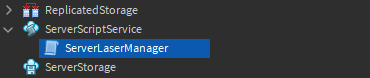

2. `LASER_DAMAGE`라는 변수를 선언하고 값을 **10** 또는 원하는 값으로 설정합니다.

3. **damageCharacter**라는 함수 이름으로 두 개의 매개변수 **playerFired**와 **characterToDamage**를 만듭니다.

4. 함수 내부에서 캐릭터의 Humanoid를 찾아 `LASER_DAMAGE`만큼 건강을 빼줍니다.

5. **DamageCharacter** 원격 이벤트를 Events 폴더에서 `damageCharacter` 함수에 연결합니다.

   ```lua
   local ReplicatedStorage = game:GetService("ReplicatedStorage")
   local eventsFolder = ReplicatedStorage.Events
   local LASER_DAMAGE = 10

   function damageCharacter(playerFired, characterToDamage)
       local humanoid = characterToDamage:FindFirstChildWhichIsA("Humanoid")
       if humanoid then
           -- 캐릭터의 건강 감소
           humanoid.Health -= LASER_DAMAGE
       end
   end

   -- 이벤트를 적절한 함수에 연결
   eventsFolder.DamageCharacter.OnServerEvent:Connect(damageCharacter)
   ```

6. 로컬 서버를 시작하여 2명의 플레이어로 블라스터를 테스트합니다. 다른 플레이어를 쏠 때, 그들의 건강이 `LASER_DAMAGE`에 할당된 값만큼 감소합니다.

## 다른 플레이어의 레이저 빔 렌더링

현재 레이저 빔은 무기를 발사한 클라이언트에서 생성되므로 해당 클라이언트만 레이저 빔을 볼 수 있습니다.

만약 레이저 빔이 서버에서 생성되면 모든 플레이어가 레이저 빔을 볼 수 있습니다. 그러나 클라이언트가 무기를 발사하고 서버가 발사 정보를 받는 사이에 약간의 **지연**이 발생할 것입니다. 이는 무기를 발사한 클라이언트가 무기를 활성화한 순간과 레이저 빔을 보는 순간 사이에 지연을 경험하게 하여, 무기가 느리게 작동하는 느낌을 줄 것입니다.

이 문제를 해결하기 위해 모든 클라이언트가 자신의 레이저 빔을 생성하도록 합니다. 이렇게 하면 무기를 발사하는 클라이언트는 즉시 레이저 빔을 볼 수 있습니다. 다른 클라이언트는 다른 플레이어가 발사한 순간과 빔이 나타나는 사이에 약간의 지연을 경험하게 됩니다. 이것이 최선의 시나리오입니다. 한 클라이언트의 레이저를 다른 클라이언트에 더 빠르게 전달할 수 있는 방법은 없습니다.

### 발사한 클라이언트

먼저, 클라이언트는 레이저를 발사했음을 서버에 알리고 끝 위치를 제공해야 합니다.

1. ReplicatedStorage의 Events 폴더에 **RemoteEvent**를 삽입하고 이름을 **LaserFired**로 지정합니다.

   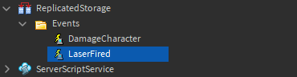

2. **ToolController** 스크립트에서 `fireWeapon` 함수를 찾습니다. 함수의 끝에서 **LaserFired** 원격 이벤트를 `hitPosition`을 인수로 사용하여 발사합니다.

   ```lua
           hitPosition = tool.Handle.Position + directionVector
       end

       timeOfPreviousShot = tick()

       eventsFolder.LaserFired:FireServer(hitPosition)
       LaserRenderer.createLaser(tool.Handle, hitPosition)
   end
   ```

### 서버

이제 서버는 클라이언트가 발사한 이벤트를 수신하고 모든 클라이언트에 레이저 빔의 시작 및 끝 위치를 알려야 합니다.

1. **ServerLaserManager** 스크립트에서 `damageCharacter` 위에 **playerFiredLaser**라는 이름의 함수를 생성하고 `playerFired`와 `endPosition`이라는 두 개의 매개변수를 추가합니다.

2. 함수를 **LaserFired** 원격 이벤트에 연결합니다.

   ```lua
   -- 모든 클라이언트에게 레이저가 발사되었음을 알려 레이저를 표시하게 합니다.
   local function playerFiredLaser(playerFired, endPosition)

   end
   ```

   ```lua
   -- 이벤트를 적절한 함수에 연결
   eventsFolder.DamageCharacter.OnServerEvent:Connect(damageCharacter)
   eventsFolder.LaserFired.OnServerEvent:Connect(playerFiredLaser)
   ```

서버는 레이저의 시작 위치가 필요합니다. 이는 클라이언트에서 전송될 수 있지만 가능한 한 클라이언트를 신뢰하지 않는 것이 좋습니다. 캐릭터의 무기 핸들 위치가 시작 위치이므로 서버는 거기에서 찾을 수 있습니다.

1. `playerFiredLaser` 함수 위에 `player`라는 매개변수를 가진 **getPlayerToolHandle** 함수를 만듭니다.

2. 아래 코드를 사용하여 플레이어의 캐릭터에서 무기를 검색하고 핸들 객체를 반환합니다.

   ```lua
   local LASER_DAMAGE = 10

   -- 플레이어가 들고 있는 도구의 핸들을 찾습니다.
   local function getPlayerToolHandle(player)
       local weapon = player.Character:FindFirstChildOfClass("Tool")
       if weapon then
           return weapon:FindFirstChild("Handle")
       end
   end

   -- 모든 클라이언트에게 레이저가 발사되었음을 알려 레이저를 표시하게 합니다.
   local function playerFiredLaser(playerFired, endPosition)
   ```

서버는 이제 **FireAllClients**를 **LaserFired** 원격 이벤트에서 호출하여 클라이언트에게 레이저를 렌더링하는 데 필요한 정보를 보낼 수 있습니다. 여기에는 레이저를 발사한 **플레이어**(이렇게 하면 해당 플레이어의 클라이언트가 레이저를 두 번 렌더링하지 않음), 레이저의 시작 위치로 작동하는 블라스터의 **핸들** 및 레이저의 끝 위치가 포함됩니다.

1. `playerFiredLaser` 함수에서 `playerFired`를 인수로 사용하여 `getPlayerToolHandle` 함수를 호출하고 값을 **toolHandle** 변수에 할당합니다.

2. **toolHandle**이 존재하면 `playerFired`, `toolHandle` 및 `endPosition`을 인수로 사용하여 모든 클라이언트에 LaserFired 이벤트를 발사합니다.

   ```lua
   -- 모든 클라이언트에게 레이저가 발사되었음을 알려 레이저를 표시하게 합니다.
   local function playerFiredLaser(playerFired, endPosition)
       local toolHandle = getPlayerToolHandle(playerFired)
       if toolHandle then
           eventsFolder.LaserFired:FireAllClients(playerFired, toolHandle, endPosition)
       end
   end
   ```

### 클라이언트에서 렌더링

이제 **FireAllClients**가 호출되었으므로 각 클라이언트는 레이저 빔을 렌더링하라는 서버의 이벤트를 수신합니다. 각 클라이언트는 앞서 사용한 **LaserRenderer** 모듈을 재사용하여 서버에서 보낸 도구의 핸들 위치와 끝 위치 값을 사용하여 레이저 빔을 렌더링할 수 있습니다. 처음에 레이저 빔을 발사한 플레이어는 이 이벤트를 무시해야 합니다. 그렇지 않으면 레이저가 두 번 보이게 됩니다.

1. StarterPlayerScripts에 **LocalScript**를 생성하고 이름을 **ClientLaserManager**로 설정합니다.

   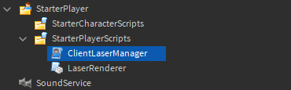

2. 스크립트 내부에서 **LaserRenderer** 모듈을 require 합니다.

3. `playerWhoShot`, `toolHandle` 및 `endPosition` 매개변수를 가진 **createPlayerLaser**라는 함수를 만듭니다.

4. 함수를 Events 폴더의 **LaserFired** 원격 이벤트에 연결합니다.

5. 함수 내에서 **if** 문을 사용하여 `playerWhoShot`이 LocalPlayer와 **같지 않은지** 확인합니다.

6. if 문 내에서 `toolHandle`과 `endPosition`을 인수로 사용하여 LaserRenderer 모듈의 `createLaser` 함수를 호출합니다.

   ```lua
   local Players = game:GetService("Players")
   local ReplicatedStorage = game:GetService("ReplicatedStorage")

   local LaserRenderer = require(script.Parent:WaitForChild("LaserRenderer"))

   local eventsFolder = ReplicatedStorage.Events

   -- 다른 플레이어의 레이저를 표시합니다.
   local function createPlayerLaser(playerWhoShot, toolHandle, endPosition)
       if playerWhoShot ~= Players.LocalPlayer then
           LaserRenderer.createLaser(toolHandle, endPosition)
       end
   end

   eventsFolder.LaserFired.OnClientEvent:Connect(createPlayerLaser)
   ```

7. 로컬 서버를 시작하여 2명의 플레이어로 블라스터를 테스트합니다. 두 클라이언트를 모니터의 양쪽에 위치시켜 두 창을 동시에 볼 수 있도록 합니다. 한 클라이언트에서 발사할 때 다른 클라이언트에서 레이저를 볼 수 있어야 합니다.

<video controls loop muted>
    <source src="../img/02_08_Hit_Detection_with_Lasers/Client-Laser-Communication-Video.mp4" />
</video>

## 사운드 효과

현재 발사 소리는 발사한 클라이언트에서만 재생됩니다. 다른 플레이어도 소리를 들을 수 있도록 코드를 이동해야 합니다.

1. **ToolController** 스크립트에서 **toolActivated** 함수로 이동하여 Activate 사운드를 재생하는 줄을 제거합니다.

   ```lua
    local function toolActivated()
        if canShootWeapon() then

            fireWeapon()
        end
    end
   ```

2. **LaserRenderer**의 `createLaser` 함수의 끝에서 **shootingSound**라는 변수를 선언하고 `toolHandle`의 `FindFirstChild()` 메서드를 사용하여 **Activate** 사운드를 찾습니다.

3. **if** 문을 사용하여 `shootingSound`가 존재하는지 확인하고, 존재하면 **Play** 함수를 호출합니다.

   ```lua
       laserPart.Parent = workspace

       -- Debris 서비스에 레이저 빔을 추가하여 제거 및 정리
       Debris:AddItem(laserPart, SHOT_DURATION)

       -- 무기의 발사 소리를 재생합니다.
       local shootingSound = toolHandle:FindFirstChild("Activate")
       if shootingSound then
           shootingSound:Play()
       end
  

    end
   ```

## 검증을 통한 원격 보안

서버가 들어오는 요청의 데이터를 확인하지 않으면 해커가 원격 함수와 이벤트를 악용하여 서버에 가짜 값을 보낼 수 있습니다. 이를 방지하기 위해 **서버 측 검증**을 사용하는 것이 중요합니다.

현재 형태로는 **DamageCharacter** 원격 이벤트가 매우 취약합니다. 해커는 이 이벤트를 사용하여 쏘지 않고도 게임 내에서 원하는 플레이어에게 피해를 입힐 수 있습니다.

검증은 서버로 전송되는 값이 현실적인지 확인하는 과정입니다. 이 경우 서버는 다음을 확인해야 합니다:

- 레이저가 맞은 위치와 플레이어 사이의 거리가 일정 범위 내에 있는지 확인합니다.
- 레이저를 발사한 무기와 맞은 위치 사이에 레이캐스트를 수행하여 총알이 벽을 통과하지 않았는지 확인합니다.

### 클라이언트

클라이언트는 레이캐스트가 맞은 위치를 서버에 보내야 하므로 서버가 거리가 현실적인지 확인할 수 있습니다.

1. **ToolController**에서 `fireWeapon` 함수의 DamageCharacter 원격 이벤트가 발사되는 줄로 이동합니다.

2. `hitPosition`을 인수로 추가합니다.

   ```lua
       if characterModel then
       local humanoid = characterModel:FindFirstChildWhichIsA("Humanoid")
       if humanoid then
           eventsFolder.DamageCharacter:FireServer(characterModel, hitPosition)
       end
   end
   ```

### 서버

클라이언트가 이제 DamageCharacter 원격 이벤트를 통해 추가 매개변수를 전송하고 있으므로 **ServerLaserManager**를 조정하여 이를 수락해야 합니다.

1. **ServerLaserManager** 스크립트에서 `damageCharacter` 함수에 `hitPosition` 매개변수를 추가합니다.

   ```lua
   function damageCharacter(playerFired, characterToDamage, hitPosition)
       local humanoid = characterToDamage:FindFirstChildWhichIsA("Humanoid")
       if humanoid then
           -- 캐릭터의 건강 감소
           humanoid.Health -= LASER_DAMAGE
       end
   end
   ```

2. `getPlayerToolHandle` 함수 아래에 `playerFired`, `characterToDamage` 및 `hitPosition`이라는 세 개의 매개변수를 가진 **isHitValid**라는 함수를 만듭니다.

   ```lua
   end

   local function isHitValid(playerFired, characterToDamage, hitPosition)

   end
   ```

첫 번째 검사는 맞은 위치와 맞은 캐릭터 사이의 거리입니다.

1. 스크립트 상단에 **MAX_HIT_PROXIMITY**라는 변수를 선언하고 값을 **10**으로 설정합니다. 이는 맞은 위치와 캐릭터 사이의 최대 허용 거리가 됩니다. 클라이언트가 이벤트를 발사한 후 캐릭터가 약간 이동했을 수 있으므로 허용 오차가 필요합니다.

   ```lua
   local ReplicatedStorage = game:GetService("ReplicatedStorage")
   local eventsFolder = ReplicatedStorage.Events
   local LASER_DAMAGE = 10
   local MAX_HIT_PROXIMITY = 10
   ```

2. `isHitValid` 함수에서 캐릭터와 맞은 위치 사이의 거리를 계산합니다. 거리가 `MAX_HIT_PROXIMITY`보다 크면 **false**를 반환합니다.

   ```lua
   local function isHitValid(playerFired, characterToDamage, hitPosition)
       -- 맞은 위치와 맞은 캐릭터 사이의 거리 검증
       local characterHitProximity = (characterToDamage.HumanoidRootPart.Position - hitPosition).Magnitude
       if characterHitProximity > MAX_HIT_PROXIMITY then
           return false
       end
   end
   ```

두 번째 검사는 발사된 무기와 맞은 위치 사이의 레이캐스트입니다. 레이캐스트가 캐릭터가 아닌 객체를 반환하면 샷이 유효하지 않음을 나타내는 것입니다.

1. 이 검사를 수행하는 코드를 복사합니다. 함수 끝에서 **true**를 반환합니다. 함수가 끝까지 도달하면 모든 검사를 통과한 것입니다.

   ```lua
   local function isHitValid(playerFired, characterToDamage, hitPosition)
       -- 맞은 위치와 맞은 캐릭터 사이의 거리 검증
       local characterHitProximity = (characterToDamage.HumanoidRootPart.Position - hitPosition).Magnitude
       if characterHitProximity > 10 then
           return false
       end

       -- 벽을 통과하여 발사했는지 확인
       local toolHandle = getPlayerToolHandle(playerFired)
       if toolHandle then
           local rayLength = (hitPosition - toolHandle.Position).Magnitude
           local rayDirection = (hitPosition - toolHandle.Position).Unit
           local raycastParams = RaycastParams.new()
           raycastParams.FilterDescendantsInstances = {playerFired.Character}
           local rayResult = workspace:Raycast(toolHandle.Position, rayDirection * rayLength, raycastParams)

           -- 인스턴스가 맞았고 그것이 캐릭터의 자손이 아니면 샷을 무시합니다.
           if rayResult and not rayResult.Instance:IsDescendantOf(characterToDamage) then
               return false
           end
       end

       return true
   end
   ```

2. `damageCharacter` 함수에서 **validShot**이라는 변수를 선언하고, `isHitValid` 함수를 `playerFired`, `characterToDamage` 및 `hitPosition`이라는 세 개의 인수로 호출한 결과를 할당합니다.

3. 아래 if 문에서 **and** 연산자를 추가하여 `validShot`이 **true**인지 확인합니다.

   ```lua
   function damageCharacter(playerFired, characterToDamage, hitPosition)
       local humanoid = characterToDamage:FindFirstChildWhichIsA("Humanoid")
       local validShot = isHitValid(playerFired, characterToDamage, hitPosition)
       if humanoid and validShot then
           -- 캐릭터의 건강 감소
           humanoid.Health -= LASER_DAMAGE
       end
   end
   ```

이제 damageCharacter 원격 이벤트는 더 안전해졌으며 대부분의 플레이어가 이를 악용하는 것을 방지할 수 있습니다. 일부 악의적인 플레이어는 종종 검증을 우회하는 방법을 찾을 수 있습니다. 원격 이벤트를 안전하게 유지하는 것은 지속적인 노력이 필요합니다.

이제 레이저 블라스터가 완성되었으며, 레이캐스팅을 사용한 기본 히트 감지 시스템이 포함되어 있습니다. `사용자 입력 감지` 튜토리얼을 통해 레이저 블라스터에 재장전 동작을 추가하는 방법을 알아보거나, 재미있는 게임 맵을 만들어 다른 플레이어와 함께 레이저 블라스터를 사용해 보세요!

<video controls loop muted>
    <source src="../img/02_08_Hit_Detection_with_Lasers/Introduction-Video.mp4" />
</video>

## Final Code

### ToolController

```lua
local UserInputService = game:GetService("UserInputService")
local Players = game:GetService("Players")
local ReplicatedStorage = game:GetService("ReplicatedStorage")

local LaserRenderer = require(Players.LocalPlayer.PlayerScripts.LaserRenderer)

local tool = script.Parent
local eventsFolder = ReplicatedStorage.Events

local MAX_MOUSE_DISTANCE = 1000
local MAX_LASER_DISTANCE = 500
local FIRE_RATE  = 0.3
local timeOfPreviousShot = 0

-- Check if enough time has passed since previous shot was fired
local function canShootWeapon()
	local currentTime = tick()
	if currentTime - timeOfPreviousShot < FIRE_RATE then
		return false
	end
	return true
end

local function getWorldMousePosition()
	local mouseLocation = UserInputService:GetMouseLocation()

	-- Create a ray from the 2D mouse location
	local screenToWorldRay = workspace.CurrentCamera:ViewportPointToRay(mouseLocation.X, mouseLocation.Y)

	-- The unit direction vector of the ray multiplied by a maximum distance
	local directionVector = screenToWorldRay.Direction * MAX_MOUSE_DISTANCE

	-- Raycast from the roy's origin towards its direction
	local raycastResult = workspace:Raycast(screenToWorldRay.Origin, directionVector)

	if raycastResult then
		-- Return the 3D point of intersection
		return raycastResult.Position
	else
		-- No object was hit so calculate the position at the end of the ray
		return screenToWorldRay.Origin + directionVector
	end
end

local function fireWeapon()
	local mouseLocation = getWorldMousePosition()

	-- Calculate a normalised direction vector and multiply by laser distance
	local targetDirection = (mouseLocation - tool.Handle.Position).Unit

	-- The direction to fire the weapon, multiplied by a maximum distance
	local directionVector = targetDirection * MAX_LASER_DISTANCE

	-- Ignore the player's character to prevent them from damaging themselves
	local weaponRaycastParams = RaycastParams.new()
	weaponRaycastParams.FilterDescendantsInstances = {Players.LocalPlayer.Character}
	local weaponRaycastResult = workspace:Raycast(tool.Handle.Position, directionVector, weaponRaycastParams)

	-- Check if any objects were hit between the start and end position
	local hitPosition
	if weaponRaycastResult then
		hitPosition = weaponRaycastResult.Position

		-- The instance hit will be a child of a character model
		-- If a humanoid is found in the model then it's likely a player's character
		local characterModel = weaponRaycastResult.Instance:FindFirstAncestorOfClass("Model")
		if characterModel then
			local humanoid = characterModel:FindFirstChildWhichIsA("Humanoid")
			if humanoid then
				eventsFolder.DamageCharacter:FireServer(characterModel, hitPosition)
			end
		end
	else
		-- Calculate the end position based on maximum laser distance
		hitPosition = tool.Handle.Position + directionVector
	end

	timeOfPreviousShot = tick()

	eventsFolder.LaserFired:FireServer(hitPosition)
	LaserRenderer.createLaser(tool.Handle, hitPosition)
end

local function toolEquipped()
	tool.Handle.Equip:Play()
end

local function toolActivated()
	if canShootWeapon() then
		fireWeapon()
	end
end

tool.Equipped:Connect(toolEquipped)
tool.Activated:Connect(toolActivated)
```

### LaserRenderer

```lua
local LaserRenderer = {}

local Debris = game:GetService("Debris")

local SHOT_DURATION = 0.15 -- Time that the laser is visible for

-- Create a laser beam from a start position towards an end position
function LaserRenderer.createLaser(toolHandle, endPosition)
	local startPosition = toolHandle.Position

	local laserDistance = (startPosition - endPosition).Magnitude
	local laserCFrame = CFrame.lookAt(startPosition, endPosition) * CFrame.new(0, 0, -laserDistance / 2)

	local laserPart = Instance.new("Part")
	laserPart.Size = Vector3.new(0.2, 0.2, laserDistance)
	laserPart.CFrame  = laserCFrame
	laserPart.Anchored = true
	laserPart.CanCollide = false
	laserPart.Color = Color3.fromRGB(255, 0, 0)
	laserPart.Material = Enum.Material.Neon
	laserPart.Parent = workspace

	-- Add laser beam to the Debris service to be removed & cleaned up
	Debris:AddItem(laserPart, SHOT_DURATION)

	-- Play the weapon's shooting sound
	local shootingSound = toolHandle:FindFirstChild("Activate")
	if shootingSound then
		shootingSound:Play()
	end
end

return LaserRenderer

```

### ServerLaserManager

```lua
local ReplicatedStorage = game:GetService("ReplicatedStorage")
local eventsFolder = ReplicatedStorage.Events
local LASER_DAMAGE = 10
local MAX_HIT_PROXIMITY = 10

-- Find the handle of the tool the player is holding
local function getPlayerToolHandle(player)
	local weapon = player.Character:FindFirstChildOfClass("Tool")
	if weapon then
		return weapon:FindFirstChild("Handle")
	end
end

local function isHitValid(playerFired, characterToDamage, hitPosition)
	-- Validate distance between the character hit and the hit position
	local characterHitProximity = (characterToDamage.HumanoidRootPart.Position - hitPosition).Magnitude
	if characterHitProximity > MAX_HIT_PROXIMITY then
		return false
	end

	-- Check if shooting through walls
	local toolHandle = getPlayerToolHandle(playerFired)
	if toolHandle then
		local rayLength = (hitPosition - toolHandle.Position).Magnitude
		local rayDirection = (hitPosition - toolHandle.Position).Unit
		local raycastParams = RaycastParams.new()
		raycastParams.FilterDescendantsInstances = {playerFired.Character}
		local rayResult = workspace:Raycast(toolHandle.Position, rayDirection * rayLength, raycastParams)

		-- If an instance was hit that was not the character then ignore the shot
		if rayResult and not rayResult.Instance:IsDescendantOf(characterToDamage) then
			return false
		end
	end

	return true
end

-- Notify all clients that a laser has been fired so they can display the laser
local function playerFiredLaser(playerFired, endPosition)
	local toolHandle = getPlayerToolHandle(playerFired)
	if toolHandle then
		eventsFolder.LaserFired:FireAllClients(playerFired, toolHandle, endPosition)
	end
end

function damageCharacter(playerFired, characterToDamage, hitPosition)
	local humanoid = characterToDamage:FindFirstChildWhichIsA("Humanoid")
	local validShot = isHitValid(playerFired, characterToDamage, hitPosition)
	if humanoid and validShot then
		-- Remove health from character
		humanoid.Health -= LASER_DAMAGE
	end
end

-- Connect events to appropriate functions
eventsFolder.DamageCharacter.OnServerEvent:Connect(damageCharacter)
eventsFolder.LaserFired.OnServerEvent:Connect(playerFiredLaser)
```

### ClientLaserManager

```lua
local Players = game:GetService("Players")
local ReplicatedStorage = game:GetService("ReplicatedStorage")

local LaserRenderer = require(Players.LocalPlayer.PlayerScripts:WaitForChild("LaserRenderer"))

local eventsFolder = ReplicatedStorage.Events

-- Display another player's laser
local function createPlayerLaser(playerWhoShot, toolHandle, endPosition)
	if playerWhoShot ~= Players.LocalPlayer then
		LaserRenderer.createLaser(toolHandle, endPosition)
	end
end

eventsFolder.LaserFired.OnClientEvent:Connect(createPlayerLaser)
```

---
## 출처
 - [Hit Detection with Lasers](https://create.roblox.com/docs/tutorials/scripting/intermediate-scripting/hit-detection-with-lasers)

---
## [다음](./03_01_Controlling_the_Users_Camera.md)