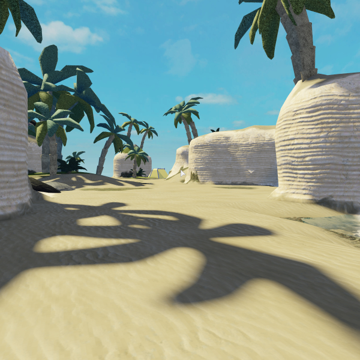
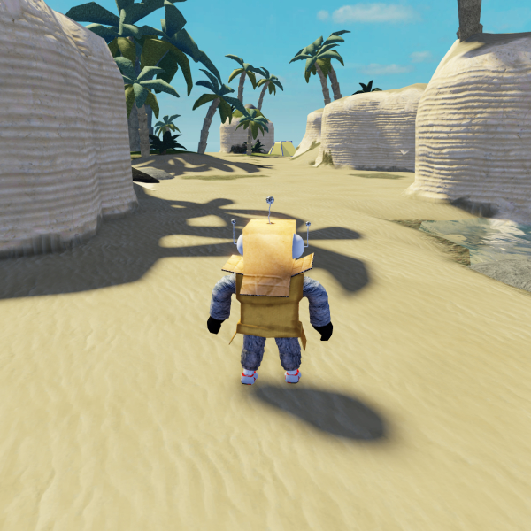
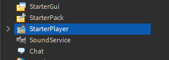
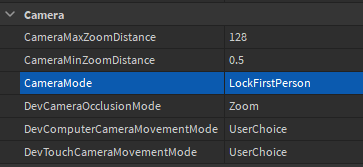
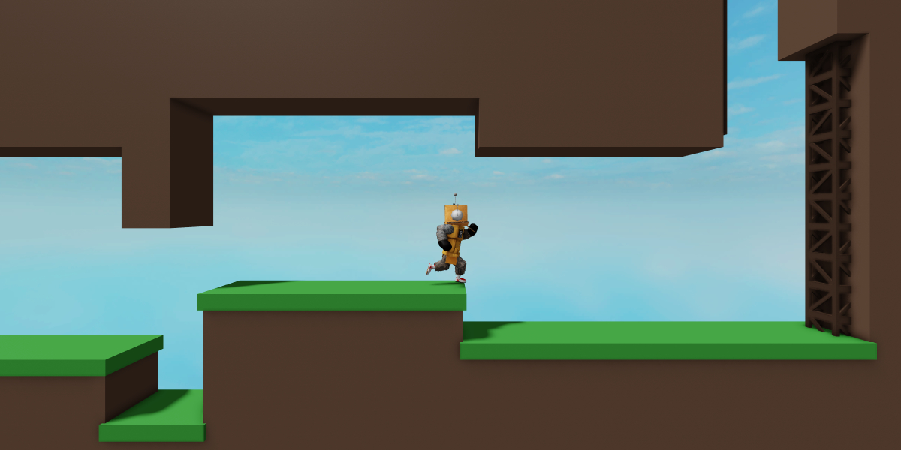
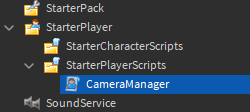
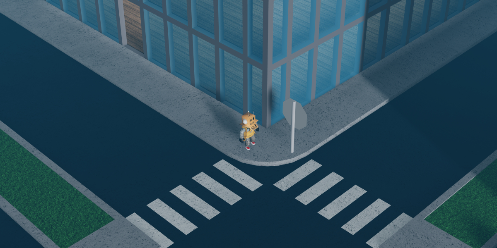
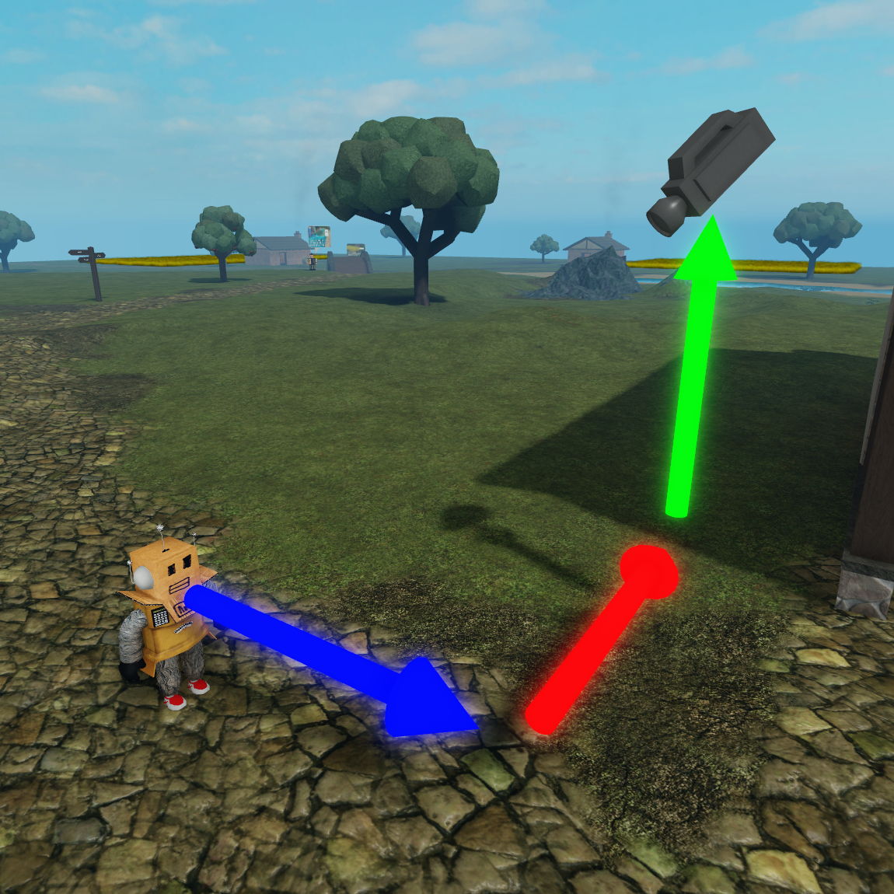

# Controlling the User's Camera

## 목차
- [Controlling the User's Camera](#controlling-the-users-camera)
  - [목차](#목차)
  - [1인칭 카메라 만들기](#1인칭-카메라-만들기)
  - [측면 스크롤링 카메라 만들기](#측면-스크롤링-카메라-만들기)
    - [카메라 스크립트 작성](#카메라-스크립트-작성)
    - [카메라 포인트 설정](#카메라-포인트-설정)
    - [카메라 위치 설정](#카메라-위치-설정)
    - [CurrentCamera 업데이트](#currentcamera-업데이트)
    - [카메라 동기화](#카메라-동기화)
  - [아이소메트릭 카메라 만들기](#아이소메트릭-카메라-만들기)
    - [위치 및 뷰 수정](#위치-및-뷰-수정)
  - [출처](#출처)
  - [다음](#다음)

---

사용자의 세계 관점은 `Camera` 객체로 나타납니다. 다양한 방식으로 카메라 동작을 변경하여 경험을 맞춤 설정할 수 있습니다. 예를 들어, 카메라는 몬스터가 지나갈 때 흔들리거나, 사용자의 캐릭터 옆에 고정되어 측면 스크롤러처럼 동작할 수 있습니다.

## 1인칭 카메라 만들기

1인칭 카메라는 카메라가 캐릭터의 머리에 고정되어 실제 생활에 더 가까운 시야를 제공합니다. 주로 슈팅 게임이나 스토리 기반 경험에서 사용자에게 몰입감을 주기 위해 사용됩니다.

<GridContainer numColumns="2">
  <figure>
    
    <figcaption>1인칭 카메라</figcaption>
  </figure>
  <figure>
    
    <figcaption>클래식 Roblox 카메라</figcaption>
  </figure>
</GridContainer>

Studio에서는 `StarterPlayer` 객체가 사용자의 카메라에 영향을 미치는 여러 속성을 포함합니다. **CameraMode** 속성은 카메라의 동작을 결정합니다.

1. **StarterPlayer**를 선택합니다.

   

2. CameraMode를 **LockFirstPerson**으로 변경합니다. 이렇게 하면 사용자의 카메라가 머리에서 떨어지지 않도록 고정됩니다.

   

3. 첫 번째 사람 카메라를 확인하기 위해 테스트를 실행합니다.

   <Alert severity ='warning'>

   테스트 중에 커서가 화면 중앙에 고정되면 <kbd>Escape</kbd> 키를 눌러 마우스를 해제하거나 <kbd>Shift</kbd><kbd>F5</kbd>를 눌러 테스트를 종료할 수 있습니다.
   </Alert>

## 측면 스크롤링 카메라 만들기

측면 스크롤링 뷰는 카메라를 캐릭터의 측면에 고정하여 세계에 2차원 느낌을 줍니다.



### 카메라 스크립트 작성

1. StarterPlayer를 확장하고 StarterPlayerScripts에 **LocalScript**를 추가하고 이름을 `CameraManager`로 지정합니다.

   

2. 스크립트 상단에 다음 코드 샘플을 복사하여 붙여넣어 **Players 서비스**를 가져오고, 새 변수에 로컬 사용자를 가져옵니다.

   ```lua
   local Players = game:GetService("Players")

   local player = Players.LocalPlayer
   ```

3. `updateCamera`라는 함수를 만듭니다. 이 함수는 카메라의 새 위치를 가져오고 설정하는 논리를 포함합니다.

   ```lua
   local Players = game:GetService("Players")

   local player = Players.LocalPlayer

   local function updateCamera()

   end
   ```

4. 함수 내에서 사용자의 캐릭터 모델을 가져오고 if 문을 사용하여 존재 여부를 확인합니다.

   ```lua
   local Players = game:GetService("Players")

   local player = Players.LocalPlayer

   local function updateCamera()
       local character = player.Character
       if character then

       end
   end
   ```

<Alert severity="info">
사용자만 자신의 카메라 구성을 볼 수 있으므로 항상 `Class.LocalScript`를 사용하여 제어해야 합니다.
</Alert>

### 카메라 포인트 설정

모든 캐릭터 모델에는 세계에서 캐릭터의 위치를 가져오는 데 사용할 수 있는 **HumanoidRootPart**라는 부품이 포함되어 있습니다. 이것은 카메라가 가리키는 위치를 설정합니다.

1. `FindFirstChild`를 사용하여 HumanoidRootPart를 가져오고 if 문을 사용하여 존재 여부를 확인합니다.

   ```lua
   local Players = game:GetService("Players")

   local player = Players.LocalPlayer

   local function updateCamera()
       local character = player.Character
       if character then
           local root = character:FindFirstChild("HumanoidRootPart")
           if root then

           end
       end
   end
   ```

2. HumanoidRootPart의 위치는 실제로 사용자의 머리에서 2 스터드 아래에 있습니다. 이를 수정하기 위해 새로운 `Datatype.Vector3`에 높이 **2 스터드**를 더하여 루트 위치에 추가합니다.

   ```lua
   local Players = game:GetService("Players")

   local player = Players.LocalPlayer

   local HEIGHT_OFFSET = 2

   local function updateCamera()
       local character = player.Character
       if character then
           local root = character:FindFirstChild("HumanoidRootPart")
           if root then
               local rootPosition = root.Position + Vector3.new(0, HEIGHT_OFFSET, 0)
           end
       end
   end
   ```

   <Alert severity="info">

   나중에 쉽게 조정할 수 있도록 개별 숫자를 변수로 분리합니다.
   </Alert>

### 카메라 위치 설정

카메라에도 위치가 필요합니다. 사용자의 뷰에 2D 측면 스크롤링 느낌을 주기 위해 카메라는 캐릭터의 측면을 직접 바라봐야 합니다. 카메라를 사용자의 옆에 배치하려면 `Datatype.Vector3`를 사용하여 카메라 위치의 **Z 축**에 깊이를 추가합니다.

```lua
local player = Players.LocalPlayer

local CAMERA_DEPTH = 24
local HEIGHT_OFFSET = 2

local function updateCamera()
    local character = player.Character
    if character then
        local root = character:FindFirstChild("HumanoidRootPart")
        if root then
            local rootPosition = root.Position + Vector3.new(0, HEIGHT_OFFSET, 0)
            local cameraPosition = Vector3.new(rootPosition.X, rootPosition.Y, CAMERA_DEPTH)
        end
    end
end
```

### CurrentCamera 업데이트

이제 카메라 위치와 카메라의 목표 위치에 대한 변수가 준비되었으므로, 카메라의 위치를 업데이트할 차례입니다. 사용자의 카메라는 Workspace의 `CurrentCamera` 속성을 통해 액세스할 수 있습니다. 카메라는 위치를 결정하는 `Datatype.CFrame` 속성을 가지고 있습니다.

`Datatype.CFrame.lookAt()`를 사용하여 카메라를 업데이트할 수 있습니다. 이 함수는 두 위치를 받아 첫 번째 위치에 위치하고 두 번째 위치를 가리키는 CFrame을 생성합니다. `Datatype.CFrame.lookAt()`을 사용하여 `cameraPosition`에 위치하고 `rootPosition`을 가리키는 CFrame을 생성합니다.

```lua
local player = Players.LocalPlayer
local camera = workspace.CurrentCamera

local CAMERA_DEPTH = 24
local HEIGHT_OFFSET = 2

local function updateCamera()
    local character = player.Character
    if character then
        local root = character:FindFirstChild("HumanoidRootPart")
        if root then
            local rootPosition = root.Position + Vector3.new(0, HEIGHT_OFFSET, 0)
            local cameraPosition = Vector3.new(rootPosition.X, rootPosition.Y, CAMERA_DEPTH)
            camera.CFrame = CFrame.lookAt(cameraPosition, rootPosition)
        end
    end
end
```

### 카메라 동기화

마지막 단계는 이 함수를 반복적으로 실행하여 카메라가 사용자와 동기화되도록 유지하는 것입니다. 사용자가 보는 이미지는 지속적으로 새로 고쳐집니다. 필요한 모든 계산을 수행하는 데 걸리는 순간을 **렌더 단계**라고 합니다.

`RunService:BindToRenderStep()`를 사용하면 세 개의 매개변수를 받아 함수를 각 프레임에 실행하도록 쉽게 만들 수 있습니다:

- `name` - 이 바인딩의 이름으로, 다른 함수와 이름이 충돌하지 않도록 고유해야 합니다.
- `priority` - 숫자가 클수록 우선 순위가 높아집니다. 이 함수는 Roblox의 기본 카메라 업데이트 후에 실행되어야 하므로 우선 순위는 내부 카메라의 RenderPriority보다 1단계 높게 설정됩니다.
- `function` - 렌더 단계에 바인딩할 함수입니다.

1. `RunService:BindToRenderStep()`를 사용하여 `updateCamera` 함수를 렌더 단계에 바인딩합니다.

   ```lua
   local Players = game:GetService("Players")
   local RunService = game:GetService("RunService")

   local player = Players.LocalPlayer
   local camera = workspace.CurrentCamera

   local CAMERA_DEPTH = 24
   local HEIGHT_OFFSET = 2

   local function updateCamera()
       local character = player.Character
       if character then
           local root = character:FindFirstChild("HumanoidRootPart")
           if root then
               local rootPosition = root.Position + Vector3.new(0, HEIGHT_OFFSET, 0)
               local cameraPosition = Vector3.new(rootPosition.X, rootPosition.Y, CAMERA_DEPTH)
               camera.CFrame = CFrame.lookAt(cameraPosition, rootPosition)
           end
       end
   end

   RunService:BindToRenderStep("SidescrollingCamera", Enum.RenderPriority.Camera.Value + 1, updateCamera)
   ```

2. 코드를 테스트합니다. <kbd>A</kbd> 및 <kbd>D</kbd> 키를 사용하여 캐릭터를 좌우로 이동합니다.

## 아이소메트릭 카메라 만들기

사용자의 위치를 가져오고 카메라의 위치를 매 프레임마다 업데이트하는 기본 구조는 **아이소메트릭 카메라**와 같은 다른 카메라 스타일에도 적용될 수 있습니다. 아이소메트릭 카메라는 사용자 캐릭터를 향해 고정된 각도로 약간 아래를 바라보는 3D 뷰입니다.



### 위치 및 뷰 수정

1. 이전 예제의 코드를 사용하여 `cameraPosition`을 모든 3차원에 동일한 양을 더하도록 수정합니다.

   

   ```lua
   local function updateCamera()
       local character = player.Character
       if character then
           local root = character:FindFirstChild("HumanoidRootPart")
           if root then
               local rootPosition = root.Position + Vector3.new(0, HEIGHT_OFFSET, 0)
               local cameraPosition = rootPosition + Vector3.new(CAMERA_DEPTH, CAMERA_DEPTH, CAMERA_DEPTH)
               camera.CFrame = CFrame.lookAt(cameraPosition, rootPosition)
           end
       end
   end

   RunService:BindToRenderStep("IsometricCamera", Enum.RenderPriority.Camera.Value + 1, updateCamera)
   ```

2. 카메라의 `FieldOfView` 속성을 변경하여 줌인/줌아웃을 시뮬레이션하면 시야가 더 평평해 보일 수 있습니다. `20` 값으로 설정하여 줌인하고, 사용자와의 거리를 늘려 보상을 줘보세요.

   ```lua
   local Players = game:GetService("Players")
   local RunService = game:GetService("RunService")

   local player = Players.LocalPlayer
   local camera = workspace.CurrentCamera

   local CAMERA_DEPTH = 64
   local HEIGHT_OFFSET = 2

   camera.FieldOfView = 20

   local function updateCamera()
   ```

카메라의 동작 방식을 변경하여 경험에 완전히 새로운 느낌을 줄 수 있습니다. 동일한 스크립트를 사용하여 탑다운 카메라를 구현할 수도 있습니다. 설정을 조정하여 원하는 결과를 얻어보세요!

---
## 출처
 - [Controlling the User's Camera](https://create.roblox.com/docs/tutorials/scripting/input-and-camera/controlling-the-users-camera)

---
## [다음](./03_02_Detecting_User_Input.md)