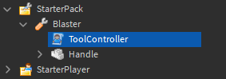

# Detecting User Input

## 목차
- [Detecting User Input](#detecting-user-input)
  - [목차](#목차)
  - [시작하기](#시작하기)
  - [액션 핸들러 만들기](#액션-핸들러-만들기)
  - [액션 바인딩](#액션-바인딩)
  - [액션 언바인딩](#액션-언바인딩)
  - [출처](#출처)
  - [다음](#다음)

---

사용자 입력을 동작에 연결하면 사용자에게 경험의 기능에 대한 더 나은 직관적인 제어를 제공합니다. 이 튜토리얼에서는 특정 키에 재장전 동작을 연결하는 방법을 배우게 됩니다.

<video controls loop muted>
	<source src="../img/03_02_Detecting_User_Input/ReloadingSymbol.mp4" />
</video>

## 시작하기

이 튜토리얼에서는 [플레이어 도구 만들기](./02_07_Creating_Player_Tools.md)에서 만든 **Blaster** 도구를 사용합니다. 해당 지침을 따라 도구를 만들거나 [Blaster](https://www.roblox.com/library/6571559694/Blaster) 모델을 다운로드하여 **StarterPack**에 삽입할 수 있습니다.

모델은 모든 경험에서 사용할 수 있도록 인벤토리에 추가할 수 있습니다. 경험에 모델을 추가하려면 다음 단계를 따르세요:

1. 브라우저에서 [모델](https://www.roblox.com/library/6571559694/Blaster) 페이지를 열고 **Get** 버튼을 클릭합니다. 이렇게 하면 모델이 인벤토리에 추가됩니다.
2. Studio에서 **View** 탭으로 이동하여 **Toolbox**를 클릭합니다.
3. Toolbox 창에서 **Inventory** 버튼을 클릭합니다. 그런 다음 드롭다운이 **My Models**로 설정되어 있는지 확인합니다.
4. **Blaster** 모델을 선택하여 경험에 추가합니다.

## 액션 핸들러 만들기

먼저, 사용자 입력이 감지되었을 때 처리할 함수를 만들어야 합니다.

1. Blaster 내의 **ToolController** `Class.LocalScript`를 엽니다.

   

2. 액션 이름을 저장할 변수를 만듭니다.

   ```lua
   local tool = script.Parent

   local RELOAD_ACTION = "reloadWeapon"

   local function toolEquipped()
   	tool.Handle.Equip:Play()
   end

   local function toolActivated()
   	tool.Handle.Activate:Play()
   end

   tool.Equipped:Connect(toolEquipped)
   tool.Activated:Connect(toolActivated)
   ```

3. `onAction`이라는 함수를 만들어 세 개의 인수(`actionName`, `inputState`, `inputObject`)를 받습니다. 이 함수는 사용자 입력이 감지되었을 때 실행되는 함수입니다.

   ```lua
   local tool = script.Parent

   local RELOAD_ACTION = "reloadWeapon"

   local function onAction(actionName, inputState, inputObject)

   end

   local function toolEquipped()
   	tool.Handle.Equip:Play()
   end
   ```

4. 함수 내에서 주어진 `actionName`이 재장전 액션 이름과 일치하는지 확인하고 `inputState`가 `UserInputState.Begin`인지 확인합니다. 이는 함수가 `inputState`가 변경될 때마다 실행되기 때문에 재장전은 한 번만 일어나야 하기 때문에 중요합니다.

   ```lua
   local function onAction(actionName, inputState, inputObject)
   	if actionName == RELOAD_ACTION and inputState == Enum.UserInputState.Begin then

   	end
   end
   ```

5. 사용자가 재장전할 때 이를 분명하게 하기 위해, 도구의 `BackpackItem.TextureId|TextureId`를 일시적으로 `"rbxassetid://6593020923"`로 변경한 후 원래 값인 `"rbxassetid://92628145"`로 되돌립니다.

   ```lua
   local function onAction(actionName, inputState, inputObject)
   	if actionName == RELOAD_ACTION and inputState == Enum.UserInputState.Begin then
   		tool.TextureId = "rbxassetid://6593020923"
   		task.wait(2)
   		tool.TextureId = "rbxassetid://92628145"
   	end
   end
   ```

## 액션 바인딩

`ContextActionService`를 사용하여 `BindAction` 함수를 통해 특정 입력에 함수를 **바인딩**할 수 있습니다. 이 함수는 여러 인수를 받습니다:

- 액션의 이름
- 액션을 처리할 함수(콜백이라고도 함)
- 터치스크린 버튼을 표시할지 여부
- 감지하고 액션과 연결할 `Enum.KeyCodes`의 수

KeyCodes는 키보드 키나 컨트롤러 버튼과 같은 다양한 입력 버튼을 나타내는 값입니다. 전체 코드 목록은 [`여기`](https://create.roblox.com/docs/reference/engine/enums/KeyCode)에서 확인할 수 있습니다.

1. 스크립트 상단에서 `ContextActionService`를 가져옵니다.

   ```lua
   local ContextActionService = game:GetService("ContextActionService")

   local tool = script.Parent

   local RELOAD_ACTION = "reloadWeapon"
   ```

2. `toolEquipped` 함수 내에서 `BindAction`을 호출하고 다음 인수를 전달합니다:

   - 액션 이름 (`RELOAD_ACTION`)
   - 액션 핸들러 (`onAction`)
   - 터치 버튼을 생성할 값 (`true`)
   - 감지할 키 입력 (`Enum.KeyCode.R`)

   ```lua
   local RELOAD_ACTION = "reloadWeapon"

   local function onAction(actionName, inputState, inputObject)
   	if actionName == RELOAD_ACTION and inputState == Enum.UserInputState.Begin then
   		tool.TextureId = "rbxassetid://6593020923"
   		task.wait(2)
   		tool.TextureId = "rbxassetid://92628145"
   	end
   end

   local function toolEquipped()
   	ContextActionService:BindAction(RELOAD_ACTION, onAction, true, Enum.KeyCode.R)
   	tool.Handle.Equip:Play()
   end
   ```

3. 도구를 장착하고 키보드에서 <kbd>R</kbd> 키를 눌러 재장전하는 기능을 테스트합니다. 배낭 아이콘이 잠시 동안 대기 기호로 변경되어 무기가 재장전 중임을 나타내야 합니다:

<video controls loop muted>
	<source src="../img/03_02_Detecting_User_Input/ReloadingSymbolZoomInOnly.mp4" />
</video>

## 액션 언바인딩

사용자가 도구를 장착 해제할 때, 도구가 장착되지 않은 상태에서 재장전을 할 수 없도록 액션을 **언바인딩**해야 합니다.

1. `toolUnequipped`라는 새 함수를 만들고, `Class.ContextActionService:UnbindAction()|UnbindAction`을 호출하여 액션 이름을 전달합니다.

   ```lua
   local function toolEquipped()
   	ContextActionService:BindAction(RELOAD_ACTION, onAction, true, Enum.KeyCode.R)
   	tool.Handle.Equip:Play()
   end

   local function toolUnequipped()
   	ContextActionService:UnbindAction(RELOAD_ACTION)
   end

   local function toolActivated()
   	tool.Handle.Activate:Play()
   end

   tool.Equipped:Connect(toolEquipped)
   tool.Activated:Connect(toolActivated)
   ```

2. `toolUnequipped` 함수를 `Unequipped` 이벤트에 연결하여 이벤트가 발생할 때 함수를 실행하도록 합니다.

   ```lua
   local ContextActionService = game:GetService("ContextActionService")

   local tool = script.Parent

   local RELOAD_ACTION = "reloadWeapon"

   local function onAction(actionName, inputState, inputObject)
   	if actionName == RELOAD_ACTION and inputState == Enum.UserInputState.Begin then
   		tool.TextureId = "rbxassetid://6593020923"
   		task.wait(2)
   		tool.TextureId = "rbxassetid://92628145"
   	end
   end

   local function toolEquipped()
   	ContextActionService:BindAction(RELOAD_ACTION, onAction, true, Enum.KeyCode.R)
   	tool.Handle.Equip:Play()
   end

   local function toolUnequipped()
   	ContextActionService:UnbindAction(RELOAD_ACTION)
   end

   local function toolActivated()
   	tool.Handle.Activate:Play()
   end

   tool.Equipped:Connect(toolEquipped)
   tool.Unequipped:Connect(toolUnequipped)
   tool.Activated:Connect(toolActivated)
   ```

3. 모든 기능이 올바르게 작동하는지 확인하기 위해 테스트합니다. 도구가 장착되었을 때 재장전할 수 있어야 하고, 장착 해제되었을 때는 재장전할 수 없어야 합니다.

<video controls loop muted>
	<source src="../img/03_02_Detecting_User_Input/ReloadingSymbol.mp4" />
</video>

이제 재장전 애니메이션이 완료되었습니다. 추가 도전 과제로, Blaster를 발사할 때마다 탄약 수를 줄이는 카운터를 추가해 보세요. 그런 다음 총알이 없을 때 `toolActivated` 함수를 비활성화하고 재장전 애니메이션이 완료되면 다시 활성화해 보세요.

---
## 출처
 - [Detecting User Input](https://create.roblox.com/docs/tutorials/scripting/input-and-camera/detecting-user-input)

---
## [다음](./04_01_Improving_Improving_Battle_Royale_Project.md)