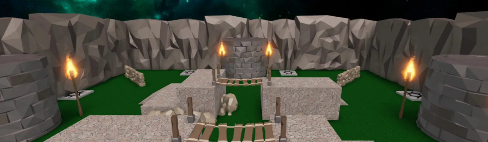
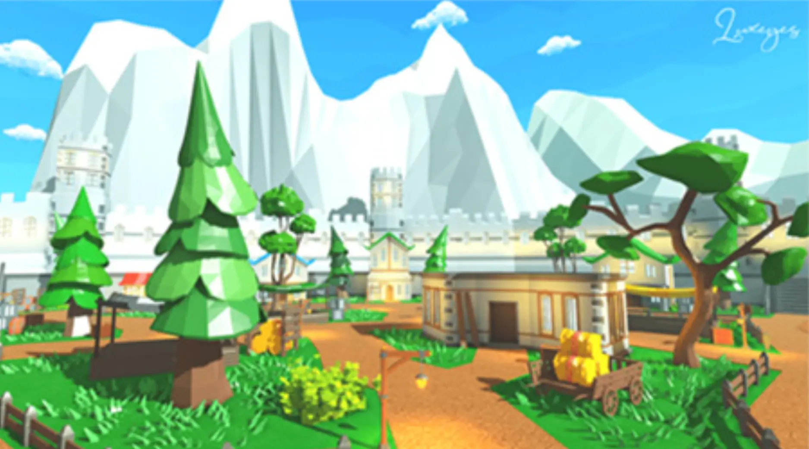
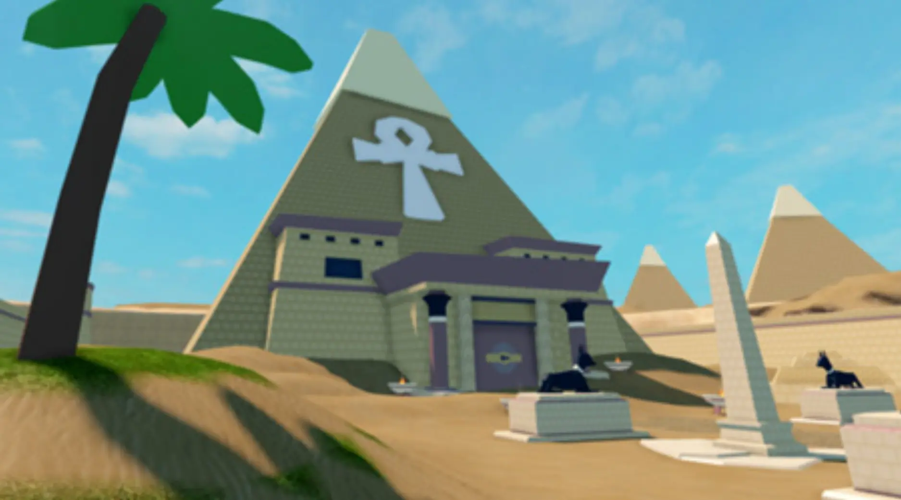

# Improving Battle Royale Project

## 목차
- [Improving Battle Royale Project](#improving-battle-royale-project)
  - [목차](#목차)
  - [선택적 개선 사항](#선택적-개선-사항)
    - [맵 비주얼 개선](#맵-비주얼-개선)
    - [포스 필드 변경](#포스-필드-변경)
    - [플레이 테스트 및 변수 확인](#플레이-테스트-및-변수-확인)
    - [소셜 로비 만들기](#소셜-로비-만들기)
  - [선택적 도전 과제](#선택적-도전-과제)
    - [트랩](#트랩)
    - [점수 추적](#점수-추적)
    - [파워업](#파워업)
    - [더 많은 아레나 추가](#더-많은-아레나-추가)
  - [자유롭게 배운 기능들을 적용하여 보세요](#자유롭게-배운-기능들을-적용하여-보세요)
  - [참고자료](#참고자료)
  - [출처](#출처)

---

지난주 우리는 멀티플레이어 배틀 로얄을 만들었습니다! 이 시리즈를 통해 다음을 수행했습니다:

- 플레이어를 텔레포트하는 것과 같은 다양한 게임 기능을 처리하는 모듈형 스크립트를 만들었습니다.
- 매치의 시작과 끝을 위한 사용자 정의 이벤트를 코딩하는 방법을 배웠습니다.
- 플레이어가 게임에 참가하거나 승리하거나 떠날 때 관리를 위한 배열을 사용했습니다.

하지만, 아직 게임이 다른 사람들이 플레이하기에는 완벽하지 않습니다. 아레나를 독특하게 만들고 눈에 띄는 썸네일을 만들어 플레이어를 끌어들여 보세요.

## 선택적 개선 사항

아래는 경험을 개선할 수 있는 몇 가지 방법입니다.



### 맵 비주얼 개선

시각적으로 흥미로운 맵은 게임의 첫인상을 강하게 만들어 사람들이 게임을 시작하게 합니다. 그레이박스 수준을 실제 맵으로 전환하는 데 시간을 할애하세요.

이 시리즈의 시작 부분에서 게임의 설정을 설명하는 글을 작성한 것을 기억하시나요? 맵을 빌드할 때 맵이 명확한 설정을 갖추고 있는지 확인하세요. 영감을 얻기 위해 아래는 Roblox 개발자가 만든 몇 가지 예시 맵입니다.

<GridContainer numColumns="2">
  <figure>
    
    <figcaption>Luxeyes의 맵</figcaption>
  </figure>
  <figure>
    
    <figcaption>Jandel의 맵</figcaption>
  </figure>
</GridContainer>

스튜디오에서 직접 빌드하거나 미리 만들어진 에셋을 사용할 수 있습니다. 아래는 Roblox에서 업로드한 환경을 구축하는 데 사용할 수 있는 몇 가지 추천 에셋입니다. 각 팩에는 고품질의 완전히 텍스처링된 모델이 포함되어 있습니다.

- <a href="https://www.roblox.com/library/6933438443/Synty-Nature-Pack" target="_blank" rel="noopener">Synty Nature Pack</a>
- <a href="https://www.roblox.com/library/6933556508/Synty-City-Pack" target="_blank" rel="noopener">Synty City Pack</a>
- <a href="https://www.roblox.com/library/6934021345/" target="_blank" rel="noopener">Synty Dungeon Pack: Cave & Castle Interiors</a>

### 포스 필드 변경

게임 중 플레이어가 리스폰할 때 포스 필드를 본 적이 있을 것입니다. 스폰 위치 속성에서 포스 필드 지속 시간을 변경할 수 있습니다.

1. 해당 스폰 위치를 클릭합니다.
2. 속성 > Forcefield에서 지속 시간 값을 변경합니다.

### 플레이 테스트 및 변수 확인

성공적인 Roblox 게임은 재미있고 공정한 게임 플레이를 보장하기 위해 자주 플레이 테스트를 거칩니다.

친구들과 게임을 플레이 테스트하고 다음을 확인하세요:

- 매치의 지속 시간이 적절한가요? 승리한 플레이어 없이 너무 빨리 끝나나요, 아니면 너무 오래 걸리나요?
- 맵의 크기가 적절한가요? 너무 비어 있는 영역이 있나요? 다른 플레이어를 만나기까지 오래 걸리나요?

테스트, 평가 및 변수를 수정하여 게임 플레이를 개선하세요. 몇 가지 예시:

- `GameSettings.matchDuration`을 변경하여 더 큰 맵에서 매치를 더 길게 만듭니다.
- 플레이어가 갑작스럽다고 느끼면 인터미션 시간을 더 길게 만듭니다.

### 소셜 로비 만들기

Roblox의 인기 게임은 종종 인터미션 동안 플레이어가 즐겁고 사교적일 수 있도록 미니 게임을 추가합니다. 이것은 물리학이 적용된 구체 파트를 넣거나 미니 장애물 코스를 추가하는 것을 포함할 수 있습니다.

## 선택적 도전 과제

많은 Roblox 경험은 출시 후에도 계속 업데이트됩니다. 아래는 프로젝트에 새로운 기능을 추가할 수 있는 몇 가지 선택적 도전 과제입니다.

### 트랩

플레이어에게 도전 과제를 추가하기 위해 트랩이나 장애물을 추가합니다.

### 점수 추적

라운드에서 승리한 횟수를 추적하는 리더보드를 만듭니다. 리더보드에 대한 이 기사를 사용하여 코딩하세요: <a href="https://developer.roblox.com/articles/Leaderboards" target="_blank" rel="noopener">리더보드</a>.

### 파워업

플레이어의 속도나 도구의 공격력을 변경하는 스크립트된 파트를 만듭니다. 매치가 끝난 후, `resetMatch()`를 사용하여 파워업 세트를 다시 생성하세요. 참고로, [파워업](https://create.roblox.com/docs/ko-kr/tutorials/fundamentals/coding-3/powerups-with-if-statements) 튜토리얼에서 자세히 알아보세요.

### 더 많은 아레나 추가

다양한 설정으로 더 많은 아레나를 만들고 랜덤화된 맵 선택을 코딩합니다. 플레이어가 매치를 시작할 때마다 MapManager라는 모듈 스크립트가 랜덤 맵을 선택하고 필요한 경우 해당 스폰 위치에 플레이어를 할당합니다. 힌트가 필요하거나 구현을 보고 싶다면 아래 코드 상자를 확인하세요.

```lua
--[[
설정 노트:
1. Workspace에 Maps라는 폴더를 만듭니다. 맵의 모든 파트를 개별 폴더에 저장합니다.
2. 각 개별 맵에 SpawnLocations이라는 폴더를 포함시킵니다.
3. 매치를 시작할 때 pickNewMap()을 사용하여 랜덤 맵을 얻습니다. 플레이어 스폰 포인트를 할당할 때
	GetSpawnLocations()를 사용하여 모든 위치가 있는 테이블을 얻습니다.
]]

local MapManager = {}

local mapsFolder = workspace.Maps
-- 회전할 수 있는 모든 맵을 저장합니다.
local availableMaps = mapsFolder:GetChildren()

-- 현재 플레이 중인 맵을 저장합니다.
local activeMap

-- 랜덤 맵을 얻는 데 사용됩니다.
local randomGenerator = Random.new()

-- 사용 가능한 맵 테이블에서 랜덤 맵을 가져옵니다.
function MapManager.pickNewMap()
	local whichMapKey = randomGenerator:NextInteger(1,#availableMaps)
	activeMap = availableMaps[whichMapKey]
	print("New map: " .. activeMap.Name)
end

-- 맵의 현재 스폰 포인트를 포함하는 테이블을 반환합니다.
function MapManager.getSpawnLocations()
	local spawnPoints = activeMap:FindFirstChild("SpawnLocations")
	local availableSpawnPoints = spawnPoints:GetChildren()
	return availableSpawnPoints
end

return MapManager
```

## 자유롭게 배운 기능들을 적용하여 보세요

ex) sound 추가, 무기 추가, 회복 아이템, ...


## 참고자료

 - [Battle Royale Resource](https://create.roblox.com/docs/resources/battle-royale)
 - [Code Samples](https://create.roblox.com/docs/samples)

---
## 출처
 - [Improving Battle Royale Project](https://create.roblox.com/docs/ko-kr/education/battle-royale-series/finishing-the-project)
